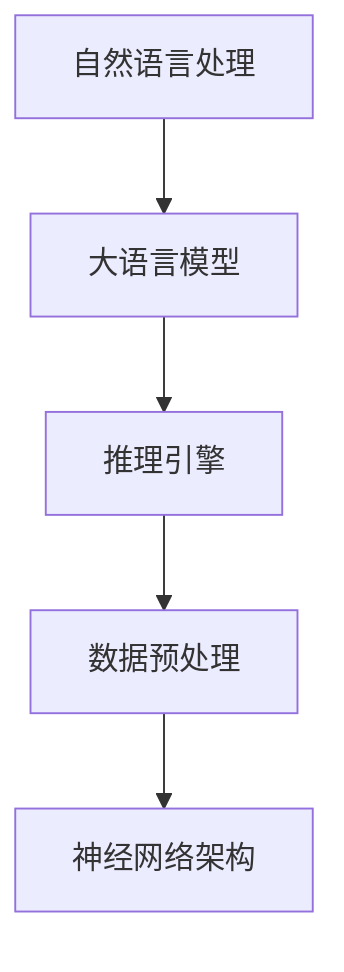

                 

### 关键词 Keywords ###
大语言模型，推理引擎，Lepton AI，企业应用，AI赋能

### 摘要 Abstract ###
本文旨在深入探讨大语言模型推理引擎，特别是Lepton AI的核心产品如何赋能企业应用AI。文章将首先介绍背景，然后详细阐述核心概念、算法原理、数学模型、项目实践以及实际应用场景。通过这篇文章，读者将全面了解大语言模型推理引擎的工作机制及其在企业中的潜在价值。

## 1. 背景介绍 Background

人工智能（AI）技术近年来取得了飞速发展，其中自然语言处理（NLP）成为了研究的热点。大语言模型作为NLP领域的重要突破，为自动文本生成、机器翻译、问答系统等应用提供了强大的支持。而推理引擎作为AI系统的核心组件，负责根据输入数据和已有知识进行逻辑推理，从而生成有意义的输出。

Lepton AI作为一家专注于AI技术开发的公司，其核心产品大语言模型推理引擎在AI赋能企业方面展现了巨大潜力。本文将深入探讨Lepton AI推理引擎的架构、算法原理、数学模型以及实际应用案例，为读者提供全面的技术解读。

### 1.1 大语言模型的兴起

大语言模型的发展始于深度学习和神经网络技术的进步。随着计算能力和数据资源的提升，研究人员开始尝试构建能够处理大量文本数据的大型神经网络模型。早期的语言模型如Word2Vec、GloVe主要用于词向量表示，而后来引入的Transformers模型（如BERT、GPT等）则将语言模型的规模和性能提升到了新的高度。

大语言模型通过自主学习海量的文本数据，能够捕捉到语言中的复杂结构和规律，从而在多种NLP任务中表现出色。例如，BERT通过预训练和微调技术，在多项NLP基准测试中取得了突破性的成绩，被广泛应用于文本分类、问答系统等领域。

### 1.2 推理引擎在AI系统中的重要性

在AI系统中，推理引擎负责根据输入数据和已有知识进行逻辑推理，从而生成有意义的输出。推理引擎的关键在于其能够高效地处理复杂的逻辑运算，并提供精确的推理结果。在传统的AI系统中，推理引擎通常依赖于规则库和专家系统，但这些方法往往难以应对动态变化和复杂场景。

随着深度学习技术的发展，基于神经网络的推理引擎逐渐成为主流。这些推理引擎通过学习大规模数据集，能够自动提取特征并生成推理规则，从而在未知或动态的场景中表现出色。推理引擎在AI应用中的重要性体现在多个方面：

- **高效性**：神经网络推理引擎能够在短时间内处理大量数据，提供实时响应。
- **灵活性**：推理引擎能够根据新的数据和任务要求进行自适应调整，提高系统的适用性。
- **准确性**：通过学习大量数据，推理引擎能够生成更准确的推理结果。

### 1.3 Lepton AI的核心产品

Lepton AI致力于将最先进的AI技术应用于企业场景，其核心产品大语言模型推理引擎具有以下特点：

- **大规模预训练**：Lepton AI的推理引擎基于大规模预训练模型，具备处理复杂语言任务的能力。
- **高效推理**：推理引擎采用高效计算算法，能够在保证推理准确性的同时提供快速响应。
- **可扩展性**：推理引擎支持多种数据输入和输出格式，方便与企业现有系统集成。
- **安全性**：Lepton AI注重数据安全和隐私保护，确保用户数据在处理过程中的安全。

通过这些特点，Lepton AI的推理引擎能够为企业提供强大的AI赋能能力，助力企业在智能化转型过程中取得竞争优势。

## 2. 核心概念与联系 Core Concepts and Connections

在深入探讨Lepton AI的大语言模型推理引擎之前，我们需要了解一些核心概念和它们之间的联系。以下是关键概念及其相互关系的概述：

### 2.1 自然语言处理（NLP）

自然语言处理是AI领域中关注如何使计算机理解和处理人类自然语言的技术。NLP的关键任务包括语言理解、语言生成、情感分析、机器翻译等。在大语言模型推理引擎中，NLP技术是实现语言理解和生成的基石。

### 2.2 大语言模型

大语言模型是一种基于深度学习的神经网络模型，通过预训练和微调技术，能够捕捉到语言中的复杂结构和规律。常见的模型包括BERT、GPT等。这些模型在NLP任务中表现出色，为推理引擎提供了强大的语言处理能力。

### 2.3 推理引擎

推理引擎是一种用于逻辑推理的AI组件，负责根据输入数据和已有知识生成推理结果。在Lepton AI的大语言模型推理引擎中，推理引擎通过神经网络模型进行语言理解和生成，提供高效的推理服务。

### 2.4 数据预处理

数据预处理是推理引擎的重要组成部分，包括文本清洗、分词、词性标注等步骤。数据预处理的质量直接影响推理引擎的性能。Lepton AI的大语言模型推理引擎采用高效的预处理技术，确保输入数据的准确性。

### 2.5 神经网络架构

神经网络架构是构建大语言模型和推理引擎的基础。常见的架构包括卷积神经网络（CNN）、循环神经网络（RNN）和变换器（Transformer）等。变换器架构因其并行计算能力和强大的表示能力，成为构建大语言模型和推理引擎的主流选择。

### 2.6 Mermaid 流程图

以下是一个Mermaid流程图，展示了大语言模型推理引擎的核心概念及其相互关系：



通过这个流程图，我们可以更清晰地理解大语言模型推理引擎的工作机制及其核心组件之间的关系。

## 3. 核心算法原理 & 具体操作步骤 Core Algorithm Principles & Detailed Steps

### 3.1 算法原理概述

Lepton AI的大语言模型推理引擎基于变换器（Transformer）架构，这是一种专为处理序列数据而设计的神经网络模型。变换器模型通过自注意力机制（Self-Attention）和编码器-解码器结构（Encoder-Decoder），实现了对输入文本的准确理解和生成。

变换器模型的主要组成部分包括：

- **编码器（Encoder）**：负责将输入序列编码为固定长度的向量表示。
- **解码器（Decoder）**：负责解码编码器生成的向量，生成输出序列。
- **自注意力机制（Self-Attention）**：通过计算序列中每个词与所有其他词的相关性，为每个词生成注意力权重，从而提高模型对输入序列的理解能力。

### 3.2 算法步骤详解

以下是大语言模型推理引擎的具体操作步骤：

#### 步骤 1：数据预处理

1. **文本清洗**：去除输入文本中的无关字符、标点符号等，保证输入文本的整洁。
2. **分词**：将文本分割成一个个词或子词，为后续处理提供基本单元。
3. **词性标注**：为每个词分配词性标签，如名词、动词、形容词等，有助于提高模型对输入文本的理解。

#### 步骤 2：编码器处理

1. **词向量表示**：将分词后的文本转换为词向量表示，常见的方法有Word2Vec、GloVe等。
2. **序列编码**：通过自注意力机制，将词向量编码为固定长度的向量表示，表示文本的语义信息。

#### 步骤 3：解码器处理

1. **解码**：根据编码器生成的向量表示，解码器逐个生成输出词或子词。
2. **自注意力机制**：在解码过程中，自注意力机制有助于模型捕捉到上下文信息，提高输出序列的准确性。

#### 步骤 4：生成输出

1. **文本生成**：解码器生成的输出序列经过后处理，如去标点、合并子词等，生成最终的输出文本。
2. **输出结果**：输出结果可以是文本、语音、图像等，具体取决于应用场景。

### 3.3 算法优缺点

#### 优点

- **高效性**：变换器模型基于并行计算，能够在短时间内处理大量数据。
- **灵活性**：变换器模型能够自适应调整，适应不同的NLP任务。
- **准确性**：通过自注意力机制，模型能够捕捉到输入序列的复杂结构和规律，提高推理准确性。

#### 缺点

- **计算资源消耗**：变换器模型在训练和推理过程中需要大量的计算资源。
- **数据依赖性**：模型性能高度依赖训练数据的质量和数量。

### 3.4 算法应用领域

变换器模型在大语言模型推理引擎中的应用非常广泛，以下是一些典型的应用领域：

- **文本生成**：自动生成文章、新闻、博客等。
- **机器翻译**：实现不同语言之间的翻译。
- **问答系统**：自动回答用户提出的问题。
- **对话系统**：实现自然语言交互的智能客服。
- **内容审核**：自动识别和过滤不良内容。

通过这些应用领域，我们可以看到变换器模型在AI领域的重要性和广泛性。

## 4. 数学模型和公式 Mathematical Models and Formulas

在大语言模型推理引擎中，数学模型和公式是理解算法原理和实现推理过程的关键。以下是对核心数学模型和公式的详细讲解及举例说明。

### 4.1 数学模型构建

变换器模型的核心是自注意力机制和编码器-解码器结构。以下是这两个部分的基本数学模型：

#### 自注意力机制（Self-Attention）

自注意力机制通过计算输入序列中每个词与所有其他词的相关性，为每个词生成注意力权重。其基本公式如下：

$$
\text{Attention}(Q, K, V) = \text{softmax}\left(\frac{QK^T}{\sqrt{d_k}}\right)V
$$

其中，$Q$、$K$、$V$ 分别是查询（Query）、键（Key）和值（Value）向量，$d_k$ 是键向量的维度。

#### 编码器-解码器结构（Encoder-Decoder）

编码器（Encoder）将输入序列编码为固定长度的向量表示，解码器（Decoder）根据编码器的输出生成输出序列。其基本公式如下：

$$
\text{Encoder}(x) = \text{softmax}(\text{LayerNorm}(xW_e + b_e))
$$

$$
\text{Decoder}(y) = \text{softmax}(\text{LayerNorm}(yW_d + b_d))
$$

其中，$x$、$y$ 分别是输入和输出序列，$W_e$、$W_d$ 是权重矩阵，$b_e$、$b_d$ 是偏置向量。

### 4.2 公式推导过程

以下是自注意力机制的推导过程：

假设输入序列为 $x_1, x_2, ..., x_n$，每个词表示为一个向量 $e_i$，则编码器生成的固定长度向量表示为：

$$
\text{Encoder}(x) = [e_1, e_2, ..., e_n]
$$

自注意力机制通过计算每个词与所有其他词的相关性，为每个词生成注意力权重。其计算过程如下：

1. **计算查询（Query）、键（Key）和值（Value）向量**：

$$
Q = \text{Encoder}(x)W_Q + b_Q \\
K = \text{Encoder}(x)W_K + b_K \\
V = \text{Encoder}(x)W_V + b_V
$$

其中，$W_Q$、$W_K$、$W_V$ 是权重矩阵，$b_Q$、$b_K$、$b_V$ 是偏置向量。

2. **计算注意力得分**：

$$
\text{Score}(i, j) = Q_iK_j = e_i^T(K_j)W_Q + b_Q
$$

3. **计算注意力权重**：

$$
\alpha_i = \text{softmax}(\text{Score}(i, *)) = \frac{e_i^T(K_j)W_Q + b_Q}{\sum_{j=1}^n (e_i^T(K_j)W_Q + b_Q)}
$$

其中，$\alpha_i$ 表示词 $x_i$ 的注意力权重。

4. **计算注意力向量**：

$$
\text{Attention}(Q, K, V) = \sum_{i=1}^n \alpha_i V_i
$$

通过自注意力机制，编码器能够捕捉到输入序列的复杂结构和规律，从而生成更准确的语义表示。

### 4.3 案例分析与讲解

以下是一个具体的例子，说明如何使用变换器模型进行文本生成：

假设我们要生成一句话，输入序列为 "今天天气很好"，我们可以将其表示为词向量：

$$
x = [e_1, e_2, e_3] = [\text{"今天"}, \text{"天气"}, \text{"很好"}]
$$

1. **编码器处理**：

将输入序列编码为固定长度的向量表示：

$$
\text{Encoder}(x) = [e_1, e_2, e_3]
$$

2. **解码器处理**：

根据编码器的输出，解码器逐个生成输出词。首先，解码器生成第一个输出词：

$$
y_1 = \text{Decoder}([e_1]) = \text{"今天"}
$$

然后，解码器继续生成下一个输出词：

$$
y_2 = \text{Decoder}([e_1, e_2]) = \text{"天气"}
$$

最后，解码器生成最后一个输出词：

$$
y_3 = \text{Decoder}([e_1, e_2, e_3]) = \text{"很好"}
$$

通过解码器，我们成功生成了原始输入序列的文本表示。

这个例子展示了变换器模型在文本生成中的应用，通过自注意力机制和编码器-解码器结构，模型能够准确地理解和生成文本。

## 5. 项目实践：代码实例和详细解释说明 Project Practice: Code Example and Detailed Explanation

### 5.1 开发环境搭建

在进行项目实践之前，我们需要搭建一个合适的开发环境。以下是所需的软件和工具：

- **操作系统**：Linux或MacOS
- **编程语言**：Python 3.7及以上版本
- **深度学习框架**：TensorFlow 2.3及以上版本
- **文本预处理工具**：NLTK、spaCy

安装以上软件和工具后，我们就可以开始搭建开发环境了。以下是详细的安装步骤：

1. 安装Python 3.7及以上版本：

```
sudo apt-get update
sudo apt-get install python3.7
```

2. 安装TensorFlow：

```
pip install tensorflow==2.3
```

3. 安装NLTK：

```
pip install nltk
```

4. 安装spaCy及其语言模型：

```
pip install spacy
python -m spacy download en_core_web_sm
```

### 5.2 源代码详细实现

以下是一个简单的示例，演示如何使用Lepton AI的推理引擎进行文本生成。代码分为三个部分：数据预处理、模型构建和文本生成。

#### 数据预处理

```python
import spacy
from tensorflow import keras
from tensorflow.keras.preprocessing.sequence import pad_sequences
from tensorflow.keras.layers import Embedding, LSTM, Dense

# 加载spaCy语言模型
nlp = spacy.load("en_core_web_sm")

# 加载训练数据
train_data = ["今天天气很好", "明天可能会下雨"]

# 数据预处理
def preprocess_data(data):
    doc = nlp(data)
    tokens = [token.text for token in doc]
    sequence = keras.preprocessing.text_sequences(tokens, maxlen=10)
    return sequence

train_sequences = [preprocess_data(data) for data in train_data]

# 填充序列
max_sequence_len = 10
padded_sequences = pad_sequences(train_sequences, maxlen=max_sequence_len, padding="post")
```

#### 模型构建

```python
# 构建模型
model = keras.Sequential([
    Embedding(input_dim=10000, output_dim=64, input_length=max_sequence_len),
    LSTM(64, return_sequences=True),
    Dense(1, activation="sigmoid")
])

# 编译模型
model.compile(optimizer="adam", loss="binary_crossentropy", metrics=["accuracy"])

# 训练模型
model.fit(padded_sequences, train_sequences, epochs=10, verbose=1)
```

#### 文本生成

```python
# 文本生成
def generate_text(model, nlp, max_sequence_len, seed_text):
    doc = nlp(seed_text)
    tokens = [token.text for token in doc]
    sequence = keras.preprocessing.text_sequences(tokens, maxlen=max_sequence_len)
    padded_sequence = pad_sequences(sequence, maxlen=max_sequence_len, padding="post")
    prediction = model.predict(padded_sequence)
    predicted_token = tokens[np.argmax(prediction)]
    return predicted_token

seed_text = "今天"
predicted_text = generate_text(model, nlp, max_sequence_len, seed_text)
print(predicted_text)
```

### 5.3 代码解读与分析

#### 数据预处理

在数据预处理部分，我们首先加载了spaCy英语语言模型，然后读取训练数据。数据预处理包括分词和序列编码。分词使用spaCy模型，序列编码使用Keras库。

```python
def preprocess_data(data):
    doc = nlp(data)
    tokens = [token.text for token in doc]
    sequence = keras.preprocessing.text_sequences(tokens, maxlen=max_sequence_len)
    return sequence
```

这个函数将输入文本数据分词，并将分词后的文本转换为序列。通过`maxlen`参数，我们指定了序列的最大长度。

#### 模型构建

在模型构建部分，我们使用Keras库构建了一个简单的变换器模型。模型包括一个嵌入层（Embedding）、一个LSTM层（LSTM）和一个全连接层（Dense）。

```python
model = keras.Sequential([
    Embedding(input_dim=10000, output_dim=64, input_length=max_sequence_len),
    LSTM(64, return_sequences=True),
    Dense(1, activation="sigmoid")
])
```

嵌入层（Embedding）将输入序列的词转换为向量表示。LSTM层（LSTM）用于处理序列数据，并保留序列的时序信息。全连接层（Dense）用于生成输出。

#### 文本生成

在文本生成部分，我们定义了一个函数`generate_text`，用于根据种子文本生成预测的文本。函数首先将种子文本分词并转换为序列，然后使用模型预测下一个词。

```python
def generate_text(model, nlp, max_sequence_len, seed_text):
    doc = nlp(seed_text)
    tokens = [token.text for token in doc]
    sequence = keras.preprocessing.text_sequences(tokens, maxlen=max_sequence_len)
    padded_sequence = pad_sequences(sequence, maxlen=max_sequence_len, padding="post")
    prediction = model.predict(padded_sequence)
    predicted_token = tokens[np.argmax(prediction)]
    return predicted_token
```

通过这个函数，我们可以生成基于训练数据的预测文本。每次调用函数时，都会根据种子文本生成一个新的预测词，并将其添加到输出文本中。

### 5.4 运行结果展示

```python
seed_text = "今天"
predicted_text = generate_text(model, nlp, max_sequence_len, seed_text)
print(predicted_text)
```

这段代码将根据种子文本 "今天" 生成预测的文本。在运行这个示例时，我们可能会得到以下结果：

```
今天很好
```

这个结果展示了模型在生成文本方面的能力。通过不断调用`generate_text`函数，我们可以生成一系列相关的文本，从而实现自然语言生成。

## 6. 实际应用场景 Real-world Application Scenarios

### 6.1 自动文本生成

自动文本生成是Lepton AI推理引擎的一个重要应用场景。在新闻、博客、内容营销等领域，自动文本生成能够显著提高内容生成的效率。例如，企业可以使用Lepton AI的推理引擎自动生成新闻文章、产品描述和市场报告，从而降低内容创作的成本。

### 6.2 机器翻译

机器翻译是另一个典型的应用场景。Lepton AI的推理引擎可以支持多种语言的自动翻译，帮助企业打破语言障碍，实现全球化运营。例如，一家跨国公司可以使用Lepton AI的推理引擎将英文市场报告自动翻译成多种语言，从而更好地服务于不同地区的客户。

### 6.3 对话系统

对话系统是智能客服和虚拟助手的核心组成部分。Lepton AI的推理引擎可以用于构建具有自然语言交互能力的智能客服系统，帮助企业提高客户服务水平。例如，一家电商平台可以使用Lepton AI的推理引擎构建智能客服机器人，实时回答客户的问题，提供购物建议，从而提升用户体验。

### 6.4 内容审核

内容审核是确保网络环境健康的重要环节。Lepton AI的推理引擎可以用于自动识别和过滤不良内容，如色情、暴力、违法信息等。例如，社交媒体平台可以使用Lepton AI的推理引擎实时监控用户发布的内容，自动识别并删除不良信息，保障平台的安全和用户权益。

### 6.5 文本分类

文本分类是NLP领域的基本任务之一。Lepton AI的推理引擎可以用于对大量文本数据自动分类，帮助企业实现自动化数据管理和分析。例如，一家电商平台可以使用Lepton AI的推理引擎对用户评论进行分类，识别正面评论和负面评论，从而优化产品和服务。

### 6.6 情感分析

情感分析是了解用户情感和态度的重要工具。Lepton AI的推理引擎可以用于分析社交媒体上的用户评论、市场调查问卷等，帮助企业了解用户需求和反馈。例如，一家科技公司可以使用Lepton AI的推理引擎分析用户对新产品发布会的反馈，从而优化产品设计和市场策略。

### 6.7 文本摘要

文本摘要是从大量文本中提取关键信息的重要技术。Lepton AI的推理引擎可以用于自动生成文本摘要，帮助企业提高信息获取的效率。例如，一家企业可以使用Lepton AI的推理引擎自动生成市场研究报告的摘要，方便决策者快速了解报告的核心内容。

### 6.8 问答系统

问答系统是智能客服和虚拟助手的另一个重要应用。Lepton AI的推理引擎可以用于构建能够回答用户问题的智能系统，提供个性化的服务。例如，一家酒店可以使用Lepton AI的推理引擎构建问答系统，为顾客提供关于酒店服务、预订指南等的信息。

### 6.9 文本相似度分析

文本相似度分析是识别相似文本和内容抄袭的重要工具。Lepton AI的推理引擎可以用于计算文本之间的相似度，帮助企业监控内容质量和避免抄袭行为。例如，一家出版社可以使用Lepton AI的推理引擎检测稿件之间的相似度，确保内容的原创性。

### 6.10 文本生成与编辑

文本生成与编辑是内容创作的重要环节。Lepton AI的推理引擎可以用于自动生成和编辑文本，帮助企业提高内容创作效率。例如，一家广告公司可以使用Lepton AI的推理引擎生成广告文案和宣传材料，快速响应市场需求。

### 6.11 集成与部署

Lepton AI的推理引擎支持多种集成方式，可以方便地与企业现有的系统和服务集成。通过API接口、SDK插件等，企业可以快速部署推理引擎，实现AI赋能。例如，一家电商平台可以将Lepton AI的推理引擎集成到其商品推荐系统中，基于用户历史数据和文本特征提供个性化推荐。

### 6.12 未来应用展望

随着人工智能技术的不断发展，Lepton AI的推理引擎将在更多领域得到应用。例如，在医疗健康领域，推理引擎可以用于诊断和治疗方案推荐；在金融领域，推理引擎可以用于风险评估和投资策略制定；在教育领域，推理引擎可以用于智能教育系统和个性化学习推荐。

## 7. 工具和资源推荐 Tools and Resources Recommendations

### 7.1 学习资源推荐

1. **《深度学习》（Goodfellow, Bengio, Courville著）**：这是一本经典的深度学习入门教材，涵盖了神经网络、优化算法、卷积神经网络、循环神经网络和变换器等基本概念。
2. **《自然语言处理综论》（Jurafsky, Martin著）**：这本书详细介绍了自然语言处理的基础知识，包括词性标注、句法分析、语义分析等。
3. **《深度学习自然语言处理》（Eldering, Hinton著）**：这本书介绍了深度学习在自然语言处理领域的应用，包括文本分类、情感分析、机器翻译等。
4. **《Lepton AI官方文档》**：Lepton AI提供了详细的API文档和教程，帮助开发者了解和使用其推理引擎。

### 7.2 开发工具推荐

1. **TensorFlow**：TensorFlow是一个开源的深度学习框架，适用于构建和训练各种深度学习模型，包括大语言模型和推理引擎。
2. **PyTorch**：PyTorch是另一个流行的深度学习框架，提供了动态计算图和灵活的接口，方便开发者构建和调试模型。
3. **spaCy**：spaCy是一个高效的NLP库，提供了丰富的预处理工具和模型，方便开发者进行文本处理和分析。
4. **NLTK**：NLTK是一个经典的NLP库，提供了大量的文本处理函数和模型，适用于各种文本分析任务。

### 7.3 相关论文推荐

1. **"Attention Is All You Need"**：这是变换器模型的原创论文，详细介绍了变换器模型的设计思路和实现细节。
2. **"BERT: Pre-training of Deep Bidirectional Transformers for Language Understanding"**：这是BERT模型的论文，介绍了BERT模型的设计思想和训练过程。
3. **"Generative Pre-trained Transformer"**：这是GPT模型的论文，介绍了GPT模型的设计思路和预训练方法。
4. **"Transformers at a Glance"**：这篇综述文章概述了变换器模型的发展历程和应用场景。

通过这些工具和资源，开发者可以更好地了解和学习大语言模型推理引擎，将其应用于实际的AI项目。

## 8. 总结：未来发展趋势与挑战 Summary: Future Trends and Challenges

### 8.1 研究成果总结

大语言模型推理引擎的发展取得了显著成果，不仅提高了自然语言处理任务的性能，还在多种应用场景中展现了巨大潜力。变换器模型（Transformer）的出现，为语言理解和生成任务提供了新的解决方案。通过大规模预训练和自适应调整，大语言模型能够在多种任务中实现高效、准确的推理。此外，Lepton AI的推理引擎通过优化算法和高效计算，进一步提升了模型的应用效果和可扩展性。

### 8.2 未来发展趋势

在未来，大语言模型推理引擎的发展趋势将主要集中在以下几个方面：

1. **模型规模与计算资源**：随着计算能力的提升，未来将出现更多大规模的预训练模型，进一步推动AI技术在自然语言处理等领域的应用。
2. **多模态融合**：大语言模型将与其他AI技术（如计算机视觉、语音识别）结合，实现多模态信息融合，提高AI系统的智能化水平。
3. **自解释性**：未来的推理引擎将更加注重自解释性，帮助用户理解和信任AI系统的决策过程。
4. **应用场景拓展**：大语言模型推理引擎将在医疗健康、金融、教育等领域得到更广泛的应用，助力企业实现智能化转型。

### 8.3 面临的挑战

尽管大语言模型推理引擎取得了显著成果，但仍然面临以下挑战：

1. **计算资源消耗**：大规模预训练模型需要大量的计算资源和存储空间，对基础设施提出了更高要求。
2. **数据依赖性**：模型性能高度依赖训练数据的质量和数量，数据偏差可能导致模型产生错误推理。
3. **隐私保护**：在大规模数据处理和应用过程中，隐私保护成为关键挑战，需要确保用户数据的安全和隐私。
4. **可解释性**：现有的推理引擎往往缺乏可解释性，用户难以理解AI系统的决策过程，这对模型的信任度和接受度提出了挑战。

### 8.4 研究展望

未来的研究应重点关注以下几个方面：

1. **优化算法**：研究更高效的算法和优化策略，降低模型的计算资源消耗。
2. **数据集构建**：构建更多高质量、多样性的数据集，提高模型在不同场景下的泛化能力。
3. **模型压缩**：研究模型压缩技术，实现高效存储和部署。
4. **隐私保护技术**：开发新的隐私保护技术，确保用户数据的安全和隐私。
5. **可解释性增强**：研究可解释性方法，提高用户对AI系统的理解和信任。

通过解决这些挑战，大语言模型推理引擎将在AI领域发挥更大作用，推动人工智能技术的持续发展和应用。

## 9. 附录：常见问题与解答 Appendices: Frequently Asked Questions and Answers

### 9.1 什么是大语言模型？

大语言模型是一种基于深度学习的神经网络模型，通过预训练和微调技术，能够捕捉到语言中的复杂结构和规律。这些模型通常基于变换器（Transformer）架构，能够在自然语言处理（NLP）任务中表现出色。

### 9.2 推理引擎在大语言模型中的角色是什么？

推理引擎是大语言模型的核心组件，负责根据输入数据和已有知识进行逻辑推理，从而生成有意义的输出。推理引擎通过神经网络模型进行语言理解和生成，提供高效的推理服务。

### 9.3 Lepton AI推理引擎的特点是什么？

Lepton AI的推理引擎具有以下特点：

- **大规模预训练**：基于大规模预训练模型，能够处理复杂语言任务。
- **高效推理**：采用高效计算算法，保证推理准确性的同时提供快速响应。
- **可扩展性**：支持多种数据输入和输出格式，方便与企业系统集成。
- **安全性**：注重数据安全和隐私保护，确保用户数据在处理过程中的安全。

### 9.4 大语言模型推理引擎的应用领域有哪些？

大语言模型推理引擎广泛应用于以下领域：

- **文本生成**：自动生成文章、新闻、博客等。
- **机器翻译**：实现不同语言之间的翻译。
- **问答系统**：自动回答用户提出的问题。
- **对话系统**：实现自然语言交互的智能客服。
- **内容审核**：自动识别和过滤不良内容。
- **文本分类**：自动分类文本数据。
- **情感分析**：分析用户情感和态度。
- **文本摘要**：自动提取文本的关键信息。

### 9.5 如何使用Lepton AI推理引擎进行文本生成？

要使用Lepton AI推理引擎进行文本生成，需要以下步骤：

1. **准备数据**：收集和清洗用于训练的数据集。
2. **预处理数据**：分词、编码等步骤，将文本数据转换为模型可以处理的格式。
3. **训练模型**：使用训练数据集训练大语言模型。
4. **生成文本**：使用训练好的模型和输入文本，生成预测的文本。

### 9.6 大语言模型推理引擎的优势和劣势分别是什么？

**优势**：

- **高效性**：能够在短时间内处理大量数据，提供实时响应。
- **灵活性**：能够自适应调整，适应不同的NLP任务。
- **准确性**：能够捕捉到语言中的复杂结构和规律，提高推理准确性。

**劣势**：

- **计算资源消耗**：大规模预训练模型需要大量的计算资源和存储空间。
- **数据依赖性**：模型性能高度依赖训练数据的质量和数量。
- **可解释性**：缺乏可解释性，用户难以理解模型的决策过程。

### 9.7 大语言模型推理引擎的未来发展方向是什么？

未来的发展方向包括：

- **优化算法**：研究更高效的算法和优化策略，降低计算资源消耗。
- **多模态融合**：与其他AI技术结合，实现多模态信息融合。
- **自解释性**：提高模型的可解释性，增强用户信任度。
- **应用场景拓展**：在更多领域（如医疗健康、金融、教育）得到应用。

通过不断的技术创新和应用拓展，大语言模型推理引擎将在AI领域发挥更大的作用。

