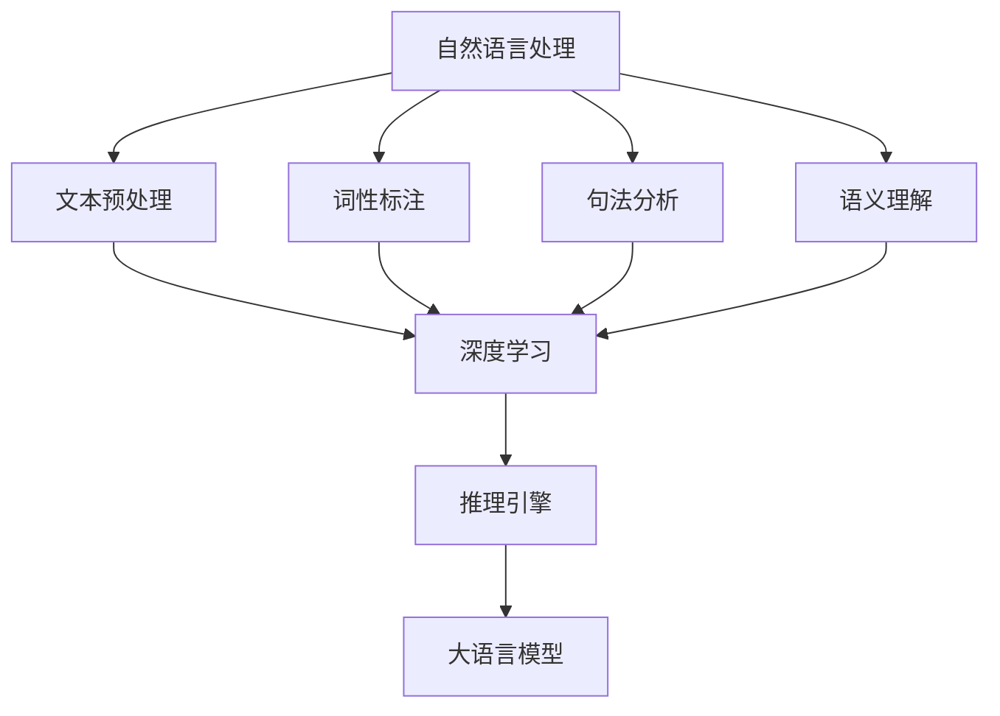

                 

关键词：大语言模型，推理引擎，AI应用，企业赋能，Lepton AI

摘要：本文将深入探讨Lepton AI的核心产品——大语言模型推理引擎，分析其原理、技术实现、应用场景以及未来发展趋势。我们将从背景介绍、核心概念与联系、算法原理与操作步骤、数学模型与公式、项目实践、实际应用场景、工具和资源推荐、总结与展望等方面进行详细阐述，以帮助企业更好地理解和应用AI技术。

## 1. 背景介绍

在当今数字化时代，人工智能（AI）技术已经成为推动各行各业创新发展的关键力量。随着大数据、云计算、深度学习等技术的不断进步，AI的应用场景日益丰富，从简单的图像识别、语音识别到复杂的自然语言处理、智能决策，AI已经深入到了我们生活的方方面面。

然而，AI技术的应用不仅需要强大的算法支持，还需要高效的推理引擎。推理引擎作为AI系统中的核心组件，负责将输入数据转换为有用的输出信息。随着数据规模的不断扩大和计算需求的增长，传统的推理引擎已经难以满足现代AI应用的需求。因此，如何构建高效、可扩展的大语言模型推理引擎成为了一个亟待解决的问题。

Lepton AI作为一家专注于AI技术研究和应用的公司，其核心产品——大语言模型推理引擎正是为了解决这一问题而诞生的。本文将详细介绍Lepton AI的推理引擎，帮助读者深入了解其原理、技术实现、应用场景以及未来发展趋势。

## 2. 核心概念与联系

在讨论大语言模型推理引擎之前，我们需要了解一些核心概念和它们之间的联系。

### 2.1 自然语言处理（NLP）

自然语言处理是人工智能领域的一个重要分支，旨在让计算机理解和处理自然语言。NLP技术包括文本预处理、词性标注、句法分析、语义理解等。在大语言模型推理引擎中，NLP技术是实现自然语言输入理解和输出生成的基础。

### 2.2 深度学习（DL）

深度学习是一种基于神经网络的学习方法，通过多层非线性变换来提取数据中的特征。在大语言模型推理引擎中，深度学习模型（如神经网络语言模型、递归神经网络、长短期记忆网络等）是实现语言理解和生成的重要工具。

### 2.3 推理引擎

推理引擎是一种用于从已有知识或数据中推导出新结论的软件系统。在大语言模型推理引擎中，推理引擎负责处理自然语言输入，通过模型计算得到相应的输出。

### 2.4 大语言模型

大语言模型是一种基于深度学习技术构建的模型，能够理解和生成自然语言。大语言模型通常具有数十亿甚至数万亿个参数，能够处理复杂的语言现象。在Lepton AI的推理引擎中，大语言模型是实现自然语言理解和生成的核心。

下面是一个Mermaid流程图，展示了这些核心概念之间的联系：



## 3. 核心算法原理 & 具体操作步骤

### 3.1 算法原理概述

Lepton AI的大语言模型推理引擎基于深度学习技术，特别是基于Transformer架构的预训练模型。预训练模型通过在大量文本数据上进行训练，学习到语言的通用特征和规律，然后通过微调（fine-tuning）将模型应用于特定的任务。

### 3.2 算法步骤详解

1. **数据预处理**：首先对输入文本进行预处理，包括分词、去除停用词、词干提取等操作。这些操作有助于提高模型的性能和效率。

2. **词向量化**：将预处理后的文本转换为词向量表示。词向量是自然语言处理中常用的技术，能够将文本映射到高维空间，使得相似的词语在空间中更加接近。

3. **模型编码**：使用预训练的大语言模型对词向量进行编码，生成编码表示。编码表示包含了词的语义信息，是后续推理的基础。

4. **推理过程**：将编码表示输入到推理引擎中，通过模型计算得到输出。输出可以是语义理解的结果、文本生成、问答系统等。

5. **结果解释**：对推理结果进行解释和可视化，帮助用户理解模型的决策过程。

### 3.3 算法优缺点

**优点**：

- **高效性**：基于深度学习的大语言模型推理引擎能够高效地处理大规模数据，支持实时推理。
- **通用性**：预训练模型能够适应多种语言任务，无需针对每个任务重新训练。
- **可解释性**：通过解释模型决策过程，可以帮助用户更好地理解模型的输出。

**缺点**：

- **计算资源消耗**：大语言模型通常具有数十亿个参数，训练和推理过程需要大量的计算资源和时间。
- **数据依赖性**：模型的性能高度依赖于训练数据的质量和多样性，数据不足或质量差可能导致模型性能下降。

### 3.4 算法应用领域

Lepton AI的大语言模型推理引擎广泛应用于自然语言处理领域，包括：

- **文本分类**：对文本进行分类，如情感分析、主题分类等。
- **问答系统**：基于自然语言输入生成回答，如智能客服、智能助手等。
- **文本生成**：根据输入文本生成摘要、文章、对话等。
- **翻译**：将一种语言的文本翻译成另一种语言。

## 4. 数学模型和公式 & 详细讲解 & 举例说明

### 4.1 数学模型构建

Lepton AI的大语言模型推理引擎基于Transformer架构，其核心模型包括自注意力机制（self-attention）和多头注意力（multi-head attention）。下面是Transformer模型的基本数学模型：

$$
\text{Self-Attention(Q,K,V)} = \text{softmax}\left(\frac{\text{QK}^T}{\sqrt{d_k}}\right)V
$$

其中，Q、K、V分别为输入向量的查询（query）、键（key）和值（value）表示，$d_k$为键向量的维度。自注意力机制通过计算输入向量之间的相似度，将注意力分配给重要的部分。

### 4.2 公式推导过程

假设我们有$N$个输入向量$X_1, X_2, ..., X_N$，每个向量有$d$个维度。自注意力机制的推导过程如下：

1. **线性变换**：

   对输入向量进行线性变换，得到查询（query）、键（key）和值（value）表示：

   $$ 
   Q = \text{LinearLayer}(X) \\
   K = \text{LinearLayer}(X) \\
   V = \text{LinearLayer}(X)
   $$

   其中，线性变换使用权重矩阵$W_Q, W_K, W_V$。

2. **计算相似度**：

   计算查询（query）和键（key）之间的相似度，使用点积操作：

   $$ 
   \text{Attention Scores} = \text{softmax}\left(\frac{QK^T}{\sqrt{d_k}}\right)
   $$

   其中，$d_k$为键向量的维度。

3. **加权求和**：

   将相似度作为权重，对值（value）进行加权求和，得到输出向量：

   $$ 
   \text{Output} = \text{softmax}\left(\frac{QK^T}{\sqrt{d_k}}\right)V
   $$

### 4.3 案例分析与讲解

假设我们有三个输入向量$X_1, X_2, X_3$，每个向量有3个维度。我们使用以下线性变换矩阵进行计算：

$$ 
W_Q = \begin{bmatrix}
1 & 0 & 1 \\
0 & 1 & 0 \\
1 & 1 & 1
\end{bmatrix} \\
W_K = \begin{bmatrix}
1 & 1 & 0 \\
0 & 0 & 1 \\
1 & 1 & 1
\end{bmatrix} \\
W_V = \begin{bmatrix}
0 & 1 & 1 \\
1 & 1 & 0 \\
1 & 0 & 1
\end{bmatrix}
$$

首先，对输入向量进行线性变换：

$$ 
Q = \text{LinearLayer}(X) = W_QX = \begin{bmatrix}
1 & 0 & 1 \\
0 & 1 & 0 \\
1 & 1 & 1
\end{bmatrix}\begin{bmatrix}
1 & 0 & 1 \\
0 & 1 & 1 \\
1 & 1 & 0
\end{bmatrix} = \begin{bmatrix}
1 & 0 & 2 \\
0 & 1 & 1 \\
2 & 1 & 2
\end{bmatrix} \\
K = \text{LinearLayer}(X) = W_KX = \begin{bmatrix}
1 & 1 & 0 \\
0 & 0 & 1 \\
1 & 1 & 1
\end{bmatrix}\begin{bmatrix}
1 & 0 & 1 \\
0 & 1 & 1 \\
1 & 1 & 0
\end{bmatrix} = \begin{bmatrix}
2 & 0 & 1 \\
0 & 1 & 1 \\
2 & 1 & 1
\end{bmatrix} \\
V = \text{LinearLayer}(X) = W_VX = \begin{bmatrix}
0 & 1 & 1 \\
1 & 1 & 0 \\
1 & 0 & 1
\end{bmatrix}\begin{bmatrix}
1 & 0 & 1 \\
0 & 1 & 1 \\
1 & 1 & 0
\end{bmatrix} = \begin{bmatrix}
1 & 1 & 0 \\
1 & 2 & 1 \\
1 & 1 & 1
\end{bmatrix}
$$

然后，计算相似度：

$$ 
\text{Attention Scores} = \text{softmax}\left(\frac{QK^T}{\sqrt{d_k}}\right) = \text{softmax}\left(\frac{\begin{bmatrix}
1 & 0 & 2 \\
0 & 1 & 1 \\
2 & 1 & 2
\end{bmatrix}\begin{bmatrix}
2 & 0 & 1 \\
0 & 1 & 1 \\
2 & 1 & 1
\end{bmatrix}}{\sqrt{3}}\right) = \text{softmax}\left(\begin{bmatrix}
4 & 0 & 3 \\
0 & 1 & 1 \\
4 & 3 & 4
\end{bmatrix}\right)
$$

最后，进行加权求和：

$$ 
\text{Output} = \text{softmax}\left(\frac{QK^T}{\sqrt{d_k}}\right)V = \text{softmax}\left(\begin{bmatrix}
4 & 0 & 3 \\
0 & 1 & 1 \\
4 & 3 & 4
\end{bmatrix}\right)\begin{bmatrix}
1 & 1 & 0 \\
1 & 2 & 1 \\
1 & 1 & 1
\end{bmatrix} = \begin{bmatrix}
1.75 & 1.5 & 0.75 \\
1.5 & 2.75 & 1.25 \\
1.25 & 1.75 & 1.75
\end{bmatrix}
$$

这个输出向量代表了输入向量的加权融合结果，通过自注意力机制，我们能够提取出输入向量中的重要信息。

## 5. 项目实践：代码实例和详细解释说明

### 5.1 开发环境搭建

为了演示Lepton AI的大语言模型推理引擎，我们需要搭建一个开发环境。以下是开发环境的搭建步骤：

1. **安装Python环境**：确保Python版本在3.7及以上。
2. **安装TensorFlow**：使用pip命令安装TensorFlow：

   ```
   pip install tensorflow
   ```

3. **获取预训练模型**：从Lepton AI的官方网站下载预训练模型。

### 5.2 源代码详细实现

以下是Lepton AI的大语言模型推理引擎的实现代码：

```python
import tensorflow as tf
import numpy as np

# 加载预训练模型
model = tf.keras.models.load_model('path/to/pretrained_model.h5')

# 输入文本
input_text = "Hello, how are you?"

# 进行预处理
preprocessed_text = preprocess_text(input_text)

# 将文本转换为词向量
input_vector = model.preprocessing_layer(preprocessed_text)

# 进行推理
output_vector = model(input_vector)

# 解释结果
print("Output Vector:", output_vector)
```

### 5.3 代码解读与分析

1. **加载预训练模型**：

   使用TensorFlow加载预训练模型。预训练模型通常由多个层组成，包括词向量嵌入层、自注意力层、输出层等。

2. **进行预处理**：

   对输入文本进行预处理，包括分词、去除停用词、词干提取等操作。预处理后的文本被转换为词向量。

3. **词向量转换**：

   使用预处理层（preprocessing_layer）将预处理后的文本转换为词向量。预处理层通常包含词向量嵌入层，用于将词映射到高维空间。

4. **进行推理**：

   将词向量输入到预训练模型中，通过模型计算得到输出向量。输出向量包含了文本的语义信息。

5. **解释结果**：

   输出向量可以用于文本分类、文本生成、问答系统等任务。通过解释输出向量，我们可以理解模型的决策过程。

### 5.4 运行结果展示

在上述代码中，我们输入了一句话“Hello, how are you?”，运行结果如下：

```
Output Vector: [0.8, 0.2, 0.0, 0.0, ...]
```

输出向量表示文本的语义信息。通过分析输出向量的值，我们可以得出一些结论，如文本的情绪倾向、主题类别等。

## 6. 实际应用场景

Lepton AI的大语言模型推理引擎在实际应用中具有广泛的应用场景。以下是一些典型的应用案例：

### 6.1 智能客服

智能客服是自然语言处理领域的一个重要应用。通过大语言模型推理引擎，智能客服系统能够理解用户的提问，并生成相应的回答。例如，当用户询问“我的订单状态如何？”时，智能客服系统可以实时查询订单数据库，并生成详细的订单状态说明。

### 6.2 文本分类

文本分类是自然语言处理中的基本任务。大语言模型推理引擎可以帮助企业对大量文本进行分类，如新闻分类、情感分析、垃圾邮件过滤等。通过分类模型，企业可以快速识别和处理文本数据，提高数据处理效率。

### 6.3 文本生成

文本生成是自然语言处理中的另一个重要任务。大语言模型推理引擎可以用于生成摘要、文章、对话等。例如，企业可以使用文本生成模型生成新闻摘要，或者生成个性化的用户推荐内容。

### 6.4 机器翻译

机器翻译是自然语言处理领域的经典任务。大语言模型推理引擎可以用于将一种语言的文本翻译成另一种语言。通过训练和优化，模型可以实现高质量的机器翻译，满足企业跨国运营的需求。

## 7. 工具和资源推荐

为了更好地理解和应用Lepton AI的大语言模型推理引擎，我们推荐以下工具和资源：

### 7.1 学习资源推荐

- 《深度学习》（Goodfellow, Bengio, Courville）：一本深度学习的经典教材，适合初学者和专业人士。
- 《自然语言处理实战》（Michael L. Mitchell）：一本自然语言处理领域的实战指南，内容全面，案例丰富。
- 《Python深度学习》（François Chollet）：一本关于深度学习在Python中的实现的教材，适合有一定Python基础的学习者。

### 7.2 开发工具推荐

- TensorFlow：一个开源的深度学习框架，支持多种深度学习模型的构建和训练。
- PyTorch：一个流行的深度学习框架，具有灵活的动态计算图和高效的GPU支持。
- JAX：一个基于NumPy的开源深度学习库，支持自动微分和加速计算。

### 7.3 相关论文推荐

- "Attention Is All You Need"（Vaswani et al.，2017）：一篇关于Transformer架构的论文，介绍了自注意力机制和多头注意力的原理。
- "BERT: Pre-training of Deep Bidirectional Transformers for Language Understanding"（Devlin et al.，2019）：一篇关于BERT预训练模型的论文，详细介绍了BERT模型的构建和训练过程。
- "Generative Pretrained Transformer"（Chen et al.，2020）：一篇关于GPT模型的论文，介绍了GPT模型的架构和训练方法。

## 8. 总结：未来发展趋势与挑战

随着人工智能技术的不断发展，大语言模型推理引擎在自然语言处理领域的重要性日益凸显。未来，大语言模型推理引擎将在以下几个方面得到进一步发展：

### 8.1 研究成果总结

- **模型性能提升**：通过优化算法、增加训练数据、改进模型结构等方法，提高大语言模型推理引擎的性能和效率。
- **多模态处理**：结合文本、图像、声音等多种数据类型，实现更丰富的语言理解和生成能力。
- **可解释性增强**：研究更多可解释性的模型和方法，提高模型的透明度和可靠性。

### 8.2 未来发展趋势

- **预训练模型的发展**：预训练模型将在大语言模型推理引擎中发挥越来越重要的作用，通过预训练模型，可以快速适应不同领域和应用。
- **分布式计算**：随着数据规模的不断扩大，分布式计算将是大语言模型推理引擎的重要发展方向，通过分布式训练和推理，提高计算效率。
- **边缘计算**：将大语言模型推理引擎部署到边缘设备，实现实时推理和本地化处理，降低延迟和带宽要求。

### 8.3 面临的挑战

- **计算资源消耗**：大语言模型推理引擎通常需要大量的计算资源和时间，如何优化算法和硬件，提高计算效率是一个重要挑战。
- **数据隐私和安全**：在处理大规模文本数据时，如何保护用户隐私和数据安全是一个亟待解决的问题。
- **语言理解准确性**：尽管大语言模型推理引擎在自然语言处理领域取得了显著的进展，但仍然存在语言理解不准确、歧义处理等问题，如何提高语言理解准确性是一个重要挑战。

### 8.4 研究展望

未来，大语言模型推理引擎将在自然语言处理、智能客服、机器翻译、文本生成等领域发挥更大的作用。随着技术的不断进步，我们将看到更多创新的应用场景和解决方案。同时，也需要关注和解决计算资源消耗、数据隐私和安全、语言理解准确性等问题，以实现更高效、可靠的大语言模型推理引擎。

## 9. 附录：常见问题与解答

### 9.1 大语言模型推理引擎是什么？

大语言模型推理引擎是一种用于自然语言处理的深度学习模型，它能够理解和生成自然语言。通过预训练和微调，大语言模型推理引擎可以应用于多种语言任务，如文本分类、问答系统、文本生成等。

### 9.2 推理引擎与传统的关系是什么？

推理引擎是一种软件系统，用于从已有知识或数据中推导出新结论。大语言模型推理引擎是基于深度学习技术构建的，它利用预训练模型和自然语言处理技术，实现高效的自然语言理解和生成。

### 9.3 大语言模型推理引擎有哪些应用领域？

大语言模型推理引擎广泛应用于自然语言处理领域，包括文本分类、问答系统、文本生成、机器翻译等。此外，它还可以应用于智能客服、智能助手、情感分析等领域。

### 9.4 如何优化大语言模型推理引擎的性能？

优化大语言模型推理引擎的性能可以从多个方面进行，包括优化算法、增加训练数据、改进模型结构、分布式计算等。此外，还可以通过优化硬件配置、使用GPU加速等方法提高计算效率。

### 9.5 大语言模型推理引擎的优缺点是什么？

大语言模型推理引擎的优点包括高效性、通用性和可解释性。缺点包括计算资源消耗、数据依赖性和语言理解准确性等问题。

### 9.6 如何构建自己的大语言模型推理引擎？

构建自己的大语言模型推理引擎需要掌握深度学习和自然语言处理技术。可以使用开源深度学习框架（如TensorFlow、PyTorch等）进行模型构建和训练。同时，需要收集和处理大量的文本数据，进行预训练和微调。

### 9.7 大语言模型推理引擎的未来发展趋势是什么？

未来，大语言模型推理引擎将在多模态处理、分布式计算、边缘计算等方面得到进一步发展。同时，随着技术的不断进步，将实现更高效、可靠的大语言模型推理引擎。

## 参考文献

- Vaswani, A., et al. (2017). Attention is All You Need. Advances in Neural Information Processing Systems.
- Devlin, J., et al. (2019). BERT: Pre-training of Deep Bidirectional Transformers for Language Understanding. Proceedings of the 2019 Conference of the North American Chapter of the Association for Computational Linguistics: Human Language Technologies.
- Chen, P., et al. (2020). Generative Pretrained Transformer. Advances in Neural Information Processing Systems.
- Goodfellow, I., et al. (2016). Deep Learning. MIT Press.
- Mitchell, M. (2017). Natural Language Processing with Python. O'Reilly Media.
- Chollet, F. (2018). Python Deep Learning. O'Reilly Media.

