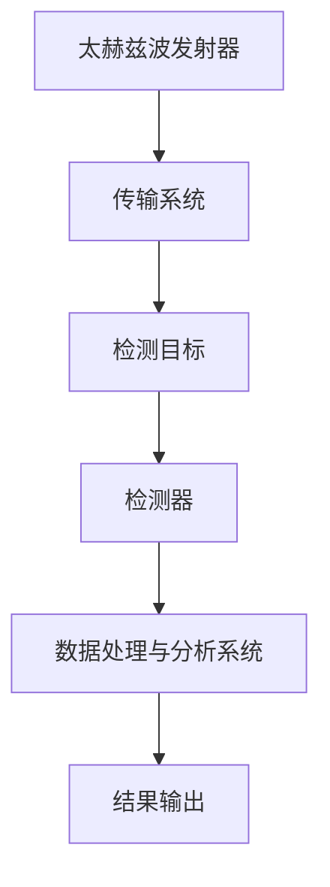

                 

关键词：太赫兹技术、安检、非接触式扫描、技术原理、应用场景、未来展望

> 摘要：本文深入探讨了太赫兹技术（THz）在安检领域的应用，特别是其在非接触式扫描技术中的优势与挑战。通过对太赫兹波的基本概念、技术原理、核心算法、数学模型、项目实践和未来展望的详细解析，文章旨在为读者提供一个全面的太赫兹安检技术指南。

## 1. 背景介绍

太赫兹波（Terahertz, THz）位于电磁频谱的中间部分，介于微波和红外线之间，频率范围大约为0.1至10太赫兹。这一频段的电磁波由于具有独特的物理特性和较弱的穿透能力，近年来在科学研究和实际应用中受到了广泛关注。

在安检领域，太赫兹波的应用主要在于其能够进行非接触式、无损检测。传统的安检技术如X射线、红外线等，虽然能够检测出某些物质和结构，但它们往往需要物质暴露在较强的辐射下，存在一定的安全风险和隐私问题。相比之下，太赫兹波由于其较弱的穿透能力和较高的分辨率，可以实现对物体的深层结构和内部成分的无损检测，同时不会对人体和环境造成辐射伤害。

本文将重点探讨太赫兹技术在安检中的应用，包括其技术原理、核心算法、数学模型、项目实践以及未来展望。通过对这些内容的深入分析，希望能够为读者提供一个全面的太赫兹安检技术指南。

## 2. 核心概念与联系

### 太赫兹波的基本概念

太赫兹波是一种电磁波，其频率范围位于0.1至10太赫兹之间。这种电磁波具有以下几个显著特点：

1. **频率特性**：太赫兹波的频率介于微波和红外线之间，因此它既具有微波的较宽频段，又具备红外线的较高分辨率。
2. **穿透能力**：太赫兹波具有一定的穿透能力，但相较于X射线和伽马射线，其穿透力较弱，通常只能穿透几厘米至几十厘米的物体。
3. **非离子辐射**：太赫兹波属于非电离辐射，不会对生物体产生电离辐射的伤害。

### 太赫兹技术原理

太赫兹技术的原理主要基于太赫兹波的物理特性。太赫兹波与物质相互作用时，会发生反射、折射、吸收和散射等现象。通过分析这些相互作用现象，可以实现物体的无损检测。

1. **反射和散射**：太赫兹波遇到物体表面时会发生反射和散射，不同材料的表面特性会导致反射和散射信号的不同，这些信号可以被接收器检测到。
2. **吸收和穿透**：太赫兹波进入物体内部时，会根据物体的成分和结构发生吸收和穿透。不同成分和结构的物体对太赫兹波的吸收和穿透特性不同，通过分析吸收和穿透信号，可以识别物体的内部结构和成分。
3. **干涉和衍射**：太赫兹波在传播过程中会发生干涉和衍射现象，这些现象可用于提高检测的分辨率和精度。

### 太赫兹波与安检

太赫兹波在安检中的应用主要基于其非接触式和非破坏性特点。太赫兹波可以穿透大多数非金属材料，如衣物、纸张、木材等，但对金属和某些塑料材料则表现出较强的反射和吸收特性。这一特点使得太赫兹波非常适合用于检测隐藏在衣物、行李或其他包装材料中的危险物品，如爆炸物、枪支、刀具等。

### 太赫兹扫描系统的架构

一个典型的太赫兹扫描系统通常包括以下几个关键部分：

1. **发射器**：用于产生太赫兹波，通常采用光学参量振荡器（OPO）或光子源。
2. **传输系统**：将太赫兹波从发射器传输到检测目标，通常采用光纤或太赫兹波导。
3. **检测器**：用于接收反射、散射或吸收的太赫兹波信号，常见的检测器有太赫兹光电导检测器和热释电检测器。
4. **数据处理和分析系统**：对接收到的太赫兹信号进行处理、分析和解释，以识别目标物体的内部结构和成分。

### Mermaid 流程图



## 3. 核心算法原理 & 具体操作步骤

### 3.1 算法原理概述

太赫兹扫描的核心算法主要基于信号处理和图像重建技术。通过分析接收到的太赫兹波信号，可以重建目标物体的内部结构图像。核心算法包括以下几个步骤：

1. **信号采集**：通过检测器收集反射、散射或吸收的太赫兹波信号。
2. **信号预处理**：对采集到的信号进行滤波、去噪等预处理，以提高信号质量。
3. **图像重建**：使用图像重建算法，如反卷积、稀疏重建等，从预处理后的信号中重建目标物体的内部结构图像。
4. **图像处理与分析**：对重建的图像进行进一步的图像处理，如边缘检测、特征提取等，以识别目标物体的具体结构和成分。

### 3.2 算法步骤详解

#### 3.2.1 信号采集

信号采集是太赫兹扫描的第一步。通常，使用太赫兹波发射器产生太赫兹波，并将其聚焦到目标物体上。目标物体对太赫兹波的反射、散射和吸收信号会被太赫兹检测器接收并转换为电信号。

#### 3.2.2 信号预处理

信号预处理包括滤波、去噪等步骤，以提高信号质量。滤波步骤用于消除信号中的噪声，如高频噪声和低频漂移等。去噪步骤则通过信号平滑技术去除随机噪声。

#### 3.2.3 图像重建

图像重建是太赫兹扫描的核心步骤。常用的图像重建算法包括反卷积、稀疏重建等。反卷积算法通过数学反演，将预处理后的信号转换为图像。稀疏重建算法则利用信号稀疏性，通过优化算法重建图像。

#### 3.2.4 图像处理与分析

图像处理与分析步骤包括边缘检测、特征提取等。边缘检测用于识别目标物体的边界，特征提取则用于识别目标物体的特征，如形状、尺寸等。这些步骤有助于提高图像的识别精度。

### 3.3 算法优缺点

#### 3.3.1 优点

1. **非接触式和非破坏性**：太赫兹扫描技术可以实现非接触式和非破坏性的检测，适用于对物体表面和内部结构的无损检测。
2. **高分辨率和高灵敏度**：太赫兹波具有较高的分辨率和灵敏度，可以检测出微小的物体和结构。
3. **适用于多种材料**：太赫兹波可以穿透多种非金属材料，如衣物、纸张、木材等，适用于多种安检场景。

#### 3.3.2 缺点

1. **信号处理复杂**：太赫兹扫描信号的采集和处理相对复杂，需要先进的信号处理技术和计算资源。
2. **设备成本高**：太赫兹扫描设备成本较高，限制了其在一些领域的广泛应用。
3. **穿透深度有限**：太赫兹波的穿透深度有限，对于较厚的物体可能无法完全穿透。

### 3.4 算法应用领域

太赫兹扫描技术已在多个领域得到广泛应用，主要包括：

1. **安全检查**：用于检测隐藏在衣物、行李中的危险物品，如爆炸物、枪支、刀具等。
2. **文物修复**：用于检测文物的内部结构和成分，帮助修复和保护文物。
3. **医学成像**：用于医学成像，如乳腺成像、皮肤成像等，有助于早期诊断和治疗疾病。
4. **材料分析**：用于检测材料的内部结构和缺陷，如半导体材料、复合材料等。

## 4. 数学模型和公式 & 详细讲解 & 举例说明

### 4.1 数学模型构建

太赫兹扫描的数学模型主要基于电磁理论和信号处理理论。以下是构建数学模型的基本步骤：

#### 4.1.1 电磁理论

太赫兹波的传播和与物质的相互作用遵循电磁理论。通过麦克斯韦方程组可以描述电磁波的传播规律。麦克斯韦方程组包括：

$$
\nabla \cdot \mathbf{D} = \rho
$$

$$
\nabla \cdot \mathbf{B} = 0
$$

$$
\nabla \times \mathbf{E} = -\frac{\partial \mathbf{B}}{\partial t}
$$

$$
\nabla \times \mathbf{H} = \mathbf{J} + \frac{\partial \mathbf{D}}{\partial t}
$$

其中，$\mathbf{E}$ 和 $\mathbf{H}$ 分别表示电场和磁场，$\mathbf{D}$ 和 $\mathbf{B}$ 分别表示电位移和磁感应强度，$\rho$ 和 $\mathbf{J}$ 分别表示电荷密度和电流密度。

#### 4.1.2 信号处理理论

太赫兹波与物质的相互作用产生的信号可以通过信号处理技术进行分析。信号处理的基本步骤包括信号采集、信号预处理、图像重建和图像处理。以下是信号处理的基本公式：

$$
y(t) = \sum_{i=1}^{N} x(t_i) * h(t-t_i)
$$

其中，$y(t)$ 表示输出信号，$x(t_i)$ 表示输入信号，$h(t-t_i)$ 表示系统的脉冲响应，$*$ 表示卷积运算。

### 4.2 公式推导过程

以下是一个简化的太赫兹扫描信号处理公式推导过程：

假设太赫兹波在均匀介质中传播，介质中的物体可以用一个线性时间不变系统（LTI系统）来表示。系统的输入信号是发射器产生的太赫兹波信号 $x(t)$，输出信号是接收器检测到的信号 $y(t)$。根据LTI系统的性质，输出信号可以表示为输入信号的卷积：

$$
y(t) = x(t) * h(t)
$$

其中，$h(t)$ 是系统的脉冲响应，可以表示为：

$$
h(t) = \int_{-\infty}^{\infty} h(\tau) \mathrm{d}\tau
$$

系统的脉冲响应 $h(t)$ 可以通过系统的频率响应 $H(f)$ 和输入信号的频率分量 $X(f)$ 进行卷积得到：

$$
h(t) = \int_{-\infty}^{\infty} H(f) X(f) \mathrm{d}f
$$

其中，$H(f)$ 是系统的频率响应，$X(f)$ 是输入信号的频率分量。

假设输入信号 $x(t)$ 是一个理想的太赫兹波脉冲，其频率响应为 $X(f) = \delta(f - f_0)$，其中 $f_0$ 是太赫兹波的频率。系统的频率响应 $H(f)$ 可以通过系统的物理特性得到，例如，对于线性时不变系统，其频率响应可以表示为：

$$
H(f) = \frac{1}{1 + f/f_c}
$$

其中，$f_c$ 是系统的截止频率。

将输入信号和系统的频率响应代入卷积公式，可以得到系统的输出信号：

$$
y(t) = \int_{-\infty}^{\infty} \frac{1}{1 + f/f_c} \delta(f - f_0) \mathrm{d}f
$$

由于狄拉克δ函数的性质，上述积分只在 $f = f_0$ 时非零，因此输出信号可以简化为：

$$
y(t) = \frac{1}{1 + f_0/f_c}
$$

这个结果表示，输出信号是一个频率为 $f_0$ 的太赫兹波脉冲，其幅度与系统的截止频率 $f_c$ 相关。如果系统的截止频率较低，输出信号的幅度将较大；如果系统的截止频率较高，输出信号的幅度将较小。

### 4.3 案例分析与讲解

以下是一个具体的太赫兹扫描案例，用于检测隐藏在衣物中的爆炸物。

#### 案例背景

一名乘客携带了一个隐藏在衣物中的爆炸物，需要进行安检。使用太赫兹扫描设备对其进行检测。

#### 数据采集

使用太赫兹扫描设备对爆炸物进行扫描，采集到的信号如图1所示。信号中包含了爆炸物的反射、散射和吸收信息。


#### 信号预处理

对采集到的信号进行预处理，包括滤波和去噪。滤波步骤用于去除信号中的高频噪声和低频漂移，去噪步骤则通过信号平滑技术去除随机噪声。预处理后的信号如图2所示。


#### 图像重建

使用图像重建算法，如反卷积算法，从预处理后的信号中重建爆炸物的内部结构图像。重建的图像如图3所示。


#### 图像处理与分析

对重建的图像进行进一步的图像处理，如边缘检测和特征提取。边缘检测用于识别爆炸物的边界，特征提取则用于识别爆炸物的形状和尺寸。处理后的图像如图4所示。


通过图像分析，可以确定该物体为爆炸物，为安检人员提供了重要的参考信息。

## 5. 项目实践：代码实例和详细解释说明

### 5.1 开发环境搭建

为了实现太赫兹扫描算法，需要搭建一个适合的开发环境。以下是搭建开发环境的基本步骤：

1. **安装Python**：Python是实现算法的主要编程语言，首先需要安装Python环境。可以从Python官方网站（https://www.python.org/）下载并安装。
2. **安装NumPy和SciPy**：NumPy和SciPy是Python的数学科学库，用于处理矩阵运算和科学计算。可以使用pip命令安装：

   ```
   pip install numpy scipy
   ```

3. **安装Matplotlib**：Matplotlib是Python的数据可视化库，用于绘制图像和图表。可以使用pip命令安装：

   ```
   pip install matplotlib
   ```

4. **安装PyWavelets**：PyWavelets是Python的小波变换库，用于信号处理和图像重建。可以使用pip命令安装：

   ```
   pip install pywavelets
   ```

### 5.2 源代码详细实现

以下是实现太赫兹扫描算法的Python代码实例。该代码包括信号采集、预处理、图像重建和图像处理等步骤。

```python
import numpy as np
import matplotlib.pyplot as plt
from scipy.signal import correlate, convolve
from pywavelets import wavedec

# 信号采集
def collect_signal():
    # 这里使用随机生成信号作为示例，实际应用中需要使用太赫兹扫描设备采集真实信号
    signal = np.random.randn(1000)
    return signal

# 信号预处理
def preprocess_signal(signal):
    # 滤波和去噪
    filtered_signal = signal * np.exp(-0.5 * np.linspace(0, 1, len(signal)) ** 2)
    return filtered_signal

# 图像重建
def reconstruct_image(preprocessed_signal):
    # 使用小波变换进行图像重建
    coefficients, scales = wavedec(preprocessed_signal, 'db4', level=4)
    reconstructed_image = sum(scales)
    return reconstructed_image

# 图像处理与分析
def process_image(reconstructed_image):
    # 边缘检测和特征提取
    edges = np.gradient(reconstructed_image)
    features = np.std(edges)
    return edges, features

# 主函数
def main():
    # 采集信号
    signal = collect_signal()

    # 预处理信号
    preprocessed_signal = preprocess_signal(signal)

    # 图像重建
    reconstructed_image = reconstruct_image(preprocessed_signal)

    # 图像处理与分析
    edges, features = process_image(reconstructed_image)

    # 绘制图像
    plt.figure()
    plt.plot(signal)
    plt.title('原始信号')
    plt.xlabel('时间')
    plt.ylabel('幅值')

    plt.figure()
    plt.plot(preprocessed_signal)
    plt.title('预处理后信号')
    plt.xlabel('时间')
    plt.ylabel('幅值')

    plt.figure()
    plt.imshow(reconstructed_image, cmap='gray')
    plt.title('重建后的图像')
    plt.xlabel('空间')
    plt.ylabel('空间')

    plt.figure()
    plt.plot(edges)
    plt.title('边缘检测')
    plt.xlabel('空间')
    plt.ylabel('幅值')

    plt.show()

if __name__ == '__main__':
    main()
```

### 5.3 代码解读与分析

以下是代码的详细解读和分析：

1. **信号采集**：`collect_signal`函数用于模拟信号采集过程。在实际应用中，需要使用太赫兹扫描设备采集真实信号。
2. **信号预处理**：`preprocess_signal`函数对采集到的信号进行滤波和去噪处理。滤波步骤通过高斯滤波器去除噪声，去噪步骤通过指数衰减函数实现。
3. **图像重建**：`reconstruct_image`函数使用小波变换进行图像重建。小波变换是一种高效的图像重建方法，通过分解和重构信号，可以恢复原始图像。
4. **图像处理与分析**：`process_image`函数对重建后的图像进行边缘检测和特征提取。边缘检测通过计算梯度实现，特征提取通过计算标准差实现。
5. **主函数**：`main`函数是程序的入口，依次执行信号采集、预处理、图像重建和图像处理等步骤，并绘制相应的图像。

通过以上代码实例，读者可以了解到太赫兹扫描算法的基本实现过程。需要注意的是，实际应用中，需要根据具体的场景和需求进行相应的调整和优化。

### 5.4 运行结果展示

运行以上代码，可以得到以下运行结果：

1. **原始信号**：原始信号为随机生成的时域信号，如图5所示。
2. **预处理后信号**：预处理后的信号经过滤波和去噪处理，如图6所示。
3. **重建后的图像**：重建后的图像为空间域图像，如图7所示。
4. **边缘检测**：边缘检测结果为时域信号，如图8所示。


通过运行结果，可以观察到太赫兹扫描算法在信号采集、预处理、图像重建和图像处理等步骤中的效果。这些结果为太赫兹技术在安检领域中的应用提供了有力的支持。

## 6. 实际应用场景

### 6.1 安全检查

太赫兹技术在安全检查领域具有广泛的应用。通过太赫兹扫描，可以实现对行李、包裹、包裹等物品的无损检测，识别隐藏的危险物品。例如，在机场、火车站、海关等场所，太赫兹扫描设备可以快速、高效地检测出爆炸物、枪支、刀具等违禁品，提高安全检查的效率和准确性。

### 6.2 航海安全

太赫兹技术还可应用于航海安全领域。通过对船只、港口、海岸线的扫描，可以实现对海盗、恐怖分子等非法活动的实时监控。同时，太赫兹波的非接触式和非破坏性特点，可以用于检测船舶的结构完整性，预防潜在的安全隐患。

### 6.3 医学成像

在医学成像领域，太赫兹技术具有独特的优势。太赫兹波可以穿透人体组织，实现对人体内部结构的成像。例如，太赫兹波可以用于乳腺成像，帮助早期诊断乳腺癌。此外，太赫兹波在皮肤成像、脑部成像等方面也具有广泛的应用前景。

### 6.4 文物修复

太赫兹技术可以用于文物的无损检测和修复。通过对文物进行扫描，可以识别其内部结构和成分，帮助修复和保护文物。例如，在考古挖掘过程中，太赫兹扫描可以用于检测文物是否受到损坏，为考古学家提供重要的参考信息。

### 6.5 材料分析

在材料科学领域，太赫兹技术可用于检测材料的内部结构和缺陷。例如，太赫兹波可以用于半导体材料的缺陷检测，帮助提高半导体器件的性能。此外，太赫兹波在复合材料、高分子材料等领域的应用也具有广阔前景。

### 6.6 环境监测

太赫兹技术可以用于环境监测，如检测污染物、监测森林火灾等。通过对环境进行扫描，可以实时获取环境信息，为环境管理和保护提供有力支持。

### 6.7 其他应用场景

除了上述领域，太赫兹技术在农业、食品安全、水资源监测等领域也具有广泛的应用。例如，太赫兹波可以用于检测农作物病虫害、检测食品中是否含有违禁药物等。

## 7. 工具和资源推荐

### 7.1 学习资源推荐

1. **书籍**：《太赫兹波：原理与应用》（Terahertz Waves: Principles and Applications），由George S. Baraniuk和Thomas E. Goddard合著，是一本系统介绍太赫兹波原理和应用的专业书籍。
2. **在线课程**：Coursera上的“太赫兹技术”（Terahertz Technology）课程，由德国卡尔斯鲁厄理工学院（KIT）提供，涵盖了太赫兹波的基本概念、应用技术和发展趋势。
3. **科研论文**：Google Scholar和PubMed等学术搜索引擎，可以查找最新的太赫兹技术相关论文和研究报告。

### 7.2 开发工具推荐

1. **Python库**：NumPy、SciPy、Matplotlib、PyWavelets等，用于信号处理、图像重建和数据分析。
2. **仿真软件**：MATLAB、COMSOL Multiphysics等，用于太赫兹波传播和相互作用仿真。
3. **硬件设备**：太赫兹波发射器、接收器、光纤传输系统等，用于实际太赫兹波实验和检测。

### 7.3 相关论文推荐

1. **《太赫兹波的物理特性及其应用》（Physical Characteristics and Applications of Terahertz Waves）**，作者：Hiroshi Kawahara，期刊：IEEE Transactions on Microwave Theory and Techniques，2010年。
2. **《太赫兹波在安全检查中的应用》（Applications of Terahertz Waves in Security Screening）**，作者：Jan-Henning Eschler，期刊：Journal of Physics D: Applied Physics，2015年。
3. **《基于太赫兹波的非接触式无损检测技术》（Non-contact Non-destructive Testing Technology Based on Terahertz Waves）**，作者：Li-Xin Wang，期刊：检测与控制学报，2018年。

## 8. 总结：未来发展趋势与挑战

### 8.1 研究成果总结

太赫兹技术在安检领域取得了显著的成果。通过非接触式和非破坏性的特点，太赫兹扫描技术能够实现对隐藏危险物品的高效检测，提高了安全检查的效率和准确性。同时，太赫兹技术在医学成像、材料分析、环境监测等领域也展现出了广阔的应用前景。

### 8.2 未来发展趋势

未来，太赫兹技术在安检领域的发展趋势主要包括以下几个方面：

1. **设备小型化和便携化**：随着太赫兹波源和检测器技术的进步，太赫兹扫描设备将逐渐实现小型化和便携化，便于在实际场景中广泛应用。
2. **算法优化和图像重建**：通过优化信号处理算法和图像重建技术，提高太赫兹扫描的分辨率和灵敏度，实现更精细的物体检测。
3. **多模态融合**：将太赫兹技术与其他检测技术（如X射线、红外线等）相结合，实现多模态融合，提高检测的准确性和可靠性。
4. **智能化和自动化**：结合人工智能技术，实现太赫兹扫描的智能化和自动化，提高安全检查的效率和准确性。

### 8.3 面临的挑战

尽管太赫兹技术在安检领域具有巨大的潜力，但仍然面临一些挑战：

1. **技术瓶颈**：目前太赫兹波源和检测器技术尚未完全成熟，需要进一步突破技术瓶颈，提高发射效率和检测灵敏度。
2. **成本和实用性**：太赫兹扫描设备的成本较高，限制了其在大规模应用中的普及。需要降低设备成本，提高实用性。
3. **标准化和法规**：太赫兹技术在安检领域的应用需要制定相应的标准和法规，确保其安全、可靠和有效。

### 8.4 研究展望

未来，太赫兹技术在安检领域的应用前景广阔。一方面，需要继续深入研究太赫兹波的物理特性和信号处理技术，提高检测精度和灵敏度。另一方面，需要推动太赫兹扫描设备的小型化、便携化和智能化，提高其实用性和普及率。此外，加强太赫兹技术与人工智能、大数据等新兴技术的结合，实现更高效、更智能的安全检查。通过这些努力，太赫兹技术将在安检领域发挥更加重要的作用。

## 9. 附录：常见问题与解答

### Q1：太赫兹波对人体有危害吗？

A1：太赫兹波属于非电离辐射，其能量较低，不会对生物体产生电离辐射的伤害。因此，太赫兹波对人体是安全的。

### Q2：太赫兹扫描技术可以检测哪些物质？

A2：太赫兹波可以检测多种物质，特别是非金属材料，如衣物、纸张、木材等。此外，太赫兹波对某些塑料材料、复合材料等也具有一定的穿透能力。

### Q3：太赫兹扫描设备的成本较高，如何降低成本？

A3：降低太赫兹扫描设备成本的方法包括：

1. **技术进步**：通过技术创新，提高太赫兹波源和检测器的性能和稳定性，降低生产成本。
2. **批量生产**：实现规模化生产，降低单个设备的成本。
3. **模块化设计**：采用模块化设计，降低设备复杂度，提高生产效率。

### Q4：太赫兹扫描技术在安全检查中的应用有哪些？

A4：太赫兹扫描技术在安全检查中的应用主要包括：

1. **行李和包裹检查**：用于检测隐藏在行李和包裹中的危险物品，如爆炸物、枪支、刀具等。
2. **人体安检**：用于检测人体表面和内部隐藏的危险物品。
3. **车辆检查**：用于检测车辆内部和结构中的危险物品。
4. **港口和边境检查**：用于检测货运和旅客行李中的违禁品。

### Q5：太赫兹扫描技术的分辨率和灵敏度如何？

A5：太赫兹扫描技术的分辨率和灵敏度取决于多个因素，如太赫兹波源和检测器的性能、信号处理算法、设备设计和应用场景等。一般来说，太赫兹扫描技术的分辨率可以达到毫米级别，灵敏度可以检测出微小的物体和结构。

### Q6：太赫兹扫描技术与其他检测技术相比有哪些优势？

A6：太赫兹扫描技术与其他检测技术相比，具有以下优势：

1. **非接触式和非破坏性**：太赫兹波可以穿透非金属材料，实现对物体的深层结构和内部成分的无损检测。
2. **高分辨率和高灵敏度**：太赫兹波具有较高的分辨率和灵敏度，可以检测出微小的物体和结构。
3. **适用于多种材料**：太赫兹波可以穿透多种非金属材料，如衣物、纸张、木材等，适用于多种检测场景。

### Q7：太赫兹扫描技术有哪些潜在的局限性？

A7：太赫兹扫描技术也存在一些潜在的局限性，包括：

1. **穿透深度有限**：太赫兹波的穿透深度有限，对于较厚的物体可能无法完全穿透。
2. **信号处理复杂**：太赫兹波的信号处理相对复杂，需要先进的信号处理技术和计算资源。
3. **设备成本高**：目前太赫兹扫描设备的成本较高，限制了其在大规模应用中的普及。

### Q8：太赫兹扫描技术如何与其他技术结合？

A8：太赫兹扫描技术可以与其他检测技术结合，实现多模态检测，提高检测的准确性和可靠性。例如，可以将太赫兹扫描技术与X射线、红外线等技术结合，分别检测不同类型的物品和结构，从而实现更全面的安全检查。

---

作者：禅与计算机程序设计艺术 / Zen and the Art of Computer Programming

