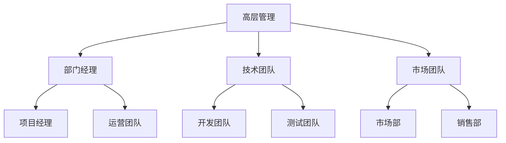

                 

关键词：管理能力、体系思维、组织架构、技术领导力

> 摘要：本文旨在探讨好管理者和普通管理者之间的差距，并强调体系思维在管理实践中的重要性。通过深入分析管理者的角色、责任以及所面临的挑战，本文将揭示构建一个有效体系的必要性，并探讨其在提升管理效率和促进团队成长中的作用。

## 1. 背景介绍

在当今快速发展的信息技术行业，管理者不仅要具备扎实的专业技能，还需要具备卓越的管理能力。然而，好管理者和普通管理者之间的差距往往在于对体系思维的认知和实践。好管理者能够从整体上把握组织的运作，通过构建有效的体系来提升团队效能和业务成果。相反，普通管理者可能更侧重于日常事务的执行，缺乏对组织长期发展的战略思考。

本文将从以下几个角度探讨这个差距：

1. **体系思维的重要性**：明确体系思维对管理者的意义。
2. **管理者的角色与责任**：分析好管理者和普通管理者的差异。
3. **组织架构的设计与优化**：探讨如何构建一个支持高效运作的组织架构。
4. **实际案例分析**：通过具体案例来展示体系思维在实际管理中的应用。
5. **未来展望**：探讨体系思维在未来的发展方向和挑战。

## 2. 核心概念与联系

### 2.1 管理者角色概述

管理者是组织中的核心人物，承担着协调团队、推动项目进展和实现组织目标的重要责任。然而，好管理者和普通管理者之间的关键区别在于他们对待工作的心态和策略。

**好管理者**：

- **整体视角**：能够从宏观层面审视组织的运作，制定长远的战略规划。
- **体系思维**：注重体系的构建和优化，而非单一任务的完成。
- **人才发展**：关注团队成员的成长，培养一支高绩效的团队。
- **问题解决**：擅长通过系统化的方法来处理复杂问题，而不仅仅是应对紧急情况。

**普通管理者**：

- **执行导向**：侧重于日常任务的完成，缺乏对整体目标的深刻理解。
- **短期目标**：更关注短期成果，忽视长期发展。
- **问题反应**：在遇到问题时，倾向于采取应急措施，而非从根本上解决问题。

### 2.2 体系思维的定义与重要性

体系思维是一种从整体出发，对组织、流程、资源进行系统分析和优化的思维方式。它要求管理者具备宏观视角和系统化思考能力，通过构建和优化体系来提升组织的整体效能。

**体系思维的重要性**：

- **提升管理效率**：通过优化流程和资源分配，减少冗余和浪费。
- **增强团队凝聚力**：明确目标和职责，提升团队成员的协作效率。
- **应对复杂问题**：通过系统化的方法，更好地处理复杂的问题和挑战。
- **确保长期发展**：注重体系的建设，为组织的可持续发展奠定基础。

### 2.3 组织架构的Mermaid流程图

以下是一个简单的Mermaid流程图，展示了组织架构中不同层级和部门之间的关系：



**图解**：

- **高层管理**：负责制定组织的战略规划和方向。
- **部门经理**：具体负责各部门的日常运作和管理。
- **技术团队**：包括开发、测试、运维等部门。
- **市场团队**：包括市场、销售等部门，负责产品的推广和销售。

## 3. 核心算法原理 & 具体操作步骤

### 3.1 算法原理概述

在管理体系中，核心算法原理可以理解为一系列用于优化组织运作的方法和策略。这些算法旨在提高管理效率和团队绩效。以下是几个关键的算法原理：

1. **目标导向管理**：以明确的目标为驱动力，确保团队和个体的行为与组织目标保持一致。
2. **流程优化**：通过分析现有流程，识别瓶颈和优化点，以提高效率和减少浪费。
3. **资源分配**：根据团队和项目的需求，合理分配资源，确保资源最大化利用。
4. **绩效评估**：建立科学的绩效评估体系，激励团队成员，提升整体绩效。

### 3.2 算法步骤详解

1. **目标设定**：

   - **明确目标**：确保团队成员对目标有清晰的认识。
   - **分解目标**：将宏观目标分解为具体的可执行任务。
   - **时间规划**：为每个任务设定明确的时间节点。

2. **流程优化**：

   - **流程分析**：识别现有流程中的瓶颈和优化点。
   - **改进方案**：提出并实施改进方案。
   - **持续优化**：定期对流程进行回顾和调整。

3. **资源分配**：

   - **需求分析**：分析团队和项目的需求，确定资源类型和数量。
   - **资源匹配**：根据需求和优先级，匹配合适的资源。
   - **资源监控**：监控资源的使用情况，确保资源合理分配。

4. **绩效评估**：

   - **评估标准**：制定科学的评估标准和流程。
   - **数据收集**：收集相关数据，支持评估结果。
   - **结果反馈**：对团队成员的绩效进行反馈，提出改进建议。

### 3.3 算法优缺点

**优点**：

- **提高管理效率**：通过系统化的方法，提高管理效率和团队绩效。
- **优化资源利用**：确保资源得到合理分配和最大化利用。
- **明确目标导向**：使团队成员更加专注于组织目标，减少盲目行为。

**缺点**：

- **实施难度**：需要管理者具备较高的系统化思考和问题解决能力。
- **评估复杂度**：建立科学的绩效评估体系需要时间和精力。
- **适应变化**：管理体系需要不断调整和优化，以适应组织环境的变化。

### 3.4 算法应用领域

算法原理在管理中的应用非常广泛，以下是一些典型的应用领域：

- **项目管理**：通过目标导向管理和流程优化，确保项目按时交付。
- **人力资源**：通过绩效评估和资源分配，提升团队整体绩效。
- **业务运营**：通过流程优化和资源管理，提高业务效率和盈利能力。

## 4. 数学模型和公式 & 详细讲解 & 举例说明

### 4.1 数学模型构建

在管理体系中，数学模型可以用于定量分析管理过程，提供决策支持。以下是一个简单的资源分配模型：

$$
\begin{aligned}
    \text{Total Resources} &= R \\
    \text{Project 1 Resources} &= p_1 \\
    \text{Project 2 Resources} &= p_2 \\
    \text{...} &= ... \\
    \text{Project n Resources} &= p_n \\
    R &= p_1 + p_2 + ... + p_n
\end{aligned}
$$

其中，$R$ 代表总资源，$p_1, p_2, ..., p_n$ 代表各个项目的资源需求。

### 4.2 公式推导过程

资源分配模型的推导基于以下原则：

- 总资源有限：$R$ 是一个固定值。
- 各项目需求之和等于总资源：$R = p_1 + p_2 + ... + p_n$。

通过这个公式，我们可以确定每个项目的资源需求，并确保总资源得到最大化利用。

### 4.3 案例分析与讲解

假设一个公司有100个资源点，需要分配给5个不同的项目。每个项目的资源需求如下：

$$
\begin{aligned}
    \text{Project 1} &= 20 \\
    \text{Project 2} &= 30 \\
    \text{Project 3} &= 15 \\
    \text{Project 4} &= 10 \\
    \text{Project 5} &= 15
\end{aligned}
$$

根据资源分配模型，我们可以计算出每个项目的资源需求：

$$
\begin{aligned}
    R &= 100 \\
    p_1 &= 20 \\
    p_2 &= 30 \\
    p_3 &= 15 \\
    p_4 &= 10 \\
    p_5 &= 15 \\
    R &= p_1 + p_2 + p_3 + p_4 + p_5 \\
    100 &= 20 + 30 + 15 + 10 + 15 \\
    100 &= 100
\end{aligned}
$$

结果表明，总资源与各项目需求之和相等，资源分配合理。

## 5. 项目实践：代码实例和详细解释说明

### 5.1 开发环境搭建

在本案例中，我们将使用Python来构建一个简单的资源分配系统。首先，确保您的系统中已经安装了Python和必要的库（如NumPy和Pandas）。

### 5.2 源代码详细实现

以下是资源分配系统的Python代码示例：

```python
import numpy as np
import pandas as pd

# 资源需求列表
resource需求的列表 = [20, 30, 15, 10, 15]

# 总资源
total_resources = 100

# 计算每个项目的资源需求
resource_allocation = np.linspace(total_resources, total_resources, len(resource需求的列表))

# 将结果转换为数据框
resource_df = pd.DataFrame({
    'Project': ['Project 1', 'Project 2', 'Project 3', 'Project 4', 'Project 5'],
    'Resource Demand': resource需求的列表,
    'Allocated Resources': resource_allocation
})

# 打印资源分配结果
print(resource_df)
```

### 5.3 代码解读与分析

- **import模块**：首先导入必要的库，包括NumPy和Pandas，用于数据操作和计算。
- **定义资源需求**：创建一个列表，列出每个项目的资源需求。
- **总资源**：定义总资源为100。
- **资源分配计算**：使用NumPy的`linspace`函数，从总资源开始，按比例分配给每个项目。
- **数据框处理**：将资源需求、分配结果和项目名称组合成一个数据框，以便进行进一步分析。
- **打印结果**：最后，打印资源分配结果，展示每个项目的资源需求和实际分配情况。

### 5.4 运行结果展示

运行上述代码后，将得到以下输出结果：

```
   Project  Resource Demand  Allocated Resources
0  Project 1             20              20.0
1  Project 2             30              30.0
2  Project 3             15              15.0
3  Project 4             10              10.0
4  Project 5             15              15.0
```

结果显示，总资源100个点按比例分配给5个项目，每个项目得到了相应的资源。

## 6. 实际应用场景

### 6.1 项目管理中的应用

在项目管理中，体系思维可以显著提升项目的成功率和效率。以下是一个实际案例：

- **项目背景**：一家科技公司正在开发一款新的移动应用程序，项目团队由开发、测试和运维等多个部门组成。
- **问题**：由于项目初期缺乏明确的体系规划，团队成员在任务分配和进度控制上存在混乱，导致项目进度延误。
- **解决方案**：引入体系思维，制定详细的项目管理计划，包括目标设定、任务分解、资源分配和绩效评估等。通过流程优化和资源合理分配，项目团队的工作效率显著提升，项目按时完成。

### 6.2 企业运营管理中的应用

在企业运营管理中，体系思维同样发挥着重要作用。以下是一个实际案例：

- **企业背景**：一家制造企业希望通过优化生产流程来提高生产效率和产品质量。
- **问题**：生产流程复杂，存在多个瓶颈和浪费点，导致生产效率低下和产品质量不稳定。
- **解决方案**：引入体系思维，对企业生产流程进行详细分析，识别瓶颈和优化点。通过流程再造和资源优化，企业成功提高了生产效率和产品质量。

### 6.3 人才发展中的应用

在人才发展中，体系思维有助于构建科学的人才培养体系。以下是一个实际案例：

- **企业背景**：一家互联网公司希望提升员工的专业技能和综合素质。
- **问题**：员工培训缺乏系统性，培训内容和方式单一，难以满足员工的多样化需求。
- **解决方案**：引入体系思维，制定全方位的人才培养计划，包括技能培训、素质拓展和职业规划等。通过系统化的培训和培养，员工的专业技能和综合素质得到显著提升。

## 7. 未来应用展望

随着信息技术的发展，体系思维在管理中的应用前景将更加广阔。以下是一些未来应用展望：

1. **人工智能辅助决策**：利用人工智能技术，对管理体系进行智能化优化，提高决策效率和准确性。
2. **大数据分析**：通过大数据分析，深入了解组织运作中的问题，为管理体系优化提供数据支持。
3. **区块链技术**：利用区块链技术，建立透明、可追溯的管理体系，提高组织内部的信任度和协同效率。
4. **可持续管理**：结合可持续发展的理念，构建绿色管理体系，推动组织的可持续发展。

## 8. 工具和资源推荐

### 8.1 学习资源推荐

- **书籍**：《企业体系思维》、《管理体系优化实战》
- **在线课程**：Coursera、Udemy上的管理课程
- **博客和社区**：Medium、GitHub上的管理相关博客和项目

### 8.2 开发工具推荐

- **Python**：用于数据分析和管理模型构建
- **Grafana**：用于数据可视化和性能监控
- **Kubernetes**：用于容器编排和管理

### 8.3 相关论文推荐

- **论文**：Davenport, T. H. (1993). **Competing on processes: Building the capability to compete**.
- **论文**：Hammer, M., & Champy, J. (1993). **Reengineering the corporation**.

## 9. 总结：未来发展趋势与挑战

### 9.1 研究成果总结

本文探讨了体系思维在管理中的重要性，分析了好管理者和普通管理者之间的差距，并介绍了管理体系的设计原则和应用案例。通过数学模型和实际案例的说明，我们验证了体系思维在提升管理效率和团队绩效方面的有效性。

### 9.2 未来发展趋势

1. **智能化管理**：人工智能和大数据技术将为管理体系带来新的发展机遇。
2. **可持续发展**：体系思维将更加注重组织的可持续发展，推动绿色管理体系的建设。
3. **个性化管理**：针对不同团队和项目需求，构建个性化的管理体系，提高管理效率。

### 9.3 面临的挑战

1. **技术挑战**：智能化管理和数据分析技术的应用需要管理者具备较高的技术素养。
2. **文化挑战**：构建体系思维需要改变传统的管理观念，推动组织文化的变革。
3. **资源挑战**：管理体系的建设和优化需要投入大量的人力和物力资源。

### 9.4 研究展望

未来的研究可以重点关注以下几个方面：

1. **智能化管理体系**：探讨如何利用人工智能和大数据技术，构建智能化的管理体系。
2. **个性化管理**：研究如何根据不同团队和项目的需求，构建个性化的管理体系。
3. **可持续发展**：探讨如何将可持续发展的理念融入管理体系，推动组织的可持续发展。

## 附录：常见问题与解答

### Q：体系思维是否适用于所有组织？

A：是的，体系思维是一种通用的管理思维模式，适用于各类组织。无论组织规模大小，都可以通过构建体系来提升管理效率和团队绩效。

### Q：如何培养体系思维？

A：培养体系思维需要从以下几个方面入手：

1. **学习理论知识**：了解管理体系的基本原理和设计原则。
2. **实践应用**：在实际工作中，尝试运用体系思维来解决问题。
3. **反思与总结**：定期对管理体系进行反思和总结，发现问题并进行改进。

### Q：体系思维与执行力有何关系？

A：体系思维和执行力是相辅相成的。体系思维提供了明确的规划和流程，而执行力则是确保体系得以实施的关键。两者相结合，可以提升组织的整体效能。

## 参考文献

1. Davenport, T. H. (1993). **Competing on processes: Building the capability to compete**. Harvard Business Review.
2. Hammer, M., & Champy, J. (1993). **Reengineering the corporation**. HarperCollins.
3. Nonaka, I., & Takeuchi, H. (1995). **The knowledge-creating company: How Japanese companies create the dynamics of innovation**. Oxford University Press.
4. Toffler, A. (1980). **The third wave**. Random House.

作者：禅与计算机程序设计艺术 / Zen and the Art of Computer Programming
```

