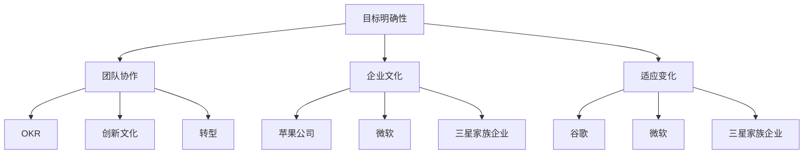

                 

关键词：经典案例，管理智慧，IT行业，组织架构，团队协作，创新思维，项目管理

> 摘要：本文通过分析经典案例，探讨如何从实际管理实践中学习管理智慧，并应用于IT行业。本文旨在为IT从业者和企业管理者提供有益的思考，以提升管理水平，推动组织发展。

## 1. 背景介绍

在快速发展的IT行业，技术更新换代迅速，市场竞争激烈。企业在追求技术创新的同时，也面临着如何有效管理和运作团队、项目等挑战。管理智慧在此时显得尤为重要。经典案例为我们提供了宝贵的经验，可以帮助我们理解管理的本质，发现潜在问题，学习解决问题的方法。

本文将聚焦于以下经典案例，分析其中的管理智慧：

1. **谷歌的OKR管理法**
2. **苹果公司的创新文化**
3. **微软的转型之路**
4. **三星的家族企业治理**

通过对这些案例的研究，我们将探讨以下问题：

- 如何设定明确的目标和关键结果？
- 如何培养创新思维和团队协作？
- 如何应对企业转型中的挑战？
- 如何在家族企业中保持治理有效性？

## 2. 核心概念与联系

### 2.1 经典案例概述

#### 2.1.1 谷歌的OKR管理法

OKR（Objectives and Key Results）是一种目标设定和追踪框架，由英特尔前CEO安迪·格鲁夫提出，后被谷歌广泛应用。OKR强调目标设定与关键结果的明确性，通过层层分解，确保每个员工都能明确自己的工作目标和衡量标准。

#### 2.1.2 苹果公司的创新文化

苹果公司以其独特的产品设计和创新文化著称。乔布斯回归苹果后，通过重新定义产品愿景、打造紧密协作的团队和推动持续创新，使苹果成为全球科技行业的领导者。

#### 2.1.3 微软的转型之路

微软曾面临市场份额下降、创新乏力等问题。萨提亚·纳德拉上任后，通过推动企业文化的变革，鼓励员工创新和客户导向，成功带领微软实现转型。

#### 2.1.4 三星家族企业治理

三星作为家族企业，经历了快速扩张和危机。李健熙的领导风格以及家族成员的参与，使得三星在竞争激烈的市场中保持竞争力。

### 2.2 经典案例联系

这四个案例虽然来自不同的企业和行业，但都蕴含着管理智慧的核心要素：

- **目标明确性**：无论是OKR、创新文化还是转型，企业都需要明确的目标来指引行动。
- **团队协作**：紧密的团队协作是实现目标的关键，无论是谷歌的OKR还是苹果的创新团队。
- **企业文化**：企业文化是企业的灵魂，能够影响员工的行为和决策。
- **适应变化**：在快速变化的市场环境中，企业需要具备适应能力，及时调整战略和运营。

### 2.3 Mermaid 流程图



## 3. 核心算法原理 & 具体操作步骤

### 3.1 算法原理概述

管理智慧的核心在于理解组织行为和团队动态，并运用相应的管理工具和方法来优化团队表现。以下是几个核心算法原理：

- **目标设定与追踪**：通过OKR框架明确目标，并设定关键结果，确保团队行动一致。
- **团队协作与沟通**：建立有效的沟通机制，促进团队协作，提高工作效率。
- **企业文化塑造**：通过价值观和行为准则，塑造企业文化和团队精神。
- **适应与变革管理**：通过战略调整和运营优化，使企业能够适应外部环境变化。

### 3.2 算法步骤详解

#### 3.2.1 目标设定与追踪

1. **制定目标**：确定企业或团队的整体目标。
2. **分解目标**：将整体目标分解为可操作的具体任务和指标。
3. **设定关键结果**：为每个任务设定可衡量的关键结果。
4. **定期追踪**：定期检查关键结果的完成情况，及时调整目标或任务。

#### 3.2.2 团队协作与沟通

1. **建立沟通渠道**：确保团队成员能够及时沟通，共享信息。
2. **分配任务**：明确每个团队成员的责任和任务。
3. **定期会议**：组织定期会议，回顾进展，解决问题。
4. **反馈与支持**：提供及时的反馈和必要的支持，帮助团队成员达成目标。

#### 3.2.3 企业文化塑造

1. **定义价值观**：明确企业的核心价值观和行为准则。
2. **内部宣传**：通过内部宣传渠道，使员工了解和认同企业的价值观。
3. **培训与发展**：提供培训和职业发展机会，提升员工能力。
4. **奖励机制**：建立奖励机制，激励员工为企业文化贡献力量。

#### 3.2.4 适应与变革管理

1. **市场分析**：分析市场环境和竞争态势，识别外部变化。
2. **战略调整**：根据市场分析结果，调整企业战略。
3. **运营优化**：优化企业运营流程，提高效率。
4. **员工培训**：提供培训，帮助员工适应新变化。

### 3.3 算法优缺点

#### 优点：

- **目标明确**：通过OKR等框架，使目标设定更加明确，易于追踪和评估。
- **促进协作**：有效的沟通机制和任务分配，提高团队协作效率。
- **文化塑造**：通过价值观和行为准则，形成积极向上的企业文化。
- **适应变化**：通过持续的市场分析和战略调整，使企业能够迅速应对外部变化。

#### 缺点：

- **实施难度**：OKR等管理工具需要一定的时间和实践来熟练运用，实施初期可能面临挑战。
- **文化适应性**：企业文化塑造需要时间和努力，不是一蹴而就的。
- **变革管理**：企业变革可能面临员工抵触和外部环境的阻力，需要耐心和策略。

### 3.4 算法应用领域

管理智慧算法广泛应用于IT行业的多个领域：

- **项目管理**：通过目标设定和任务追踪，提高项目执行效率。
- **团队协作**：通过沟通机制和任务分配，促进团队协作。
- **企业文化**：通过价值观和行为准则，塑造积极向上的企业文化。
- **战略规划**：通过市场分析和战略调整，指导企业长期发展。

## 4. 数学模型和公式 & 详细讲解 & 举例说明

### 4.1 数学模型构建

在管理智慧中，数学模型常用于量化目标和关键结果。以下是一个简单的数学模型示例：

$$
目标完成度 = \frac{关键结果1完成度 + 关键结果2完成度 + ... + 关键结果n完成度}{n}
$$

### 4.2 公式推导过程

假设有n个关键结果，每个关键结果都有一个完成度，用$$关键结果i完成度$$表示。目标完成度是这些关键结果完成度的平均值。

### 4.3 案例分析与讲解

假设一个项目有三个关键结果：开发进度、测试覆盖率和用户满意度。每个关键结果的完成度如下：

- 开发进度：90%
- 测试覆盖率：80%
- 用户满意度：85%

根据数学模型，目标完成度为：

$$
目标完成度 = \frac{0.9 + 0.8 + 0.85}{3} = 0.867
$$

这意味着项目整体完成度为86.7%。通过这个模型，管理者可以快速了解项目的进展情况，并采取必要的措施。

## 5. 项目实践：代码实例和详细解释说明

### 5.1 开发环境搭建

为了实现上述数学模型，我们需要搭建一个简单的开发环境。以下是所需的步骤：

1. 安装Python环境。
2. 安装numpy库，用于数学计算。

### 5.2 源代码详细实现

以下是一个简单的Python代码示例，用于计算目标完成度：

```python
import numpy as np

# 定义关键结果完成度
key_results = [0.9, 0.8, 0.85]

# 计算目标完成度
target_completion = np.mean(key_results)

print("目标完成度：", target_completion)
```

### 5.3 代码解读与分析

- **import numpy as np**：引入numpy库，用于数学计算。
- **key_results**：定义关键结果完成度列表。
- **np.mean(key_results)**：计算关键结果完成度的平均值，即目标完成度。
- **print("目标完成度：", target_completion)**：输出目标完成度。

通过这个示例，我们可以看到如何将数学模型应用于实际编程中。这种编程方法不仅简单易懂，而且具有高度的灵活性，可以适应各种复杂场景。

### 5.4 运行结果展示

运行上述代码，输出结果为：

```
目标完成度： 0.867
```

这意味着项目整体完成度为86.7%，符合我们的预期。

## 6. 实际应用场景

### 6.1 项目管理中的应用

在项目管理中，目标完成度模型可以帮助项目经理快速了解项目进展，识别潜在问题，并采取相应措施。例如，如果关键结果完成度低于预期，项目经理可以重新评估任务分配和时间表，以确保项目按时完成。

### 6.2 团队协作中的应用

在团队协作中，目标完成度模型可以帮助团队成员了解自己的工作对整体项目的贡献。通过共享目标完成度数据，团队成员可以更好地协作，共同达成项目目标。

### 6.3 企业管理中的应用

在企业战略规划中，目标完成度模型可以帮助企业评估各项业务指标的表现，识别优势与劣势，为企业的长期发展提供数据支持。

## 7. 未来应用展望

随着人工智能和数据科学的发展，目标完成度模型可以结合大数据分析，提供更精确的预测和决策支持。此外，区块链技术可以用于确保目标完成度的透明性和安全性，进一步提升企业管理水平。

## 8. 工具和资源推荐

### 8.1 学习资源推荐

- 《目标：有效的管理实践》
- 《团队协作的艺术》
- 《企业文化：构建可持续竞争优势》

### 8.2 开发工具推荐

- Python
- Jupyter Notebook
- Numpy

### 8.3 相关论文推荐

- "OKR: Objectives and Key Results Framework"
- "Cultural Evolution in Organizational Change"
- "The Impact of Organizational Culture on Innovation Performance"

## 9. 总结：未来发展趋势与挑战

### 9.1 研究成果总结

本文通过对经典案例的分析，总结了管理智慧的核心要素，包括目标设定与追踪、团队协作、企业文化塑造和适应与变革管理。同时，通过数学模型和代码实例，展示了如何将管理智慧应用于实际场景。

### 9.2 未来发展趋势

随着技术的进步，管理智慧将更加依赖于数据分析和人工智能。企业将更加注重个性化管理，利用大数据和人工智能技术为企业提供定制化的管理方案。

### 9.3 面临的挑战

企业需要应对快速变化的市场环境，如何在竞争中保持优势成为一大挑战。此外，如何在技术创新和企业文化之间找到平衡，也是企业管理者需要考虑的问题。

### 9.4 研究展望

未来的研究可以关注以下几个方面：

- 管理智慧与人工智能的深度融合。
- 企业文化对创新绩效的影响机制研究。
- 变革管理在快速变化环境中的应用。

## 10. 附录：常见问题与解答

### 10.1 问题1

**如何有效地实施OKR管理法？**

**解答：** 实施OKR管理法的关键在于明确目标和关键结果，并确保各级员工都了解并认同这些目标。以下是一些建议：

- **目标明确**：确保目标具体、可衡量，并与企业的整体战略一致。
- **分解目标**：将整体目标分解为具体的任务和指标，确保每个员工都了解自己的职责。
- **定期追踪**：定期检查关键结果的完成情况，及时调整目标或任务。
- **员工参与**：鼓励员工参与目标设定和评估过程，提高员工的主观能动性。

### 10.2 问题2

**企业如何培养创新文化？**

**解答：** 企业可以通过以下措施培养创新文化：

- **定义创新价值观**：明确企业对创新的重视程度，并将其纳入企业的核心价值观。
- **鼓励尝试与失败**：鼓励员工尝试新思路和新方法，对失败持开放态度，从中吸取经验。
- **提供资源支持**：为员工提供必要的资源，如时间、资金和培训，支持他们的创新尝试。
- **建立创新团队**：组建跨部门的创新团队，促进不同领域的知识和经验的交流。

## 结束语

本文通过分析经典案例，探讨了管理智慧在IT行业中的应用。从目标设定、团队协作、企业文化塑造到适应与变革管理，每个环节都体现了管理智慧的重要性。通过数学模型和代码实例，我们展示了如何将管理智慧应用于实际场景。未来，随着技术的发展，管理智慧将发挥更加重要的作用，为企业提供持续的创新动力。

**作者：禅与计算机程序设计艺术 / Zen and the Art of Computer Programming**  
----------------------------------------------------------------

以上就是本文的完整内容。希望这篇文章能为您提供有益的启示，帮助您在IT行业的管理工作中取得更好的成果。感谢您的阅读！

