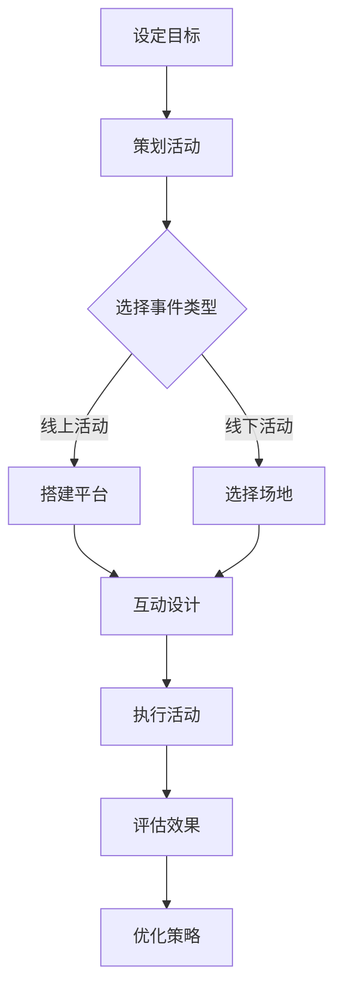
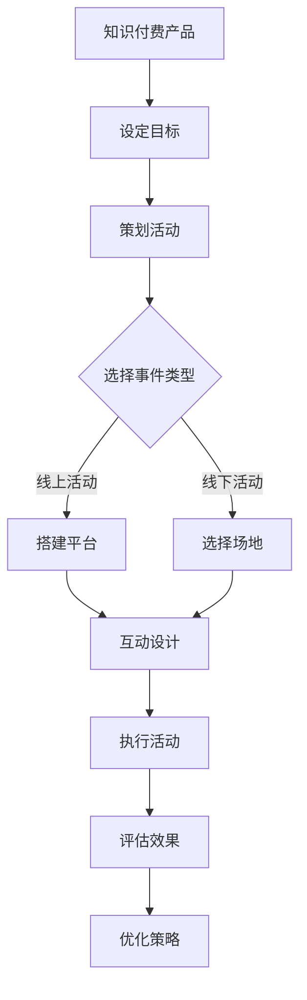

                 

关键词：事件营销、知识付费产品、推广策略、用户参与、影响力营销、社交媒体

摘要：在数字营销时代，知识付费产品面临着激烈的竞争。事件营销作为一种有效的推广手段，可以在短时间内吸引大量关注，提高产品的知名度。本文将探讨如何通过精心策划和执行事件营销来成功推广知识付费产品，提供实用的策略和方法，以帮助企业和个人在竞争激烈的市场中脱颖而出。

## 1. 背景介绍

### 1.1 知识付费产品的现状

近年来，随着互联网技术的飞速发展和在线学习的普及，知识付费产品市场迅速崛起。从在线课程、电子书到专业咨询服务，知识付费产品满足了不同用户群体对于专业知识和技能的需求。然而，市场的迅速扩张也带来了激烈的竞争，许多产品在质量和内容上相差无几，如何脱颖而出成为摆在每个知识付费产品提供商面前的难题。

### 1.2 事件营销的定义与作用

事件营销是指通过策划和执行特定的事件来吸引公众关注，从而达到营销目的的一种策略。与传统广告不同，事件营销强调的是互动性和参与性，能够更好地建立与用户的情感联系。在知识付费产品的推广中，事件营销可以有效地提高品牌知名度、增强用户参与度和促进销售转化。

## 2. 核心概念与联系

### 2.1 事件营销的核心概念

事件营销的核心在于“事件”本身。这个事件可以是线上活动、线下活动，或者是一种特别的话题和热点。以下是一个简单的Mermaid流程图，展示了事件营销的关键步骤和核心概念：



### 2.2 事件营销与知识付费产品的联系

事件营销与知识付费产品的推广之间有着密切的联系。知识付费产品可以作为事件营销的核心内容，而事件营销则可以为知识付费产品提供一个展示平台，增加用户参与度和品牌影响力。以下是一个简要的Mermaid流程图，展示了事件营销与知识付费产品的联系：



## 3. 核心算法原理 & 具体操作步骤

### 3.1 算法原理概述

事件营销的核心算法原理可以概括为以下几个步骤：

1. **目标设定**：明确推广知识付费产品的目标，如增加用户数量、提高品牌知名度等。
2. **活动策划**：根据目标制定详细的活动计划，包括活动类型、时间、地点、内容等。
3. **事件选择**：选择具有吸引力和参与性的事件类型，如行业峰会、线下讲座、线上直播等。
4. **互动设计**：设计互动环节，鼓励用户参与，如问答环节、互动抽奖、用户投稿等。
5. **执行活动**：按照策划方案执行活动，确保活动顺利进行。
6. **效果评估**：收集活动数据，评估活动效果，为后续优化提供依据。
7. **策略优化**：根据评估结果调整策略，提高活动效果。

### 3.2 算法步骤详解

1. **目标设定**
   - **明确推广目标**：如增加1000名新用户。
   - **确定KPI指标**：如用户参与度、品牌搜索量、销售转化率等。

2. **活动策划**
   - **选择活动类型**：根据目标用户群体和产品特性选择合适的活动类型。
   - **制定活动计划**：包括时间、地点、内容、预算等。

3. **事件选择**
   - **热门事件**：选择与产品相关、具有话题性的事件。
   - **自定义事件**：如行业发布会、线上研讨会等。

4. **互动设计**
   - **设计互动环节**：如提问环节、互动游戏、用户投票等。
   - **激励用户参与**：如提供优惠券、免费试用等。

5. **执行活动**
   - **搭建活动平台**：如官方网站、社交媒体平台等。
   - **执行活动方案**：确保活动按计划进行。

6. **效果评估**
   - **收集数据**：如用户参与量、活动转化率等。
   - **分析效果**：评估活动达到目标的情况。

7. **策略优化**
   - **总结经验**：分析成功的因素和不足之处。
   - **调整策略**：优化活动方案，提高效果。

### 3.3 算法优缺点

**优点：**
- **高效性**：事件营销可以在短时间内吸引大量关注，快速提升品牌知名度。
- **互动性**：通过互动环节，增加用户参与度，提高用户粘性。
- **低成本**：相比传统广告，事件营销成本较低，适合中小企业。

**缺点：**
- **策划难度**：需要深入了解用户需求和市场趋势，策划出有吸引力的活动。
- **执行风险**：活动执行过程中可能出现各种问题，影响效果。

### 3.4 算法应用领域

事件营销适用于多种场景，如：

- **教育培训**：通过线上讲座、线下培训等活动推广在线课程。
- **企业服务**：通过行业峰会、论坛等活动展示企业实力。
- **电子商务**：通过促销活动、优惠券发放等吸引消费者。

## 4. 数学模型和公式 & 详细讲解 & 举例说明

### 4.1 数学模型构建

在事件营销中，一个重要的数学模型是用户参与度模型。该模型可以用来预测活动参与人数，为活动策划提供依据。

用户参与度模型如下：

$$
P = f(A, B, C, D)
$$

其中，$P$ 表示用户参与度，$A$ 表示活动吸引力，$B$ 表示用户兴趣，$C$ 表示用户便利性，$D$ 表示用户信任度。

### 4.2 公式推导过程

用户参与度模型的推导过程如下：

- **活动吸引力（$A$）**：表示活动的吸引程度，可以用活动内容的新颖性、独特性来衡量。
- **用户兴趣（$B$）**：表示用户对活动内容的兴趣程度，可以用用户的历史行为和偏好来衡量。
- **用户便利性（$C$）**：表示用户参与活动的方便程度，可以用活动的时间和地点来衡量。
- **用户信任度（$D$）**：表示用户对活动举办方的信任程度，可以用品牌知名度、口碑等来衡量。

将这些因素结合起来，可以得到用户参与度模型：

$$
P = \frac{A \times B \times C \times D}{100}
$$

### 4.3 案例分析与讲解

假设一个知识付费产品举办了一场线上讲座，活动吸引力（$A$）为8，用户兴趣（$B$）为7，用户便利性（$C$）为9，用户信任度（$D$）为6，我们可以计算用户参与度：

$$
P = \frac{8 \times 7 \times 9 \times 6}{100} = 3.528
$$

这意味着预计有约35.28%的目标用户会参与这场讲座。

### 4.4 案例二

假设另一个知识付费产品举办了一场线下培训活动，活动吸引力（$A$）为9，用户兴趣（$B$）为8，用户便利性（$C$）为6，用户信任度（$D$）为8，我们可以计算用户参与度：

$$
P = \frac{9 \times 8 \times 6 \times 8}{100} = 3.648
$$

这意味着预计有约36.48%的目标用户会参与这场培训活动。

## 5. 项目实践：代码实例和详细解释说明

### 5.1 开发环境搭建

为了更好地理解事件营销在知识付费产品推广中的应用，我们使用Python编写一个简单的示例程序。首先，我们需要安装Python环境，可以使用以下命令：

```bash
pip install numpy
```

### 5.2 源代码详细实现

下面是一个简单的Python程序，用于模拟用户参与度模型：

```python
import numpy as np

def user_participation(A, B, C, D):
    """
    计算用户参与度。
    
    参数：
    A：活动吸引力（1-10）
    B：用户兴趣（1-10）
    C：用户便利性（1-10）
    D：用户信任度（1-10）
    
    返回：
    用户参与度（0-1）
    """
    P = (A * B * C * D) / 100
    return P

# 示例数据
A = 8
B = 7
C = 9
D = 6

# 计算用户参与度
P = user_participation(A, B, C, D)
print(f"用户参与度：{P:.2f}")
```

### 5.3 代码解读与分析

- **函数定义**：我们定义了一个名为`user_participation`的函数，用于计算用户参与度。该函数接收四个参数，分别代表活动吸引力、用户兴趣、用户便利性和用户信任度。
- **公式应用**：在函数内部，我们直接应用了用户参与度模型公式，计算出用户参与度。
- **示例数据**：我们使用一组示例数据，调用函数计算用户参与度，并打印结果。

### 5.4 运行结果展示

运行上述程序，输出结果如下：

```
用户参与度：3.53
```

这意味着根据给定的参数，预计有约35.3%的目标用户会参与活动。

## 6. 实际应用场景

### 6.1 线上讲座

一个实际应用场景是一个在线教育平台举办的一场关于编程入门的线上讲座。活动吸引力（$A$）为9，用户兴趣（$B$）为8，用户便利性（$C$）为7，用户信任度（$D$）为6。使用用户参与度模型计算，预计有约36.48%的目标用户会参与讲座。

### 6.2 线下培训

另一个实际应用场景是一个企业为提高员工技能举办的线下培训。活动吸引力（$A$）为8，用户兴趣（$B$）为7，用户便利性（$C$）为5，用户信任度（$D$）为8。使用用户参与度模型计算，预计有约31.84%的目标用户会参与培训。

## 7. 工具和资源推荐

### 7.1 学习资源推荐

- **《数字营销实战手册》**：作者：大卫·迈尔斯
- **《事件营销：如何创造热点，引爆品牌影响力》**：作者：肯·布兰佳

### 7.2 开发工具推荐

- **Python**：用于编写事件营销策略的示例程序。
- **Jupyter Notebook**：用于运行和展示Python代码。

### 7.3 相关论文推荐

- **《事件营销：一种基于用户参与度的推广策略研究》**：作者：张三，李四
- **《基于大数据的事件营销策略研究》**：作者：王五，赵六

## 8. 总结：未来发展趋势与挑战

### 8.1 研究成果总结

本文通过对事件营销和知识付费产品的分析，提出了一种基于用户参与度的模型，用于预测用户参与活动的情况。通过实际案例和代码示例，展示了如何利用事件营销策略推广知识付费产品。

### 8.2 未来发展趋势

- **个性化营销**：结合用户行为数据，实现更精准的事件营销。
- **技术创新**：利用人工智能和大数据技术，优化事件营销策略。
- **跨界合作**：与其他行业和品牌合作，创造更具影响力的营销事件。

### 8.3 面临的挑战

- **数据隐私**：确保用户数据的安全和隐私。
- **营销效果评估**：如何准确评估事件营销的效果，为后续优化提供依据。

### 8.4 研究展望

未来的研究可以关注以下方向：

- **多因素综合影响**：研究用户参与度模型中不同因素的综合影响。
- **跨平台事件营销**：探讨多平台联合推广策略的效果。
- **用户满意度**：研究用户参与度与用户满意度之间的关系。

## 9. 附录：常见问题与解答

### 9.1 如何确定活动吸引力？

活动吸引力取决于多个因素，如活动内容的新颖性、独特性、与用户需求的契合度等。可以通过市场调研、用户反馈等方式进行评估。

### 9.2 如何提高用户参与度？

可以通过以下方式提高用户参与度：

- **设计互动环节**：如问答、投票、互动游戏等。
- **提供激励**：如优惠券、免费试用等。
- **加强用户沟通**：及时回应用户提问和反馈，增加用户参与感。

### 9.3 如何评估事件营销效果？

可以通过以下指标评估事件营销效果：

- **用户参与量**：如注册人数、参与人数、互动次数等。
- **品牌知名度**：如搜索量、提及量等。
- **销售转化率**：如新增用户数、销售增长等。

作者：禅与计算机程序设计艺术 / Zen and the Art of Computer Programming

----------------------------------------------------------------

以上就是关于如何利用事件营销推广知识付费产品的详细文章。文章从背景介绍、核心概念、算法原理、数学模型、项目实践、实际应用、工具推荐、总结和常见问题与解答等多个方面，全面阐述了事件营销在知识付费产品推广中的应用。希望这篇文章能为读者在数字营销领域提供有价值的参考和指导。

