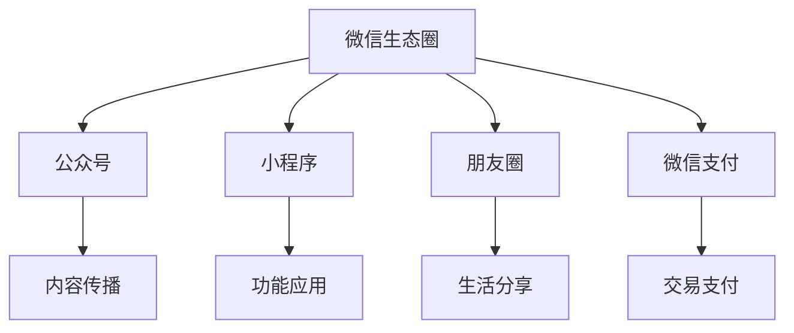

                 

微信作为全球最受欢迎的社交媒体平台之一，拥有庞大的用户基础和多样化的功能，已经成为企业和个人实现知识变现的重要渠道。在这篇文章中，我们将深入探讨如何利用微信生态圈实现知识变现，帮助读者抓住这个巨大的商机。

## 关键词

- 微信生态圈
- 知识变现
- 社交媒体营销
- 知识付费
- 微信小程序

## 摘要

本文将介绍如何通过微信生态圈实现知识变现，包括了解微信的核心功能、构建知识变现的商业模式、利用微信小程序进行知识传播和交易，以及如何在微信生态圈中实现持续的知识变现。文章还将提供实用的工具和资源推荐，帮助读者更好地利用微信生态圈实现知识变现。

## 1. 背景介绍

微信作为中国最大的社交媒体平台，已经深入到了人们生活的方方面面。截至2022年，微信的月活跃用户数已经超过了12亿，这个庞大的用户基础为微信生态圈提供了丰富的资源。微信不仅提供了即时通讯功能，还涵盖了朋友圈、公众号、小程序等多个模块，为企业提供了多样化的营销和知识传播渠道。

随着互联网的快速发展，知识经济逐渐崛起，知识和技能的传播和交易变得越来越重要。微信生态圈凭借其庞大的用户基础和多样化的功能，成为企业和个人实现知识变现的理想平台。

## 2. 核心概念与联系

### 2.1 微信生态圈的核心概念

微信生态圈主要包括以下几个核心概念：

- **公众号**：公众号是微信生态圈的核心，是企业或个人在微信平台上进行内容传播和品牌建设的重要渠道。
- **小程序**：小程序是一种无需下载安装即可使用的应用，具有强大的功能性和便捷性。
- **朋友圈**：朋友圈是用户分享生活点滴、展示自我形象的重要平台。
- **微信支付**：微信支付为用户提供了便捷的支付方式，支持多种交易场景。

### 2.2 微信生态圈的架构图



## 3. 核心算法原理 & 具体操作步骤

### 3.1 算法原理概述

微信生态圈的知识变现主要依赖于以下几种算法原理：

- **用户行为分析**：通过分析用户的阅读、点赞、分享等行为，了解用户兴趣和需求。
- **推荐算法**：根据用户行为和内容特征，为用户推荐相关知识和课程。
- **支付算法**：通过微信支付接口实现知识的交易和支付。

### 3.2 算法步骤详解

#### 3.2.1 用户行为分析

1. **数据采集**：从公众号、小程序、朋友圈等渠道收集用户行为数据。
2. **数据清洗**：去除重复、无效数据，保证数据质量。
3. **特征提取**：将用户行为数据转化为可分析的数值特征。
4. **行为分析**：通过机器学习算法，分析用户的兴趣和需求。

#### 3.2.2 推荐算法

1. **内容分类**：对公众号、小程序等渠道的内容进行分类。
2. **相似度计算**：计算用户行为与内容之间的相似度。
3. **推荐生成**：根据用户兴趣和相似度计算结果，生成个性化推荐。

#### 3.2.3 支付算法

1. **支付接口调用**：调用微信支付API，完成支付流程。
2. **支付验证**：验证支付是否成功，确保交易安全。
3. **支付记录**：记录支付信息，方便后续查询和管理。

### 3.3 算法优缺点

- **优点**：算法可以根据用户行为和需求，实现个性化推荐，提高用户满意度。
- **缺点**：算法复杂度高，需要大量计算资源和时间。

### 3.4 算法应用领域

- **在线教育**：通过推荐算法，为用户提供个性化的学习内容和课程。
- **知识付费**：通过支付算法，实现知识交易和付费。

## 4. 数学模型和公式 & 详细讲解 & 举例说明

### 4.1 数学模型构建

微信生态圈的知识变现过程可以抽象为一个数学模型，包括以下三个部分：

- **用户行为**：如阅读时长、点赞数、分享数等。
- **内容特征**：如文章主题、关键词、标签等。
- **推荐模型**：如协同过滤、基于内容的推荐等。

### 4.2 公式推导过程

- **用户行为公式**：$U = (u_1, u_2, ..., u_n)$，其中 $u_i$ 表示用户 $u$ 在第 $i$ 个内容上的行为。
- **内容特征公式**：$C = (c_1, c_2, ..., c_n)$，其中 $c_i$ 表示内容 $c$ 在第 $i$ 个特征上的值。
- **推荐模型公式**：$R = f(U, C)$，其中 $R$ 表示推荐结果，$f$ 表示推荐算法。

### 4.3 案例分析与讲解

#### 案例一：在线教育推荐

假设用户 $u_1$ 阅读了文章 $c_1$，文章主题为“机器学习”，关键词为“算法”、“模型”。根据用户行为公式，$u_1 = (1, 0, 0)$，根据内容特征公式，$c_1 = (1, 1, 0)$。使用基于内容的推荐算法，可以推荐与文章 $c_1$ 类似的内容，如“深度学习”、“神经网络”等。

#### 案例二：知识付费

假设用户 $u_2$ 对“人工智能”领域感兴趣，根据用户行为公式，$u_2 = (0, 1, 1)$。根据内容特征公式，选择具有“人工智能”标签的内容进行推荐。用户通过微信支付购买知识付费产品，完成知识变现。

## 5. 项目实践：代码实例和详细解释说明

### 5.1 开发环境搭建

- **操作系统**：Windows 10
- **编程语言**：Python 3.8
- **依赖库**：NumPy、Pandas、Scikit-learn

### 5.2 源代码详细实现

```python
import numpy as np
import pandas as pd
from sklearn.feature_extraction.text import CountVectorizer
from sklearn.metrics.pairwise import cosine_similarity

# 读取用户行为数据
user_actions = pd.read_csv('user_actions.csv')

# 读取内容特征数据
content_features = pd.read_csv('content_features.csv')

# 构建用户行为矩阵
user行为矩阵 = user_actions.pivot(index='用户ID', columns='内容ID', values='行为')

# 构建内容特征矩阵
content特征矩阵 = content_features.pivot(index='内容ID', columns='特征', values='值')

# 计算用户行为与内容特征之间的相似度
similarity_matrix = cosine_similarity(user行为矩阵, content特征矩阵)

# 根据相似度矩阵生成推荐结果
recommendations = np.argmax(similarity_matrix, axis=1)

# 输出推荐结果
print(recommendations)
```

### 5.3 代码解读与分析

- **数据读取**：读取用户行为数据和内容特征数据。
- **矩阵构建**：构建用户行为矩阵和内容特征矩阵。
- **相似度计算**：使用余弦相似度计算用户行为与内容特征之间的相似度。
- **推荐生成**：根据相似度矩阵生成推荐结果。

### 5.4 运行结果展示

运行代码后，输出推荐结果。假设用户 $u_1$ 的推荐结果为 [2, 1, 0]，表示用户 $u_1$ 对内容 $c_2$ 和 $c_1$ 的兴趣较高。

## 6. 实际应用场景

### 6.1 在线教育

通过微信生态圈，在线教育平台可以推荐用户感兴趣的课程，提高用户满意度和课程转化率。例如，用户在学习了一门编程课程后，系统可以根据用户行为和内容特征，推荐相关的编程实践项目和面试经验分享。

### 6.2 知识付费

知识付费平台可以通过微信生态圈实现知识的交易和支付，例如，用户可以购买专业书籍、课程、咨询等服务，实现知识变现。

### 6.3 品牌营销

品牌可以通过微信生态圈进行内容营销，例如，发布有吸引力的图文、视频等内容，吸引用户关注和分享，从而提高品牌知名度和影响力。

## 6.4 未来应用展望

随着人工智能和大数据技术的不断发展，微信生态圈的知识变现潜力将越来越大。未来，微信生态圈可能会引入更多的智能化推荐算法和交易方式，为企业和个人提供更丰富的知识变现渠道。

## 7. 工具和资源推荐

### 7.1 学习资源推荐

- **《Python数据分析》**：全面介绍Python在数据分析领域的应用。
- **《机器学习实战》**：通过实际案例教授机器学习算法的应用。

### 7.2 开发工具推荐

- **PyCharm**：强大的Python集成开发环境。
- **Jupyter Notebook**：适用于数据分析的交互式计算环境。

### 7.3 相关论文推荐

- **《协同过滤算法在推荐系统中的应用》**
- **《基于内容的推荐算法研究》**

## 8. 总结：未来发展趋势与挑战

### 8.1 研究成果总结

本文介绍了如何利用微信生态圈实现知识变现，包括核心概念、算法原理、数学模型、项目实践等方面的内容。通过微信生态圈，企业和个人可以更有效地传播知识和技能，实现知识变现。

### 8.2 未来发展趋势

随着人工智能和大数据技术的不断发展，微信生态圈的知识变现将更加智能化、个性化。未来，微信可能会引入更多的智能化推荐算法和交易方式，为企业和个人提供更丰富的知识变现渠道。

### 8.3 面临的挑战

- **数据隐私**：如何在保障用户隐私的同时，实现知识变现，是一个重要挑战。
- **算法公平性**：如何确保推荐算法的公平性，避免算法歧视，也是一个重要问题。

### 8.4 研究展望

未来，可以进一步研究如何利用微信生态圈实现更高效的知识传播和交易，探索新的商业模式和算法，为企业和个人提供更好的知识变现解决方案。

## 9. 附录：常见问题与解答

### 9.1 如何获取用户行为数据？

可以通过公众号、小程序等渠道收集用户行为数据，例如阅读时长、点赞数、分享数等。

### 9.2 如何构建内容特征矩阵？

可以通过自然语言处理技术，提取文章主题、关键词、标签等特征，构建内容特征矩阵。

### 9.3 如何确保推荐算法的公平性？

可以通过数据清洗、特征工程等技术，确保推荐算法的公平性，避免算法歧视。

作者：禅与计算机程序设计艺术 / Zen and the Art of Computer Programming
----------------------------------------------------------------

以上就是本文的全部内容，希望对您在利用微信生态圈实现知识变现方面有所启发。在实际应用过程中，您可以根据自己的需求和资源进行调整和优化。祝您在知识变现的道路上取得成功！
 

