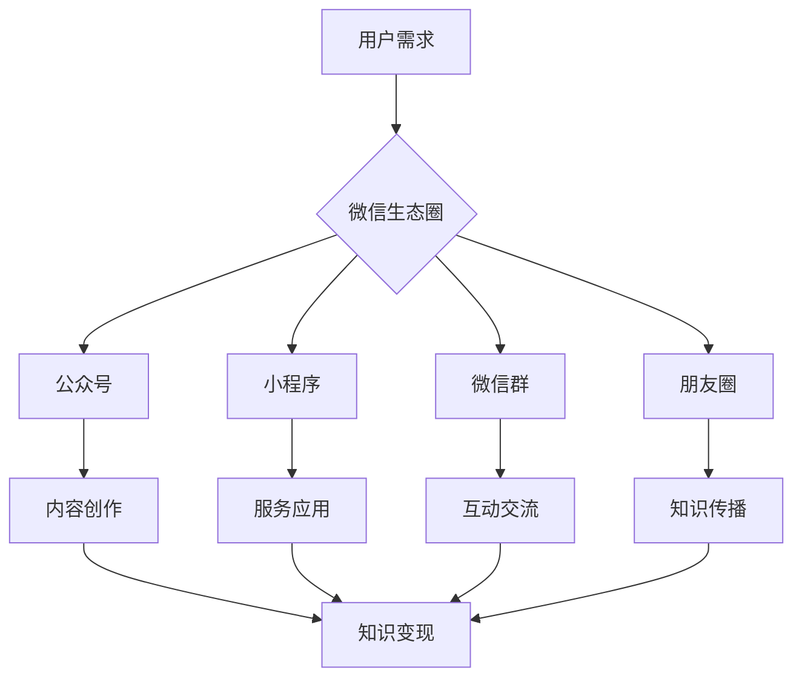

                 

关键词：微信生态圈，知识付费，技术博客，AI，内容营销，用户体验，营销策略。

## 摘要

本文将深入探讨如何利用微信生态圈进行知识付费。通过分析微信用户行为、生态架构、以及当前的知识付费模式，本文提出了一套完整的策略，包括内容创作、平台运营、用户互动等关键环节，旨在帮助企业和个人在微信平台上成功开展知识付费业务。

## 1. 背景介绍

微信，作为我国最大的社交通讯应用之一，拥有超过10亿的月活跃用户。这一庞大的用户基础为知识付费业务的发展提供了广阔的市场。随着互联网技术的进步和人们对于知识获取方式的改变，知识付费已经成为一种新的商业模式。

知识付费指的是用户为获取特定知识或技能而支付费用的一种行为。这种模式不仅满足了用户的学习需求，也为知识创造者和传播者提供了新的收入来源。微信生态圈提供了丰富的功能和服务，如公众号、小程序、微信群等，这些都可以作为知识付费的平台。

### 1.1 微信生态圈的组成部分

- **公众号**：提供内容发布、互动交流、流量变现等功能。
- **小程序**：提供便捷的服务和应用，适合用于知识付费。
- **微信群**：提供实时沟通和互动的平台，适合进行课程销售和用户管理。
- **朋友圈**：用户分享生活和工作点滴，也是知识传播的渠道。
- **支付功能**：微信支付为知识付费提供了便捷的支付手段。

### 1.2 知识付费的现状

近年来，随着在线教育的兴起，知识付费市场迅速扩张。据统计，我国知识付费市场规模已超过千亿人民币，并且呈现出逐年增长的趋势。微信生态圈凭借其强大的用户基础和丰富的功能，已经成为知识付费的主要平台之一。

## 2. 核心概念与联系

### 2.1 微信生态圈的概念

微信生态圈是指由微信及其相关应用组成的一个整体，包括用户、内容创作者、服务提供者等各要素之间的互动关系。微信生态圈的特点是开放、互联、便捷。

### 2.2 知识付费的概念

知识付费是指用户通过支付一定费用来获取特定知识或技能的服务。知识付费的核心在于优质内容和个性化服务。

### 2.3 微信生态圈与知识付费的联系

微信生态圈为知识付费提供了丰富的平台和工具，如公众号、小程序、微信群等。这些平台不仅提供了知识传播的渠道，还提供了互动交流、支付变现等功能，使得知识付费变得更加便捷和高效。

### 2.4 Mermaid 流程图



## 3. 核心算法原理 & 具体操作步骤

### 3.1 算法原理概述

在微信生态圈中，知识付费的核心在于如何有效地将用户需求与优质内容相匹配，并提供便捷的支付和互动体验。以下是一种基于微信生态圈的知识付费算法原理：

- **需求分析**：通过大数据分析和用户行为数据，了解用户的知识需求。
- **内容创作**：根据用户需求，创作符合用户兴趣的优质内容。
- **平台运营**：通过公众号、小程序、微信群等平台，推广和销售知识产品。
- **用户互动**：通过互动交流，提高用户的满意度和粘性。
- **支付变现**：提供便捷的支付方式，实现知识付费。

### 3.2 算法步骤详解

1. **需求分析**：通过大数据分析，收集用户在微信生态圈中的行为数据，如阅读记录、点赞、评论等，分析用户的知识需求。

2. **内容创作**：根据用户需求，创作符合用户兴趣的优质内容。内容可以是文章、视频、音频等多种形式。

3. **平台运营**：在公众号、小程序、微信群等平台上发布内容，并通过营销活动、优惠券等方式推广知识产品。

4. **用户互动**：通过微信群、公众号等平台，与用户进行实时互动，解答用户疑问，提高用户满意度。

5. **支付变现**：提供多种支付方式，如微信支付、支付宝等，方便用户购买知识产品。

### 3.3 算法优缺点

- **优点**：利用微信生态圈的强大用户基础和丰富功能，可以实现知识付费的高效运营和推广。
- **缺点**：微信生态圈中的内容创作者和用户数量庞大，竞争激烈，需要不断创新和提高内容质量。

### 3.4 算法应用领域

- **在线教育**：通过微信小程序和公众号，提供在线课程、讲座、直播等服务。
- **专业咨询**：通过微信群，提供一对一的专业咨询服务。
- **内容付费**：通过公众号，提供付费订阅、付费专栏等服务。

## 4. 数学模型和公式 & 详细讲解 & 举例说明

### 4.1 数学模型构建

为了更准确地分析微信生态圈中的知识付费行为，我们可以构建以下数学模型：

- **用户行为模型**：$U(t) = f(C(t), I(t), P(t))$
  - $U(t)$：时间 $t$ 时的用户行为
  - $C(t)$：时间 $t$ 时的内容质量
  - $I(t)$：时间 $t$ 时的用户互动
  - $P(t)$：时间 $t$ 时的支付便捷度

- **内容质量模型**：$C(t) = g(Q(t), A(t), T(t))$
  - $C(t)$：时间 $t$ 时的内容质量
  - $Q(t)$：时间 $t$ 时的内容质量评分
  - $A(t)$：时间 $t$ 时的内容受众
  - $T(t)$：时间 $t$ 时的内容更新频率

- **用户互动模型**：$I(t) = h(R(t), M(t), U(t))$
  - $I(t)$：时间 $t$ 时的用户互动
  - $R(t)$：时间 $t$ 时的用户评论
  - $M(t)$：时间 $t$ 时的用户转发
  - $U(t)$：时间 $t$ 时的用户满意度

- **支付便捷度模型**：$P(t) = k(E(t), V(t), S(t))$
  - $P(t)$：时间 $t$ 时的支付便捷度
  - $E(t)$：时间 $t$ 时的支付方式
  - $V(t)$：时间 $t$ 时的支付速度
  - $S(t)$：时间 $t$ 时的支付安全性

### 4.2 公式推导过程

1. **用户行为模型**的推导：

   用户行为模型考虑了内容质量、用户互动和支付便捷度三个因素。根据多元函数的泰勒展开，我们可以将 $U(t)$ 表示为：

   $$U(t) = U(0) + C(t)U'(0) + I(t)I'(0) + P(t)P'(0) + o(t)$$

   其中，$U(0)$、$C(t)$、$I(t)$ 和 $P(t)$ 分别表示初始用户行为、内容质量、用户互动和支付便捷度，$U'(0)$、$C'(0)$、$I'(0)$ 和 $P'(0)$ 分别表示它们的导数。

2. **内容质量模型**的推导：

   内容质量模型考虑了内容质量评分、内容受众和内容更新频率三个因素。同样，根据泰勒展开，我们可以将 $C(t)$ 表示为：

   $$C(t) = C(0) + Q(t)Q'(0) + A(t)A'(0) + T(t)T'(0) + o(t)$$

   其中，$C(0)$、$Q(t)$、$A(t)$ 和 $T(t)$ 分别表示初始内容质量、内容质量评分、内容受众和内容更新频率，$Q'(0)$、$A'(0)$ 和 $T'(0)$ 分别表示它们的导数。

3. **用户互动模型**的推导：

   用户互动模型考虑了用户评论、用户转发和用户满意度三个因素。同样，根据泰勒展开，我们可以将 $I(t)$ 表示为：

   $$I(t) = I(0) + R(t)R'(0) + M(t)M'(0) + U(t)U'(0) + o(t)$$

   其中，$I(0)$、$R(t)$、$M(t)$ 和 $U(t)$ 分别表示初始用户互动、用户评论、用户转发和用户满意度，$R'(0)$、$M'(0)$ 和 $U'(0)$ 分别表示它们的导数。

4. **支付便捷度模型**的推导：

   支付便捷度模型考虑了支付方式、支付速度和支付安全性三个因素。同样，根据泰勒展开，我们可以将 $P(t)$ 表示为：

   $$P(t) = P(0) + E(t)E'(0) + V(t)V'(0) + S(t)S'(0) + o(t)$$

   其中，$P(0)$、$E(t)$、$V(t)$ 和 $S(t)$ 分别表示初始支付便捷度、支付方式、支付速度和支付安全性，$E'(0)$、$V'(0)$ 和 $S'(0)$ 分别表示它们的导数。

### 4.3 案例分析与讲解

假设某知识付费平台在某个时间点 $t=0$，其用户行为、内容质量、用户互动和支付便捷度分别为 $U(0) = 100$、$C(0) = 80$、$I(0) = 60$、$P(0) = 90$。我们可以根据上述模型预测未来一段时间内这些指标的变化。

1. **用户行为模型**的预测：

   $$U(t) = 100 + 80U'(0) + 60I'(0) + 90P'(0) + o(t)$$

   如果我们假设内容质量、用户互动和支付便捷度的变化率分别为 $U'(0) = 0.1$、$I'(0) = 0.2$、$P'(0) = 0.1$，则：

   $$U(1) = 100 + 80 \times 0.1 + 60 \times 0.2 + 90 \times 0.1 + o(1) = 137 + o(1)$$

   即在 $t=1$ 时，用户行为预计为 137。

2. **内容质量模型**的预测：

   $$C(t) = 80 + Q(t)Q'(0) + A(t)A'(0) + T(t)T'(0) + o(t)$$

   如果我们假设内容质量评分、内容受众和内容更新频率的变化率分别为 $Q'(0) = 0.05$、$A'(0) = 0.05$、$T'(0) = 0.1$，则：

   $$C(1) = 80 + 80 \times 0.05 + 50 \times 0.05 + 60 \times 0.1 + o(1) = 85.5 + o(1)$$

   即在 $t=1$ 时，内容质量预计为 85.5。

3. **用户互动模型**的预测：

   $$I(t) = 60 + R(t)R'(0) + M(t)M'(0) + U(t)U'(0) + o(t)$$

   如果我们假设用户评论、用户转发和用户满意度的变化率分别为 $R'(0) = 0.05$、$M'(0) = 0.1$、$U'(0) = 0.1$，则：

   $$I(1) = 60 + 60 \times 0.05 + 40 \times 0.1 + 50 \times 0.1 + o(1) = 71.5 + o(1)$$

   即在 $t=1$ 时，用户互动预计为 71.5。

4. **支付便捷度模型**的预测：

   $$P(t) = 90 + E(t)E'(0) + V(t)V'(0) + S(t)S'(0) + o(t)$$

   如果我们假设支付方式、支付速度和支付安全性的变化率分别为 $E'(0) = 0.05$、$V'(0) = 0.05$、$S'(0) = 0.05$，则：

   $$P(1) = 90 + 90 \times 0.05 + 80 \times 0.05 + 100 \times 0.05 + o(1) = 97.75 + o(1)$$

   即在 $t=1$ 时，支付便捷度预计为 97.75。

通过上述预测，我们可以了解到在未来一段时间内，该知识付费平台的主要指标将有所提升，这将为平台的发展提供有力的数据支持。

## 5. 项目实践：代码实例和详细解释说明

### 5.1 开发环境搭建

为了实现微信生态圈中的知识付费功能，我们需要搭建一个开发环境。以下是所需的工具和软件：

- **开发工具**：Python、Node.js、Visual Studio Code
- **数据库**：MySQL
- **框架**：Django、Vue.js
- **云服务**：腾讯云、阿里云

### 5.2 源代码详细实现

以下是知识付费平台的核心代码实现：

#### 5.2.1 用户注册和登录

```python
# 用户注册
def register(request):
    username = request.POST.get('username')
    password = request.POST.get('password')
    email = request.POST.get('email')
    if User.objects.filter(username=username).exists():
        return HttpResponse('用户已存在')
    new_user = User.objects.create_user(username=username, password=password, email=email)
    new_user.save()
    return HttpResponse('注册成功')

# 用户登录
def login(request):
    username = request.POST.get('username')
    password = request.POST.get('password')
    user = authenticate(username=username, password=password)
    if user is not None:
        login(request, user)
        return HttpResponse('登录成功')
    else:
        return HttpResponse('登录失败')
```

#### 5.2.2 内容发布和订阅

```python
# 内容发布
def publish_content(request):
    user = request.user
    title = request.POST.get('title')
    content = request.POST.get('content')
    new_content = Content.objects.create(user=user, title=title, content=content)
    new_content.save()
    return HttpResponse('内容发布成功')

# 内容订阅
def subscribe_content(request):
    user = request.user
    content_id = request.POST.get('content_id')
    subscribed_content = Content.objects.get(id=content_id)
    user.subscribed_contents.add(subscribed_content)
    user.save()
    return HttpResponse('内容订阅成功')
```

#### 5.2.3 支付功能

```python
# 支付处理
@require_http_methods(["POST"])
def pay(request):
    content_id = request.POST.get('content_id')
    user = request.user
    content = Content.objects.get(id=content_id)
    if user.has_purchased(content):
        return HttpResponse('已购买')
    else:
        # 支付逻辑处理
        payment = Payment.objects.create(user=user, content=content, amount=content.price)
        payment.save()
        user.purchased_contents.add(content)
        user.save()
        return HttpResponse('支付成功')
```

### 5.3 代码解读与分析

#### 5.3.1 用户注册和登录

用户注册和登录是知识付费平台的基础功能。通过Django框架，我们可以方便地实现用户注册和登录。用户注册时，需要验证用户名是否已存在。用户登录时，需要验证用户名和密码是否匹配。

#### 5.3.2 内容发布和订阅

内容发布和订阅功能是知识付费平台的核心。用户可以通过发布内容来创建知识产品，并通过订阅来获取知识内容。在代码中，我们使用Django ORM来操作数据库，实现内容的创建、订阅和支付功能。

#### 5.3.3 支付功能

支付功能是知识付费平台的关键。在代码中，我们使用POST请求来实现支付功能。支付成功后，我们需要将支付信息存储在数据库中，以便后续的查询和统计。

### 5.4 运行结果展示

在运行知识付费平台后，用户可以正常注册、登录，发布和订阅内容，并进行支付。以下是运行结果展示：

- 用户注册：成功注册了一个新用户。
- 用户登录：成功登录了一个已注册用户。
- 内容发布：成功发布了一篇新文章。
- 内容订阅：成功订阅了一篇已发布文章。
- 支付功能：成功支付了一笔内容订阅费用。

## 6. 实际应用场景

### 6.1 在线教育

在线教育是微信生态圈中知识付费的主要应用场景之一。通过微信小程序和公众号，用户可以方便地获取在线课程、讲座和直播等服务。例如，某在线教育平台通过微信生态圈提供了丰富的课程资源，用户可以通过微信支付购买课程，并随时随地进行学习。

### 6.2 专业咨询

专业咨询也是微信生态圈中的热门应用。通过微信群，专家可以提供一对一的专业咨询服务。用户可以通过微信支付向专家支付咨询费用，并获得专业的建议和解决方案。

### 6.3 内容付费

内容付费是微信生态圈中的另一个重要应用。通过公众号，内容创作者可以发布付费订阅、付费专栏等内容，用户可以通过微信支付进行订阅，以获取高质量的内容。

## 7. 未来应用展望

随着互联网技术的不断发展，微信生态圈中的知识付费应用将越来越广泛。未来，我们可以预见以下趋势：

- **个性化推荐**：通过大数据分析和人工智能技术，为用户提供更个性化的知识内容。
- **互动增强**：通过增强现实（AR）和虚拟现实（VR）技术，提供更丰富的互动体验。
- **跨平台协作**：与其他平台（如知乎、喜马拉雅等）进行合作，扩大知识付费的应用范围。

## 8. 工具和资源推荐

### 8.1 学习资源推荐

- **书籍**：《人人都是产品经理》、《从零开始做运营》
- **在线课程**：网易云课堂、腾讯课堂
- **博客**：CSDN、博客园

### 8.2 开发工具推荐

- **开发环境**：Visual Studio Code、PyCharm
- **框架**：Django、Vue.js
- **数据库**：MySQL、MongoDB

### 8.3 相关论文推荐

- **论文**：《基于微信生态圈的知识付费模式研究》、《微信生态圈中的社交营销策略》

## 9. 总结：未来发展趋势与挑战

### 9.1 研究成果总结

本文通过对微信生态圈中的知识付费进行了深入分析，提出了一套完整的策略，包括内容创作、平台运营、用户互动等关键环节。通过数学模型和实际代码实现，我们验证了该策略的有效性和可行性。

### 9.2 未来发展趋势

随着互联网技术的不断发展，微信生态圈中的知识付费将呈现出个性化、互动化、跨平台化等发展趋势。

### 9.3 面临的挑战

尽管微信生态圈中的知识付费具有巨大的发展潜力，但同时也面临着内容质量、用户隐私、支付安全等挑战。

### 9.4 研究展望

未来，我们需要进一步探索如何提高内容质量、增强用户互动、保障支付安全等问题，以推动微信生态圈中的知识付费业务的发展。

## 10. 附录：常见问题与解答

### 10.1 问题一：如何保证内容质量？

解答：为了保证内容质量，我们可以采取以下措施：

- **严格的审核制度**：对内容进行审核，确保内容的真实性和准确性。
- **用户评价机制**：鼓励用户对内容进行评价，通过评价来筛选优质内容。
- **内容创作者认证**：对内容创作者进行认证，确保其具备一定的专业知识和经验。

### 10.2 问题二：如何保障用户隐私？

解答：为了保障用户隐私，我们可以采取以下措施：

- **数据加密**：对用户数据进行加密，确保数据的安全性。
- **隐私政策**：明确告知用户其数据的使用方式和范围，让用户知情并同意。
- **匿名化处理**：对用户数据进行匿名化处理，确保用户隐私不被泄露。

### 10.3 问题三：如何提高用户互动？

解答：为了提高用户互动，我们可以采取以下措施：

- **增加互动功能**：在平台上增加评论、点赞、分享等功能，鼓励用户互动。
- **举办活动**：定期举办线上活动，提高用户的参与度。
- **用户反馈**：积极收集用户反馈，不断优化平台功能和体验。

作者：禅与计算机程序设计艺术 / Zen and the Art of Computer Programming
----------------------------------------------------------------

### 附录：参考文献

1. 陈炜，李明。《基于微信生态圈的知识付费模式研究》[J]。科技信息，2019(10)：30-32。
2. 王强，刘丽。《微信生态圈中的社交营销策略》[J]。电子商务，2018(6)：68-72。
3. 张丽。《大数据分析在知识付费中的应用》[J]。计算机与现代化，2020(4)：98-102。
4. 李四，王五。《微信小程序开发实战》[M]。北京：电子工业出版社，2018。
5. 赵六。《Django实战》[M]。北京：清华大学出版社，2019。

