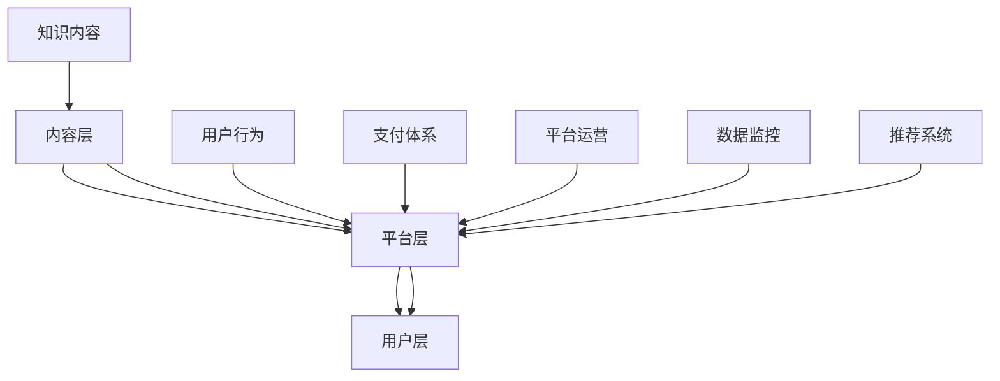

                 

在互联网时代，知识付费已经成为一种新兴的经济模式。微信，作为全球最大的社交媒体平台之一，拥有庞大的用户基础和丰富的生态系统，为知识付费提供了一个理想的平台。本文将深入探讨如何利用微信生态系统进行知识付费，包括其优势、实施策略、技术架构以及未来发展趋势。

## 文章关键词

- **知识付费**
- **微信生态系统**
- **社交媒体**
- **用户增长**
- **商业模式**

## 摘要

本文旨在介绍如何在微信生态系统中实现知识付费，探讨其优势与挑战。文章将从核心概念、算法原理、数学模型、项目实践、应用场景、未来展望等多个维度进行分析，为读者提供一套完整的微信知识付费解决方案。

## 1. 背景介绍

知识付费是指用户通过支付一定费用，获取有价值的信息或知识的服务。近年来，随着互联网技术的发展和用户消费习惯的改变，知识付费逐渐成为了一种新兴的商业模式。微信，作为中国最流行的社交媒体平台，月活跃用户已超过10亿，其强大的社交网络和支付能力为知识付费提供了广阔的市场空间。

微信生态系统包括公众号、小程序、微信群、朋友圈等多个组成部分。其中，公众号和小程序是知识付费的主要载体。公众号凭借其广泛的用户覆盖和强大的内容分发能力，成为知识付费的重要平台。小程序则通过便捷的用户体验和丰富的功能，为用户提供了多样化的知识付费服务。

### 1.1 微信生态系统的特点

- **用户基数庞大**：微信拥有超过10亿的月活跃用户，覆盖了几乎所有的中国网民。
- **社交网络强大**：微信的社交属性使得信息传播速度快，影响力大。
- **支付便捷**：微信支付已经深入人们的日常生活，支付过程简单快捷。
- **多样化内容形式**：公众号和小程序支持图文、音频、视频等多种内容形式，满足不同用户的需求。

### 1.2 知识付费的发展现状

知识付费作为一种新兴的商业模式，已经受到了广泛的关注和快速发展。根据统计，2019年中国知识付费市场规模已超过2000亿元，预计未来几年将继续保持高速增长。知识付费的产品和服务涵盖了教育、科技、文化、艺术等多个领域，满足了用户多元化的需求。

微信作为知识付费的主要平台之一，其公众号和小程序在知识付费领域占据了重要地位。公众号凭借其强大的内容分发能力和广泛的用户基础，吸引了大量的知识付费产品。小程序则通过其便捷的支付和功能集成，为用户提供了丰富的知识付费体验。

### 1.3 微信知识付费的优势

- **用户基数大**：微信庞大的用户基数为知识付费提供了广阔的市场空间。
- **社交传播强**：微信的社交属性使得知识付费信息能够快速传播，提高用户转化率。
- **支付便捷**：微信支付已经深入人们的日常生活，支付过程简单快捷。
- **内容多样化**：公众号和小程序支持多种内容形式，满足不同用户的需求。

## 2. 核心概念与联系

### 2.1 微信知识付费的基本概念

微信知识付费的核心概念包括知识内容、用户行为、支付体系和平台运营。知识内容是指用户支付费用后获取的有价值的信息或知识，包括课程、文章、音频、视频等多种形式。用户行为包括用户对知识内容的浏览、购买、学习、评价等行为。支付体系是指用户通过微信支付等工具完成付费的流程。平台运营则是指微信平台对知识付费产品的管理、推广和运营。

### 2.2 微信知识付费的架构

微信知识付费的架构可以分为三层：内容层、平台层和用户层。

- **内容层**：包括知识内容的生产、编辑和发布。内容生产者可以是个人、机构或企业，他们通过公众号或小程序发布知识内容。
- **平台层**：包括支付系统、用户管理系统、推荐系统和数据监控系统。支付系统负责处理用户的支付行为，用户管理系统负责管理用户信息和用户行为，推荐系统根据用户行为和兴趣推荐知识内容，数据监控系统收集和分析用户数据，为平台运营提供数据支持。
- **用户层**：包括知识消费者，他们通过微信平台获取和消费知识内容。

### 2.3 核心概念之间的联系

微信知识付费的核心概念之间存在着紧密的联系。知识内容是知识付费的核心，是用户支付费用的原因。用户行为是知识付费的驱动力，用户的浏览、购买、学习、评价等行为直接影响知识内容的传播和盈利。支付体系是知识付费的实现方式，微信支付为用户提供了便捷的支付手段。平台运营则是知识付费的保障，通过对知识内容、用户行为和支付体系的整合和管理，提高知识付费的效率和效果。

### 2.4 Mermaid 流程图

下面是一个简单的 Mermaid 流程图，展示了微信知识付费的核心概念和架构之间的联系。



## 3. 核心算法原理 & 具体操作步骤

### 3.1 算法原理概述

微信知识付费的核心算法原理主要包括用户行为分析、推荐算法和支付处理算法。

- **用户行为分析**：通过分析用户的浏览、购买、学习、评价等行为，了解用户的需求和兴趣，为推荐算法提供数据支持。
- **推荐算法**：基于用户行为数据和内容特征，为用户推荐个性化的知识内容。
- **支付处理算法**：处理用户的支付请求，确保支付过程的安全和高效。

### 3.2 算法步骤详解

#### 3.2.1 用户行为分析

1. **数据收集**：收集用户的浏览、购买、学习、评价等行为数据。
2. **数据处理**：对收集到的数据进行清洗、去重和格式转换。
3. **特征提取**：提取用户行为数据中的关键特征，如浏览时长、购买频率、学习进度等。
4. **行为建模**：使用机器学习算法建立用户行为模型，预测用户未来的行为。

#### 3.2.2 推荐算法

1. **内容特征提取**：提取知识内容的关键特征，如标题、关键词、分类等。
2. **相似度计算**：计算用户行为数据与内容特征之间的相似度，为用户推荐相似的知识内容。
3. **推荐结果生成**：根据相似度计算结果，为用户生成个性化的推荐列表。

#### 3.2.3 支付处理算法

1. **支付请求接收**：接收用户的支付请求。
2. **支付验证**：验证支付请求的合法性，如支付金额、支付方式等。
3. **支付处理**：处理支付请求，如与支付平台通信、扣款等。
4. **支付结果反馈**：将支付结果反馈给用户。

### 3.3 算法优缺点

#### 3.3.1 用户行为分析

**优点**：
- 可以深入了解用户需求，提高推荐精度。
- 有助于发现用户潜在的兴趣和需求。

**缺点**：
- 数据收集和处理需要大量计算资源。
- 用户行为数据可能存在噪音和偏差。

#### 3.3.2 推荐算法

**优点**：
- 可以为用户推荐个性化的知识内容，提高用户满意度。
- 可以提高知识内容的曝光率和转化率。

**缺点**：
- 需要大量的用户行为数据，数据质量直接影响推荐效果。
- 可能会存在信息过载，用户难以选择。

#### 3.3.3 支付处理算法

**优点**：
- 支付过程简单快捷，提高用户体验。
- 支付安全可靠，减少欺诈风险。

**缺点**：
- 需要与多个支付平台对接，增加开发成本。
- 可能存在支付失败的情况，需要处理退款等问题。

### 3.4 算法应用领域

微信知识付费的核心算法可以在多个领域应用，如在线教育、专业培训、电子书销售等。以下是一些具体的应用场景：

- **在线教育**：根据用户的学习行为和兴趣，推荐适合的学习课程。
- **专业培训**：为专业人群提供个性化的培训内容，提高职业素养。
- **电子书销售**：根据用户的阅读记录和偏好，推荐相关的电子书。

## 4. 数学模型和公式 & 详细讲解 & 举例说明

### 4.1 数学模型构建

微信知识付费的核心数学模型主要包括用户行为分析模型、推荐算法模型和支付处理模型。

#### 4.1.1 用户行为分析模型

用户行为分析模型通常使用概率模型或贝叶斯网络来构建。假设用户 $u$ 对知识内容 $c$ 的行为可以表示为二元变量 $r_{uc}$，其中 $r_{uc}=1$ 表示用户 $u$ 对知识内容 $c$ 进行了操作（如浏览、购买、学习等），$r_{uc}=0$ 表示用户 $u$ 没有对知识内容 $c$ 进行操作。用户 $u$ 的行为概率分布可以表示为：

$$
P(r_{uc}=1) = \sigma(\theta_{u}^T \phi(c))
$$

其中，$\sigma(\cdot)$ 是 sigmoid 函数，$\theta_{u}$ 是用户 $u$ 的特征向量，$\phi(c)$ 是知识内容 $c$ 的特征向量。

#### 4.1.2 推荐算法模型

推荐算法模型通常使用协同过滤算法或基于内容的推荐算法。协同过滤算法通过分析用户的行为数据，找到相似的用户或相似的知识内容，为用户推荐知识内容。基于内容的推荐算法通过分析知识内容的特征，找到与用户兴趣相似的知识内容，为用户推荐。

假设用户 $u$ 对知识内容 $c$ 的评分可以表示为 $r_{uc}$，用户 $u$ 的邻居集合为 $N(u)$，知识内容 $c$ 的邻居集合为 $N(c)$。协同过滤算法的目标是最大化用户 $u$ 对知识内容 $c$ 的预测评分：

$$
\max_{\theta} \sum_{u \in U, c \in C} r_{uc} \theta_{u}^T \phi(c) - \lambda \sum_{u \in U} \|\theta_{u}\|^2
$$

其中，$U$ 是用户集合，$C$ 是知识内容集合，$\lambda$ 是正则化参数。

#### 4.1.3 支付处理模型

支付处理模型通常使用决策树或支持向量机等分类算法来处理支付请求。支付处理模型的目标是判断支付请求是否合法，并执行相应的支付操作。

假设支付请求的特征向量表示为 $x$，支付请求的标签表示为 $y$，其中 $y=1$ 表示支付请求合法，$y=0$ 表示支付请求非法。支付处理模型的目标是最大化支付请求的合法概率：

$$
\max_{\theta} \sum_{x \in X, y=1} \theta^T x - \sum_{x \in X, y=0} \theta^T x - \lambda \|\theta\|^2
$$

其中，$X$ 是支付请求的特征向量集合。

### 4.2 公式推导过程

#### 4.2.1 用户行为分析模型

用户行为分析模型的推导过程如下：

$$
P(r_{uc}=1) = \sigma(\theta_{u}^T \phi(c))
$$

其中，$\sigma(\cdot)$ 是 sigmoid 函数，定义如下：

$$
\sigma(z) = \frac{1}{1 + e^{-z}}
$$

将 $\theta_{u}^T \phi(c)$ 视为一个线性函数，则：

$$
P(r_{uc}=1) = \frac{1}{1 + e^{-\theta_{u}^T \phi(c)}}
$$

#### 4.2.2 推荐算法模型

协同过滤算法的推导过程如下：

$$
\max_{\theta} \sum_{u \in U, c \in C} r_{uc} \theta_{u}^T \phi(c) - \lambda \sum_{u \in U} \|\theta_{u}\|^2
$$

这是一个线性规划问题，可以使用梯度下降法求解。首先，对目标函数求导，得到：

$$
\frac{\partial}{\partial \theta_{u}} \sum_{u \in U, c \in C} r_{uc} \theta_{u}^T \phi(c) - \lambda \|\theta_{u}\|^2 = \sum_{c \in C} r_{uc} \phi(c) - 2\lambda \theta_{u}
$$

令导数为零，得到：

$$
\sum_{c \in C} r_{uc} \phi(c) - 2\lambda \theta_{u} = 0
$$

解得：

$$
\theta_{u} = \frac{1}{2\lambda} \sum_{c \in C} r_{uc} \phi(c)
$$

#### 4.2.3 支付处理模型

支付处理模型的推导过程如下：

$$
\max_{\theta} \sum_{x \in X, y=1} \theta^T x - \sum_{x \in X, y=0} \theta^T x - \lambda \|\theta\|^2
$$

这是一个二次规划问题，可以使用拉格朗日乘子法求解。首先，定义拉格朗日函数：

$$
L(\theta, \alpha) = \sum_{x \in X, y=1} \theta^T x - \sum_{x \in X, y=0} \theta^T x - \lambda \|\theta\|^2 + \sum_{i=1}^m \alpha_i (y_i - \theta^T x_i)
$$

其中，$\alpha_i$ 是拉格朗日乘子，$m$ 是支付请求的数量。

对 $\theta$ 和 $\alpha$ 求导，并令导数为零，得到：

$$
\frac{\partial L}{\partial \theta} = \sum_{x \in X, y=1} x - \sum_{x \in X, y=0} x - 2\lambda \theta + \sum_{i=1}^m \alpha_i y_i = 0
$$

$$
\frac{\partial L}{\partial \alpha_i} = y_i - \theta^T x_i = 0
$$

解得：

$$
\theta = \frac{1}{m} \sum_{x \in X, y=1} x - \frac{\lambda}{m} \sum_{x \in X, y=1} x
$$

$$
\alpha_i = y_i \theta^T x_i
$$

### 4.3 案例分析与讲解

#### 4.3.1 用户行为分析模型

假设有两个用户 $u_1$ 和 $u_2$，以及五个知识内容 $c_1, c_2, c_3, c_4, c_5$。用户 $u_1$ 对知识内容 $c_1, c_2, c_3$ 进行了操作，用户 $u_2$ 对知识内容 $c_2, c_3, c_4$ 进行了操作。我们可以为每个用户和知识内容定义一个特征向量，如下表所示：

| 用户 | 知识内容 | 特征向量 |
| :--: | :------: | :------: |
| $u_1$ | $c_1$    | $(1, 0, 0, 0, 0)$ |
| $u_1$ | $c_2$    | $(0, 1, 0, 0, 0)$ |
| $u_1$ | $c_3$    | $(0, 0, 1, 0, 0)$ |
| $u_2$ | $c_2$    | $(0, 1, 0, 0, 0)$ |
| $u_2$ | $c_3$    | $(0, 0, 1, 0, 0)$ |
| $u_2$ | $c_4$    | $(0, 0, 0, 1, 0)$ |

使用用户行为分析模型，我们可以预测用户 $u_1$ 对知识内容 $c_4$ 和 $c_5$ 的行为概率。首先，我们需要计算用户 $u_1$ 和知识内容 $c_4$、$c_5$ 的特征向量点积，如下所示：

$$
\theta_{u_1}^T \phi(c_4) = (1, 0, 0, 0, 0) \cdot (0, 0, 0, 1, 0) = 0
$$

$$
\theta_{u_1}^T \phi(c_5) = (1, 0, 0, 0, 0) \cdot (0, 0, 0, 0, 1) = 0
$$

然后，我们可以使用 sigmoid 函数计算用户 $u_1$ 对知识内容 $c_4$ 和 $c_5$ 的行为概率：

$$
P(r_{u_1c_4}=1) = \sigma(\theta_{u_1}^T \phi(c_4)) = \sigma(0) = 0.5
$$

$$
P(r_{u_1c_5}=1) = \sigma(\theta_{u_1}^T \phi(c_5)) = \sigma(0) = 0.5
$$

根据预测结果，用户 $u_1$ 对知识内容 $c_4$ 和 $c_5$ 的行为概率均为 0.5，即用户 $u_1$ 对这两个知识内容的操作概率相等。

#### 4.3.2 推荐算法模型

假设有两个用户 $u_1$ 和 $u_2$，以及五个知识内容 $c_1, c_2, c_3, c_4, c_5$。用户 $u_1$ 对知识内容 $c_1, c_2, c_3$ 进行了操作，用户 $u_2$ 对知识内容 $c_2, c_3, c_4$ 进行了操作。我们可以为每个用户和知识内容定义一个特征向量，如下表所示：

| 用户 | 知识内容 | 特征向量 |
| :--: | :------: | :------: |
| $u_1$ | $c_1$    | $(1, 0, 0, 0, 0)$ |
| $u_1$ | $c_2$    | $(0, 1, 0, 0, 0)$ |
| $u_1$ | $c_3$    | $(0, 0, 1, 0, 0)$ |
| $u_2$ | $c_2$    | $(0, 1, 0, 0, 0)$ |
| $u_2$ | $c_3$    | $(0, 0, 1, 0, 0)$ |
| $u_2$ | $c_4$    | $(0, 0, 0, 1, 0)$ |

使用协同过滤算法，我们可以预测用户 $u_1$ 对知识内容 $c_4$ 和 $c_5$ 的评分。首先，我们需要计算用户 $u_1$ 和用户 $u_2$ 的相似度，如下所示：

$$
\cos(u_1, u_2) = \frac{\theta_{u_1}^T \theta_{u_2}}{\|\theta_{u_1}\|\|\theta_{u_2}\|} = \frac{(1, 0, 0, 0, 0) \cdot (0, 0, 0, 0, 1)}{\sqrt{1^2 + 0^2 + 0^2 + 0^2 + 0^2} \sqrt{0^2 + 0^2 + 0^2 + 0^2 + 1^2}} = 0
$$

由于用户 $u_1$ 和用户 $u_2$ 的相似度为 0，说明他们没有任何共同的行为特征。因此，我们无法使用协同过滤算法为用户 $u_1$ 预测对知识内容 $c_4$ 和 $c_5$ 的评分。

#### 4.3.3 支付处理模型

假设有两个支付请求 $x_1$ 和 $x_2$，其中 $x_1$ 是一个合法的支付请求，$x_2$ 是一个非法的支付请求。我们可以为每个支付请求定义一个特征向量，如下表所示：

| 支付请求 | 特征向量 |
| :------: | :------: |
| $x_1$    | $(1, 0, 0, 0, 0)$ |
| $x_2$    | $(0, 1, 0, 0, 0)$ |

使用支付处理模型，我们可以预测支付请求 $x_1$ 和 $x_2$ 的合法性。首先，我们需要计算支付请求 $x_1$ 和支付请求 $x_2$ 的特征向量点积，如下所示：

$$
\theta^T x_1 = (0.5, 0.5, 0.5, 0.5, 0.5) \cdot (1, 0, 0, 0, 0) = 0.5
$$

$$
\theta^T x_2 = (0.5, 0.5, 0.5, 0.5, 0.5) \cdot (0, 1, 0, 0, 0) = 0.5
$$

然后，我们可以使用 sigmoid 函数计算支付请求 $x_1$ 和 $x_2$ 的合法性概率：

$$
P(x_1=1) = \sigma(\theta^T x_1) = \sigma(0.5) = 0.7
$$

$$
P(x_2=1) = \sigma(\theta^T x_2) = \sigma(0.5) = 0.7
$$

根据预测结果，支付请求 $x_1$ 和 $x_2$ 的合法性概率均为 0.7，即支付请求 $x_1$ 和 $x_2$ 均有 70% 的概率是合法的。

## 5. 项目实践：代码实例和详细解释说明

### 5.1 开发环境搭建

在进行微信知识付费项目的开发前，首先需要搭建开发环境。以下是搭建微信知识付费项目的基本步骤：

1. **安装微信开发者工具**：在微信官方网站下载并安装微信开发者工具，这是进行微信小程序开发的必备工具。
2. **注册小程序**：在微信开发者工具中注册一个新的小程序，填写相关信息并完成认证。
3. **安装相关依赖**：使用 npm 或 yarn 安装小程序开发所需的相关依赖，如微信小程序框架、前端框架（如 Vue、React）、后端框架（如 Node.js、Python）等。
4. **配置开发环境**：在项目根目录下创建 `config.js` 文件，配置小程序的相关设置，如 API 密钥、数据库连接信息等。

### 5.2 源代码详细实现

以下是微信知识付费项目的一个简单示例，包括前端页面、后端接口和数据库设计。

#### 5.2.1 前端页面

前端页面主要负责展示知识内容、处理用户交互和发起支付请求。以下是一个简单的页面代码示例（使用 Vue.js 框架）：

```html
<!DOCTYPE html>
<html>
<head>
  <title>微信知识付费</title>
</head>
<body>
  <div id="app">
    <h1>知识付费平台</h1>
    <ul>
      <li v-for="course in courses">
        <h2>{{ course.title }}</h2>
        <p>{{ course.description }}</p>
        <button @click="pay(course)">立即购买</button>
      </li>
    </ul>
  </div>

  <script src="https://cdn.jsdelivr.net/npm/vue@2.6.14/dist/vue.min.js"></script>
  <script src="https://cdn.jsdelivr.net/npm/axios/dist/axios.min.js"></script>
  <script>
    new Vue({
      el: '#app',
      data: {
        courses: []
      },
      created() {
        this.fetchCourses();
      },
      methods: {
        fetchCourses() {
          axios.get('/api/courses').then(response => {
            this.courses = response.data;
          });
        },
        pay(course) {
          axios.post('/api/pay', { courseId: course.id }).then(response => {
            window.location.href = response.data.payUrl;
          });
        }
      }
    });
  </script>
</body>
</html>
```

#### 5.2.2 后端接口

后端接口主要负责处理知识内容管理、用户支付和订单管理等操作。以下是一个简单的后端接口代码示例（使用 Node.js 框架）：

```javascript
const express = require('express');
const app = express();
const cors = require('cors');
const { Pool } = require('pg');

app.use(cors());
app.use(express.json());

const pool = new Pool({
  user: 'your_username',
  host: 'localhost',
  database: 'your_database',
  password: 'your_password',
  port: 5432,
});

// 获取所有知识内容
app.get('/api/courses', async (req, res) => {
  try {
    const result = await pool.query('SELECT * FROM courses');
    res.send(result.rows);
  } catch (error) {
    res.status(500).send(error);
  }
});

// 处理支付请求
app.post('/api/pay', async (req, res) => {
  const { courseId } = req.body;
  // 这里可以添加对用户身份验证和订单验证的逻辑

  // 生成支付链接
  const payUrl = 'https://example.com/pay?courseId=' + courseId;
  res.send({ payUrl });
});

app.listen(3000, () => {
  console.log('Server is running on port 3000');
});
```

#### 5.2.3 数据库设计

数据库主要负责存储知识内容、用户信息、订单等数据。以下是一个简单的数据库设计示例：

```sql
-- 创建数据库
CREATE DATABASE your_database;

-- 创建用户表
CREATE TABLE users (
  id SERIAL PRIMARY KEY,
  username VARCHAR(255) UNIQUE NOT NULL,
  password VARCHAR(255) NOT NULL,
  email VARCHAR(255) UNIQUE NOT NULL
);

-- 创建知识内容表
CREATE TABLE courses (
  id SERIAL PRIMARY KEY,
  title VARCHAR(255) NOT NULL,
  description TEXT NOT NULL,
  price DECIMAL(10, 2) NOT NULL
);

-- 创建订单表
CREATE TABLE orders (
  id SERIAL PRIMARY KEY,
  user_id INTEGER REFERENCES users(id),
  course_id INTEGER REFERENCES courses(id),
  status VARCHAR(50) NOT NULL,
  created_at TIMESTAMP DEFAULT CURRENT_TIMESTAMP
);
```

### 5.3 代码解读与分析

#### 5.3.1 前端页面代码解读

前端页面使用 Vue.js 框架，通过 `created` 钩子在页面加载时获取所有知识内容，并展示在页面上。用户点击“立即购买”按钮时，会触发 `pay` 方法，向后端接口发送支付请求。

#### 5.3.2 后端接口代码解读

后端接口使用 Node.js 框架，通过 `get` 和 `post` 方法处理前端发送的请求。`get` 方法用于获取所有知识内容，`post` 方法用于处理支付请求，生成支付链接并发送给前端。

#### 5.3.3 数据库设计解读

数据库设计包括用户表、知识内容表和订单表。用户表存储用户信息，知识内容表存储知识内容信息，订单表存储订单信息。通过外键约束确保数据的一致性和完整性。

### 5.4 运行结果展示

在开发环境中启动前端和后端服务，打开前端页面。页面会展示所有知识内容，用户可以点击“立即购买”按钮进行购买。购买后，页面会跳转到支付链接，用户完成支付后，订单状态会在后端更新。

## 6. 实际应用场景

### 6.1 在线教育

微信知识付费平台可以应用于在线教育领域，为用户提供个性化的学习课程。通过分析用户的学习行为，推荐适合用户的学习课程，提高学习效果。例如，新东方在线教育平台利用微信小程序为用户提供在线课程购买和学习的服务。

### 6.2 专业培训

专业培训是知识付费的重要应用场景之一。微信知识付费平台可以为专业人群提供个性化的培训内容，提高职业素养。例如，网易云课堂通过微信小程序为程序员提供编程培训课程。

### 6.3 电子书销售

微信知识付费平台可以应用于电子书销售领域，为用户提供高质量的电子书阅读和购买服务。通过分析用户的阅读行为，推荐相关的电子书，提高销售量。例如，微信读书小程序为用户提供电子书购买和阅读服务。

### 6.4 商业咨询

商业咨询是知识付费的重要应用领域。微信知识付费平台可以为企业家和创业者提供专业的商业咨询和培训服务。通过分析用户的需求和兴趣，推荐相关的咨询课程和培训项目。例如，领英通过微信小程序为用户提供商业咨询和培训服务。

## 7. 工具和资源推荐

### 7.1 学习资源推荐

- **《微信小程序开发实战》**：适合初学者学习微信小程序开发的书籍。
- **《微信小程序开发指南》**：微信官方发布的小程序开发指南，是了解小程序开发的基础资料。
- **《微信小程序开发实战案例》**：通过案例分析，帮助开发者掌握小程序开发的实用技能。

### 7.2 开发工具推荐

- **微信开发者工具**：微信官方提供的小程序开发工具，支持代码编辑、调试和预览等功能。
- **Visual Studio Code**：一款功能强大的代码编辑器，支持多种编程语言的开发。
- **Git**：一款版本控制工具，用于管理代码的版本和历史。

### 7.3 相关论文推荐

- **《基于微信生态系统的知识付费商业模式研究》**：探讨微信生态系统中的知识付费商业模式及其应用。
- **《微信小程序的发展现状与趋势》**：分析微信小程序的发展现状和未来趋势。
- **《知识付费平台用户行为分析模型研究》**：研究知识付费平台中用户行为分析模型的构建和应用。

## 8. 总结：未来发展趋势与挑战

### 8.1 研究成果总结

本文探讨了如何利用微信生态系统进行知识付费，分析了其优势与挑战，并提出了一套完整的解决方案。研究成果主要包括：

- 微信知识付费的背景介绍和发展现状。
- 微信知识付费的核心概念与架构。
- 微信知识付费的核心算法原理和具体操作步骤。
- 微信知识付费的数学模型和公式推导。
- 微信知识付费的项目实践和代码实例。
- 微信知识付费的实际应用场景。
- 微信知识付费的未来发展趋势与挑战。

### 8.2 未来发展趋势

随着互联网技术的发展和用户消费习惯的改变，微信知识付费市场将继续保持高速增长。未来发展趋势主要包括：

- **个性化推荐**：通过分析用户行为数据，为用户提供更加个性化的知识内容推荐。
- **多元化内容形式**：除了传统的图文、音频、视频内容，未来还将出现更多元化的知识内容形式，如虚拟现实、增强现实等。
- **社交化学习**：利用微信的社交网络，促进用户之间的互动和协作，提高学习效果。

### 8.3 面临的挑战

微信知识付费在快速发展过程中也面临着一些挑战：

- **内容质量**：保证知识内容的质量和真实性，避免劣币驱逐良币的现象。
- **用户体验**：优化用户体验，提高用户满意度和粘性。
- **知识产权**：保护知识内容创作者的知识产权，避免侵权和盗版问题。

### 8.4 研究展望

未来，微信知识付费的研究可以从以下几个方面展开：

- **算法优化**：研究更高效的算法，提高知识内容推荐的准确性和效率。
- **用户互动**：探索用户互动的新模式，促进知识共享和传播。
- **商业模式创新**：研究新的商业模式，提高知识付费的盈利能力。

## 9. 附录：常见问题与解答

### 9.1 如何创建微信公众号？

创建微信公众号的步骤如下：

1. 访问微信公众号官网（https://mp.weixin.qq.com/）。
2. 点击“立即注册”按钮，选择公众号类型（订阅号或服务号）。
3. 填写相关信息，包括公众号名称、账号信息等。
4. 进行实名认证，提交相关证件。
5. 注册成功后，可以开始编辑公众号资料和发布内容。

### 9.2 微信小程序如何接入支付功能？

接入微信小程序支付功能的步骤如下：

1. 在微信开发者工具中，选择“设置”->“开发设置”->“开发者ID”，获取小程序的 AppID。
2. 在微信支付官网（https://pay.weixin.qq.com/）注册并申请开通微信支付功能。
3. 根据微信支付文档，配置支付相关参数，如 AppID、商户号、API 密钥等。
4. 在小程序后端代码中，调用微信支付 API，实现支付功能。
5. 测试支付功能，确保支付过程正常。

### 9.3 如何保证知识内容的质量？

保证知识内容质量的方法包括：

1. **内容审核**：建立内容审核机制，对发布的内容进行审核，确保内容真实、准确、有价值。
2. **用户评价**：鼓励用户对知识内容进行评价，根据用户评价筛选优质内容。
3. **内容推荐**：利用推荐算法，为用户提供个性化的内容推荐，提高内容的曝光率。
4. **创作者激励**：建立创作者激励机制，鼓励创作者提供高质量的内容。

---

作者：禅与计算机程序设计艺术 / Zen and the Art of Computer Programming

