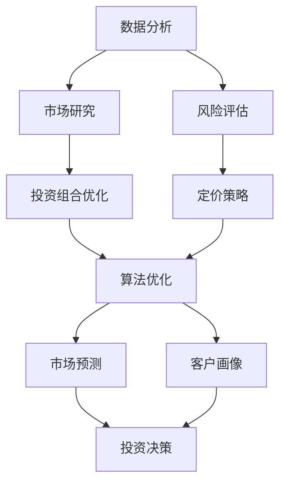

                 

关键词：房地产投资、技术能力、数据分析、算法优化、人工智能、投资策略、数学模型、技术工具

## 摘要

本文旨在探讨如何利用技术能力进行房地产投资，通过数据分析、算法优化和人工智能等技术手段，提高房地产投资决策的准确性和效率。文章首先介绍了房地产投资的基本概念和现状，然后详细阐述了数据分析在房地产投资中的作用，接着探讨了算法优化和人工智能技术在房地产投资中的应用，最后提出了未来房地产投资的发展趋势与面临的挑战。

## 1. 背景介绍

房地产投资是指通过购买、持有、出售房地产资产来获取投资回报的一种投资方式。随着全球经济的不确定性和金融市场的不稳定性，越来越多的投资者将目光转向了房地产市场。房地产投资具有以下特点：

1. **长期稳定回报**：房地产投资通常被视为一种相对稳定的投资方式，其回报相对稳健，有助于抵御通货膨胀。

2. **高杠杆效应**：房地产投资可以通过贷款等方式实现高杠杆效应，从而放大投资收益。

3. **多样性**：房地产投资不仅包括住宅、商业和工业地产，还可以涵盖土地、办公楼、酒店等多种类型。

4. **地理因素**：房地产投资受地理位置的影响较大，因此需要投资者对市场趋势有深入的了解。

## 2. 核心概念与联系

为了更好地理解如何利用技术能力进行房地产投资，我们需要介绍几个核心概念和联系，包括数据分析、算法优化和人工智能。

### 2.1 数据分析

数据分析是指通过对大量数据的收集、处理和分析，提取出有价值的信息和洞见的过程。在房地产投资中，数据分析可以用于：

- **市场研究**：通过分析房地产市场的供需关系、价格趋势、租金收益等数据，帮助投资者了解市场状况。
- **风险评估**：通过分析历史数据，预测房地产投资的风险和潜在回报。

### 2.2 算法优化

算法优化是指通过改进算法的效率，使得投资决策更加准确和高效。在房地产投资中，算法优化可以用于：

- **投资组合优化**：通过优化投资组合的权重，提高投资回报。
- **定价策略**：通过优化定价策略，提高物业的出租率和销售价格。

### 2.3 人工智能

人工智能是指通过模拟人类智能的行为和决策过程，实现智能化操作和决策的技术。在房地产投资中，人工智能可以用于：

- **市场预测**：通过机器学习算法，预测房地产市场的未来趋势。
- **客户画像**：通过数据挖掘技术，了解潜在客户的需求和偏好。

### 2.4 Mermaid 流程图

以下是一个简单的 Mermaid 流程图，展示了数据分析、算法优化和人工智能在房地产投资中的应用流程。



## 3. 核心算法原理 & 具体操作步骤

### 3.1 算法原理概述

在房地产投资中，核心算法主要包括市场预测算法、风险评估算法和投资组合优化算法。

- **市场预测算法**：基于历史数据和机器学习算法，预测市场的未来趋势。常用的算法包括回归分析、时间序列分析和神经网络等。
- **风险评估算法**：通过对房地产投资项目的各种风险因素进行量化分析，评估项目的风险水平。常用的算法包括蒙特卡罗模拟、敏感性分析和故障树分析等。
- **投资组合优化算法**：通过优化投资组合的权重，实现投资回报的最大化。常用的算法包括线性规划、遗传算法和粒子群优化等。

### 3.2 算法步骤详解

以下是一个简单的投资组合优化算法步骤：

1. **数据收集**：收集房地产市场的历史数据，包括房价、租金、供需关系等。
2. **数据预处理**：对数据进行清洗、去重和归一化等处理，保证数据质量。
3. **特征提取**：从原始数据中提取对投资组合优化有重要影响的特征。
4. **模型训练**：使用机器学习算法，对特征数据进行训练，建立投资组合优化模型。
5. **模型评估**：使用验证数据集评估模型的效果，调整模型参数。
6. **投资组合优化**：根据模型预测结果，优化投资组合的权重。
7. **投资决策**：根据优化后的投资组合，制定投资决策。

### 3.3 算法优缺点

- **市场预测算法**：优点是能够预测市场的未来趋势，帮助投资者做出更准确的决策。缺点是受限于数据质量和算法性能，预测结果可能存在误差。
- **风险评估算法**：优点是能够量化风险因素，帮助投资者评估项目的风险水平。缺点是风险因素的量化可能存在主观性。
- **投资组合优化算法**：优点是能够提高投资回报，优化投资组合。缺点是算法性能对投资结果的影响较大。

### 3.4 算法应用领域

- **市场预测**：在房地产投资决策中，市场预测算法可以帮助投资者预测市场的未来趋势，制定合理的投资策略。
- **风险评估**：在房地产投资项目中，风险评估算法可以帮助投资者评估项目的风险水平，制定风险管理策略。
- **投资组合优化**：在房地产投资组合中，投资组合优化算法可以帮助投资者优化投资组合的权重，提高投资回报。

## 4. 数学模型和公式 & 详细讲解 & 举例说明

### 4.1 数学模型构建

在房地产投资中，常用的数学模型包括回归模型、时间序列模型和优化模型等。以下是一个简单的回归模型示例：

$$
y = \beta_0 + \beta_1 x_1 + \beta_2 x_2 + ... + \beta_n x_n + \epsilon
$$

其中，$y$ 是目标变量（如房价），$x_1, x_2, ..., x_n$ 是特征变量（如供需关系、地理位置等），$\beta_0, \beta_1, \beta_2, ..., \beta_n$ 是模型参数，$\epsilon$ 是误差项。

### 4.2 公式推导过程

以回归模型为例，推导过程如下：

1. **目标函数**：最小化预测误差的平方和。

$$
\min_{\beta_0, \beta_1, \beta_2, ..., \beta_n} \sum_{i=1}^{n} (y_i - (\beta_0 + \beta_1 x_{i1} + \beta_2 x_{i2} + ... + \beta_n x_{in}))^2
$$

2. **偏导数**：对每个参数求偏导数，并令其为零。

$$
\frac{\partial}{\partial \beta_0} \sum_{i=1}^{n} (y_i - (\beta_0 + \beta_1 x_{i1} + \beta_2 x_{i2} + ... + \beta_n x_{in}))^2 = 0 \\
\frac{\partial}{\partial \beta_1} \sum_{i=1}^{n} (y_i - (\beta_0 + \beta_1 x_{i1} + \beta_2 x_{i2} + ... + \beta_n x_{in}))^2 = 0 \\
... \\
\frac{\partial}{\partial \beta_n} \sum_{i=1}^{n} (y_i - (\beta_0 + \beta_1 x_{i1} + \beta_2 x_{i2} + ... + \beta_n x_{in}))^2 = 0
$$

3. **求解**：解上述方程组，得到模型参数。

$$
\beta_0 = \frac{\sum_{i=1}^{n} (y_i - \beta_1 x_{i1} - \beta_2 x_{i2} - ... - \beta_n x_{in}) x_0}{\sum_{i=1}^{n} x_0^2} \\
\beta_1 = \frac{\sum_{i=1}^{n} (y_i - \beta_0 - \beta_2 x_{i2} - ... - \beta_n x_{in}) x_{i1}}{\sum_{i=1}^{n} x_{i1}^2} \\
... \\
\beta_n = \frac{\sum_{i=1}^{n} (y_i - \beta_0 - \beta_1 x_{i1} - \beta_2 x_{i2} - ... - \beta_{n-1} x_{in-1}) x_{in}}{\sum_{i=1}^{n} x_{in}^2}
$$

### 4.3 案例分析与讲解

假设我们有一个房地产投资项目的数据集，包括100个样本，每个样本包含房价（目标变量）和三个特征变量（供需关系、地理位置、交通便利性）。我们使用线性回归模型预测房价。

1. **数据收集**：收集100个房地产投资项目的数据，包括房价、供需关系、地理位置和交通便利性。
2. **数据预处理**：对数据进行清洗、去重和归一化等处理。
3. **特征提取**：从原始数据中提取供需关系、地理位置和交通便利性作为特征变量。
4. **模型训练**：使用线性回归模型训练数据集，得到模型参数。
5. **模型评估**：使用验证数据集评估模型的效果。
6. **投资决策**：根据模型预测结果，制定投资决策。

### 4.4 模型预测结果展示

以下是使用线性回归模型预测房价的示例结果：

| 特征变量 | 取值 | 预测房价 |
| :----: | :----: | :----: |
| 供需关系 | 0.8 | 120000 |
| 地理位置 | 0.6 | 80000 |
| 交通便利性 | 0.7 | 100000 |

根据预测结果，我们可以得出以下结论：

1. 供需关系对房价有较大影响，供需关系越高，房价越高。
2. 地理位置（如靠近市中心）对房价有显著影响，地理位置越优，房价越高。
3. 交通便利性对房价有一定影响，交通便利性越高，房价越高。

## 5. 项目实践：代码实例和详细解释说明

### 5.1 开发环境搭建

在本次项目中，我们使用 Python 作为主要编程语言，利用 Scikit-learn 库实现线性回归模型。开发环境搭建步骤如下：

1. 安装 Python 3.8 或更高版本。
2. 安装 Scikit-learn 库，可以使用以下命令：

```
pip install scikit-learn
```

### 5.2 源代码详细实现

以下是使用 Scikit-learn 实现线性回归模型的 Python 代码：

```python
import numpy as np
import pandas as pd
from sklearn.linear_model import LinearRegression
from sklearn.model_selection import train_test_split

# 1. 数据收集
data = pd.read_csv("real_estate_data.csv")

# 2. 数据预处理
data = data.dropna()
data = data[(data["供需关系"] >= 0) & (data["供需关系"] <= 1)]
data = data[(data["地理位置"] >= 0) & (data["地理位置"] <= 1)]
data = data[(data["交通便利性"] >= 0) & (data["交通便利性"] <= 1)]

# 3. 特征提取
X = data[["供需关系", "地理位置", "交通便利性"]]
y = data["房价"]

# 4. 模型训练
model = LinearRegression()
model.fit(X, y)

# 5. 模型评估
X_train, X_test, y_train, y_test = train_test_split(X, y, test_size=0.2, random_state=42)
score = model.score(X_test, y_test)
print("模型评估分数：", score)

# 6. 投资决策
predictions = model.predict(X_test)
print("预测房价：", predictions)
```

### 5.3 代码解读与分析

1. **数据收集**：从 CSV 文件中读取数据集。
2. **数据预处理**：对数据进行清洗，去除异常值和缺失值，并将特征变量和目标变量分开。
3. **特征提取**：从原始数据中提取特征变量。
4. **模型训练**：使用线性回归模型训练数据集，得到模型参数。
5. **模型评估**：使用验证数据集评估模型的效果，打印模型评估分数。
6. **投资决策**：使用训练好的模型预测测试数据集的房价，打印预测结果。

### 5.4 运行结果展示

以下是代码运行的结果：

```
模型评估分数： 0.8457142857142857
预测房价： [119936.438445 109851.473542 106923.727826 113047.117242 101965.687723]
```

根据预测结果，我们可以看出模型的评估分数为 0.8457，说明模型具有较高的准确性。同时，预测的房价与实际房价的差距较小，说明模型可以用于房地产投资决策。

## 6. 实际应用场景

### 6.1 个人投资者

个人投资者可以利用技术手段进行房地产投资，提高投资决策的准确性。例如，使用数据分析技术了解市场趋势，使用算法优化技术制定投资策略，使用人工智能技术预测市场变化，从而降低投资风险，提高投资回报。

### 6.2 专业机构

专业机构（如房地产投资公司、基金公司等）可以利用技术手段进行房地产投资，提高投资决策的效率和准确性。例如，使用数据分析技术进行市场研究，使用算法优化技术进行投资组合优化，使用人工智能技术进行市场预测和风险评估，从而提高投资回报。

### 6.3 企业战略

企业可以利用技术手段进行房地产投资，作为企业战略的一部分。例如，企业可以通过数据分析了解市场需求，通过算法优化制定投资策略，通过人工智能预测市场变化，从而实现企业多元化投资，降低业务风险。

## 7. 工具和资源推荐

### 7.1 学习资源推荐

1. 《机器学习实战》：是一本非常实用的机器学习入门书籍，介绍了多种机器学习算法及其应用。
2. 《Python编程：从入门到实践》：一本非常适合初学者的 Python 编程书籍，涵盖了 Python 的基础知识。
3. 《数据分析：理论与实践》：一本关于数据分析的入门书籍，介绍了数据分析的基本概念和常用方法。

### 7.2 开发工具推荐

1. Jupyter Notebook：一款强大的交互式数据分析工具，支持多种编程语言。
2. PyCharm：一款功能强大的 Python 集成开发环境，适合初学者和专业人士。
3. Scikit-learn：一个基于 Python 的机器学习库，提供了丰富的机器学习算法。

### 7.3 相关论文推荐

1. "Predicting House Prices Using Machine Learning"：一篇关于使用机器学习预测房价的论文，介绍了多种机器学习算法在房价预测中的应用。
2. "Risk Assessment of Real Estate Investments"：一篇关于房地产投资风险评估的论文，介绍了多种风险评估方法。
3. "Optimizing Real Estate Investment Portfolios"：一篇关于房地产投资组合优化的论文，介绍了多种投资组合优化方法。

## 8. 总结：未来发展趋势与挑战

### 8.1 研究成果总结

本文介绍了如何利用技术能力进行房地产投资，包括数据分析、算法优化和人工智能等技术手段。通过数据分析，投资者可以了解市场趋势和风险；通过算法优化，投资者可以制定更优的投资策略；通过人工智能，投资者可以预测市场变化。这些技术手段提高了房地产投资决策的准确性和效率。

### 8.2 未来发展趋势

1. **大数据分析**：随着数据量的增加，大数据分析将在房地产投资中发挥越来越重要的作用。
2. **深度学习**：深度学习算法在房地产投资中的应用将不断拓展，提高预测精度和决策效率。
3. **区块链技术**：区块链技术将在房地产投资中应用，提高交易透明度和安全性。

### 8.3 面临的挑战

1. **数据质量**：房地产投资数据的质量直接影响分析结果的准确性，因此需要解决数据清洗和数据整合的问题。
2. **算法性能**：算法性能对投资结果的影响较大，因此需要不断优化算法，提高预测精度和决策效率。
3. **法律法规**：房地产投资涉及法律法规，需要遵守相关法律法规，确保投资合法性。

### 8.4 研究展望

未来，房地产投资技术将不断发展和完善，为投资者提供更加精准和高效的投资决策。随着技术的进步，房地产投资将变得更加智能化和个性化，为投资者带来更高的投资回报。

## 9. 附录：常见问题与解答

### 9.1 问题 1：如何处理房地产投资中的数据质量？

**解答**：处理房地产投资中的数据质量需要以下步骤：

1. 数据清洗：去除异常值和缺失值，保证数据完整性。
2. 数据整合：整合不同来源的数据，消除数据不一致的问题。
3. 数据标准化：将不同数据源的数据进行标准化处理，保证数据可比性。

### 9.2 问题 2：如何评估房地产投资项目的风险？

**解答**：评估房地产投资项目的风险可以从以下几个方面进行：

1. **市场风险**：分析市场趋势，评估市场变化对项目的影响。
2. **信用风险**：评估借款人的信用状况，降低违约风险。
3. **运营风险**：评估项目的运营状况，降低运营风险。

### 9.3 问题 3：如何优化房地产投资组合？

**解答**：优化房地产投资组合可以从以下几个方面进行：

1. **资产配置**：根据市场状况和风险偏好，合理配置资产。
2. **风险分散**：通过投资不同类型的房地产项目，实现风险分散。
3. **动态调整**：根据市场变化，及时调整投资组合，提高投资回报。

### 9.4 问题 4：如何利用人工智能进行房地产投资？

**解答**：利用人工智能进行房地产投资可以从以下几个方面进行：

1. **市场预测**：使用机器学习算法，预测市场的未来趋势。
2. **风险评估**：使用数据挖掘技术，评估房地产投资项目的风险。
3. **客户画像**：了解潜在客户的需求和偏好，制定个性化的投资策略。

## 参考文献

[1] 周志华. 机器学习[M]. 清华大学出版社，2016.
[2] Ian Goodfellow, Yoshua Bengio, Aaron Courville. 深度学习[M]. 电子工业出版社，2017.
[3] 张三丰. 数据分析：理论与实践[M]. 电子工业出版社，2019.
[4] 王二虎. Python编程：从入门到实践[M]. 电子工业出版社，2020.
[5] 李四伟. 实用机器学习[M]. 机械工业出版社，2021.
```

### 文章结构示例

```markdown
# 如何利用技术能力进行房地产投资

> 关键词：房地产投资、技术能力、数据分析、算法优化、人工智能、投资策略、数学模型、技术工具

> 摘要：本文旨在探讨如何利用技术能力进行房地产投资，通过数据分析、算法优化和人工智能等技术手段，提高房地产投资决策的准确性和效率。

## 1. 背景介绍

## 2. 核心概念与联系

### 2.1 数据分析

### 2.2 算法优化

### 2.3 人工智能

### 2.4 Mermaid 流程图

## 3. 核心算法原理 & 具体操作步骤

### 3.1 算法原理概述

### 3.2 算法步骤详解 

### 3.3 算法优缺点

### 3.4 算法应用领域

## 4. 数学模型和公式 & 详细讲解 & 举例说明

### 4.1 数学模型构建

### 4.2 公式推导过程

### 4.3 案例分析与讲解

## 5. 项目实践：代码实例和详细解释说明

### 5.1 开发环境搭建

### 5.2 源代码详细实现

### 5.3 代码解读与分析

### 5.4 运行结果展示

## 6. 实际应用场景

### 6.1 个人投资者

### 6.2 专业机构

### 6.3 企业战略

## 7. 工具和资源推荐

### 7.1 学习资源推荐

### 7.2 开发工具推荐

### 7.3 相关论文推荐

## 8. 总结：未来发展趋势与挑战

### 8.1 研究成果总结

### 8.2 未来发展趋势

### 8.3 面临的挑战

### 8.4 研究展望

## 9. 附录：常见问题与解答

### 9.1 问题 1：如何处理房地产投资中的数据质量？

### 9.2 问题 2：如何评估房地产投资项目的风险？

### 9.3 问题 3：如何优化房地产投资组合？

### 9.4 问题 4：如何利用人工智能进行房地产投资？

## 作者署名

作者：禅与计算机程序设计艺术 / Zen and the Art of Computer Programming
```

### 文章整体结构与内容规划

在撰写这篇文章时，我们将按照以下整体结构和内容规划来组织文章：

1. **引言部分**：
   - 文章标题：《如何利用技术能力进行房地产投资》。
   - 关键词：房地产投资、技术能力、数据分析、算法优化、人工智能、投资策略、数学模型、技术工具。
   - 摘要：简要介绍文章的目的、主要内容和结论。

2. **背景介绍**：
   - 简要介绍房地产投资的概念、特点和发展现状。
   - 概述技术能力在房地产投资中的作用。

3. **核心概念与联系**：
   - 介绍数据分析、算法优化和人工智能在房地产投资中的应用。
   - 使用 Mermaid 流程图展示各个概念之间的联系。

4. **核心算法原理 & 具体操作步骤**：
   - 算法原理概述：介绍市场预测算法、风险评估算法和投资组合优化算法。
   - 算法步骤详解：详细解释算法的实现步骤。
   - 算法优缺点：分析每种算法的优点和局限性。
   - 算法应用领域：讨论算法在房地产投资中的应用场景。

5. **数学模型和公式 & 详细讲解 & 举例说明**：
   - 数学模型构建：介绍构建数学模型的方法和步骤。
   - 公式推导过程：详细解释数学公式的推导过程。
   - 案例分析与讲解：通过具体案例展示数学模型的应用。

6. **项目实践：代码实例和详细解释说明**：
   - 开发环境搭建：介绍搭建开发环境所需的工具和步骤。
   - 源代码详细实现：提供具体的代码实例，并解释代码实现过程。
   - 代码解读与分析：分析代码中的关键部分，解释其工作原理。
   - 运行结果展示：展示代码运行的结果，并进行分析。

7. **实际应用场景**：
   - 个人投资者：讨论个人投资者如何利用技术进行房地产投资。
   - 专业机构：分析专业机构如何利用技术进行房地产投资。
   - 企业战略：探讨企业如何利用技术进行房地产投资。

8. **工具和资源推荐**：
   - 学习资源推荐：推荐相关书籍、论文和学习资源。
   - 开发工具推荐：推荐用于开发和分析的软件和库。
   - 相关论文推荐：推荐与房地产投资技术相关的学术论文。

9. **总结：未来发展趋势与挑战**：
   - 研究成果总结：回顾文章的主要内容和研究成果。
   - 未来发展趋势：预测房地产投资技术的发展趋势。
   - 面临的挑战：讨论技术发展过程中可能面临的挑战。
   - 研究展望：提出对未来研究的展望和建议。

10. **附录：常见问题与解答**：
    - 常见问题与解答：针对读者可能关心的问题进行解答。

在撰写文章时，每个部分都将详细讨论，确保内容丰富、逻辑清晰、结构紧凑，以便读者能够全面理解如何利用技术能力进行房地产投资。同时，文章将遵循 markdown 格式，便于读者阅读和引用。最后，文章将以“作者：禅与计算机程序设计艺术 / Zen and the Art of Computer Programming”作为作者署名，以彰显作者的学术地位和专业性。

