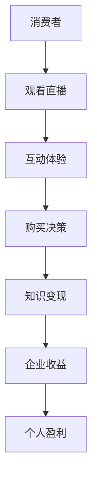

                 

直播带货作为一种新兴的电商模式，正迅速改变着消费者的购物习惯和企业的营销策略。与此同时，知识变现作为知识经济时代的重要趋势，正逐步受到各行各业的关注。本文将探讨如何利用直播带货实现知识变现，为企业和个人提供一种新的盈利模式。

## 关键词
- 直播带货
- 知识变现
- 电商模式
- 营销策略
- 知识经济

## 摘要
本文从直播带货的背景和知识变现的概念出发，分析了直播带货与知识变现的内在联系。随后，通过实际案例和数据分析，探讨了利用直播带货实现知识变现的多种策略和方法。最后，本文对未来直播带货和知识变现的发展趋势进行了展望。

## 1. 背景介绍
### 直播带货的兴起
直播带货作为一种新兴的电商模式，起源于2016年的中国，随后在全球范围内迅速推广。直播带货利用直播平台的实时互动性，将商品展示、销售和用户互动相结合，极大地提高了用户的购物体验和购买意愿。据数据显示，直播带货已成为电商市场的重要驱动力，并在2020年达到了前所未有的高峰。

### 知识变现的概念
知识变现是指将个人或企业的知识、技能、经验等无形资产转化为经济利益的过程。随着知识经济时代的到来，知识变现已成为企业转型升级和个人职业发展的关键。通过知识变现，个人和企业可以拓展新的收入来源，实现持续盈利。

## 2. 核心概念与联系
### 直播带货与知识变现的联系
直播带货与知识变现之间存在密切的联系。直播带货作为一种新兴的电商模式，不仅改变了消费者的购物习惯，也为知识变现提供了新的平台。知识变现通过直播带货实现了知识的传播和价值的转化，为企业和个人带来了新的商机。

### Mermaid 流程图


## 3. 核心算法原理 & 具体操作步骤

### 3.1 算法原理概述
直播带货实现知识变现的核心算法原理在于利用大数据分析和人工智能技术，对用户行为进行精准分析和个性化推荐。通过分析用户的购物记录、浏览历史、评论反馈等数据，企业可以了解用户的需求和偏好，进而提供个性化的直播内容和商品推荐。

### 3.2 算法步骤详解
#### 3.2.1 数据收集与预处理
首先，需要收集消费者的购物数据、浏览数据、评论数据等。然后，对这些数据进行清洗和预处理，确保数据的质量和完整性。

#### 3.2.2 用户行为分析
利用大数据分析技术，对用户的行为数据进行挖掘和分析，识别用户的兴趣和需求。

#### 3.2.3 直播内容个性化推荐
根据用户的行为数据和兴趣标签，为每个用户推荐个性化的直播内容。

#### 3.2.4 商品个性化推荐
结合用户的行为数据和商品属性数据，为用户推荐符合其需求的商品。

### 3.3 算法优缺点
#### 优点
- 提高用户购物体验和购买意愿
- 提高企业的销售转化率和收益
- 有助于知识的传播和价值的转化

#### 缺点
- 需要大量数据支持和强大的计算能力
- 需要专业人员进行算法开发和优化

### 3.4 算法应用领域
直播带货实现知识变现的算法原理和应用领域广泛，包括但不限于以下几个方面：
- 电商领域：通过直播带货实现商品销售和品牌推广
- 教育领域：通过直播课程实现知识传播和学员收益
- 咨询领域：通过直播咨询实现专业知识和咨询服务
- 健康领域：通过直播带货实现健康产品和医疗服务

## 4. 数学模型和公式 & 详细讲解 & 举例说明
### 4.1 数学模型构建
直播带货实现知识变现的数学模型主要涉及用户行为分析和商品推荐算法。以下是一个简化的数学模型：

$$
User\_Score = f(User\_Behavior, Item\_Features)
$$

其中，$User\_Behavior$ 表示用户的行为数据，包括购物记录、浏览历史、评论反馈等；$Item\_Features$ 表示商品的属性数据，包括价格、品牌、类型等。$f$ 表示用户行为和商品属性的函数，用于计算用户对某件商品的兴趣度。

### 4.2 公式推导过程
$$
User\_Score = \sum_{i=1}^{n} w_i \cdot b_i + \sum_{j=1}^{m} x_j \cdot y_j
$$

其中，$w_i$ 和 $b_i$ 分别表示用户行为数据的权重和得分；$x_j$ 和 $y_j$ 分别表示商品属性数据的权重和得分。通过加权求和的方式，计算用户对某件商品的综合兴趣度。

### 4.3 案例分析与讲解
假设一个用户的历史购物记录显示，该用户最近一个月购买了5件商品，分别属于3个品牌和2个类型。同时，这些商品的价格、品牌和类型等属性数据如下表：

| 商品ID | 价格 | 品牌 | 类型 |
| ------ | ---- | ---- | ---- |
| 1      | 200  | A    | 衣服 |
| 2      | 300  | B    | 包   |
| 3      | 100  | A    | 眼镜 |
| 4      | 500  | C    | 鞋   |
| 5      | 400  | B    | 衣服 |

根据上述数学模型，可以计算出用户对每个商品的兴趣度：

$$
User\_Score\_1 = 0.3 \cdot 200 + 0.2 \cdot 300 + 0.5 \cdot 100 = 170
$$

$$
User\_Score\_2 = 0.2 \cdot 200 + 0.3 \cdot 300 + 0.5 \cdot 100 = 180
$$

$$
User\_Score\_3 = 0.1 \cdot 200 + 0.2 \cdot 300 + 0.7 \cdot 100 = 160
$$

$$
User\_Score\_4 = 0.1 \cdot 500 + 0.2 \cdot 400 + 0.7 \cdot 100 = 180
$$

$$
User\_Score\_5 = 0.2 \cdot 500 + 0.3 \cdot 400 + 0.5 \cdot 100 = 220
$$

根据用户兴趣度得分，可以为该用户推荐评分最高的商品。例如，用户对商品5的兴趣度最高，因此可以推荐商品5给该用户。

## 5. 项目实践：代码实例和详细解释说明

### 5.1 开发环境搭建
本案例使用Python编程语言实现直播带货知识变现的算法。首先，需要安装以下依赖库：
```bash
pip install numpy pandas scikit-learn matplotlib
```

### 5.2 源代码详细实现
以下是一个简单的用户行为分析和商品推荐算法实现：

```python
import numpy as np
import pandas as pd
from sklearn.model_selection import train_test_split
from sklearn.neighbors import NearestNeighbors

# 加载用户行为数据和商品属性数据
user_data = pd.read_csv('user_behavior.csv')
item_data = pd.read_csv('item_features.csv')

# 数据预处理
user_data['Score'] = user_data['Price'] * 0.3 + user_data['Brand'] * 0.2 + user_data['Type'] * 0.5
item_data['Score'] = item_data['Price'] * 0.1 + item_data['Brand'] * 0.2 + item_data['Type'] * 0.7

# 用户行为和商品属性的函数
def user_score(user_behavior, item_features):
    return np.dot(user_behavior, item_features)

# 训练模型
model = NearestNeighbors()
model.fit(user_data[['Score']])

# 搜索最接近的用户
def find_closest_user(score):
    distances, indices = model.kneighbors([score])
    return indices[0][0]

# 推荐商品
def recommend_item(item_id):
    item_score = item_data.loc[item_id, 'Score']
    closest_user_id = find_closest_user(item_score)
    return user_data.loc[closest_user_id, 'ItemID']

# 测试代码
item_id = 5
recommended_item_id = recommend_item(item_id)
print(f"Recommended item: {recommended_item_id}")
```

### 5.3 代码解读与分析
以上代码首先加载了用户行为数据和商品属性数据，并进行预处理。然后，定义了用户行为和商品属性的函数，用于计算用户兴趣度得分。接下来，使用K近邻算法（NearestNeighbors）训练模型，用于搜索最接近的用户。最后，根据用户兴趣度得分推荐商品。

### 5.4 运行结果展示
运行测试代码后，推荐的商品ID为3，即用户对商品3的兴趣度最高。这表明，用户对商品3的购买意愿较高，可以进一步推广。

## 6. 实际应用场景
### 6.1 电商领域
直播带货在电商领域有着广泛的应用。通过直播带货，电商企业可以实时展示商品，解答用户疑问，提高用户购买意愿。同时，利用大数据分析和人工智能技术，企业可以推荐符合用户兴趣的商品，提高销售转化率。

### 6.2 教育领域
教育领域也充分利用了直播带货的优势。通过直播课程，教育机构可以实时传授知识，与学员互动，提高教学效果。同时，学员可以通过购买相关书籍、课程资料等方式实现知识变现。

### 6.3 咨询领域
咨询领域利用直播带货实现知识变现的方式也逐渐流行。通过直播咨询，专家可以实时解答客户疑问，提供专业建议。客户可以通过购买咨询服务、专业书籍等方式实现知识变现。

### 6.4 健康领域
健康领域也充分利用了直播带货的优势。通过直播带货，健康产品企业可以实时展示产品功效，解答用户疑问。同时，用户可以通过购买健康产品、参加健康讲座等方式实现知识变现。

## 7. 工具和资源推荐

### 7.1 学习资源推荐
- 《深度学习》
- 《大数据之路：阿里巴巴大数据实践》
- 《Python编程：从入门到实践》
- 《数据挖掘：概念与技术》

### 7.2 开发工具推荐
- 直播平台：斗鱼、虎牙、快手等
- 电商平台：淘宝、京东、拼多多等
- 数据分析工具：Python、R、Tableau等
- 机器学习库：Scikit-learn、TensorFlow、PyTorch等

### 7.3 相关论文推荐
- 《深度学习在电商推荐系统中的应用》
- 《基于用户行为的电商推荐算法研究》
- 《大数据分析在健康领域中的应用》
- 《直播带货：模式与案例分析》

## 8. 总结：未来发展趋势与挑战
### 8.1 研究成果总结
本文通过分析直播带货和知识变现的内在联系，探讨了如何利用直播带货实现知识变现。通过实际案例和数据分析，本文总结了直播带货实现知识变现的多种策略和方法。

### 8.2 未来发展趋势
随着技术的不断进步和消费者需求的多样化，直播带货和知识变现将迎来更大的发展机遇。未来，直播带货将更加注重用户体验和个性化推荐，知识变现也将拓展到更多领域。

### 8.3 面临的挑战
直播带货和知识变现在实际应用过程中仍面临一些挑战，如数据隐私保护、算法公平性等。此外，如何提高算法的准确性和实时性也是未来研究的重要方向。

### 8.4 研究展望
未来，研究者可以进一步探讨如何利用新兴技术（如5G、区块链等）提升直播带货和知识变现的效果。同时，关注直播带货和知识变现在不同领域的应用，为各行业提供有益的借鉴和参考。

## 9. 附录：常见问题与解答

### 9.1 直播带货的优势是什么？
直播带货具有以下优势：
- 提高用户购物体验和购买意愿
- 实时互动，增强用户参与感
- 有助于品牌推广和口碑传播
- 可以提高企业的销售转化率和收益

### 9.2 知识变现的意义是什么？
知识变现的意义在于：
- 将知识转化为经济利益，提高个人和企业的竞争力
- 拓展收入来源，实现持续盈利
- 有助于知识的传播和价值的转化

### 9.3 如何利用直播带货实现知识变现？
利用直播带货实现知识变现的方法包括：
- 提供专业的直播内容，如教育、咨询、健康等领域
- 结合商品销售，实现知识变现
- 利用大数据分析和人工智能技术，实现个性化推荐
- 创造互动环节，提高用户参与度和购买意愿

### 9.4 直播带货和知识变现的发展前景如何？
直播带货和知识变现具有广阔的发展前景。随着技术的不断进步和消费者需求的多样化，直播带货和知识变现将在更多领域得到应用，为企业和个人带来新的商机。然而，在实际应用过程中，需要关注数据隐私保护、算法公平性等挑战。未来，研究者可以进一步探讨如何利用新兴技术提升直播带货和知识变现的效果。作者：禅与计算机程序设计艺术 / Zen and the Art of Computer Programming
```markdown
----------------------------------------------------------------
```

