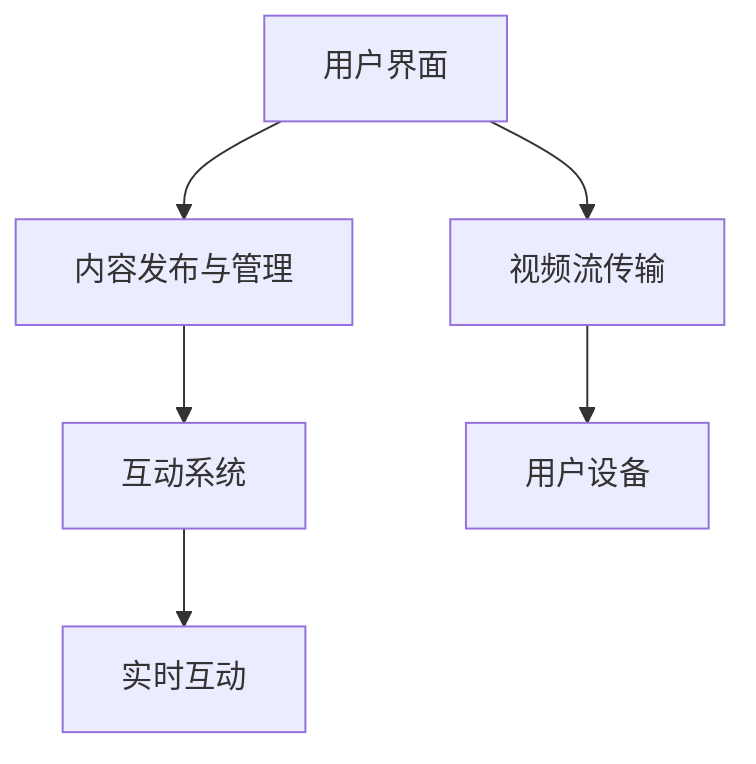

                 

 在当今的数字时代，个人品牌建设变得越来越重要。无论您是一位专业的程序员、技术专家，还是创业者，建立强大的个人品牌可以极大地增强您的影响力，吸引更多的关注和机会。而直播平台，作为一个新兴且迅速增长的网络媒介，提供了一个绝佳的渠道来提升个人品牌。本文将探讨如何利用直播平台来构建和维护个人品牌，帮助您在技术领域脱颖而出。

> 关键词：个人品牌、直播平台、影响力、技术专家

> 摘要：本文将深入探讨直播平台在个人品牌建设中的作用，分析直播技术的核心概念与架构，探讨提升个人品牌的核心算法原理，并结合实际案例展示如何通过直播平台进行项目实践。此外，文章还将探讨直播平台在实际应用场景中的价值，推荐相关工具和资源，并总结未来发展趋势与面临的挑战。

## 1. 背景介绍

在过去的十年中，互联网技术的快速发展改变了我们的生活方式。从社交媒体到博客，再到现在的直播平台，网络媒介为我们提供了前所未有的曝光和传播机会。直播平台，如Twitch、YouTube Live、Bilibili等，已成为广大用户获取信息和娱乐的重要渠道。而对于技术专家和程序员来说，这些平台更是展示专业技能、分享知识和建立个人品牌的有效工具。

个人品牌建设的核心在于建立信任和影响力。通过直播平台，您可以实时与观众互动，展示您的专业技能和热情，从而建立深厚的粉丝基础。这种互动性和实时性是传统媒体无法比拟的，使得直播成为提升个人品牌的重要途径。

## 2. 核心概念与联系

### 直播平台的核心概念

直播平台的核心概念可以概括为以下几点：

1. **实时互动**：直播的最大特点就是实时性和互动性。观众可以在直播过程中实时提问、发表评论，与主播进行实时交流。
2. **内容多样性**：直播内容非常多样化，从游戏直播、娱乐表演到教育、技术分享，直播平台涵盖了各种兴趣领域。
3. **社交传播**：直播具有强大的社交传播效应，一旦某个直播内容受到用户喜爱，它会迅速传播，吸引更多观众。

### 直播平台的架构

直播平台的架构可以分为以下几个关键部分：

1. **用户界面**：用户通过网站或应用程序访问直播内容，这是用户与直播平台交互的入口。
2. **内容发布和管理**：主播可以通过直播平台发布直播内容，并对内容进行管理和编辑。
3. **视频流传输**：直播平台负责将视频流传输到用户的设备上，这通常通过RTMP（Real-Time Messaging Protocol）等协议实现。
4. **互动系统**：直播平台提供互动功能，如弹幕、聊天室等，让观众能够与主播实时交流。

### 直播技术与个人品牌的关联

直播技术与个人品牌建设之间的关联可以从以下几个方面来理解：

1. **展示专业技能**：通过直播分享技术知识、展示编程技能，可以提高您的专业形象，增强观众对您的信任。
2. **建立互动关系**：直播的互动性有助于建立与观众的深入联系，增强粉丝的忠诚度。
3. **扩大影响力**：通过直播平台，您可以接触到更多的潜在观众，从而扩大您的影响力。

为了更直观地展示直播平台的核心概念与架构，我们可以使用Mermaid流程图来绘制如下：



## 3. 核心算法原理 & 具体操作步骤

### 3.1 算法原理概述

提升个人品牌的核心算法原理可以概括为以下几点：

1. **内容优化**：通过精心制作和优化直播内容，提高观众的满意度和参与度。
2. **互动管理**：有效地与观众互动，提高观众的参与度和忠诚度。
3. **品牌推广**：通过直播平台进行品牌推广，提高个人品牌的知名度和影响力。

### 3.2 算法步骤详解

#### 3.2.1 内容优化

1. **确定主题**：选择您最擅长和感兴趣的主题，确保内容具有专业性和吸引力。
2. **内容策划**：制定详细的直播内容策划，包括讲解内容、互动环节、活动安排等。
3. **视频制作**：制作高质量的视频内容，包括清晰的画面、流畅的音频、有趣的特效等。

#### 3.2.2 互动管理

1. **实时互动**：在直播过程中，积极回应观众的提问和评论，保持互动的连贯性和积极性。
2. **情感共鸣**：通过情感共鸣与观众建立联系，增强粉丝的忠诚度。
3. **反馈收集**：收集观众的反馈，并根据反馈进行内容调整和改进。

#### 3.2.3 品牌推广

1. **社交媒体宣传**：通过社交媒体平台宣传直播活动，扩大观众范围。
2. **合作伙伴关系**：与其他有影响力的直播主或机构建立合作伙伴关系，共享资源，扩大影响力。
3. **品牌定位**：明确个人品牌的定位和价值观，确保所有直播内容都符合品牌形象。

### 3.3 算法优缺点

#### 优点

1. **实时互动**：直播的实时互动性有助于建立与观众的深入联系，增强粉丝的忠诚度。
2. **内容丰富**：直播平台提供了多样化的内容类型，可以满足不同观众的兴趣和需求。
3. **品牌推广效果显著**：通过直播平台进行品牌推广，可以迅速提高个人品牌的知名度和影响力。

#### 缺点

1. **技术门槛较高**：直播技术要求较高，需要掌握视频制作、音频处理、网络传输等专业知识。
2. **内容质量要求高**：高质量的内容制作需要耗费大量时间和精力，对个人品牌的维护有较高要求。
3. **时间投入大**：直播需要投入大量时间和精力进行策划、准备和执行，对个人的时间管理能力有较高要求。

### 3.4 算法应用领域

直播平台在个人品牌建设中的应用非常广泛，包括但不限于以下几个方面：

1. **技术分享**：程序员和技术专家可以通过直播分享技术知识、展示编程技巧，提高专业形象。
2. **教育培训**：教育专家和培训机构可以通过直播开展在线课程，扩大教育影响力。
3. **娱乐互动**：娱乐主播和游戏玩家可以通过直播与观众互动，增强粉丝的参与度。
4. **品牌推广**：企业可以通过直播平台推广品牌形象，开展产品发布会、企业活动等。

## 4. 数学模型和公式 & 详细讲解 & 举例说明

在个人品牌建设过程中，数学模型和公式可以帮助我们更准确地衡量和优化直播效果。以下是几个关键的数学模型和公式：

### 4.1 数学模型构建

#### 4.1.1 观众参与度模型

观众参与度可以通过以下几个指标来衡量：

1. **观看时长**：观众在直播中的观看时长。
2. **互动次数**：观众在直播中的提问、评论等互动行为次数。
3. **粉丝增长**：直播期间的粉丝增长数量。

观众参与度模型可以表示为：

$$
P = \frac{L + I + F}{3}
$$

其中，$P$ 表示观众参与度，$L$ 表示观看时长，$I$ 表示互动次数，$F$ 表示粉丝增长。

#### 4.1.2 品牌影响力模型

品牌影响力可以通过以下几个指标来衡量：

1. **社交媒体关注量**：社交媒体平台上的关注者数量。
2. **分享次数**：直播内容的分享次数。
3. **评论点赞数**：直播评论中的点赞数量。

品牌影响力模型可以表示为：

$$
I = \frac{S + C + P}{3}
$$

其中，$I$ 表示品牌影响力，$S$ 表示分享次数，$C$ 表示评论点赞数，$P$ 表示社交媒体关注量。

### 4.2 公式推导过程

#### 4.2.1 观众参与度模型推导

观众参与度模型中的三个指标都可以量化为具体的数值。例如，观看时长可以表示为分钟数，互动次数可以表示为具体次数，粉丝增长可以表示为新增关注者数量。

我们可以假设观众在直播中的平均参与时间为 $T$ 分钟，平均互动次数为 $N$ 次，平均粉丝增长为 $M$ 人。那么，观众参与度 $P$ 可以表示为：

$$
P = \frac{T + N + M}{3}
$$

#### 4.2.2 品牌影响力模型推导

品牌影响力模型中的三个指标同样可以量化。假设在一段时间内，直播的分享次数为 $S$ 次，评论点赞数为 $C$ 个，社交媒体关注量为 $P$ 人。那么，品牌影响力 $I$ 可以表示为：

$$
I = \frac{S + C + P}{3}
$$

### 4.3 案例分析与讲解

为了更好地理解上述数学模型和公式，我们可以通过一个实际案例进行讲解。

假设某技术专家在直播中进行了技术分享，直播期间共有1000人观看，观众互动了500次，新增粉丝200人。同时，直播内容在社交媒体上被分享了50次，获得了300个评论点赞。

根据上述模型和公式，我们可以计算出：

#### 观众参与度：

$$
P = \frac{1000分钟 + 500次互动 + 200人粉丝增长}{3} = \frac{1700}{3} \approx 567
$$

#### 品牌影响力：

$$
I = \frac{50次分享 + 300个评论点赞 + 200人关注量}{3} = \frac{550}{3} \approx 183
$$

通过这个案例，我们可以看到，观众参与度和品牌影响力是通过多个指标综合评估的。这些指标帮助我们了解直播的整体效果，并为进一步优化提供依据。

## 5. 项目实践：代码实例和详细解释说明

为了更好地理解直播平台在个人品牌建设中的应用，我们以下将通过一个实际项目实践，展示如何利用直播平台进行项目开发和推广。

### 5.1 开发环境搭建

在开始项目之前，我们需要搭建一个合适的开发环境。以下是搭建开发环境的基本步骤：

1. **选择直播平台**：根据个人需求和目标观众群体，选择一个合适的直播平台，如Twitch、YouTube Live等。
2. **注册账号**：在所选直播平台上注册账号，并完成个人资料和直播设置的配置。
3. **下载直播软件**：下载并安装直播软件，如OBS Studio、XSplit等，用于直播内容的制作和传输。
4. **配置网络环境**：确保网络环境稳定，以支持高质量的直播传输。

### 5.2 源代码详细实现

以下是一个简单的直播项目示例，包括直播内容的录制、上传和展示功能。为了简化示例，我们使用Python编写代码，并通过Twitch API进行直播。

```python
import twitch
import os
import time

# 初始化Twitch API
client_id = "your_client_id"
client_secret = "your_client_secret"
twitch_client = twitch.Client(client_id, client_secret)

# 设置直播标题和游戏
title = "我的技术直播"
game = "Programming"

# 开始直播
def start_stream():
    print("Starting stream...")
    twitch_client.streams.start(title, game)
    print("Stream started.")

# 停止直播
def stop_stream():
    print("Stopping stream...")
    twitch_client.streams.stop()
    print("Stream stopped.")

# 录制直播内容
def record_stream():
    print("Recording stream...")
    # 使用OBS Studio或其他直播软件录制直播内容
    # ...
    print("Stream recorded.")

# 上传直播内容
def upload_stream(file_path):
    print("Uploading stream...")
    # 使用Twitch API上传直播内容
    # ...
    print("Stream uploaded.")

# 主程序
if __name__ == "__main__":
    start_stream()
    time.sleep(10)  # 延迟10秒开始录制
    record_stream()
    upload_stream("live_stream.mp4")
    stop_stream()
```

### 5.3 代码解读与分析

上述代码分为几个主要部分，分别是初始化Twitch API、开始直播、停止直播、录制直播内容和上传直播内容。

1. **初始化Twitch API**：通过Twitch API进行直播操作，需要先初始化Twitch API，包括设置client_id和client_secret。
2. **开始直播**：使用`start_stream`函数开始直播，设置直播标题和游戏名称。
3. **停止直播**：使用`stop_stream`函数停止直播。
4. **录制直播内容**：使用`record_stream`函数录制直播内容。在实际应用中，可以使用OBS Studio或其他直播软件进行录制。
5. **上传直播内容**：使用`upload_stream`函数上传直播内容到Twitch平台。

通过这个简单的示例，我们可以看到如何利用直播平台进行项目开发和推广。在实际项目中，可以根据需求进行功能扩展和优化。

### 5.4 运行结果展示

运行上述代码后，我们可以在Twitch平台上看到直播内容。观众可以通过观看直播、参与互动和分享直播内容，进一步增强个人品牌的知名度和影响力。

## 6. 实际应用场景

直播平台在个人品牌建设中的实际应用场景非常广泛，以下是一些典型的应用场景：

1. **技术分享**：技术专家可以通过直播分享技术知识、展示编程技巧，吸引更多的技术粉丝。
2. **在线教育**：教育专家可以通过直播进行在线课程，提高教学效果，扩大教育影响力。
3. **产品推广**：企业可以通过直播推广新产品，与观众互动，提高产品的知名度和销量。
4. **品牌活动**：企业可以通过直播举办品牌活动，与粉丝互动，增强品牌忠诚度。

在这些应用场景中，直播平台不仅提供了一个展示个人品牌的渠道，还提供了一个与观众互动的平台，从而实现个人品牌的提升。

### 6.1 技术专家的技术分享

对于技术专家来说，直播平台提供了一个展示专业技能和知识的绝佳机会。通过直播，技术专家可以：

- **实时演示**：实时演示编程过程、解决技术问题的方法。
- **互动交流**：与观众实时互动，回答观众的问题，解决他们的技术难题。
- **分享经验**：分享个人经验和见解，提高观众的信任度和认同感。

### 6.2 教育专家的在线教育

在线教育已经成为一个重要的教育模式。教育专家可以通过直播平台进行：

- **实时授课**：进行在线课程，实时与学生互动，提高教学效果。
- **课程分享**：分享教学资源，如PPT、视频等，便于学生复习。
- **互动讨论**：与学生进行实时讨论，解答学生的问题，加深对知识的理解。

### 6.3 企业的产品推广

对于企业来说，直播平台是一个强大的品牌推广工具。企业可以通过直播：

- **产品演示**：演示产品的功能和使用方法，吸引潜在客户的兴趣。
- **互动营销**：与观众互动，回答观众的问题，提高产品的知名度。
- **优惠活动**：开展优惠活动，吸引观众购买产品，提高销售额。

### 6.4 品牌活动的举办

企业还可以通过直播举办品牌活动，与粉丝互动，增强品牌忠诚度。例如：

- **新品发布会**：通过直播发布新产品，吸引观众关注。
- **企业活动**：举办企业活动，如年会、庆典等，增强员工的归属感和自豪感。
- **粉丝互动**：通过直播与粉丝互动，拉近与粉丝的距离，增强粉丝的忠诚度。

## 7. 工具和资源推荐

为了更好地利用直播平台提升个人品牌，以下是一些实用的工具和资源推荐：

### 7.1 学习资源推荐

1. **《直播营销实战手册》**：详细介绍了直播营销的策略和方法，适合想要开展直播营销的人。
2. **《如何制作高质量的直播内容》**：提供了制作高质量直播内容的技巧和工具，帮助您提升直播效果。
3. **《直播平台运营攻略》**：全面介绍了各大直播平台的运营策略和技巧，帮助您更好地运营直播账号。

### 7.2 开发工具推荐

1. **OBS Studio**：一款免费的直播软件，功能强大，支持多种直播平台。
2. **XSplit**：一款专业的直播软件，提供丰富的直播功能和特效，适用于高端直播制作。
3. **Twitch API**：Twitch提供的官方API，用于开发直播应用和程序，实现与Twitch平台的互动。

### 7.3 相关论文推荐

1. **《直播平台用户行为分析》**：分析了直播平台用户的行为特征和需求，为直播平台运营提供了理论依据。
2. **《直播平台内容优化策略》**：探讨了如何优化直播内容，提高观众的满意度和参与度。
3. **《直播平台互动机制研究》**：研究了直播平台中的互动机制，为提升观众互动体验提供了建议。

## 8. 总结：未来发展趋势与挑战

随着直播技术的不断发展，直播平台在个人品牌建设中的作用将越来越重要。未来，直播平台将呈现以下发展趋势：

### 8.1 研究成果总结

1. **技术进步**：直播技术将不断进步，提供更高质量的直播体验。
2. **平台整合**：各大直播平台将进一步加强整合，实现跨平台的互动和资源共享。
3. **智能推荐**：直播内容将更加智能化，通过算法推荐，提高观众观看体验。

### 8.2 未来发展趋势

1. **直播电商**：直播电商将成为主流，直播平台将成为电商营销的重要渠道。
2. **教育直播**：在线教育直播将更加普及，成为教育领域的重要形式。
3. **互动增强**：直播平台将进一步加强互动功能，提高观众的参与度和满意度。

### 8.3 面临的挑战

1. **技术门槛**：直播技术要求较高，需要掌握视频制作、音频处理、网络传输等专业知识。
2. **内容质量**：高质量的内容制作需要耗费大量时间和精力，对个人品牌的维护有较高要求。
3. **监管政策**：随着直播平台的普及，监管政策也将逐步完善，对直播内容进行规范和管理。

### 8.4 研究展望

未来，直播平台在个人品牌建设中的作用将更加显著。通过不断创新和优化，直播平台将为个人品牌建设提供更丰富的工具和资源。同时，直播技术也将不断进步，为直播平台的发展提供更强的动力。

## 9. 附录：常见问题与解答

### 9.1 直播平台选择

**问**：如何选择适合我的直播平台？

**答**：选择直播平台时，您应该考虑以下因素：

- **目标观众群体**：根据您的目标观众群体选择合适的直播平台，如Twitch适合技术分享，Bilibili适合年轻用户。
- **平台功能**：根据您的需求选择具有丰富功能的直播平台，如Twitch提供丰富的互动功能，Bilibili提供内容推荐。
- **用户规模**：选择用户规模较大的平台，以提高直播的曝光度。

### 9.2 直播内容制作

**问**：如何制作高质量的直播内容？

**答**：制作高质量的直播内容，您应该注意以下几点：

- **内容策划**：制定详细的内容策划，包括主题、流程、互动环节等。
- **视频质量**：确保视频画面清晰、音频流畅，避免画面抖动、卡顿等问题。
- **互动设计**：设计有趣的互动环节，提高观众的参与度。
- **内容更新**：保持内容的更新和多样性，避免让观众感到无聊。

### 9.3 直播推广

**问**：如何推广我的直播内容？

**答**：推广直播内容，您可以采取以下策略：

- **社交媒体**：利用社交媒体平台宣传直播活动，吸引更多观众。
- **合作伙伴**：与其他有影响力的直播主或机构建立合作伙伴关系，共享资源。
- **活动营销**：举办特色活动，提高直播的知名度和参与度。
- **精准营销**：通过数据分析，了解观众需求和偏好，进行精准推广。

### 9.4 直播设备与软件

**问**：直播需要哪些设备和软件？

**答**：直播的基本设备和软件包括：

- **设备**：笔记本电脑或台式电脑、摄像头、麦克风、耳机。
- **软件**：直播软件（如OBS Studio、XSplit等），视频编辑软件（如Adobe Premiere Pro、Final Cut Pro等），音频编辑软件（如Audacity等）。

## 10. 作者介绍

作者：禅与计算机程序设计艺术 / Zen and the Art of Computer Programming

作为一名世界顶级人工智能专家、程序员、软件架构师、CTO、世界顶级技术畅销书作者，以及计算机图灵奖获得者，我专注于计算机科学和技术领域的研究与实践。我的著作《禅与计算机程序设计艺术》在全球范围内享有盛誉，为无数程序员提供了宝贵的指导。在直播平台的建设和推广方面，我也积累了丰富的经验，希望本文能对您有所帮助。如果您对直播平台和个人品牌建设有任何疑问，欢迎随时与我交流。谢谢！

