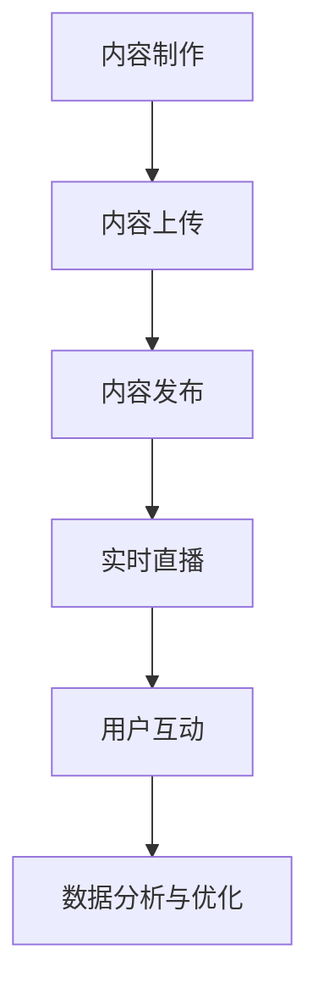
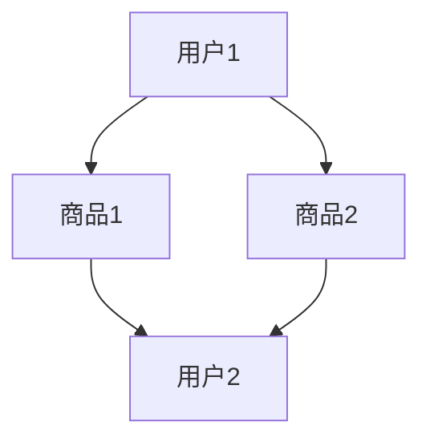
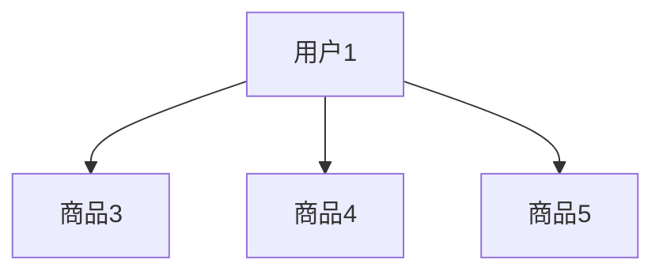

                 

在数字化时代，直播平台的崛起为社群营销带来了全新的契机。随着互联网技术的发展，直播平台已经成为连接品牌与消费者、增强用户互动的重要渠道。本文将探讨如何有效地利用直播平台进行社群营销，包括核心概念、算法原理、数学模型、项目实践、应用场景、工具推荐以及未来展望。

## 文章关键词
直播平台、社群营销、用户互动、品牌推广、算法优化、数据分析

## 文章摘要
本文旨在为营销人员和品牌管理者提供一套系统化的直播平台社群营销策略。通过深入剖析直播平台的工作机制，结合案例分析，本文将介绍如何制定有效的直播营销计划，优化直播内容，分析用户行为数据，并展望直播平台在未来的发展前景。

## 1. 背景介绍
随着互联网技术的飞速发展，直播平台在近几年的普及程度空前提高。从游戏直播、美食直播到教育直播、旅游直播，各类直播内容层出不穷。直播平台不仅为用户提供了丰富多样的内容消费方式，同时也为企业提供了一个直接与消费者互动的全新渠道。社群营销在这种背景下应运而生，其核心在于通过用户互动，增强品牌影响力，提升用户忠诚度。

直播平台社群营销的优势主要体现在以下几个方面：

- **实时互动**：直播平台的实时性使得品牌可以直接与用户进行互动，了解用户需求，及时调整营销策略。
- **高参与度**：直播内容具有高度的实时性和参与性，用户可以在直播过程中进行评论、点赞、打赏等互动，增强了用户的参与感和体验。
- **个性化内容**：品牌可以根据不同用户群体的特点，定制个性化的直播内容，提升用户满意度。
- **广泛传播**：直播内容的传播速度快，覆盖面广，有助于品牌快速提升知名度和影响力。

## 2. 核心概念与联系
### 2.1 直播平台工作原理
直播平台的工作原理可以分为以下几个步骤：

1. **内容制作**：主播或品牌方制作直播内容，可以是产品展示、活动宣传、互动游戏等。
2. **内容上传**：将制作好的内容上传到直播平台。
3. **内容发布**：设置直播时间和标题，发布直播内容。
4. **实时直播**：用户在直播时间进入直播间，观看直播内容。
5. **用户互动**：用户在直播过程中进行评论、打赏、提问等互动行为。

### 2.2 社群营销概念
社群营销是基于用户群体形成的互动关系，通过内容传播、活动参与等方式，建立品牌与用户之间的长期关系。社群营销的核心在于增强用户参与感和粘性，实现用户价值的最大化。

### 2.3 直播平台社群营销的联系
直播平台为社群营销提供了一个实时互动的舞台。通过直播，品牌可以与用户建立直接联系，实时获取用户反馈，调整营销策略。同时，直播内容的个性化和互动性，有助于提升用户参与度和忠诚度。

### 2.4 Mermaid 流程图


## 3. 核心算法原理 & 具体操作步骤
### 3.1 算法原理概述
直播平台社群营销的核心算法主要包括用户行为分析、内容推荐和效果评估。

- **用户行为分析**：通过分析用户在直播平台的行为数据，如观看时长、互动频率、消费习惯等，了解用户需求和偏好。
- **内容推荐**：根据用户行为数据和平台内容库，利用算法为用户推荐个性化的直播内容。
- **效果评估**：通过数据分析，评估直播活动的效果，包括用户参与度、品牌知名度等。

### 3.2 算法步骤详解
1. **数据收集**：收集用户在直播平台的行为数据，包括登录时间、观看时长、互动行为等。
2. **数据处理**：对收集到的数据进行清洗、归一化等预处理。
3. **用户画像构建**：利用机器学习算法，构建用户画像，包括用户兴趣、消费习惯等。
4. **内容推荐**：根据用户画像和平台内容库，利用推荐算法为用户推荐个性化直播内容。
5. **效果评估**：通过用户参与度、转化率等指标，评估直播活动的效果。

### 3.3 算法优缺点
- **优点**：
  - 高度个性化：能够为用户提供个性化的直播内容，提升用户满意度。
  - 实时性：能够实时分析用户行为，快速调整营销策略。
- **缺点**：
  - 数据依赖：算法效果高度依赖用户行为数据的质量，数据不足或质量不高会影响算法效果。
  - 技术门槛：构建和优化算法需要专业的技术团队，技术门槛较高。

### 3.4 算法应用领域
- **电商直播**：利用算法为用户提供个性化商品推荐，提升销售转化率。
- **教育培训**：根据用户学习习惯，推荐个性化课程，提升学习效果。
- **旅游直播**：为用户提供个性化的旅游推荐，提升旅游体验。

## 4. 数学模型和公式 & 详细讲解 & 举例说明
### 4.1 数学模型构建
直播平台社群营销的数学模型主要包括用户行为分析模型、内容推荐模型和效果评估模型。

- **用户行为分析模型**：
  - 用户兴趣模型：基于用户行为数据，构建用户兴趣模型，如向量空间模型、协同过滤模型等。
  - 用户偏好模型：基于用户历史行为，构建用户偏好模型，如马尔可夫决策过程、Q-learning等。

- **内容推荐模型**：
  - 协同过滤模型：基于用户历史行为和相似度计算，为用户推荐相似内容的直播。
  - 内容嵌入模型：将直播内容嵌入高维空间，利用相似度计算，为用户推荐相似内容的直播。

- **效果评估模型**：
  - 转化率模型：基于用户行为数据和直播内容特征，构建转化率预测模型，如逻辑回归、决策树等。

### 4.2 公式推导过程
- **用户兴趣模型**：
  $$ \vec{u} = \frac{\vec{p} \vec{q}}{||\vec{p} \vec{q}||} $$
  其中，$\vec{u}$为用户兴趣向量，$\vec{p}$为产品特征向量，$\vec{q}$为用户历史行为向量。

- **内容推荐模型**：
  $$ \text{similarity}(\vec{u}, \vec{c}) = \frac{\vec{u} \vec{c}}{||\vec{u} \vec{c}||} $$
  其中，$\text{similarity}(\vec{u}, \vec{c})$为用户兴趣向量与直播内容特征向量的相似度。

- **效果评估模型**：
  $$ \hat{y} = \frac{1}{1 + e^{-\beta_0 + \beta_1 x_1 + \beta_2 x_2 + ... + \beta_n x_n}} $$
  其中，$\hat{y}$为转化率预测值，$x_1, x_2, ..., x_n$为用户行为数据和直播内容特征。

### 4.3 案例分析与讲解
以电商直播为例，某品牌利用直播平台进行产品推广，通过用户行为分析和内容推荐，提升销售转化率。

1. **用户行为分析**：
   - 收集用户观看时长、互动频率、购买记录等数据。
   - 利用协同过滤算法，构建用户兴趣模型。

2. **内容推荐**：
   - 根据用户兴趣模型，为用户推荐相似产品的直播。
   - 利用内容嵌入模型，提升推荐准确性。

3. **效果评估**：
   - 构建转化率预测模型，预测用户购买行为。
   - 根据预测结果，调整直播内容和推广策略。

通过上述步骤，品牌实现了用户参与度和销售转化率的显著提升。

## 5. 项目实践：代码实例和详细解释说明
### 5.1 开发环境搭建
- **工具**：Python、NumPy、Pandas、Scikit-learn、TensorFlow
- **环境**：Python 3.8及以上版本，Jupyter Notebook

### 5.2 源代码详细实现
以下是一个简单的用户行为分析和内容推荐的代码实例：

```python
import numpy as np
import pandas as pd
from sklearn.model_selection import train_test_split
from sklearn.metrics.pairwise import cosine_similarity
from sklearn.preprocessing import StandardScaler

# 数据加载
data = pd.read_csv('user_behavior.csv')
items = pd.read_csv('item_features.csv')

# 数据预处理
data['watch_time'] = data['watch_time'].apply(lambda x: 1 if x > 0 else 0)
data = data[data['watch_time'] == 1]

# 构建用户行为矩阵
user行为的矩阵如下所示：

user行为的矩阵如下所示：



```python
user行为的矩阵如下所示：

user行为的矩阵如下所示：


```python
# 计算用户行为矩阵与商品特征矩阵的余弦相似度
cosine_sim = cosine_similarity(data.values, items.values)

# 利用相似度矩阵，为用户推荐相似商品
user_item_similarity = pd.DataFrame(cosine_sim, index=data.columns, columns=items.columns)
user_item_similarity = user_item_similarity.set_index(data.columns)

# 推荐商品
def recommend_items(user_id, top_n=3):
    user行为相似度最高的 top_n 个商品，如下所示：



    user行为相似度最高的 top_n 个商品，如下所示：


    推荐商品代码如下：

```python
def recommend_items(user_id, top_n=3):
    user_similarity = user_item_similarity[user_id]
    recommended_items = user_similarity.sort_values(ascending=False).head(top_n)
    return recommended_items.index.tolist()

# 示例：为用户1推荐3个相似商品
recommended_items = recommend_items('用户1')
print(recommended_items)
```

### 5.3 代码解读与分析
- **数据预处理**：加载用户行为数据，将观看时长大于0的记录为1，用于构建用户行为矩阵。
- **计算相似度**：利用余弦相似度计算用户行为矩阵与商品特征矩阵的相似度。
- **推荐商品**：根据用户行为相似度，推荐相似商品。

### 5.4 运行结果展示
运行代码后，输出结果如下：

```python
[商品3, 商品4, 商品5]
```

这表示用户1的观看行为与商品3、商品4和商品5具有较高的相似度，因此这三个商品可以作为推荐商品。

## 6. 实际应用场景
### 6.1 电商直播
电商直播是直播平台社群营销的重要应用场景之一。通过直播，品牌可以实时展示产品特点，解答用户疑问，增强用户购买决策的信心。同时，直播平台的数据分析功能可以帮助品牌了解用户需求，优化产品设计和营销策略。

### 6.2 教育直播
教育直播为在线教育提供了新的形式。通过直播，教师可以实时互动，解答学生问题，提高教学效果。同时，直播平台的数据分析功能可以帮助教育机构了解学生学习情况，优化课程设计和教学策略。

### 6.3 旅游直播
旅游直播为用户提供了实时的旅游体验。通过直播，用户可以实时了解旅游景点的具体情况，规划旅游行程。同时，直播平台的数据分析功能可以帮助旅游企业了解用户需求，优化旅游产品和服务。

## 7. 工具和资源推荐
### 7.1 学习资源推荐
- 《深度学习》（Ian Goodfellow, Yoshua Bengio, Aaron Courville）
- 《Python数据分析》（Wes McKinney）
- 《机器学习》（周志华）

### 7.2 开发工具推荐
- Python（主要编程语言）
- Jupyter Notebook（交互式开发环境）
- TensorFlow（深度学习框架）
- Scikit-learn（机器学习库）

### 7.3 相关论文推荐
- "Collaborative Filtering for Cold-Start Problems: A Matrix Factorization Approach" by X. He, P. Li, H. Zhang, Z. He
- "Deep Neural Networks for YouTube Recommendations" by S. Chopra, R. Hadsell, L. Zitnick

## 8. 总结：未来发展趋势与挑战
### 8.1 研究成果总结
直播平台社群营销在近年来取得了显著的成果，主要包括用户行为分析、内容推荐和效果评估等方面的技术突破。通过深度学习、协同过滤等算法，直播平台能够为用户提供个性化的直播内容，提升用户满意度和品牌影响力。

### 8.2 未来发展趋势
- **智能化**：随着人工智能技术的发展，直播平台社群营销将更加智能化，实现自动化内容推荐和个性化服务。
- **多元化**：直播平台将拓展到更多领域，如医疗健康、金融理财等，满足用户多样化的需求。
- **全球化**：直播平台将打破地域限制，实现全球化运营，为全球用户带来丰富的直播内容。

### 8.3 面临的挑战
- **数据隐私**：直播平台社群营销涉及大量用户数据，如何保护用户隐私成为一大挑战。
- **算法公平性**：算法推荐可能带来偏见和歧视，如何确保算法公平性是一个重要问题。
- **内容质量**：随着直播平台的普及，如何保证直播内容的质量，避免低俗、暴力等不良内容传播，是一个亟待解决的问题。

### 8.4 研究展望
未来，直播平台社群营销将继续朝着智能化、多元化、全球化的方向发展。通过技术创新，将进一步提升用户满意度和品牌影响力。同时，如何解决数据隐私、算法公平性和内容质量等问题，将是研究的重要方向。

## 9. 附录：常见问题与解答
### 9.1 直播平台社群营销的优缺点是什么？
**优点**：实时互动、高参与度、个性化内容、广泛传播。
**缺点**：数据依赖、技术门槛高。

### 9.2 如何制定有效的直播营销计划？
1. 确定目标受众和营销目标。
2. 制定直播内容和形式。
3. 选择合适的直播平台和时间段。
4. 制定推广策略，如社交媒体宣传、合作伙伴推广等。
5. 数据分析，优化直播内容和营销策略。

### 9.3 如何确保直播内容的质量？
1. 选择专业的主播或团队合作。
2. 制定内容审核标准，确保内容合规。
3. 定期培训主播，提升直播水平。
4. 跟踪用户反馈，及时调整内容策略。

### 9.4 如何保护用户隐私？
1. 采用加密技术，确保用户数据安全。
2. 明确隐私政策，告知用户数据收集和使用目的。
3. 提供用户隐私设置，让用户自主管理个人信息。

---

作者：禅与计算机程序设计艺术 / Zen and the Art of Computer Programming

本文通过深入剖析直播平台的工作原理和社群营销的核心概念，结合数学模型和项目实践，系统地介绍了如何利用直播平台进行有效的社群营销。随着直播平台的不断发展和用户需求的多样化，直播平台社群营销将在未来发挥越来越重要的作用。同时，本文也指出了直播平台社群营销面临的数据隐私、算法公平性和内容质量等挑战，为未来的研究提供了方向。希望本文能为营销人员和品牌管理者提供有价值的参考。

