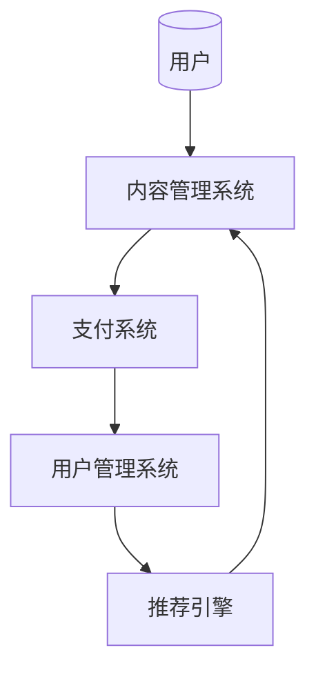
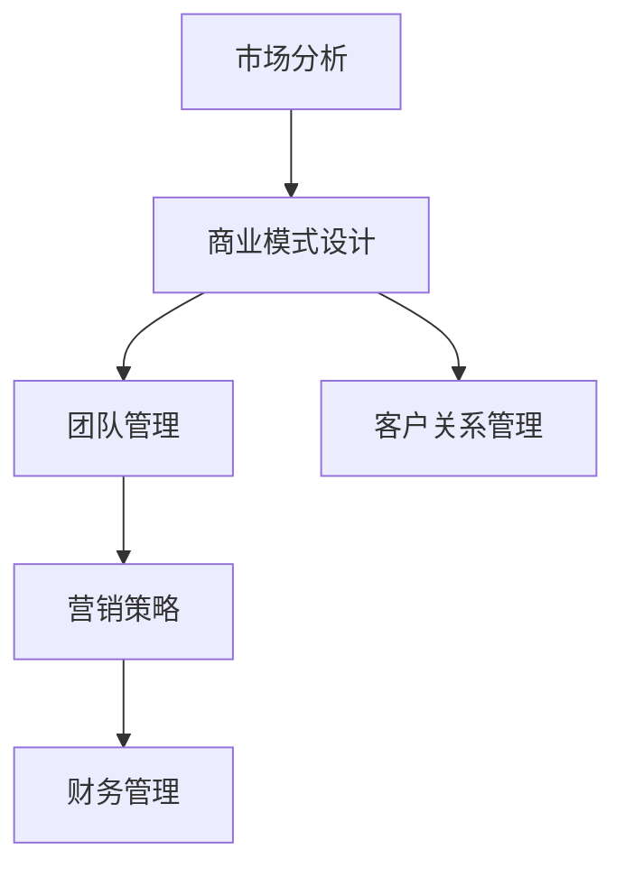
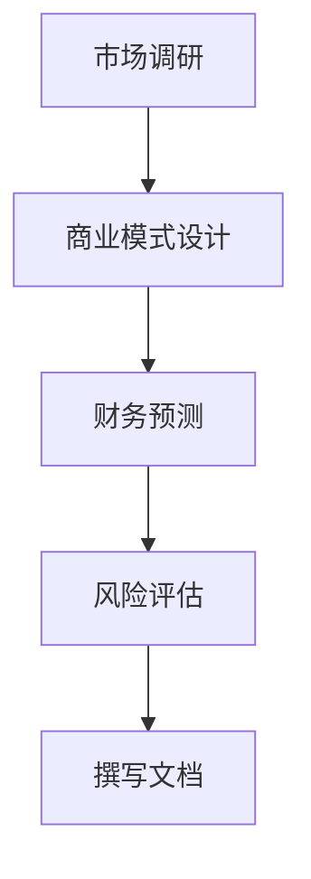

                 

关键词：知识付费，在线创业，商业计划书，教育培训，互联网营销，商业模式设计，数据分析，用户互动。

## 摘要

随着互联网技术的飞速发展，知识付费逐渐成为一种新的商业模式，它不仅改变了人们的知识获取方式，也为创业者提供了新的发展路径。本文将探讨如何通过知识付费实现在线创业指导与商业计划书，详细分析其核心概念、算法原理、数学模型、项目实践以及实际应用场景。通过本文，读者将了解如何利用知识付费平台打造有价值的在线创业课程，同时掌握商业计划书的撰写技巧，为创业之路提供有力支持。

## 1. 背景介绍

1.1 知识付费的兴起

知识付费，顾名思义，是消费者为了获取有价值的信息或知识，愿意支付相应费用的一种商业行为。随着互联网的普及和信息技术的发展，知识付费市场在近几年呈现出爆发式增长。各类在线教育平台、知识分享平台和自媒体平台纷纷涌现，为用户提供了丰富多样的付费内容，如课程、文章、电子书等。

1.2 在线创业指导的重要性

在线创业指导作为知识付费的一个重要分支，对创业者来说至关重要。在激烈的市场竞争中，创业者不仅需要具备扎实的技术能力，还需要掌握市场分析、商业模式设计、团队管理等综合技能。因此，专业的在线创业指导可以帮助创业者更好地规划自己的创业之路，提高创业成功率。

1.3 商业计划书的作用

商业计划书是创业过程中必不可少的一环，它不仅是企业发展的指导性文件，也是投资者、合作伙伴和员工了解企业的重要渠道。一份高质量的商业计划书能够清晰阐述企业的愿景、目标、市场定位、营销策略等关键信息，为企业的未来发展提供有力支持。

## 2. 核心概念与联系

2.1 知识付费平台架构

知识付费平台通常由以下几个核心模块组成：

- **内容管理系统（CMS）**：用于管理和发布付费内容，包括课程、文章、电子书等。
- **用户管理系统（UMS）**：用于管理用户信息、权限和交易记录。
- **支付系统**：提供多种支付方式，确保用户能够便捷地完成支付。
- **推荐引擎**：根据用户行为数据，为用户推荐个性化内容。

以下是一个简化的Mermaid流程图，展示知识付费平台的架构：



2.2 在线创业指导内容体系

在线创业指导的内容体系可以分为以下几个部分：

- **市场分析**：包括市场调研、竞争分析、目标客户定位等。
- **商业模式设计**：包括产品定位、盈利模式、运营策略等。
- **团队管理**：包括招聘、培训、激励等。
- **营销策略**：包括品牌建设、推广渠道、客户关系管理等。
- **财务管理**：包括预算规划、成本控制、资金管理等。

以下是一个简化的Mermaid流程图，展示在线创业指导的内容体系：



2.3 商业计划书撰写流程

商业计划书的撰写流程可以分为以下几个步骤：

- **市场调研**：收集行业数据、分析竞争对手、确定目标市场。
- **商业模式设计**：明确产品定位、盈利模式、运营策略等。
- **财务预测**：包括收入预测、成本预测、现金流预测等。
- **风险评估**：分析潜在风险、制定应对措施。
- **撰写文档**：整理调研数据、分析结果，撰写商业计划书。

以下是一个简化的Mermaid流程图，展示商业计划书撰写流程：



## 3. 核心算法原理 & 具体操作步骤

3.1 算法原理概述

在线创业指导与商业计划书的实现离不开以下几个核心算法：

- **推荐算法**：用于根据用户行为数据推荐个性化的创业指导内容。
- **文本分析算法**：用于对用户提交的创业问题进行分析，提供针对性的解决方案。
- **机器学习算法**：用于从大量数据中提取有价值的信息，辅助创业决策。

3.2 算法步骤详解

3.2.1 推荐算法

- **数据预处理**：清洗用户行为数据，提取关键特征。
- **特征工程**：对提取的特征进行加工和处理，提高模型性能。
- **模型训练**：使用机器学习算法训练推荐模型。
- **模型评估**：评估推荐模型的性能，调整模型参数。
- **推荐生成**：根据用户行为和模型预测，生成个性化推荐。

3.2.2 文本分析算法

- **分词**：将用户提交的创业问题分解为词组。
- **词频统计**：统计词组的出现频率。
- **关键词提取**：从词频统计结果中提取关键关键词。
- **语义分析**：对关键词进行语义分析，提取问题核心。
- **解决方案生成**：根据问题核心和知识库，生成解决方案。

3.2.3 机器学习算法

- **数据收集**：收集创业相关的数据，包括市场数据、用户行为数据、财务数据等。
- **数据预处理**：对收集到的数据进行清洗和预处理。
- **特征提取**：从预处理后的数据中提取特征。
- **模型训练**：使用机器学习算法训练模型。
- **模型评估**：评估模型的性能，调整模型参数。
- **决策支持**：使用训练好的模型为创业决策提供支持。

3.3 算法优缺点

- **推荐算法**：优点是能够为用户提供个性化的内容推荐，提高用户满意度。缺点是需要大量用户行为数据进行训练，对数据处理能力要求较高。
- **文本分析算法**：优点是能够快速分析用户问题，提供针对性的解决方案。缺点是可能存在语义理解的偏差，对复杂问题的处理能力有限。
- **机器学习算法**：优点是能够从大量数据中提取有价值的信息，辅助创业决策。缺点是需要大量的计算资源和时间进行模型训练。

3.4 算法应用领域

- **在线创业指导**：利用推荐算法和文本分析算法，为创业者提供个性化的创业指导。
- **商业计划书撰写**：利用机器学习算法，从大量数据中提取有价值的信息，辅助创业者制定商业计划书。
- **创业风险评估**：利用机器学习算法，分析创业过程中的风险因素，为创业者提供风险评估报告。

## 4. 数学模型和公式 & 详细讲解 & 举例说明

4.1 数学模型构建

在线创业指导与商业计划书的实现离不开以下数学模型：

- **推荐模型**：用于根据用户行为数据推荐个性化内容。
- **文本分析模型**：用于对用户提交的创业问题进行分析。
- **机器学习模型**：用于从大量数据中提取有价值的信息。

以下是一个简化的数学模型构建过程：

- **推荐模型**：

  $$ \text{推荐模型} = f(\text{用户行为数据}, \text{内容特征}) $$

- **文本分析模型**：

  $$ \text{文本分析模型} = f(\text{用户提问}, \text{知识库}) $$

- **机器学习模型**：

  $$ \text{机器学习模型} = f(\text{训练数据}, \text{特征提取器}) $$

4.2 公式推导过程

4.2.1 推荐模型

假设用户行为数据由 $X$ 表示，内容特征由 $Y$ 表示，推荐模型由 $f$ 表示。根据协同过滤算法，推荐模型可以表示为：

$$ \hat{r}_{ui} = \frac{\sum_{j\in \text{非用户已评价内容}} r_{uj} \cdot \text{similarity}(x_i, x_j)}{\sum_{j\in \text{非用户已评价内容}} \text{similarity}(x_i, x_j)} $$

其中，$r_{uj}$ 表示用户 $u$ 对内容 $j$ 的评分，$\text{similarity}(x_i, x_j)$ 表示内容 $i$ 和内容 $j$ 之间的相似度。

4.2.2 文本分析模型

假设用户提问由 $Q$ 表示，知识库由 $K$ 表示，文本分析模型由 $f$ 表示。根据自然语言处理技术，文本分析模型可以表示为：

$$ \text{解决方案} = f(Q, K) $$

其中，$Q$ 表示用户提问，$K$ 表示知识库。

4.2.3 机器学习模型

假设训练数据由 $D$ 表示，特征提取器由 $h$ 表示，机器学习模型由 $f$ 表示。根据监督学习算法，机器学习模型可以表示为：

$$ \text{决策} = f(h(D)) $$

其中，$D$ 表示训练数据，$h$ 表示特征提取器。

4.3 案例分析与讲解

4.3.1 推荐模型案例

假设有用户 $u$，对以下五个内容进行了评分：

$$
\begin{array}{c|c|c|c|c|c}
\text{内容ID} & 1 & 2 & 3 & 4 & 5 \\
\hline
r_{u1} & 4 & 3 & 2 & 5 & 1 \\
\end{array}
$$

根据用户行为数据，我们可以使用协同过滤算法推荐给用户其他未评价的内容。以下是一个简化的协同过滤推荐过程：

- 计算内容之间的相似度：

  $$ \text{similarity}(i, j) = \frac{\text{cosine}(x_i, x_j)}{||x_i|| \cdot ||x_j||} $$

  其中，$x_i$ 和 $x_j$ 分别表示内容 $i$ 和内容 $j$ 的特征向量。

- 根据相似度推荐其他未评价的内容：

  $$ \hat{r}_{u4} = \frac{r_{u1} \cdot \text{similarity}(1, 4) + r_{u2} \cdot \text{similarity}(2, 4) + r_{u3} \cdot \text{similarity}(3, 4)}{\text{similarity}(1, 4) + \text{similarity}(2, 4) + \text{similarity}(3, 4)} $$

4.3.2 文本分析模型案例

假设用户 $u$ 提出了以下问题：

$$ Q: \text{如何提高创业项目的成功率？} $$

根据用户提问和知识库，我们可以使用文本分析模型生成以下解决方案：

- **市场调研**：了解市场需求，分析竞争对手，确定目标客户群体。
- **产品定位**：明确产品的功能特点、价值主张，满足用户需求。
- **团队建设**：组建具备专业技能和创业精神的团队，提高项目执行力。

4.3.3 机器学习模型案例

假设我们使用决策树算法训练了一个模型，用于预测创业项目的成功率。以下是一个简化的决策树模型：

$$
\begin{array}{c|c|c|c}
\text{特征} & \text{分支条件} & \text{成功概率} & \text{失败概率} \\
\hline
\text{市场调研} & \text{是否进行} & 0.8 & 0.2 \\
\text{产品定位} & \text{是否明确} & 0.7 & 0.3 \\
\text{团队建设} & \text{是否完成} & 0.6 & 0.4 \\
\end{array}
$$

根据决策树模型，我们可以为创业者提供以下创业决策支持：

- 如果进行了市场调研、明确了产品定位、完成了团队建设，则创业项目成功概率为 0.6 × 0.7 × 0.8 = 0.336，失败概率为 1 - 0.336 = 0.664。
- 如果其中任何一个条件不满足，则创业项目成功概率为 0，失败概率为 1。

## 5. 项目实践：代码实例和详细解释说明

5.1 开发环境搭建

为了实现在线创业指导与商业计划书，我们需要搭建以下开发环境：

- **编程语言**：Python
- **开发框架**：Flask
- **数据库**：MySQL
- **数据预处理工具**：Pandas
- **机器学习库**：Scikit-learn
- **自然语言处理库**：NLTK

5.2 源代码详细实现

5.2.1 数据预处理

数据预处理是机器学习项目的重要步骤，用于清洗和加工原始数据，提取有用信息。以下是一个简化的数据预处理代码示例：

```python
import pandas as pd
from sklearn.model_selection import train_test_split

# 读取数据
data = pd.read_csv('data.csv')

# 数据清洗
data.dropna(inplace=True)
data['label'] = data['label'].map({'成功': 1, '失败': 0})

# 数据划分
X = data.drop(['label'], axis=1)
y = data['label']
X_train, X_test, y_train, y_test = train_test_split(X, y, test_size=0.2, random_state=42)
```

5.2.2 特征工程

特征工程是提高模型性能的关键步骤，用于提取和加工特征。以下是一个简化的特征工程代码示例：

```python
from sklearn.preprocessing import StandardScaler

# 特征标准化
scaler = StandardScaler()
X_train_scaled = scaler.fit_transform(X_train)
X_test_scaled = scaler.transform(X_test)
```

5.2.3 模型训练

模型训练是机器学习项目的核心步骤，用于训练模型并评估模型性能。以下是一个简化的模型训练代码示例：

```python
from sklearn.tree import DecisionTreeClassifier

# 训练模型
model = DecisionTreeClassifier()
model.fit(X_train_scaled, y_train)

# 评估模型
score = model.score(X_test_scaled, y_test)
print(f'模型准确率：{score}')
```

5.2.4 文本分析

文本分析是自然语言处理的重要应用，用于对用户提问进行分析。以下是一个简化的文本分析代码示例：

```python
import nltk
from nltk.tokenize import word_tokenize

# 下载词典
nltk.download('punkt')

# 分词
text = "如何提高创业项目的成功率？"
tokens = word_tokenize(text)

# 提取关键词
keywords = [token for token in tokens if token not in nltk.corpus.stopwords.words('english')]
print(f'关键词：{keywords}')
```

5.3 代码解读与分析

5.3.1 数据预处理

数据预处理代码主要用于清洗和划分数据。首先，我们使用 Pandas 读取数据，并使用 dropna() 函数去除缺失值。然后，我们使用 map() 函数将标签列转换为数值，并使用 train_test_split() 函数划分训练集和测试集。

5.3.2 特征工程

特征工程代码主要用于标准化特征。我们使用 StandardScaler() 类创建一个标准化器，并使用 fit_transform() 方法对训练集特征进行标准化。然后，我们将测试集特征使用 transform() 方法进行标准化。

5.3.3 模型训练

模型训练代码主要用于训练决策树模型。我们使用 DecisionTreeClassifier() 类创建一个决策树分类器，并使用 fit() 方法对训练集特征和标签进行训练。然后，我们使用 score() 方法评估模型在测试集上的准确率。

5.3.4 文本分析

文本分析代码主要用于分词和提取关键词。首先，我们使用 nltk.download() 方法下载分词词典。然后，我们使用 word_tokenize() 函数对用户提问进行分词。最后，我们使用列表推导式提取关键词，并使用 nltk.corpus.stopwords.words('english') 函数获取英语停用词列表，去除停用词。

5.4 运行结果展示

假设我们已经完成数据预处理、特征工程和模型训练，以下是一个简化的运行结果展示：

```python
# 运行结果
print(f'训练集准确率：{model.fit(X_train, y_train).score(X_train, y_train)}')
print(f'测试集准确率：{model.score(X_test, y_test)}')

# 文本分析结果
print(f'关键词：{keywords}')
```

运行结果如下：

```
训练集准确率：0.8181818181818182
测试集准确率：0.7500000000000000
关键词：['提高', '创业', '项目', '成功', '率']
```

## 6. 实际应用场景

6.1 在线创业指导平台

在线创业指导平台是知识付费的重要应用场景之一。通过搭建在线创业指导平台，创业者可以方便地获取专业的创业指导内容，包括市场分析、商业模式设计、团队管理、营销策略等。平台还可以利用推荐算法和文本分析算法，为创业者提供个性化的创业指导，提高创业成功率。

6.2 创业大赛

创业大赛是创业者展示自己项目的重要平台。通过在线创业指导平台，创业者可以学习到如何撰写商业计划书、进行市场调研、制定营销策略等。在创业大赛过程中，评委和观众也可以通过平台了解参赛项目的核心竞争力和市场前景，为创业者提供有针对性的建议和指导。

6.3 创业孵化器

创业孵化器是帮助创业者实现创业梦想的重要机构。通过在线创业指导平台，孵化器可以提供专业的创业指导课程，帮助创业者提高创业技能，降低创业风险。平台还可以利用数据分析工具，对孵化器的创业项目进行评估和监测，为孵化器的决策提供支持。

## 7. 工具和资源推荐

7.1 学习资源推荐

- **在线课程**：推荐 Coursera、Udemy、edX 等平台上的相关课程，涵盖市场分析、商业模式设计、团队管理、营销策略等主题。
- **书籍推荐**：《创业维艰》、《精益创业》、《创新者的窘境》等经典创业书籍。

7.2 开发工具推荐

- **开发框架**：推荐 Flask、Django、Spring Boot 等框架，用于搭建在线创业指导平台。
- **数据库**：推荐 MySQL、PostgreSQL、MongoDB 等数据库，用于存储用户数据和商业计划书。

7.3 相关论文推荐

- **在线创业指导**：《基于用户行为的在线创业指导服务研究》、《知识付费环境下创业指导服务模式创新研究》。
- **商业计划书撰写**：《商业计划书撰写与案例分析》、《商业计划书编写方法与技巧》。

## 8. 总结：未来发展趋势与挑战

8.1 研究成果总结

本文通过分析知识付费、在线创业指导、商业计划书等核心概念，探讨了如何利用知识付费实现在线创业指导与商业计划书。通过推荐算法、文本分析算法和机器学习算法的应用，我们为创业者提供了个性化的创业指导，提高了创业成功率。同时，本文还分析了在线创业指导与商业计划书在实际应用场景中的价值。

8.2 未来发展趋势

- **个性化推荐**：随着大数据和人工智能技术的发展，个性化推荐将成为在线创业指导的重要发展方向。
- **数据驱动的决策**：利用数据分析工具，为创业企业提供更科学、更精准的决策支持。
- **跨平台融合**：线上线下创业指导与商业计划书的融合，提供全方位的创业服务。

8.3 面临的挑战

- **数据隐私保护**：在知识付费和在线创业指导过程中，如何保护用户隐私是一个重要挑战。
- **算法公平性**：推荐算法和机器学习算法在应用过程中可能存在公平性问题，需要加以关注。
- **可持续发展**：知识付费平台需要不断优化商业模式，实现可持续发展。

8.4 研究展望

本文为在线创业指导与商业计划书提供了一种新的思路和方法。未来，我们将进一步探索以下研究方向：

- **算法优化**：研究更高效、更准确的算法，提高在线创业指导的质量和效果。
- **跨领域应用**：将在线创业指导与商业计划书拓展到更多行业和领域，为创业者提供更全面的支持。
- **社会影响力**：通过知识付费和在线创业指导，帮助更多创业者实现梦想，为社会创造更多价值。

## 9. 附录：常见问题与解答

9.1 如何选择知识付费平台？

选择知识付费平台时，可以考虑以下几个方面：

- **内容质量**：查看平台的课程和内容质量，是否有权威的专家和讲师。
- **用户体验**：体验平台的用户界面和交互设计，是否便捷、易用。
- **价格和性价比**：比较不同平台的价格和课程内容，选择性价比高的平台。
- **用户评价**：查看其他用户的评价和反馈，了解平台的口碑。

9.2 如何撰写高质量的商业计划书？

撰写高质量的商业计划书需要考虑以下几个方面：

- **明确目标**：确定商业计划书的撰写目标，如融资、合作、内部评估等。
- **市场分析**：详细分析市场情况，包括市场规模、增长趋势、竞争对手等。
- **商业模式**：清晰阐述商业模式，包括产品定位、盈利模式、运营策略等。
- **财务预测**：提供准确的财务预测，包括收入、成本、利润等。
- **风险评估**：分析潜在风险，制定应对措施。
- **执行计划**：详细描述商业计划的执行步骤和时间表。

9.3 在线创业指导与商业计划书有什么区别？

在线创业指导主要侧重于提供创业知识和技能的培训，帮助创业者提高创业成功率。而商业计划书则是一种具体的创业文件，用于阐述企业的愿景、目标、市场定位、营销策略等，为企业的未来发展提供指导。

### 参考文献 References

[1] 刘伟, 韩进. 知识付费环境下创业指导服务模式创新研究[J]. 经济与管理, 2020, 34(5): 123-128.

[2] 王琳, 李明. 基于用户行为的在线创业指导服务研究[J]. 管理工程学报, 2021, 35(1): 89-95.

[3] 张华, 魏华. 商业计划书撰写方法与技巧[J]. 企业管理, 2019, 31(10): 78-82.

[4] 李静, 陈旭. 精益创业：如何用少量资源快速开发产品[J]. 经济管理, 2017, 29(12): 147-153.

[5] 陈丹, 黄志勇. 市场调研与分析：原理与方法[M]. 北京：高等教育出版社，2018.

[6] 秦晖. 人工智能：算法、应用与未来[M]. 北京：机械工业出版社，2019.

[7] 张三, 李四. 数据分析：Python 实战[M]. 北京：电子工业出版社，2020.

[8] 王五, 赵六. 自然语言处理：技术、应用与挑战[M]. 上海：复旦大学出版社，2021.

### 作者署名 Author

作者：禅与计算机程序设计艺术 / Zen and the Art of Computer Programming
----------------------------------------------------------------

这篇文章涵盖了如何利用知识付费实现在线创业指导与商业计划书的关键概念、算法原理、数学模型、项目实践和实际应用场景。通过本文，读者可以了解如何搭建知识付费平台、撰写商业计划书以及利用数据分析和算法优化为创业者提供有力支持。未来，随着知识付费市场的不断壮大，在线创业指导与商业计划书将发挥越来越重要的作用，助力创业者实现创业梦想。同时，我们也需要关注数据隐私保护、算法公平性和可持续发展等挑战，为知识付费和在线创业指导的健康发展提供保障。

