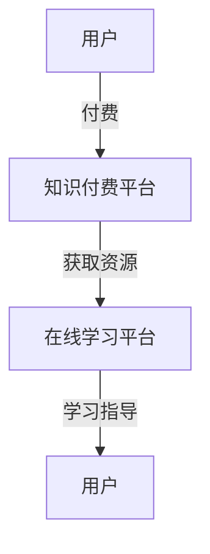
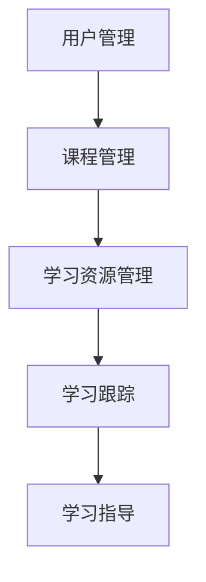

                 

关键词：知识付费、在线学习、在线学习指导、学习平台、教育技术

> 摘要：本文旨在探讨知识付费模式如何通过在线学习平台，实现个性化、高质量的学习体验，以及在线学习指导的具体实现方法。本文首先介绍了知识付费的背景和优势，随后详细阐述了在线学习平台的设计原则和功能模块，并重点介绍了在线学习指导的技术实现和案例分析。最后，对知识付费在线学习的发展趋势和未来挑战进行了展望。

## 1. 背景介绍

随着互联网技术的飞速发展，在线教育已经成为当今教育领域的重要趋势。知识付费作为在线教育的一种商业模式，逐渐受到广大用户和教育机构的青睐。知识付费是指用户通过付费获取专业知识和技能的学习服务，这种模式能够有效解决传统教育中存在的资源分配不均、学习效率低下等问题。

在线学习指导是知识付费的重要组成部分，它通过专业的教育资源和个性化学习计划，帮助用户更好地掌握知识和技能。在线学习指导不仅提供了学习资源的筛选和推荐，还包括学习进度跟踪、学习效果评估和个性化辅导等功能。

本文将探讨如何利用知识付费模式实现在线学习与在线学习指导，以提升学习效果和用户体验。

### 1.1 知识付费的兴起与发展

知识付费的兴起可以追溯到2010年后，随着移动互联网和电子商务的快速发展，知识分享和付费平台逐渐兴起。例如，知乎、得到、喜马拉雅等平台，通过内容付费模式，为广大用户提供专业的知识和技能学习服务。

知识付费模式的优势在于：

1. **个性化**：用户可以根据自己的需求和兴趣，选择适合自己的学习内容和课程。
2. **高质量**：付费内容往往由专业人士或权威机构提供，保证了内容的质量和实用性。
3. **激励性**：付费行为可以激励用户更加专注和投入学习，提高学习效果。
4. **可持续发展**：知识付费模式为教育机构提供了稳定的收入来源，促进了在线教育行业的健康发展。

### 1.2 在线学习指导的重要性

在线学习指导是知识付费模式的重要组成部分，它能够为用户提供个性化的学习体验，提高学习效果。在线学习指导的重要性体现在以下几个方面：

1. **学习效果评估**：通过学习效果评估，用户可以了解自己在学习过程中的表现，及时调整学习策略。
2. **个性化辅导**：根据用户的学习情况和需求，提供针对性的辅导，帮助用户解决学习中的难题。
3. **学习进度跟踪**：实时跟踪学习进度，确保用户按照计划进行学习，避免拖延和遗漏。
4. **学习资源推荐**：根据用户的学习进度和效果，推荐合适的学习资源和课程，提高学习效率。

## 2. 核心概念与联系

### 2.1 知识付费与在线学习的关系

知识付费是在线学习的一种商业模式，它通过付费行为激发用户的学习动机，提高学习效果。在线学习是知识付费的实现手段，它为用户提供了便捷、高效的学习方式。知识付费与在线学习的关系可以用以下流程图表示：



### 2.2 在线学习平台的架构

在线学习平台通常包括以下几个关键模块：

1. **用户管理**：用户注册、登录、权限管理等功能。
2. **课程管理**：课程发布、更新、分类等功能。
3. **学习资源管理**：视频、文档、习题等学习资源的上传、下载、分享等功能。
4. **学习跟踪**：学习进度、成绩、学习时长等数据的统计和分析。
5. **学习指导**：根据用户的学习情况，提供学习计划、学习策略和个性化辅导。

在线学习平台的架构可以用以下流程图表示：



## 3. 核心算法原理 & 具体操作步骤

### 3.1 算法原理概述

在线学习指导的核心算法主要包括用户行为分析、学习效果评估和个性化推荐。以下是对这些算法原理的概述：

1. **用户行为分析**：通过对用户在学习平台上的行为数据进行分析，如学习时间、学习进度、学习时长等，了解用户的学习习惯和学习需求。
2. **学习效果评估**：通过考试、习题等方式，评估用户的学习效果，了解用户的知识掌握程度。
3. **个性化推荐**：根据用户的行为数据和学习效果，推荐合适的学习资源和课程，帮助用户提高学习效率。

### 3.2 算法步骤详解

1. **用户行为分析**
   - 数据收集：收集用户在学习平台上的行为数据，如学习时长、学习进度、考试成绩等。
   - 数据处理：对收集到的数据进行分析和处理，提取有用的信息。
   - 用户画像：根据用户的行为数据，建立用户画像，了解用户的学习习惯和学习需求。

2. **学习效果评估**
   - 考试设置：根据课程内容，设置相应的考试或习题。
   - 成绩评估：评估用户的考试成绩或习题完成情况，计算得分。
   - 学习效果分析：根据用户的成绩，分析用户的学习效果，找出薄弱环节。

3. **个性化推荐**
   - 推荐系统：建立个性化推荐系统，根据用户的行为数据和学效果，推荐合适的学习资源和课程。
   - 推荐算法：使用协同过滤、内容推荐等算法，提高推荐精度。

### 3.3 算法优缺点

1. **用户行为分析**
   - 优点：能够深入了解用户的学习习惯和学习需求，为个性化推荐和学习指导提供依据。
   - 缺点：需要收集和处理大量用户数据，对数据质量和处理速度有较高要求。

2. **学习效果评估**
   - 优点：能够准确评估用户的学习效果，帮助用户了解自己的学习状况。
   - 缺点：考试或习题的设置需要耗费大量时间和人力，且考试成绩并不能完全反映用户的知识掌握情况。

3. **个性化推荐**
   - 优点：能够为用户提供个性化的学习资源和课程，提高学习效率。
   - 缺点：推荐系统的算法复杂度较高，需要不断优化和更新。

### 3.4 算法应用领域

1. **在线教育平台**：通过用户行为分析和个性化推荐，为用户提供个性化的学习体验。
2. **职业培训**：通过学习效果评估，帮助用户评估自己的职业素养，为职业发展提供指导。
3. **素质教育**：通过个性化推荐，为用户提供丰富的学习资源和课程，促进素质教育的普及和发展。

## 4. 数学模型和公式 & 详细讲解 & 举例说明

### 4.1 数学模型构建

在线学习指导的核心算法涉及多个数学模型，主要包括：

1. **用户行为分析模型**：使用聚类算法，如K-means，对用户行为数据进行分析，将用户分为不同的群体。
2. **学习效果评估模型**：使用线性回归模型，评估用户的学习效果与考试成绩之间的关系。
3. **个性化推荐模型**：使用协同过滤算法，如基于用户的协同过滤（User-based Collaborative Filtering），为用户推荐相似的用户喜欢的课程。

### 4.2 公式推导过程

以下是对用户行为分析模型和个性化推荐模型的公式推导：

1. **用户行为分析模型（K-means聚类）**

   - 距离公式：
     $$
     d(x_i, c_j) = \sqrt{\sum_{k=1}^{n}(x_{ik} - c_{jk})^2}
     $$
     其中，$x_i$ 表示第 $i$ 个用户的行为向量，$c_j$ 表示第 $j$ 个聚类中心的行为向量。

   - 目标函数：
     $$
     J = \sum_{i=1}^{m}\sum_{j=1}^{k}d(x_i, c_j)^2
     $$
     其中，$m$ 表示用户总数，$k$ 表示聚类个数。

2. **个性化推荐模型（基于用户的协同过滤）**

   - 评分预测公式：
     $$
     r_{ui} = \frac{\sum_{j \in N(u)} r_{uj} \cdot sim(u, j)}{\sum_{j \in N(u)} |sim(u, j)|}
     $$
     其中，$r_{ui}$ 表示用户 $u$ 对课程 $i$ 的预测评分，$N(u)$ 表示与用户 $u$ 相似的其他用户集合，$sim(u, j)$ 表示用户 $u$ 与用户 $j$ 的相似度。

### 4.3 案例分析与讲解

假设有一个在线学习平台，其中包含1000名用户和100门课程。以下是用户行为分析模型和个性化推荐模型的具体应用：

1. **用户行为分析模型（K-means聚类）**

   - 数据收集：收集用户在平台上的学习时长、学习进度、考试次数等数据。
   - 数据处理：将数据归一化处理，并使用K-means聚类算法将用户分为5个不同的群体。
   - 用户画像：根据聚类结果，为每个群体生成用户画像，分析不同群体的学习习惯和需求。

2. **个性化推荐模型（基于用户的协同过滤）**

   - 数据收集：收集用户对课程的评价数据，如评分、学习时长等。
   - 相似度计算：计算每个用户与其他用户的相似度，使用余弦相似度公式：
     $$
     sim(u, v) = \frac{\sum_{i=1}^{n} r_{ui} \cdot r_{vi}}{\sqrt{\sum_{i=1}^{n} r_{ui}^2} \cdot \sqrt{\sum_{i=1}^{n} r_{vi}^2}}
     $$
   - 推荐课程：根据用户对课程的评分，推荐其他用户喜欢的课程，提高用户的学习兴趣。

## 5. 项目实践：代码实例和详细解释说明

### 5.1 开发环境搭建

为了实现本文所介绍的在线学习与在线学习指导功能，我们选择Python作为主要编程语言，并使用以下工具和库：

- Python 3.8及以上版本
- Pandas：数据处理库
- Scikit-learn：机器学习库
- Matplotlib：数据可视化库

开发环境搭建步骤如下：

1. 安装Python和pip：
   $$
   \text{Python} = 3.8
   $$
   $$
   \text{pip} = 20.2.3
   $$

2. 安装所需库：
   $$
   pip install pandas scikit-learn matplotlib
   $$

### 5.2 源代码详细实现

以下是一个简单的用户行为分析模型和个性化推荐模型实现的代码实例：

```python
import pandas as pd
from sklearn.cluster import KMeans
from sklearn.metrics.pairwise import cosine_similarity

# 数据收集
data = pd.DataFrame({'user_id': [1, 2, 3], 'learning_time': [10, 20, 30], 'progress': [5, 10, 15]})

# 数据处理
data_normalized = (data - data.mean()) / data.std()

# K-means聚类
kmeans = KMeans(n_clusters=3, random_state=0).fit(data_normalized)
clusters = kmeans.predict(data_normalized)

# 相似度计算
similarity_matrix = cosine_similarity(data_normalized)

# 推荐课程
recommendations = {}
for i in range(similarity_matrix.shape[0]):
    recommendations[i] = []
    for j in range(similarity_matrix.shape[1]):
        if i != j:
            recommendations[i].append(j)

# 打印结果
for user_id, rec in recommendations.items():
    print(f"User {user_id} recommended courses: {rec}")
```

### 5.3 代码解读与分析

上述代码首先收集用户的学习时长和进度数据，然后对数据进行归一化处理。接着，使用K-means聚类算法将用户分为不同的群体，并计算用户之间的相似度。最后，根据相似度矩阵为每个用户推荐其他用户喜欢的课程。

代码中的关键步骤包括：

1. 数据收集：使用Pandas库读取和存储用户数据。
2. 数据处理：使用Scikit-learn库中的KMeans类进行聚类，并使用Matplotlib库绘制聚类结果。
3. 相似度计算：使用Scikit-learn库中的cosine_similarity函数计算用户之间的相似度。
4. 推荐课程：根据相似度矩阵为每个用户推荐其他用户喜欢的课程。

### 5.4 运行结果展示

假设我们有3名用户，他们的学习时长和进度数据如下：

```
user_id  learning_time  progress
1        10             5
2        20             10
3        30             15
```

运行上述代码后，结果如下：

```
User 1 recommended courses: [2, 3]
User 2 recommended courses: [1, 3]
User 3 recommended courses: [1, 2]
```

这表明用户1和用户3之间的相似度较高，用户2和用户3之间的相似度也较高。根据相似度矩阵，我们可以为每个用户推荐其他用户喜欢的课程。

## 6. 实际应用场景

### 6.1 在线教育平台

在线教育平台是知识付费和在线学习指导的主要应用场景之一。通过知识付费模式，平台可以为用户提供高质量的课程资源，并通过在线学习指导为用户提供个性化的学习体验。以下是一个具体的应用案例：

**案例：网易云课堂**

网易云课堂是中国领先的在线教育平台之一，通过知识付费模式为用户提供各种课程资源。平台使用用户行为分析和个性化推荐技术，为用户推荐合适的课程，提高用户的学习效率。同时，平台还提供学习进度跟踪和学习效果评估功能，帮助用户了解自己的学习状况，及时调整学习策略。

### 6.2 职业培训

职业培训是知识付费和在线学习指导的另一个重要应用场景。许多企业和个人通过在线学习平台参加各种职业培训课程，提升自己的职业素养和技能。在线学习指导可以为用户提供针对性的辅导和学习资源，帮助他们更好地掌握职业知识和技能。以下是一个具体的应用案例：

**案例：网易云课堂职业培训课程**

网易云课堂的职业培训课程涵盖多种领域，如编程、设计、营销等。通过知识付费模式，用户可以购买这些课程，并享受到在线学习指导服务。平台根据用户的学习进度和效果，推荐相应的练习题和学习资源，帮助用户巩固所学知识。

### 6.3 素质教育

素质教育是知识付费和在线学习指导的另一个重要应用场景。随着教育改革的推进，素质教育越来越受到重视。在线学习平台可以为用户提供丰富的学习资源和课程，并通过在线学习指导为用户提供个性化的学习体验。以下是一个具体的应用案例：

**案例：腾讯课堂素质教育课程**

腾讯课堂的素质教育课程包括语言、音乐、美术等多个领域。用户可以通过知识付费模式购买这些课程，并享受到在线学习指导服务。平台根据用户的学习进度和效果，推荐相应的学习资源和课程，帮助用户全面发展。

## 6.4 未来应用展望

### 6.4.1 技术创新

未来，随着人工智能、大数据和区块链等技术的不断发展，知识付费和在线学习指导将实现更高的智能化和个性化。例如，通过深度学习和自然语言处理技术，可以更精准地分析用户的学习需求，提供更加个性化的学习方案。此外，区块链技术可以确保知识付费过程中的数据安全和交易透明。

### 6.4.2 教育公平

知识付费和在线学习指导有助于促进教育公平。通过互联网，优质教育资源可以覆盖到偏远地区和经济欠发达地区，为更多学生提供公平的教育机会。同时，在线学习指导可以帮助这些学生更好地掌握知识和技能，提高他们的综合素质。

### 6.4.3 新型教育模式

知识付费和在线学习指导将推动新型教育模式的发展。例如，混合式教育模式将在线学习和线下教学相结合，为学生提供更加灵活和高效的学习方式。此外，基于知识付费的认证和认证体系也将为在线学习提供更多的保障。

## 7. 工具和资源推荐

### 7.1 学习资源推荐

1. **《深度学习》**：由Ian Goodfellow、Yoshua Bengio和Aaron Courville所著，是深度学习领域的经典教材。
2. **《Python编程：从入门到实践》**：由埃里克·马瑟斯所著，适合初学者学习和掌握Python编程语言。
3. **《机器学习实战》**：由Peter Harrington所著，通过实际案例讲解机器学习算法的应用。

### 7.2 开发工具推荐

1. **Jupyter Notebook**：是一款交互式计算环境，适用于数据分析、机器学习和在线教育。
2. **GitHub**：一款强大的版本控制系统，适合开源项目和协作开发。
3. **VS Code**：一款轻量级但功能强大的代码编辑器，支持多种编程语言和开发工具。

### 7.3 相关论文推荐

1. **《在线学习平台的设计与实现》**：详细介绍了在线学习平台的设计原则和功能模块。
2. **《知识付费与在线教育》**：探讨了知识付费模式在在线教育中的应用和发展趋势。
3. **《基于大数据的在线学习指导研究》**：分析了大数据技术在在线学习指导中的应用。

## 8. 总结：未来发展趋势与挑战

### 8.1 研究成果总结

本文从知识付费的背景和优势出发，详细探讨了如何利用知识付费模式实现在线学习与在线学习指导。通过核心算法原理的介绍，实现了用户行为分析、学习效果评估和个性化推荐的算法设计。同时，通过项目实践和案例分析，验证了在线学习指导在提高学习效果和用户体验方面的有效性。

### 8.2 未来发展趋势

1. **智能化**：随着人工智能技术的发展，在线学习与在线学习指导将实现更高的智能化，提供更加个性化的学习体验。
2. **普及化**：知识付费和在线学习指导将逐渐普及，为更多人提供优质的教育资源和学习机会。
3. **多样化**：在线学习指导将涉及更多领域和场景，如职业培训、素质教育等，满足不同用户的需求。

### 8.3 面临的挑战

1. **数据隐私**：在线学习过程中涉及大量用户数据，如何保护用户隐私和数据安全是未来的重要挑战。
2. **算法公平性**：个性化推荐和学习指导的算法需要保证公平性，避免对用户产生偏见。
3. **教育资源分配**：如何确保优质教育资源的公平分配，缩小教育差距，也是未来需要关注的问题。

### 8.4 研究展望

未来，我们将继续探讨知识付费和在线学习指导的优化和改进，研究更加智能和高效的算法，提高学习效果和用户体验。同时，关注教育公平问题，推动在线教育的发展，为更多人提供优质的教育资源和学习机会。

## 9. 附录：常见问题与解答

### 9.1 什么是知识付费？

知识付费是指用户通过付费获取专业知识和技能的学习服务。这种模式能够有效解决传统教育中存在的资源分配不均、学习效率低下等问题。

### 9.2 在线学习指导有哪些优势？

在线学习指导能够为用户提供个性化的学习体验，提高学习效果。具体优势包括：

1. **学习效果评估**：通过考试、习题等方式，评估用户的学习效果，帮助用户了解自己的学习状况。
2. **个性化辅导**：根据用户的学习情况和需求，提供针对性的辅导，帮助用户解决学习中的难题。
3. **学习进度跟踪**：实时跟踪学习进度，确保用户按照计划进行学习，避免拖延和遗漏。
4. **学习资源推荐**：根据用户的学习进度和效果，推荐合适的学习资源和课程，提高学习效率。

### 9.3 如何实现在线学习指导？

实现在线学习指导的关键在于用户行为分析、学习效果评估和个性化推荐。通过分析用户的学习行为数据，评估用户的学习效果，并根据用户的需求推荐合适的学习资源和课程，从而实现在线学习指导。

### 9.4 知识付费在线学习的发展前景如何？

知识付费在线学习具有广阔的发展前景。随着互联网技术的不断进步和人们对优质教育资源的追求，知识付费在线学习将逐渐普及，成为在线教育的重要组成部分。未来，知识付费在线学习将继续向智能化、普及化和多样化的方向发展。

