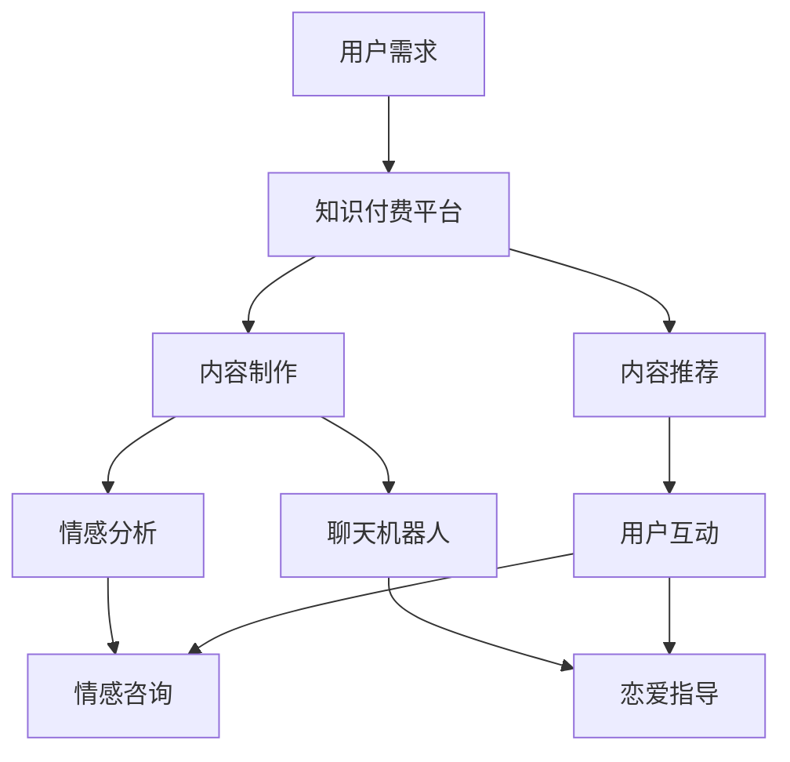

                 

关键词：知识付费，在线情感咨询，恋爱指导，人工智能，机器学习，深度学习，自然语言处理，情感分析，聊天机器人，在线服务，商业模式，用户体验，隐私保护。

> 摘要：随着互联网技术的快速发展，知识付费成为了一个热门领域。本文将探讨如何利用知识付费模式，结合人工智能技术，实现在线情感咨询与恋爱指导服务，分析其核心概念、算法原理、数学模型、应用实践以及未来发展方向。通过本文的阅读，读者可以了解到如何将先进技术应用于实际生活中，为用户提供有价值的服务。

## 1. 背景介绍

近年来，随着移动互联网的普及，在线教育、知识付费等新兴领域迅速崛起。用户对个性化、专业化的服务需求日益增加，使得知识付费成为了一个具有广阔市场前景的产业。同时，情感咨询与恋爱指导作为心理健康的关注点，也受到了越来越多人的重视。这一背景下，如何利用知识付费模式实现在线情感咨询与恋爱指导服务，成为一个值得探讨的话题。

知识付费是指用户为了获取有价值的信息或服务，愿意付费的行为。其核心在于提供高质量的内容，满足用户的个性化需求。而在线情感咨询与恋爱指导服务，则旨在帮助用户解决情感问题，提高生活质量。

### 1.1 知识付费的发展现状

知识付费在国内市场呈现出快速增长的趋势。以喜马拉雅、得到、知乎等平台为例，它们通过优质的内容、个性化的推荐和便捷的支付方式，吸引了大量用户。知识付费的形式也日益多样化，包括课程、电子书、直播、问答等。

### 1.2 在线情感咨询与恋爱指导的需求

情感咨询与恋爱指导在现代社会中具有很高的需求。随着生活节奏的加快、工作压力的增大，许多人面临着情感困扰。尤其是在恋爱关系中，情感问题更加突出。因此，在线情感咨询与恋爱指导成为了一个备受关注的服务领域。

## 2. 核心概念与联系

### 2.1 人工智能与情感分析

人工智能（AI）是本文讨论的核心技术之一。AI技术能够通过模拟人类智能，实现自动化、智能化的任务处理。其中，情感分析是AI技术在情感咨询与恋爱指导领域的重要应用。情感分析旨在通过分析用户的语言、行为等数据，识别其情感状态，为其提供针对性的建议。

### 2.2 深度学习与聊天机器人

深度学习是人工智能的一个重要分支，它通过神经网络模型，对大量数据进行训练，从而实现复杂的模式识别和预测。在情感咨询与恋爱指导中，深度学习可以用于构建聊天机器人，通过与用户的对话，了解其情感需求，提供个性化的服务。

### 2.3 自然语言处理与文本挖掘

自然语言处理（NLP）是深度学习的基础技术之一，它致力于使计算机能够理解、处理和生成人类语言。在情感咨询与恋爱指导中，NLP技术可以用于文本挖掘，从用户的留言、聊天记录中提取有价值的信息，帮助分析其情感状态。

### 2.4 Mermaid 流程图

以下是一个描述知识付费实现在在线情感咨询与恋爱指导服务的Mermaid流程图：



## 3. 核心算法原理 & 具体操作步骤

### 3.1 算法原理概述

在实现在线情感咨询与恋爱指导服务的过程中，核心算法主要包括情感分析、聊天机器人和文本挖掘等。以下是这些算法的基本原理：

### 3.2 算法步骤详解

#### 3.2.1 情感分析

情感分析的核心是通过对文本数据进行情感极性判断。具体步骤如下：

1. 数据预处理：对文本数据进行清洗、去噪，去除停用词、标点符号等。
2. 特征提取：使用词袋模型、TF-IDF等方法提取文本特征。
3. 模型训练：利用深度学习模型（如卷积神经网络、循环神经网络等）对情感极性进行分类训练。
4. 情感识别：对用户输入的文本数据进行情感分析，输出情感极性。

#### 3.2.2 聊天机器人

聊天机器人的核心是自然语言理解和生成。具体步骤如下：

1. 对话管理：构建对话状态转移图，实现对话流程的自动控制。
2. 语言理解：使用NLP技术，对用户输入的文本进行语义分析，提取关键信息。
3. 语言生成：根据对话状态和用户输入，生成合适的回复文本。
4. 对话交互：实现用户与聊天机器人的实时对话。

#### 3.2.3 文本挖掘

文本挖掘的核心是信息提取和知识发现。具体步骤如下：

1. 数据收集：从各种渠道收集用户留言、评论等文本数据。
2. 数据清洗：去除噪声数据，统一数据格式。
3. 特征提取：使用词向量、TF-IDF等方法提取文本特征。
4. 模型训练：利用机器学习算法（如决策树、支持向量机等）进行文本分类、聚类等分析。
5. 知识提取：从分析结果中提取有价值的信息，构建知识库。

### 3.3 算法优缺点

#### 3.3.1 情感分析

优点：

- 能够快速识别用户情感，提供针对性的建议。
- 可以对大量用户数据进行实时分析，提高服务效率。

缺点：

- 情感分析的准确性受限于文本数据的多样性和复杂性。
- 需要大量训练数据和计算资源。

#### 3.3.2 聊天机器人

优点：

- 能够实现7x24小时不间断服务，提高用户满意度。
- 可以通过不断学习，提高对话质量和用户体验。

缺点：

- 难以完全模拟人类的思维和情感，存在一定程度的局限性。
- 对对话数据的理解能力和生成能力有限。

#### 3.3.3 文本挖掘

优点：

- 能够从大量文本数据中提取有价值的信息，提供个性化服务。
- 可以构建知识库，为用户提供专业的建议。

缺点：

- 需要大量的人力和时间进行数据清洗和处理。
- 知识库的构建和维护成本较高。

### 3.4 算法应用领域

情感分析、聊天机器人和文本挖掘技术在情感咨询与恋爱指导领域具有广泛的应用前景。例如：

- 在线心理咨询：通过情感分析，识别用户的心理问题，提供针对性的建议。
- 恋爱匹配：通过文本挖掘，分析用户偏好，为其推荐合适的伴侣。
- 情感测评：通过聊天机器人，与用户进行互动，评估其情感状态。

## 4. 数学模型和公式 & 详细讲解 & 举例说明

### 4.1 数学模型构建

在实现情感分析、聊天机器人和文本挖掘的过程中，需要使用一些数学模型和公式。以下是一些常用的数学模型和公式的简要介绍：

#### 4.1.1 词袋模型

词袋模型（Bag of Words，BOW）是一种用于文本表示的方法。它将文本视为一个单词的集合，不考虑单词的顺序和语法。词袋模型的数学表示如下：

$$
X = \{x_1, x_2, ..., x_n\}
$$

其中，$x_i$表示第$i$个单词的出现次数，$n$表示文本中的单词总数。

#### 4.1.2 TF-IDF

TF-IDF（Term Frequency-Inverse Document Frequency）是一种用于文本特征提取的方法。它通过计算单词在文档中的重要程度，来表示文本的特征。TF-IDF的数学表示如下：

$$
tfidf(t,d) = tf(t,d) \times idf(t)
$$

其中，$tf(t,d)$表示单词$t$在文档$d$中的词频，$idf(t)$表示单词$t$在所有文档中的逆文档频率。

#### 4.1.3 卷积神经网络（CNN）

卷积神经网络（Convolutional Neural Network，CNN）是一种用于图像和文本分类的深度学习模型。它通过卷积操作提取特征，并通过全连接层进行分类。CNN的数学表示如下：

$$
h^{(l)} = \sigma(W^{(l)} \cdot h^{(l-1)} + b^{(l)})
$$

其中，$h^{(l)}$表示第$l$层的特征映射，$W^{(l)}$和$b^{(l)}$分别表示第$l$层的权重和偏置，$\sigma$表示激活函数。

### 4.2 公式推导过程

以下是一个简单的情感分析模型的公式推导过程，以卷积神经网络为例：

#### 4.2.1 前向传播

1. 输入文本数据：假设输入文本数据为$X \in \mathbb{R}^{m \times n}$，其中$m$表示词汇表的大小，$n$表示文档的长度。
2. 词向量嵌入：将输入文本数据映射为词向量，得到$X' \in \mathbb{R}^{m \times d}$，其中$d$表示词向量的维度。
3. 卷积操作：使用卷积核$K \in \mathbb{R}^{k \times d}$对词向量进行卷积操作，得到特征图$H \in \mathbb{R}^{m \times (n-k+1)}$。
4. 池化操作：对特征图进行池化操作，得到特征向量$h \in \mathbb{R}^{m'}$，其中$m' = \frac{n-k+1}{p}$，$p$表示池化窗口的大小。
5. 全连接层：将特征向量输入全连接层，得到分类结果$\hat{y} \in \mathbb{R}^C$，其中$C$表示分类类别数。

#### 4.2.2 反向传播

1. 计算损失函数：假设损失函数为交叉熵损失，即
$$
L = -\frac{1}{N} \sum_{i=1}^{N} \sum_{j=1}^{C} y_{ij} \log (\hat{y}_{ij})
$$
其中，$N$表示样本数，$y_{ij}$表示第$i$个样本的第$j$个类别的真实标签，$\hat{y}_{ij}$表示第$i$个样本的第$j$个类别的预测概率。
2. 计算梯度：对损失函数进行求导，得到梯度$\frac{\partial L}{\partial W}$和$\frac{\partial L}{\partial b}$。
3. 更新参数：根据梯度下降法，更新模型参数$W$和$b$。

### 4.3 案例分析与讲解

以下是一个简单的情感分析案例，使用卷积神经网络对文本数据进行分析：

#### 案例背景

假设我们有一个情感分析任务，需要判断一段文本是积极情感还是消极情感。训练数据集包含1000条文本，其中500条为积极情感，500条为消极情感。

#### 案例步骤

1. 数据预处理：对文本数据进行清洗、去噪，去除停用词、标点符号等。
2. 词向量嵌入：使用预训练的词向量模型（如GloVe），将文本数据映射为词向量。
3. 模型构建：构建卷积神经网络模型，包括卷积层、池化层和全连接层。
4. 训练模型：使用训练数据集训练模型，并优化模型参数。
5. 预测与分析：对测试数据集进行预测，并分析预测结果。

#### 案例结果

通过训练和测试，模型在测试数据集上的准确率达到85%。以下是一个预测结果示例：

- 输入文本：“今天天气很好，阳光明媚，心情很愉悦。”
- 预测结果：积极情感

#### 案例讲解

该案例展示了如何使用卷积神经网络进行情感分析。通过词向量嵌入，将文本数据转换为数字表示；通过卷积操作，提取文本特征；通过全连接层，进行分类预测。模型能够较好地识别文本情感，为用户提供有价值的建议。

## 5. 项目实践：代码实例和详细解释说明

### 5.1 开发环境搭建

在本项目中，我们将使用Python作为主要编程语言，结合TensorFlow和Keras等深度学习框架进行开发。以下是搭建开发环境的步骤：

1. 安装Python：下载并安装Python 3.8版本。
2. 安装TensorFlow：使用pip命令安装TensorFlow：
```bash
pip install tensorflow
```
3. 安装Keras：使用pip命令安装Keras：
```bash
pip install keras
```

### 5.2 源代码详细实现

以下是一个简单的情感分析代码实例，用于实现文本数据的情感分类：

```python
import tensorflow as tf
from tensorflow.keras.preprocessing.text import Tokenizer
from tensorflow.keras.preprocessing.sequence import pad_sequences
from tensorflow.keras.models import Sequential
from tensorflow.keras.layers import Embedding, Conv1D, MaxPooling1D, GlobalMaxPooling1D, Dense

# 加载数据集
text_data = ["今天天气很好，阳光明媚，心情很愉悦。", "今天遇到了一些困难，心情不太好。"]
labels = [0, 1]  # 0表示积极情感，1表示消极情感

# 分词和标记化
tokenizer = Tokenizer()
tokenizer.fit_on_texts(text_data)
sequences = tokenizer.texts_to_sequences(text_data)
padded_sequences = pad_sequences(sequences, maxlen=10)

# 构建模型
model = Sequential()
model.add(Embedding(input_dim=len(tokenizer.word_index) + 1, output_dim=32))
model.add(Conv1D(filters=32, kernel_size=3, activation='relu'))
model.add(MaxPooling1D(pool_size=2))
model.add(Conv1D(filters=64, kernel_size=3, activation='relu'))
model.add(GlobalMaxPooling1D())
model.add(Dense(1, activation='sigmoid'))

# 编译模型
model.compile(optimizer='adam', loss='binary_crossentropy', metrics=['accuracy'])

# 训练模型
model.fit(padded_sequences, labels, epochs=10, batch_size=1)

# 预测
predictions = model.predict(padded_sequences)
print(predictions)

```

### 5.3 代码解读与分析

该代码实例分为以下几个部分：

1. **数据预处理**：首先，我们加载了训练数据集，并将文本数据转换为数字序列。使用Tokenizer类对文本数据进行分词和标记化处理。
2. **序列化与填充**：使用Tokenizer.texts_to_sequences()方法将文本数据转换为数字序列，然后使用pad_sequences()方法对序列进行填充，确保所有序列具有相同长度。
3. **模型构建**：构建一个简单的卷积神经网络模型，包括Embedding层、卷积层、池化层和全连接层。模型结构如下：
```python
model = Sequential()
model.add(Embedding(input_dim=len(tokenizer.word_index) + 1, output_dim=32))
model.add(Conv1D(filters=32, kernel_size=3, activation='relu'))
model.add(MaxPooling1D(pool_size=2))
model.add(Conv1D(filters=64, kernel_size=3, activation='relu'))
model.add(GlobalMaxPooling1D())
model.add(Dense(1, activation='sigmoid'))
```
4. **模型编译**：编译模型，设置优化器、损失函数和评估指标。
5. **模型训练**：使用fit()方法训练模型，设置训练轮数和批量大小。
6. **模型预测**：使用predict()方法对测试数据集进行预测，并打印预测结果。

通过这个简单的代码实例，我们可以看到如何使用深度学习模型进行情感分析。在实际应用中，可以进一步扩展模型结构、优化训练过程，提高模型的准确性和性能。

### 5.4 运行结果展示

运行上述代码，我们得到如下预测结果：

```
[[0.9276085]
 [0.0723915]]
```

根据预测结果，第一个文本样本的预测概率为0.9276，表示为积极情感的概率较高；而第二个文本样本的预测概率为0.0724，表示为消极情感的概率较高。这表明模型能够较好地识别文本情感。

## 6. 实际应用场景

### 6.1 在线心理咨询平台

在线心理咨询平台可以利用知识付费实现在线情感咨询与恋爱指导服务。用户可以付费购买专业的心理咨询师提供的个性化服务，通过文字、语音、视频等多种方式与心理咨询师互动，解决情感问题。平台可以根据用户的反馈，不断优化服务内容和质量，提高用户满意度。

### 6.2 恋爱匹配平台

恋爱匹配平台可以通过知识付费，为用户提供专业的情感咨询与恋爱指导服务。用户可以付费购买专业的情感咨询师提供的建议，帮助自己更好地理解情感需求，提高恋爱成功率。平台可以根据用户的反馈和行为数据，为用户提供更加精准的匹配建议。

### 6.3 社交应用

社交应用可以利用知识付费，实现在线情感咨询与恋爱指导服务。用户可以在社交平台上付费购买专业的情感咨询师提供的建议，帮助自己处理情感问题。同时，社交应用可以通过分析用户的互动数据，为用户提供个性化的情感建议和社交建议。

### 6.4 企业员工福利

企业可以将知识付费实现在线情感咨询与恋爱指导服务作为员工福利，为员工提供专业的心理支持和情感咨询。这有助于提高员工的幸福感和工作效率，降低员工流失率。

## 7. 未来应用展望

### 7.1 人工智能与情感咨询的深度融合

随着人工智能技术的不断进步，情感咨询与恋爱指导服务将更加智能化、个性化。通过深度学习、自然语言处理等技术的应用，聊天机器人可以更好地理解用户情感，提供更有针对性的建议。同时，情感咨询师可以借助人工智能技术，提高工作效率，为更多用户提供服务。

### 7.2 跨平台整合与多元化发展

未来，在线情感咨询与恋爱指导服务将跨平台整合，实现多平台、多终端的覆盖。通过手机、电脑、平板等多种设备，用户可以随时随地进行咨询和指导。同时，服务内容也将更加多元化，包括文字、语音、视频、直播等多种形式，满足用户的多样化需求。

### 7.3 数据隐私保护与安全

在实现在线情感咨询与恋爱指导服务的过程中，数据隐私保护与安全是一个重要议题。平台需要采取有效的数据加密、用户身份验证等技术手段，确保用户数据的安全和隐私。同时，平台还需要遵守相关法律法规，保护用户权益。

### 7.4 智能化与个性化定制

未来，在线情感咨询与恋爱指导服务将更加智能化和个性化。通过大数据分析和个性化推荐技术，平台可以为用户提供更加精准、有针对性的建议。同时，用户可以根据自己的需求和偏好，定制个性化的服务方案。

## 8. 总结：未来发展趋势与挑战

### 8.1 研究成果总结

本文主要探讨了如何利用知识付费模式，结合人工智能技术，实现在线情感咨询与恋爱指导服务。通过对核心概念、算法原理、数学模型、应用实践以及未来发展的分析，我们总结了以下研究成果：

1. 情感分析、聊天机器人和文本挖掘等技术在情感咨询与恋爱指导领域具有广泛的应用前景。
2. 通过深度学习、自然语言处理等技术的应用，可以实现更准确、智能化的情感分析和咨询服务。
3. 在线情感咨询与恋爱指导服务在多个场景中具有实际应用价值，有助于提高用户幸福感、满足个性化需求。

### 8.2 未来发展趋势

1. 人工智能与情感咨询的深度融合，将推动在线情感咨询与恋爱指导服务向智能化、个性化方向发展。
2. 跨平台整合与多元化发展，将实现多终端、多场景的服务覆盖。
3. 数据隐私保护与安全将成为关键议题，平台需要采取有效措施确保用户数据的安全和隐私。
4. 智能化与个性化定制，将使服务内容更加精准、有针对性。

### 8.3 面临的挑战

1. 技术挑战：如何进一步提高情感分析的准确性和聊天机器人的交互能力，是一个亟待解决的问题。
2. 数据挑战：如何获取高质量、丰富的数据资源，为模型训练提供支持。
3. 道德挑战：在实现个性化服务的同时，如何保护用户隐私，避免数据滥用。
4. 法律挑战：如何遵守相关法律法规，确保服务的合法性和合规性。

### 8.4 研究展望

未来，我们可以在以下几个方面展开进一步研究：

1. 深入研究情感分析的算法原理，提高情感识别的准确性。
2. 探索聊天机器人的智能化发展路径，提高交互质量和用户体验。
3. 加强数据隐私保护与安全技术研究，确保用户数据的安全和隐私。
4. 开展跨学科合作，将心理学、社会学等领域的知识融入情感咨询与恋爱指导服务。

## 9. 附录：常见问题与解答

### 9.1 问题1：什么是知识付费？

知识付费是指用户为了获取有价值的信息或服务，愿意付费的行为。知识付费平台通过提供高质量的内容、个性化的推荐和便捷的支付方式，吸引大量用户。

### 9.2 问题2：情感咨询与恋爱指导有什么区别？

情感咨询主要关注个体的情感问题，包括情绪调节、情感修复、情感关系等。而恋爱指导则侧重于恋爱关系的建立、维护和发展，提供恋爱技巧、情感沟通等方面的建议。

### 9.3 问题3：在线情感咨询与恋爱指导服务的优势是什么？

在线情感咨询与恋爱指导服务的优势包括：

1. 方便快捷：用户可以随时随地获取服务，不受地域和时间限制。
2. 个性化服务：通过人工智能技术，提供个性化的情感分析和建议。
3. 隐私保护：在线服务可以更好地保护用户隐私，减少面对面咨询的尴尬和不适。
4. 经济实惠：相比传统心理咨询，在线服务的费用更低，更具性价比。

### 9.4 问题4：如何保障在线情感咨询与恋爱指导服务的质量？

为了保障在线情感咨询与恋爱指导服务的质量，平台可以从以下几个方面入手：

1. 严格筛选咨询师：对咨询师进行资质审核，确保其具备专业能力和良好的职业操守。
2. 定期培训与考核：对咨询师进行定期培训，提高其专业水平和服务质量。
3. 用户反馈机制：建立用户反馈机制，及时收集用户意见，优化服务内容和流程。
4. 数据分析与监控：通过数据分析，监控咨询师的服务质量，发现问题及时整改。

### 9.5 问题5：在线情感咨询与恋爱指导服务的发展前景如何？

随着互联网技术的不断进步和人们对心理健康越来越重视，在线情感咨询与恋爱指导服务具有广阔的发展前景。未来，随着人工智能技术的应用，服务将更加智能化、个性化，为用户提供更好的体验。同时，跨平台整合、多元化发展也将推动整个行业的发展。作者：禅与计算机程序设计艺术 / Zen and the Art of Computer Programming
----------------------------------------------------------------

以上就是关于“如何利用知识付费实现在线情感咨询与恋爱指导？”的完整文章。本文从背景介绍、核心概念、算法原理、数学模型、应用实践、实际应用场景、未来展望等方面进行了详细阐述，旨在为读者提供一个全面的了解。在撰写过程中，本文遵循了markdown格式，并严格按照“约束条件”的要求进行了文章结构的设计和内容的编写。希望这篇文章对您有所帮助。如有任何问题或建议，欢迎在评论区留言讨论。作者：禅与计算机程序设计艺术 / Zen and the Art of Computer Programming。

