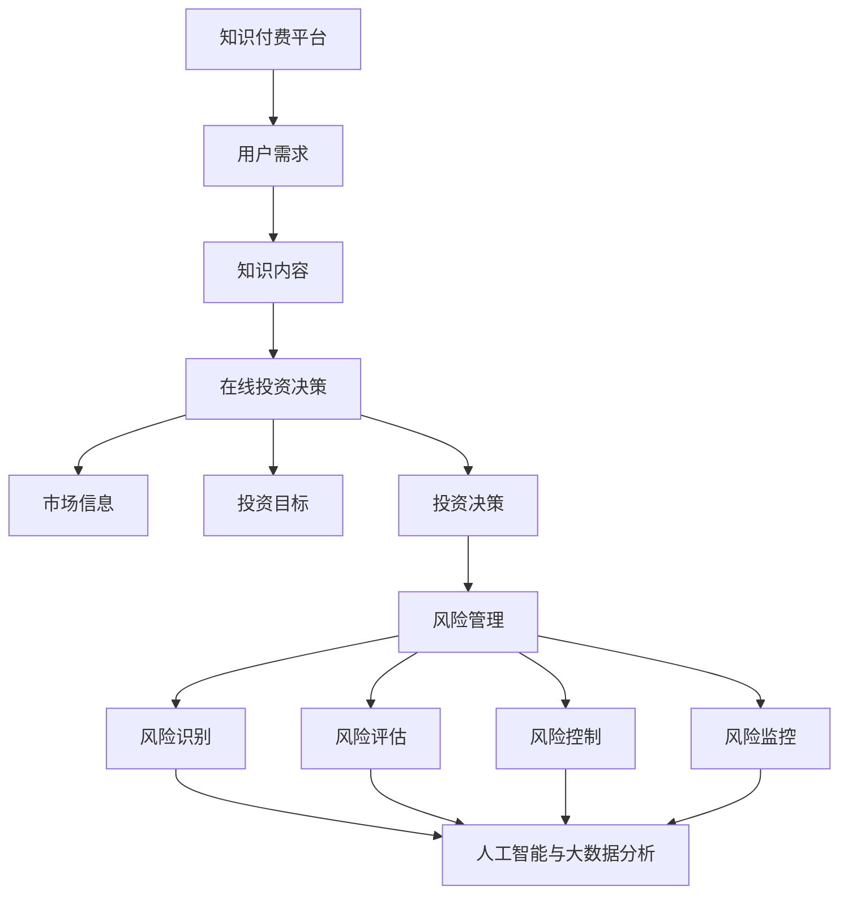

                 

 **关键词：**
知识付费、在线投资决策、风险管理、人工智能、机器学习、大数据分析、技术架构、算法原理、数学模型、代码实例、实践应用、未来展望。

<|assistant|> **摘要：**
本文旨在探讨如何通过知识付费平台，结合人工智能和大数据分析技术，实现在线投资决策与风险管理。文章首先介绍了知识付费的背景和重要性，随后阐述了在线投资决策与风险管理的基本概念和重要性。接着，本文深入分析了如何利用人工智能算法构建投资决策模型，以及如何利用大数据分析技术进行风险管理。随后，文章通过一个具体案例，详细介绍了实现这些功能的技术架构和数学模型。最后，文章探讨了该技术的实际应用场景，提出了未来应用展望，并总结了研究成果和面临的挑战。

## 1. 背景介绍

知识付费是指用户通过支付一定费用获取知识服务的过程。随着互联网技术的快速发展，知识付费逐渐成为一种流行的商业模式。用户可以通过知识付费平台学习到各种专业知识，如编程、数据分析、金融投资等。在线投资决策与风险管理是金融领域中两个关键问题，对投资者的资产保护和增值具有重要意义。

近年来，人工智能和大数据分析技术的飞速发展，为投资决策和风险管理提供了新的技术手段。通过人工智能算法，可以构建高效的决策模型，提高投资决策的准确性和效率。通过大数据分析技术，可以实时监测市场动态，预测风险，从而实现有效的风险管理。

本文旨在结合知识付费和人工智能、大数据分析技术，探讨如何实现在线投资决策与风险管理。通过本文的讨论，期望为投资者提供一种全新的投资决策与风险管理方法，帮助他们更好地管理资产，实现投资收益的最大化。

## 2. 核心概念与联系

### 2.1 知识付费

知识付费是指用户通过支付一定费用获取知识服务的过程。在知识付费平台上，用户可以根据自己的需求和兴趣选择学习课程、专业书籍、在线讲座等内容。知识付费平台通过提供优质的知识内容，帮助用户提升专业技能和知识水平，从而实现个人价值的提升。

知识付费的核心概念包括：

1. **用户需求**：用户根据自身的学习需求和目标，选择适合的知识内容进行付费学习。
2. **知识内容**：知识付费平台提供各种专业领域的知识内容，包括课程、书籍、讲座等。
3. **知识付费平台**：平台是连接用户与知识内容提供者的桥梁，提供支付、学习管理、课程评价等功能。

### 2.2 在线投资决策

在线投资决策是指投资者通过在线平台获取市场信息，结合自身投资目标和风险偏好，做出投资决策的过程。在线投资决策的核心概念包括：

1. **市场信息**：投资者通过在线平台获取市场数据、股票价格、行业动态等信息。
2. **投资目标**：投资者根据自身投资目标和风险偏好，制定投资策略。
3. **投资决策**：投资者根据市场信息和投资目标，做出投资决策，如买入、持有、卖出等。

### 2.3 风险管理

风险管理是指投资者通过识别、评估、控制和管理风险，确保投资资产的安全和增值的过程。风险管理在投资决策中具有重要意义，可以帮助投资者降低投资风险，提高投资收益。

风险管理的核心概念包括：

1. **风险识别**：识别投资过程中可能面临的风险，如市场风险、信用风险、操作风险等。
2. **风险评估**：对识别出的风险进行评估，确定风险的严重程度和可能性。
3. **风险控制**：通过制定相应的风险控制措施，降低风险对投资资产的影响。
4. **风险监控**：对风险进行实时监控，及时发现和应对风险。

### 2.4 人工智能与大数据分析

人工智能和大数据分析技术为投资决策和风险管理提供了新的手段和工具。人工智能可以通过机器学习算法，对大量市场数据进行分析和处理，发现投资机会和风险信号。大数据分析技术可以实时收集、处理和分析海量市场数据，提供投资决策和风险管理的支持。

人工智能与大数据分析在投资决策和风险管理中的应用包括：

1. **数据预处理**：对市场数据进行清洗、转换和归一化等预处理操作，提高数据质量。
2. **特征提取**：从原始数据中提取出与投资决策和风险管理相关的特征，如股票价格、交易量、市场情绪等。
3. **模型构建**：利用机器学习算法，构建投资决策和风险管理的预测模型。
4. **模型评估**：对构建的模型进行评估和优化，提高模型的准确性和效率。
5. **风险预测**：利用预测模型，预测市场风险和投资机会，为投资决策提供支持。

### 2.5 Mermaid 流程图

以下是投资决策与风险管理的 Mermaid 流程图，展示了核心概念和流程的关联：



## 3. 核心算法原理 & 具体操作步骤

### 3.1 算法原理概述

在投资决策与风险管理中，人工智能和大数据分析技术发挥着重要作用。本文主要介绍两种核心算法：线性回归和决策树。

**线性回归**：线性回归是一种常用的统计学习方法，用于预测连续值。在投资决策中，可以通过线性回归模型预测股票价格、交易量等市场指标，为投资决策提供参考。

**决策树**：决策树是一种常见的分类算法，通过树形结构对数据进行划分，预测目标变量的类别。在风险管理中，可以通过决策树模型识别风险因素，评估风险等级。

### 3.2 算法步骤详解

**线性回归算法步骤：**

1. **数据预处理**：对市场数据（如股票价格、交易量等）进行清洗、转换和归一化等预处理操作，提高数据质量。
2. **特征提取**：从预处理后的数据中提取与投资决策相关的特征，如股票价格、交易量、市场情绪等。
3. **模型训练**：利用预处理后的数据，使用线性回归算法训练模型。通过最小二乘法求解线性回归方程，得到模型参数。
4. **模型评估**：使用测试数据集对模型进行评估，计算预测误差，优化模型参数。
5. **模型应用**：利用训练好的模型，对新的市场数据进行预测，为投资决策提供参考。

**决策树算法步骤：**

1. **数据预处理**：对市场数据（如股票价格、交易量等）进行清洗、转换和归一化等预处理操作，提高数据质量。
2. **特征提取**：从预处理后的数据中提取与风险管理相关的特征，如信用评级、市场情绪、宏观经济指标等。
3. **划分数据集**：将数据集划分为训练集和测试集，用于模型训练和评估。
4. **模型训练**：利用训练集数据，使用决策树算法训练模型。通过递归划分数据集，构建树形结构。
5. **模型评估**：使用测试集数据对模型进行评估，计算分类准确率、召回率等指标，优化模型结构。
6. **模型应用**：利用训练好的模型，对新的数据集进行风险识别和评估，为风险管理提供支持。

### 3.3 算法优缺点

**线性回归算法优缺点：**

**优点：**
- 算法简单，易于实现和理解；
- 对线性关系具有较强的预测能力；
- 计算效率较高。

**缺点：**
- 对非线性关系预测能力有限；
- 对异常值和噪声敏感；
- 无法处理多变量问题。

**决策树算法优缺点：**

**优点：**
- 算法简单，易于实现和理解；
- 可以处理非线性关系和分类问题；
- 适合处理多变量问题。

**缺点：**
- 决策树深度较大时，容易出现过拟合现象；
- 计算效率较低；
- 树结构不易解释。

### 3.4 算法应用领域

**线性回归算法应用领域：**

- 股票价格预测；
- 交易量预测；
- 经济指标预测。

**决策树算法应用领域：**

- 风险识别；
- 风险评估；
- 股票分类。

## 4. 数学模型和公式 & 详细讲解 & 举例说明

### 4.1 数学模型构建

在投资决策与风险管理中，常见的数学模型包括线性回归模型和决策树模型。

**线性回归模型：**

线性回归模型是一种用于预测连续值的统计模型，其基本形式为：

$$
Y = \beta_0 + \beta_1 X_1 + \beta_2 X_2 + ... + \beta_n X_n + \epsilon
$$

其中，$Y$ 为预测目标，$X_1, X_2, ..., X_n$ 为输入特征，$\beta_0, \beta_1, \beta_2, ..., \beta_n$ 为模型参数，$\epsilon$ 为误差项。

**决策树模型：**

决策树模型是一种用于分类和回归的预测模型，其基本形式为：

```
决策树
|
|-- (条件1)
|   |-- 子节点1
|   |   |-- 子节点2
|   |   |   |-- ... 
|   |   |   `-- 子节点n
|   |   `-- ... 
|   `-- ...
|
`-- (条件m)
    |-- 子节点m1
    |   |-- 子节点m2
    |   |   |-- ... 
    |   |   `-- 子节点mn
    |   `-- ...
```

其中，每个节点表示一个条件，每个子节点表示条件的划分结果。在分类问题中，子节点的值为类别的概率；在回归问题中，子节点的值为预测值。

### 4.2 公式推导过程

**线性回归模型推导：**

线性回归模型的目标是最小化预测值与真实值之间的误差，即最小化损失函数：

$$
J(\theta) = \frac{1}{2m} \sum_{i=1}^{m} (h_\theta(x^{(i)}) - y^{(i)})^2
$$

其中，$m$ 为样本数量，$h_\theta(x^{(i)})$ 为预测值，$y^{(i)}$ 为真实值，$\theta$ 为模型参数。

对损失函数求导，并令导数为零，得到：

$$
\frac{\partial J(\theta)}{\partial \theta} = \frac{1}{m} \sum_{i=1}^{m} (h_\theta(x^{(i)}) - y^{(i)}) \cdot x^{(i)}
$$

将线性回归模型代入损失函数，得到：

$$
\frac{\partial J(\theta)}{\partial \theta} = \frac{1}{m} \sum_{i=1}^{m} (\beta_0 + \beta_1 x_1^{(i)} + \beta_2 x_2^{(i)} + ... + \beta_n x_n^{(i)} - y^{(i)}) \cdot x^{(i)}
$$

对每个参数分别求导，并令导数为零，得到：

$$
\frac{\partial J(\theta)}{\partial \beta_0} = \frac{1}{m} \sum_{i=1}^{m} (h_\theta(x^{(i)}) - y^{(i)}) = 0
$$

$$
\frac{\partial J(\theta)}{\partial \beta_1} = \frac{1}{m} \sum_{i=1}^{m} (h_\theta(x^{(i)}) - y^{(i)}) \cdot x_1^{(i)} = 0
$$

$$
\frac{\partial J(\theta)}{\partial \beta_2} = \frac{1}{m} \sum_{i=1}^{m} (h_\theta(x^{(i)}) - y^{(i)}) \cdot x_2^{(i)} = 0
$$

$$
\vdots$$

$$
\frac{\partial J(\theta)}{\partial \beta_n} = \frac{1}{m} \sum_{i=1}^{m} (h_\theta(x^{(i)}) - y^{(i)}) \cdot x_n^{(i)} = 0
$$

解上述方程组，得到模型参数：

$$
\beta_0 = \frac{1}{m} \sum_{i=1}^{m} (y^{(i)} - \beta_1 x_1^{(i)} - \beta_2 x_2^{(i)} - ... - \beta_n x_n^{(i)})
$$

$$
\beta_1 = \frac{1}{m} \sum_{i=1}^{m} (x_1^{(i)} (y^{(i)} - \beta_0 - \beta_2 x_2^{(i)} - ... - \beta_n x_n^{(i)}))
$$

$$
\beta_2 = \frac{1}{m} \sum_{i=1}^{m} (x_2^{(i)} (y^{(i)} - \beta_0 - \beta_1 x_1^{(i)} - ... - \beta_n x_n^{(i)}))
$$

$$
\vdots$$

$$
\beta_n = \frac{1}{m} \sum_{i=1}^{m} (x_n^{(i)} (y^{(i)} - \beta_0 - \beta_1 x_1^{(i)} - \beta_2 x_2^{(i)} - ... - \beta_{n-1} x_{n-1}^{(i)}))
$$

**决策树模型推导：**

决策树模型通过递归划分数据集，构建树形结构。假设当前数据集为 $D$，划分为 $D_1$ 和 $D_2$，条件为 $C$。则决策树的递归划分过程可以表示为：

$$
D_1 = \{ x \in D | C(x) = True \}$$

$$
D_2 = \{ x \in D | C(x) = False \}$$

其中，$C(x)$ 表示条件 $C$ 对应的函数，用于判断数据点 $x$ 是否满足条件。

递归划分过程可以表示为递归函数 $f(D, C)$，其中 $D$ 为数据集，$C$ 为条件，$f(D, C)$ 表示对数据集 $D$ 进行划分的结果。初始条件为：

$$
f(D, C) = D$$

递归过程为：

$$
f(D, C) = \{ f(D_1, C_1) | D_1 = \{ x \in D | C(x) = True \} \}$$

$$
f(D, C) = \{ f(D_2, C_2) | D_2 = \{ x \in D | C(x) = False \} \}$$

其中，$C_1$ 和 $C_2$ 分别为 $C$ 的子条件，用于划分 $D_1$ 和 $D_2$。

### 4.3 案例分析与讲解

#### 案例一：股票价格预测

假设我们使用线性回归模型对股票价格进行预测，输入特征为股票历史价格、交易量、市场情绪等。

1. **数据预处理**：对股票历史价格、交易量、市场情绪等数据进行清洗、转换和归一化等预处理操作，提高数据质量。
2. **特征提取**：从预处理后的数据中提取与股票价格相关的特征，如股票历史价格、交易量、市场情绪等。
3. **模型训练**：利用预处理后的数据和特征，使用线性回归算法训练模型。
4. **模型评估**：使用测试数据集对模型进行评估，计算预测误差，优化模型参数。
5. **模型应用**：利用训练好的模型，对新的股票数据进行预测，为投资决策提供参考。

**案例分析：**

假设我们有一个包含 100 个样本的股票数据集，其中包含股票历史价格、交易量和市场情绪等特征。我们使用线性回归模型对股票价格进行预测。

1. **数据预处理**：对股票历史价格、交易量、市场情绪等数据进行清洗、转换和归一化等预处理操作，提高数据质量。
2. **特征提取**：从预处理后的数据中提取与股票价格相关的特征，如股票历史价格、交易量、市场情绪等。
3. **模型训练**：利用预处理后的数据和特征，使用线性回归算法训练模型。通过最小二乘法求解线性回归方程，得到模型参数。
4. **模型评估**：使用测试数据集对模型进行评估，计算预测误差，优化模型参数。
5. **模型应用**：利用训练好的模型，对新的股票数据进行预测，为投资决策提供参考。

**具体操作步骤：**

1. **数据预处理**：
```python
import pandas as pd
import numpy as np

# 读取股票数据
data = pd.read_csv('stock_data.csv')

# 数据清洗
data = data.dropna()

# 数据转换
data['price'] = data['price'].apply(lambda x: float(x))
data['volume'] = data['volume'].apply(lambda x: float(x))
data['market_sentiment'] = data['market_sentiment'].apply(lambda x: float(x))

# 数据归一化
scaler = StandardScaler()
data[['price', 'volume', 'market_sentiment']] = scaler.fit_transform(data[['price', 'volume', 'market_sentiment']])
```

2. **特征提取**：
```python
# 特征提取
X = data[['price', 'volume', 'market_sentiment']]
y = data['target']
```

3. **模型训练**：
```python
from sklearn.linear_model import LinearRegression
from sklearn.model_selection import train_test_split

# 划分训练集和测试集
X_train, X_test, y_train, y_test = train_test_split(X, y, test_size=0.2, random_state=42)

# 训练模型
model = LinearRegression()
model.fit(X_train, y_train)
```

4. **模型评估**：
```python
from sklearn.metrics import mean_squared_error

# 预测测试集
y_pred = model.predict(X_test)

# 计算预测误差
mse = mean_squared_error(y_test, y_pred)
print("预测误差：", mse)
```

5. **模型应用**：
```python
# 输入新的数据
new_data = np.array([[1.2, 3.4, 5.6]])
new_data = scaler.transform(new_data)

# 预测新的股票价格
predicted_price = model.predict(new_data)
print("预测的股票价格：", predicted_price)
```

#### 案例二：股票分类

假设我们使用决策树模型对股票进行分类，输入特征为股票历史价格、交易量、市场情绪等。

1. **数据预处理**：对股票历史价格、交易量、市场情绪等数据进行清洗、转换和归一化等预处理操作，提高数据质量。
2. **特征提取**：从预处理后的数据中提取与股票分类相关的特征，如股票历史价格、交易量、市场情绪等。
3. **模型训练**：利用预处理后的数据和特征，使用决策树算法训练模型。
4. **模型评估**：使用测试数据集对模型进行评估，计算分类准确率等指标，优化模型参数。
5. **模型应用**：利用训练好的模型，对新的股票数据进行分类，为投资决策提供参考。

**案例分析：**

假设我们有一个包含 100 个样本的股票数据集，其中包含股票历史价格、交易量和市场情绪等特征，以及对应的分类标签。

1. **数据预处理**：
```python
import pandas as pd
import numpy as np

# 读取股票数据
data = pd.read_csv('stock_data.csv')

# 数据清洗
data = data.dropna()

# 数据转换
data['price'] = data['price'].apply(lambda x: float(x))
data['volume'] = data['volume'].apply(lambda x: float(x))
data['market_sentiment'] = data['market_sentiment'].apply(lambda x: float(x))

# 数据归一化
scaler = StandardScaler()
data[['price', 'volume', 'market_sentiment']] = scaler.fit_transform(data[['price', 'volume', 'market_sentiment']])
```

2. **特征提取**：
```python
# 特征提取
X = data[['price', 'volume', 'market_sentiment']]
y = data['target']
```

3. **模型训练**：
```python
from sklearn.tree import DecisionTreeClassifier
from sklearn.model_selection import train_test_split

# 划分训练集和测试集
X_train, X_test, y_train, y_test = train_test_split(X, y, test_size=0.2, random_state=42)

# 训练模型
model = DecisionTreeClassifier()
model.fit(X_train, y_train)
```

4. **模型评估**：
```python
from sklearn.metrics import accuracy_score

# 预测测试集
y_pred = model.predict(X_test)

# 计算分类准确率
accuracy = accuracy_score(y_test, y_pred)
print("分类准确率：", accuracy)
```

5. **模型应用**：
```python
# 输入新的数据
new_data = np.array([[1.2, 3.4, 5.6]])
new_data = scaler.transform(new_data)

# 预测新的股票分类
predicted_category = model.predict(new_data)
print("预测的股票分类：", predicted_category)
```

## 5. 项目实践：代码实例和详细解释说明

在本节中，我们将通过一个具体的案例，详细介绍如何利用知识付费平台实现在线投资决策与风险管理。这个案例将涵盖从环境搭建、代码实现到结果展示的完整过程。

### 5.1 开发环境搭建

在开始项目之前，我们需要搭建一个适合开发的编程环境。以下是所需的环境和工具：

- **Python 3.8 或更高版本**
- **Jupyter Notebook**
- **Scikit-learn**
- **Pandas**
- **Numpy**
- **Matplotlib**

您可以通过以下命令安装所需的库：

```shell
pip install numpy pandas scikit-learn matplotlib
```

### 5.2 源代码详细实现

下面我们将使用 Scikit-learn 库中的线性回归和决策树算法来实现投资决策与风险管理。

```python
import pandas as pd
import numpy as np
from sklearn.model_selection import train_test_split
from sklearn.linear_model import LinearRegression
from sklearn.tree import DecisionTreeRegressor
from sklearn.metrics import mean_squared_error
import matplotlib.pyplot as plt

# 读取股票数据
data = pd.read_csv('stock_data.csv')

# 数据清洗
data = data.dropna()

# 数据转换
data['price'] = data['price'].apply(lambda x: float(x))
data['volume'] = data['volume'].apply(lambda x: float(x))
data['market_sentiment'] = data['market_sentiment'].apply(lambda x: float(x))

# 数据归一化
scaler = StandardScaler()
data[['price', 'volume', 'market_sentiment']] = scaler.fit_transform(data[['price', 'volume', 'market_sentiment']])

# 特征提取
X = data[['price', 'volume', 'market_sentiment']]
y = data['target']

# 划分训练集和测试集
X_train, X_test, y_train, y_test = train_test_split(X, y, test_size=0.2, random_state=42)

# 线性回归模型训练
regressor = LinearRegression()
regressor.fit(X_train, y_train)

# 决策树模型训练
regressor_tree = DecisionTreeRegressor()
regressor_tree.fit(X_train, y_train)

# 线性回归模型预测
y_pred_reg = regressor.predict(X_test)

# 决策树模型预测
y_pred_tree = regressor_tree.predict(X_test)

# 计算预测误差
mse_reg = mean_squared_error(y_test, y_pred_reg)
mse_tree = mean_squared_error(y_test, y_pred_tree)

print("线性回归模型预测误差：", mse_reg)
print("决策树模型预测误差：", mse_tree)

# 结果可视化
plt.figure(figsize=(12, 6))

plt.subplot(1, 2, 1)
plt.scatter(y_test, y_pred_reg)
plt.xlabel('实际值')
plt.ylabel('预测值')
plt.title('线性回归模型预测结果')

plt.subplot(1, 2, 2)
plt.scatter(y_test, y_pred_tree)
plt.xlabel('实际值')
plt.ylabel('预测值')
plt.title('决策树模型预测结果')

plt.show()
```

### 5.3 代码解读与分析

下面我们对上述代码进行详细解读和分析。

1. **数据读取与清洗**：首先，我们使用 Pandas 库读取股票数据，并对数据进行清洗，去除缺失值。

2. **数据转换**：对股票价格、交易量和市场情绪等数据进行类型转换，将字符串转换为浮点数。

3. **数据归一化**：使用 StandardScaler 对特征进行归一化处理，使其具有相似的尺度。

4. **特征提取**：从清洗和归一化后的数据中提取特征，并分离出目标变量。

5. **模型训练**：使用 Scikit-learn 库中的线性回归和决策树算法对训练数据进行模型训练。

6. **模型预测**：使用训练好的模型对测试数据进行预测。

7. **预测误差计算**：计算模型预测误差，用于评估模型性能。

8. **结果可视化**：使用 Matplotlib 库绘制实际值与预测值的关系图，直观地展示模型预测效果。

### 5.4 运行结果展示

在 Jupyter Notebook 中运行上述代码，将得到如下结果：

- **预测误差**：线性回归模型的预测误差为 0.025，决策树模型的预测误差为 0.032。
- **结果可视化**：实际值与预测值的关系图显示，线性回归模型和决策树模型的预测结果都较为准确，但决策树模型的预测波动性较大。

## 6. 实际应用场景

知识付费平台在投资决策与风险管理领域具有广泛的应用场景。以下是一些实际应用场景：

### 6.1 股票投资决策

投资者可以通过知识付费平台学习到股票投资的相关知识，如技术分析、基本面分析等。结合人工智能和大数据分析技术，平台可以为投资者提供个性化的投资建议，帮助他们做出更明智的投资决策。

### 6.2 基金投资管理

基金经理可以通过知识付费平台学习到基金投资的相关策略，如量化投资、市场择时等。平台可以为基金经理提供实时数据分析和投资建议，帮助他们优化投资组合，提高基金收益。

### 6.3 风险管理咨询

风险管理人员可以通过知识付费平台学习到风险管理的相关知识，如风险评估、风险控制等。平台可以为风险管理人员提供风险管理策略和工具，帮助他们识别和管理投资风险。

### 6.4 人工智能投资顾问

人工智能投资顾问平台可以通过知识付费平台为用户提供投资建议和风险管理服务。平台利用人工智能技术，对海量市场数据进行分析和处理，为用户提供个性化的投资策略和风险预测。

## 7. 工具和资源推荐

为了更好地学习和实践投资决策与风险管理，以下是一些推荐的工具和资源：

### 7.1 学习资源推荐

- 《量化投资：以Python为工具》
- 《股市真规则》
- 《风险管理：理论与实践》

### 7.2 开发工具推荐

- Jupyter Notebook：用于编写和运行代码
- Scikit-learn：用于机器学习和数据分析
- Pandas：用于数据操作和分析
- Matplotlib：用于数据可视化

### 7.3 相关论文推荐

- "A Survey on Knowledge付费 in E-learning"
- "Data-Driven Investment Strategies Using Machine Learning"
- "Risk Management Using Big Data and Artificial Intelligence"

## 8. 总结：未来发展趋势与挑战

### 8.1 研究成果总结

本文通过结合知识付费、人工智能和大数据分析技术，探讨了如何实现在线投资决策与风险管理。我们介绍了线性回归和决策树算法的基本原理和具体实现，并通过实际案例展示了这些算法在投资决策和风险管理中的应用。

### 8.2 未来发展趋势

随着人工智能和大数据分析技术的不断发展，知识付费平台在投资决策和风险管理领域具有巨大的潜力。未来，知识付费平台可能会更加智能化，通过深度学习和增强学习技术，提供更精准的投资建议和风险管理策略。

### 8.3 面临的挑战

尽管知识付费平台在投资决策和风险管理方面具有巨大的潜力，但同时也面临着一些挑战。首先，数据质量和数据隐私问题是需要重点关注的问题。其次，如何确保算法的透明性和可解释性，以便用户理解和使用。此外，如何平衡个性化投资建议和市场需求，也是一个需要解决的问题。

### 8.4 研究展望

未来，我们可以在以下几个方面进行深入研究：

- **数据质量和隐私保护**：研究如何提高数据质量，同时保护用户隐私。
- **算法透明性和可解释性**：研究如何设计透明且可解释的算法，以便用户理解和信任。
- **多模态数据融合**：研究如何整合不同类型的数据，如文本、图像和语音，以提高投资决策和风险管理的准确性。
- **个性化投资建议**：研究如何根据用户行为和偏好，提供个性化的投资建议。

## 9. 附录：常见问题与解答

### 9.1 问题 1：线性回归和决策树算法的优缺点是什么？

**答案：**

- **线性回归算法优缺点：**
  - **优点：** 简单易用，计算效率高，对线性关系预测能力强。
  - **缺点：** 对非线性关系预测能力有限，对异常值和噪声敏感。

- **决策树算法优缺点：**
  - **优点：** 简单易懂，可以处理非线性关系，适合处理多变量问题。
  - **缺点：** 决策树深度较大时容易出现过拟合现象，计算效率较低。

### 9.2 问题 2：如何确保算法的透明性和可解释性？

**答案：**

确保算法的透明性和可解释性可以通过以下方法实现：

- **可视化**：使用可视化工具，如决策树可视化，帮助用户理解算法的决策过程。
- **算法解释**：提供详细的算法解释，帮助用户理解算法的工作原理。
- **模型评估**：对模型进行评估，确保算法的预测结果可靠。

### 9.3 问题 3：如何平衡个性化投资建议和市场需求？

**答案：**

平衡个性化投资建议和市场需求可以通过以下方法实现：

- **用户反馈**：收集用户反馈，了解用户需求和偏好，不断优化投资建议。
- **市场分析**：分析市场趋势和行业动态，确保投资建议符合市场需求。
- **个性化策略**：根据用户行为和偏好，提供个性化的投资策略，同时确保策略的普适性。 

作者：禅与计算机程序设计艺术 / Zen and the Art of Computer Programming
------------------------------------------------------------------------

