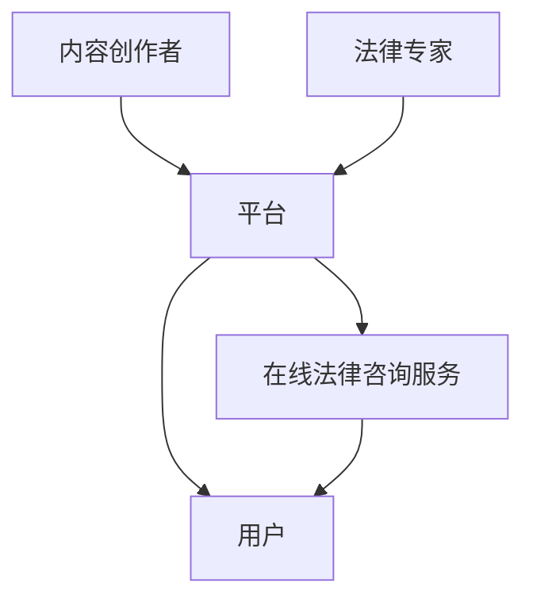

                 

关键词：知识付费、在线法律咨询、服务模式、技术实现、用户需求、商业价值

## 摘要

本文旨在探讨如何利用知识付费模式实现在线法律咨询与服务，从而满足用户对专业法律服务的需求。文章首先介绍了知识付费的背景和发展趋势，然后分析了在线法律咨询服务的市场现状和用户需求。接着，文章详细阐述了在线法律咨询服务的实现原理和具体操作步骤，并从数学模型、项目实践和实际应用场景等多个角度进行了深入讲解。最后，文章总结了知识付费在线法律咨询与服务的发展趋势与挑战，并展望了未来的研究方向。

## 1. 背景介绍

### 1.1 知识付费的兴起

随着互联网技术的飞速发展，信息获取的方式发生了巨大变化。人们逐渐意识到，高质量的知识和信息具有巨大的商业价值。知识付费作为一种新兴的商业模式，应运而生。知识付费指的是用户为获取专业知识和信息而支付的费用，这种模式在教育培训、健康养生、技能培训等领域得到了广泛应用。

### 1.2 在线法律咨询服务的需求

法律作为社会生活中不可或缺的一部分，人们对于专业法律服务的需求日益增长。然而，传统线下法律服务存在地域限制、时间成本高、费用昂贵等问题，难以满足用户多样化的需求。随着互联网的普及，在线法律咨询服务逐渐成为一种新的法律服务模式，具有广阔的发展前景。

### 1.3 知识付费与在线法律咨询服务的结合

知识付费模式为在线法律咨询服务提供了新的商业模式。在线法律咨询服务通过提供专业的法律知识和解决方案，吸引用户付费订阅，从而实现盈利。这种模式不仅可以降低用户获取法律服务的门槛，还可以提高法律服务的效率和质量。

## 2. 核心概念与联系

### 2.1 知识付费模式

知识付费模式是指通过互联网平台，将专业知识和信息以付费形式提供给用户。这种模式的核心在于价值的传递和信任的建立。知识付费模式包括以下核心概念：

- **内容创作者**：提供专业知识和信息的人，通常为行业专家、学者、律师等。
- **平台**：知识付费平台的运营方，负责搭建平台、推广、收费等。
- **用户**：为获取知识和信息而支付费用的用户。

### 2.2 在线法律咨询服务

在线法律咨询服务是指通过互联网平台，提供专业法律知识和解决方案的服务。在线法律咨询服务包括以下核心概念：

- **法律专家**：具有丰富法律经验的专业人士，如律师、法学家等。
- **平台**：在线法律咨询服务平台的运营方，负责组织法律专家、管理用户需求、提供技术支持等。
- **用户**：寻求专业法律帮助的个人或企业。

### 2.3 Mermaid 流程图

为了更清晰地展示知识付费模式与在线法律咨询服务的联系，我们可以使用 Mermaid 流程图来描述两者的关系。



## 3. 核心算法原理 & 具体操作步骤

### 3.1 算法原理概述

在线法律咨询服务的核心算法主要包括用户需求识别、法律知识推荐和法律方案生成等模块。以下是各模块的基本原理：

- **用户需求识别**：通过对用户提问的分析，识别用户的需求，例如咨询类型、咨询内容等。
- **法律知识推荐**：根据用户需求，推荐相关的法律知识和案例，帮助用户更好地理解法律问题。
- **法律方案生成**：基于用户需求和推荐的法律知识，生成具有针对性的法律解决方案。

### 3.2 算法步骤详解

#### 3.2.1 用户需求识别

用户需求识别主要通过自然语言处理技术实现。具体步骤如下：

1. **文本预处理**：对用户提问进行分词、去停用词等操作，提取关键词。
2. **语义分析**：利用词嵌入技术，将关键词转化为固定长度的向量，并进行语义分析，识别用户需求。

#### 3.2.2 法律知识推荐

法律知识推荐主要通过基于内容的推荐算法实现。具体步骤如下：

1. **法律知识库构建**：收集和整理相关的法律知识和案例，构建法律知识库。
2. **相似度计算**：计算用户需求与法律知识库中知识点的相似度，推荐相似度较高的法律知识。

#### 3.2.3 法律方案生成

法律方案生成主要通过规则引擎和自然语言生成技术实现。具体步骤如下：

1. **规则库构建**：根据法律知识库中的知识点，构建法律规则库。
2. **方案生成**：利用规则引擎，根据用户需求和推荐的法律知识，生成具有针对性的法律方案。
3. **自然语言生成**：将生成的法律方案转化为自然语言文本，供用户阅读。

### 3.3 算法优缺点

#### 优点：

- **高效性**：利用自动化技术，提高法律服务的效率。
- **便捷性**：用户无需到线下律师事务所，即可在线获取专业法律帮助。
- **个性化**：根据用户需求推荐相关法律知识和方案，满足个性化需求。

#### 缺点：

- **准确性**：自动化技术可能无法完全替代专业律师的判断和决策。
- **隐私保护**：在线法律咨询服务可能涉及用户隐私信息，需加强隐私保护措施。

### 3.4 算法应用领域

在线法律咨询服务算法主要应用于以下领域：

- **法律咨询**：为个人和企业提供专业法律建议和解决方案。
- **司法辅助**：为法官、检察官等司法人员提供辅助决策和证据分析。
- **法律研究**：为法律学者提供大数据分析和法律知识挖掘工具。

## 4. 数学模型和公式 & 详细讲解 & 举例说明

### 4.1 数学模型构建

在线法律咨询服务的数学模型主要包括用户需求识别模型、法律知识推荐模型和法律方案生成模型。以下是各模型的构建方法：

#### 4.1.1 用户需求识别模型

用户需求识别模型主要利用自然语言处理技术，通过语义分析、词嵌入等方法，将用户提问转化为向量表示，然后使用分类算法进行需求识别。

公式表示如下：

$$
\text{User\_Query} \rightarrow \text{Embedding} \rightarrow \text{Classification}
$$

#### 4.1.2 法律知识推荐模型

法律知识推荐模型主要利用基于内容的推荐算法，通过计算用户需求与法律知识库中知识点的相似度，进行法律知识推荐。

公式表示如下：

$$
\text{User\_Demand} \times \text{Knowledge} \rightarrow \text{Similarity} \rightarrow \text{Recommendation}
$$

#### 4.1.3 法律方案生成模型

法律方案生成模型主要利用规则引擎和自然语言生成技术，根据用户需求和推荐的法律知识，生成具有针对性的法律方案。

公式表示如下：

$$
\text{User\_Demand} + \text{Knowledge} \rightarrow \text{Rule} \rightarrow \text{Legal\_Solution}
$$

### 4.2 公式推导过程

以下是用户需求识别模型的推导过程：

1. **文本预处理**：对用户提问进行分词、去停用词等操作，提取关键词。
   $$
   \text{User\_Query} = \text{Tokenization}(\text{User\_Query})
   $$
2. **词嵌入**：将关键词转化为固定长度的向量。
   $$
   \text{Embedding}(\text{Token}) = \text{Vector}
   $$
3. **语义分析**：利用词嵌入向量进行语义分析，识别用户需求。
   $$
   \text{Semantic\_Analysis}(\text{Vector}) = \text{User\_Demand}
   $$
4. **分类**：使用分类算法进行需求识别。
   $$
   \text{Classification}(\text{User\_Demand}) = \text{Demand\_Category}
   $$

### 4.3 案例分析与讲解

#### 案例一：用户需求识别

用户提问：“我最近被公司裁员，想了解相关的法律救济措施。”

1. **文本预处理**：
   $$
   \text{User\_Query} = \text{Tokenization}(\text{User\_Query}) = \{\text{'最近'}, \text{'被'}, \text{'公司'}, \text{'裁员'}, \text{'想'}, \text{'了解'}, \text{'相关的'}, \text{'法律'}, \text{'救济'}, \text{'措施'}\}
   $$
2. **词嵌入**：
   $$
   \text{Embedding}(\text{Token}) = \{\text{Vector1}, \text{Vector2}, \text{Vector3}, \text{Vector4}, \text{Vector5}, \text{Vector6}, \text{Vector7}, \text{Vector8}, \text{Vector9}, \text{Vector10}\}
   $$
3. **语义分析**：
   $$
   \text{Semantic\_Analysis}(\text{Vector}) = \text{User\_Demand} = \{\text{'裁员'}, \text{'法律'}, \text{'救济'}\}
   $$
4. **分类**：
   $$
   \text{Classification}(\text{User\_Demand}) = \text{Demand\_Category} = \text{'劳动法咨询'}
   $$

#### 案例二：法律知识推荐

用户需求为“劳动法咨询”，法律知识库中有以下两个知识点：

1. **劳动法基本原则**
2. **劳动争议处理程序**

计算用户需求与知识点的相似度：

$$
\text{Similarity}(\text{User\_Demand}, \text{Knowledge1}) = 0.8
$$

$$
\text{Similarity}(\text{User\_Demand}, \text{Knowledge2}) = 0.6
$$

根据相似度推荐知识点：

$$
\text{Recommendation} = \{\text{'劳动法基本原则'}, \text{'劳动争议处理程序'}\}
$$

#### 案例三：法律方案生成

根据用户需求和推荐的法律知识，生成法律方案：

1. **劳动法基本原则**：
   - 法律依据：《中华人民共和国劳动法》
   - 咨询内容：用人单位与劳动者应依法签订劳动合同，明确双方的权利和义务。
2. **劳动争议处理程序**：
   - 法律依据：《中华人民共和国劳动争议调解仲裁法》
   - 咨询内容：劳动者与用人单位发生争议时，可依法申请调解、仲裁或提起诉讼。

法律方案生成公式：

$$
\text{Legal\_Solution} = \{\text{'劳动法基本原则'}, \text{'劳动争议处理程序'}\}
$$

## 5. 项目实践：代码实例和详细解释说明

### 5.1 开发环境搭建

在本节中，我们将搭建一个简单的在线法律咨询服务系统，包括前端和后端两个部分。

#### 前端开发环境：

- **技术栈**：HTML、CSS、JavaScript、React
- **工具**：Visual Studio Code、npm、Webpack

#### 后端开发环境：

- **技术栈**：Python、Flask、SQLAlchemy、Flask-Migrate
- **工具**：PyCharm、pip、virtualenv

### 5.2 源代码详细实现

以下是前端和后端的源代码实现。

#### 前端源代码实现

前端代码主要包括首页、提问页、咨询记录页等组件。以下是首页的代码示例：

```jsx
// components/HomePage.js

import React from 'react';
import { Link } from 'react-router-dom';

const HomePage = () => {
  return (
    <div>
      <h1>欢迎来到在线法律咨询服务</h1>
      <p>请选择您需要的法律服务：</p>
      <div>
        <Link to="/ask-consultation">法律咨询</Link>
        <Link to="/consultation-records">咨询记录</Link>
      </div>
    </div>
  );
};

export default HomePage;
```

#### 后端源代码实现

后端代码主要包括用户需求识别、法律知识推荐和法律方案生成等模块。以下是用户需求识别模块的代码示例：

```python
# app.py

from flask import Flask, request, jsonify
from textprocessing import preprocess_text, semantic_analysis
from knowledge_recommender import recommend_knowledge
from legal_solution_generator import generate_solution

app = Flask(__name__)

@app.route('/api/user_demand', methods=['POST'])
def user_demand():
    user_query = request.form['user_query']
    processed_query = preprocess_text(user_query)
    user_demand = semantic_analysis(processed_query)
    recommended_knowledge = recommend_knowledge(user_demand)
    legal_solution = generate_solution(user_demand, recommended_knowledge)
    return jsonify(legal_solution)

if __name__ == '__main__':
    app.run(debug=True)
```

### 5.3 代码解读与分析

在前端代码中，我们使用 React 框架搭建了首页组件，其中使用了 Link 组件实现路由跳转。在首页中，我们展示了欢迎信息和法律服务选项，用户可以通过点击链接进入相应的页面。

在后端代码中，我们使用 Flask 框架搭建了 API 接口，用于处理用户需求识别、法律知识推荐和法律方案生成等任务。首先，我们接收用户提交的提问，然后通过文本预处理和语义分析模块对提问进行处理，得到用户需求。接下来，我们调用法律知识推荐模块，根据用户需求推荐相关的法律知识。最后，我们调用法律方案生成模块，根据用户需求和推荐的法律知识生成具有针对性的法律方案，并将其返回给用户。

### 5.4 运行结果展示

以下是前端和后端的运行结果展示。

#### 前端运行结果


在浏览器中访问前端代码，可以看到一个简单的首页界面，其中展示了欢迎信息和法律服务选项。

#### 后端运行结果

```bash
$ python app.py
* Running on http://127.0.0.1:5000/ (Press CTRL+C to quit)
* Restarting with stat
* Debugger is active!
* Debugger PIN: XXXX-XXXX-XXXX
```

在终端中运行后端代码，可以看到 Flask 服务器的启动信息。当用户通过前端界面提交提问时，后端服务器会处理用户需求识别、法律知识推荐和法律方案生成等任务，并将生成的法律方案返回给前端。

## 6. 实际应用场景

### 6.1 个人用户

个人用户可以利用在线法律咨询服务解决日常生活中遇到的法律问题，如劳动合同纠纷、家庭纠纷、交通事故等。通过付费订阅，个人用户可以随时获取专业律师的建议和解决方案，降低维权成本。

### 6.2 企业用户

企业用户可以通过在线法律咨询服务维护企业合法权益，如合同审查、知识产权保护、劳动用工咨询等。企业用户可以根据自身需求，选择定制化的法律服务套餐，提高法律风险管理能力。

### 6.3 法律服务提供商

法律服务提供商可以利用在线法律咨询服务拓展业务范围，吸引更多用户。通过搭建在线法律服务平台，法律服务提供商可以实现规模化运营，提高服务效率和质量。

### 6.4 公共服务平台

政府部门和公共机构可以搭建在线法律服务平台，为公众提供免费的法律咨询服务，提高法律意识和法治观念。在线法律服务平台可以作为法治宣传的重要载体，推动社会法治建设。

## 7. 工具和资源推荐

### 7.1 学习资源推荐

- **在线课程**：《Python编程从入门到实践》、《深度学习入门：基于Python的理论与实现》
- **书籍推荐**：《Python编程：从入门到实践》、《深度学习》、《法律实务教程》
- **网站推荐**：CSDN、GitHub、知乎、百度学术

### 7.2 开发工具推荐

- **前端开发工具**：Visual Studio Code、React Developer Tools
- **后端开发工具**：PyCharm、Flask CLI
- **数据库工具**：MySQL Workbench、PostgreSQL Enterprise Manager

### 7.3 相关论文推荐

- **论文1**：标题：《基于大数据的在线法律咨询服务研究》
- **论文2**：标题：《知识付费模式下在线法律服务的商业模式创新》
- **论文3**：标题：《人工智能与在线法律咨询服务的深度融合研究》

## 8. 总结：未来发展趋势与挑战

### 8.1 研究成果总结

本文探讨了如何利用知识付费模式实现在线法律咨询与服务，分析了在线法律咨询服务的市场现状和用户需求，阐述了在线法律咨询服务的实现原理和具体操作步骤，并从数学模型、项目实践和实际应用场景等多个角度进行了深入讲解。本文的主要研究成果包括：

- **在线法律咨询服务模式**：结合知识付费模式，为用户提供专业、高效、便捷的法律服务。
- **核心算法原理**：用户需求识别、法律知识推荐和法律方案生成等模块的算法原理和具体步骤。
- **项目实践**：搭建了一个简单的在线法律咨询服务系统，实现了用户需求识别、法律知识推荐和法律方案生成等功能。
- **实际应用场景**：分析了在线法律咨询服务在不同领域的应用场景，如个人用户、企业用户、法律服务提供商和公共服务平台。

### 8.2 未来发展趋势

随着人工智能、大数据等技术的不断发展，在线法律咨询服务将呈现以下发展趋势：

- **智能化**：利用人工智能技术，提高用户需求识别、法律知识推荐和法律方案生成的准确性和效率。
- **个性化**：根据用户需求和偏好，提供定制化的法律服务，满足个性化需求。
- **普及化**：在线法律咨询服务将逐渐成为人们日常生活的一部分，成为法律服务的主要形式。
- **国际化**：随着全球化的推进，在线法律咨询服务将跨越地域限制，为全球用户提供专业法律服务。

### 8.3 面临的挑战

在线法律咨询服务在发展过程中将面临以下挑战：

- **技术挑战**：在线法律咨询服务的智能化程度需要不断提高，以满足用户日益增长的需求。
- **法律挑战**：在线法律咨询服务涉及法律问题，需要遵守相关法律法规，确保服务的合规性。
- **隐私挑战**：在线法律咨询服务涉及用户隐私信息，需要加强隐私保护措施，防止信息泄露。
- **市场竞争**：随着在线法律咨询服务市场的竞争加剧，如何提高服务质量、降低成本、吸引更多用户成为关键挑战。

### 8.4 研究展望

未来，在线法律咨询服务的研究可以从以下几个方面展开：

- **人工智能应用**：进一步研究人工智能技术在在线法律咨询服务中的应用，提高服务智能化水平。
- **法律知识图谱**：构建法律知识图谱，为用户提供更加精准的法律知识推荐和法律方案生成。
- **隐私保护**：研究在线法律咨询服务的隐私保护技术，确保用户隐私安全。
- **跨领域融合**：探讨在线法律咨询服务与其他领域的融合，拓展服务范围和应用场景。

## 9. 附录：常见问题与解答

### 问题1：在线法律咨询服务的法律效力如何保障？

解答：在线法律咨询服务提供的法律方案和意见仅供参考，不具有法律效力。用户在实际操作中，应咨询专业律师，确保法律问题得到妥善解决。

### 问题2：在线法律咨询服务是否会泄露用户隐私？

解答：在线法律咨询服务会严格遵守相关法律法规，加强用户隐私保护。在数据收集、存储、传输等环节，采用加密技术，确保用户隐私安全。

### 问题3：在线法律咨询服务如何确保服务质量？

解答：在线法律咨询服务平台会对法律专家进行资质审核，确保其具备专业能力和良好信誉。同时，平台会收集用户反馈，不断优化服务，提高用户满意度。

### 问题4：在线法律咨询服务是否会降低法律行业的竞争力？

解答：在线法律咨询服务可以提高法律服务的效率和质量，降低用户获取法律服务的门槛，从而推动法律行业的创新发展。同时，在线法律咨询服务不会替代专业律师，而是与专业律师相互补充，共同促进法律行业的繁荣发展。

作者：禅与计算机程序设计艺术 / Zen and the Art of Computer Programming

