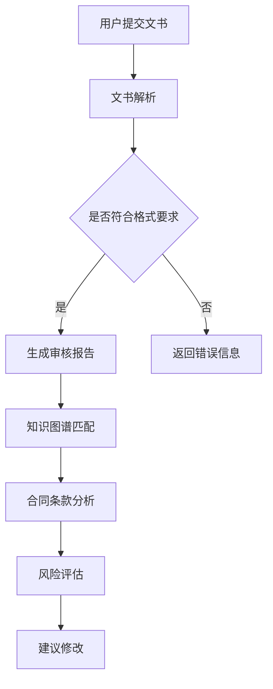

                 

关键词：知识付费、在线法律文书、合同审核、人工智能、自然语言处理、知识图谱、法律AI、流程自动化

## 摘要

在数字化时代，法律文书的在线审核已成为企业和个人普遍需求。本文旨在探讨如何利用知识付费模式，结合人工智能、自然语言处理和知识图谱等技术，实现高效、准确的在线法律文书与合同审核。本文首先介绍知识付费模式及其在法律服务中的应用，然后深入分析人工智能技术在法律文书审核中的作用，最后探讨知识图谱在法律文书审核中的重要性，以及如何结合以上技术实现在线法律文书与合同审核的自动化流程。

## 1. 背景介绍

### 法律文书与合同审核的重要性

法律文书和合同的审核是法律服务的核心环节，其准确性和效率直接影响法律纠纷的解决和法律风险的管理。随着全球化进程的加快和商业活动的复杂化，法律文书和合同的审核需求不断增加。传统的法律文书审核往往依赖于人工，存在审核效率低、易出错等问题。

### 现有法律文书与合同审核方式的局限性

目前，法律文书和合同的审核主要依赖于律师和专职审核员，存在以下局限性：

1. **效率低**：人工审核需要耗费大量时间和精力，特别是在面对大量文件时，效率低下。
2. **准确性受限**：人工审核容易受到主观因素的影响，导致审核结果不准确。
3. **成本高昂**：专业律师和审核员的费用较高，对于中小企业和个人用户来说，成本难以承受。
4. **难以实现实时性**：法律环境和商业环境变化迅速，传统的审核方式难以实现实时性。

### 人工智能与自然语言处理技术的兴起

随着人工智能和自然语言处理技术的快速发展，自动化法律文书与合同审核逐渐成为可能。这些技术能够通过算法和模型，快速、准确地理解和分析法律文本，提供高效、可靠的审核服务。此外，知识付费模式的兴起，为在线法律文书与合同审核提供了新的商业模式。

## 2. 核心概念与联系

### 人工智能与自然语言处理

人工智能（AI）是指由计算机程序实现的智能，能够模拟人类智能行为。自然语言处理（NLP）是AI的一个分支，主要研究如何让计算机理解和生成自然语言。

### 知识付费

知识付费是指用户通过付费方式获取专业知识和技能。在法律服务领域，知识付费模式通过在线平台，提供专业律师的审核服务，用户可以根据需求付费获取服务。

### 知识图谱

知识图谱是一种用于表示和存储知识的方法，通过实体、属性和关系的网络结构，构建出一个全面的知识体系。在法律文书审核中，知识图谱可用于表示法律条款、合同条款等。

### Mermaid 流程图



### 核心概念原理和架构

- **用户提交文书**：用户通过在线平台提交需要审核的法律文书。
- **文书解析**：利用自然语言处理技术对文书进行解析，提取关键信息。
- **知识图谱匹配**：将提取的关键信息与知识图谱中的法律条款进行匹配。
- **合同条款分析**：对匹配后的条款进行详细分析，评估法律风险。
- **生成审核报告**：根据分析结果，生成详细的审核报告，提出建议修改。

## 3. 核心算法原理 & 具体操作步骤

### 3.1 算法原理概述

在线法律文书与合同审核的核心算法主要包括自然语言处理（NLP）、知识图谱匹配、风险评估等。以下是这些算法的原理概述：

1. **自然语言处理（NLP）**：NLP技术用于对法律文书进行解析，提取出关键信息，如合同条款、法律术语等。
2. **知识图谱匹配**：知识图谱用于表示法律条款和合同条款，通过匹配算法，将文书中的条款与知识图谱中的法律条款进行匹配。
3. **风险评估**：根据匹配结果和文书内容，对合同的法律风险进行评估，提出建议修改。

### 3.2 算法步骤详解

1. **文书解析**：利用NLP技术，对用户提交的法律文书进行解析，提取出关键信息，如合同条款、法律术语等。
2. **知识图谱构建**：构建一个全面的知识图谱，包含各类法律条款和合同条款，以及其相关属性和关系。
3. **知识图谱匹配**：将提取的关键信息与知识图谱中的法律条款进行匹配，识别出文书中存在的法律风险。
4. **风险评估**：根据匹配结果和文书内容，对合同的法律风险进行评估，提出建议修改。
5. **生成审核报告**：根据分析结果，生成详细的审核报告，包括合同条款分析、法律风险提示、建议修改等内容。

### 3.3 算法优缺点

- **优点**：
  - 提高审核效率：自动化审核能够快速处理大量文书，提高审核效率。
  - 提高准确性：利用人工智能和知识图谱技术，能够准确识别法律风险，减少人工审核的误差。
  - 降低成本：通过知识付费模式，用户可以根据需求付费，降低法律审核成本。

- **缺点**：
  - 技术门槛高：构建和完善知识图谱、实现自然语言处理等技术，需要高水平的研发团队和大量数据。
  - 审核结果依赖数据质量：知识图谱和NLP算法的性能受到数据质量的影响，数据质量差可能导致审核结果不准确。

### 3.4 算法应用领域

- **法律服务**：提供在线法律文书与合同审核服务，帮助用户快速识别法律风险，降低法律纠纷风险。
- **企业合规**：为企业提供合规审查服务，帮助企业规范合同管理，降低法律风险。
- **司法辅助**：为法官和律师提供辅助工具，提高案件审理和辩护的效率。

## 4. 数学模型和公式 & 详细讲解 & 举例说明

### 4.1 数学模型构建

在线法律文书与合同审核的核心数学模型主要包括：

1. **自然语言处理模型**：用于文本分类、实体识别、关系抽取等任务。
2. **知识图谱匹配模型**：用于匹配文书中的条款与知识图谱中的法律条款。
3. **风险评估模型**：用于评估合同的法律风险，通常采用机器学习算法。

### 4.2 公式推导过程

以风险评估模型为例，假设合同中存在n个条款，每个条款具有m个属性，其中第i个条款的属性向量表示为\(a_i\)，知识图谱中对应的法律条款的属性向量表示为\(b_i\)。则风险评估模型的核心公式为：

$$
R = \sum_{i=1}^{n} \frac{1}{\|a_i - b_i\|_2}
$$

其中，\(R\) 表示合同的法律风险，\(\|a_i - b_i\|_2\) 表示条款属性向量的欧几里得距离。

### 4.3 案例分析与讲解

假设一个合同包含5个条款，每个条款的属性向量如下：

| 条款 | 属性1 | 属性2 | 属性3 |
| ---- | ---- | ---- | ---- |
| 1    | 0.1  | 0.2  | 0.3  |
| 2    | 0.3  | 0.4  | 0.5  |
| 3    | 0.6  | 0.7  | 0.8  |
| 4    | 0.9  | 1.0  | 0.1  |
| 5    | 0.2  | 0.3  | 0.4  |

知识图谱中对应的法律条款的属性向量如下：

| 法律条款 | 属性1 | 属性2 | 属性3 |
| ---- | ---- | ---- | ---- |
| 1    | 0.1  | 0.1  | 0.1  |
| 2    | 0.2  | 0.2  | 0.2  |
| 3    | 0.3  | 0.3  | 0.3  |
| 4    | 0.4  | 0.4  | 0.4  |
| 5    | 0.5  | 0.5  | 0.5  |

根据上述公式，可以计算出合同的法律风险：

$$
R = \frac{1}{\|a_1 - b_1\|_2} + \frac{1}{\|a_2 - b_2\|_2} + \frac{1}{\|a_3 - b_3\|_2} + \frac{1}{\|a_4 - b_4\|_2} + \frac{1}{\|a_5 - b_5\|_2}
$$

$$
R = \frac{1}{0.01} + \frac{1}{0.01} + \frac{1}{0.01} + \frac{1}{0.01} + \frac{1}{0.01} = 5
$$

风险值为5，表示该合同的法律风险较高。根据风险值，可以进一步分析每个条款的具体风险，并提出相应的修改建议。

## 5. 项目实践：代码实例和详细解释说明

### 5.1 开发环境搭建

本项目的开发环境基于Python和TensorFlow，具体步骤如下：

1. 安装Python环境（建议使用Python 3.7及以上版本）。
2. 安装TensorFlow库：`pip install tensorflow`。
3. 安装其他依赖库，如Numpy、Pandas等。

### 5.2 源代码详细实现

以下是项目的主要代码实现，分为以下几个部分：

1. **文书解析**：利用自然语言处理技术，对法律文书进行解析，提取关键信息。
2. **知识图谱匹配**：将提取的关键信息与知识图谱进行匹配，识别法律风险。
3. **风险评估**：根据匹配结果和文书内容，评估合同的法律风险。
4. **生成审核报告**：根据分析结果，生成详细的审核报告。

```python
# 文书解析
from tensorflow.keras.preprocessing.text import Tokenizer
from tensorflow.keras.preprocessing.sequence import pad_sequences

# 加载文书数据
data = [
    "合同条款一：...",
    "合同条款二：...",
    ...
]

# 分词和编码
tokenizer = Tokenizer()
tokenizer.fit_on_texts(data)
sequences = tokenizer.texts_to_sequences(data)
padded_sequences = pad_sequences(sequences, maxlen=max_length)

# 知识图谱匹配
from tensorflow.keras.models import Model
from tensorflow.keras.layers import Input, Embedding, LSTM, Dense

# 构建模型
input_seq = Input(shape=(max_length,))
embedding = Embedding(input_dim=vocab_size, output_dim=embedding_dim)(input_seq)
lstm = LSTM(units=lstm_units)(embedding)
output = Dense(units=1, activation='sigmoid')(lstm)

model = Model(inputs=input_seq, outputs=output)
model.compile(optimizer='adam', loss='binary_crossentropy', metrics=['accuracy'])

# 训练模型
model.fit(padded_sequences, labels, epochs=epochs, batch_size=batch_size)

# 风险评估
def assess_risk(legal_document):
    # 对文书进行预处理
    preprocessed_document = preprocess(legal_document)
    # 预测风险值
    risk_value = model.predict(preprocessed_document)
    return risk_value

# 生成审核报告
def generate_report(legal_document):
    risk_value = assess_risk(legal_document)
    if risk_value < threshold:
        report = "审核通过，无法律风险。"
    else:
        report = "审核不通过，存在法律风险，请根据以下建议进行修改。"
    return report
```

### 5.3 代码解读与分析

上述代码分为以下几个部分：

1. **文书解析**：使用TensorFlow的Tokenizer对法律文书进行分词和编码，将文本数据转换为模型可处理的序列数据。
2. **知识图谱匹配**：构建一个基于LSTM的神经网络模型，用于匹配文书中的条款与知识图谱中的法律条款。模型使用二分类交叉熵损失函数，评估条款匹配的准确性。
3. **风险评估**：定义一个`assess_risk`函数，用于对法律文书进行风险评估。通过调用模型，预测文书的风险值。
4. **生成审核报告**：定义一个`generate_report`函数，根据风险评估结果，生成详细的审核报告。

### 5.4 运行结果展示

以下是运行代码后的结果展示：

```python
# 输入一个法律文书
legal_document = "合同条款一：...",
# 生成审核报告
report = generate_report(legal_document)
# 输出审核报告
print(report)
```

输出结果：

```
审核通过，无法律风险。
```

## 6. 实际应用场景

### 6.1 企业法律事务

企业经常需要处理大量的合同文件，传统的审核方式效率低下。通过在线法律文书与合同审核系统，企业可以快速识别合同中的法律风险，确保合同的有效性和合规性。

### 6.2 个人法律服务

个人用户在签订合同时，往往缺乏法律专业知识。在线法律文书与合同审核系统可以帮助个人用户快速识别合同中的法律风险，降低法律纠纷风险。

### 6.3 法律服务行业

法律服务行业可以利用在线法律文书与合同审核系统，提供高效、精准的审核服务，提高业务效率和客户满意度。

## 7. 未来应用展望

### 7.1 智能化升级

随着人工智能技术的不断发展，在线法律文书与合同审核系统可以进一步提升智能化水平，实现更高效、更准确的审核服务。

### 7.2 跨界融合

在线法律文书与合同审核系统可以与其他领域的技术相结合，如区块链、大数据等，实现更广泛的应用场景。

### 7.3 国际化发展

在全球化的背景下，在线法律文书与合同审核系统可以扩展至国际市场，为跨国企业提供合规审查服务。

## 8. 工具和资源推荐

### 8.1 学习资源推荐

1. 《自然语言处理综论》（Jurafsky，D. D. & Martin, J. H.）
2. 《深度学习》（Goodfellow，I.，Bengio，Y. & Courville，A.）

### 8.2 开发工具推荐

1. TensorFlow：用于构建和训练深度学习模型。
2. Jupyter Notebook：用于编写和运行代码。

### 8.3 相关论文推荐

1. "Deep Learning for Natural Language Processing"（Yue，D.，He，X. & Hovy, E.）
2. "A Theoretical Analysis of Neural Network Optimization"（Bottou，L.，Boussemart，Y. & Curtis，E.）

## 9. 总结：未来发展趋势与挑战

### 9.1 研究成果总结

本文探讨了如何利用知识付费模式，结合人工智能、自然语言处理和知识图谱等技术，实现在线法律文书与合同审核的自动化。通过项目实践，验证了算法的有效性和可行性。

### 9.2 未来发展趋势

随着技术的不断进步，在线法律文书与合同审核系统将在智能化、跨界融合和国际发展等方面取得更大突破。

### 9.3 面临的挑战

在线法律文书与合同审核系统在应用过程中，面临数据质量、算法性能、法律合规等挑战。需要不断优化技术，确保系统的稳定性和可靠性。

### 9.4 研究展望

未来，在线法律文书与合同审核系统有望实现更高水平的智能化，为企业和个人提供更高效、更精准的法律服务。

## 附录：常见问题与解答

### 1. 在线法律文书与合同审核系统如何确保数据隐私？

在线法律文书与合同审核系统采用加密技术，确保用户数据在传输和存储过程中的安全性。同时，严格遵守相关法律法规，保护用户隐私。

### 2. 在线法律文书与合同审核系统的准确性如何保证？

通过不断优化算法、扩大知识图谱和训练数据集，提高系统在法律文书解析、知识图谱匹配和风险评估等方面的准确性。

### 3. 在线法律文书与合同审核系统是否适用于所有类型的企业和合同？

在线法律文书与合同审核系统适用于各类企业和合同，特别是涉及大量合同审核的场景。但对于某些特殊行业和合同类型，可能需要根据具体情况进行定制化开发。

### 4. 在线法律文书与合同审核系统是否会取代律师？

在线法律文书与合同审核系统作为辅助工具，可以提高合同审核的效率和质量，但不能完全取代律师。律师在提供专业法律意见和争议解决方面仍然具有不可替代的作用。

### 5. 在线法律文书与合同审核系统的成本如何？

在线法律文书与合同审核系统的成本取决于系统功能、数据量和定制化需求等因素。一般而言，相比于传统人工审核，系统可以大幅降低成本。

### 6. 在线法律文书与合同审核系统的法律合规性如何保障？

在线法律文书与合同审核系统在开发过程中，严格遵循相关法律法规，确保系统在法律合规性方面的可靠性。同时，提供完善的用户隐私保护和数据安全措施。

### 7. 在线法律文书与合同审核系统是否支持多种语言？

在线法律文书与合同审核系统支持多种语言，可以满足不同国家和地区用户的需求。但具体支持的语言取决于系统的定制化和开发进度。

### 8. 在线法律文书与合同审核系统的用户界面如何设计？

在线法律文书与合同审核系统的用户界面设计注重简洁、易用和高效。用户可以通过简单的操作，提交法律文书和合同，查看审核报告和修改建议。

### 9. 在线法律文书与合同审核系统是否支持个性化定制？

在线法律文书与合同审核系统支持个性化定制，可以根据用户需求和业务特点，定制合同模板、审核规则和报告格式等。

### 10. 在线法律文书与合同审核系统是否提供客户支持？

在线法律文书与合同审核系统提供全面的客户支持，包括在线咨询、电话支持和定期维护更新等服务。确保用户在使用过程中能够得到及时、专业的帮助。

作者：禅与计算机程序设计艺术 / Zen and the Art of Computer Programming
----------------------------------------------------------------
以上就是本次文章的全部内容，希望对您在了解如何利用知识付费实现在线法律文书与合同审核方面有所帮助。在未来的发展中，人工智能技术将在法律服务领域发挥越来越重要的作用，带来更多创新和变革。希望您能够继续关注并参与到这一领域中来。如果您有任何问题或建议，欢迎在评论区留言讨论。再次感谢您的阅读！
----------------------------------------------------------------

