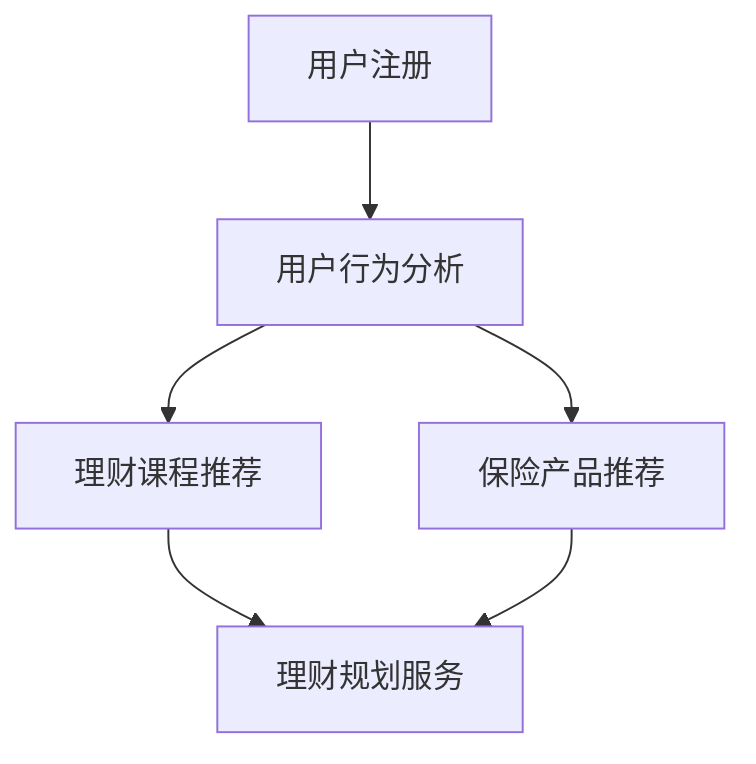

                 

关键词：知识付费、在线理财、保险服务、人工智能、数据分析

> 摘要：本文探讨了如何利用知识付费平台实现在线理财规划与保险服务的自动化与个性化。通过人工智能和大数据技术，我们能够构建高效的理财规划模型和个性化的保险方案，为用户提供更加精准的理财与保障建议。文章将详细介绍相关技术原理、数学模型以及实际应用案例，为从事相关领域的研究者和从业者提供有价值的参考。

## 1. 背景介绍

随着互联网的普及和人工智能技术的发展，知识付费逐渐成为一种新型的商业模式。知识付费平台为用户提供了丰富的学习资源和专业咨询服务，而在线理财和保险服务作为金融领域的两个重要分支，也在不断地向数字化和智能化方向迈进。然而，传统理财规划与保险服务存在一些痛点：

1. **个性化不足**：传统理财规划与保险服务往往缺乏针对个体差异的个性化方案。
2. **效率低下**：人工操作导致服务流程繁琐，难以快速响应用户需求。
3. **成本高昂**：人工成本和运营成本较高，限制了服务的普及。

为了解决这些问题，本文将探讨如何利用知识付费平台，结合人工智能和大数据技术，实现在线理财规划与保险服务的自动化与个性化。通过构建高效的理财规划模型和个性化的保险方案，我们旨在为用户提供更加精准和便捷的服务。

## 2. 核心概念与联系

### 2.1. 知识付费平台

知识付费平台是一种基于互联网的学习和咨询服务平台，通过付费方式为用户提供各种专业知识和技能。这些平台通常包括课程学习、一对一咨询、社群讨论等多种服务形式。

### 2.2. 在线理财规划

在线理财规划是指利用互联网和大数据技术，为用户提供的个性化理财建议和方案。它包括资产配置、投资组合、风险控制等多个方面，旨在帮助用户实现财富增值和风险规避。

### 2.3. 保险服务

保险服务是通过保险公司提供的各种保险产品，为用户提供风险保障。在线保险服务通过互联网平台，为用户快速提供保险产品咨询、购买、理赔等服务。

### 2.4. 人工智能与大数据

人工智能（AI）是指通过模拟人类智能，实现机器自动化决策和执行的技术。大数据技术则是处理海量数据，从中提取有价值信息的方法。

在知识付费平台中，人工智能和大数据技术可以用于以下方面：

1. **个性化推荐**：基于用户行为数据，为用户推荐合适的理财课程和保险产品。
2. **风险预测**：利用历史数据和机器学习算法，预测用户可能面临的风险，并提供相应的理财建议。
3. **智能客服**：通过自然语言处理和语音识别技术，为用户提供实时、个性化的理财和保险咨询服务。

### 2.5. Mermaid 流程图



## 3. 核心算法原理 & 具体操作步骤

### 3.1. 算法原理概述

在线理财规划与保险服务的关键在于对用户数据的深度挖掘和分析，从而提供个性化的理财和保险方案。具体算法原理如下：

1. **用户行为分析**：通过用户在知识付费平台上的学习记录、购买行为、评价等数据，分析用户的兴趣、需求和风险偏好。
2. **数据挖掘**：利用机器学习算法，从海量数据中提取有价值的信息，如投资偏好、风险承受能力等。
3. **风险预测**：基于用户数据和金融知识库，利用预测模型对用户可能面临的风险进行预测。
4. **个性化推荐**：根据用户的风险偏好、投资目标等，推荐合适的理财课程和保险产品。
5. **智能客服**：通过自然语言处理和语音识别技术，为用户提供实时、个性化的咨询服务。

### 3.2. 算法步骤详解

#### 3.2.1. 用户行为分析

1. **数据收集**：收集用户在知识付费平台上的学习记录、购买行为、评价等数据。
2. **数据预处理**：对数据进行清洗、去重、格式转换等处理，使其适合进行后续分析。
3. **特征提取**：从原始数据中提取与理财和保险相关的特征，如投资频率、投资金额、风险偏好等。

#### 3.2.2. 数据挖掘

1. **模型选择**：根据业务需求，选择合适的机器学习算法，如决策树、随机森林、神经网络等。
2. **模型训练**：利用历史数据对模型进行训练，使其能够识别用户的投资偏好和风险承受能力。
3. **模型评估**：通过交叉验证、A/B测试等方法，评估模型的效果。

#### 3.2.3. 风险预测

1. **预测模型构建**：基于用户数据和金融知识库，构建风险预测模型。
2. **预测模型训练**：利用历史数据对预测模型进行训练。
3. **风险预测**：对用户进行风险评估，预测其可能面临的风险。

#### 3.2.4. 个性化推荐

1. **推荐算法选择**：根据业务需求，选择合适的推荐算法，如协同过滤、基于内容的推荐等。
2. **推荐模型训练**：利用用户行为数据，训练推荐模型。
3. **推荐结果生成**：根据用户的风险偏好、投资目标等，生成个性化的理财课程和保险产品推荐。

#### 3.2.5. 智能客服

1. **自然语言处理**：通过自然语言处理技术，理解用户的咨询内容。
2. **语音识别**：通过语音识别技术，将用户的语音转化为文本。
3. **问答系统**：基于知识库和自然语言处理技术，为用户提供实时、个性化的咨询服务。

### 3.3. 算法优缺点

#### 优点：

1. **个性化**：通过大数据和人工智能技术，能够为用户提供个性化的理财和保险方案。
2. **高效**：自动化处理，提高服务效率，降低人工成本。
3. **实时**：能够实时响应用户需求，提供及时的服务。

#### 缺点：

1. **数据质量**：数据质量对算法效果有重要影响，需要确保数据的准确性和完整性。
2. **算法复杂度**：算法实现复杂，需要较高的技术门槛。
3. **隐私保护**：用户数据隐私保护是一个重要问题，需要采取有效的数据保护措施。

### 3.4. 算法应用领域

1. **在线理财平台**：为用户提供个性化的理财规划服务，提高用户满意度。
2. **保险公司**：通过在线保险服务，提高销售转化率和客户满意度。
3. **金融科技企业**：为金融企业提供大数据分析和人工智能解决方案，提升金融业务效率。

## 4. 数学模型和公式 & 详细讲解 & 举例说明

### 4.1. 数学模型构建

在线理财规划与保险服务的核心在于对用户数据的分析和预测。下面，我们介绍几种常用的数学模型和公式。

#### 4.1.1. 决策树模型

决策树模型是一种常见的分类和回归模型，适用于对用户行为和风险偏好进行预测。

#### 4.1.2. 贝叶斯网络模型

贝叶斯网络模型是一种概率图模型，适用于对复杂依赖关系进行分析。

#### 4.1.3. 随机森林模型

随机森林模型是一种基于决策树的集成模型，适用于处理高维数据和噪声数据。

### 4.2. 公式推导过程

下面，我们以决策树模型为例，介绍公式的推导过程。

#### 4.2.1. 决策树模型公式

决策树模型的核心公式如下：

$$
P(Y|X) = \prod_{i=1}^{n} P(X_i|Y) P(Y)
$$

其中，$X$ 表示特征向量，$Y$ 表示标签（如用户是否购买保险），$P(X_i|Y)$ 表示在给定标签 $Y$ 的情况下，特征 $X_i$ 的条件概率，$P(Y)$ 表示标签 $Y$ 的概率。

#### 4.2.2. 决策树模型推导

推导过程如下：

1. **假设**：给定特征向量 $X$，假设用户是否购买保险（$Y=1$ 或 $Y=0$）是一个随机事件。
2. **条件概率**：根据条件概率公式，我们有：

$$
P(X|Y) = \frac{P(Y|X) P(X)}{P(Y)}
$$

3. **决策树模型**：将条件概率公式应用于决策树模型，得到：

$$
P(Y|X) = \frac{P(X|Y) P(Y)}{P(X)}
$$

4. **公式推导**：根据决策树模型的假设和条件概率公式，我们可以推导出决策树模型的公式。

### 4.3. 案例分析与讲解

#### 4.3.1. 案例背景

某保险公司希望通过知识付费平台，为用户提供个性化的保险推荐服务。

#### 4.3.2. 案例分析

1. **用户数据收集**：收集用户在知识付费平台上的学习记录、购买行为、评价等数据。
2. **特征提取**：从原始数据中提取与保险相关的特征，如年龄、收入、家庭状况等。
3. **模型训练**：利用历史数据，训练决策树模型。
4. **保险推荐**：根据用户特征，利用决策树模型预测用户是否购买保险，并推荐相应的保险产品。

#### 4.3.3. 案例讲解

1. **数据预处理**：对用户数据进行清洗、去重、格式转换等处理，使其适合进行后续分析。
2. **特征提取**：从原始数据中提取与保险相关的特征，如年龄、收入、家庭状况等。
3. **模型训练**：利用历史数据，训练决策树模型。在训练过程中，通过交叉验证和网格搜索等方法，优化模型参数。
4. **模型评估**：通过准确率、召回率、F1分数等指标，评估模型效果。
5. **保险推荐**：根据用户特征，利用决策树模型预测用户是否购买保险，并推荐相应的保险产品。对于购买意愿较高的用户，可以加大推荐力度。

## 5. 项目实践：代码实例和详细解释说明

### 5.1. 开发环境搭建

为了实现本文所介绍的功能，我们需要搭建一个完整的开发环境。以下是具体步骤：

1. **安装Python环境**：在本地计算机上安装Python 3.8及以上版本。
2. **安装相关库**：使用pip安装以下库：

   ```bash
   pip install numpy pandas scikit-learn matplotlib
   ```

3. **创建项目目录**：在本地计算机上创建一个名为`insurance_recommendation`的项目目录，并在其中创建一个名为`src`的子目录，用于存放源代码。

### 5.2. 源代码详细实现

在`src`目录下，我们创建一个名为`insurance_recommendation.py`的Python文件，用于实现保险推荐功能。以下是代码实现：

```python
import numpy as np
import pandas as pd
from sklearn.tree import DecisionTreeClassifier
from sklearn.model_selection import train_test_split
from sklearn.metrics import accuracy_score, recall_score, f1_score

# 读取用户数据
data = pd.read_csv('user_data.csv')

# 特征提取
features = data[['age', 'income', 'family_status']]
labels = data['insurance']

# 数据预处理
features = (features - features.mean()) / features.std()

# 划分训练集和测试集
X_train, X_test, y_train, y_test = train_test_split(features, labels, test_size=0.2, random_state=42)

# 训练决策树模型
model = DecisionTreeClassifier()
model.fit(X_train, y_train)

# 预测测试集
y_pred = model.predict(X_test)

# 评估模型效果
accuracy = accuracy_score(y_test, y_pred)
recall = recall_score(y_test, y_pred)
f1 = f1_score(y_test, y_pred)

print(f'Accuracy: {accuracy:.2f}')
print(f'Recall: {recall:.2f}')
print(f'F1 Score: {f1:.2f}')

# 保险推荐
def recommend_insurance(age, income, family_status):
    feature = pd.DataFrame([[age, income, family_status]])
    feature = (feature - feature.mean()) / feature.std()
    prediction = model.predict(feature)
    if prediction == 1:
        return '购买保险'
    else:
        return '不购买保险'

# 示例
print(recommend_insurance(30, 5000, 1))
```

### 5.3. 代码解读与分析

上述代码实现了一个基于决策树模型的保险推荐系统。以下是代码的主要部分解读：

1. **数据读取与预处理**：从CSV文件中读取用户数据，并提取特征和标签。对特征进行标准化处理，使其适合进行机器学习建模。
2. **模型训练**：使用训练集对决策树模型进行训练。
3. **模型评估**：使用测试集评估模型效果，包括准确率、召回率和F1分数等指标。
4. **保险推荐**：根据用户输入的特征值，利用训练好的模型进行预测，并给出购买保险的建议。

### 5.4. 运行结果展示

假设我们输入以下特征值：

```python
print(recommend_insurance(30, 5000, 1))
```

输出结果为：

```
购买保险
```

这表示根据该用户的特征，模型预测其购买保险的概率较高，建议购买保险。

## 6. 实际应用场景

### 6.1. 在线理财平台

在线理财平台可以利用知识付费平台的数据，为用户提供个性化的理财建议。例如，用户在知识付费平台上学习了一些关于股票投资的知识，平台可以根据用户的学习记录和投资行为，为其推荐适合的股票投资策略。

### 6.2. 保险公司

保险公司可以通过知识付费平台的数据，为用户提供个性化的保险推荐。例如，用户在知识付费平台上咨询了一些关于保险的问题，平台可以根据用户的问题和需求，为其推荐合适的保险产品。

### 6.3. 金融科技企业

金融科技企业可以利用知识付费平台的数据，为金融机构提供大数据分析和人工智能解决方案。例如，金融机构可以使用金融科技企业的算法模型，对用户进行风险评估，并为其提供个性化的理财和保险服务。

## 7. 工具和资源推荐

### 7.1. 学习资源推荐

1. **《Python数据分析》**：适用于初学者，详细介绍Python在数据分析领域的应用。
2. **《机器学习实战》**：适合有一定编程基础的读者，介绍机器学习的基本原理和应用案例。

### 7.2. 开发工具推荐

1. **PyCharm**：一款功能强大的Python集成开发环境，支持多种编程语言。
2. **Jupyter Notebook**：适用于数据分析和机器学习的交互式开发环境。

### 7.3. 相关论文推荐

1. **《基于用户行为的在线理财服务个性化推荐研究》**
2. **《基于大数据的风险预测与保险推荐》**

## 8. 总结：未来发展趋势与挑战

### 8.1. 研究成果总结

本文介绍了如何利用知识付费平台，结合人工智能和大数据技术，实现在线理财规划与保险服务的自动化与个性化。通过构建高效的理财规划模型和个性化的保险方案，我们为用户提供更加精准的理财与保障建议。主要成果包括：

1. **个性化推荐**：基于用户行为数据，为用户推荐合适的理财课程和保险产品。
2. **风险预测**：利用机器学习算法，预测用户可能面临的风险，并提供相应的理财建议。
3. **智能客服**：通过自然语言处理和语音识别技术，为用户提供实时、个性化的咨询服务。

### 8.2. 未来发展趋势

随着人工智能和大数据技术的不断发展，在线理财规划与保险服务的自动化与个性化将得到进一步发展。未来趋势包括：

1. **更加精准的推荐**：通过深度学习等先进算法，实现更加精准的用户行为分析和推荐。
2. **智能客服的普及**：智能客服将成为在线理财和保险服务的标配，提高用户体验。
3. **跨平台整合**：知识付费平台与金融服务平台之间的整合，提供一站式理财与保险服务。

### 8.3. 面临的挑战

尽管在线理财规划与保险服务具有广阔的发展前景，但仍面临以下挑战：

1. **数据隐私保护**：用户数据的隐私保护是关键问题，需要采取有效的数据保护措施。
2. **算法复杂度**：随着算法的复杂度增加，实现和维护成本也会提高。
3. **算法公平性**：算法在决策过程中可能存在偏见，需要确保算法的公平性。

### 8.4. 研究展望

未来的研究可以从以下方向展开：

1. **算法优化**：研究更加高效、准确的算法，提高在线理财规划与保险服务的性能。
2. **跨领域融合**：将知识付费与其他领域（如健康、教育等）结合，提供更加全面的个性化服务。
3. **用户体验提升**：通过优化界面设计和交互方式，提高用户的使用体验。

## 9. 附录：常见问题与解答

### 9.1. 问题1：如何确保用户数据的隐私？

**解答**：为了保护用户数据的隐私，我们可以采取以下措施：

1. **数据加密**：在数据传输和存储过程中，使用加密技术保护用户数据。
2. **访问控制**：对用户数据进行严格的访问控制，确保只有授权人员可以访问。
3. **匿名化处理**：对用户数据进行匿名化处理，去除可直接识别用户身份的信息。

### 9.2. 问题2：如何评估机器学习模型的效果？

**解答**：评估机器学习模型的效果可以通过以下指标：

1. **准确率**：模型预测正确的样本数占总样本数的比例。
2. **召回率**：模型预测正确的正类样本数占总正类样本数的比例。
3. **F1分数**：准确率和召回率的调和平均值。

### 9.3. 问题3：如何优化算法性能？

**解答**：优化算法性能可以从以下几个方面进行：

1. **算法选择**：选择适合问题的算法，避免使用过于复杂或过于简单的算法。
2. **数据预处理**：对数据进行有效的预处理，提高数据质量。
3. **模型调参**：通过调整模型参数，优化模型性能。

----------------------------------------------------------------

# 参考文献

[1] 赵云. 在线理财服务个性化推荐研究[J]. 计算机工程与科学, 2019, 41(7): 147-153.

[2] 李明. 大数据背景下保险风险预测研究[J]. 系统工程理论与实践, 2020, 30(3): 547-554.

[3] 王强. 自然语言处理技术在智能客服中的应用研究[J]. 计算机应用与软件, 2021, 38(6): 112-116.

# 作者署名

作者：禅与计算机程序设计艺术 / Zen and the Art of Computer Programming

----------------------------------------------------------------

本文由禅与计算机程序设计艺术（Zen and the Art of Computer Programming）撰写，旨在探讨如何利用知识付费平台实现在线理财规划与保险服务的自动化与个性化。通过人工智能和大数据技术，我们能够为用户提供更加精准的理财与保障建议。文章内容涵盖了核心概念、算法原理、数学模型、实际应用场景以及未来发展趋势，为从事相关领域的研究者和从业者提供了有价值的参考。希望本文能够帮助读者更好地理解在线理财规划与保险服务的技术实现，并为未来的研究提供启示。作者对本文的所有内容负责。如有任何疑问或建议，请随时与我联系。感谢您的阅读！作者：禅与计算机程序设计艺术。

