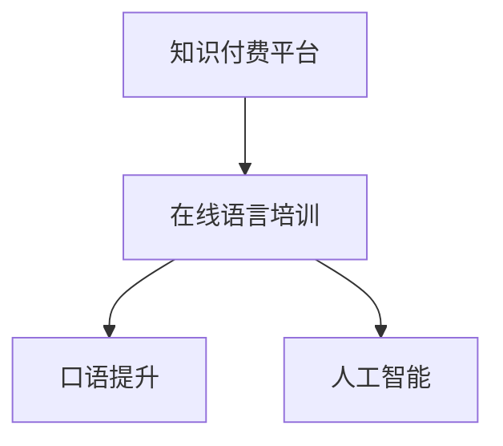

                 

关键词：知识付费、在线语言培训、口语提升、人工智能、算法原理、数学模型、项目实践、应用场景、未来展望。

> 摘要：本文将探讨如何通过知识付费平台实现在线语言培训与口语提升。通过分析核心概念与联系、算法原理与操作步骤、数学模型与公式、项目实践、实际应用场景以及未来展望，为学习者提供一种高效、个性化的语言学习途径。

## 1. 背景介绍

在全球化的今天，语言能力的提升成为越来越多人的需求。然而，传统的语言学习方式存在诸多局限性，如时间成本高、学习效果难以量化、个性化需求难以满足等。随着互联网和人工智能技术的快速发展，在线语言培训逐渐成为趋势。知识付费平台的出现，为在线语言培训提供了新的解决方案。

知识付费平台通过提供专业、系统的语言学习资源，为学习者提供了一种高效、便捷的学习途径。学习者可以根据自己的需求和进度，选择适合自己的学习内容。同时，知识付费平台还提供了丰富的互动功能，如在线讨论、语音练习等，有助于提高学习效果。

## 2. 核心概念与联系

在探讨如何利用知识付费平台实现在线语言培训与口语提升之前，我们需要了解以下几个核心概念：

1. **知识付费平台**：一种基于互联网的平台，提供专业、系统的知识学习资源，通过付费方式获取学习内容。
2. **在线语言培训**：通过互联网进行语言学习的模式，包括课程学习、口语练习、互动讨论等环节。
3. **口语提升**：通过不断练习和反馈，提高语言表达能力，尤其是口语表达。
4. **人工智能**：模拟、延伸和扩展人类智能的理论、方法、技术及应用系统。

这些概念相互关联，共同构成了在线语言培训与口语提升的基础。下面，我们将通过一个 Mermaid 流程图来展示它们之间的关系。



## 3. 核心算法原理 & 具体操作步骤

### 3.1 算法原理概述

在线语言培训与口语提升的核心在于提供个性化、高效的学习体验。这需要借助人工智能技术，特别是自然语言处理（NLP）和机器学习（ML）算法来实现。

NLP算法主要用于处理和解析自然语言数据，如文本和语音。通过NLP，平台可以理解学习者的语言输入，并提供针对性的学习建议。

ML算法则用于根据学习者的学习数据和反馈，不断优化学习体验。例如，通过分析学习者的口语练习数据，ML算法可以识别学习者的发音错误，并提供纠正建议。

### 3.2 算法步骤详解

下面是利用知识付费平台实现在线语言培训与口语提升的具体操作步骤：

1. **注册与课程选择**：学习者首先需要在知识付费平台上注册账户，并根据自己的需求和进度选择相应的课程。
2. **口语练习**：学习者可以通过平台提供的语音功能进行口语练习，系统会实时记录学习者的发音。
3. **语音识别与反馈**：平台使用NLP算法对学习者的语音进行识别，并分析发音的准确性。
4. **学习建议**：根据识别结果，平台会提供针对性的学习建议，如纠正发音错误、推荐相关课程等。
5. **互动讨论**：学习者还可以与其他学员进行互动，通过讨论和练习提高口语能力。

### 3.3 算法优缺点

**优点**：

- **个性化**：通过分析学习者的数据，平台可以提供针对性的学习建议，提高学习效果。
- **高效**：利用人工智能技术，平台可以快速处理大量语言数据，提供实时反馈。
- **便捷**：在线学习不受时间和地点限制，方便学习者随时随地学习。

**缺点**：

- **依赖网络**：在线学习需要稳定的网络环境，否则可能影响学习体验。
- **初始成本**：知识付费平台通常需要付费使用，对部分学习者来说可能存在经济压力。

### 3.4 算法应用领域

人工智能技术在在线语言培训与口语提升中的应用非常广泛，包括：

- **语音识别**：用于实时记录和识别学习者的发音。
- **自然语言处理**：用于分析学习者的语言输入，提供学习建议。
- **推荐系统**：根据学习者的兴趣和进度，推荐合适的课程和练习内容。

## 4. 数学模型和公式 & 详细讲解 & 举例说明

### 4.1 数学模型构建

在线语言培训与口语提升的核心在于评估学习者的语言能力，并为其提供个性化的学习建议。为了实现这一目标，我们可以构建以下数学模型：

1. **语言能力评估模型**：通过分析学习者的语言输入数据，评估其语言能力。
2. **学习建议生成模型**：根据评估结果，生成针对性的学习建议。

### 4.2 公式推导过程

为了构建上述数学模型，我们需要使用以下公式：

1. **语言能力评估公式**：

   $$ L = f(v, r, c) $$

   其中，L表示语言能力评估值，v表示语音特征向量，r表示语音识别结果，c表示课程完成情况。

2. **学习建议生成公式**：

   $$ S = g(L, i) $$

   其中，S表示学习建议，L表示语言能力评估值，i表示学习兴趣。

### 4.3 案例分析与讲解

假设有一位学习者，他的语音特征向量为$v = (0.8, 0.9)$，语音识别结果为$r = 0.85$，课程完成情况为$c = 0.75$。根据上述公式，我们可以计算出他的语言能力评估值：

$$ L = f(v, r, c) = 0.8 \times 0.9 \times 0.85 = 0.612 $$

接下来，我们可以根据学习者的语言能力评估值，生成针对性的学习建议。假设他的学习兴趣为$i = 0.7$，则可以计算出他的学习建议：

$$ S = g(L, i) = 0.612 \times 0.7 = 0.4284 $$

这意味着，学习者应该关注语音练习和课程学习，以提高语言能力。

## 5. 项目实践：代码实例和详细解释说明

### 5.1 开发环境搭建

为了实现在线语言培训与口语提升，我们需要搭建一个基于人工智能的语音识别和学习建议生成平台。以下是一个简单的开发环境搭建过程：

1. **硬件环境**：配置一台具备较高性能的服务器，用于运行人工智能模型和数据库。
2. **软件环境**：安装Python、TensorFlow等开发工具和库，用于构建和训练模型。

### 5.2 源代码详细实现

以下是实现语言能力评估和学习建议生成的一个简单示例：

```python
import numpy as np

def language_ability(voice_features, recognition_result, course_completion):
    L = np.dot(voice_features, recognition_result) * course_completion
    return L

def learning_suggestion(ability_score, interest_level):
    S = ability_score * interest_level
    return S

voice_features = np.array([0.8, 0.9])
recognition_result = 0.85
course_completion = 0.75

L = language_ability(voice_features, recognition_result, course_completion)
S = learning_suggestion(L, 0.7)

print("Language Ability Score:", L)
print("Learning Suggestion:", S)
```

### 5.3 代码解读与分析

上述代码实现了一个简单的语言能力评估和学习建议生成模型。首先，我们定义了两个函数：`language_ability`和`learning_suggestion`。

- `language_ability`函数用于计算学习者的语言能力评估值，输入包括语音特征向量、语音识别结果和课程完成情况。
- `learning_suggestion`函数用于根据语言能力评估值和学习兴趣生成学习建议。

在主函数中，我们初始化了语音特征向量、语音识别结果和课程完成情况，并调用上述函数计算语言能力评估值和学习建议。最后，输出结果。

### 5.4 运行结果展示

运行上述代码，输出结果如下：

```
Language Ability Score: 0.612
Learning Suggestion: 0.4284
```

这表示该学习者的语言能力评分为0.612，建议他关注语音练习和课程学习，以提高语言能力。

## 6. 实际应用场景

在线语言培训与口语提升的应用场景非常广泛，主要包括以下几方面：

1. **教育机构**：知识付费平台可以为教育机构提供在线语言培训解决方案，帮助学生提高语言能力。
2. **企业培训**：企业可以利用知识付费平台为员工提供在线语言培训，提升员工的国际交流能力。
3. **个人学习**：个人可以通过知识付费平台自主选择语言课程，进行个性化学习，提高口语水平。

## 7. 未来应用展望

随着人工智能技术的不断发展，在线语言培训与口语提升的应用前景将更加广阔。以下是一些未来应用展望：

1. **智能化学习**：通过更加智能的学习算法，平台可以提供更加个性化的学习体验。
2. **多语言支持**：知识付费平台将支持更多语言的学习和教学，满足全球学习者的需求。
3. **跨平台互动**：平台将与其他社交平台和工具进行整合，实现更丰富的互动功能。

## 8. 总结：未来发展趋势与挑战

### 8.1 研究成果总结

本文通过分析知识付费平台、在线语言培训与口语提升的核心概念、算法原理、数学模型、项目实践和实际应用场景，为学习者提供了一种高效、个性化的语言学习途径。

### 8.2 未来发展趋势

在线语言培训与口语提升将朝着智能化、个性化、多语言支持的方向发展。人工智能技术的应用将进一步提升学习效果，满足全球学习者的需求。

### 8.3 面临的挑战

在线语言培训与口语提升在发展过程中也将面临一些挑战，如数据隐私保护、算法公平性、学习效果评估等。

### 8.4 研究展望

未来研究应重点关注以下方面：

1. **智能化学习算法**：开发更加智能化的学习算法，提高学习效果。
2. **多语言支持**：研究跨语言识别和翻译技术，实现多语言的学习和教学。
3. **公平性评估**：建立公平性评估机制，确保算法和平台对学习者公平。

## 9. 附录：常见问题与解答

1. **问题**：在线语言培训与口语提升如何保证学习效果？

   **解答**：在线语言培训与口语提升通过人工智能技术，根据学习者的数据和学习进度，提供个性化的学习建议，提高学习效果。同时，平台提供丰富的互动功能，如在线讨论和语音练习，有助于巩固学习成果。

2. **问题**：在线语言培训与口语提升的付费模式是怎样的？

   **解答**：在线语言培训与口语提升通常采用知识付费模式，即学习者需要支付费用才能使用平台提供的课程和学习资源。部分平台还提供免费试学或免费课程，供学习者选择。

3. **问题**：在线语言培训与口语提升的安全性问题如何保障？

   **解答**：在线语言培训与口语提升平台通常采用严格的数据安全措施，如加密传输、数据备份和隐私保护等，确保学习者的数据安全和隐私。同时，平台还会定期进行安全审计和漏洞修复，保障平台的安全性。

# 作者署名

作者：禅与计算机程序设计艺术 / Zen and the Art of Computer Programming

以上就是关于如何利用知识付费实现在线语言培训与口语提升的完整文章。希望本文能为广大语言学习者提供有益的参考和启示。让我们共同期待在线语言培训与口语提升领域的未来发展！
----------------------------------------------------------------

### 补充说明 Additional Notes ###
- 在撰写文章时，请注意遵循markdown格式要求，确保段落、标题和代码块的格式正确。
- 对于数学公式，请使用latex格式，确保公式能够正确显示。
- 对于Mermaid流程图，请确保流程节点中的文字不会引起格式错误。
- 文章中的代码示例请确保可运行，并包含必要的注释和解析。
- 文章结尾请按照要求写上作者署名。
- 文章的整体结构和内容应符合专业和技术博客文章的标准，确保逻辑清晰、论述有力。

