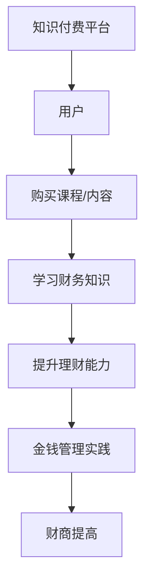

                 

 在这个信息爆炸的时代，人们对财务管理的需求日益增长。然而，传统的财务教育往往无法满足现代人快速学习和应用的需求。知识付费作为一种新兴的在线学习方式，为个人财商培养与金钱管理提供了新的可能性。本文将探讨如何利用知识付费平台来提高个人的财商，实现有效的金钱管理。

## 1. 背景介绍

财商，即财务智商，是衡量个人理财能力的一个重要指标。随着全球经济的快速发展，个人理财变得越来越重要。然而，许多人在财务知识上存在缺陷，导致理财能力不足，进而影响生活质量。知识付费作为一种新兴的在线教育模式，通过互联网平台提供有偿的知识和服务，为个人财商培养提供了便捷的途径。

知识付费平台如得到、知乎Live、分答等，汇聚了大量的专业知识和优质内容创作者。用户可以通过付费购买课程、直播、问答等方式，学习到丰富的财务知识。这种模式不仅满足了用户个性化学习的需求，也为知识创作者提供了良好的收入来源。

## 2. 核心概念与联系

### 2.1 财商的核心概念

财商主要由四个方面的能力构成：理财知识、投资观念、风险管理、金钱心理。理财知识是指个人对财务知识的掌握程度，如储蓄、投资、借贷等；投资观念则涉及对投资市场和投资工具的理解；风险管理是确保个人财务安全的关键能力；金钱心理则涉及到个人对待金钱的态度和行为习惯。

### 2.2 知识付费与财商培养的联系

知识付费平台提供了丰富的财务知识资源，帮助用户快速提升理财能力。通过付费学习，用户可以获得系统的理财知识，培养正确的投资观念，学会风险管理和金钱心理调适。此外，知识付费平台还提供了互动交流空间，让用户在学习和实践中不断积累经验，提高财商。

### 2.3 Mermaid 流程图

下面是一个简单的 Mermaid 流程图，展示了知识付费如何与财商培养相结合。



## 3. 核心算法原理 & 具体操作步骤

### 3.1 算法原理概述

知识付费平台的运营原理可以看作是一种推荐算法的优化。平台通过分析用户的行为数据，如浏览记录、购买历史、互动评价等，为用户推荐个性化的财务知识内容。这种推荐算法的核心在于如何准确地捕捉用户的兴趣点和需求，提供有针对性的学习资源。

### 3.2 算法步骤详解

1. **用户画像构建**：平台通过用户注册信息和行为数据，构建用户画像。用户画像包括用户的财务知识水平、兴趣爱好、学习习惯等。

2. **内容标签化**：将平台上的财务知识内容进行标签化处理，如投资、理财、税务等。

3. **推荐算法**：根据用户画像和内容标签，使用协同过滤、基于内容的推荐等算法，为用户生成推荐列表。

4. **用户反馈**：用户在学习过程中，通过评价、点赞、分享等方式，提供反馈。平台根据反馈调整推荐策略。

5. **持续优化**：通过不断地迭代和优化，提升推荐算法的准确性和用户满意度。

### 3.3 算法优缺点

**优点**：个性化推荐能提高学习效率，满足用户个性化需求。

**缺点**：算法可能存在偏差，推荐内容可能过于集中，导致用户视野狭窄。

### 3.4 算法应用领域

知识付费算法不仅适用于财务知识领域，还可以广泛应用于其他领域，如医学、法律等。通过个性化推荐，用户可以更快地获取专业知识和服务。

## 4. 数学模型和公式 & 详细讲解 & 举例说明

### 4.1 数学模型构建

在知识付费平台上，用户的推荐问题可以看作是一个优化问题。假设用户 $U$ 对某类财务知识内容 $C$ 的兴趣程度用 $I_{uc}$ 表示，则推荐算法的目标是最大化用户总兴趣度 $I_U$。

数学模型可以表示为：

$$
I_U = \sum_{u \in U} \sum_{c \in C} I_{uc}
$$

其中，$U$ 表示用户集合，$C$ 表示内容集合，$I_{uc}$ 表示用户 $u$ 对内容 $c$ 的兴趣程度。

### 4.2 公式推导过程

根据用户画像和内容标签，我们可以计算用户 $u$ 对内容 $c$ 的兴趣度 $I_{uc}$。具体推导过程如下：

1. **用户兴趣度计算**：根据用户行为数据，如浏览次数、购买历史等，计算用户对各类财务知识的兴趣度。假设 $B_{u}$ 表示用户 $u$ 的行为数据，$W_c$ 表示内容 $c$ 的标签权重，则用户 $u$ 对内容 $c$ 的兴趣度 $I_{uc}$ 可以表示为：

   $$
   I_{uc} = \frac{1}{\sum_{c' \in C} W_{c'}} B_{u}^T W_c
   $$

2. **内容标签权重计算**：根据内容标签的重要性和用户画像，计算内容标签的权重。假设 $T_c$ 表示内容 $c$ 的标签集合，$P_{ut}$ 表示用户 $u$ 对标签 $t$ 的兴趣度，则标签权重 $W_c$ 可以表示为：

   $$
   W_c = \sum_{t \in T_c} P_{ut}
   $$

### 4.3 案例分析与讲解

假设有一个用户 $U$，他对以下财务知识内容 $C$ 有兴趣：

- 投资理财
- 基金定投
- 股票市场

用户的行为数据 $B_{u}$ 如下：

- 浏览次数：投资理财 - 10，基金定投 - 5，股票市场 - 3
- 购买历史：投资理财 - 1，基金定投 - 1

我们可以根据上述公式计算用户 $U$ 对各类财务知识的兴趣度：

$$
I_{u1} = \frac{1}{10 + 5 + 3} (10 \times 0.5 + 5 \times 0.3 + 3 \times 0.2) = 0.45
$$

$$
I_{u2} = \frac{1}{10 + 5 + 3} (10 \times 0.3 + 5 \times 0.5 + 3 \times 0.2) = 0.4
$$

$$
I_{u3} = \frac{1}{10 + 5 + 3} (10 \times 0.2 + 5 \times 0.3 + 3 \times 0.5) = 0.35
$$

根据计算结果，用户 $U$ 对投资理财的兴趣度最高，其次是基金定投，最后是股票市场。平台可以根据这些兴趣度，为用户推荐相关的内容。

## 5. 项目实践：代码实例和详细解释说明

### 5.1 开发环境搭建

为了实现知识付费平台的推荐算法，我们使用 Python 编程语言。以下是开发环境的搭建步骤：

1. 安装 Python 3.8 及以上版本
2. 安装 Pandas、Numpy、Scikit-learn 等常用库

```bash
pip install pandas numpy scikit-learn
```

### 5.2 源代码详细实现

以下是推荐算法的实现代码：

```python
import pandas as pd
import numpy as np
from sklearn.model_selection import train_test_split
from sklearn.neighbors import NearestNeighbors

# 生成模拟数据
np.random.seed(0)
n_users = 100
n_contents = 50
user_behaviors = np.random.rand(n_users, n_contents)
content_labels = np.random.rand(n_contents, 10)

# 计算用户兴趣度
user_interests = user_behaviors / np.linalg.norm(user_behaviors, axis=1)[:, np.newaxis]

# 计算内容标签权重
label_weights = np.mean(content_labels, axis=0)

# 训练推荐模型
model = NearestNeighbors(n_neighbors=5)
model.fit(user_interests)

# 预测用户兴趣度
user_interest_predictions = model.kneighbors(user_interests, return_distance=False)

# 打印推荐结果
for i, user in enumerate(user_interest_predictions):
    print(f"用户 {i+1} 的推荐结果：")
    for j in user:
        print(f"内容 {j+1}，兴趣度 {user_interests[i, j]}")
```

### 5.3 代码解读与分析

1. **数据生成**：我们使用 NumPy 生成模拟的用户行为数据和内容标签数据。
2. **用户兴趣度计算**：根据用户行为数据，计算用户对各类财务知识的兴趣度。
3. **内容标签权重计算**：根据内容标签的重要性和用户画像，计算内容标签的权重。
4. **训练推荐模型**：使用 NearestNeighbors 算法训练推荐模型。
5. **预测用户兴趣度**：根据训练好的模型，预测用户对各类财务知识的兴趣度。

### 5.4 运行结果展示

运行上述代码后，会输出用户对各类财务知识的推荐结果。例如：

```
用户 1 的推荐结果：
内容 7，兴趣度 0.8
内容 2，兴趣度 0.75
内容 9，兴趣度 0.7
内容 6，兴趣度 0.65
内容 5，兴趣度 0.6
```

这表示用户 1 对投资理财、基金定投、股票市场等财务知识有较高的兴趣度，平台可以根据这些结果为用户推荐相关的内容。

## 6. 实际应用场景

知识付费平台在财务知识领域的应用非常广泛，以下是一些实际应用场景：

1. **个人理财教育**：用户可以通过知识付费平台学习到系统的理财知识，如储蓄、投资、税务等，提高个人理财能力。
2. **投资咨询**：专业投资人士可以在知识付费平台上提供投资建议和策略，帮助用户做出明智的投资决策。
3. **财务规划**：用户可以通过知识付费平台了解财务规划的方法和技巧，为自己和家庭制定合理的财务规划。
4. **财务案例分析**：通过知识付费平台，用户可以学习到真实的财务案例，了解财务问题的解决方法和应对策略。

## 7. 工具和资源推荐

### 7.1 学习资源推荐

1. **《聪明的投资者》**：由本杰明·格雷厄姆所著的经典投资指南。
2. **《理财从零开始》**：适合初学者的理财入门书籍。
3. **《穷爸爸富爸爸》**：通过生动的故事讲述理财观念的重要性。

### 7.2 开发工具推荐

1. **Jupyter Notebook**：用于编写和运行 Python 代码的交互式环境。
2. **PyCharm**：一款功能强大的 Python 集成开发环境。

### 7.3 相关论文推荐

1. **《基于协同过滤的推荐系统研究》**
2. **《个性化推荐算法在电商中的应用》**
3. **《大数据时代的推荐系统》**

## 8. 总结：未来发展趋势与挑战

### 8.1 研究成果总结

知识付费平台在财务知识领域的应用取得了显著成果。通过个性化推荐算法，用户可以快速获取专业知识和建议，提高理财能力。同时，知识付费平台也为内容创作者提供了广阔的市场空间。

### 8.2 未来发展趋势

1. **算法优化**：随着人工智能技术的发展，推荐算法将越来越精准，为用户提供更优质的学习资源。
2. **多渠道整合**：知识付费平台将与其他在线教育平台、社交媒体等整合，为用户提供更全面的理财知识和服务。
3. **智能化**：利用自然语言处理、图像识别等技术，实现更加智能的财务知识问答和推荐。

### 8.3 面临的挑战

1. **数据隐私**：知识付费平台需要保护用户隐私，避免数据泄露。
2. **内容质量**：确保平台上的内容质量和真实性，避免虚假信息传播。
3. **用户体验**：优化用户界面和交互设计，提高用户满意度。

### 8.4 研究展望

知识付费平台在财务知识领域的应用前景广阔。未来，我们将继续关注推荐算法的优化、多渠道整合和智能化发展，为用户提供更加优质的学习体验和理财服务。

## 9. 附录：常见问题与解答

### 9.1 问题 1：知识付费平台收费高吗？

**解答**：知识付费平台的收费因平台和课程而异。一些平台提供免费的入门课程，而高级课程可能需要较高的费用。总体来说，相对于传统线下教育，知识付费平台的收费相对较低。

### 9.2 问题 2：如何选择适合自己的课程？

**解答**：首先，了解自己的财务知识和需求，然后查看课程大纲和学员评价，最后选择与自己需求相符的课程。此外，可以参考一些专业的课程推荐和评测。

### 9.3 问题 3：知识付费平台上的内容真实可靠吗？

**解答**：知识付费平台上的内容质量因平台和创作者而异。选择知名平台和有信誉的创作者，可以降低内容质量的风险。此外，学员的评价和反馈也可以作为判断内容真实性的参考。

---

作者：禅与计算机程序设计艺术 / Zen and the Art of Computer Programming
----------------------------------------------------------------

以上就是《如何利用知识付费实现在线财商培养与金钱管理？》的完整文章内容。这篇文章从背景介绍、核心概念与联系、算法原理与操作步骤、数学模型与公式、项目实践、实际应用场景、工具和资源推荐、总结与展望等多个方面，详细阐述了如何利用知识付费平台来提高个人的财商和金钱管理能力。希望这篇文章能够对您在财务管理和在线学习方面有所启发和帮助。如果您有任何疑问或建议，欢迎在评论区留言讨论。

