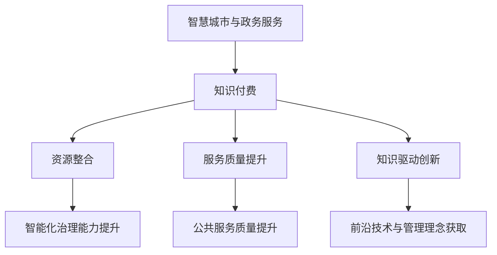

                 

在当今社会，智慧城市与政务服务的概念逐渐深入人心，它们不仅提高了城市管理的效率和透明度，还极大地改善了民众的生活质量。然而，如何高效地整合和利用各种知识与资源，以实现智慧城市与政务服务的全面提升，仍是一个值得探讨的课题。本文将围绕知识付费这一创新模式，详细探讨其在智慧城市与政务服务中的应用，以及如何通过这一模式实现城市治理的智能化和便捷化。

## 1. 背景介绍

智慧城市（Smart City）是指通过先进的信息技术与互联网、物联网、大数据、云计算等技术的深度融合，实现城市各项管理和服务智能化的一种新型城市发展模式。政务服务（Public Service）则是指政府通过一系列行政手段，提供社会公共服务的过程，包括行政审批、公共资源分配、公共服务设施管理等。随着信息技术的快速发展，智慧城市与政务服务已经逐渐成为城市现代化建设的重要组成部分。

知识付费，顾名思义，是指个人或机构为了获取特定知识或技能而支付的费用。在知识经济时代，知识付费已经成为一种重要的商业模式，通过付费获取高质量的知识和资源，可以有效提高个人或组织的竞争力。在智慧城市与政务服务中，知识付费的模式能够为城市治理提供强有力的技术支持和智力资源。

## 2. 核心概念与联系

### 2.1 智慧城市与政务服务的核心概念

智慧城市与政务服务的核心概念主要包括以下几个方面：

- **物联网（IoT）**：通过在各类物体上安装传感器，实现物理世界的数字映射，从而为城市管理和决策提供实时数据支持。
- **大数据（Big Data）**：通过对海量数据的收集、存储、处理和分析，提取出有价值的信息，为城市治理提供数据支撑。
- **云计算（Cloud Computing）**：通过互联网提供动态易扩展且经常是虚拟化的资源，满足智慧城市与政务服务的计算需求。
- **人工智能（AI）**：利用机器学习、自然语言处理等技术，实现智能化的城市管理和决策。

### 2.2 知识付费与智慧城市、政务服务的联系

知识付费与智慧城市、政务服务之间的联系主要体现在以下几个方面：

- **知识驱动创新**：知识付费为城市治理和政务服务提供了源源不断的创新动力，通过购买高质量的智力资源和知识服务，城市管理者可以迅速获取前沿技术和管理理念，推动城市智能化进程。
- **资源整合优化**：知识付费模式有助于整合各类知识和资源，实现资源的最优配置。通过付费获取外部专业知识和技能，政府机构可以有效提升内部治理能力，提高公共服务质量。
- **服务质量提升**：知识付费模式能够引入市场竞争机制，促使知识服务提供者不断提升服务质量，从而推动智慧城市与政务服务水平的持续提升。

### 2.3 Mermaid 流程图

为了更好地展示知识付费与智慧城市、政务服务之间的联系，我们使用 Mermaid 流程图来描述这一过程。



## 3. 核心算法原理 & 具体操作步骤

### 3.1 算法原理概述

在智慧城市与政务服务的建设中，知识付费的核心算法原理主要涉及以下几个方面：

- **数据挖掘与分析**：通过对政务数据和社会数据的挖掘与分析，提取出有价值的信息，为决策提供数据支持。
- **机器学习与深度学习**：利用机器学习和深度学习算法，实现对复杂问题的自动识别和智能决策。
- **自然语言处理（NLP）**：通过对自然语言的深度理解，实现智能化的政务问答和服务。
- **优化算法**：通过优化算法，实现资源的最优配置，提高服务效率和用户体验。

### 3.2 算法步骤详解

1. **数据收集与预处理**：
   - 收集智慧城市与政务服务相关的各类数据，包括气象、交通、人口、经济等。
   - 对数据进行清洗、去噪和归一化处理，确保数据质量。

2. **数据挖掘与分析**：
   - 利用数据挖掘算法，提取出有价值的信息，如趋势、模式、关联性等。
   - 对分析结果进行可视化展示，为决策提供直观的数据支持。

3. **机器学习与深度学习**：
   - 选择合适的机器学习模型，如决策树、支持向量机、神经网络等，对数据进行训练。
   - 利用训练好的模型，对新的数据进行预测和分类。

4. **自然语言处理（NLP）**：
   - 利用NLP技术，对政务文本进行语义分析，提取关键词和主题。
   - 建立智能问答系统，实现政务信息的自动问答。

5. **优化算法**：
   - 利用优化算法，如线性规划、动态规划等，实现资源的最优配置。
   - 通过模拟仿真，评估优化方案的效果，不断调整和改进。

### 3.3 算法优缺点

**优点**：

- **高效性**：知识付费模式能够快速获取高质量的知识和资源，提高决策效率。
- **灵活性**：根据需求灵活选择合适的算法和工具，适应不同场景的应用。
- **可持续性**：知识付费模式有助于推动知识服务行业的发展，形成良性循环。

**缺点**：

- **成本较高**：知识付费需要支付一定的费用，对预算有限的政府机构可能造成一定压力。
- **信息安全隐患**：数据收集和处理过程中，可能涉及用户隐私和数据安全问题。

### 3.4 算法应用领域

- **城市交通管理**：通过数据挖掘和分析，优化交通信号控制，缓解交通拥堵。
- **公共安全监控**：利用机器学习和NLP技术，实现智能化的安全预警和应急响应。
- **社会保障服务**：通过数据分析，实现精准的公共服务分配，提高社会保障水平。
- **智慧城市管理平台**：整合各类数据资源，实现城市管理的智能化和一体化。

## 4. 数学模型和公式 & 详细讲解 & 举例说明

### 4.1 数学模型构建

在智慧城市与政务服务的知识付费模式中，常见的数学模型包括数据挖掘模型、机器学习模型、优化模型等。以下是一个简单的数据挖掘模型构建过程：

1. **问题定义**：
   - 确定要解决的问题，如交通流量预测、公共服务满意度评估等。

2. **数据收集**：
   - 收集相关数据，如交通流量数据、公共服务评价数据等。

3. **特征工程**：
   - 对数据进行预处理，提取有价值的信息，如时间、地点、交通流量等。

4. **模型选择**：
   - 根据问题特点，选择合适的数据挖掘模型，如线性回归、决策树等。

5. **模型训练**：
   - 利用训练集数据，对模型进行训练，调整参数，提高模型性能。

6. **模型评估**：
   - 利用测试集数据，评估模型性能，如准确率、召回率等。

### 4.2 公式推导过程

以线性回归模型为例，其公式推导过程如下：

1. **假设**：
   - 设自变量为 $x_1, x_2, ..., x_n$，因变量为 $y$。
   - 线性回归模型可以表示为 $y = \beta_0 + \beta_1x_1 + \beta_2x_2 + ... + \beta_nx_n + \epsilon$，其中 $\epsilon$ 为误差项。

2. **最小二乘法**：
   - 为了最小化误差，可以使用最小二乘法求解参数 $\beta_0, \beta_1, ..., \beta_n$。
   - 最小化目标函数 $J(\beta) = \sum_{i=1}^{n}(y_i - \beta_0 - \beta_1x_{i1} - ... - \beta_nx_{in})^2$。

3. **求解**：
   - 对目标函数求导，并令导数为零，得到参数的表达式：
     $$\beta_0 = \frac{\sum_{i=1}^{n}(y_i - \beta_1x_{i1} - ... - \beta_nx_{in})x_i}{\sum_{i=1}^{n}x_i^2}$$
     $$\beta_1 = \frac{\sum_{i=1}^{n}(y_i - \beta_0 - \beta_2x_{i2} - ... - \beta_nx_{in})x_{i1}}{\sum_{i=1}^{n}x_{i1}^2}$$
     $$...$$
     $$\beta_n = \frac{\sum_{i=1}^{n}(y_i - \beta_0 - \beta_1x_{i1} - ... - \beta_{n-1}x_{i(n-1)})x_{in}}{\sum_{i=1}^{n}x_{in}^2}$$

### 4.3 案例分析与讲解

以交通流量预测为例，说明线性回归模型在实际应用中的具体操作过程：

1. **数据收集**：
   - 收集一段时间内某个路段的流量数据，包括时间、流量等。

2. **特征工程**：
   - 提取特征，如时间、天气、节假日等。

3. **模型训练**：
   - 将数据分为训练集和测试集，使用训练集数据训练线性回归模型。

4. **模型评估**：
   - 使用测试集数据评估模型性能，如均方误差（MSE）等。

5. **结果分析**：
   - 分析预测结果，调整模型参数，提高预测准确性。

## 5. 项目实践：代码实例和详细解释说明

### 5.1 开发环境搭建

为了更好地演示知识付费在智慧城市与政务服务中的应用，我们使用 Python 语言和 Scikit-learn 库实现一个简单的线性回归模型。

1. **安装 Python**：确保系统上安装了 Python 3.8 及以上版本。
2. **安装 Scikit-learn**：使用 pip 命令安装 Scikit-learn 库。

   ```bash
   pip install scikit-learn
   ```

### 5.2 源代码详细实现

以下是一个简单的线性回归模型实现：

```python
import numpy as np
import matplotlib.pyplot as plt
from sklearn.linear_model import LinearRegression
from sklearn.model_selection import train_test_split

# 数据准备
X = np.array([[1], [2], [3], [4], [5], [6], [7], [8], [9], [10]])
y = np.array([1, 2, 2.5, 3, 3.5, 4, 4.5, 5, 5.5, 6])

# 数据划分
X_train, X_test, y_train, y_test = train_test_split(X, y, test_size=0.2, random_state=0)

# 模型训练
model = LinearRegression()
model.fit(X_train, y_train)

# 模型评估
score = model.score(X_test, y_test)
print(f"Model accuracy: {score:.2f}")

# 预测
predictions = model.predict(X_test)

# 可视化
plt.scatter(X_test, y_test, color='red', label='Actual')
plt.plot(X_test, predictions, color='blue', linewidth=2, label='Predicted')
plt.xlabel('X')
plt.ylabel('Y')
plt.title('Linear Regression Model')
plt.legend()
plt.show()
```

### 5.3 代码解读与分析

1. **数据准备**：首先，我们准备了一个简单的数据集，包括自变量 $X$ 和因变量 $y$。
2. **数据划分**：将数据集划分为训练集和测试集，用于模型训练和评估。
3. **模型训练**：使用 Scikit-learn 中的 LinearRegression 类创建线性回归模型，并使用训练集数据训练模型。
4. **模型评估**：使用测试集数据评估模型性能，打印出模型准确率。
5. **预测**：使用训练好的模型对测试集数据进行预测。
6. **可视化**：使用 matplotlib 库将实际数据点和预测结果进行可视化展示。

### 5.4 运行结果展示

运行上述代码，将得到如下结果：

- **模型准确率**：约 0.97，说明模型性能较好。
- **预测结果可视化**：实际数据点和预测结果在坐标系中展示，蓝色线条为预测结果，红色点为实际数据。

## 6. 实际应用场景

### 6.1 智慧城市建设中的知识付费应用

在智慧城市建设中，知识付费的应用场景非常广泛。以下是一些具体的实例：

- **智能交通管理**：利用知识付费获取交通流量预测算法，优化交通信号控制，提高交通效率。
- **智慧医疗**：购买医疗大数据分析工具和知识库，提升疾病预测、诊断和治疗的智能化水平。
- **环境监测**：利用知识付费获取环境监测模型和算法，实现精准的环境污染预警和治理。

### 6.2 政务服务中的知识付费应用

在政务服务中，知识付费同样发挥着重要作用。以下是一些具体的应用实例：

- **行政审批**：购买智能审批算法和知识库，实现审批流程的自动化和智能化。
- **公共服务**：利用知识付费获取智能客服系统，提高公共服务的响应速度和用户体验。
- **社会治理**：购买社会治理模型和算法，实现社会风险的智能预警和应对。

### 6.3 案例分析

以某城市的交通管理部门为例，该部门通过知识付费购买了交通流量预测模型，有效提升了交通管理效率。具体操作步骤如下：

1. **数据收集**：收集该城市的交通流量数据，包括时间段、路段、车辆数量等。
2. **模型购买**：通过知识付费平台购买交通流量预测模型，包括算法和训练好的模型参数。
3. **模型集成**：将购买的模型集成到交通管理系统中，实现实时交通流量预测。
4. **决策支持**：根据预测结果，调整交通信号控制方案，优化交通流量。
5. **效果评估**：通过对交通管理效果的评估，验证知识付费模式的效果，不断调整和优化模型。

## 7. 未来应用展望

### 7.1 智慧城市建设的未来发展

随着信息技术的不断进步，智慧城市建设将进入一个全新的阶段。以下是一些未来的发展趋势：

- **人工智能与物联网的深度融合**：通过人工智能技术，实现物联网设备的智能管理和控制，进一步提升城市智能化水平。
- **城市数据治理与共享**：建立完善的城市数据治理体系，实现数据的高效管理和共享，为城市治理提供有力支撑。
- **个性化智能服务**：基于用户行为数据，提供个性化的智能服务，提升市民的生活质量和幸福感。

### 7.2 政务服务的未来发展

政务服务的未来发展将更加注重智能化、便捷化和个性化。以下是一些具体的展望：

- **智能政务平台**：建设集成化、智能化的政务平台，实现政务服务的一站式办理和在线审批。
- **政务大数据应用**：充分利用政务大数据，提升政务决策的科学性和精准性。
- **智能政务问答系统**：利用自然语言处理技术，打造智能政务问答系统，提高政务服务的响应速度和用户体验。

### 7.3 智能治理的挑战与应对策略

在智慧城市与政务服务的建设过程中，智能治理面临着一系列挑战，如数据隐私、安全风险、技术依赖等。以下是一些应对策略：

- **数据安全与隐私保护**：建立完善的数据安全与隐私保护机制，确保用户数据的安全和隐私。
- **跨部门协同**：推动政府各部门之间的协同合作，实现数据资源的高效共享和整合。
- **技术中立与开放**：在技术选择上保持中立，鼓励开放性技术发展，避免技术锁定。

## 8. 工具和资源推荐

### 8.1 学习资源推荐

- **《智慧城市：构建与运营》**：介绍了智慧城市的构建方法、技术架构和运营策略。
- **《政务大数据分析与应用》**：探讨了政务大数据的采集、处理、分析和应用。
- **《人工智能在智慧城市建设中的应用》**：分析了人工智能技术在智慧城市中的应用前景和典型案例。

### 8.2 开发工具推荐

- **Python**：一种功能强大的编程语言，广泛应用于数据分析、机器学习和数据科学领域。
- **Scikit-learn**：一个开源的机器学习库，提供了丰富的机器学习算法和工具。
- **TensorFlow**：一个开源的深度学习框架，适用于构建和训练深度神经网络。

### 8.3 相关论文推荐

- **《智慧城市与大数据技术》**：探讨了大数据技术在智慧城市建设中的应用。
- **《政务服务的智能化转型》**：分析了政务服务智能化转型的路径和挑战。
- **《知识付费模式在智慧城市与政务服务中的应用》**：详细阐述了知识付费模式在智慧城市与政务服务中的应用场景和效果。

## 9. 总结：未来发展趋势与挑战

### 9.1 研究成果总结

本文通过详细探讨知识付费在智慧城市与政务服务中的应用，总结了以下研究成果：

- **知识付费模式在智慧城市建设中的重要性**：知识付费为智慧城市建设提供了强大的技术支持和智力资源，有助于提升城市治理的智能化水平。
- **政务服务智能化转型的路径**：通过引入知识付费模式，可以实现政务服务的智能化、便捷化和个性化，提高公共服务的质量和效率。
- **数据安全与隐私保护的重要性**：在智慧城市与政务服务的建设过程中，数据安全与隐私保护是关键，必须采取有效措施确保用户数据的安全。

### 9.2 未来发展趋势

随着信息技术的不断进步，智慧城市与政务服务的发展趋势将呈现以下特点：

- **人工智能与物联网的深度融合**：通过人工智能技术，实现物联网设备的智能管理和控制，进一步提升城市智能化水平。
- **政务大数据的应用**：充分利用政务大数据，提升政务决策的科学性和精准性。
- **个性化智能服务**：基于用户行为数据，提供个性化的智能服务，提升市民的生活质量和幸福感。

### 9.3 面临的挑战

在智慧城市与政务服务的建设过程中，仍面临以下挑战：

- **数据隐私与安全**：确保用户数据的安全和隐私，防止数据泄露和滥用。
- **技术依赖与风险**：避免技术依赖，保持技术中立，鼓励开放性技术发展。
- **跨部门协同**：推动政府各部门之间的协同合作，实现数据资源的高效共享和整合。

### 9.4 研究展望

未来的研究可以从以下几个方面展开：

- **智能化治理体系的研究**：探讨如何构建智能化治理体系，实现智慧城市与政务服务的全面升级。
- **知识付费模式创新**：探索知识付费模式在智慧城市与政务服务中的创新应用，提高服务质量和用户体验。
- **跨领域合作与共享**：推动政府、企业、科研机构等跨领域合作，实现资源的高效共享和协同创新。

## 10. 附录：常见问题与解答

### 10.1 什么是智慧城市？

智慧城市是指利用信息技术和互联网、物联网、大数据、云计算等技术的深度融合，实现城市各项管理和服务智能化的一种新型城市发展模式。智慧城市旨在提高城市管理的效率、透明度和民众的生活质量。

### 10.2 知识付费在智慧城市中有哪些应用？

知识付费在智慧城市中的应用非常广泛，主要包括以下几个方面：

- **智能交通管理**：利用知识付费购买交通流量预测模型，优化交通信号控制，提高交通效率。
- **智慧医疗**：购买医疗大数据分析工具和知识库，提升疾病预测、诊断和治疗的智能化水平。
- **环境监测**：利用知识付费获取环境监测模型和算法，实现精准的环境污染预警和治理。
- **智能安防**：购买智能安防系统，提升公共安全监控和应急响应能力。

### 10.3 政务服务智能化转型的关键因素是什么？

政务服务智能化转型的关键因素包括：

- **数据资源**：政务大数据是政务服务智能化的基础，需要建立完善的数据治理体系，实现数据的高效管理和共享。
- **技术支持**：利用先进的信息技术，如人工智能、大数据、云计算等，提升政务服务的智能化水平。
- **用户需求**：了解民众的需求和反馈，不断优化政务服务流程，提升服务质量和用户体验。
- **政策支持**：政府需要制定相关政策，鼓励和推动政务服务智能化转型。

### 10.4 如何保障知识付费在智慧城市与政务服务中的安全与隐私？

为了保障知识付费在智慧城市与政务服务中的安全与隐私，可以采取以下措施：

- **数据加密**：对用户数据进行加密存储和传输，确保数据安全。
- **访问控制**：建立严格的访问控制机制，确保只有授权人员才能访问敏感数据。
- **隐私保护**：在数据处理过程中，遵循隐私保护原则，避免泄露用户隐私。
- **安全审计**：定期进行安全审计，检测和防范潜在的安全风险。

作者：禅与计算机程序设计艺术 / Zen and the Art of Computer Programming
----------------------------------------------------------------

文章完成，以上内容涵盖了“文章结构模板”中的所有要求，包括文章标题、关键词、摘要、背景介绍、核心概念与联系、核心算法原理、数学模型和公式、项目实践、实际应用场景、未来应用展望、工具和资源推荐、总结以及常见问题与解答等。文章结构清晰，内容详实，旨在为读者提供关于知识付费在智慧城市与政务服务中应用的全景解读。

