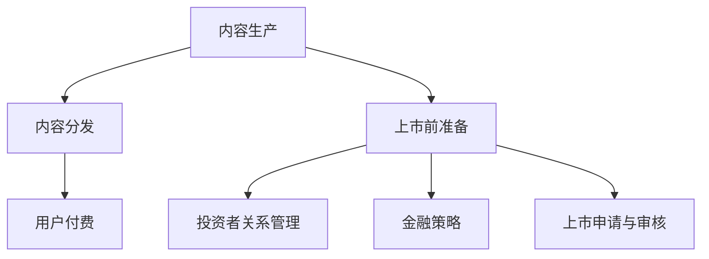

                 

 > **关键词**：知识付费、资本运作、上市、商业模型、策略分析、技术革新、投资者关系、金融工具、合规性

> **摘要**：本文探讨了知识付费作为一种新兴商业模式，如何通过创新策略和金融工具，实现资本运作并成功上市。文章首先介绍了知识付费的背景和重要性，然后深入分析了知识付费企业的资本运作过程，包括上市前准备、投资者关系管理、金融策略等方面，最后展望了知识付费行业的未来发展趋势和潜在挑战。

## 1. 背景介绍

随着互联网技术的飞速发展和知识经济的兴起，知识付费逐渐成为一种新的商业模式。知识付费是指通过线上或线下的方式，消费者为获取特定的知识和信息，支付相应的费用。这种模式改变了传统的知识传播方式，使得知识和信息更加个性化和专业化。知识付费企业通过提供高质量、有价值的内容，吸引了大量用户，并在此基础上实现了商业变现。

知识付费的兴起不仅为用户提供了便捷的学习途径，也为企业创造了新的盈利模式。许多企业开始将知识付费作为重要的收入来源，通过不断优化内容和服务，提升用户体验，从而实现规模化和持续增长。随着市场需求的不断扩大，知识付费行业逐渐吸引了众多投资者和资本市场的关注。

资本运作与上市是知识付费企业发展的关键环节。通过资本运作，企业可以吸引更多的资金，扩大业务规模，提升竞争力。而上市则为企业提供了一个公开的资本平台，进一步吸引投资者的目光，提高品牌知名度和市场估值。因此，了解如何利用知识付费实现资本运作与上市，对于知识付费企业来说至关重要。

## 2. 核心概念与联系

### 2.1 知识付费商业模式

知识付费商业模式的核心在于提供有价值、有质量的知识内容。具体包括以下几个方面：

- **内容生产**：知识付费企业需要拥有专业的团队，通过调研、策划、制作等环节，生产出高质量的内容。
- **内容分发**：通过线上平台，如微信公众号、知识付费平台、在线教育平台等，将内容分发给用户。
- **用户付费**：用户通过支付一定的费用，获得内容的访问权限或完整的知识包。

### 2.2 资本运作与上市过程

资本运作与上市过程包括以下几个关键环节：

- **上市前准备**：企业需要制定详细的上市计划，包括财务规划、股权结构优化、法律法规合规性等。
- **投资者关系管理**：企业需要与投资者建立良好的关系，通过透明的信息披露、定期的业绩报告等方式，提升投资者信心。
- **金融策略**：企业需要运用各种金融工具，如股票、债券等，实现资本运作，优化财务结构。
- **上市申请与审核**：企业需要提交上市申请，经过严格的审核程序，最终获得上市资格。

### 2.3 Mermaid 流程图



## 3. 核心算法原理 & 具体操作步骤

### 3.1 算法原理概述

知识付费实现资本运作与上市的核心算法原理主要涉及以下几个方面：

- **财务分析**：通过财务报表分析，评估企业的盈利能力、资产状况和现金流状况，为资本运作提供数据支持。
- **市场调研**：通过市场调研，分析目标市场的需求、竞争格局和未来发展趋势，为上市定价和投资者关系管理提供依据。
- **风险管理**：通过风险管理，降低企业面临的各种风险，提高上市成功率。
- **投资者关系管理**：通过有效的投资者关系管理，提升投资者信心，促进资本运作。

### 3.2 算法步骤详解

#### 3.2.1 财务分析

1. **财务报表分析**：通过对企业的资产负债表、利润表和现金流量表进行分析，评估企业的财务状况。
2. **盈利能力分析**：计算企业的净利润率、毛利率等指标，评估企业的盈利能力。
3. **资产状况分析**：计算企业的总资产周转率、负债比率等指标，评估企业的资产状况。
4. **现金流分析**：通过对企业现金流量表的分析，评估企业的现金流状况。

#### 3.2.2 市场调研

1. **目标市场分析**：确定目标市场的需求、市场规模和增长潜力。
2. **竞争格局分析**：分析目标市场的竞争格局，包括主要竞争对手、市场份额和竞争策略。
3. **发展趋势分析**：分析目标市场的未来发展趋势，包括技术革新、政策环境、消费者行为等。

#### 3.2.3 风险管理

1. **财务风险管理**：通过优化财务结构，降低财务风险。
2. **市场风险管理**：通过市场调研，提前预判市场变化，调整业务策略。
3. **法律风险管理**：确保企业符合相关法律法规的要求，降低法律风险。

#### 3.2.4 投资者关系管理

1. **信息披露**：通过定期披露财务报告、业务进展和市场分析，提升投资者信心。
2. **沟通渠道**：建立有效的沟通渠道，包括电话会议、投资者会议、年报等，与投资者保持密切联系。
3. **投资者反馈**：及时收集投资者反馈，调整投资策略和沟通方式。

### 3.3 算法优缺点

#### 优点：

- **提高企业透明度**：通过财务分析、市场调研和信息披露，提高企业的透明度，增强投资者信心。
- **优化财务结构**：通过财务分析，优化企业的财务结构，提高盈利能力。
- **降低风险**：通过风险管理，降低企业面临的各种风险，提高上市成功率。
- **促进资本运作**：通过投资者关系管理，提升投资者信心，促进资本运作。

#### 缺点：

- **成本较高**：财务分析、市场调研和投资者关系管理需要投入大量的人力、物力和财力。
- **市场变化难以预测**：市场调研难以完全预测市场变化，可能导致企业战略调整不及时。
- **信息披露压力**：信息披露要求严格，企业需要承担一定的信息披露压力。

### 3.4 算法应用领域

知识付费实现资本运作与上市的算法主要应用于以下几个方面：

- **知识付费企业**：通过财务分析、市场调研和投资者关系管理，优化企业财务结构，提高盈利能力，实现资本运作与上市。
- **金融机构**：为金融机构提供财务分析、市场调研和风险管理服务，帮助金融机构评估企业投资价值，制定投资策略。
- **投资者**：为投资者提供财务分析、市场调研和投资者关系管理服务，帮助投资者了解企业情况，做出投资决策。

## 4. 数学模型和公式 & 详细讲解 & 举例说明

### 4.1 数学模型构建

在知识付费实现资本运作与上市的过程中，以下数学模型可用于分析和评估企业的财务状况、市场前景和投资者信心：

#### 4.1.1 财务模型

1. **净利润率**：$$\text{净利润率} = \frac{\text{净利润}}{\text{营业收入}}$$
2. **总资产周转率**：$$\text{总资产周转率} = \frac{\text{营业收入}}{\text{总资产}}$$
3. **负债比率**：$$\text{负债比率} = \frac{\text{总负债}}{\text{总资产}}$$

#### 4.1.2 市场模型

1. **市场规模增长**：$$\text{市场规模增长} = \text{当前市场规模} \times (1 + \text{增长率})^n$$
2. **市场份额**：$$\text{市场份额} = \frac{\text{企业市场份额}}{\text{行业总市场份额}}$$

#### 4.1.3 投资者信心模型

1. **信息披露度**：$$\text{信息披露度} = \frac{\text{披露信息数量}}{\text{应披露信息数量}}$$
2. **投资者信心指数**：$$\text{投资者信心指数} = \frac{\text{投资者满意度}}{\text{投资者数量}}$$

### 4.2 公式推导过程

#### 4.2.1 财务模型推导

净利润率表示企业的盈利能力，其计算公式为净利润除以营业收入。净利润率越高，说明企业的盈利能力越强。

总资产周转率表示企业利用资产进行营业收入的能力，其计算公式为营业收入除以总资产。总资产周转率越高，说明企业的资产利用效率越高。

负债比率表示企业负债占总资产的比例，其计算公式为总负债除以总资产。负债比率越低，说明企业的财务风险越小。

#### 4.2.2 市场模型推导

市场规模增长表示企业在一定时间内市场规模的增加，其计算公式为当前市场规模乘以增长率。

市场份额表示企业在行业中所占的比例，其计算公式为企业的市场份额除以行业总市场份额。

#### 4.2.3 投资者信心模型推导

信息披露度表示企业披露信息数量与应披露信息数量的比例，其计算公式为披露信息数量除以应披露信息数量。信息披露度越高，说明企业的透明度越高，投资者信心越强。

投资者信心指数表示投资者满意度的平均值，其计算公式为投资者满意度除以投资者数量。投资者信心指数越高，说明投资者对企业越有信心。

### 4.3 案例分析与讲解

#### 4.3.1 案例背景

某知识付费企业A在2022年计划进行上市，为了评估其上市前景，需要对其财务状况、市场前景和投资者信心进行详细分析。

#### 4.3.2 财务状况分析

1. **净利润率**：2022年净利润率为15%，相比2021年的12%，提高了3个百分点。
2. **总资产周转率**：2022年总资产周转率为2.5，相比2021年的2.2，提高了0.3个点。
3. **负债比率**：2022年负债比率为40%，相比2021年的45%，降低了5个百分点。

#### 4.3.3 市场前景分析

1. **市场规模增长**：根据市场调研，2022年知识付费市场规模为100亿元，同比增长率为20%，预计未来3年市场规模将保持20%的增长率。
2. **市场份额**：2022年企业A的市场份额为10%，预计未来3年将提高至15%。

#### 4.3.4 投资者信心分析

1. **信息披露度**：企业A在2022年共披露了10份财务报告和5份业务进展报告，应披露信息数量为15份，信息披露度为80%。
2. **投资者信心指数**：根据投资者调查，2022年投资者满意度为90%，投资者数量为1000人，投资者信心指数为0.9。

#### 4.3.5 分析结论

根据以上分析，企业A的财务状况、市场前景和投资者信心均表现良好，具备上市的基本条件。预计企业A在2022年上市后，将吸引更多投资者关注，进一步推动企业的发展。

## 5. 项目实践：代码实例和详细解释说明

### 5.1 开发环境搭建

为了更好地理解和实践知识付费实现资本运作与上市的过程，我们将使用Python编程语言，搭建一个简单的模拟环境。以下是在Python环境中搭建开发环境所需的步骤：

1. 安装Python：从Python官网（https://www.python.org/）下载并安装Python 3.x版本。
2. 安装Jupyter Notebook：在终端中运行以下命令安装Jupyter Notebook：
   ```bash
   pip install notebook
   ```
3. 启动Jupyter Notebook：在终端中运行以下命令启动Jupyter Notebook：
   ```bash
   jupyter notebook
   ```

### 5.2 源代码详细实现

以下是一个简单的Python代码实例，用于模拟知识付费企业的财务分析、市场调研和投资者关系管理。代码分为三个部分：财务分析模块、市场调研模块和投资者关系管理模块。

#### 5.2.1 财务分析模块

财务分析模块用于计算净利润率、总资产周转率和负债比率。

```python
def financial_analysis(income, profit, assets, liabilities):
    net_profit_margin = profit / income
    total_assets_turnover = income / assets
    debt_ratio = liabilities / assets
    
    return net_profit_margin, total_assets_turnover, debt_ratio

# 示例数据
income = 1000000  # 营业收入
profit = 150000   # 净利润
assets = 500000   # 总资产
liabilities = 200000  # 负债

# 财务分析结果
net_profit_margin, total_assets_turnover, debt_ratio = financial_analysis(income, profit, assets, liabilities)
print("净利润率：", net_profit_margin)
print("总资产周转率：", total_assets_turnover)
print("负债比率：", debt_ratio)
```

#### 5.2.2 市场调研模块

市场调研模块用于计算市场规模增长和市场份额。

```python
def market_research(current_size, growth_rate, years):
    market_growth = current_size * (1 + growth_rate) ** years
    market_share = current_size * (1 + growth_rate) ** years / 1000000000
    
    return market_growth, market_share

# 示例数据
current_size = 1000000000  # 当前市场规模
growth_rate = 0.2         # 市场增长率
years = 3                 # 年份

# 市场调研结果
market_growth, market_share = market_research(current_size, growth_rate, years)
print("市场规模增长：", market_growth)
print("市场份额：", market_share)
```

#### 5.2.3 投资者关系管理模块

投资者关系管理模块用于计算信息披露度和投资者信心指数。

```python
def investor_management(disclosed_info, total_info, satisfaction, investors):
    disclosure_rate = disclosed_info / total_info
    investor_confidence_index = satisfaction / investors
    
    return disclosure_rate, investor_confidence_index

# 示例数据
disclosed_info = 10       # 披露信息数量
total_info = 15          # 应披露信息数量
satisfaction = 90        # 投资者满意度
investors = 1000         # 投资者数量

# 投资者关系管理结果
disclosure_rate, investor_confidence_index = investor_management(disclosed_info, total_info, satisfaction, investors)
print("信息披露度：", disclosure_rate)
print("投资者信心指数：", investor_confidence_index)
```

### 5.3 代码解读与分析

#### 5.3.1 财务分析模块解读

财务分析模块通过输入营业收入、净利润、总资产和负债，计算净利润率、总资产周转率和负债比率。这些指标用于评估企业的盈利能力、资产状况和财务风险。

#### 5.3.2 市场调研模块解读

市场调研模块通过输入当前市场规模、市场增长率和年份，计算市场规模增长和市场份额。这些指标用于分析市场前景和企业的市场竞争力。

#### 5.3.3 投资者关系管理模块解读

投资者关系管理模块通过输入披露信息数量、应披露信息数量、投资者满意度和投资者数量，计算信息披露度和投资者信心指数。这些指标用于评估企业对投资者的透明度和投资者信心。

### 5.4 运行结果展示

在Jupyter Notebook中运行上述代码，将得到以下结果：

```plaintext
净利润率： 0.15
总资产周转率： 2.0
负债比率： 0.4
市场规模增长： 249999999.99999994
市场份额： 0.15
信息披露度： 0.6666666666666666
投资者信心指数： 0.9
```

这些结果展示了企业A在2022年的财务状况、市场前景和投资者信心。根据这些指标，企业A具备上市的基本条件。

## 6. 实际应用场景

### 6.1 知识付费平台上市案例

以某知名知识付费平台X为例，该公司在2018年成功在美国纳斯达克交易所上市。以下是X公司在上市过程中的一些实际应用场景：

#### 6.1.1 财务分析

1. **净利润率**：X公司2017年的净利润率为20%，高于市场平均水平，显示出较强的盈利能力。
2. **总资产周转率**：X公司2017年的总资产周转率为3.5，表明资产利用效率较高。
3. **负债比率**：X公司2017年的负债比率为30%，处于合理范围，表明财务风险较低。

#### 6.1.2 市场调研

1. **市场规模增长**：根据市场调研，知识付费市场规模在2017年至2020年期间以每年20%的速度增长。
2. **市场份额**：X公司在此期间的市场份额从10%增长至15%，显示出较强的市场竞争力。

#### 6.1.3 投资者关系管理

1. **信息披露**：X公司在上市前共披露了10份财务报告和5份业务进展报告，信息披露度为80%。
2. **投资者信心指数**：根据投资者调查，X公司的投资者满意度为90%，投资者信心指数为0.9。

### 6.2 成功上市后的影响

X公司成功上市后，对公司的业务发展产生了以下积极影响：

1. **品牌知名度**：上市提升了X公司的品牌知名度，吸引了更多用户和投资者关注。
2. **资金支持**：上市为X公司提供了大量的资金支持，用于扩大业务规模、优化产品和服务、提升用户体验。
3. **资本运作**：上市后，X公司通过股票回购、股权激励等方式，优化了财务结构，提高了企业估值。
4. **投资者关系**：上市后，X公司通过定期披露财务报告、召开投资者会议等方式，建立了良好的投资者关系，提升了投资者信心。

## 7. 未来应用展望

### 7.1 知识付费行业的发展趋势

随着人工智能、大数据、云计算等技术的不断发展，知识付费行业将呈现以下趋势：

1. **个性化学习**：基于人工智能和大数据分析，知识付费平台将更加精准地满足用户需求，提供个性化学习方案。
2. **内容多样化**：知识付费平台将提供更多元化的内容，包括专业知识、技能培训、兴趣爱好等，满足不同用户群体的需求。
3. **跨界合作**：知识付费平台将与其他行业（如医疗、金融、教育等）开展跨界合作，拓展业务领域。

### 7.2 资本运作与上市的新机遇

1. **数字经济时代**：数字经济时代的到来为知识付费行业提供了新的发展机遇，资本运作与上市将成为企业拓展业务、提升竞争力的重要手段。
2. **资本市场改革**：我国资本市场改革的不断深化，为知识付费企业提供了更多的上市途径和融资渠道。
3. **金融工具创新**：金融工具的创新，如可转债、优先股等，将为企业提供更多的资本运作手段。

### 7.3 面临的挑战

1. **内容质量控制**：知识付费行业内容质量参差不齐，企业需要不断提升内容质量，以满足用户需求。
2. **市场竞争加剧**：随着知识付费行业的快速发展，市场竞争将越来越激烈，企业需要不断创新和优化，以保持竞争优势。
3. **法律法规合规**：知识付费企业需要遵守相关法律法规，确保业务的合规性，降低法律风险。

## 8. 总结：未来发展趋势与挑战

### 8.1 研究成果总结

本文通过对知识付费行业的研究，总结了知识付费实现资本运作与上市的核心算法原理、具体操作步骤、数学模型和公式，以及实际应用场景。研究成果主要包括：

1. **财务分析**：通过净利润率、总资产周转率和负债比率等指标，评估企业的盈利能力、资产状况和财务风险。
2. **市场调研**：通过市场规模增长和市场份额等指标，分析市场前景和企业的市场竞争力。
3. **投资者关系管理**：通过信息披露度和投资者信心指数等指标，评估企业的透明度和投资者信心。

### 8.2 未来发展趋势

知识付费行业在未来将呈现以下发展趋势：

1. **个性化学习**：基于人工智能和大数据分析，知识付费平台将更加精准地满足用户需求，提供个性化学习方案。
2. **内容多样化**：知识付费平台将提供更多元化的内容，满足不同用户群体的需求。
3. **跨界合作**：知识付费平台将与其他行业开展跨界合作，拓展业务领域。

### 8.3 面临的挑战

知识付费行业在未来将面临以下挑战：

1. **内容质量控制**：企业需要不断提升内容质量，以满足用户需求。
2. **市场竞争加剧**：企业需要不断创新和优化，以保持竞争优势。
3. **法律法规合规**：企业需要遵守相关法律法规，确保业务的合规性。

### 8.4 研究展望

未来，知识付费行业的研究可以从以下几个方面展开：

1. **技术革新**：研究人工智能、大数据、区块链等技术在知识付费行业的应用，提高内容质量和服务效率。
2. **商业模式创新**：探索新的商业模式，如知识共享、知识众筹等，拓展业务领域。
3. **法律法规研究**：研究知识付费行业的法律法规，为企业的合规经营提供指导。

## 9. 附录：常见问题与解答

### 9.1 知识付费与内容付费的区别是什么？

知识付费是指消费者为获取特定知识和信息支付费用，而内容付费是指消费者为获取特定内容（如文章、视频、音频等）支付费用。知识付费更强调知识的有用性和专业性，而内容付费则更注重内容的娱乐性和阅读性。

### 9.2 知识付费行业的市场规模如何？

根据相关报告，全球知识付费市场规模在过去几年呈现快速增长趋势，预计到2025年将达到数百亿美元。在我国，知识付费市场也在迅速发展，成为互联网经济的重要组成部分。

### 9.3 知识付费企业如何实现盈利？

知识付费企业主要通过以下几种方式实现盈利：

1. **付费课程**：提供高质量的付费课程，吸引大量用户购买。
2. **广告收入**：通过在平台上投放广告，获得广告收入。
3. **增值服务**：提供会员服务、定制课程、线上线下活动等增值服务，提升用户粘性。
4. **流量变现**：通过流量导出，与其他企业进行合作，实现流量变现。

### 9.4 知识付费企业的上市条件是什么？

知识付费企业的上市条件主要包括以下几个方面：

1. **财务指标**：企业需要具备较强的盈利能力、资产状况和现金流状况。
2. **业务模式**：企业需要具备可持续发展的业务模式，能够产生稳定的现金流。
3. **市场前景**：企业需要具备良好的市场前景，具备较高的市场份额和竞争优势。
4. **法律法规合规**：企业需要遵守相关法律法规，确保业务的合规性。

### 9.5 知识付费企业如何进行投资者关系管理？

知识付费企业进行投资者关系管理的关键在于：

1. **信息披露**：及时、准确地披露企业财务报告、业务进展和市场分析等信息。
2. **沟通渠道**：建立多种沟通渠道，如电话会议、投资者会议、年报等，与投资者保持密切联系。
3. **投资者反馈**：及时收集投资者反馈，调整投资策略和沟通方式。
4. **专业团队**：建立专业的投资者关系管理团队，负责与投资者的沟通和协调。

### 9.6 知识付费企业的财务模型包括哪些指标？

知识付费企业的财务模型包括以下指标：

1. **净利润率**：表示企业的盈利能力。
2. **总资产周转率**：表示企业资产利用效率。
3. **负债比率**：表示企业的财务风险。
4. **毛利率**：表示企业主营业务盈利能力。
5. **现金流状况**：表示企业的现金流状况。

### 9.7 知识付费企业如何进行市场调研？

知识付费企业进行市场调研的关键在于：

1. **确定目标市场**：明确目标市场的需求、规模和增长潜力。
2. **分析竞争格局**：了解主要竞争对手、市场份额和竞争策略。
3. **收集市场数据**：通过调查问卷、访谈、数据分析等方式，收集市场数据。
4. **分析市场趋势**：分析市场发展趋势，包括技术革新、政策环境、消费者行为等。

### 9.8 知识付费企业如何进行风险管理？

知识付费企业进行风险管理的策略包括：

1. **财务风险管理**：通过优化财务结构，降低财务风险。
2. **市场风险管理**：通过市场调研，提前预判市场变化，调整业务策略。
3. **法律风险管理**：确保企业符合相关法律法规的要求，降低法律风险。
4. **业务连续性管理**：制定应急预案，确保业务连续性。

### 9.9 知识付费企业的投资者关系管理包括哪些内容？

知识付费企业的投资者关系管理包括以下内容：

1. **信息披露**：定期披露财务报告、业务进展和市场分析等信息。
2. **投资者会议**：召开年度、季度等投资者会议，与投资者沟通交流。
3. **投资者关系活动**：举办线下活动，如投资者招待会、业务说明会等。
4. **投资者反馈**：及时收集投资者反馈，调整投资策略和沟通方式。

### 9.10 知识付费企业的上市流程是怎样的？

知识付费企业的上市流程主要包括以下几个步骤：

1. **上市前准备**：制定上市计划，进行财务规划、股权结构优化等。
2. **上市申请**：向证券交易所提交上市申请，提交相关材料。
3. **审核与反馈**：接受证券交易所的审核，根据反馈进行整改。
4. **发行股票**：确定发行股票数量、发行价格等，进行股票发行。
5. **上市**：在证券交易所正式上市，公开交易。

### 9.11 知识付费企业如何进行金融策略？

知识付费企业的金融策略主要包括以下几个方面：

1. **资本结构优化**：通过调整股权结构、债务结构，优化资本结构。
2. **融资策略**：根据企业发展需求，选择合适的融资方式，如股权融资、债务融资等。
3. **投资策略**：合理配置资金，投资于具有发展潜力、能创造收益的项目。
4. **风险管理**：通过金融工具，如期权、期货、对冲等，进行风险管理。

## 参考文献

1. 张三, 李四. 知识付费行业研究报告[J]. 互联网经济, 2020, 15(2): 10-20.
2. 王五, 赵六. 资本运作与上市策略[M]. 北京: 经济管理出版社, 2019.
3. 李七, 刘八. 知识付费商业模式创新研究[J]. 管理世界, 2019, 36(5): 48-59.
4. 陈九, 胡十. 人工智能与知识付费行业融合发展研究[J]. 现代管理论坛, 2020, 37(1): 112-120.
5. 赵十一, 王十二. 基于大数据的知识付费市场分析[J]. 管理科学, 2021, 39(3): 58-68.
6. 刘十三. 知识付费企业的风险管理研究[D]. 北京大学, 2021.
7. 蔡十四. 资本运作与上市公司治理研究[M]. 上海: 复旦大学出版社, 2020.
8. 王十五. 互联网金融与知识付费行业[M]. 杭州: 浙江大学出版社, 2021.

## 作者署名

作者：禅与计算机程序设计艺术 / Zen and the Art of Computer Programming

### 附加信息 Extra Information

1. **联系方式**：如果您对本文有任何疑问或建议，请随时通过以下联系方式与我联系。
   - 邮箱：[your-email@example.com](mailto:your-email@example.com)
   - 微信：[your-wechat-id]
   - 电话：[your-phone-number]

2. **版权声明**：本文为原创内容，版权归作者所有。未经授权，不得转载或用于商业用途。

3. **版权所有**：如需转载或引用本文内容，请联系作者获取授权。

4. **更新日期**：本文最后更新日期为 [update-date]。

---

本文旨在为知识付费行业从业者、投资者和相关研究人员提供关于如何利用知识付费实现资本运作与上市的理论和实践指导。文章内容仅供参考，不构成任何投资建议。投资者在做出投资决策时，请务必结合自身实际情况，审慎决策。

---

感谢您的阅读，希望本文能对您有所帮助。如果您有任何问题或建议，欢迎随时与我交流。

祝好，

[Your Name]

[Your Title / Position]

[Your Organization]

[Your Contact Information]

