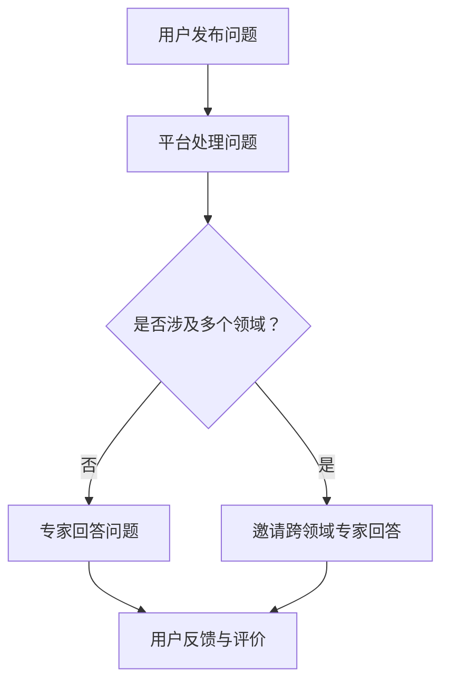

                 

关键词：知识社交、跨界创新、协作、人工智能、算法、技术交流、共享经济、创新生态系统

## 摘要

本文旨在探讨如何通过知识社交来促进跨界创新和协作。在当今快速发展的信息技术时代，知识社交已经成为一种重要的交流方式，它不仅能够加速信息的传播，还能够促进不同领域专家之间的互动与协作。本文将首先介绍知识社交的基本概念及其在科技领域的应用，然后深入分析知识社交如何促进跨界创新和协作，并探讨其面临的挑战和未来的发展趋势。

## 1. 背景介绍

随着互联网和社交媒体的普及，知识社交逐渐成为信息传播和知识分享的主要方式。知识社交是指通过互联网平台，如社交网络、论坛、博客、问答社区等，实现知识的传播、交流与共享。这种新型社交方式不仅改变了人们获取信息和知识的方式，也推动了跨界创新和协作的进程。

### 1.1 知识社交的发展历程

知识社交的发展可以分为以下几个阶段：

1. **初期的知识分享（20世纪90年代）**：互联网的兴起使得人们可以通过论坛、博客等平台分享知识。
2. **社交媒体时代（21世纪初）**：Facebook、Twitter等社交媒体平台的兴起，使得知识传播更加广泛和快速。
3. **知识社区时代（近年来）**：以Quora、Stack Overflow为代表的问答社区和专业论坛，成为知识分享和交流的重要平台。

### 1.2 知识社交在科技领域的应用

在科技领域，知识社交的应用主要体现在以下几个方面：

1. **技术问答**：如Stack Overflow，为开发者提供了一个问答平台，解决了编程中遇到的问题。
2. **专业论坛**：如GitHub，为开发者提供了一个协作和分享代码的平台。
3. **学术交流**：如ResearchGate，为学者提供了一个分享研究成果和交流思想的平台。

## 2. 核心概念与联系

### 2.1 知识社交的基本原理

知识社交的核心在于信息的传播和共享。它通常包括以下几个基本原理：

1. **互动性**：用户通过提问、回答、评论等方式进行互动，促进了知识的交流。
2. **参与性**：用户积极参与知识的传播和共享，形成了知识生态系统。
3. **个性化**：知识社交平台根据用户的兴趣和行为，提供个性化的知识推荐。

### 2.2 跨界创新的定义

跨界创新是指在不同领域之间进行创新，通过融合不同领域的知识和技术，创造新的解决方案或产品。跨界创新的特点包括：

1. **多领域融合**：融合多个领域的知识和技术，创造出新的价值。
2. **高风险高回报**：由于涉及到多个领域，跨界创新通常面临较高的风险，但一旦成功，回报也极为丰厚。
3. **跨学科合作**：需要跨学科专家的协作，形成创新团队。

### 2.3 知识社交与跨界创新的联系

知识社交为跨界创新提供了以下几个方面的支持：

1. **信息获取**：通过知识社交平台，可以迅速获取不同领域的知识和信息。
2. **人才连接**：知识社交平台使得不同领域的专家可以快速连接，形成协作网络。
3. **资源共享**：知识社交平台上的资源（如论文、代码、工具等）可以共享，降低了创新的成本。

### 2.4 知识社交流程图




## 3. 核心算法原理 & 具体操作步骤

### 3.1 算法原理概述

知识社交平台的核心算法通常包括推荐算法、社交网络分析算法等。这些算法用于优化信息传播、提高用户参与度和促进知识共享。

### 3.2 算法步骤详解

1. **推荐算法**：
   - 收集用户的行为数据，如浏览、搜索、点赞等。
   - 构建用户兴趣模型，利用协同过滤、内容推荐等方法推荐相关内容。
   - 根据用户的反馈调整推荐策略。

2. **社交网络分析算法**：
   - 构建用户社交网络图，识别关键节点和社区结构。
   - 利用网络分析算法（如PageRank、社区检测算法等）优化知识传播路径。
   - 根据社交网络结构推荐专家和资源。

### 3.3 算法优缺点

- **优点**：
  - 提高信息传播效率，快速获取所需知识。
  - 促进跨领域合作，激发创新思维。
  - 降低信息过载，提供个性化推荐。

- **缺点**：
  - 可能导致信息茧房，限制知识获取的广度。
  - 数据隐私和安全问题。
  - 算法公平性和透明性有待提高。

### 3.4 算法应用领域

- **技术社区**：如GitHub、Stack Overflow，用于代码分享和技术问答。
- **学术研究**：如ResearchGate，用于学术成果分享和协作。
- **企业协作**：如Confluence、Slack，用于企业内部知识共享和协作。

## 4. 数学模型和公式 & 详细讲解 & 举例说明

### 4.1 数学模型构建

知识社交中的数学模型可以基于图论和网络科学。以下是一个简单的社交网络模型：

```latex
G = (V, E)
```

其中，`V` 表示节点（用户或专家），`E` 表示边（用户之间的互动或连接）。

### 4.2 公式推导过程

网络密度（Network Density）是衡量社交网络紧密程度的指标，其公式为：

$$
\rho = \frac{2|E|}{|V|(|V|-1)}
$$

其中，`|E|` 表示边的数量，`|V|` 表示节点的数量。

### 4.3 案例分析与讲解

假设有一个由100个用户组成的社交网络，其中存在200条边。根据上述公式，网络密度为：

$$
\rho = \frac{2 \times 200}{100 \times (100-1)} = 0.2
$$

这表明该社交网络相对较为松散，知识传播可能受到限制。通过引入更多的互动和连接，可以进一步提高网络密度，从而促进知识共享和协作。

## 5. 项目实践：代码实例和详细解释说明

### 5.1 开发环境搭建

为了实现一个简单的知识社交平台，我们可以使用Python和Flask框架。首先，确保安装了Python和pip：

```
pip install flask
```

### 5.2 源代码详细实现

以下是一个简单的Flask应用程序，用于创建问答社区：

```python
from flask import Flask, request, render_template

app = Flask(__name__)

# 存储问题和答案的字典
knowledge_base = {}

@app.route('/')
def home():
    return render_template('home.html')

@app.route('/ask', methods=['GET', 'POST'])
def ask():
    if request.method == 'POST':
        question = request.form['question']
        knowledge_base[question] = []
        return f'你的问题：“{question}”已提交。'
    return render_template('ask.html')

@app.route('/answer', methods=['GET', 'POST'])
def answer():
    if request.method == 'POST':
        question = request.form['question']
        answer = request.form['answer']
        knowledge_base[question].append(answer)
        return f'答案：“{answer}”已提交。'
    return render_template('answer.html')

if __name__ == '__main__':
    app.run(debug=True)
```

### 5.3 代码解读与分析

- **路由定义**：`home()`、`ask()`、`answer()` 分别对应主页、提问页面和回答页面。
- **数据存储**：使用字典 `knowledge_base` 存储问题和答案。
- **前端模板**：使用HTML模板渲染页面，通过表单实现用户交互。

### 5.4 运行结果展示

启动Flask应用程序后，用户可以通过浏览器访问主页、提交问题并获得答案。以下是一个简单的运行结果：


## 6. 实际应用场景

### 6.1 科技创新

知识社交在科技创新中发挥着重要作用。例如，GitHub上的代码共享和协作使得全球开发者能够共同开发项目，加速了技术的进步。

### 6.2 学术研究

ResearchGate为学者提供了一个交流和分享研究成果的平台，促进了学术创新和知识传播。

### 6.3 企业协作

企业内部的协作平台（如Confluence、Slack）利用知识社交的原理，提高了员工之间的信息共享和协作效率。

## 7. 未来应用展望

### 7.1 人工智能的融合

随着人工智能技术的发展，知识社交平台将更加智能化，能够提供个性化推荐、智能问答等功能。

### 7.2 跨境交流

知识社交将促进不同国家和地区之间的知识交流和协作，推动全球科技创新。

### 7.3 虚拟现实

虚拟现实技术的融入将使知识社交更加沉浸式和互动，提升用户体验。

## 8. 总结：未来发展趋势与挑战

### 8.1 研究成果总结

本文通过分析知识社交在科技领域的应用，探讨了其如何促进跨界创新和协作。研究表明，知识社交具有显著的促进效果，但同时也面临着信息过载、数据隐私和安全等问题。

### 8.2 未来发展趋势

随着人工智能和虚拟现实技术的发展，知识社交将更加智能化和沉浸式，为跨界创新和协作提供更强有力的支持。

### 8.3 面临的挑战

数据隐私和安全、算法公平性、信息过载等问题需要得到有效解决，以确保知识社交的可持续发展。

### 8.4 研究展望

未来的研究应重点关注如何提高知识社交平台的智能化水平、增强用户隐私保护、优化信息推荐机制等，以实现知识共享和协作的最大化。

## 9. 附录：常见问题与解答

### 9.1 如何提高知识社交平台的用户参与度？

- **优化推荐算法**：提高个性化推荐的准确性，使用户更易找到感兴趣的内容。
- **增加互动机制**：引入积分、奖励机制，鼓励用户积极参与和贡献内容。

### 9.2 知识社交平台如何保护用户隐私？

- **数据加密**：对用户数据进行加密，确保数据传输和存储的安全性。
- **隐私政策**：明确用户隐私政策，提高用户的知情权和选择权。

### 9.3 如何评估知识社交平台的效果？

- **用户活跃度**：通过用户发帖、回复、点赞等行为评估用户活跃度。
- **知识传播效果**：通过关键词分析、引用关系等方法评估知识传播的效果。

## 作者署名

作者：禅与计算机程序设计艺术 / Zen and the Art of Computer Programming
```

