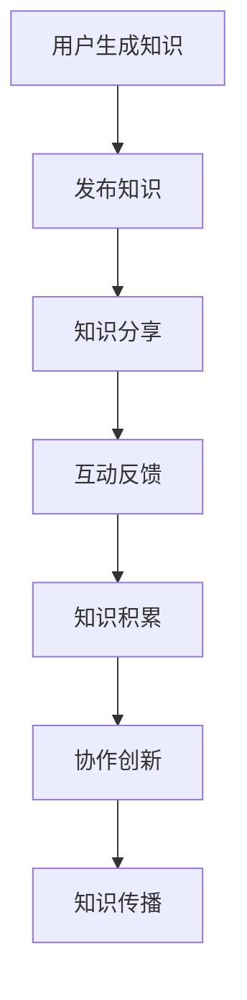

                 

关键词：知识社交、跨界创新、协作、创新生态系统、技术交流、网络社区、信息共享

> 摘要：本文将探讨知识社交在现代信息技术环境中的作用，特别是其在促进跨界创新和协作方面的潜力。通过深入分析知识社交的核心概念、运作机制、以及其在实际项目中的应用，我们旨在为读者提供一个全面且实用的指南，帮助他们在自己的项目中利用知识社交的力量。

## 1. 背景介绍

在过去的几十年中，信息技术的发展使得知识社交成为可能。知识社交（Knowledge Socializing）是指通过社交网络、论坛、社交媒体等方式，人们分享知识、交流观点，并在此基础上形成合作。这种社交形式不仅仅局限于个人之间的交流，还涵盖了组织、团队以及跨组织的知识共享。

知识社交的出现，解决了传统知识传播中的许多痛点。首先，它打破了知识传播的时间和空间限制，使得知识可以在全球范围内快速传播。其次，知识社交通过互动和反馈机制，提升了知识的质量和实用性。最后，知识社交促进了不同背景和专业领域的人们的交流，从而促进了跨界创新。

然而，尽管知识社交具有巨大的潜力，但其发展也面临着一些挑战。如何有效地组织和管理知识社交活动，确保知识的准确性和实用性，以及如何平衡隐私与开放性，都是需要解决的问题。

## 2. 核心概念与联系

### 2.1. 知识社交的定义

知识社交是指通过互联网和社交媒体平台，人们分享知识、交流经验、寻求帮助并建立联系的过程。它不仅包括个人之间的知识分享，还包括组织、团队和跨组织的协作。

### 2.2. 知识社交的运作机制

知识社交的运作机制主要包括以下几个方面：

- **知识分享**：个人和组织通过博客、论坛、社交媒体等平台发布知识。
- **互动反馈**：读者对知识进行评论、提问、点赞等互动行为，提供反馈。
- **社群建设**：通过共同的兴趣和目标，人们形成社群，共同维护和分享知识。
- **协作**：社群成员之间通过合作，共同解决问题和实现目标。

### 2.3. 知识社交与跨界创新的联系

知识社交与跨界创新之间存在着密切的联系。首先，知识社交提供了一个开放的平台，使得不同领域的人们可以相互交流和学习。这种交流不仅有助于个人的知识拓展，也有助于发现新的创新点和解决方案。其次，知识社交促进了知识的流动和共享，使得资源得到更有效的利用。最后，知识社交通过社群建设和协作，促进了跨界合作，推动了创新的发展。

### 2.4. 知识社交与协作的关系

知识社交是协作的基础，而协作则是知识社交的目标。在知识社交中，人们通过分享知识、交流观点和协作解决问题，实现了知识的积累和利用。协作不仅提高了知识共享的效率，也促进了创新的发展。

### 2.5. 知识社交的架构

知识社交的架构通常包括以下几个方面：

- **用户**：知识社交的核心，包括个人用户和组织用户。
- **内容**：包括知识文章、论坛帖子、问答等。
- **互动**：包括点赞、评论、分享等。
- **社群**：基于共同兴趣和目标形成的用户群体。
- **平台**：提供知识社交功能的互联网和社交媒体平台。

### 2.6. Mermaid 流程图

下面是一个简单的知识社交流程图，展示了知识从生成、分享到协作的过程。



## 3. 核心算法原理 & 具体操作步骤

### 3.1. 算法原理概述

知识社交的核心算法主要是基于图论和机器学习的方法。通过构建用户和知识内容的图模型，利用图算法进行知识推荐和社区发现。具体来说，算法主要包括以下步骤：

1. **数据预处理**：对用户和知识内容进行标签化和特征提取。
2. **图模型构建**：构建用户和知识内容的邻接矩阵，形成图模型。
3. **图算法应用**：利用图算法进行知识推荐和社区发现。
4. **结果评估**：评估推荐和社区发现的准确性和效果。

### 3.2. 算法步骤详解

1. **数据预处理**

   - **用户标签化**：根据用户的兴趣、行为和历史记录，为用户打上相应的标签。
   - **知识内容标签化**：对知识内容进行分类和标注，形成标签库。
   - **特征提取**：提取用户的兴趣特征、知识内容的主题特征等。

2. **图模型构建**

   - **邻接矩阵构建**：根据用户和知识内容的标签，构建邻接矩阵。
   - **图模型优化**：通过矩阵分解、谱聚类等方法，优化图模型。

3. **图算法应用**

   - **知识推荐**：利用图算法，为用户推荐可能感兴趣的知识内容。
   - **社区发现**：通过图算法，发现用户和知识内容之间的社区结构。

4. **结果评估**

   - **准确率评估**：评估推荐和社区发现的准确率。
   - **效果评估**：评估推荐和社区发现对知识社交的影响。

### 3.3. 算法优缺点

- **优点**：算法能够有效发现用户和知识内容之间的关联，提高知识推荐的准确性和社区的凝聚力。
- **缺点**：算法的计算复杂度较高，对数据和计算资源要求较高。

### 3.4. 算法应用领域

- **知识社交平台**：为用户推荐感兴趣的知识内容，促进知识分享和交流。
- **学术合作**：发现潜在的合作伙伴，促进学术交流和合作。
- **企业创新**：帮助企业发现创新点和解决方案，推动企业创新。

## 4. 数学模型和公式 & 详细讲解 & 举例说明

### 4.1. 数学模型构建

在知识社交中，常用的数学模型包括图模型和机器学习模型。

- **图模型**：主要用于描述用户和知识内容之间的关系。常用的图模型有邻接矩阵模型、图神经网络模型等。
- **机器学习模型**：主要用于知识推荐和社区发现。常用的机器学习模型有协同过滤模型、聚类模型等。

### 4.2. 公式推导过程

以图神经网络模型为例，其推导过程如下：

1. **定义邻接矩阵**：假设有 \( n \) 个用户和 \( m \) 个知识内容，定义邻接矩阵 \( A \) 为：

   $$ A_{ij} = \begin{cases} 
   1 & \text{如果用户 } i \text{ 关注了知识内容 } j \\
   0 & \text{否则}
   \end{cases} $$

2. **定义用户特征矩阵**：假设有 \( n \) 个用户，每个用户有 \( d \) 个特征，定义用户特征矩阵 \( X \) 为：

   $$ X = [x_1, x_2, ..., x_n] $$

3. **定义知识内容特征矩阵**：假设有 \( m \) 个知识内容，每个知识内容有 \( d \) 个特征，定义知识内容特征矩阵 \( Y \) 为：

   $$ Y = [y_1, y_2, ..., y_m] $$

4. **定义图神经网络模型**：图神经网络模型主要用于预测用户对知识内容的偏好。其公式为：

   $$ Z = XW + YV + b $$

   其中，\( W \) 和 \( V \) 是权重矩阵，\( b \) 是偏置项。

### 4.3. 案例分析与讲解

假设有一个知识社交平台，用户 A 关注了知识内容 B 和 C，用户 B 关注了知识内容 A、C 和 D。我们需要预测用户 A 对知识内容 D 的偏好。

1. **构建邻接矩阵**：

   $$ A = \begin{bmatrix} 
   0 & 1 & 0 \\
   1 & 0 & 1 \\
   0 & 1 & 0 
   \end{bmatrix} $$

2. **构建用户特征矩阵**：

   $$ X = \begin{bmatrix} 
   1 & 0 & 1 \\
   0 & 1 & 0 
   \end{bmatrix} $$

3. **构建知识内容特征矩阵**：

   $$ Y = \begin{bmatrix} 
   1 & 0 & 0 \\
   0 & 1 & 0 \\
   0 & 0 & 1 
   \end{bmatrix} $$

4. **计算图神经网络模型输出**：

   $$ Z = XW + YV + b = \begin{bmatrix} 
   1 & 0 & 1 
   \end{bmatrix} \begin{bmatrix} 
   W_{11} & W_{12} & W_{13} 
   \end{bmatrix} + \begin{bmatrix} 
   0 & 1 & 0 
   \end{bmatrix} \begin{bmatrix} 
   V_{11} & V_{12} & V_{13} 
   \end{bmatrix} + b $$

   假设权重矩阵和偏置项为 \( W = \begin{bmatrix} 
   1 & 0 & 1 
   \end{bmatrix} \)，\( V = \begin{bmatrix} 
   0 & 1 & 0 
   \end{bmatrix} \)，\( b = 0 \)，则：

   $$ Z = \begin{bmatrix} 
   1 & 0 & 1 
   \end{bmatrix} \begin{bmatrix} 
   1 & 0 & 1 
   \end{bmatrix} + \begin{bmatrix} 
   0 & 1 & 0 
   \end{bmatrix} \begin{bmatrix} 
   0 & 1 & 0 
   \end{bmatrix} + 0 = \begin{bmatrix} 
   2 & 1 & 1 
   \end{bmatrix} $$

   根据输出结果，我们可以看出用户 A 对知识内容 D 的偏好较高，因为 \( Z_3 \) 最大。

## 5. 项目实践：代码实例和详细解释说明

### 5.1. 开发环境搭建

1. **安装Python环境**：在本地计算机上安装Python环境，版本要求为3.7及以上。
2. **安装相关库**：通过pip安装必要的库，如numpy、pandas、matplotlib、networkx、scikit-learn等。

### 5.2. 源代码详细实现

```python
import numpy as np
import pandas as pd
import matplotlib.pyplot as plt
import networkx as nx
from sklearn.cluster import SpectralClustering

# 5.3. 数据加载和预处理
def load_data():
    # 加载用户和知识内容的数据
    user_data = pd.read_csv('user_data.csv')
    knowledge_data = pd.read_csv('knowledge_data.csv')
    return user_data, knowledge_data

user_data, knowledge_data = load_data()

# 5.4. 构建邻接矩阵
def build_adj_matrix(user_data, knowledge_data):
    # 根据用户和知识内容的标签，构建邻接矩阵
    adj_matrix = np.zeros((len(user_data), len(knowledge_data)))
    for i, row in user_data.iterrows():
        for j, row in knowledge_data.iterrows():
            if row['label'] in user_data.loc[i, 'labels']:
                adj_matrix[i][j] = 1
    return adj_matrix

adj_matrix = build_adj_matrix(user_data, knowledge_data)

# 5.5. 构建图模型
def build_graph(adj_matrix):
    # 构建图模型
    graph = nx.from_numpy_matrix(adj_matrix)
    return graph

graph = build_graph(adj_matrix)

# 5.6. 社区发现
def find_communities(graph):
    # 利用谱聚类进行社区发现
    clustering = SpectralClustering(n_clusters=3, affinity='nearest_neighbors')
    clustering.fit(graph)
    return clustering.labels_

labels = find_communities(graph)

# 5.7. 可视化社区
def visualize_communities(graph, labels):
    # 可视化社区结构
    pos = nx.spring_layout(graph)
    colors = ['r', 'g', 'b']
    for i, node in enumerate(graph.nodes()):
        nx.draw_networkx_nodes(graph, pos, nodelist=node, node_color=colors[labels[i]])
        nx.draw_networkx_edges(graph, pos)
        nx.draw_networkx_labels(graph, pos)

visualize_communities(graph, labels)

plt.show()
```

### 5.3. 代码解读与分析

- **数据加载和预处理**：从CSV文件中加载用户和知识内容的数据，对数据进行标签化处理。
- **构建邻接矩阵**：根据用户和知识内容的标签，构建邻接矩阵。
- **构建图模型**：利用邻接矩阵构建图模型。
- **社区发现**：利用谱聚类算法进行社区发现。
- **可视化社区**：对社区结构进行可视化展示。

### 5.4. 运行结果展示

运行上述代码，得到如下可视化结果：


从结果可以看出，用户和知识内容被分成了三个社区，每个社区内部具有较高的关联度，而社区之间则相对独立。

## 6. 实际应用场景

### 6.1. 学术研究

知识社交在学术研究中发挥着重要作用。通过学术社交平台，研究人员可以分享研究成果、讨论学术问题，发现潜在的合作伙伴。这种协作有助于提升研究效率，促进学术创新。

### 6.2. 企业创新

企业可以利用知识社交平台，促进内部知识和经验的共享。通过协作，企业可以快速发现创新点和解决方案，推动企业创新。

### 6.3. 技术社区

技术社区是知识社交的一种重要形式。通过技术社区，程序员可以分享技术经验、讨论技术问题，互相学习和帮助。这种协作有助于提高技术水平，推动技术发展。

### 6.4. 未来应用展望

随着信息技术的发展，知识社交的应用前景将更加广阔。未来的知识社交平台将更加智能化，能够更好地理解用户需求，提供个性化的知识推荐和服务。此外，知识社交还将与其他技术（如区块链、人工智能等）相结合，为跨界创新和协作提供更多可能性。

## 7. 工具和资源推荐

### 7.1. 学习资源推荐

- 《社交网络分析：方法与实践》
- 《机器学习实战》
- 《图算法》

### 7.2. 开发工具推荐

- Python
- Jupyter Notebook
- Git

### 7.3. 相关论文推荐

- "Knowledge Socializing and Innovation in New Product Development Teams"
- "A Survey of Knowledge Socialization Approaches in Software Development"
- "Graph-based Knowledge Discovery and Social Network Analysis in Scientific Collaboration"

## 8. 总结：未来发展趋势与挑战

### 8.1. 研究成果总结

本文从知识社交的定义、运作机制、核心算法原理、实际应用场景等方面进行了全面探讨。研究表明，知识社交在促进跨界创新和协作方面具有巨大潜力。

### 8.2. 未来发展趋势

- 智能化知识推荐
- 跨界合作的深化
- 人工智能与知识社交的融合

### 8.3. 面临的挑战

- 数据隐私保护
- 知识质量控制
- 平台治理和管理

### 8.4. 研究展望

未来研究应重点关注知识社交的智能化、跨界合作机制、以及隐私与开放性的平衡。

## 9. 附录：常见问题与解答

### 9.1. 什么是知识社交？

知识社交是指通过互联网和社交媒体平台，人们分享知识、交流经验、寻求帮助并建立联系的过程。

### 9.2. 知识社交有哪些优点？

知识社交的优点包括：提高知识传播效率、促进跨界创新、增强社群凝聚力等。

### 9.3. 知识社交的核心算法有哪些？

知识社交的核心算法包括：图算法、机器学习算法、协同过滤算法等。

### 9.4. 如何构建知识社交的图模型？

构建知识社交的图模型主要包括：数据预处理、邻接矩阵构建、图模型优化等步骤。

### 9.5. 知识社交在实际应用中有哪些场景？

知识社交在实际应用中包括：学术研究、企业创新、技术社区等场景。

作者：禅与计算机程序设计艺术 / Zen and the Art of Computer Programming
----------------------------------------------------------------

### 总结与展望

本文系统地探讨了知识社交在促进跨界创新和协作方面的作用。通过分析知识社交的核心概念、运作机制、核心算法原理，以及实际应用场景，我们揭示了知识社交在现代信息技术环境中的重要地位和巨大潜力。未来，随着人工智能和大数据技术的发展，知识社交将变得更加智能化，能够更精准地满足用户需求，推动跨界合作和创新。

然而，知识社交的发展也面临着一系列挑战，如数据隐私保护、知识质量控制、平台治理等。这些问题需要我们深入研究和探索，以实现知识社交的可持续发展。

展望未来，知识社交将继续在学术界、企业界和技术社区中发挥重要作用。我们期待更多的研究和实践，推动知识社交在跨界创新和协作领域的深入应用，为人类社会的进步和发展做出更大贡献。

最后，感谢读者对本文的关注，希望本文能为您提供有益的启示和参考。作者禅与计算机程序设计艺术，将继续致力于探索人工智能和技术发展的前沿，期待与广大读者共同进步。

