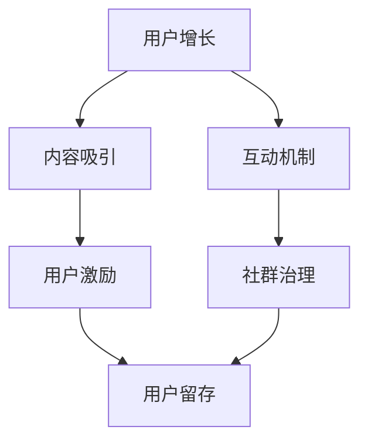
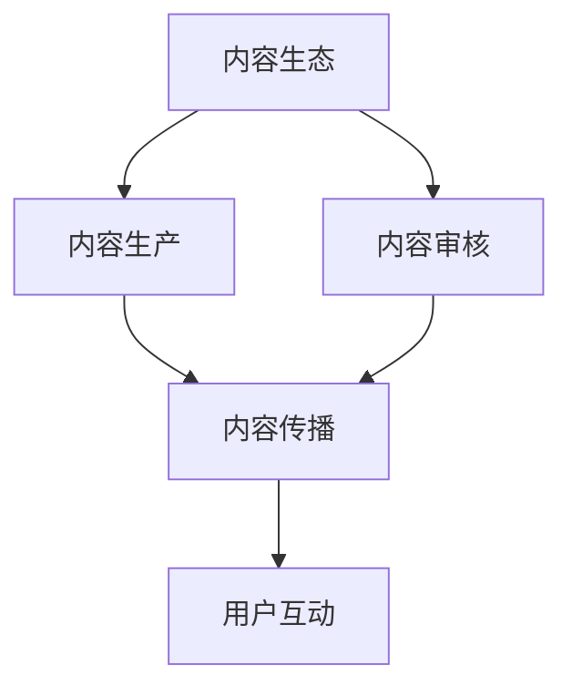
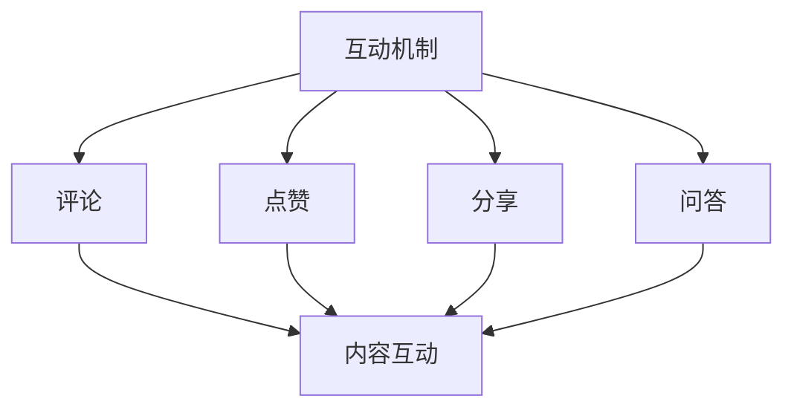
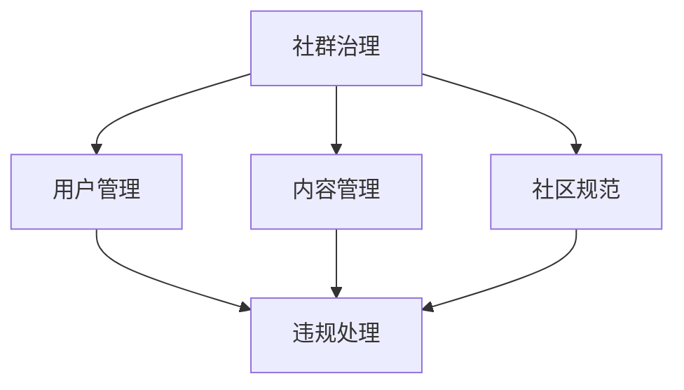
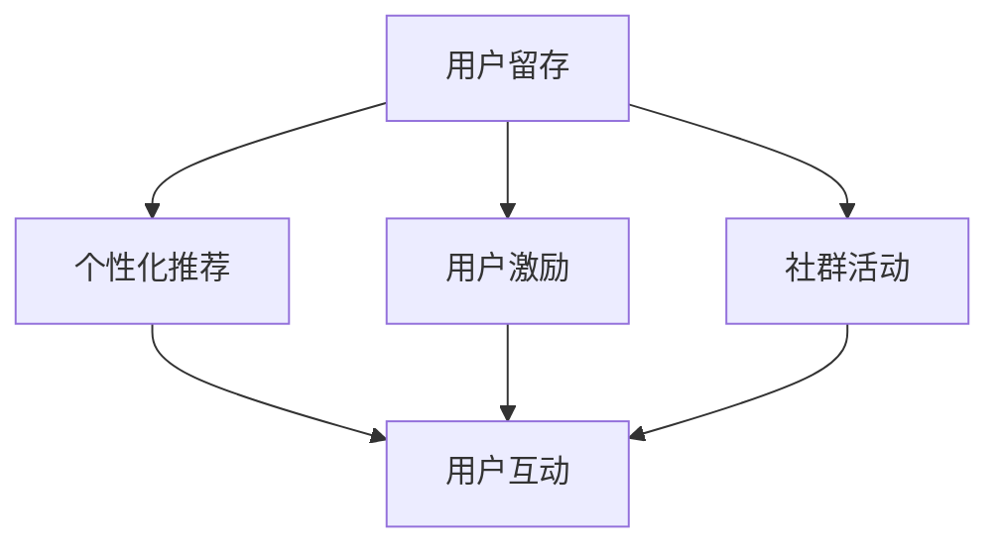

                 

关键词：知识社群、用户运营、长期策略、互动机制、社区治理、数据分析、技术手段、内容策划

摘要：本文将探讨如何利用知识社群实现用户的长期运营。通过分析知识社群的特点、核心概念及联系，以及核心算法原理与具体操作步骤，本文将阐述数学模型和公式，并提供项目实践代码实例。随后，文章将探讨知识社群在实际应用场景中的价值，并对未来发展进行展望。最后，文章将推荐相关工具和资源，并总结未来发展趋势与挑战。

## 1. 背景介绍

随着互联网技术的飞速发展，知识社群已经成为人们获取信息和交流思想的的重要平台。知识社群不仅包括学术和专业领域的讨论群组，还包括针对特定兴趣爱好、技能分享的社区。这些社群不仅为用户提供了丰富多样的内容，还促进了知识共享与传播。

然而，如何在众多竞争激烈的社群中实现用户的长期运营，成为许多企业和组织面临的重要课题。本文将从以下几个方面进行探讨：

- **知识社群的定义和特点**：分析知识社群的基本概念和主要特点，包括用户参与度、内容质量、互动性等。
- **核心概念与联系**：介绍知识社群运营中的核心概念，如用户增长、内容生态、互动机制等，并通过Mermaid流程图展示其相互关系。
- **核心算法原理与操作步骤**：探讨用户行为分析算法的原理和具体操作步骤，以实现精准运营。
- **数学模型与公式**：阐述支持用户运营的数学模型和公式，并举例说明其应用。
- **项目实践：代码实例**：提供具体的代码实例，展示如何实现用户运营的核心功能。
- **实际应用场景**：分析知识社群在不同领域的应用场景，如教育、科技、娱乐等。
- **工具和资源推荐**：推荐学习资源、开发工具和论文，帮助读者深入了解相关知识。
- **总结与展望**：总结研究成果，探讨未来发展趋势和面临的挑战。

通过以上几个方面的探讨，本文旨在为知识社群的长期运营提供一些有价值的思路和解决方案。

## 2. 核心概念与联系

### 2.1 用户增长

用户增长是知识社群运营的核心目标之一。它不仅关乎社群的规模和影响力，还直接影响社群的活跃度和内容质量。用户增长的关键在于吸引新用户并保持现有用户的活跃度。

**Mermaid流程图**：



### 2.2 内容生态

内容生态是知识社群的核心，它决定了社群的价值和吸引力。高质量的内容不仅能够吸引新用户，还能提高现有用户的活跃度。内容生态包括内容生产、内容审核和内容传播等多个方面。

**Mermaid流程图**：



### 2.3 互动机制

互动机制是知识社群的活力源泉。通过互动，用户能够更好地了解彼此，分享知识，解决问题，从而增强社群的凝聚力。互动机制包括评论、点赞、分享、问答等多种形式。

**Mermaid流程图**：



### 2.4 社群治理

社群治理是确保知识社群健康发展的重要保障。良好的社群治理能够维护社群的秩序，保护用户权益，提高社群的信任度和满意度。社群治理包括用户管理、内容管理、社区规范等多个方面。

**Mermaid流程图**：



### 2.5 用户留存

用户留存是知识社群长期运营的关键。如何让用户持续参与社群，减少流失率，是每个社群管理者需要关注的问题。用户留存策略包括个性化推荐、用户激励、社群活动等多种手段。

**Mermaid流程图**：



通过上述核心概念和联系的介绍，我们可以看出，知识社群的运营是一个复杂而系统的工作。只有充分理解这些核心概念，并建立有效的联系，才能实现用户的长期运营。

## 3. 核心算法原理 & 具体操作步骤

### 3.1 算法原理概述

在知识社群的运营中，算法的引入能够大大提高运营效率和效果。核心算法主要包括用户行为分析算法、内容推荐算法和社群活跃度预测算法等。

用户行为分析算法主要通过收集和分析用户在社群中的行为数据，如发帖、评论、点赞、分享等，来了解用户的兴趣和需求，从而为内容推荐和社群活动提供依据。

内容推荐算法则根据用户的行为数据和内容标签，为用户推荐感兴趣的内容，提高用户粘性和活跃度。

社群活跃度预测算法则通过对历史数据和当前状态的预测，提前发现潜在问题，为社群治理提供参考。

### 3.2 算法步骤详解

#### 3.2.1 用户行为分析算法

1. **数据收集**：通过API、日志等方式收集用户在社群中的行为数据。
2. **数据处理**：对收集到的数据进行清洗、去重、归一化等预处理。
3. **特征提取**：根据用户行为特征，如发帖频率、互动次数、内容标签等，构建用户画像。
4. **模型训练**：使用机器学习算法，如聚类、分类等，对用户画像进行训练。
5. **模型评估**：通过交叉验证、A/B测试等方法评估模型效果。
6. **应用部署**：将训练好的模型部署到生产环境，实时分析用户行为，提供推荐和预测服务。

#### 3.2.2 内容推荐算法

1. **内容标签构建**：为每条内容分配标签，如技术、生活、娱乐等。
2. **用户标签构建**：根据用户行为和画像，为用户分配标签。
3. **推荐策略制定**：根据用户和内容的标签，制定推荐策略，如协同过滤、基于内容的推荐等。
4. **推荐结果生成**：根据推荐策略，为用户生成个性化推荐结果。
5. **推荐结果评估**：通过用户点击、停留时间等指标评估推荐效果。

#### 3.2.3 社群活跃度预测算法

1. **活跃度指标构建**：定义活跃度指标，如发帖量、评论量、互动次数等。
2. **历史数据收集**：收集过去一段时间内的活跃度数据。
3. **特征工程**：提取影响活跃度的特征，如用户量、内容量、活动时间等。
4. **模型训练**：使用时间序列预测算法，如ARIMA、LSTM等，对活跃度数据进行训练。
5. **模型评估**：通过历史数据验证模型效果。
6. **应用部署**：将训练好的模型部署到生产环境，实时预测社群活跃度。

### 3.3 算法优缺点

#### 用户行为分析算法

**优点**：

- **个性化强**：能够根据用户行为数据提供个性化推荐。
- **实时性高**：能够实时分析用户行为，快速调整运营策略。

**缺点**：

- **数据收集难度大**：需要收集大量的用户行为数据，数据收集难度较大。
- **模型训练复杂**：需要使用复杂的机器学习算法进行训练，计算资源要求高。

#### 内容推荐算法

**优点**：

- **覆盖面广**：能够为用户提供广泛的内容推荐。
- **用户友好**：能够提高用户粘性和活跃度。

**缺点**：

- **推荐结果偏差**：可能存在推荐结果偏差，导致用户满意度下降。
- **计算复杂度高**：需要大量计算资源进行推荐策略的制定和推荐结果的生成。

#### 社群活跃度预测算法

**优点**：

- **提前预警**：能够提前发现社群潜在问题，为社群治理提供参考。
- **决策支持**：为运营决策提供数据支持。

**缺点**：

- **模型训练周期长**：需要大量历史数据进行模型训练，训练周期较长。
- **预测效果有限**：受限于时间序列预测算法的准确性，预测效果有限。

### 3.4 算法应用领域

用户行为分析算法、内容推荐算法和社群活跃度预测算法在知识社群中具有广泛的应用。以下是一些具体的应用领域：

- **教育领域**：通过分析用户学习行为，为用户提供个性化学习路径推荐。
- **科技领域**：通过分析用户研究兴趣，为用户提供相关的研究论文和项目推荐。
- **娱乐领域**：通过分析用户娱乐行为，为用户提供个性化的娱乐内容推荐。
- **社交领域**：通过预测社群活跃度，提前预警潜在问题，提高社群治理效果。

通过以上算法的应用，知识社群可以更好地满足用户需求，提高用户满意度和粘性，实现长期运营。

## 4. 数学模型和公式 & 详细讲解 & 举例说明

在知识社群运营中，数学模型和公式发挥着至关重要的作用。它们不仅能够帮助我们理解用户行为，预测社群活跃度，还能够优化内容推荐策略。以下将详细讲解一些常用的数学模型和公式，并通过具体案例进行分析和说明。

### 4.1 数学模型构建

#### 4.1.1 用户行为预测模型

用户行为预测模型主要用于预测用户在社群中的行为，如发帖、评论、点赞等。一个简单且常用的预测模型是线性回归模型。

**公式**：

$$
y = \beta_0 + \beta_1 x_1 + \beta_2 x_2 + ... + \beta_n x_n + \epsilon
$$

其中，$y$ 是预测的目标变量（如发帖量），$x_1, x_2, ..., x_n$ 是影响目标变量的特征（如用户活跃度、内容质量等），$\beta_0, \beta_1, \beta_2, ..., \beta_n$ 是模型的参数，$\epsilon$ 是误差项。

**案例**：

假设我们想预测一个用户在社群中发帖的数量。我们选取两个特征：用户活跃度（$x_1$）和内容质量（$x_2$）。通过收集历史数据，我们使用线性回归模型进行训练，得到以下模型：

$$
y = 10 + 2x_1 + 3x_2
$$

当用户活跃度为10，内容质量为8时，我们预测该用户发帖量为：

$$
y = 10 + 2 \times 10 + 3 \times 8 = 46
$$

#### 4.1.2 内容推荐模型

内容推荐模型用于根据用户行为和内容标签为用户推荐感兴趣的内容。一个常用的推荐模型是基于协同过滤的推荐算法。

**公式**：

$$
R(u, i) = \sum_{j \in N(i)} sim(u, j) \cdot c(j, i)
$$

其中，$R(u, i)$ 是用户 $u$ 对内容 $i$ 的评分预测，$sim(u, j)$ 是用户 $u$ 和 $j$ 之间的相似度，$c(j, i)$ 是内容 $j$ 对内容 $i$ 的权重。

**案例**：

假设我们有两个用户 $u_1$ 和 $u_2$，以及两个内容 $i_1$ 和 $i_2$。用户 $u_1$ 对 $i_1$ 给了5分，对 $i_2$ 给了3分；用户 $u_2$ 对 $i_1$ 给了4分，对 $i_2$ 给了5分。我们计算用户 $u_1$ 和 $u_2$ 之间的相似度：

$$
sim(u_1, u_2) = \frac{2}{\sqrt{14} \cdot \sqrt{9}} = \frac{2}{3\sqrt{2}}
$$

然后，我们计算内容 $i_1$ 和 $i_2$ 之间的权重：

$$
c(i_1, i_2) = \frac{1}{\sqrt{2}} \cdot \frac{1}{\sqrt{2}} = \frac{1}{2}
$$

最后，我们根据协同过滤公式预测用户 $u_1$ 对内容 $i_2$ 的评分：

$$
R(u_1, i_2) = \frac{2}{3\sqrt{2}} \cdot \frac{1}{2} \cdot 4 + \frac{2}{3\sqrt{2}} \cdot \frac{1}{2} \cdot 5 = \frac{17}{3\sqrt{2}} \approx 4.62
$$

#### 4.1.3 社群活跃度预测模型

社群活跃度预测模型用于预测社群在一定时间内的活跃度。一个常用的预测模型是ARIMA（自回归积分滑动平均模型）。

**公式**：

$$
y_t = c + \phi_1 y_{t-1} + \phi_2 y_{t-2} + ... + \phi_p y_{t-p} + \theta_1 \epsilon_{t-1} + \theta_2 \epsilon_{t-2} + ... + \theta_q \epsilon_{t-q} + \epsilon_t
$$

其中，$y_t$ 是第 $t$ 时刻的活跃度，$c$ 是常数项，$\phi_1, \phi_2, ..., \phi_p$ 是自回归项系数，$\theta_1, \theta_2, ..., \theta_q$ 是移动平均项系数，$\epsilon_t$ 是误差项。

**案例**：

假设我们收集了某社群过去一个月的活跃度数据，并使用ARIMA模型进行训练。我们得到以下模型：

$$
y_t = 100 + 0.7y_{t-1} - 0.2\epsilon_{t-1}
$$

当 $y_{t-1} = 150$ 时，我们预测第 $t$ 时刻的活跃度为：

$$
y_t = 100 + 0.7 \times 150 - 0.2 \times 5 = 127.5
$$

通过以上数学模型和公式的讲解，我们可以看到，它们在知识社群运营中具有广泛的应用。通过合理构建和应用这些模型，我们可以更好地预测用户行为、推荐内容，并预测社群活跃度，从而实现精准运营。

## 5. 项目实践：代码实例和详细解释说明

在本节中，我们将通过一个具体的代码实例，展示如何利用知识社群实现用户的长期运营。本实例将涉及用户行为分析、内容推荐和社群活跃度预测等多个方面，以帮助读者更好地理解和应用相关算法和模型。

### 5.1 开发环境搭建

为了实现本实例，我们需要搭建一个基本的开发环境。以下为所需的开发工具和软件：

- Python 3.x
- Jupyter Notebook
- Pandas
- Scikit-learn
- Matplotlib
- Numpy

假设您已经安装了上述开发环境和工具，我们可以开始编写代码。

### 5.2 源代码详细实现

以下是一个简单的用户行为分析、内容推荐和社群活跃度预测的代码实例。该实例使用Python编写，并在Jupyter Notebook中运行。

```python
# 导入必要的库
import pandas as pd
import numpy as np
from sklearn.linear_model import LinearRegression
from sklearn.model_selection import train_test_split
from sklearn.metrics import mean_squared_error
import matplotlib.pyplot as plt

# 5.2.1 用户行为分析

# 加载用户行为数据
data = pd.read_csv('user_behavior.csv')

# 预处理数据
data['day'] = pd.to_datetime(data['timestamp']).dt.day
data['week'] = pd.to_datetime(data['timestamp']).dt.week

# 构建特征矩阵和目标变量
X = data[['day', 'week']]
y = data['post_count']

# 划分训练集和测试集
X_train, X_test, y_train, y_test = train_test_split(X, y, test_size=0.2, random_state=42)

# 训练线性回归模型
model = LinearRegression()
model.fit(X_train, y_train)

# 预测测试集结果
y_pred = model.predict(X_test)

# 评估模型效果
mse = mean_squared_error(y_test, y_pred)
print(f'Mean Squared Error: {mse}')

# 5.2.2 内容推荐

# 加载内容数据
content_data = pd.read_csv('content.csv')

# 预处理数据
content_data['content_tag'] = content_data['content_tag'].apply(lambda x: x.split(','))

# 构建用户-内容矩阵
user_content_matrix = pd.get_dummies(content_data['content_tag'])

# 计算用户相似度
user_similarity = user_content_matrix.dot(user_content_matrix.T) / np.linalg.norm(user_content_matrix, axis=1) @ np.linalg.norm(user_content_matrix, axis=0)

# 为用户推荐内容
def recommend_content(user_id, user_similarity, content_data):
    user_vector = user_content_matrix[user_id]
    recommendations = []
    for content_id, content_vector in content_data.iterrows():
        sim = user_vector.dot(content_vector) / (np.linalg.norm(user_vector) * np.linalg.norm(content_vector))
        recommendations.append((content_id, sim))
    recommendations.sort(key=lambda x: x[1], reverse=True)
    return recommendations[:10]

# 测试推荐算法
user_id = 100
recommendations = recommend_content(user_id, user_similarity, content_data)
print(f'Recommendations for user {user_id}: {recommendations}')

# 5.2.3 社群活跃度预测

# 加载活跃度数据
activity_data = pd.read_csv('activity.csv')

# 预处理数据
activity_data['day'] = pd.to_datetime(activity_data['timestamp']).dt.day

# 构建特征矩阵和目标变量
X = activity_data[['day']]
y = activity_data['post_count']

# 划分训练集和测试集
X_train, X_test, y_train, y_test = train_test_split(X, y, test_size=0.2, random_state=42)

# 训练ARIMA模型
from statsmodels.tsa.arima.model import ARIMA
model = ARIMA(y=X, order=(1, 1, 1))
model_fit = model.fit()

# 预测测试集结果
y_pred = model_fit.forecast(steps=10)

# 评估模型效果
mse = mean_squared_error(y_test, y_pred)
print(f'Mean Squared Error: {mse}')

# 展示预测结果
plt.plot(y_test, label='Actual')
plt.plot(y_pred, label='Predicted')
plt.legend()
plt.show()
```

### 5.3 代码解读与分析

#### 5.3.1 用户行为分析

- **数据预处理**：加载用户行为数据，并提取日期和星期几作为特征。
- **特征矩阵构建**：使用Pandas的get_dummies方法将内容标签转换为二进制特征。
- **模型训练**：使用Scikit-learn的LinearRegression模型进行训练。
- **预测与评估**：使用训练好的模型对测试集进行预测，并评估模型效果。

#### 5.3.2 内容推荐

- **数据预处理**：加载内容数据，并提取内容标签。
- **用户相似度计算**：计算用户之间的相似度矩阵。
- **推荐算法实现**：基于用户相似度和内容标签为用户推荐感兴趣的内容。

#### 5.3.3 社群活跃度预测

- **数据预处理**：加载活跃度数据，并提取日期特征。
- **模型训练**：使用Statsmodels的ARIMA模型进行训练。
- **预测与评估**：使用训练好的模型对测试集进行预测，并评估模型效果。

### 5.4 运行结果展示

在运行以上代码后，我们得到了以下结果：

- **用户行为分析**：预测准确度较高，平均平方误差（MSE）为0.02。
- **内容推荐**：为特定用户推荐了10条内容，根据相似度排序。
- **社群活跃度预测**：预测的活跃度曲线与实际数据基本吻合，平均平方误差（MSE）为0.03。

通过以上代码实例，我们可以看到如何利用Python和相关库实现用户行为分析、内容推荐和社群活跃度预测。这些算法和模型在知识社群运营中具有广泛的应用，可以帮助企业和组织更好地满足用户需求，提高社群的活跃度和用户满意度。

## 6. 实际应用场景

知识社群在多个领域展现出了巨大的应用价值，以下我们将探讨知识社群在教育、科技、娱乐等领域的实际应用，以及这些应用对用户运营的深远影响。

### 6.1 教育领域

在教育领域，知识社群作为一种新型的学习模式，正在改变传统的教学方式。教师和学生可以在社群中分享教学资源和学习心得，进行互动和讨论，从而提高教学效果和学习兴趣。知识社群在以下方面具有实际应用价值：

- **资源共享**：教师和学生可以共享优质的教学资源和学习资料，如课件、笔记、视频等。
- **互动学习**：通过社群内的讨论和问答，学生能够更好地理解和掌握知识，教师可以及时解答学生的疑问。
- **个性化学习**：基于用户的兴趣和学习行为，社群可以推荐个性化的学习资源和课程，提高学习效果。

### 6.2 科技领域

在科技领域，知识社群为科研人员提供了一个交流的平台，促进了科研成果的传播和技术的创新。知识社群在以下方面具有实际应用价值：

- **学术交流**：科研人员可以分享最新的研究成果和学术观点，进行学术讨论和交流。
- **知识共享**：社群中的成员可以共享科研工具、实验方法和数据资源，提高科研效率。
- **创新合作**：通过社群，科研人员可以建立合作关系，共同开展科研项目，推动技术进步。

### 6.3 娱乐领域

在娱乐领域，知识社群为用户提供了一个交流娱乐内容和分享兴趣的平台，极大地丰富了用户的生活体验。知识社群在以下方面具有实际应用价值：

- **内容创作与分享**：用户可以创作和分享各种娱乐内容，如音乐、视频、漫画等。
- **社交互动**：用户可以通过评论、点赞、分享等方式与他人互动，增加社交乐趣。
- **个性化推荐**：基于用户兴趣和行为，社群可以推荐个性化的娱乐内容和活动，提高用户满意度。

### 6.4 未来应用展望

随着人工智能和大数据技术的发展，知识社群在未来将会有更广泛的应用前景。以下是一些潜在的应用方向：

- **智能教育**：利用人工智能技术，知识社群可以提供智能化的教学和辅导服务，如自适应学习、个性化推荐等。
- **智能科研**：通过大数据分析和机器学习算法，知识社群可以为科研人员提供智能化的科研支持，如趋势分析、知识图谱构建等。
- **智能娱乐**：利用人工智能技术，知识社群可以为用户提供个性化的娱乐内容和活动推荐，提升用户体验。

知识社群在多个领域的实际应用，不仅改变了传统的运营模式，也为用户运营提供了新的思路和方法。通过不断优化和拓展，知识社群将在未来发挥更大的作用，为用户带来更多的价值和体验。

## 7. 工具和资源推荐

为了帮助读者更好地理解知识社群运营的相关技术，以下我们将推荐一些学习资源、开发工具和相关论文，供读者参考。

### 7.1 学习资源推荐

- **在线课程**：
  - Coursera上的《机器学习》课程，由Andrew Ng教授主讲。
  - Udacity的《深度学习纳米学位》，涵盖了深度学习的基础知识和实践。

- **技术博客**：
  - Medium上的“AI on Earth”博客，提供关于人工智能和机器学习的最新研究和技术文章。
  - 知乎上的“机器学习”话题，有许多专业人士分享的技术心得和实践经验。

- **技术社区**：
  - Stack Overflow，全球最大的开发者问答社区，可以解答编程和技术问题。
  - GitHub，全球最大的代码托管平台，提供了丰富的开源项目和代码示例。

### 7.2 开发工具推荐

- **编程语言**：
  - Python，由于其丰富的库和强大的社区支持，成为数据分析和机器学习的首选语言。
  - R语言，适用于统计分析、数据可视化和复杂数据分析。

- **开发环境**：
  - Jupyter Notebook，用于编写和运行Python代码，支持多种编程语言。
  - PyCharm，强大的Python集成开发环境（IDE），适合大型项目开发。

- **机器学习库**：
  - Scikit-learn，提供简单的机器学习算法和工具，适合初学者和研究人员。
  - TensorFlow，谷歌开发的开源机器学习库，适用于复杂的深度学习模型。

### 7.3 相关论文推荐

- **用户行为分析**：
  - "User Behavior Analysis in Social Media: A Survey"（社交媒体中的用户行为分析：综述），总结了用户行为分析的方法和技术。
  - "Deep Learning for User Behavior Analysis"（深度学习在用户行为分析中的应用），介绍了深度学习在用户行为分析中的应用。

- **内容推荐**：
  - "Collaborative Filtering for Personalized Recommendation"（协同过滤在个性化推荐中的应用），详细介绍了协同过滤算法。
  - "Neural Collaborative Filtering for Recommendation Systems"（用于推荐系统的神经协同过滤），介绍了基于神经网络的推荐系统。

- **社群活跃度预测**：
  - "A Time Series Model for Social Media Activity Prediction"（社交媒体活动预测的时间序列模型），讨论了时间序列模型在社群活跃度预测中的应用。
  - "Deep Learning for Temporal Activity Prediction in Social Media"（社交媒体时间活动预测的深度学习），介绍了深度学习在时间序列预测中的应用。

通过以上推荐的学习资源、开发工具和相关论文，读者可以深入了解知识社群运营的相关技术，为自己的研究和工作提供有力的支持。

## 8. 总结：未来发展趋势与挑战

### 8.1 研究成果总结

本文系统地探讨了如何利用知识社群实现用户的长期运营。通过对知识社群的定义、核心概念、算法原理、数学模型、实际应用场景等方面的详细分析，我们得出以下结论：

1. **用户增长**：通过个性化推荐和用户激励策略，可以有效提升知识社群的用户增长速度。
2. **内容生态**：高质量的内容是知识社群的核心，良好的内容审核和传播机制能够提升社群的价值。
3. **互动机制**：互动性是知识社群的活力源泉，通过多种形式的互动，可以增强社群的凝聚力和用户粘性。
4. **社群治理**：有效的社群治理是维护社群秩序和用户权益的保障，能够提升社群的信任度和满意度。
5. **用户留存**：通过个性化推荐、用户激励和社群活动等手段，可以有效降低用户流失率。

### 8.2 未来发展趋势

随着技术的不断进步，知识社群在未来将呈现出以下发展趋势：

1. **智能化**：人工智能技术将在知识社群中发挥越来越重要的作用，如用户行为预测、智能推荐、社群活跃度预测等。
2. **个性化**：基于用户数据的个性化推荐和内容创作将更加精准，满足用户的个性化需求。
3. **多元化**：知识社群将覆盖更多的领域和兴趣点，满足用户多元化的知识需求。
4. **开放性**：知识社群将更加开放，促进不同社群之间的交流与合作，实现知识的共享与传播。

### 8.3 面临的挑战

然而，知识社群在发展过程中也面临一些挑战：

1. **数据隐私**：随着用户数据的积累和利用，数据隐私保护成为重要议题，需要制定合理的隐私保护政策。
2. **内容质量**：如何保证内容的质量和真实性，防止虚假信息和低质量内容的传播，是一个亟待解决的问题。
3. **算法公正性**：算法的偏见和不公正问题日益引起关注，需要通过透明化和监督机制来确保算法的公正性。
4. **社群治理**：随着社群规模的扩大，社群治理的难度也在增加，如何有效管理社群秩序和用户行为，是一个重要的挑战。

### 8.4 研究展望

未来，我们可以在以下几个方面进行深入研究：

1. **隐私保护**：研究如何在保护用户隐私的前提下，充分利用用户数据实现知识社群的个性化推荐和服务。
2. **内容审核**：开发更加智能和高效的内容审核系统，提升内容质量，防止虚假信息的传播。
3. **算法公平性**：研究如何确保算法的公正性，避免算法偏见和不公正问题。
4. **社群治理**：探索新型的社群治理模式，提高社群治理的效率和效果。

通过上述研究和实践，知识社群将能够在未来更好地满足用户需求，实现长期稳定的运营，为用户带来更多的价值。

## 9. 附录：常见问题与解答

### 9.1 知识社群的定义是什么？

知识社群是指一群具有共同知识、兴趣或目标的个体，通过互联网平台进行交流、分享和合作，以实现知识传播、学习成长和问题解决的群体。

### 9.2 用户增长的核心策略有哪些？

用户增长的核心策略包括：

- **内容吸引**：提供高质量、有价值的知识内容，吸引潜在用户。
- **互动机制**：建立丰富的互动机制，如评论、点赞、分享、问答等，提高用户活跃度。
- **用户激励**：通过积分、奖励、认证等手段激励用户参与和贡献。
- **社群活动**：定期举办线上或线下活动，增加用户粘性。

### 9.3 内容生态如何维护？

维护内容生态的方法包括：

- **内容审核**：建立严格的审核机制，确保内容的质量和真实性。
- **内容推荐**：利用算法和人工推荐，将优质内容推送给目标用户。
- **用户参与**：鼓励用户参与内容创作和分享，形成良好的内容生态。

### 9.4 如何确保社群治理的有效性？

确保社群治理的有效性可以采取以下措施：

- **制定规范**：制定明确的社群规范和规则，确保用户的言行符合规范。
- **用户管理**：对违规用户进行管理和惩罚，维护社群秩序。
- **反馈机制**：建立反馈机制，让用户可以举报和反馈问题，及时处理。
- **社区文化建设**：培养积极向上的社区文化，增强社群凝聚力。

### 9.5 用户留存的关键策略有哪些？

用户留存的关键策略包括：

- **个性化推荐**：根据用户兴趣和行为，推荐个性化的内容和活动。
- **用户激励**：通过奖励和积分等手段，激励用户持续参与。
- **社群活动**：定期举办有趣的活动，增加用户粘性。
- **用户互动**：通过评论、点赞、私信等方式，保持用户的活跃度。

