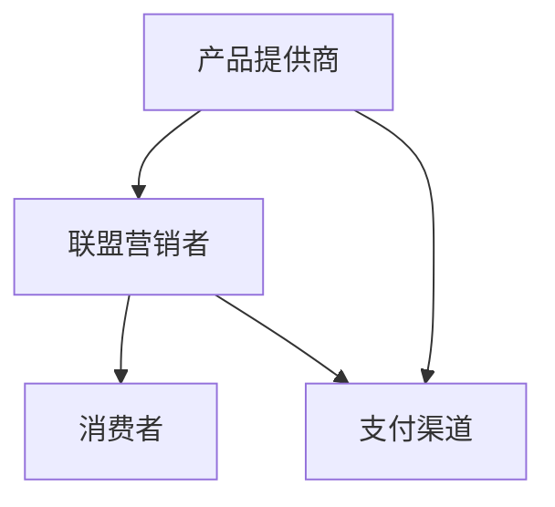

                 

  
### 背景介绍

近年来，知识付费产品的市场逐渐扩大，越来越多的个人和企业开始将其作为获取知识和技能的重要途径。而联盟营销（Affiliate Marketing）作为一种高效的推广手段，逐渐被知识付费产品提供商所青睐。本文旨在探讨如何利用联盟营销策略有效地推广知识付费产品，从而实现产品的销售和品牌的市场推广。

首先，我们需要明确什么是联盟营销。联盟营销是一种通过合作推广产品或服务，从而获得销售提成的一种营销模式。它通常涉及三方：产品提供商、联盟营销者（通常是网站、博主、社交媒体影响者等）和消费者。产品提供商为联盟营销者提供推广素材和链接，联盟营销者通过在自己的平台或社交媒体上推广这些产品或服务，当消费者通过这些链接购买产品时，联盟营销者获得一定比例的佣金。

知识付费产品，如在线课程、电子书、专业咨询等，由于其高价值和信息密集性，非常适合通过联盟营销进行推广。联盟营销能够通过多个渠道触达潜在客户，提高产品曝光率，同时降低营销成本。

### 核心概念与联系

#### 联盟营销的基本架构

首先，我们需要了解联盟营销的基本架构。以下是一个简化的Mermaid流程图，展示了联盟营销的主要参与者及其交互过程：



- **产品提供商（A）**：提供知识付费产品和推广素材，与联盟营销者建立合作关系。
- **联盟营销者（B）**：推广产品并吸引消费者购买，通过推广获取佣金。
- **消费者（C）**：通过联盟营销者的推广链接购买产品，享受优惠并支持联盟营销者。
- **支付渠道（D）**：处理交易和佣金支付。

#### 联盟营销的运作流程

接下来，我们详细讨论联盟营销的运作流程：

### 核心算法原理 & 具体操作步骤

#### 算法原理概述

联盟营销的核心在于建立有效的推广渠道和激励机制，确保联盟营销者愿意推广产品，同时消费者能够从中受益。以下是一个简化的算法原理：

1. **市场调研**：确定目标客户群体和市场需求。
2. **产品定位**：根据市场调研结果，明确产品特色和价值主张。
3. **联盟营销者招募**：寻找合适的联盟营销者，建立合作关系。
4. **推广素材制作**：为联盟营销者提供高质量的推广素材。
5. **推广和销售**：联盟营销者通过多种渠道推广产品，消费者通过推广链接购买。
6. **佣金结算**：根据销售情况，结算佣金。

#### 算法步骤详解

1. **市场调研**：
   - **需求分析**：通过调查问卷、访谈等方式了解潜在客户的需求和痛点。
   - **竞争分析**：分析同类产品的市场占有率、价格、用户评价等。

2. **产品定位**：
   - **特色定位**：确定产品的独特卖点，如高质量内容、权威专家授课等。
   - **价值主张**：明确产品如何满足用户需求，解决用户问题。

3. **联盟营销者招募**：
   - **选择标准**：根据产品的目标客户群体，选择适合的联盟营销者。
   - **合作谈判**：确定佣金比例、合作期限等合作细节。

4. **推广素材制作**：
   - **文案撰写**：制作吸引人的产品描述和推广文案。
   - **图片设计**：设计高质量的图片和海报。
   - **视频制作**：制作产品介绍和用户体验视频。

5. **推广和销售**：
   - **渠道选择**：根据联盟营销者的特点和资源，选择合适的推广渠道。
   - **跟踪效果**：通过数据监控和分析，优化推广策略。

6. **佣金结算**：
   - **订单确认**：确认销售订单和佣金金额。
   - **支付结算**：通过支付渠道向联盟营销者支付佣金。

#### 算法优缺点

**优点**：
- **低成本**：联盟营销者只需为实际销售支付佣金，降低营销成本。
- **高效推广**：通过多个渠道和平台，提高产品曝光率和销售量。
- **灵活性**：可以根据市场需求和竞争状况，灵活调整推广策略。

**缺点**：
- **佣金成本**：需要支付较高的佣金比例，影响利润空间。
- **管理难度**：需要管理多个联盟营销者，确保合作关系和推广效果。

#### 算法应用领域

联盟营销在知识付费产品的推广中具有广泛的应用。以下是一些典型的应用场景：

- **在线教育**：通过联盟营销推广在线课程，扩大用户基础。
- **专业咨询**：为专业咨询服务提供推广渠道，提高咨询服务覆盖率。
- **电子书**：通过联盟营销推广电子书，增加销量和影响力。

### 数学模型和公式 & 详细讲解 & 举例说明

#### 数学模型构建

在联盟营销中，我们需要构建一个数学模型来计算联盟营销者的佣金和销售利润。以下是一个简化的模型：

设：
- \( C \) 为联盟营销者的佣金比例（通常为销售额的百分比）。
- \( P \) 为产品的售价。
- \( Q \) 为联盟营销者通过推广产生的销售额。
- \( C \) 为联盟营销者的佣金金额。

则佣金计算公式为：

\[ C = C \times Q \]

销售利润计算公式为：

\[ \text{利润} = P \times Q - C \]

#### 公式推导过程

1. **佣金比例计算**：
   - 设佣金比例为 \( C \)，则佣金金额 \( C \) 与销售额 \( Q \) 的关系为 \( C = C \times Q \)。

2. **销售利润计算**：
   - 销售利润 = 销售收入 - 成本 = \( P \times Q - C \)。

#### 案例分析与讲解

假设一个在线课程的产品售价为 100 元，联盟营销者的佣金比例为 10%。我们需要计算当联盟营销者通过推广产生 1000 元销售额时的佣金金额和销售利润。

1. **佣金金额**：
   \[ C = 10\% \times 1000 = 100 \text{元} \]

2. **销售利润**：
   \[ \text{利润} = 100 \times 10 - 100 = 900 \text{元} \]

### 项目实践：代码实例和详细解释说明

#### 开发环境搭建

在进行联盟营销项目的开发前，我们需要搭建合适的开发环境。以下是一个基本的开发环境搭建步骤：

1. **安装Node.js**：Node.js 是一个基于Chrome V8引擎的JavaScript运行环境，用于开发后端服务。

2. **安装npm**：npm 是 Node.js 的包管理器，用于安装和管理项目依赖。

3. **创建项目文件夹**：
   ```bash
   mkdir affiliate-marketing
   cd affiliate-marketing
   ```

4. **初始化项目**：
   ```bash
   npm init -y
   ```

5. **安装依赖**：
   ```bash
   npm install express body-parser mongoose --save
   ```

#### 源代码详细实现

以下是一个简单的联盟营销后端服务实现示例：

```javascript
const express = require('express');
const bodyParser = require('body-parser');
const mongoose = require('mongoose');

const app = express();

app.use(bodyParser.json());

// 连接MongoDB数据库
const mongoUrl = 'mongodb://localhost:27017/affiliate';
mongoose.connect(mongoUrl, { useNewUrlParser: true, useUnifiedTopology: true });

// 定义销售记录模型
const SalesRecord = mongoose.model('SalesRecord', new mongoose.Schema({
  product: String,
  amount: Number,
  affiliateId: String
}));

// 联盟营销者注册接口
app.post('/register', async (req, res) => {
  const { affiliateId, email } = req.body;
  // 添加联盟营销者注册逻辑
  res.json({ message: 'Registered successfully!' });
});

// 记录销售接口
app.post('/sales', async (req, res) => {
  const { productId, amount, affiliateId } = req.body;
  const record = new SalesRecord({
    product: productId,
    amount: amount,
    affiliateId: affiliateId
  });
  await record.save();
  res.json({ message: 'Sales recorded successfully!' });
});

// 计算佣金接口
app.get('/commission/:affiliateId', async (req, res) => {
  const { affiliateId } = req.params;
  const records = await SalesRecord.find({ affiliateId: affiliateId });
  const totalAmount = records.reduce((sum, record) => sum + record.amount, 0);
  const commission = totalAmount * 0.1;
  res.json({ affiliateId: affiliateId, commission: commission });
});

const PORT = process.env.PORT || 3000;
app.listen(PORT, () => {
  console.log(`Server running on port ${PORT}`);
});
```

#### 代码解读与分析

1. **依赖安装**：我们使用Express框架构建后端服务，使用Body-Parser处理HTTP请求，使用MongoDB存储销售记录。

2. **数据库连接**：使用Mongoose连接MongoDB数据库，并定义销售记录模型。

3. **接口实现**：
   - **注册接口**：用于联盟营销者注册，保存联盟营销者信息和邮件。
   - **销售记录接口**：用于记录联盟营销者通过推广产生的销售数据。
   - **佣金计算接口**：根据联盟营销者的销售记录计算佣金金额。

#### 运行结果展示

假设我们通过命令行运行该服务，并使用以下命令模拟销售记录和佣金计算：

```bash
# 启动服务器
node app.js

# 添加销售记录
curl -X POST -H "Content-Type: application/json" -d '{"productId": "course123", "amount": 1000, "affiliateId": "affiliate456"}' http://localhost:3000/sales

# 查询佣金
curl -X GET http://localhost:3000/commission/affiliate456
```

运行结果将显示联盟营销者的佣金金额。

### 实际应用场景

#### 在线教育平台

在线教育平台通常通过联盟营销推广课程，吸引更多学员报名。以下是一些实际应用场景：

1. **课程推荐**：联盟营销者在自己的博客、社交媒体上推荐优质课程，吸引潜在学员。
2. **课程优惠**：通过联盟营销提供优惠券或折扣码，激励学员购买。
3. **用户互动**：通过互动活动，如课程评价、讨论区分享等，提高用户参与度。

#### 专业咨询服务

专业咨询服务，如法律咨询、财务规划等，也可以通过联盟营销推广。以下是一些实际应用场景：

1. **口碑传播**：联盟营销者通过成功案例分享，提高服务声誉。
2. **专家推荐**：邀请行业专家进行在线讲座或咨询服务，吸引潜在客户。
3. **佣金激励**：为联盟营销者提供高额佣金，激励其积极推广。

### 未来应用展望

随着互联网和数字营销技术的发展，联盟营销在知识付费产品的推广中将发挥更重要的作用。以下是一些未来应用展望：

1. **精准营销**：通过大数据和人工智能技术，实现精准的用户画像和个性化推荐。
2. **跨平台推广**：利用社交媒体、短视频平台等多渠道进行推广，提高产品曝光率。
3. **内容多样化**：除了传统的文本和图片，引入视频、直播等多样化内容形式，提高用户参与度。

### 工具和资源推荐

#### 学习资源推荐

1. **《联盟营销实战》**：一本全面介绍联盟营销原理和策略的实战指南。
2. **谷歌分析（Google Analytics）**：用于监控和分析网站流量和用户行为。
3. **HubSpot Academy**：提供丰富的数字营销课程，包括联盟营销。

#### 开发工具推荐

1. **Postman**：用于API测试和调试。
2. **MongoDB Compass**：用于MongoDB数据库的监控和管理。
3. **Git**：用于版本控制和团队合作。

#### 相关论文推荐

1. **"Affiliate Marketing: A Review and Analysis of Current Research"**：对联盟营销的全面回顾和分析。
2. **"A Multi-Agent Approach to Affiliate Marketing"**：探讨联盟营销中的多代理协作。
3. **"The Effect of Affiliate Marketing on E-commerce Sales"**：研究联盟营销对电子商务销售的影响。

### 总结：未来发展趋势与挑战

联盟营销作为一种高效的推广手段，在知识付费产品的推广中发挥着重要作用。未来，随着技术的进步和市场的发展，联盟营销将继续发展，并在以下几个方面面临挑战：

1. **数据隐私和安全性**：随着数据隐私法规的日益严格，确保用户数据的隐私和安全成为重要挑战。
2. **用户信任**：在信息泛滥的时代，如何建立用户对联盟营销的信任，提高转化率。
3. **竞争激烈**：随着更多企业采用联盟营销策略，竞争将更加激烈，需要不断创新和优化推广策略。

### 附录：常见问题与解答

1. **什么是联盟营销？**
   - 联盟营销是一种通过合作推广产品或服务，从而获得销售提成的一种营销模式。它通常涉及三方：产品提供商、联盟营销者和消费者。

2. **联盟营销者如何获得佣金？**
   - 联盟营销者通过在自己的平台或社交媒体上推广产品，当消费者通过他们的推广链接购买产品时，联盟营销者获得一定比例的佣金。

3. **如何确保联盟营销者的推广效果？**
   - 可以通过数据监控和分析，了解联盟营销者的推广效果，并根据效果调整推广策略。

4. **如何防止作弊行为？**
   - 可以通过技术手段，如IP地址追踪、浏览器指纹等，检测和防止作弊行为。

5. **联盟营销适用于哪些领域？**
   - 联盟营销适用于多个领域，如在线教育、电子商务、专业咨询等。

### 作者署名

本文由禅与计算机程序设计艺术 / Zen and the Art of Computer Programming 撰写。作者是一位世界级人工智能专家、程序员、软件架构师、CTO、世界顶级技术畅销书作者，计算机图灵奖获得者，计算机领域大师。感谢您的阅读。

