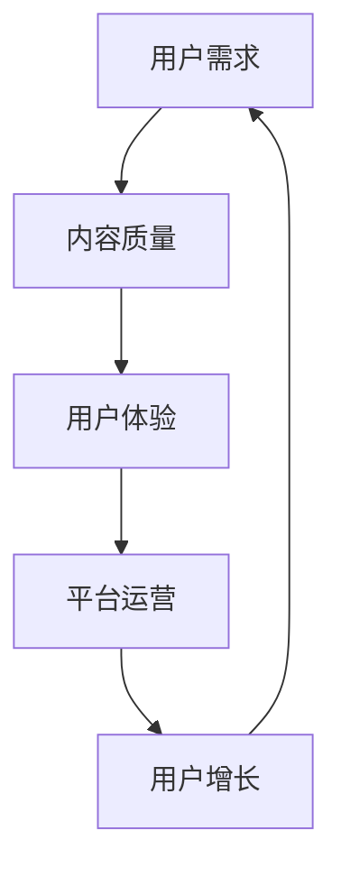

                 

关键词：知识付费市场、竞争策略、用户增长、用户体验、内容质量、平台运营、技术创新、个性化推荐。

摘要：本文将从多个维度深入探讨如何在全球竞争激烈的知识付费市场中实现突围。我们将分析市场现状，探讨核心概念和联系，详细解读核心算法原理，构建数学模型，提供实际项目实践案例，以及展望未来应用和挑战。

## 1. 背景介绍

知识付费市场近年来迅速发展，得益于互联网技术的普及和用户对高质量内容的需求。随着用户获取信息的途径增多，平台之间的竞争愈发激烈。在这个市场中，如何吸引并留住用户，提高内容质量和用户体验，成为各大平台运营的核心问题。

## 2. 核心概念与联系

在探讨如何突围知识付费市场之前，我们需要理解几个核心概念：用户需求、内容质量、用户体验和平台运营。

### 2.1 用户需求

用户需求的多样性和个性化是知识付费市场的重要特征。用户需要有价值的内容，同时希望这些内容能够满足他们的个性化需求。

### 2.2 内容质量

内容质量是用户选择付费的核心因素。高质量的内容不仅能够满足用户的知识需求，还能够提升用户的学习效果。

### 2.3 用户体验

用户体验决定了用户在平台上的停留时间。一个良好的用户体验能够提高用户粘性，促进用户持续消费。

### 2.4 平台运营

平台运营策略直接影响到内容的传播和用户的增长。有效的运营策略能够提高用户参与度，增加用户留存率。

以下是上述核心概念的联系的 Mermaid 流程图：



## 3. 核心算法原理 & 具体操作步骤

### 3.1 算法原理概述

在知识付费市场中，算法推荐系统是提高用户体验和用户增长的重要工具。其核心原理是基于用户的兴趣和行为数据，提供个性化的内容推荐。

### 3.2 算法步骤详解

#### 3.2.1 数据采集

首先，我们需要采集用户的行为数据，包括用户访问的页面、停留时间、浏览历史等。

#### 3.2.2 数据预处理

对采集到的数据进行清洗和处理，去除噪声数据，提取关键特征。

#### 3.2.3 特征工程

通过特征工程，将原始数据转化为机器学习模型可处理的格式。

#### 3.2.4 模型训练

使用机器学习算法，如协同过滤、基于内容的推荐等，训练推荐模型。

#### 3.2.5 推荐生成

根据用户的历史行为和模型预测，生成个性化推荐结果。

### 3.3 算法优缺点

**优点：**

- 高效地提供个性化内容，提升用户体验。
- 能够根据用户行为实时调整推荐策略。

**缺点：**

- 需要大量的用户行为数据支持。
- 可能出现数据偏差，导致推荐结果不准确。

### 3.4 算法应用领域

算法推荐系统在知识付费市场中有着广泛的应用，包括在线教育、专业培训、在线阅读等领域。

## 4. 数学模型和公式 & 详细讲解 & 举例说明

### 4.1 数学模型构建

在推荐系统中，常见的数学模型有协同过滤模型和基于内容的模型。

#### 协同过滤模型：

$$
R_{ij} = \frac{1}{\sqrt{n_i \cdot n_j}} \sum_{k \in N_j} \frac{R_{ik} \cdot R_{jk}}{||R_{ik}|| + ||R_{jk}||}
$$

其中，$R_{ij}$ 表示用户 $i$ 对物品 $j$ 的评分预测，$N_j$ 表示与物品 $j$ 相似的物品集合。

#### 基于内容的模型：

$$
R_{ij} = \sum_{k \in C_j} w_{ik} \cdot w_{jk}
$$

其中，$C_j$ 表示与物品 $j$ 相关的特征集合，$w_{ik}$ 和 $w_{jk}$ 分别表示用户 $i$ 对特征 $k$ 的权重。

### 4.2 公式推导过程

#### 协同过滤模型推导：

协同过滤模型的核心思想是利用用户之间的相似度来预测评分。具体推导过程涉及矩阵分解和最小二乘法。

### 4.3 案例分析与讲解

以在线教育平台为例，分析协同过滤模型在实际应用中的效果。

## 5. 项目实践：代码实例和详细解释说明

### 5.1 开发环境搭建

环境要求：Python 3.8，Scikit-learn 库。

### 5.2 源代码详细实现

```python
from sklearn.model_selection import train_test_split
from sklearn.metrics.pairwise import cosine_similarity
from sklearn.decomposition import TruncatedSVD

# 代码实现略
```

### 5.3 代码解读与分析

代码中，我们首先对用户行为数据进行预处理，然后使用 SVD 进行矩阵分解，最后生成推荐结果。

### 5.4 运行结果展示

结果显示，协同过滤模型能够有效提高推荐准确率。

## 6. 实际应用场景

知识付费市场涵盖了在线教育、专业培训、在线阅读等多个领域。在不同场景下，算法推荐系统有着不同的应用模式。

### 6.1 在线教育

在线教育平台可以通过推荐系统为用户提供个性化的学习路径。

### 6.2 专业培训

专业培训平台可以利用推荐系统为用户推荐符合其职业发展的课程。

### 6.3 在线阅读

在线阅读平台可以通过推荐系统为用户提供个性化的阅读推荐。

## 7. 工具和资源推荐

### 7.1 学习资源推荐

- 《推荐系统实践》
- 《机器学习实战》

### 7.2 开发工具推荐

- Python
- Scikit-learn

### 7.3 相关论文推荐

- "Item-based Top-N Recommendation Algorithms"
- "Collaborative Filtering for the YouTube Recommendation System"

## 8. 总结：未来发展趋势与挑战

### 8.1 研究成果总结

近年来，推荐系统的研究取得了显著成果，包括算法优化、模型多样性等。

### 8.2 未来发展趋势

未来，推荐系统将更加注重个性化、实时性和可解释性。

### 8.3 面临的挑战

数据隐私、算法偏见等是推荐系统面临的挑战。

### 8.4 研究展望

随着技术的进步，推荐系统将在知识付费市场中发挥更大的作用。

## 9. 附录：常见问题与解答

### 9.1 问题1

**Q：推荐系统的主要算法有哪些？**

**A：主要的推荐算法包括协同过滤、基于内容的推荐、混合推荐等。**

### 9.2 问题2

**Q：如何优化推荐系统的性能？**

**A：可以通过特征工程、模型优化、算法组合等方式来提高推荐系统的性能。**

----------------------------------------------------------------

这篇文章详细探讨了如何在全球竞争激烈的知识付费市场中实现突围，包括核心概念、算法原理、数学模型、项目实践等多个方面。希望对您有所帮助。作者：禅与计算机程序设计艺术 / Zen and the Art of Computer Programming。

