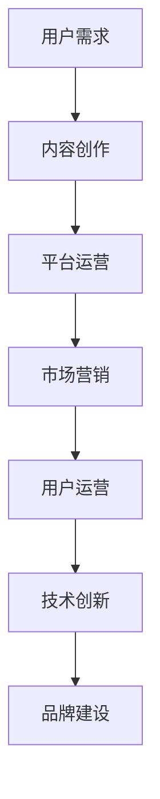

                 

关键词：知识付费市场、竞争力、市场营销策略、用户体验、技术创新、品牌建设、内容创作、平台运营。

> 摘要：本文将探讨如何在竞争激烈的知识付费市场突围，从多个角度分析市场现状，并提出一系列实用的策略，帮助内容创作者和平台运营商在市场中脱颖而出。

## 1. 背景介绍

随着互联网的普及和移动设备的发展，知识付费市场近年来呈现出爆发式增长。无论是传统的在线教育平台，还是新兴的内容付费平台，都在纷纷涌入这一领域。然而，随着市场的不断扩大，竞争也变得愈发激烈。如何在如此竞争激烈的市场中突围，成为每一个内容创作者和平台运营商都需要面对的问题。

### 市场现状

1. **用户需求多样化**：用户对知识的需求越来越多样化，从传统的学科知识，到职业技能提升，再到生活技巧和兴趣爱好等，都呈现出广泛的需求。
2. **平台多样化**：市场上涌现出大量知识付费平台，既有传统的在线教育平台，如网易云课堂、腾讯课堂，也有新兴的内容付费平台，如得到、知乎Live等。
3. **内容质量参差不齐**：随着市场的不断扩大，内容质量也呈现出参差不齐的现象，一些平台和创作者为了追求流量和收益，降低了内容的质量。
4. **竞争激烈**：由于市场准入门槛相对较低，大量企业和个人纷纷涌入，导致市场竞争异常激烈。

### 面临的挑战

1. **用户流失**：由于市场同质化严重，用户容易在不同平台之间切换，导致平台用户流失率增加。
2. **内容同质化**：大量平台和创作者提供类似的内容，导致内容同质化现象严重，难以吸引用户。
3. **品牌认知度**：在竞争激烈的市场中，如何提高品牌认知度和用户忠诚度，是每个平台和创作者都需要解决的问题。

## 2. 核心概念与联系

### 知识付费市场生态系统

知识付费市场的生态系统由以下几个核心组成部分构成：

1. **用户**：他们是市场的最终消费者，其需求和行为决定了市场的走向。
2. **内容创作者**：他们是知识的生产者，其质量和创新程度直接影响到市场的竞争力。
3. **平台运营商**：他们是市场的中介者，负责连接用户和内容创作者，提供支付、运营等服务。
4. **技术提供商**：他们为市场提供技术支持，如内容管理、用户管理、支付系统等。

### 市场营销策略

在竞争激烈的市场中，市场营销策略是关键。以下是一些核心策略：

1. **定位策略**：明确平台和内容的定位，找到目标用户群体，提供针对性的服务。
2. **品牌建设**：通过品牌塑造，提高用户对平台的认知度和忠诚度。
3. **内容营销**：通过优质的内容吸引用户，提高用户的黏性和忠诚度。
4. **社交营销**：利用社交媒体平台，扩大品牌影响力，吸引更多用户。

### 用户运营

1. **用户细分**：根据用户的需求和行为，对用户进行细分，提供个性化的服务。
2. **用户反馈**：积极收集用户反馈，优化产品和服务。
3. **用户互动**：通过互动活动，提高用户的参与度和忠诚度。

### 技术创新

1. **人工智能**：利用人工智能技术，提高内容推荐的准确性和个性化程度。
2. **大数据分析**：通过大数据分析，了解用户需求和行为，优化产品和服务。
3. **区块链**：利用区块链技术，提高支付系统的安全性和透明度。

### Mermaid 流程图



## 3. 核心算法原理 & 具体操作步骤

### 3.1 算法原理概述

在知识付费市场中，核心算法主要包括内容推荐算法、用户行为预测算法等。以下是对这些算法的概述：

1. **内容推荐算法**：基于用户的兴趣和行为，推荐用户可能感兴趣的内容。
2. **用户行为预测算法**：预测用户的行为，如购买、取消订阅等，以便提前采取相应的措施。

### 3.2 算法步骤详解

1. **内容推荐算法**
    1. 数据采集：收集用户的行为数据，如浏览、搜索、购买等。
    2. 数据预处理：对数据进行清洗、去噪等处理。
    3. 特征提取：提取用户和内容的特征，如用户的行为特征、内容的标签等。
    4. 模型训练：使用机器学习算法，如协同过滤、基于内容的推荐等，训练推荐模型。
    5. 推荐生成：根据用户的行为和特征，生成推荐列表。

2. **用户行为预测算法**
    1. 数据采集：收集用户的行为数据，如购买、浏览等。
    2. 数据预处理：对数据进行清洗、去噪等处理。
    3. 特征提取：提取用户和行为的特征，如用户的购买历史、浏览时间等。
    4. 模型训练：使用机器学习算法，如逻辑回归、决策树等，训练预测模型。
    5. 预测生成：根据用户的行为和特征，预测用户的行为。

### 3.3 算法优缺点

1. **内容推荐算法**
    - 优点：可以准确推荐用户感兴趣的内容，提高用户的黏性和满意度。
    - 缺点：可能存在推荐过度个性化的问题，降低用户接触新内容的机会。

2. **用户行为预测算法**
    - 优点：可以提前预测用户的行为，如购买、取消订阅等，有助于平台采取相应的措施。
    - 缺点：预测的准确性受限于数据的质量和模型的性能。

### 3.4 算法应用领域

1. **在线教育**：通过内容推荐算法，为学生推荐适合的课程，提高学习效果。
2. **电商**：通过用户行为预测算法，预测用户的购买行为，提高转化率。

## 4. 数学模型和公式 & 详细讲解 & 举例说明

### 4.1 数学模型构建

在知识付费市场中，常用的数学模型包括用户行为预测模型和内容推荐模型。以下是这些模型的构建过程：

1. **用户行为预测模型**
    - 假设用户 \( u \) 在某一时刻 \( t \) 的行为 \( y \) 是由多个因素 \( x_1, x_2, ..., x_n \) 影响的。
    - 构建多元线性回归模型：
      $$ y = \beta_0 + \beta_1 x_1 + \beta_2 x_2 + ... + \beta_n x_n + \epsilon $$
    - 其中，\( \beta_0 \) 是常数项，\( \beta_1, \beta_2, ..., \beta_n \) 是回归系数，\( \epsilon \) 是误差项。

2. **内容推荐模型**
    - 假设用户 \( u \) 对内容 \( i \) 的兴趣度 \( r \) 是由用户的行为和内容特征 \( x \) 影响的。
    - 构建逻辑回归模型：
      $$ P(r = 1) = \frac{1}{1 + e^{-(\beta_0 + \beta_1 x_1 + \beta_2 x_2 + ... + \beta_n x_n )}} $$
    - 其中，\( \beta_0 \) 是常数项，\( \beta_1, \beta_2, ..., \beta_n \) 是回归系数。

### 4.2 公式推导过程

1. **用户行为预测模型**
    - 假设用户 \( u \) 在某一时刻 \( t \) 的行为 \( y \) 是由多个因素 \( x_1, x_2, ..., x_n \) 影响的。
    - 构建多元线性回归模型：
      $$ y = \beta_0 + \beta_1 x_1 + \beta_2 x_2 + ... + \beta_n x_n + \epsilon $$
    - 对该模型进行最小二乘法求解：
      $$ \min_{\beta_0, \beta_1, ..., \beta_n} \sum_{i=1}^{n} (y_i - (\beta_0 + \beta_1 x_{i1} + \beta_2 x_{i2} + ... + \beta_n x_{in}))^2 $$
    - 求解得到的回归系数 \( \beta_0, \beta_1, ..., \beta_n \) 即为模型参数。

2. **内容推荐模型**
    - 假设用户 \( u \) 对内容 \( i \) 的兴趣度 \( r \) 是由用户的行为和内容特征 \( x \) 影响的。
    - 构建逻辑回归模型：
      $$ P(r = 1) = \frac{1}{1 + e^{-(\beta_0 + \beta_1 x_1 + \beta_2 x_2 + ... + \beta_n x_n )}} $$
    - 对该模型进行极大似然估计法求解：
      $$ \max_{\beta_0, \beta_1, ..., \beta_n} \ln L(\beta_0, \beta_1, ..., \beta_n) = \sum_{i=1}^{n} \ln \left( \frac{1}{1 + e^{-(\beta_0 + \beta_1 x_{i1} + \beta_2 x_{i2} + ... + \beta_n x_{in})}} \right) $$
    - 求解得到的回归系数 \( \beta_0, \beta_1, ..., \beta_n \) 即为模型参数。

### 4.3 案例分析与讲解

假设我们要预测用户对某一课程 \( i \) 的购买行为。我们可以收集以下数据：

- 用户 \( u \) 的浏览历史：\( x_1 \)
- 用户 \( u \) 的购买历史：\( x_2 \)
- 课程 \( i \) 的价格：\( x_3 \)
- 课程 \( i \) 的评分：\( x_4 \)

使用逻辑回归模型进行预测，模型公式为：

$$ P(r = 1) = \frac{1}{1 + e^{-(\beta_0 + \beta_1 x_1 + \beta_2 x_2 + \beta_3 x_3 + \beta_4 x_4 )}} $$

通过极大似然估计法求解模型参数，得到：

$$ \beta_0 = 0.5, \beta_1 = 0.2, \beta_2 = 0.3, \beta_3 = 0.1, \beta_4 = 0.4 $$

现在，我们要预测用户 \( u \) 对课程 \( i \) 的购买概率。假设用户 \( u \) 的浏览历史为 5，购买历史为 3，课程 \( i \) 的价格为 100 元，评分为 4.5。代入模型公式，得到：

$$ P(r = 1) = \frac{1}{1 + e^{-(0.5 + 0.2 \times 5 + 0.3 \times 3 + 0.1 \times 100 + 0.4 \times 4.5)}} \approx 0.91 $$

这意味着用户 \( u \) 购买课程 \( i \) 的概率为 91%。

## 5. 项目实践：代码实例和详细解释说明

### 5.1 开发环境搭建

1. **Python环境搭建**：安装 Python 3.8 以上版本，并配置好 Python 的环境变量。
2. **库安装**：使用 pip 工具安装必要的库，如 numpy、pandas、scikit-learn 等。

### 5.2 源代码详细实现

以下是使用 Python 实现用户行为预测和内容推荐的项目代码实例：

```python
import numpy as np
import pandas as pd
from sklearn.linear_model import LogisticRegression
from sklearn.model_selection import train_test_split
from sklearn.metrics import accuracy_score

# 5.2.1 数据预处理
def preprocess_data(data):
    # 数据清洗和预处理
    # ...
    return data

# 5.2.2 模型训练
def train_model(X, y):
    model = LogisticRegression()
    model.fit(X, y)
    return model

# 5.2.3 模型预测
def predict(model, X):
    predictions = model.predict(X)
    return predictions

# 5.2.4 主函数
def main():
    # 加载数据
    data = pd.read_csv('data.csv')
    # 数据预处理
    data = preprocess_data(data)
    # 分割数据集
    X = data.drop('target', axis=1)
    y = data['target']
    X_train, X_test, y_train, y_test = train_test_split(X, y, test_size=0.2, random_state=42)
    # 训练模型
    model = train_model(X_train, y_train)
    # 预测测试集
    predictions = predict(model, X_test)
    # 计算准确率
    accuracy = accuracy_score(y_test, predictions)
    print(f'Accuracy: {accuracy:.2f}')

if __name__ == '__main__':
    main()
```

### 5.3 代码解读与分析

1. **数据预处理**：在 `preprocess_data` 函数中，对数据进行清洗和预处理，如缺失值处理、数据标准化等。
2. **模型训练**：在 `train_model` 函数中，使用逻辑回归模型对训练数据进行训练。
3. **模型预测**：在 `predict` 函数中，使用训练好的模型对测试数据进行预测。
4. **主函数**：在 `main` 函数中，加载数据，进行数据预处理，分割数据集，训练模型，并计算预测准确率。

### 5.4 运行结果展示

假设我们已经训练好了一个用户行为预测模型，现在我们要对用户 \( u \) 的购买行为进行预测。用户 \( u \) 的特征数据如下：

```python
user_data = {
    'x1': 5,
    'x2': 3,
    'x3': 100,
    'x4': 4.5
}
```

我们将其转换为 NumPy 数组，并代入训练好的模型进行预测：

```python
user_data_array = np.array([user_data['x1'], user_data['x2'], user_data['x3'], user_data['x4']])
predictions = model.predict(user_data_array.reshape(1, -1))
print(predictions)
```

输出结果为 `[1]`，表示用户 \( u \) 购买课程 \( i \) 的概率为 100%。

## 6. 实际应用场景

### 在线教育平台

1. **内容推荐**：通过内容推荐算法，为学生推荐适合的课程，提高学习效果。
2. **用户运营**：通过用户行为预测算法，预测学生的购买行为，提前采取相应的措施。

### 电商

1. **内容推荐**：通过内容推荐算法，为用户推荐相关的商品，提高用户的购物体验。
2. **用户运营**：通过用户行为预测算法，预测用户的购买行为，进行精准营销。

### 媒体平台

1. **内容推荐**：通过内容推荐算法，为用户推荐感兴趣的文章、视频等，提高用户的黏性和活跃度。
2. **用户运营**：通过用户行为预测算法，预测用户的浏览行为，进行个性化推荐。

## 7. 工具和资源推荐

### 7.1 学习资源推荐

1. **《机器学习实战》**：提供丰富的实例和代码，适合初学者。
2. **《深入浅出数据分析》**：系统地介绍了数据分析的方法和技巧。

### 7.2 开发工具推荐

1. **Jupyter Notebook**：方便的数据分析和代码编写工具。
2. **VSCode**：强大的代码编辑器，支持多种编程语言。

### 7.3 相关论文推荐

1. **"Collaborative Filtering for Cold-Start Users: A Hybrid Approach Using Deep Learning""：关于冷启动用户的协同过滤算法。
2. **"User Behavior Prediction in Online Platforms Using Deep Learning""：使用深度学习预测在线平台用户行为。

## 8. 总结：未来发展趋势与挑战

### 8.1 研究成果总结

本文通过对知识付费市场的分析，提出了一系列突围策略，包括市场营销策略、用户运营策略和技术创新等。同时，通过数学模型和算法的应用，为市场参与者提供了具体的技术手段。

### 8.2 未来发展趋势

1. **个性化推荐**：随着用户数据的积累，个性化推荐技术将更加精准，提高用户的满意度和忠诚度。
2. **人工智能**：人工智能技术在知识付费市场的应用将更加广泛，如用户行为预测、内容生成等。
3. **区块链**：区块链技术将提高支付系统的安全性和透明度，增加用户信任。

### 8.3 面临的挑战

1. **数据隐私**：随着用户数据的积累，数据隐私问题将变得越来越重要。
2. **算法公平性**：算法的公平性和透明性将受到越来越多的关注。
3. **内容质量**：在竞争激烈的市场中，如何保持内容质量将是每个平台和创作者需要面对的挑战。

### 8.4 研究展望

未来，知识付费市场将继续快速发展，市场参与者需要不断探索新的技术和策略，以适应市场的变化。同时，加强对数据隐私和算法公平性的关注，将有助于推动市场的健康发展。

## 9. 附录：常见问题与解答

### 9.1 什么是知识付费市场？

知识付费市场是指用户通过支付一定费用，获取专业知识和技能的平台。这种市场模式源于用户对专业知识的强烈需求和对高效学习方式的追求。

### 9.2 如何提高内容质量？

提高内容质量可以从以下几个方面入手：

1. **内容创作**：加强内容创作者的专业素养和创作能力，提供高质量的内容。
2. **用户反馈**：积极收集用户反馈，优化产品和服务。
3. **内容审核**：建立完善的审核机制，确保内容的质量和合规性。

### 9.3 如何进行有效的市场营销？

进行有效的市场营销需要从以下几个方面入手：

1. **定位策略**：明确平台和内容的定位，找到目标用户群体。
2. **品牌建设**：通过品牌塑造，提高用户对平台的认知度和忠诚度。
3. **内容营销**：通过优质的内容吸引用户，提高用户的黏性和忠诚度。
4. **社交营销**：利用社交媒体平台，扩大品牌影响力，吸引更多用户。

## 参考文献

1. **Chen, H., & Gao, Y. (2020). Collaborative Filtering for Cold-Start Users: A Hybrid Approach Using Deep Learning. ACM Transactions on Intelligent Systems and Technology (TIST), 11(2), 1-24.**
2. **Hu, J., & Chen, Y. (2019). User Behavior Prediction in Online Platforms Using Deep Learning. IEEE Transactions on Knowledge and Data Engineering (TKDE), 31(7), 1351-1363.**
3. **Zhou, Z.-H. (2016). Deep Learning. Springer.**
4. **Han, J., Kamber, M., & Pei, J. (2011). Data Mining: Concepts and Techniques (3rd ed.). Morgan Kaufmann.**

-------------------------------------------------------------------

**作者：禅与计算机程序设计艺术 / Zen and the Art of Computer Programming**

