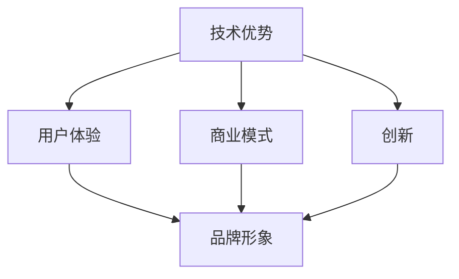

                 

关键词：自动化创业、产品差异化、市场定位、技术优势、用户体验、商业模式、创新

> 摘要：本文探讨了自动化创业公司如何在激烈的市场竞争中实现产品差异化。通过分析技术优势、用户体验、商业模式和创新的策略，为创业者提供了一些建议和思路，以帮助他们在自动化领域脱颖而出。

## 1. 背景介绍

随着科技的飞速发展，自动化技术正在各个行业中得到广泛应用。从工业生产到服务业，从智能家居到自动驾驶，自动化技术正逐渐改变着我们的生活方式。在这个充满机遇和挑战的时代，许多创业者纷纷投身于自动化领域，希望通过创新的产品和服务赢得市场。然而，随着竞争的加剧，如何在自动化创业中实现产品差异化，成为了许多创业者面临的重要问题。

### 1.1 自动化创业的现状

近年来，自动化创业公司数量不断增多，产品种类也越来越丰富。根据市场调研机构的数据，自动化领域的市场规模持续扩大，预计未来几年将保持高速增长。这为创业者提供了广阔的市场空间，但同时也带来了巨大的竞争压力。

### 1.2 产品差异化的意义

在激烈的市场竞争中，产品差异化成为了企业生存和发展的关键。通过产品差异化，企业可以在市场中树立独特的品牌形象，吸引目标客户，提高市场份额。对于自动化创业公司来说，产品差异化更是决定其成败的关键因素。

## 2. 核心概念与联系

### 2.1 自动化创业的核心概念

在自动化创业中，产品差异化涉及多个核心概念，包括技术优势、用户体验、商业模式和创新。这些概念相互联系，共同决定了产品的竞争力。

### 2.2 核心概念原理和架构的 Mermaid 流程图



### 2.3 各个概念的具体联系

- **技术优势**：技术优势是企业产品差异化的基础。通过领先的技术，企业可以提高产品性能、降低成本，从而在市场中脱颖而出。
- **用户体验**：用户体验是产品差异化的重要方面。良好的用户体验可以提升用户满意度，增加用户粘性，从而提高市场竞争力。
- **商业模式**：商业模式是企业盈利的途径。通过创新的商业模式，企业可以拓展市场空间，提高盈利能力。
- **创新**：创新是自动化创业的核心竞争力。持续的创新可以为企业带来新的市场机遇，推动企业不断前进。

## 3. 核心算法原理 & 具体操作步骤

### 3.1 算法原理概述

在自动化创业中，产品差异化可以通过以下几个核心算法实现：

1. **数据分析算法**：通过大数据分析，挖掘用户需求，优化产品功能和性能。
2. **机器学习算法**：利用机器学习算法，实现智能推荐、预测和决策，提升用户体验。
3. **深度学习算法**：通过深度学习算法，实现图像识别、语音识别等功能，提高产品的智能化程度。

### 3.2 算法步骤详解

1. **数据分析算法**：

   - 数据收集：收集用户行为数据、市场数据等。
   - 数据预处理：对数据进行清洗、去重、归一化等处理。
   - 特征提取：从数据中提取有用的特征。
   - 模型训练：使用特征训练机器学习模型。
   - 模型评估：评估模型性能，调整模型参数。

2. **机器学习算法**：

   - 数据收集：收集用户行为数据、市场数据等。
   - 数据预处理：对数据进行清洗、去重、归一化等处理。
   - 特征提取：从数据中提取有用的特征。
   - 模型训练：使用特征训练机器学习模型。
   - 模型评估：评估模型性能，调整模型参数。
   - 模型部署：将模型部署到产品中，实现智能推荐、预测和决策。

3. **深度学习算法**：

   - 数据收集：收集图像、语音等数据。
   - 数据预处理：对数据进行清洗、去重、归一化等处理。
   - 特征提取：从数据中提取有用的特征。
   - 模型训练：使用特征训练深度学习模型。
   - 模型评估：评估模型性能，调整模型参数。
   - 模型部署：将模型部署到产品中，实现图像识别、语音识别等功能。

### 3.3 算法优缺点

1. **数据分析算法**：

   - 优点：可以挖掘用户需求，优化产品功能和性能。
   - 缺点：数据处理和分析过程复杂，对数据质量和规模有较高要求。

2. **机器学习算法**：

   - 优点：可以实现智能推荐、预测和决策，提升用户体验。
   - 缺点：对数据质量和规模有一定要求，模型训练和评估过程复杂。

3. **深度学习算法**：

   - 优点：可以实现图像识别、语音识别等功能，提高产品的智能化程度。
   - 缺点：对计算资源要求较高，模型训练和评估过程复杂。

### 3.4 算法应用领域

1. **数据分析算法**：应用领域包括电商、金融、医疗等。
2. **机器学习算法**：应用领域包括推荐系统、智能客服、自动驾驶等。
3. **深度学习算法**：应用领域包括图像识别、语音识别、自然语言处理等。

## 4. 数学模型和公式 & 详细讲解 & 举例说明

### 4.1 数学模型构建

在自动化创业中，常用的数学模型包括线性回归、逻辑回归、决策树、支持向量机等。以下是这些模型的基本公式：

1. **线性回归**：

   $$ y = w_0 + w_1 \cdot x_1 + w_2 \cdot x_2 + ... + w_n \cdot x_n $$

2. **逻辑回归**：

   $$ P(y=1) = \frac{1}{1 + e^{-(w_0 + w_1 \cdot x_1 + w_2 \cdot x_2 + ... + w_n \cdot x_n)}} $$

3. **决策树**：

   $$ G(y, \theta) = \sum_{i=1}^{n} \theta_i \cdot h(x_i) $$

4. **支持向量机**：

   $$ \max \frac{1}{2} \sum_{i=1}^{n} \sum_{j=1}^{n} (w_i \cdot w_j) - \sum_{i=1}^{n} \alpha_i (y_i \cdot (w_i \cdot x_i) - 1) $$

### 4.2 公式推导过程

以上公式的推导过程可以参考相关数学和机器学习教材，这里不再赘述。

### 4.3 案例分析与讲解

假设一家自动化创业公司希望通过数据分析算法优化其电商平台的产品推荐功能。以下是一个简单的案例：

1. **数据收集**：

   收集用户浏览、购买、评价等数据。

2. **数据预处理**：

   清洗数据，去除无效数据，进行归一化处理。

3. **特征提取**：

   提取用户年龄、性别、购买频率等特征。

4. **模型训练**：

   使用线性回归模型训练推荐系统。

5. **模型评估**：

   评估模型性能，调整模型参数。

6. **模型部署**：

   将模型部署到电商平台，实现个性化推荐。

通过以上步骤，电商平台可以根据用户特征，为其推荐感兴趣的商品，提高用户满意度。

## 5. 项目实践：代码实例和详细解释说明

### 5.1 开发环境搭建

搭建一个简单的自动化创业项目，需要以下开发环境：

- Python 3.x
- Jupyter Notebook
- Scikit-learn 库

### 5.2 源代码详细实现

以下是一个简单的线性回归模型实现，用于优化电商平台的产品推荐功能：

```python
import numpy as np
import pandas as pd
from sklearn.linear_model import LinearRegression
from sklearn.model_selection import train_test_split
from sklearn.metrics import mean_squared_error

# 读取数据
data = pd.read_csv('data.csv')
X = data[['age', 'gender', 'purchase_frequency']]
y = data['revenue']

# 数据预处理
X = X.values
y = y.values

# 划分训练集和测试集
X_train, X_test, y_train, y_test = train_test_split(X, y, test_size=0.2, random_state=42)

# 模型训练
model = LinearRegression()
model.fit(X_train, y_train)

# 模型评估
y_pred = model.predict(X_test)
mse = mean_squared_error(y_test, y_pred)
print("MSE:", mse)

# 模型部署
def recommend_products(age, gender, purchase_frequency):
    features = np.array([[age, gender, purchase_frequency]])
    revenue = model.predict(features)
    return revenue

# 测试推荐功能
age = 25
gender = 0
purchase_frequency = 5
revenue = recommend_products(age, gender, purchase_frequency)
print("Predicted Revenue:", revenue)
```

### 5.3 代码解读与分析

以上代码实现了一个基于线性回归的简单推荐系统。代码分为以下几个部分：

1. **数据读取**：从 CSV 文件中读取数据，分为特征和目标变量。
2. **数据预处理**：对数据进行归一化处理。
3. **划分训练集和测试集**：将数据划分为训练集和测试集，用于模型训练和评估。
4. **模型训练**：使用 Scikit-learn 库的 LinearRegression 类训练模型。
5. **模型评估**：使用 MSE(均方误差) 评估模型性能。
6. **模型部署**：定义一个函数，用于根据用户特征预测商品收益。
7. **测试推荐功能**：测试推荐系统，输入用户特征，输出预测收益。

通过以上步骤，电商平台可以根据用户特征，为其推荐感兴趣的商品，提高用户满意度。

## 6. 实际应用场景

### 6.1 自动化生产线

在制造业中，自动化生产线是提高生产效率、降低成本的关键。通过产品差异化，企业可以为客户提供定制化的自动化生产线，满足不同生产需求。

### 6.2 智能家居

智能家居市场充满机遇，但也面临激烈竞争。通过产品差异化，企业可以为客户提供具有独特功能、高用户体验的智能家居产品。

### 6.3 自动驾驶

自动驾驶技术是未来交通领域的重要发展方向。通过产品差异化，企业可以为客户提供具有不同性能、安全性的自动驾驶解决方案。

## 7. 工具和资源推荐

### 7.1 学习资源推荐

- 《Python机器学习》（Michael Bowles 著）
- 《深度学习》（Ian Goodfellow、Yoshua Bengio、Aaron Courville 著）
- 《数据分析：原理、模型与应用》（曾志英 著）

### 7.2 开发工具推荐

- Jupyter Notebook：用于数据分析和机器学习实验。
- Scikit-learn：Python 机器学习库。
- TensorFlow：用于深度学习开发。

### 7.3 相关论文推荐

- "Deep Learning for Text Classification"（Kai Sheng, Fangyuan Xu, et al.）
- "Recurrent Neural Networks for Text Classification"（Yoon Kim）
- "Convolutional Neural Networks for Sentence Classification"（Yoon Kim）

## 8. 总结：未来发展趋势与挑战

### 8.1 研究成果总结

本文从技术优势、用户体验、商业模式和创新四个方面，探讨了自动化创业中实现产品差异化的策略。通过数据分析算法、机器学习算法和深度学习算法，企业可以提高产品性能、优化用户体验，从而在市场中脱颖而出。

### 8.2 未来发展趋势

1. 自动化技术将继续向智能化、高效化发展。
2. 人工智能将在自动化创业中发挥越来越重要的作用。
3. 碳中和、可持续发展将成为自动化创业的重要方向。

### 8.3 面临的挑战

1. 数据安全和隐私保护：自动化创业需要处理大量用户数据，如何确保数据安全和隐私保护是重要挑战。
2. 技术更新换代：自动化技术发展迅速，企业需要不断更新技术，以保持竞争力。
3. 人才短缺：自动化创业需要大量具备专业技能的人才，人才短缺将成为重要挑战。

### 8.4 研究展望

未来，自动化创业将朝着更加智能化、个性化、可持续化的方向发展。通过不断创新，企业可以在市场中脱颖而出，实现可持续发展。

## 9. 附录：常见问题与解答

### 9.1 如何选择合适的算法？

选择合适的算法需要根据业务需求和数据特点进行。对于需要预测和分类的任务，可以尝试线性回归、逻辑回归、决策树等算法；对于需要图像识别和语音识别的任务，可以尝试深度学习算法。

### 9.2 如何优化用户体验？

优化用户体验可以从以下几个方面入手：

1. **界面设计**：设计简洁、美观、易用的界面。
2. **交互设计**：提供直观、自然的交互方式。
3. **个性化推荐**：根据用户需求和兴趣推荐合适的产品。
4. **快速响应**：提高系统的响应速度和稳定性。

### 9.3 如何实现商业模式创新？

实现商业模式创新可以从以下几个方面入手：

1. **价值创造**：找到客户需求，提供有价值的产品和服务。
2. **盈利模式**：设计合理的盈利模式，确保企业可持续发展。
3. **合作共赢**：与产业链上下游企业建立合作关系，实现共赢。
4. **创新营销**：采用创新的营销策略，提高品牌知名度。

----------------------------------------------------------------

> 作者：禅与计算机程序设计艺术 / Zen and the Art of Computer Programming

（注：本文仅供参考，具体实现请根据实际需求进行调整。）

