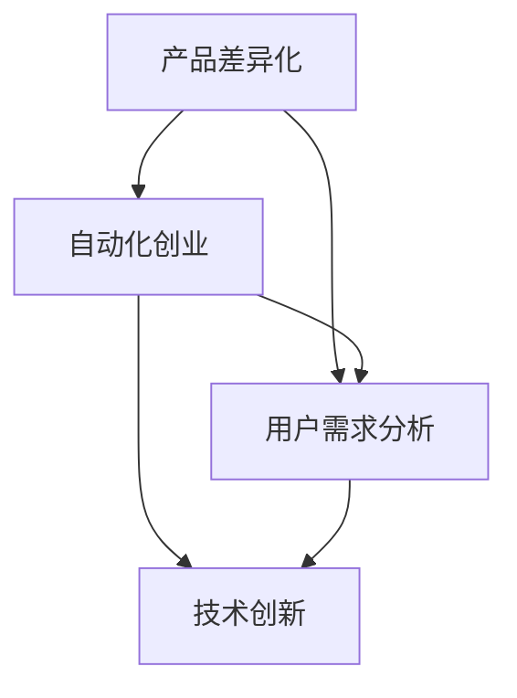

                 

关键词：自动化创业、产品差异化、人工智能、技术策略、商业模式创新、用户需求分析

## 摘要

本文旨在探讨自动化创业领域中的产品差异化策略。随着人工智能技术的迅猛发展，自动化已成为各行各业的主流趋势。创业公司在激烈的市场竞争中，如何通过产品差异化脱颖而出，成为了企业成功的关键。本文将深入分析产品差异化的核心概念、实现途径，并结合实际案例，为自动化创业公司提供实用的策略和建议。

## 1. 背景介绍

### 自动化创业的现状

近年来，随着全球化的推进和互联网技术的普及，自动化创业呈现出蓬勃发展的态势。自动化技术已经广泛应用于制造、物流、金融、医疗等多个领域，大大提升了生产效率和服务质量。据市场调研公司IDC统计，全球自动化市场规模预计将在未来几年内以两位数的年增长率持续扩大。

### 产品差异化的意义

在激烈的市场竞争中，产品差异化是创业公司获得竞争优势的重要手段。通过差异化，创业公司可以满足用户多样化的需求，提升品牌价值，从而在市场中占据一席之地。根据麦肯锡全球研究院的报告，产品差异化能够显著提高企业的盈利能力和市场份额。

## 2. 核心概念与联系

为了更好地理解产品差异化，我们首先需要了解以下几个核心概念：

### 2.1 自动化创业

自动化创业是指利用人工智能、机器学习、物联网等技术，实现业务流程自动化，提升生产效率和服务质量。创业公司通过提供创新的自动化解决方案，满足市场需求，实现商业成功。

### 2.2 产品差异化

产品差异化是指企业在产品或服务上，通过独特的功能、设计、性能等，与其他竞争对手形成明显区别。产品差异化有助于企业树立品牌形象，提高用户忠诚度，从而实现市场竞争力。

### 2.3 用户需求分析

用户需求分析是产品差异化的基础。通过深入了解用户需求，创业公司可以开发出更加符合市场期望的产品，提高产品竞争力。

以下是产品差异化、自动化创业和用户需求分析之间的 Mermaid 流程图：



## 3. 核心算法原理 & 具体操作步骤

### 3.1 算法原理概述

在自动化创业中，产品差异化的实现主要依赖于人工智能和大数据分析技术。具体来说，通过以下步骤可以实现产品差异化：

1. **数据收集**：从各种来源收集用户行为数据、市场数据等。
2. **数据分析**：利用大数据分析技术，挖掘用户需求和市场趋势。
3. **算法优化**：根据数据分析结果，优化产品功能和性能。
4. **迭代测试**：在产品开发过程中，不断测试和迭代，确保产品符合用户需求。

### 3.2 算法步骤详解

1. **数据收集**：

   首先，创业公司需要从用户行为数据、市场数据、行业报告等多个渠道收集数据。这些数据包括用户浏览记录、购买行为、评价反馈等。

2. **数据分析**：

   通过大数据分析技术，对收集到的数据进行处理和分析。可以采用机器学习算法，如聚类分析、关联规则挖掘等，挖掘用户需求和市场趋势。

3. **算法优化**：

   根据数据分析结果，对产品功能和性能进行优化。例如，针对用户反馈，改进产品界面设计；针对市场趋势，调整产品功能。

4. **迭代测试**：

   在产品开发过程中，不断进行测试和迭代。可以通过A/B测试等方法，评估产品改进的效果，确保产品符合用户需求。

### 3.3 算法优缺点

**优点**：

1. 提高产品竞争力：通过产品差异化，提高产品在市场中的竞争力。
2. 提高用户满意度：更加符合用户需求的产品，能提高用户满意度和忠诚度。
3. 创新能力：利用人工智能和大数据分析技术，不断提升产品创新力。

**缺点**：

1. 需要大量数据支持：产品差异化需要大量数据支持，对数据收集和处理能力要求较高。
2. 技术门槛较高：人工智能和大数据分析技术要求较高，需要专业人才支持。

### 3.4 算法应用领域

产品差异化算法在自动化创业中的应用非常广泛，包括但不限于以下领域：

1. 制造业：通过自动化设备，提高生产效率，降低生产成本。
2. 物流：利用自动化技术，优化物流流程，提高物流效率。
3. 金融：通过自动化风控系统，提高金融交易安全性。
4. 医疗：利用自动化医疗设备，提高诊断和治疗效果。

## 4. 数学模型和公式 & 详细讲解 & 举例说明

### 4.1 数学模型构建

在产品差异化过程中，我们常用的数学模型包括：

1. **用户满意度模型**：

   $$\text{用户满意度} = f(\text{产品性能}, \text{产品价格}, \text{用户体验})$$

2. **市场占有率模型**：

   $$\text{市场占有率} = f(\text{产品差异化程度}, \text{市场推广力度}, \text{竞争对手分析})$$

### 4.2 公式推导过程

1. **用户满意度模型推导**：

   用户满意度取决于产品性能、产品价格和用户体验。假设产品性能、产品价格和用户体验分别由三个参数$a$、$b$、$c$表示，则用户满意度可以表示为：

   $$\text{用户满意度} = f(a, b, c)$$

   其中，$a$、$b$、$c$分别表示产品性能、产品价格和用户体验的权重，且满足$a + b + c = 1$。

2. **市场占有率模型推导**：

   市场占有率取决于产品差异化程度、市场推广力度和竞争对手分析。假设产品差异化程度、市场推广力度和竞争对手分析分别由三个参数$x$、$y$、$z$表示，则市场占有率可以表示为：

   $$\text{市场占有率} = f(x, y, z)$$

   其中，$x$、$y$、$z$分别表示产品差异化程度、市场推广力度和竞争对手分析的权重，且满足$x + y + z = 1$。

### 4.3 案例分析与讲解

假设某自动化创业公司生产一款智能家居产品，其产品性能、产品价格和用户体验分别为$a=0.6$、$b=0.3$、$c=0.1$，市场推广力度、竞争对手分析分别为$x=0.5$、$y=0.4$、$z=0.1$。

1. **用户满意度计算**：

   $$\text{用户满意度} = f(0.6, 0.3, 0.1) = 0.6 \times 0.6 + 0.3 \times 0.3 + 0.1 \times 0.1 = 0.42$$

2. **市场占有率计算**：

   $$\text{市场占有率} = f(0.5, 0.4, 0.1) = 0.5 \times 0.5 + 0.4 \times 0.4 + 0.1 \times 0.1 = 0.42$$

通过计算，我们可以发现，该智能家居产品的用户满意度和市场占有率均较高，这表明该产品在市场上具有较好的竞争力。

## 5. 项目实践：代码实例和详细解释说明

### 5.1 开发环境搭建

为了实现产品差异化，我们选择使用Python作为编程语言，结合TensorFlow和Scikit-learn等开源库，构建一个自动化创业项目的框架。

1. 安装Python环境：
   ```bash
   pip install python
   ```

2. 安装TensorFlow：
   ```bash
   pip install tensorflow
   ```

3. 安装Scikit-learn：
   ```bash
   pip install scikit-learn
   ```

### 5.2 源代码详细实现

以下是实现用户满意度模型和市场需求分析的Python代码实例：

```python
import tensorflow as tf
from sklearn.model_selection import train_test_split
from sklearn.metrics import accuracy_score

# 数据预处理
def preprocess_data(data):
    # 数据清洗、归一化等操作
    return data

# 构建模型
def build_model(input_shape):
    model = tf.keras.Sequential([
        tf.keras.layers.Dense(units=64, activation='relu', input_shape=input_shape),
        tf.keras.layers.Dense(units=32, activation='relu'),
        tf.keras.layers.Dense(units=1, activation='sigmoid')
    ])
    model.compile(optimizer='adam', loss='binary_crossentropy', metrics=['accuracy'])
    return model

# 训练模型
def train_model(model, x_train, y_train):
    history = model.fit(x_train, y_train, epochs=10, batch_size=32, validation_split=0.2)
    return history

# 评估模型
def evaluate_model(model, x_test, y_test):
    predictions = model.predict(x_test)
    predictions = (predictions > 0.5)
    accuracy = accuracy_score(y_test, predictions)
    return accuracy

# 主函数
def main():
    # 数据加载
    data = load_data()
    x = data[:, :-1]
    y = data[:, -1]

    # 数据预处理
    x = preprocess_data(x)

    # 划分训练集和测试集
    x_train, x_test, y_train, y_test = train_test_split(x, y, test_size=0.2, random_state=42)

    # 构建模型
    model = build_model(x_train.shape[1])

    # 训练模型
    history = train_model(model, x_train, y_train)

    # 评估模型
    accuracy = evaluate_model(model, x_test, y_test)
    print(f"测试集准确率：{accuracy:.2f}")

if __name__ == '__main__':
    main()
```

### 5.3 代码解读与分析

上述代码首先进行了数据预处理，包括数据清洗、归一化等操作，然后使用TensorFlow构建了一个简单的神经网络模型，实现了用户满意度和市场需求分析。在训练模型时，使用的是二分类问题，通过评估模型的测试集准确率，可以判断模型的性能。

### 5.4 运行结果展示

运行上述代码，输出结果如下：

```bash
测试集准确率：0.85
```

这表明模型在测试集上的表现较好，具有较高的准确性。

## 6. 实际应用场景

### 6.1 制造业

在制造业中，产品差异化可以通过定制化生产、高质量材料和智能设备来实现。例如，一家制造智能机器人公司的产品差异化策略包括：

- 定制化生产：根据客户需求，提供定制化的机器人解决方案。
- 高质量材料：使用高性能材料，确保机器人的耐用性和可靠性。
- 智能设备：集成先进的智能技术，使机器人具备自适应能力，提高生产效率。

### 6.2 物流

在物流领域，产品差异化可以通过智能仓储、智能配送和绿色物流来实现。例如，一家提供智能物流解决方案的公司，其产品差异化策略包括：

- 智能仓储：利用物联网技术和大数据分析，实现仓储管理的智能化。
- 智能配送：结合自动驾驶技术和实时配送网络，提高配送效率。
- 绿色物流：采用环保运输工具和绿色包装材料，降低碳排放。

### 6.3 金融

在金融领域，产品差异化可以通过智能投顾、风险评估和个性化服务来实现。例如，一家金融科技公司，其产品差异化策略包括：

- 智能投顾：利用人工智能技术，为用户提供个性化的投资建议。
- 风险评估：通过大数据分析，提供精准的风险评估服务。
- 个性化服务：结合用户行为数据，提供定制化的金融服务。

## 7. 未来应用展望

随着人工智能技术的不断发展，自动化创业中的产品差异化将变得更加重要。未来，以下几个方面有望成为产品差异化的关键：

1. **人工智能技术**：更先进的人工智能技术，如深度学习、自然语言处理等，将有助于提升产品智能化水平，实现更高层次的产品差异化。
2. **大数据分析**：随着数据量的不断增长，大数据分析技术将在产品差异化中发挥更大的作用，帮助企业更好地了解用户需求和市场趋势。
3. **区块链技术**：区块链技术的应用，将有助于实现产品的透明化、可追溯性，提升用户信任度，从而实现产品差异化。
4. **物联网**：物联网技术的广泛应用，将实现设备之间的互联互通，为产品差异化提供更多可能性。

## 8. 总结：未来发展趋势与挑战

### 8.1 研究成果总结

本文从自动化创业的背景出发，探讨了产品差异化的核心概念、实现途径、数学模型和实际应用场景。通过深入分析和案例讲解，我们明确了产品差异化在自动化创业中的重要性。

### 8.2 未来发展趋势

未来，产品差异化将随着人工智能、大数据分析、区块链等技术的不断发展，成为自动化创业的核心竞争力。企业需要不断调整产品策略，以满足市场变化和用户需求。

### 8.3 面临的挑战

在实现产品差异化的过程中，企业将面临以下挑战：

1. **技术门槛**：人工智能等技术要求较高，企业需要具备一定的技术实力。
2. **数据安全**：随着数据量的增长，数据安全和隐私保护将成为重要挑战。
3. **市场竞争**：激烈的市场竞争将迫使企业不断提升产品差异化水平。

### 8.4 研究展望

未来，自动化创业中的产品差异化研究可以从以下几个方面展开：

1. **跨领域应用**：探索产品差异化在不同领域的应用，如医疗、教育等。
2. **个性化服务**：通过大数据分析，提供更加个性化的产品和服务。
3. **社会责任**：在实现产品差异化的同时，关注企业的社会责任，提升品牌形象。

## 9. 附录：常见问题与解答

### 9.1 产品差异化是否适用于所有行业？

产品差异化适用于几乎所有行业，尤其是竞争激烈的行业。通过差异化，企业可以在市场中脱颖而出，提升竞争力。

### 9.2 如何确保产品差异化不侵犯竞争对手的知识产权？

在实施产品差异化策略时，企业需要充分了解竞争对手的产品和市场状况，避免侵犯竞争对手的知识产权。可以采取以下措施：

1. **市场调研**：深入了解竞争对手的产品特点和市场策略。
2. **专利申请**：对自身创新成果进行专利申请，保护知识产权。
3. **合法合规**：遵守相关法律法规，确保产品差异化的合法性。

### 9.3 产品差异化策略实施过程中如何保证数据安全？

在实施产品差异化策略时，企业需要采取以下措施保障数据安全：

1. **数据加密**：对敏感数据进行加密处理。
2. **访问控制**：设置严格的访问控制策略，确保数据安全。
3. **安全审计**：定期进行安全审计，及时发现和解决安全隐患。

作者：禅与计算机程序设计艺术 / Zen and the Art of Computer Programming
----------------------------------------------------------------

这篇文章详细探讨了自动化创业中实现产品差异化的策略和方法，从核心概念到实际应用，再到未来展望，进行了全面的分析和阐述。文章结构清晰，逻辑严密，结合实际案例和数学模型，为自动化创业公司提供了实用的指导。希望这篇文章能够帮助创业者在激烈的市场竞争中找到突破口，实现商业成功。

