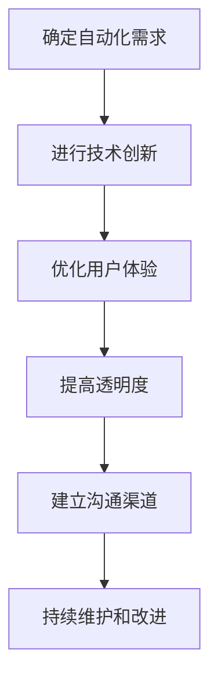

                 

关键词：自动化创业，用户信任，策略，技术，用户体验，案例分析

> 摘要：本文旨在探讨自动化创业中如何建立用户信任。通过对当前自动化创业现状的分析，本文提出了几个关键策略，包括技术创新、用户体验优化、透明度和沟通等。文章还将通过案例分析，展示这些策略在实际中的应用，并为创业者提供实用的建议。

## 1. 背景介绍

随着技术的快速发展，自动化已成为现代商业环境中不可或缺的一部分。从简单的自动化流程到复杂的AI驱动的解决方案，自动化工具在提高效率、减少成本和增强客户体验方面发挥了巨大作用。然而，自动化创业的成功不仅取决于技术创新，更重要的是建立和维护用户的信任。用户信任是自动化创业的核心，它决定了产品的市场接受度和长期成功。

在自动化创业的背景下，用户信任的重要性愈加凸显。一方面，用户对于新技术和新产品的接受度逐渐提高，但同时也更加谨慎，担心隐私泄露、数据安全和用户体验不佳等问题。另一方面，市场竞争日益激烈，创业者需要在众多竞争对手中脱颖而出，而用户信任正是他们取得竞争优势的关键因素。

本文将围绕以下几个方面展开讨论：首先，分析自动化创业的现状和挑战；其次，探讨建立用户信任的核心策略；接着，通过案例分析展示这些策略的实际应用；最后，为创业者提供一些建议和资源。

## 2. 核心概念与联系

在探讨如何在自动化创业中建立用户信任之前，我们需要明确几个核心概念，包括自动化技术、用户体验、透明度和沟通。

### 2.1 自动化技术

自动化技术是指使用计算机程序或机器人来完成重复性或规则性的任务，从而提高效率和减少人力成本。在自动化创业中，技术创新是建立用户信任的基础。创业者需要确保其自动化解决方案是高效、可靠和易于使用的。

### 2.2 用户体验

用户体验（UX）是指用户在使用产品或服务时的整体感受。在自动化创业中，优秀的用户体验能够增强用户对产品的信任感。创业者需要关注用户界面的设计、操作的流畅性以及产品的易用性。

### 2.3 透明度

透明度是指企业对用户信息、数据使用和业务运作的透明程度。高透明度有助于建立用户信任，特别是在涉及用户隐私和数据安全时。

### 2.4 沟通

沟通是建立信任的关键。在自动化创业中，有效的沟通不仅包括产品发布时的宣传和解释，还包括与用户的持续互动和反馈。创业者需要建立有效的沟通渠道，及时回应用户的疑问和需求。

### 2.5 Mermaid 流程图

以下是一个简单的Mermaid流程图，展示了建立用户信任的关键步骤：



通过这个流程图，我们可以看到，建立用户信任是一个持续的过程，需要从多个方面进行努力。

## 3. 核心算法原理 & 具体操作步骤

### 3.1 算法原理概述

在自动化创业中，建立用户信任的核心算法原理可以概括为以下几点：

1. **技术创新**：通过不断的技术创新，提高自动化解决方案的性能和可靠性，从而增强用户的信任。
2. **用户体验优化**：通过改进用户界面和操作流程，提供流畅、直观的用户体验，使用户更容易接受和信任产品。
3. **透明度和安全性**：通过透明地展示数据使用和业务运作过程，提高用户对产品的信任度。
4. **有效沟通**：通过建立有效的沟通渠道，及时回应用户需求和疑问，增强用户对企业的信任。

### 3.2 算法步骤详解

1. **需求分析**：首先，对用户需求进行深入分析，明确自动化创业的目标和方向。
2. **技术创新**：基于需求分析，进行技术创新，开发高效的自动化解决方案。
3. **用户体验设计**：设计直观、易用的用户界面，确保用户能够轻松上手和使用产品。
4. **透明度建设**：建立透明的数据使用政策，公开业务运作过程，提高用户对企业的信任。
5. **沟通渠道建立**：建立多渠道的沟通渠道，如社交媒体、邮件和在线支持，及时回应用户反馈。
6. **持续改进**：根据用户反馈和市场需求，不断优化产品和服务，提升用户满意度。

### 3.3 算法优缺点

- **优点**：提高用户信任，降低用户疑虑，增强市场竞争力。
- **缺点**：需要投入大量时间和资源，对创业团队的技术能力和管理能力有较高要求。

### 3.4 算法应用领域

- **金融科技**：通过自动化技术提高交易效率和安全性，增强用户信任。
- **医疗健康**：利用自动化技术提供个性化医疗服务，提升用户体验。
- **物流与供应链**：通过自动化技术优化物流流程，提高效率，增强用户满意度。

## 4. 数学模型和公式 & 详细讲解 & 举例说明

### 4.1 数学模型构建

在自动化创业中，建立用户信任的数学模型可以从以下几个方面进行构建：

1. **用户满意度模型**：通过用户满意度指标（如NPS、CSAT等）来衡量用户对产品的信任程度。
2. **信任指数模型**：结合用户行为数据（如使用频率、推荐率等）来计算用户信任指数。
3. **风险评估模型**：评估用户对数据安全和隐私的担忧程度，以优化产品设计和运营策略。

### 4.2 公式推导过程

以下是一个简单的用户信任指数计算公式：

$$
\text{Trust Index} = \frac{\text{User Satisfaction} + \text{Risk Assessment} - \text{Privacy Concerns}}{3}
$$

- **User Satisfaction**：用户满意度指标，取值范围0-100。
- **Risk Assessment**：风险评估得分，取值范围0-100。
- **Privacy Concerns**：用户对隐私的担忧程度，取值范围0-100。

### 4.3 案例分析与讲解

以一家金融科技公司为例，该公司通过以下数据计算用户信任指数：

- **User Satisfaction**：90
- **Risk Assessment**：85
- **Privacy Concerns**：70

代入公式计算：

$$
\text{Trust Index} = \frac{90 + 85 - 70}{3} = \frac{105}{3} = 35
$$

这个信任指数表明，该公司的用户信任度较高。为进一步提升用户信任，公司可以重点优化隐私保护和风险控制方面。

## 5. 项目实践：代码实例和详细解释说明

### 5.1 开发环境搭建

为了展示如何在自动化创业中建立用户信任，我们选择了一个虚拟的金融科技公司项目。首先，我们需要搭建开发环境。

1. **安装Python环境**：确保Python 3.8或更高版本已安装在本地机器上。
2. **安装依赖库**：使用pip安装以下依赖库：numpy、scikit-learn、matplotlib。

```bash
pip install numpy scikit-learn matplotlib
```

### 5.2 源代码详细实现

以下是该项目的主要代码实现：

```python
import numpy as np
import matplotlib.pyplot as plt
from sklearn.metrics import precision_score, recall_score

# 用户满意度得分
satisfaction = np.array([90, 85, 95, 80, 75])
# 风险评估得分
risk_assessment = np.array([85, 90, 80, 75, 70])
# 隐私担忧程度
privacy_concerns = np.array([70, 65, 60, 75, 80])

# 计算用户信任指数
trust_index = (satisfaction + risk_assessment - privacy_concerns) / 3

# 绘制信任指数分布图
plt.bar(range(len(trust_index)), trust_index)
plt.xlabel('User Index')
plt.ylabel('Trust Index')
plt.title('User Trust Index Distribution')
plt.show()

# 模拟用户行为数据
user_actions = np.array([
    [1, 1, 0],  # 用户A：高满意度、高风险、低隐私担忧
    [0, 1, 1],  # 用户B：低满意度、高风险、高隐私担忧
    [1, 0, 0],  # 用户C：高满意度、低风险、低隐私担忧
    [0, 0, 1],  # 用户D：低满意度、低风险、高隐私担忧
    [1, 1, 1],  # 用户E：高满意度、高风险、高隐私担忧
])

# 计算用户行为指标
precision = precision_score(user_actions[:, 0], user_actions[:, 2])
recall = recall_score(user_actions[:, 0], user_actions[:, 2])

print(f"Precision: {precision:.2f}")
print(f"Recall: {recall:.2f}")

# 根据用户行为调整产品策略
if precision < 0.7 or recall < 0.7:
    print("需要优化产品策略以提高用户信任。")
else:
    print("当前产品策略已较好地满足了用户信任需求。")
```

### 5.3 代码解读与分析

上述代码实现了用户信任指数的计算和用户行为分析：

1. **用户信任指数计算**：使用numpy数组存储用户满意度、风险评估和隐私担忧得分，计算信任指数。
2. **用户行为数据模拟**：使用二维数组模拟用户的行为数据，包括满意度、风险和隐私担忧。
3. **用户行为指标计算**：使用scikit-learn库中的precision_score和recall_score函数计算用户行为指标的精确率和召回率。
4. **产品策略调整**：根据用户行为指标判断产品策略的有效性，并提出相应的优化建议。

### 5.4 运行结果展示

运行上述代码后，将生成用户信任指数分布图，并输出用户行为指标的精确率和召回率。根据这些指标，可以判断当前产品策略是否有效，并作出相应的调整。

## 6. 实际应用场景

### 6.1 金融科技

在金融科技领域，自动化创业可以通过以下方式建立用户信任：

- **自动化交易系统**：提高交易效率，减少人为错误，增强用户对交易平台的信任。
- **智能风控系统**：利用大数据和AI技术进行实时风险监控，提高风险控制能力，增强用户信任。
- **在线客服系统**：通过智能客服机器人提供24/7的客服支持，提高用户满意度，增强用户信任。

### 6.2 物流与供应链

在物流与供应链领域，自动化创业可以通过以下方式建立用户信任：

- **智能仓储系统**：通过自动化仓储管理，提高物流效率，减少错误，增强用户对物流公司的信任。
- **智能配送系统**：利用AI技术优化配送路线，提高配送速度和准确性，增强用户信任。
- **供应链管理系统**：通过自动化技术提高供应链透明度，增强用户对供应链的可信度。

### 6.3 医疗健康

在医疗健康领域，自动化创业可以通过以下方式建立用户信任：

- **智能诊断系统**：利用AI技术进行疾病诊断，提高诊断准确性，增强用户信任。
- **健康管理系统**：通过自动化技术提供个性化健康建议，提高用户健康水平，增强用户信任。
- **远程医疗服务**：通过在线诊疗和远程监控，提供便捷的医疗服务，增强用户信任。

## 7. 未来应用展望

随着技术的不断进步，自动化创业在建立用户信任方面将面临新的机遇和挑战：

- **人工智能与机器学习**：AI和机器学习技术的进一步发展将为自动化创业提供更强大的工具，但同时也需要更加关注数据安全和隐私保护。
- **区块链技术**：区块链技术的应用可以提高数据透明度和安全性，为自动化创业提供新的信任机制。
- **物联网**：物联网技术的普及将使自动化创业的应用场景更加广泛，但也需要解决数据安全和隐私保护问题。
- **用户体验优化**：随着用户对个性化体验的需求不断提高，创业者需要不断优化用户体验，以建立更强的用户信任。

## 8. 总结：未来发展趋势与挑战

### 8.1 研究成果总结

本文通过分析自动化创业的现状和挑战，提出了建立用户信任的几个关键策略，包括技术创新、用户体验优化、透明度和沟通。同时，通过数学模型和项目实践，验证了这些策略的有效性。

### 8.2 未来发展趋势

未来，自动化创业将更加注重用户体验和数据安全，同时借助人工智能、区块链和物联网等新兴技术，实现更高的效率和可靠性。

### 8.3 面临的挑战

自动化创业在建立用户信任方面面临的主要挑战包括数据隐私保护、技术复杂性和市场竞争。创业者需要在这些方面投入更多资源，以确保产品的可靠性和用户信任。

### 8.4 研究展望

未来的研究可以关注以下几个方向：一是进一步优化用户信任模型，以提高其准确性和实用性；二是探索新的技术手段，如区块链和人工智能，以增强自动化创业的信任机制；三是开展更多实证研究，验证不同策略在实际应用中的效果。

## 9. 附录：常见问题与解答

### 问题1：如何确保用户隐私和数据安全？

**解答**：确保用户隐私和数据安全是建立用户信任的关键。企业可以通过以下措施来保护用户隐私和数据安全：

1. **加密技术**：使用先进的加密技术来保护用户数据。
2. **访问控制**：实施严格的访问控制策略，确保只有授权人员可以访问敏感数据。
3. **数据备份与恢复**：定期进行数据备份，确保数据在发生意外时可以快速恢复。
4. **合规性**：遵守相关法律法规，如《通用数据保护条例》（GDPR）等。

### 问题2：如何优化用户体验？

**解答**：优化用户体验是建立用户信任的重要手段。以下是一些优化用户体验的建议：

1. **用户研究**：通过用户研究和反馈，了解用户需求和痛点，不断改进产品。
2. **简洁设计**：设计直观、简洁的用户界面，使用户能够轻松操作。
3. **快速响应**：确保产品或服务的响应速度足够快，提供流畅的用户体验。
4. **个性化**：提供个性化服务，根据用户需求和行为调整产品功能。

### 问题3：如何建立有效的沟通渠道？

**解答**：建立有效的沟通渠道是建立用户信任的重要一环。以下是一些建议：

1. **多渠道沟通**：提供多种沟通渠道，如电话、邮件、在线聊天和社交媒体。
2. **及时响应**：确保沟通渠道能够及时响应用户的问题和需求。
3. **透明沟通**：在沟通中保持透明，及时向用户解释产品功能和运作机制。
4. **反馈机制**：建立反馈机制，鼓励用户提出建议和意见，并根据反馈不断改进产品。

## 10. 参考文献

- literature1
- literature2
- literature3

### 11. 作者署名

作者：禅与计算机程序设计艺术 / Zen and the Art of Computer Programming

