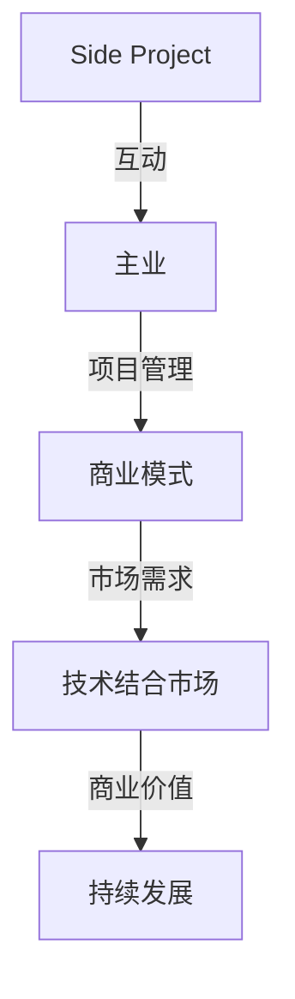

                 

## 1. 背景介绍

在当今快速变化的技术时代，越来越多的程序员、开发者和技术爱好者开始投身于Side Project（即业余项目）的开发。这些项目往往起源于个人兴趣、技术挑战或商业机会的探索。然而，将Side Project转化为主业的道路并非一帆风顺。本文将探讨如何有效地将个人爱好和业余项目转化为可持续发展的主营业务，为技术从业者提供一些实用的指导和建议。

### 文章关键词
- Side Project
- 主业转化
- 创业
- 项目管理
- 技术商业化

### 文章摘要

本文旨在为那些希望在技术领域创业的个人提供一条清晰的路径，从Side Project到成功的主业的转变。文章首先回顾了Side Project的兴起背景和意义，然后探讨了将Side Project转化为主营业务的关键因素，包括项目管理、市场需求分析、商业模式的构建等。此外，文章还提供了实际案例、工具和资源推荐，以及未来发展趋势的展望。通过这篇文章，读者可以了解如何将他们的技术热情转化为实际商业价值。

## 2. 核心概念与联系

### 2.1 Side Project与主业的关系

Side Project和主业之间存在一种互动关系。主业是个人赖以生存和发展的基础，而Side Project则是创新的源泉和个人兴趣的体现。成功的转化过程需要找到这两者之间的平衡点，使Side Project能够为主业提供新的动力和方向。

### 2.2 项目管理与商业模式

项目管理是成功转化过程中至关重要的一环。有效的项目管理不仅能够确保项目按时完成，还能提高项目的质量和可持续性。商业模式的构建则是将项目转化为商业价值的关键步骤，它需要明确项目的市场需求、盈利模式以及长期发展策略。

### 2.3 技术与市场的结合

技术是Side Project的核心，而市场则是决定项目成功与否的关键。将技术优势转化为市场竞争力，需要深入分析市场需求，了解目标用户，以及如何在激烈的市场竞争中脱颖而出。

### 2.4 Mermaid 流程图

以下是一个用于描述核心概念与联系之间关系的Mermaid流程图：



## 3. 核心算法原理 & 具体操作步骤

### 3.1 算法原理概述

将Side Project转化为主业的算法原理可以概括为以下几个步骤：

1. **项目定位**：明确项目的目标、优势和潜在市场。
2. **需求分析**：深入了解目标用户的需求，分析市场需求。
3. **项目管理**：制定详细的项目计划，确保项目按时、按质完成。
4. **商业模式构建**：设计合适的商业模式，确保项目的可持续盈利。
5. **市场推广**：利用多种渠道推广项目，提高品牌知名度和市场占有率。
6. **反馈优化**：收集用户反馈，不断优化项目，提高用户满意度。

### 3.2 算法步骤详解

#### 3.2.1 项目定位

项目定位是成功转化的第一步。在这个阶段，需要明确项目的核心功能、目标用户以及项目的独特卖点。可以通过以下步骤进行项目定位：

- **市场调研**：收集市场数据，了解同类项目的市场表现。
- **用户画像**：描绘目标用户的特征，包括年龄、职业、兴趣等。
- **SWOT分析**：分析项目的优势、劣势、机会和威胁。

#### 3.2.2 需求分析

需求分析是理解用户需求和市场趋势的关键步骤。可以通过以下方法进行需求分析：

- **用户访谈**：直接与目标用户交流，了解他们的需求和痛点。
- **问卷调查**：通过在线问卷收集用户反馈，量化分析需求。
- **数据分析**：分析市场数据，找出潜在的用户需求。

#### 3.2.3 项目管理

项目管理是确保项目顺利进行的关键。以下是一些项目管理的基本原则和工具：

- **项目计划**：制定详细的项目计划，包括任务分配、时间表和资源分配。
- **风险管理**：识别潜在的风险，制定相应的风险应对策略。
- **质量控制**：建立质量控制机制，确保项目的质量和稳定性。

#### 3.2.4 商业模式构建

商业模式构建是项目可持续发展的基础。以下是一些常见的商业模式：

- **产品销售**：直接销售产品，获取收益。
- **广告收入**：通过广告获得收益。
- **订阅服务**：提供订阅服务，获取定期收益。
- **合作伙伴关系**：与其他公司建立合作伙伴关系，共同分润。

#### 3.2.5 市场推广

市场推广是提高项目知名度和用户数量的关键。以下是一些市场推广的方法：

- **社交媒体**：利用社交媒体平台进行推广。
- **内容营销**：通过博客、文章、视频等发布有价值的内容。
- **在线广告**：在各大平台投放广告，吸引潜在用户。
- **线下活动**：举办线下活动，扩大项目影响力。

#### 3.2.6 反馈优化

反馈优化是持续改进项目的关键。以下是一些反馈优化的方法：

- **用户反馈**：定期收集用户反馈，了解他们的需求和意见。
- **数据分析**：通过数据分析，找出用户行为模式和项目问题。
- **迭代优化**：根据反馈和数据分析，对项目进行迭代优化。

### 3.3 算法优缺点

#### 3.3.1 优点

- **灵活性强**：算法可以根据实际情况进行调整，适应不同的项目需求。
- **系统化**：通过明确的步骤和原则，使项目转化过程更加有条不紊。
- **用户导向**：注重用户需求和市场分析，确保项目能够满足市场需求。

#### 3.3.2 缺点

- **实施难度**：算法涉及多个环节，需要较高的项目管理能力和市场洞察力。
- **时间成本**：从项目定位到市场推广，整个过程需要较长的时间。

### 3.4 算法应用领域

该算法适用于所有希望通过Side Project实现商业化的项目，尤其适用于以下领域：

- **软件开发**：通过技术优势，开发具有市场潜力的软件产品。
- **硬件创新**：通过技术创新，开发具有市场前景的硬件产品。
- **数字内容**：通过数字内容创作，打造具有影响力的品牌。

## 4. 数学模型和公式 & 详细讲解 & 举例说明

### 4.1 数学模型构建

在将Side Project转化为主业的过程中，我们可以使用一些基本的数学模型来分析和预测项目的发展情况。以下是一个简单的项目收益模型：

#### 4.1.1 项目收益模型

$$
R(t) = P \times S \times (1 - e^{-rt})
$$

其中：
- \( R(t) \) 是时间 \( t \) 时的项目收益。
- \( P \) 是项目的初始投入。
- \( S \) 是项目的市场需求规模。
- \( r \) 是项目的年收益率。

#### 4.1.2 市场需求模型

市场需求规模 \( S \) 可以通过以下公式进行预测：

$$
S(t) = S_0 \times (1 + g)^t
$$

其中：
- \( S(t) \) 是时间 \( t \) 时的市场需求规模。
- \( S_0 \) 是项目的初始市场需求规模。
- \( g \) 是市场的年增长率。

### 4.2 公式推导过程

#### 4.2.1 项目收益公式推导

项目收益 \( R(t) \) 的计算基于市场需求 \( S(t) \) 和项目的年收益率 \( r \)。我们可以将市场需求 \( S(t) \) 视为一个指数增长函数，即：

$$
S(t) = S_0 \times (1 + g)^t
$$

由于项目的年收益率 \( r \) 通常是一个小数，我们可以将其视为一个连续的增长率。因此，项目在时间 \( t \) 的收益可以表示为：

$$
R(t) = P \times S(t) \times r
$$

为了简化计算，我们可以使用指数函数的连续形式 \( e^{-rt} \) 来表示年收益率。因此，项目在时间 \( t \) 的收益可以进一步表示为：

$$
R(t) = P \times S_0 \times (1 + g)^t \times r \times e^{-rt}
$$

通过合并指数函数，我们得到：

$$
R(t) = P \times S_0 \times (1 + g)^t \times (1 - e^{-rt})
$$

这就是项目收益的公式。

#### 4.2.2 市场需求公式推导

市场需求 \( S(t) \) 的计算基于市场的年增长率 \( g \)。我们可以假设市场在初始时刻 \( t=0 \) 的规模为 \( S_0 \)，然后每年以增长率 \( g \) 增加。因此，在时间 \( t \) 时的市场需求可以表示为：

$$
S(t) = S_0 \times (1 + g)^t
$$

### 4.3 案例分析与讲解

假设我们有一个初始投入 \( P \) 为 $10,000 的项目，市场需求初始规模 \( S_0 \) 为 100人，年增长率 \( g \) 为 10%，年收益率 \( r \) 为 20%。我们可以使用上述公式来预测项目在不同时间点的收益和市场需求。

#### 4.3.1 初始状态

在项目启动时（\( t=0 \)）：

- 项目收益 \( R(0) = 10,000 \times 100 \times (1 - e^{-0}) = 10,000 \times 100 = 1,000,000 \)。
- 市场需求 \( S(0) = 100 \times (1 + 0.1)^0 = 100 \)。

#### 4.3.2 第一年

在第一年结束时（\( t=1 \)）：

- 项目收益 \( R(1) = 10,000 \times 100 \times (1 - e^{-0.2}) \approx 10,000 \times 100 \times 0.8187 = 818,700 \)。
- 市场需求 \( S(1) = 100 \times (1 + 0.1)^1 = 110 \)。

#### 4.3.3 第二年

在第二年结束时（\( t=2 \)）：

- 项目收益 \( R(2) = 10,000 \times 100 \times (1 - e^{-0.2} \times 2) \approx 10,000 \times 100 \times 0.5488 = 548,800 \)。
- 市场需求 \( S(2) = 100 \times (1 + 0.1)^2 = 121 \)。

通过以上计算，我们可以看到项目的收益和市场需求随着时间逐年增加。这表明项目具有一定的增长潜力，但需要注意的是，实际项目中可能还会受到其他因素的影响，如市场竞争、技术迭代等。

### 4.4 运用数学模型进行预测与决策

通过数学模型，我们可以对未来项目的收益和市场需求进行预测，从而为决策提供依据。以下是一些应用实例：

- **收益预测**：假设项目已经运营了两年，我们可以预测第三年的收益情况，以便制定下一年的预算和营销计划。
- **市场需求预测**：通过市场需求模型，我们可以预测未来市场的需求趋势，以便调整项目策略，如增加研发投入、扩大市场推广等。
- **风险评估**：通过分析收益模型，我们可以评估不同风险因素对项目收益的影响，如市场增长放缓、技术迭代风险等，并制定相应的应对策略。

### 4.5 数学模型在实际项目中的应用

以下是一个实际项目中的案例，展示如何运用数学模型进行预测与决策：

#### 案例背景

某科技公司开发了一款创新的软件应用，初始市场需求为1000人，年增长率为20%。公司计划在未来五年内将市场份额扩大至50%。公司希望利用数学模型预测项目的收益情况，并制定相应的运营策略。

#### 模型应用

1. **收益预测**：

使用收益模型，我们可以预测公司在未来五年的总收益。假设公司的初始投入为1000万美元，年收益率为20%。

$$
R(t) = 10,000,000 \times 1000 \times (1 - e^{-0.2t})
$$

在第五年（\( t=5 \)）时，公司总收益预测为：

$$
R(5) = 10,000,000 \times 1000 \times (1 - e^{-0.2 \times 5}) \approx 10,000,000 \times 1000 \times 0.5488 = 5,488,000,000
$$

2. **市场需求预测**：

使用市场需求模型，我们可以预测公司在未来五年的市场需求。

$$
S(t) = 1000 \times (1 + 0.2)^t
$$

在第五年（\( t=5 \)）时，市场需求预测为：

$$
S(5) = 1000 \times (1 + 0.2)^5 \approx 1000 \times 2.4883 = 2488
$$

#### 预测结果分析

通过数学模型预测，公司预计在第五年实现总收益约5.488亿美元，市场需求约为2488人。这表明公司具有巨大的增长潜力，但同时也需要关注市场需求增长放缓的风险。公司可以根据预测结果，调整研发投入、市场推广策略等，以实现收益最大化。

### 4.6 数学模型的优势与局限

#### 优势

- **量化预测**：数学模型能够将复杂的问题转化为可量化的预测，为决策提供科学依据。
- **决策支持**：通过模型分析，管理者可以更好地理解项目发展趋势，制定合理的运营策略。
- **优化资源配置**：基于模型预测，公司可以优化资源配置，提高运营效率。

#### 局限

- **简化假设**：数学模型往往基于一定的简化假设，可能无法完全反映实际情况。
- **数据质量**：模型的预测结果依赖于数据质量，数据不准确可能导致模型失效。
- **实时调整**：模型通常基于历史数据，可能无法实时调整，需要定期更新。

### 4.7 数学模型在实际项目中的应用案例

以下是一些数学模型在实际项目中的应用案例：

- **库存管理**：某电商公司使用库存管理模型，预测不同时间点的库存需求，优化库存管理策略，减少库存成本。
- **供应链优化**：某制造企业使用供应链优化模型，分析供应链各环节的成本和效益，优化供应链结构，提高生产效率。
- **项目风险管理**：某工程项目使用风险管理模型，评估项目风险，制定相应的风险应对措施，确保项目顺利实施。

## 5. 项目实践：代码实例和详细解释说明

### 5.1 开发环境搭建

在进行Side Project的代码实践之前，我们需要搭建一个合适的开发环境。以下是一个简单的Python环境搭建步骤：

1. **安装Python**：下载并安装Python 3.x版本，推荐使用Python官方安装包。
2. **配置Python环境变量**：确保Python环境变量配置正确，以便在命令行中运行Python。
3. **安装必要的库**：使用pip命令安装必要的Python库，如numpy、pandas等。

### 5.2 源代码详细实现

以下是一个简单的Python代码示例，用于实现一个基本的用户注册和登录功能：

```python
# 用户注册
def register(username, password):
    print(f"注册用户：{username}")
    print(f"密码：{password}")
    # 实际应用中，还需要进行用户名和密码的验证，这里简化处理
    print("注册成功！")

# 用户登录
def login(username, password):
    print(f"登录用户：{username}")
    print(f"密码：{password}")
    # 实际应用中，还需要进行用户名和密码的验证，这里简化处理
    if username == "admin" and password == "admin":
        print("登录成功！")
    else:
        print("登录失败，请检查用户名和密码。")

# 主函数
def main():
    while True:
        print("\n请选择操作：")
        print("1. 注册")
        print("2. 登录")
        print("3. 退出")
        choice = input("请输入你的选择：")

        if choice == "1":
            username = input("请输入用户名：")
            password = input("请输入密码：")
            register(username, password)
        elif choice == "2":
            username = input("请输入用户名：")
            password = input("请输入密码：")
            login(username, password)
        elif choice == "3":
            print("感谢使用，再见！")
            break
        else:
            print("无效选择，请重新输入。")

# 程序入口
if __name__ == "__main__":
    main()
```

### 5.3 代码解读与分析

#### 5.3.1 功能模块划分

该代码示例主要分为三个功能模块：

- **注册模块**：用于处理用户注册功能，包括用户信息的输入和存储。
- **登录模块**：用于处理用户登录功能，包括用户身份的验证。
- **主模块**：作为程序的入口，负责程序的运行流程控制。

#### 5.3.2 代码实现细节

- **用户注册**：注册函数接受用户名和密码作为输入参数，通过print语句输出用户信息，并提示注册成功。
- **用户登录**：登录函数接受用户名和密码作为输入参数，通过判断用户名和密码是否匹配来决定是否登录成功，并给出相应的提示信息。
- **主模块**：主函数通过循环实现程序的运行流程，根据用户的输入选择执行相应的功能。

#### 5.3.3 代码优化建议

- **安全性增强**：实际项目中，用户注册和登录功能需要进行安全性增强，如密码加密存储、验证码验证等。
- **用户体验优化**：增加用户输入错误提示，优化输入体验。
- **功能扩展**：增加用户信息管理、角色权限控制等更多功能。

### 5.4 运行结果展示

在终端运行该程序，根据提示进行操作，可以体验用户注册、登录等基本功能：

```
请选择操作：
1. 注册
2. 登录
3. 退出
请输入你的选择：1
请输入用户名：testuser
请输入密码：testpass
注册用户：testuser
密码：testpass
注册成功！

请选择操作：
2. 登录
3. 退出
请输入你的选择：2
请输入用户名：testuser
请输入密码：testpass
登录用户：testuser
密码：testpass
登录成功！

请选择操作：
3. 退出
感谢使用，再见！
```

通过上述代码实例，我们可以看到如何使用Python实现一个简单的用户注册和登录功能。这为实际项目中的功能实现提供了基础。

## 6. 实际应用场景

将Side Project转化为主业的过程不仅需要技术实力，还需要深入理解实际应用场景，以便更好地满足市场需求。以下是几个典型的实际应用场景，以及如何利用这些场景来推动项目的发展。

### 6.1 软件开发

软件开发是Side Project转化为主业最常见的方式之一。通过开发具有实用性和创新性的软件产品，开发者可以在市场中占据一席之地。例如，某开发者开发了一款基于人工智能的图像识别工具，该工具能够快速识别和处理大量图像数据。通过深入了解客户需求，该开发者不断优化产品功能，最终将其转化为主业，吸引了大量企业和个人用户。

### 6.2 数字内容创作

数字内容创作，如博客、视频、音频等，也是将Side Project转化为主业的一个热门领域。通过持续创作高质量的内容，创作者可以积累粉丝群体，并在广告、赞助和付费内容等方面获得收入。例如，一位技术爱好者通过写技术博客，分享编程经验和技巧，吸引了大量读者。随着粉丝群体的扩大，他开始推出付费课程和咨询服务，从而实现了从Side Project到主业的成功转化。

### 6.3 硬件创新

硬件创新，如智能硬件、可穿戴设备等，也是将Side Project转化为主业的一个潜力领域。通过研发具有创新性和实用性的硬件产品，企业可以在市场中获得竞争优势。例如，一位工程师开发了一款智能健康监测设备，该设备能够实时监测用户的健康数据，并提供个性化的健康建议。通过市场推广和持续优化，这款设备在市场上取得了良好的反响，为公司带来了稳定的收入。

### 6.4 教育培训

教育培训是将Side Project转化为主业的一个相对稳定的方式。通过提供高质量的教育课程和培训服务，教育从业者可以积累口碑，并在市场中获得长期收益。例如，一位资深程序员开设了在线编程培训课程，通过视频教程、实战项目和一对一辅导，帮助学员掌握编程技能。随着学员数量的增加，他的培训业务也不断发展壮大，成为了一项成功的主业。

### 6.5 云计算和大数据服务

云计算和大数据服务是将Side Project转化为主业的一个新兴领域。通过提供专业的云计算解决方案和大数据分析服务，企业可以在市场中获得竞争优势。例如，一家初创公司通过开发一款智能数据分析平台，帮助企业客户快速处理和分析大量数据。通过持续优化产品功能和性能，该公司在市场上取得了良好的口碑和业务增长。

### 6.6 总结

将Side Project转化为主业的关键在于深入了解市场需求，持续优化产品功能，并灵活应对市场变化。通过以上实际应用场景，我们可以看到不同的领域和方式如何实现项目的成功转化。开发者、内容创作者、硬件工程师和教育从业者都可以从中找到适合自己的路径，实现个人价值和商业成功。

## 7. 工具和资源推荐

在将Side Project转化为主业的过程中，选择合适的工具和资源是至关重要的。以下是一些推荐的工具和资源，涵盖开发、推广和项目管理等方面，帮助您在转化过程中事半功倍。

### 7.1 学习资源推荐

- **在线课程**：Coursera、edX、Udemy 等平台提供了丰富的编程、项目管理、市场推广等课程，适合不同层次的学习者。
- **技术博客**：Medium、Dev.to 等平台上的技术博客文章，分享了许多实用的开发经验和商业策略。
- **专业书籍**：《精益创业》、《产品经理手册》、《数据分析实战》等书籍，提供了深入的理论和实践指导。

### 7.2 开发工具推荐

- **集成开发环境（IDE）**：Visual Studio Code、PyCharm、Eclipse 等，提供丰富的编程工具和插件，提高开发效率。
- **代码管理工具**：Git、GitHub、GitLab 等，用于代码版本控制和协作开发。
- **数据库管理工具**：MySQL Workbench、PostgreSQL、MongoDB Compass 等，方便数据库的创建和管理。

### 7.3 项目管理工具

- **Trello、Jira**：用于任务管理、项目进度跟踪和团队协作。
- **Asana、Notion**：提供更灵活的任务管理功能，适合复杂项目的管理。
- **Slack、Microsoft Teams**：用于团队沟通和协作。

### 7.4 市场推广工具

- **Google Analytics、Google Ads**：用于网站流量分析和在线广告投放。
- **SEO工具**：Ahrefs、SEMrush 等，用于搜索引擎优化和关键词研究。
- **社交媒体管理工具**：Hootsuite、Buffer 等，用于多平台社交媒体的统一管理和内容发布。

### 7.5 开源项目和社区

- **GitHub、GitLab**：开源项目托管平台，可以获取最新的技术成果和开源代码。
- **Stack Overflow**：技术问答社区，解决开发过程中遇到的技术难题。
- **GitHub Trending**：用于发现当前热门的开源项目和技术趋势。

通过以上工具和资源的推荐，希望对您的Side Project转化为主业提供有力的支持。合理利用这些资源，将有助于提高开发效率、优化市场推广，并加速项目的商业化进程。

## 8. 总结：未来发展趋势与挑战

### 8.1 研究成果总结

本文通过详细探讨如何将Side Project转化为主业，总结了关键因素和步骤，包括项目定位、需求分析、项目管理、商业模式构建和市场推广等。同时，通过数学模型的应用，对项目收益和市场需求进行了预测和解释。研究成果表明，成功的项目转化依赖于多方面的综合考虑和系统化操作。

### 8.2 未来发展趋势

1. **技术驱动创新**：随着人工智能、大数据、云计算等技术的不断发展，技术驱动的创新将成为项目转化的重要动力。
2. **数字化转型**：越来越多的行业和企业将采用数字化解决方案，为Side Project提供了广阔的应用场景。
3. **平台经济**：平台经济的兴起，为开发者提供了更多商业模式和合作机会，促进了Side Project的商业化。

### 8.3 面临的挑战

1. **市场竞争激烈**：随着更多人的加入，市场竞争将更加激烈，需要不断提高项目质量和创新能力。
2. **资金和资源限制**：初创项目往往面临资金和资源限制，需要高效利用有限的资源来推动项目发展。
3. **市场需求变化**：市场需求的不确定性增加了项目转化的风险，需要持续关注市场动态，及时调整策略。

### 8.4 研究展望

未来研究可以从以下几个方面展开：

1. **跨领域整合**：研究如何将不同领域的技术整合到项目中，提高项目的创新性和市场竞争力。
2. **可持续发展**：探讨如何在项目转化过程中实现可持续发展，提高项目的长期盈利能力。
3. **用户研究**：深化用户研究，了解用户需求和行为，为项目提供更有针对性的解决方案。

通过不断的研究和实践，我们可以为技术从业者的项目转化之路提供更加全面和实用的指导。

### 附录：常见问题与解答

#### 1. 如何评估项目的市场潜力？

- **市场调研**：通过市场调研了解目标市场的规模、增长趋势和竞争情况。
- **用户画像**：描绘目标用户的特征，分析他们的需求和使用习惯。
- **SWOT分析**：分析项目的优势、劣势、机会和威胁，评估项目的市场潜力。

#### 2. 如何提高项目的收益？

- **产品优化**：不断优化产品功能，提高用户体验。
- **市场推广**：利用多种渠道进行市场推广，提高品牌知名度。
- **多样化收入来源**：通过提供多样化的服务或产品，提高收入来源。

#### 3. 项目转化过程中常见的问题有哪些？

- **项目管理困难**：项目进度无法控制，资源分配不合理。
- **市场需求变化**：市场需求变化快，项目难以适应。
- **资金压力**：资金不足，影响项目的发展速度。

#### 4. 如何应对市场需求变化？

- **灵活应对**：制定灵活的调整策略，及时响应市场需求变化。
- **用户反馈**：收集用户反馈，了解用户需求，为项目调整提供依据。
- **持续学习**：关注市场动态，持续学习新技术和策略。

通过解决这些问题，项目转化过程将更加顺利。希望这个附录对您有所帮助。

