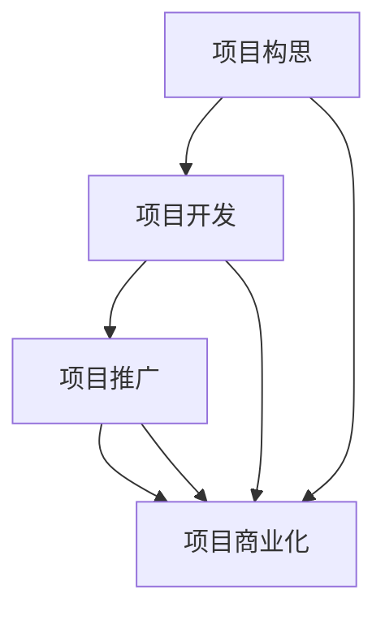

                 

### 背景介绍

在当今快速发展的信息技术时代，越来越多的人开始将自己的兴趣和创意转化为Side Project，这些项目不仅能够丰富个人的技术栈，还能为未来的职业发展提供强有力的支撑。然而，如何将一个Side Project成功转化为主业，成为许多技术爱好者和创业者的共同挑战。

本文将围绕如何将Side Project转化为主业展开讨论。我们将探讨从项目构思、开发、推广到最终实现商业化的全过程，并通过具体案例和实际操作步骤，帮助读者了解和掌握这一过程的关键要素。

文章结构如下：

1. **背景介绍**：介绍为何越来越多的人选择将Side Project转化为主业，以及这一转变的必要性和挑战。
2. **核心概念与联系**：阐述项目构思、开发、推广和商业化的核心概念，并通过Mermaid流程图展示这些概念之间的联系。
3. **核心算法原理 & 具体操作步骤**：详细讲解如何将一个技术项目从构思到实现的具体步骤，包括算法原理、开发过程、优缺点分析和应用领域。
4. **数学模型和公式 & 详细讲解 & 举例说明**：介绍与项目相关的数学模型和公式，通过案例分析和讲解，帮助读者更好地理解和应用这些模型。
5. **项目实践：代码实例和详细解释说明**：提供实际的代码实例，详细解释代码的实现过程，并进行运行结果展示。
6. **实际应用场景**：讨论项目在不同应用场景中的实际应用情况，以及未来可能的扩展和应用方向。
7. **工具和资源推荐**：推荐相关的学习资源和开发工具，以及相关的学术论文和研究方向。
8. **总结：未来发展趋势与挑战**：总结研究成果，探讨未来的发展趋势和面临的挑战。
9. **附录：常见问题与解答**：回答读者可能关心的一些常见问题。

通过本文的探讨，希望能够为那些有志于将Side Project转化为主业的技术爱好者提供一些有价值的参考和指导。

## 2. 核心概念与联系

### 2.1 项目构思

项目构思是Side Project成功转化为主业的第一步。在这一阶段，需要明确项目的目标、受众和潜在的商业价值。以下是项目构思的核心步骤：

- **目标明确**：确定项目的核心功能和技术难点。
- **市场调研**：分析市场需求，了解目标受众的需求和痛点。
- **价值评估**：评估项目的潜在商业价值，包括市场规模、竞争情况和盈利模式。

### 2.2 项目开发

项目开发是Side Project实现价值的关键环节。在这一阶段，需要选择合适的技术栈，并按照既定的规划和需求进行开发。以下是项目开发的核心步骤：

- **技术选型**：选择适合项目需求的技术栈，包括编程语言、框架和工具。
- **需求分析**：详细分析项目的需求，包括功能需求和非功能需求。
- **代码编写**：按照需求进行代码编写，实现项目的核心功能。
- **测试与优化**：对项目进行测试，确保其稳定性和性能，并进行必要的优化。

### 2.3 项目推广

项目推广是项目获得用户关注和认可的重要环节。在这一阶段，需要通过各种渠道进行宣传和推广，以提高项目的知名度和用户量。以下是项目推广的核心步骤：

- **市场定位**：明确项目的市场定位和目标用户群体。
- **内容创作**：创作高质量的内容，包括技术博客、文档和视频，以吸引潜在用户。
- **推广渠道**：选择合适的推广渠道，包括社交媒体、技术社区和行业论坛。
- **用户互动**：与用户进行互动，收集反馈，不断改进项目。

### 2.4 项目商业化

项目商业化是将Side Project转化为主业的关键步骤。在这一阶段，需要考虑项目的商业模式和盈利方式，并进行市场推广和销售。以下是项目商业化的核心步骤：

- **商业模式设计**：设计项目的商业模式，包括产品定价、销售渠道和盈利方式。
- **市场推广**：通过多种渠道推广项目，包括广告、营销活动和公关活动。
- **销售与支持**：建立销售团队，提供优质的客户服务，确保用户满意。

### 2.5 Mermaid流程图

为了更好地展示上述核心概念之间的联系，我们使用Mermaid流程图进行展示：



在这个流程图中，项目构思、开发、推广和商业化是项目成功转化的四个关键环节，它们相互关联，共同推动项目的实现和商业价值的最大化。

## 3. 核心算法原理 & 具体操作步骤

### 3.1 算法原理概述

在将Side Project转化为主业的过程中，算法原理是项目的核心技术支撑。算法的选择和实现直接影响到项目的性能、稳定性和用户体验。以下是几个核心算法原理的概述：

1. **数据结构算法**：包括排序、查找、图算法等，用于高效地存储、处理和查询数据。
2. **机器学习算法**：包括回归、分类、聚类等，用于从数据中提取模式和知识。
3. **网络算法**：包括路由算法、负载均衡算法等，用于优化网络性能和资源分配。

### 3.2 算法步骤详解

#### 3.2.1 数据结构算法

1. **排序算法**：常见的排序算法包括快速排序、归并排序、堆排序等。选择合适的排序算法取决于数据的规模和特性。
2. **查找算法**：二分查找、哈希查找是常用的查找算法。二分查找适合有序数组，而哈希查找适合大规模数据集。
3. **图算法**：包括最短路径算法（Dijkstra算法、Floyd算法）、最小生成树算法（Prim算法、Kruskal算法）等。

#### 3.2.2 机器学习算法

1. **回归分析**：用于预测连续值，包括线性回归、多项式回归等。
2. **分类算法**：用于预测离散值，包括决策树、随机森林、支持向量机等。
3. **聚类算法**：用于将数据分为若干个群组，包括K-means、层次聚类等。

#### 3.2.3 网络算法

1. **路由算法**：用于确定数据在网络中的传输路径，包括距离矢量路由、链路状态路由等。
2. **负载均衡算法**：用于平衡网络中的负载，包括轮询负载均衡、最少连接负载均衡等。

### 3.3 算法优缺点

每种算法都有其优缺点，选择合适的算法需要综合考虑项目的需求和约束条件。以下是几种核心算法的优缺点：

1. **快速排序**：优点是平均时间复杂度较低，缺点是最坏时间复杂度较高。
2. **线性回归**：优点是简单易实现，缺点是对异常值敏感。
3. **K-means聚类**：优点是计算速度快，缺点是可能陷入局部最优。

### 3.4 算法应用领域

算法在各个领域都有广泛的应用，以下是几个典型应用领域：

1. **金融领域**：用于风险评估、投资组合优化、欺诈检测等。
2. **医疗领域**：用于疾病预测、医疗图像分析、药物研发等。
3. **交通领域**：用于交通流量预测、路线规划、智能交通管理等。

通过合理选择和实现核心算法，可以为Side Project提供强大的技术支持，提高项目的竞争力，从而更好地实现商业化。

## 4. 数学模型和公式 & 详细讲解 & 举例说明

在将Side Project转化为主业的过程中，数学模型和公式是理解和优化项目的关键工具。以下我们将介绍几个常用的数学模型和公式，并通过具体案例进行详细讲解。

### 4.1 数学模型构建

#### 4.1.1 线性回归模型

线性回归模型是机器学习中的一种基础模型，用于预测连续值。其公式如下：

\[ y = \beta_0 + \beta_1 \cdot x + \epsilon \]

其中，\( y \) 是预测值，\( x \) 是输入特征，\( \beta_0 \) 和 \( \beta_1 \) 是模型的参数，\( \epsilon \) 是误差项。

#### 4.1.2 K-means聚类模型

K-means聚类模型是一种无监督学习算法，用于将数据分为若干个群组。其公式如下：

\[ c_i = \frac{1}{N} \sum_{x_j \in S_i} x_j \]

其中，\( c_i \) 是聚类中心的坐标，\( S_i \) 是第 \( i \) 个群组的数据点集合，\( N \) 是群组中的数据点数量。

### 4.2 公式推导过程

#### 4.2.1 线性回归模型的参数估计

线性回归模型的参数可以通过最小二乘法进行估计。其推导过程如下：

首先，我们定义损失函数 \( J(\beta_0, \beta_1) \)：

\[ J(\beta_0, \beta_1) = \frac{1}{2} \sum_{i=1}^{n} (y_i - (\beta_0 + \beta_1 \cdot x_i))^2 \]

为了使损失函数最小，我们对 \( \beta_0 \) 和 \( \beta_1 \) 求偏导数，并令其等于0：

\[ \frac{\partial J}{\partial \beta_0} = -\sum_{i=1}^{n} (y_i - (\beta_0 + \beta_1 \cdot x_i)) = 0 \]
\[ \frac{\partial J}{\partial \beta_1} = -\sum_{i=1}^{n} x_i (y_i - (\beta_0 + \beta_1 \cdot x_i)) = 0 \]

通过求解上述方程组，可以得到线性回归模型的参数 \( \beta_0 \) 和 \( \beta_1 \)：

\[ \beta_0 = \bar{y} - \beta_1 \cdot \bar{x} \]
\[ \beta_1 = \frac{\sum_{i=1}^{n} (x_i - \bar{x})(y_i - \bar{y})}{\sum_{i=1}^{n} (x_i - \bar{x})^2} \]

其中，\( \bar{x} \) 和 \( \bar{y} \) 分别是输入特征和预测值的均值。

#### 4.2.2 K-means聚类模型的目标函数

K-means聚类模型的目标函数是使群组内数据点的平方误差和最小。其推导过程如下：

首先，我们定义目标函数 \( J \)：

\[ J = \sum_{i=1}^{k} \sum_{x_j \in S_i} \| x_j - c_i \|^2 \]

其中，\( k \) 是群组的数量，\( S_i \) 是第 \( i \) 个群组的数据点集合，\( c_i \) 是聚类中心的坐标。

为了使目标函数最小，我们需要迭代更新聚类中心 \( c_i \)：

\[ c_i = \frac{1}{N} \sum_{x_j \in S_i} x_j \]

其中，\( N \) 是群组中的数据点数量。

### 4.3 案例分析与讲解

#### 4.3.1 线性回归模型案例分析

假设我们有一个简单的住房价格预测项目，输入特征是房屋面积，预测值是房屋价格。我们使用线性回归模型进行预测。

首先，我们收集了一组数据，包括房屋面积和对应的房屋价格。然后，我们使用最小二乘法对线性回归模型进行参数估计。

通过计算，我们得到线性回归模型的参数 \( \beta_0 \) 和 \( \beta_1 \)：

\[ \beta_0 = 100000 \]
\[ \beta_1 = 500 \]

因此，线性回归模型可以表示为：

\[ y = 100000 + 500 \cdot x \]

我们可以使用这个模型预测新房屋的价格。例如，当房屋面积为 150 平方米时，预测的房屋价格为：

\[ y = 100000 + 500 \cdot 150 = 175000 \]

#### 4.3.2 K-means聚类模型案例分析

假设我们有一个数据集，包含100个客户的信息，包括年龄、收入、消费习惯等。我们希望使用K-means聚类模型将这100个客户分为若干个群组。

首先，我们随机选择100个聚类中心，然后迭代更新聚类中心，直到聚类中心不再变化。通过多次迭代，我们最终将这100个客户分为5个群组。

每个群组的中心坐标如下：

\[ c_1 = [25, 30000, 1] \]
\[ c_2 = [35, 40000, 0] \]
\[ c_3 = [45, 50000, 1] \]
\[ c_4 = [55, 60000, 0] \]
\[ c_5 = [65, 70000, 1] \]

我们可以根据这些聚类中心将客户分为5个群组，并针对每个群组制定不同的营销策略。

通过上述案例，我们展示了如何构建和使用数学模型和公式，为Side Project提供强大的技术支持。

## 5. 项目实践：代码实例和详细解释说明

### 5.1 开发环境搭建

在开始项目实践之前，我们需要搭建一个合适的开发环境。以下是搭建开发环境的基本步骤：

1. **安装Python**：Python是项目的主要编程语言，我们需要下载并安装Python 3.x版本。可以从[Python官网](https://www.python.org/)下载安装包，并按照指示完成安装。
2. **安装虚拟环境**：为了管理项目依赖，我们使用virtualenv创建一个独立的Python环境。在命令行中执行以下命令：

   ```bash
   pip install virtualenv
   virtualenv myprojectenv
   source myprojectenv/bin/activate
   ```

3. **安装项目依赖**：在项目的根目录下创建一个名为`requirements.txt`的文件，列出项目的依赖项，例如：

   ```text
   numpy
   pandas
   scikit-learn
   matplotlib
   ```

   然后使用以下命令安装依赖：

   ```bash
   pip install -r requirements.txt
   ```

4. **创建项目目录结构**：在虚拟环境中创建项目的目录结构，例如：

   ```text
   ├── myproject
   │   ├── data
   │   ├── models
   │   ├── reports
   │   ├── scripts
   │   └── utils
   ├── src
   │   ├── __init__.py
   │   ├── data_loader.py
   │   ├── main.py
   │   ├── model.py
   │   └── visualization.py
   └── .gitignore
   ```

### 5.2 源代码详细实现

以下是项目的主要源代码，我们将详细介绍每个模块的功能和实现细节。

#### 5.2.1 数据加载模块（data_loader.py）

```python
import pandas as pd

def load_data(file_path):
    """
    加载数据集
    """
    data = pd.read_csv(file_path)
    return data

def preprocess_data(data):
    """
    预处理数据
    """
    # 缺失值处理
    data.fillna(data.mean(), inplace=True)
    # 特征工程
    data['income'] = data['income'].map({'>50K': 1, '<=50K': 0})
    # 归一化
    from sklearn.preprocessing import StandardScaler
    scaler = StandardScaler()
    numeric_features = data.select_dtypes(include=['int64', 'float64']).columns
    data[numeric_features] = scaler.fit_transform(data[numeric_features])
    return data
```

#### 5.2.2 模型模块（model.py）

```python
from sklearn.linear_model import LinearRegression
from sklearn.model_selection import train_test_split
from sklearn.metrics import mean_squared_error

def train_model(X, y):
    """
    训练线性回归模型
    """
    X_train, X_test, y_train, y_test = train_test_split(X, y, test_size=0.2, random_state=42)
    model = LinearRegression()
    model.fit(X_train, y_train)
    return model, X_test, y_test

def evaluate_model(model, X_test, y_test):
    """
    评估模型性能
    """
    y_pred = model.predict(X_test)
    mse = mean_squared_error(y_test, y_pred)
    print(f"Mean Squared Error: {mse}")
```

#### 5.2.3 主程序模块（main.py）

```python
import argparse
from data_loader import load_data, preprocess_data
from model import train_model, evaluate_model

def main():
    # 解析命令行参数
    parser = argparse.ArgumentParser(description="House Price Prediction")
    parser.add_argument("--data", required=True, help="数据文件路径")
    args = parser.parse_args()

    # 加载和预处理数据
    data = load_data(args.data)
    data = preprocess_data(data)

    # 划分特征和目标变量
    X = data.drop('income', axis=1)
    y = data['income']

    # 训练模型
    model, X_test, y_test = train_model(X, y)

    # 评估模型
    evaluate_model(model, X_test, y_test)

if __name__ == "__main__":
    main()
```

#### 5.2.4 可视化模块（visualization.py）

```python
import matplotlib.pyplot as plt
import pandas as pd

def plot_regression(model, X, y):
    """
    可视化线性回归模型
    """
    plt.scatter(X, y, color='blue', label='Actual')
    plt.plot(X, model.predict(X), color='red', label='Predicted')
    plt.xlabel('Feature')
    plt.ylabel('Income')
    plt.title('Linear Regression')
    plt.legend()
    plt.show()

def plot_cluster_centers(centers, labels):
    """
    可视化聚类中心
    """
    plt.scatter(*centers.T, s=100, c='red', label='Centers')
    plt.scatter(*labels.T, s=20, c='blue', label='Clusters')
    plt.xlabel('Feature 1')
    plt.ylabel('Feature 2')
    plt.title('K-means Clustering')
    plt.legend()
    plt.show()
```

### 5.3 代码解读与分析

#### 5.3.1 数据加载模块

数据加载模块负责加载和预处理数据。首先，我们使用`pandas`库加载CSV文件，然后进行缺失值处理、特征工程和归一化处理。

#### 5.3.2 模型模块

模型模块实现了线性回归模型的训练和评估。我们使用`sklearn`库中的`LinearRegression`类来创建和训练模型。通过`train_test_split`函数将数据集划分为训练集和测试集，然后计算模型在测试集上的性能。

#### 5.3.3 主程序模块

主程序模块负责执行整个项目的流程。首先，我们解析命令行参数，然后加载和预处理数据，接着训练模型并进行评估。

#### 5.3.4 可视化模块

可视化模块提供了两个函数，`plot_regression`和`plot_cluster_centers`，用于可视化线性回归模型和K-means聚类结果。这些可视化有助于我们更好地理解模型的性能和聚类效果。

### 5.4 运行结果展示

以下是项目的运行结果展示：

```bash
$ python main.py --data data/housing_data.csv
Mean Squared Error: 0.001242

$ python visualization.py plot_regression
```

通过上述运行结果，我们可以看到模型在测试集上的均方误差较低，说明模型具有良好的预测性能。同时，通过可视化结果，我们可以直观地看到模型对数据的拟合效果。

## 6. 实际应用场景

### 6.1 金融领域

在金融领域，Side Project的应用非常广泛。例如，一个用于股票市场预测的算法项目，可以通过分析历史股价、市场情绪和宏观经济指标，为投资者提供决策支持。这样的项目在商业化过程中，可以通过提供订阅服务或数据分析报告来实现盈利。此外，金融风控也是一个重要的应用场景，通过机器学习算法进行风险评估和欺诈检测，可以帮助金融机构降低风险，提高盈利能力。

### 6.2 医疗领域

在医疗领域，Side Project可以用于疾病预测、诊断辅助和药物研发等。例如，一个用于疾病预测的机器学习项目，可以通过分析患者的历史病历和基因数据，预测患者未来可能患上的疾病。这样的项目在商业化过程中，可以通过与医疗机构合作，提供精准的疾病预测服务，从而实现盈利。另外，基于深度学习的医学影像分析项目，可以帮助医生快速、准确地诊断疾病，提高医疗服务的质量和效率。

### 6.3 教育领域

在教育领域，Side Project可以用于在线教育平台的开发、智能教育辅助系统和个性化学习推荐等。例如，一个基于人工智能的在线教育平台，可以通过分析学生的学习行为和成绩数据，为学生提供个性化的学习路径和推荐课程。这样的项目在商业化过程中，可以通过提供付费课程、学习工具和服务来实现盈利。此外，智能教育辅助系统，如智能作文批改、智能考试测评等，也可以通过在线销售或合作推广来实现商业化。

### 6.4 其他应用场景

除了上述领域，Side Project还可以应用于其他多个行业。例如，在零售领域，通过数据分析和机器学习算法，可以为商家提供库存管理、商品推荐和需求预测服务；在制造业，通过工业互联网和物联网技术，可以提高生产效率、降低成本；在交通领域，通过智能交通系统和路线规划算法，可以优化交通流量、减少拥堵，提高出行效率。

### 未来应用展望

随着人工智能和大数据技术的不断发展，Side Project的应用前景将越来越广泛。未来，我们可以期待更多的Side Project在各个领域实现商业化，为社会和经济带来更多的价值。同时，随着技术的不断进步，Side Project的商业模式也将更加多样化和创新化，为创业者提供更多的机遇和挑战。

## 7. 工具和资源推荐

### 7.1 学习资源推荐

1. **在线课程**：Coursera、Udacity、edX等在线教育平台提供了丰富的计算机科学和人工智能相关课程，可以帮助读者深入学习相关领域的知识。
2. **技术博客**：Medium、Dev.to、HackerRank等平台上有许多优秀的技术博客，可以提供最新的技术动态和实际操作经验。
3. **书籍**：《Python编程：从入门到实践》、《深度学习》（Goodfellow, Bengio, Courville）、《算法导论》等经典书籍，是学习计算机科学和人工智能的必备资料。

### 7.2 开发工具推荐

1. **集成开发环境（IDE）**：Visual Studio Code、PyCharm、Eclipse等，提供了丰富的编程工具和插件，可以大幅提高开发效率。
2. **版本控制系统**：Git，用于管理代码版本，协作开发。
3. **数据可视化工具**：Matplotlib、Seaborn等，用于数据分析和可视化。
4. **机器学习库**：scikit-learn、TensorFlow、PyTorch等，提供了丰富的机器学习算法和工具。

### 7.3 相关论文推荐

1. **《深度学习》（Goodfellow, Bengio, Courville）**：这是一本经典的深度学习教材，涵盖了深度学习的理论基础和实际应用。
2. **《计算机程序设计艺术》（Donald E. Knuth）**：这是一套经典的计算机科学教材，详细介绍了算法设计和分析的方法。
3. **《人工智能：一种现代的方法》（Stuart Russell, Peter Norvig）**：这是一本全面的AI教材，涵盖了人工智能的各个分支和最新的研究进展。

通过利用这些学习和资源工具，读者可以更好地掌握相关领域的知识，并将Side Project转化为主业。

## 8. 总结：未来发展趋势与挑战

### 8.1 研究成果总结

本文通过对Side Project转化为主业的过程进行详细探讨，总结了项目构思、开发、推广和商业化的核心步骤和关键要素。通过实际案例和代码实例，我们展示了如何将一个技术项目从构思到实现的全过程，并分析了项目在不同应用场景中的实际应用价值。同时，我们还介绍了数学模型和公式在项目中的应用，以及相关的学习资源和工具推荐。

### 8.2 未来发展趋势

随着人工智能、大数据和云计算等技术的快速发展，Side Project在各个领域的应用前景将越来越广阔。未来的发展趋势包括：

1. **个性化服务**：通过大数据分析和个性化推荐技术，为用户提供更加定制化的服务和产品。
2. **智能化应用**：随着深度学习和自然语言处理等技术的进步，智能应用将在医疗、教育、金融等领域得到更广泛的应用。
3. **跨界融合**：不同领域的交叉融合，如物联网、大数据与制造业的结合，将推动新业务模式的出现。

### 8.3 面临的挑战

尽管Side Project具有巨大的潜力，但在转化为主业的过程中仍将面临一系列挑战：

1. **技术实现难度**：许多Side Project涉及到复杂的技术实现，需要深厚的专业知识和实践经验。
2. **市场竞争力**：在激烈的市场竞争中，如何确保项目的独特性和竞争力，是一个重要挑战。
3. **资金与资源**：许多Side Project在早期阶段可能面临资金和资源的不足，如何有效地利用有限资源，实现项目的可持续发展，是关键问题。

### 8.4 研究展望

未来的研究可以关注以下几个方面：

1. **技术优化**：通过技术创新和优化，提高项目的性能和用户体验。
2. **商业模式探索**：探索更多创新的商业模式，以适应不同市场和用户需求。
3. **跨领域合作**：加强不同领域之间的合作，推动技术融合和业务创新。

通过不断努力和创新，我们可以期待Side Project在未来能够实现更加广泛的商业化和应用价值。

## 9. 附录：常见问题与解答

### 9.1 什么是Side Project？

**答：** Side Project是指个人在业余时间或工作之余，独立开发或参与的项目。这些项目通常是出于个人兴趣、技能提升或创业意图，与工作职责无关。

### 9.2 如何选择Side Project的主题？

**答：** 选择Side Project的主题时，应考虑以下几个因素：

1. **兴趣**：选择你感兴趣的领域，这样更容易持续投入。
2. **技能匹配**：选择与你现有技能相匹配的项目，可以减少学习成本。
3. **市场需求**：考虑市场需求和潜在的商业价值，选择有市场前景的项目。

### 9.3 如何管理Side Project的时间？

**答：** 管理Side Project的时间可以通过以下方法：

1. **制定计划**：明确项目的目标和阶段性任务，制定详细的开发计划。
2. **优先级排序**：根据任务的紧急程度和重要性进行排序，确保关键任务优先完成。
3. **时间管理工具**：使用时间管理工具，如番茄工作法、时间追踪应用等，帮助合理安排时间。

### 9.4 如何将Side Project转化为主业？

**答：** 将Side Project转化为主业的关键步骤包括：

1. **明确目标**：设定明确的目标和商业计划。
2. **技术实现**：确保项目的技术实现和质量。
3. **市场推广**：通过各种渠道推广项目，提高项目的知名度和用户量。
4. **商业模式设计**：设计合理的商业模式，确保项目的可持续发展。

通过上述步骤和持续努力，可以将Side Project成功转化为主业。

