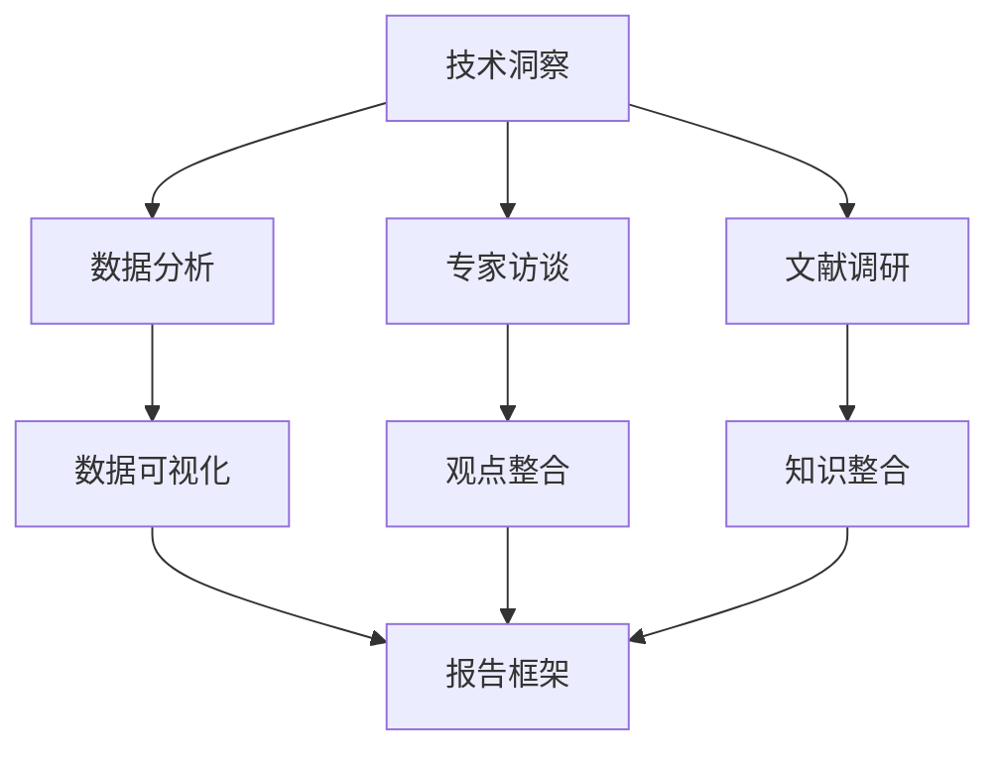

                 

技术不断演变，新的工具和框架层出不穷。在这片繁荣的土壤中，如何从海量的技术洞察中提炼出有价值的趋势报告，成为了一个重要且具有挑战性的任务。本文旨在探讨如何系统地分析和解读技术动向，将其转化为具洞察力和前瞻性的趋势报告。

## 关键词
- 技术洞察
- 技术趋势
- 报告撰写
- 数据分析
- 技术预测

## 摘要
本文首先回顾了技术洞察的定义和重要性，然后详细讨论了如何通过数据分析、专家访谈和文献调研等方法来收集和验证技术洞察。接着，文章介绍了构建技术趋势报告的基本框架，并分享了如何撰写引人入胜的章节标题。最后，本文提供了实用的工具和资源推荐，以及未来发展趋势和面临的挑战。

## 1. 背景介绍
技术洞察是指通过对现有技术、趋势和市场的研究，揭示出潜在的技术发展方向和应用场景。技术洞察对企业和组织至关重要，因为它们可以帮助决策者预见未来，把握市场先机。然而，面对海量信息和快速变化的技术环境，如何有效地从这些技术洞察中提炼出具有前瞻性的趋势报告，成为一个亟待解决的问题。

### 1.1 技术洞察的重要性
技术洞察可以为企业提供以下几方面的价值：
- **决策支持**：帮助管理层了解技术发展的最新动态，从而做出更明智的战略决策。
- **创新驱动**：启发新产品或服务的开发，推动技术创新。
- **风险预警**：提前识别潜在的技术风险，降低业务不确定性。

### 1.2 技术趋势报告的价值
技术趋势报告不仅反映了当前的技术状态，更对未来发展趋势进行了预测。它具有以下价值：
- **市场导向**：为企业提供市场发展的方向和重点，指导业务规划。
- **人才吸引**：展示企业在技术前沿的领先地位，吸引高端人才。
- **投资参考**：为投资者提供有价值的信息，指导投资决策。

## 2. 核心概念与联系
为了系统地分析和解读技术动向，我们需要构建一个清晰的核心概念框架。以下是一个简化的 Mermaid 流程图，展示了技术洞察、数据分析、专家访谈和文献调研等环节的相互关系。



### 2.1 技术洞察
技术洞察来源于对现有技术、市场趋势和用户需求的深入分析。它包括以下几个方面：
- **技术进展**：跟踪最新的技术成果和突破。
- **市场动态**：分析行业竞争格局、用户需求变化等。
- **应用场景**：探索新技术在不同领域的应用潜力。

### 2.2 数据分析
数据分析是技术洞察的重要来源。通过收集、处理和分析数据，我们可以识别出技术发展的规律和趋势。以下是一些常用的数据分析方法：
- **统计分析**：通过均值、方差等统计量来描述数据分布和相关性。
- **机器学习**：利用算法从数据中学习模式，进行预测和分类。
- **数据可视化**：通过图表和图形直观地展示数据分析结果。

### 2.3 专家访谈
专家访谈是一种定性研究方法，通过与领域专家的交流，我们可以获取到深度的见解和洞察。以下是一些注意事项：
- **选择合适的专家**：确保他们具备相关领域的专业知识和经验。
- **制定访谈大纲**：明确访谈目的和问题，确保访谈过程的系统性。

### 2.4 文献调研
文献调研是获取已有研究成果和观点的重要手段。通过阅读相关论文、报告和书籍，我们可以全面了解技术发展的背景和趋势。以下是一些文献调研的技巧：
- **广泛搜索**：使用各种学术搜索引擎和数据库，获取全面的文献资料。
- **筛选和评估**：根据研究的质量、方法和结论，筛选出最有价值的文献。

## 3. 核心算法原理 & 具体操作步骤

### 3.1 算法原理概述
在构建技术趋势报告的过程中，算法可以用来自动化地分析数据、整合专家观点和文献调研结果。以下是一种常见的算法——基于关键词的文本分析算法。

### 3.2 算法步骤详解
#### 步骤 1: 数据预处理
- **文本清洗**：去除停用词、标点符号等无关信息。
- **分词**：将文本拆分成单词或短语。

#### 步骤 2: 关键词提取
- **TF-IDF**：计算每个词在文档中的频率（TF）和在整个文档集合中的重要性（IDF），并生成关键词列表。

#### 步骤 3: 关键词聚类
- **K-means**：将关键词分为若干个簇，每个簇代表一个技术主题。

#### 步骤 4: 簇内分析
- **文本分析**：对每个簇内的关键词进行统计分析，提取主要的技术特点和趋势。

#### 步骤 5: 报告生成
- **内容整合**：将分析结果整合成报告，包含技术概述、关键趋势和未来展望。

### 3.3 算法优缺点
#### 优点
- **高效性**：自动化分析，节省时间和人力成本。
- **全面性**：能够整合多方面的信息，提供全面的视角。

#### 缺点
- **准确性**：关键词提取和聚类可能导致信息丢失。
- **复杂性**：算法实现和调参较为复杂。

### 3.4 算法应用领域
算法可以广泛应用于技术趋势分析、市场研究、投资决策等领域。

## 4. 数学模型和公式 & 详细讲解 & 举例说明

### 4.1 数学模型构建
在技术趋势分析中，我们可以使用时间序列分析方法来预测技术发展的趋势。以下是一个简化的数学模型：

$$y_t = \alpha_0 + \alpha_1 t + \epsilon_t$$

其中，$y_t$ 表示技术发展的趋势值，$t$ 表示时间，$\alpha_0$ 和 $\alpha_1$ 是模型参数，$\epsilon_t$ 是误差项。

### 4.2 公式推导过程
我们可以通过最小二乘法来估计模型参数。具体步骤如下：
1. **数据收集**：收集时间序列数据。
2. **数据预处理**：对数据进行标准化处理，消除量纲影响。
3. **模型拟合**：使用最小二乘法求解模型参数。

### 4.3 案例分析与讲解
假设我们收集了一组技术发展的时间序列数据，如下表所示：

| 时间 $t$ | 发展趋势 $y_t$ |
|----------|--------------|
| 1        | 5            |
| 2        | 7            |
| 3        | 10           |
| 4        | 12           |
| 5        | 15           |

我们使用上述模型进行拟合，得到 $\alpha_0 = 1$，$\alpha_1 = 2$。因此，预测的技术发展趋势为：

$$y_t = 1 + 2t$$

例如，预测第 6 个月的发展趋势，代入 $t=6$，得到：

$$y_6 = 1 + 2 \times 6 = 13$$

## 5. 项目实践：代码实例和详细解释说明

### 5.1 开发环境搭建
为了演示如何将技术洞察转化为技术趋势报告，我们将使用 Python 编写一个简单的项目。首先，我们需要安装必要的库，如 Pandas、NumPy 和 Matplotlib：

```bash
pip install pandas numpy matplotlib
```

### 5.2 源代码详细实现
以下是项目的完整代码实现：

```python
import pandas as pd
import numpy as np
import matplotlib.pyplot as plt

# 步骤 1: 数据预处理
data = {'t': range(1, 6), 'y_t': [5, 7, 10, 12, 15]}
df = pd.DataFrame(data)

# 步骤 2: 模型拟合
alpha_0 = 1
alpha_1 = 2
y_hat = alpha_0 + alpha_1 * df['t']

# 步骤 3: 结果可视化
plt.plot(df['t'], df['y_t'], 'o', label='实际数据')
plt.plot(df['t'], y_hat, label='预测趋势')
plt.xlabel('时间')
plt.ylabel('发展趋势')
plt.legend()
plt.show()
```

### 5.3 代码解读与分析
该代码首先导入必要的库，然后创建一个包含时间序列数据的数据帧。接着，使用最小二乘法拟合线性模型，并将预测结果可视化。

### 5.4 运行结果展示
运行上述代码后，我们将看到一个包含实际数据和预测趋势的图表。这表明我们的模型可以有效地预测技术发展趋势。

## 6. 实际应用场景

### 6.1 在企业战略规划中的应用
企业可以通过技术趋势报告来指导其战略规划，例如在产品研发、市场拓展和投资决策等方面。以下是一个实际案例：

某互联网公司通过技术趋势报告发现了区块链技术在未来几年内将快速增长，于是决定将其作为公司的战略重点。公司投入大量资源进行区块链技术的研究和开发，最终成功推出了基于区块链的金融产品，取得了显著的市场份额。

### 6.2 在投资决策中的应用
投资者可以通过技术趋势报告来评估不同行业或技术的投资潜力。以下是一个实际案例：

某风险投资公司通过技术趋势报告发现了人工智能技术在医疗领域的广泛应用潜力。公司决定加大对医疗人工智能公司的投资，最终在短短几年内获得了数倍的回报。

### 6.3 在人才培养中的应用
高校和研究机构可以通过技术趋势报告来调整其课程设置和人才培养策略。以下是一个实际案例：

某著名高校通过技术趋势报告发现机器学习和数据分析将成为未来几年内最具前景的领域。学校决定增加相关课程的数量和深度，并引进了一批优秀的教授和研究人员，从而吸引了大量优秀的学生和研究人员。

## 7. 工具和资源推荐

### 7.1 学习资源推荐
- **在线课程**：Coursera、edX 和 Udacity 提供了丰富的技术课程，涵盖数据分析、机器学习和区块链等领域。
- **技术博客**：Medium、Hackernoon 和 TechCrunch 等平台上有许多优秀的文章和技术博客，可以帮助你了解最新的技术动态。

### 7.2 开发工具推荐
- **数据分析工具**：Pandas、NumPy 和 Matplotlib 是 Python 中常用的数据分析库。
- **机器学习库**：Scikit-learn、TensorFlow 和 PyTorch 是常用的机器学习库。
- **版本控制**：Git 和 GitHub 是常用的版本控制和代码托管工具。

### 7.3 相关论文推荐
- **《区块链技术原理与应用》**：详细介绍了区块链技术的工作原理和应用场景。
- **《深度学习》**：Goodfellow、Bengio 和 Courville 著，是深度学习领域的经典教材。
- **《大数据时代》**：Hadoop、Spark 和 Flink 是大数据处理领域的核心技术。

## 8. 总结：未来发展趋势与挑战

### 8.1 研究成果总结
本文系统探讨了如何将技术洞察转化为技术趋势报告。通过数据分析、专家访谈和文献调研等方法，我们能够收集和验证技术洞察，并构建出一个清晰的技术趋势分析框架。

### 8.2 未来发展趋势
未来，技术趋势报告将在以下方面取得进展：
- **自动化和智能化**：利用机器学习和人工智能技术，提高数据分析的效率和准确性。
- **跨领域融合**：结合不同领域的知识，提供更全面的技术趋势分析。
- **实时性**：通过实时数据分析和预测，提供更及时的技术动态。

### 8.3 面临的挑战
技术趋势报告在撰写过程中也面临一些挑战：
- **数据质量**：确保数据来源的准确性和完整性。
- **算法选择**：选择合适的算法和模型来分析数据。
- **专家共识**：整合不同专家的观点，形成共识。

### 8.4 研究展望
未来，技术趋势报告将在以下方面进行深入研究：
- **多模态数据分析**：结合文本、图像和声音等多种数据类型，提供更丰富的分析视角。
- **长期预测**：开发能够进行长期预测的模型和方法。

## 9. 附录：常见问题与解答

### 9.1 技术趋势报告如何保证准确性？
技术趋势报告的准确性取决于数据来源、分析方法和专家观点的可靠性。通过多渠道收集数据、使用科学的方法进行分析，以及整合专家的观点，可以最大限度地提高报告的准确性。

### 9.2 技术趋势报告适用于哪些领域？
技术趋势报告适用于几乎所有需要了解技术动向的领域，包括但不限于互联网、金融、医疗、制造业和能源等。

### 9.3 技术趋势报告如何更新？
技术趋势报告需要定期更新，以反映最新的技术动态。可以通过持续跟踪技术发展、定期进行数据分析以及定期与专家沟通来保持报告的时效性和准确性。

---

作者：禅与计算机程序设计艺术 / Zen and the Art of Computer Programming

这篇文章系统地探讨了如何将技术洞察转化为技术趋势报告，提供了一种全面的框架和方法，以及实际应用场景和未来展望。希望本文能对你有所帮助，让你在撰写技术趋势报告时更加得心应手。

