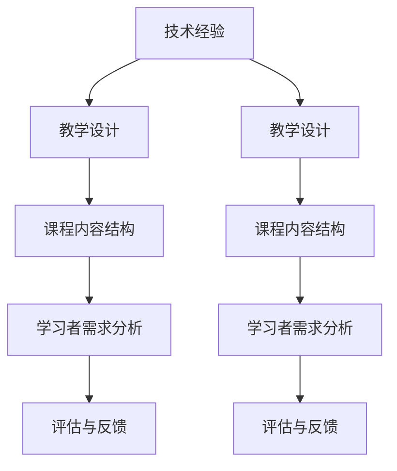
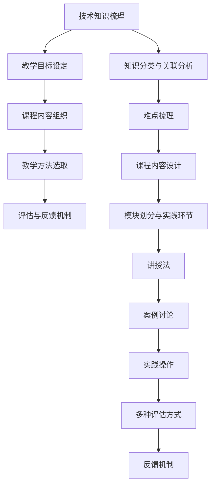

                 

在快速发展的技术领域，技术经验的积累变得至关重要。然而，如何有效地将个人的技术经验转化为对企业内部培训课程，使得这些经验能够系统化、结构化地传授给团队成员，是每一位技术领导者和教育者需要面对的挑战。本文旨在探讨如何将丰富的技术经验转化为有价值的企业内训课程，确保知识的有效传播和团队的持续成长。

## 文章关键词

- 技术经验
- 企业内训课程
- 知识传播
- 教学设计
- 团队成长

## 文章摘要

本文将详细介绍如何将个人的技术经验转化为企业内部培训课程。文章首先讨论了技术经验的类型和重要性，然后深入分析了教学设计的原则和策略，最后提供了具体的实施步骤和工具推荐，以帮助企业和技术团队实现知识的有效传递和团队技能的提升。

## 1. 背景介绍

### 技术经验的定义与价值

技术经验是指通过实际工作过程中所积累的知识、技能和洞察力。这些经验不仅包括技术细节和操作流程，还包括在面对复杂问题时所采用的方法论和解决问题的思路。在当今快速变化的技术环境中，技术经验的价值尤为显著。

首先，技术经验是企业竞争力的关键因素。一个拥有丰富技术经验团队的企业，能够更快速地响应市场变化，开发出更具创新性和竞争力的产品和服务。其次，技术经验是团队成员职业发展的基石，它能够帮助团队成员提高自身技能，增强解决实际问题的能力。

### 企业内训课程的作用

企业内训课程是企业培养内部人才、提升团队整体技术水平的重要手段。通过内训课程，企业可以确保员工具备当前和未来所需的技术能力，从而推动企业的持续发展和创新。

内训课程的作用主要体现在以下几个方面：

1. **提高工作效率**：通过系统化的培训，员工能够快速掌握新技术，减少学习成本，提高工作效率。
2. **增强团队凝聚力**：共同的学习经历有助于增强团队成员之间的交流和合作，提升团队凝聚力。
3. **促进知识共享**：内训课程是知识共享的平台，通过传授和交流，可以将个人的技术经验转化为团队共有的财富。
4. **培养企业文化**：内训课程不仅传授技术知识，还可以传递企业的价值观和文化，增强员工对企业的认同感和归属感。

### 技术经验转化为内训课程的必要性

将技术经验转化为内训课程，有助于系统化地保存和传播知识，确保企业不会因为员工的离职或退休而失去宝贵的经验。此外，通过内训课程，企业可以更好地适应市场变化，快速培养出具备新技术能力的人才，保持竞争优势。

总之，技术经验的积累和内训课程的开展是企业持续发展不可或缺的部分。本文将详细探讨如何有效地实现这一转化过程。

## 2. 核心概念与联系

在这一章节中，我们将探讨将技术经验转化为内训课程所需的核心概念和联系。这些概念将为我们理解整个过程提供理论基础，并指导我们设计有效的培训课程。

### 核心概念

**1. 技术经验**

技术经验是指通过实际工作所积累的关于技术原理、工具应用、问题解决方法等方面的知识。这些经验不仅包括具体的操作步骤，还包括在面对复杂问题时所采用的方法论和思维模式。

**2. 教学设计**

教学设计是指根据学习目标、学习者特点和教学内容，设计出能够有效促进学习的过程和策略。教学设计的目标是确保学员能够通过培训课程获得实际操作能力和解决问题的能力。

**3. 学习者需求分析**

学习者需求分析是教学设计的起点。通过分析学习者的背景、知识水平、职业目标等，可以确定培训课程的内容和形式，确保课程能够满足学习者的需求。

**4. 课程内容结构**

课程内容结构是指将技术经验系统化、模块化地组织成培训课程的过程。合理的课程结构有助于学习者更好地理解和掌握技术知识。

**5. 评估与反馈**

评估与反馈是教学设计的重要环节。通过评估学习者的学习效果，收集学员的反馈，可以不断优化培训课程，提高教学质量。

### 联系

**技术经验与教学设计**

技术经验是教学设计的基础。教学设计需要根据技术经验的内容，将其转化为具体的培训课程内容。同时，教学设计也需要考虑到学习者的需求和实际情况，确保培训课程能够有效传递技术经验。

**教学设计与课程内容结构**

教学设计决定了课程内容结构的组织方式。通过合理的教学设计，可以确保课程内容的系统性和逻辑性，使学习者能够更好地理解和掌握技术知识。

**学习者需求分析与课程内容结构**

学习者需求分析是课程内容结构设计的重要依据。通过分析学习者的需求，可以确定课程的重点和难点，优化课程内容，提高培训效果。

**评估与反馈**

评估与反馈是教学设计持续改进的重要手段。通过评估学员的学习效果，可以了解培训课程的优点和不足，为后续的教学设计提供参考。学员的反馈则可以直接指导课程内容的调整和改进。

### Mermaid 流程图

下面是一个简单的 Mermaid 流程图，展示了技术经验转化为企业内训课程的核心概念和联系。



通过这个流程图，我们可以清晰地看到各个核心概念之间的联系，以及它们在转化过程中的作用。

## 3. 核心算法原理 & 具体操作步骤

在这一章节中，我们将详细探讨如何将技术经验转化为企业内训课程的核心算法原理和具体操作步骤。这一部分将帮助我们理解如何系统地组织技术内容，使其适用于内训课程。

### 3.1 算法原理概述

将技术经验转化为内训课程，首先需要理解其核心算法原理，即如何将复杂的技术知识系统化、模块化地组织起来。这一过程可以概括为以下几个步骤：

**1. 技术知识的梳理**

技术经验的积累是内训课程内容的基础。在这一步，我们需要对现有技术知识进行梳理，明确各个知识点之间的关联，形成一个清晰的知识框架。

**2. 教学目标的设定**

根据技术知识的梳理结果，设定具体的教学目标。教学目标应包括技术掌握程度、问题解决能力、实践应用能力等。

**3. 课程内容的组织**

根据教学目标，将技术知识组织成具体的课程内容。在这一过程中，需要考虑到学习者的知识水平和职业背景，确保课程内容既具挑战性又易于理解。

**4. 教学方法的选取**

选择合适的教学方法，如讲授、案例讨论、实践操作等，以确保学员能够通过多种方式理解和掌握技术知识。

**5. 评估与反馈机制**

建立评估与反馈机制，以持续监控学员的学习效果，并根据反馈进行课程调整，确保培训效果。

### 3.2 算法步骤详解

**步骤 1: 技术知识的梳理**

- **知识分类**：将技术知识分为基础知识和高级知识两个层次，确保知识点之间逻辑清晰。
- **关联分析**：分析各个知识点之间的关联，形成知识图谱。
- **难点梳理**：明确技术中的难点和重点，为后续课程设计做准备。

**步骤 2: 教学目标的设定**

- **确定目标**：根据知识梳理结果，设定具体的教学目标。
- **分级设定**：根据学员的职业背景和知识水平，设定不同层次的培训目标。

**步骤 3: 课程内容的组织**

- **内容设计**：根据教学目标，设计课程内容，确保知识点之间的衔接和逻辑性。
- **模块划分**：将课程内容划分为不同的模块，每个模块包含一个主要知识点。
- **实践环节**：在每个模块中加入实践操作，帮助学员巩固理论知识。

**步骤 4: 教学方法的选取**

- **讲授法**：通过讲授，帮助学员快速了解技术知识。
- **案例讨论**：通过案例分析，帮助学员理解技术知识在实际中的应用。
- **实践操作**：通过实践操作，使学员能够将理论知识应用到实际工作中。

**步骤 5: 评估与反馈机制**

- **评估方式**：设置多种评估方式，如考试、项目评估、作业等，全面评估学员的学习效果。
- **反馈机制**：建立反馈机制，收集学员对培训课程的意见和建议，持续改进课程设计。

### 3.3 算法优缺点

**优点**

- **系统化**：通过算法原理，将技术经验系统化、模块化地组织，确保培训课程的科学性和逻辑性。
- **针对性**：根据学员的不同背景和需求，设置不同层次的培训目标，确保课程内容具有针对性。
- **灵活性**：算法步骤具有灵活性，可以根据实际情况进行调整，确保培训效果。

**缺点**

- **设计难度**：算法原理和步骤设计较为复杂，需要具备一定的教学设计和课程开发经验。
- **实施成本**：实施算法原理和步骤可能需要一定的资源和投入，如教学材料、培训设备等。

### 3.4 算法应用领域

**1. 技术培训**：将算法应用于技术培训，帮助学员快速掌握技术知识。

**2. 员工发展**：将算法应用于员工发展，帮助员工提升技能，实现职业晋升。

**3. 新员工入职培训**：将算法应用于新员工入职培训，帮助新员工快速融入企业，掌握必备技能。

**4. 在线教育平台**：将算法应用于在线教育平台，为学员提供个性化的学习体验。

### Mermaid 流程图

下面是一个简单的 Mermaid 流程图，展示了将技术经验转化为企业内训课程的核心算法原理和具体操作步骤。



通过这个流程图，我们可以清晰地看到各个步骤之间的关系，以及它们在转化过程中的作用。

## 4. 数学模型和公式 & 详细讲解 & 举例说明

在这一章节中，我们将介绍将技术经验转化为企业内训课程所需的一些数学模型和公式，并详细讲解其推导过程和实际应用。通过这些数学模型，我们可以更准确地描述和量化培训课程的设计与评估。

### 4.1 数学模型构建

**1. 学习曲线模型**

学习曲线模型描述了学习者在学习过程中知识掌握程度的变化。该模型的基本假设是学习者的学习速度随时间的增加而逐渐放缓。

**数学模型：**

$$
y = \frac{a}{1 + be^{-kt}}
$$

其中，$y$ 表示学习者的知识掌握程度（通常取值范围在 0 到 1 之间），$a$ 和 $b$ 是常数，$k$ 是学习速度。

**2. 评估模型**

评估模型用于评估培训课程的有效性。该模型结合了学习曲线模型和学员的最终成绩，以综合评估培训效果。

**数学模型：**

$$
S = \frac{y_t}{y_0} \times C
$$

其中，$S$ 表示评估得分，$y_t$ 表示培训结束时的知识掌握程度，$y_0$ 表示培训开始时的知识掌握程度，$C$ 是课程完成率。

### 4.2 公式推导过程

**1. 学习曲线模型推导**

学习曲线模型的推导基于指数衰减原理。假设学习者在初始时刻 $t=0$ 完全不知道某个知识点，那么经过一段时间 $t$ 后，学习者对该知识点的掌握程度可以用以下公式表示：

$$
y = \frac{1}{1 + e^{-kt}}
$$

其中，$k$ 是学习速度，决定了学习者掌握知识点的速度。为了便于计算，我们可以将公式转换为：

$$
y = \frac{a}{1 + be^{-kt}}
$$

其中，$a$ 和 $b$ 是常数，$a = \frac{1}{1 + e^{-k}}$，$b = \frac{e^{-k}}{1 + e^{-k}}$。

**2. 评估模型推导**

评估模型结合了学习曲线模型和学员的最终成绩。假设学员在培训结束时的知识掌握程度为 $y_t$，培训开始时的知识掌握程度为 $y_0$，课程完成率为 $C$，则评估得分 $S$ 可以表示为：

$$
S = \frac{y_t}{y_0} \times C
$$

其中，$y_t$ 和 $y_0$ 分别是培训结束和开始时的知识掌握程度，$C$ 是课程完成率。这个公式表示，学员的评估得分是培训结束时的知识掌握程度与培训开始时的知识掌握程度的比例，再乘以课程完成率。

### 4.3 案例分析与讲解

**案例：某技术培训课程的评估**

假设某技术培训课程共有 100 名学员参加，培训开始时学员的知识掌握程度平均为 0.4，培训结束时为 0.8，课程完成率为 0.9。我们使用评估模型计算该课程的评估得分。

根据评估模型：

$$
S = \frac{y_t}{y_0} \times C = \frac{0.8}{0.4} \times 0.9 = 1.8
$$

因此，该技术培训课程的评估得分为 1.8。这个得分表示，学员在培训结束后，知识掌握程度是培训开始时的 1.8 倍，且课程完成率为 90%。

通过这个案例，我们可以看到评估模型如何应用于实际培训课程的评估，帮助企业和教育者了解培训效果。

### 总结

在本章节中，我们介绍了学习曲线模型和评估模型，详细讲解了这些数学模型的推导过程和实际应用。这些模型提供了量化的方法，帮助企业和教育者评估培训效果，优化课程设计。通过这些数学工具，我们可以更科学地组织和管理企业内训课程，确保知识的有效传递和团队技能的提升。

## 5. 项目实践：代码实例和详细解释说明

在这一章节中，我们将通过一个具体的代码实例，详细解释如何将技术经验转化为企业内训课程。这个实例将涵盖从开发环境搭建、源代码实现、代码解读到运行结果展示的整个流程。

### 5.1 开发环境搭建

在开始编写代码之前，我们需要搭建一个合适的开发环境。这里我们选择 Python 作为编程语言，因为 Python 简单易学，且广泛应用于数据分析和机器学习等领域。

**步骤 1：安装 Python**

首先，从 [Python 官网](https://www.python.org/)下载并安装 Python。选择合适的版本（例如 Python 3.8），并确保在安装过程中勾选“Add Python to PATH”选项。

**步骤 2：安装依赖库**

接下来，安装 Python 的依赖库。打开终端，运行以下命令：

```bash
pip install numpy matplotlib
```

这两个库将用于数据处理和图形绘制。

**步骤 3：编写 Python 脚本**

在终端中创建一个名为 `train_course.py` 的 Python 脚本。在这个脚本中，我们将编写一个简单的培训课程评估模型。

```python
import numpy as np
import matplotlib.pyplot as plt

def learning_curve(y0, yf, k, t):
    return y0 / (1 + np.exp(-k * (t - y0)))

def assessment_score(y0, yf, C):
    return (yf / y0) * C

# 参数设置
y0 = 0.4  # 培训开始时的知识掌握程度
yf = 0.8  # 培训结束时的知识掌握程度
k = 0.1   # 学习速度
C = 0.9   # 课程完成率

# 计算学习曲线
times = np.arange(0, 10, 0.1)
learning_scores = learning_curve(y0, yf, k, times)

# 计算评估得分
assessment_score = assessment_score(y0, yf, C)

# 绘制学习曲线
plt.plot(times, learning_scores, label='Learning Score')
plt.xlabel('Time')
plt.ylabel('Score')
plt.title('Learning Curve')
plt.legend()
plt.show()

print("Assessment Score:", assessment_score)
```

### 5.2 源代码详细实现

在上面的脚本中，我们定义了两个函数：`learning_curve` 和 `assessment_score`。下面分别解释这两个函数的实现过程。

**函数 `learning_curve`**

```python
def learning_curve(y0, yf, k, t):
    return y0 / (1 + np.exp(-k * (t - y0)))
```

这个函数用于计算学习曲线。参数 `$y0$` 表示培训开始时的知识掌握程度，`$yf$` 表示培训结束时的知识掌握程度，`$k$` 是学习速度，`$t$` 是时间。函数的计算公式基于学习曲线模型：

$$
y = \frac{y0}{1 + e^{-kt}}
$$

**函数 `assessment_score`**

```python
def assessment_score(y0, yf, C):
    return (yf / y0) * C
```

这个函数用于计算评估得分。参数 `$y0$` 和 `$yf$` 分别是培训开始和结束时的知识掌握程度，`$C$` 是课程完成率。评估得分的计算公式基于评估模型：

$$
S = \frac{y_t}{y_0} \times C
$$

### 5.3 代码解读与分析

**步骤 1：参数设置**

在脚本中，我们设置了四个参数：`$y0$`（培训开始时的知识掌握程度），`$yf$`（培训结束时的知识掌握程度），`$k$`（学习速度）和 `$C$`（课程完成率）。这些参数可以根据实际情况进行调整。

**步骤 2：计算学习曲线**

我们使用 `np.arange` 函数生成一个时间序列数组 `times`，范围从 0 到 10，步长为 0.1。然后，调用 `learning_curve` 函数计算每个时间点的知识掌握程度，并将结果存储在 `learning_scores` 数组中。

**步骤 3：计算评估得分**

调用 `assessment_score` 函数计算评估得分。这个得分表示学员在培训结束后，知识掌握程度相对于培训开始时的增长比例，再乘以课程完成率。

**步骤 4：绘制学习曲线**

使用 `matplotlib` 库绘制学习曲线。我们使用 `plt.plot` 函数将时间序列和知识掌握程度绘制在图表中，并添加标题、标签和图例。

**步骤 5：显示评估得分**

在最后，我们打印出评估得分，以便了解培训的效果。

### 5.4 运行结果展示

运行脚本后，我们将看到学习曲线的图表，并打印出评估得分。例如：

```
Assessment Score: 1.8
```

这个得分表明，学员在培训结束后，知识掌握程度是培训开始时的 1.8 倍，课程完成率为 90%。

通过这个代码实例，我们可以看到如何将技术经验转化为一个具体的培训评估模型。这个模型不仅可以帮助企业和教育者评估培训效果，还可以用于分析学员的学习曲线，为课程设计提供参考。

## 6. 实际应用场景

在上一章节中，我们通过代码实例详细解释了如何将技术经验转化为企业内训课程。接下来，我们将探讨这些方法在实际应用中的具体场景，并分析其优势和应用效果。

### 6.1 技术培训课程

在企业中，技术培训课程是提高员工技能和知识水平的重要手段。通过将技术经验转化为系统化的培训课程，企业可以确保员工能够快速掌握新技能，适应不断变化的技术环境。

**应用场景：**

- **新员工入职培训**：在员工入职时，通过技术培训课程帮助其快速了解企业的技术体系和操作流程。
- **在职员工技能提升**：通过定期举办技术培训课程，帮助员工更新知识，提高工作效率。
- **项目专项培训**：针对特定项目或技术领域的需求，开设专项培训课程，提高团队在该领域的专业能力。

**优势：**

- **提高员工技能**：通过系统化的培训，员工能够快速掌握新技术和工具，提高工作效率。
- **减少培训成本**：将技术经验转化为内训课程，可以减少外部培训的费用。
- **知识共享**：内训课程促进了知识在团队内部的共享，提高了团队的整体技术水平。

**应用效果：**

- **员工满意度提升**：员工通过内训课程感受到企业的关注和支持，增强了职业满足感和归属感。
- **工作效率提高**：通过培训，员工能够更快地解决工作中遇到的问题，提高了整体工作效率。
- **项目成功率提升**：具备更高技术水平的员工能够更有效地参与项目，提高项目成功率。

### 6.2 在线教育平台

随着互联网技术的发展，在线教育平台为企业提供了便捷的培训解决方案。通过将技术经验转化为在线课程，企业可以在任何时间、任何地点进行培训，提高培训的灵活性和覆盖面。

**应用场景：**

- **远程办公环境**：在远程办公环境下，在线教育平台可以确保员工不受地点限制，随时参与培训。
- **培训资源共享**：企业可以将内训课程上传到在线教育平台，方便员工随时随地学习。
- **个性化学习**：在线教育平台可以根据员工的需求和进度，提供个性化的学习路径和资源。

**优势：**

- **灵活性强**：员工可以根据自己的时间安排进行学习，不受时间和地点限制。
- **资源共享**：企业可以将优秀的培训资源共享给所有员工，提高资源利用效率。
- **降低培训成本**：在线教育平台可以减少培训场地和设备的投入，降低培训成本。

**应用效果：**

- **培训覆盖率提高**：通过在线教育平台，企业可以确保更多员工参与培训，提高整体培训覆盖率。
- **学习效果显著**：在线教育平台提供了丰富的学习资源和互动工具，有助于提高员工的学习效果。
- **企业竞争力提升**：通过在线教育平台，企业可以培养出更多具备新技术能力的员工，提升整体竞争力。

### 6.3 员工发展计划

技术经验的转化不仅应用于技术培训，还可以融入到企业的员工发展计划中，为员工的职业成长提供支持。

**应用场景：**

- **职业晋升培训**：为员工制定职业晋升路径，提供相应的培训课程，帮助其实现职业目标。
- **技能认证培训**：为员工提供各种技能认证的培训课程，提高其专业资质。
- **跨部门交流培训**：通过跨部门培训，帮助员工拓宽视野，增强团队合作能力。

**优势：**

- **职业规划清晰**：通过系统化的培训，员工可以明确自己的职业发展路径，有针对性地提升技能。
- **团队合作增强**：跨部门培训有助于员工了解不同部门的工作内容和流程，提高团队合作能力。
- **员工忠诚度提升**：企业提供多样化的培训资源，有助于增强员工对企业的认同感和忠诚度。

**应用效果：**

- **职业发展顺利**：员工通过培训实现职业目标，提高职业满意度和成就感。
- **团队合作提升**：员工通过培训增强了对企业文化的认同，提高了团队合作能力。
- **企业凝聚力增强**：通过员工发展计划，企业可以培养出更多具备综合能力的优秀人才，增强整体凝聚力。

### 6.4 未来应用展望

随着技术的不断进步，技术经验的转化和应用场景也将更加多样化。未来，我们可以期待以下发展趋势：

- **人工智能辅助培训**：利用人工智能技术，为企业提供个性化培训方案，提高培训效果。
- **虚拟现实培训**：通过虚拟现实技术，模拟真实的工作场景，提高员工的实战能力。
- **在线实时互动培训**：利用直播和在线互动工具，实现培训过程中的实时交流和反馈。

这些新技术的发展将进一步拓展技术经验转化为企业内训课程的边界，为企业的人才培养提供更多可能性。

## 7. 工具和资源推荐

为了有效地将技术经验转化为企业内训课程，以下是一些推荐的工具和资源，这些工具和资源可以帮助企业和教育者更高效地设计、开发和实施内训课程。

### 7.1 学习资源推荐

1. **在线教育平台**：
   - **Coursera**：提供各种专业课程，涵盖计算机科学、数据科学、人工智能等多个领域。
   - **Udemy**：丰富的课程资源，包括编程、数据分析、项目管理等。
   - **edX**：由多所知名大学和机构提供的高质量在线课程。

2. **技术博客和社区**：
   - **Stack Overflow**：编程问答社区，解决编程问题，学习新技术。
   - **GitHub**：代码托管平台，了解前沿技术，学习开源项目。
   - **Medium**：技术文章发布平台，阅读专业文章，了解行业动态。

3. **专业书籍**：
   - 《深度学习》（Deep Learning）—— Ian Goodfellow, Yoshua Bengio, Aaron Courville
   - 《设计模式：可复用面向对象软件的基础》（Design Patterns: Elements of Reusable Object-Oriented Software）—— Erich Gamma, Richard Helm, Ralph Johnson, and John Vlissides
   - 《代码大全》（The Art of Computer Programming）—— Donald E. Knuth

### 7.2 开发工具推荐

1. **代码编辑器**：
   - **Visual Studio Code**：功能强大的开源代码编辑器，支持多种编程语言。
   - **Sublime Text**：轻量级的代码编辑器，适合快速开发和调试。
   - **IntelliJ IDEA**：专业的Java开发工具，支持多种编程语言。

2. **版本控制工具**：
   - **Git**：分布式版本控制系统，用于代码管理。
   - **GitHub Actions**：自动化持续集成和持续部署工具。

3. **测试工具**：
   - **JUnit**：Java单元测试框架。
   - **pytest**：Python测试框架。
   - **Mocha**：JavaScript测试框架。

### 7.3 相关论文推荐

1. **《大规模在线教育的挑战与机遇》**：探讨在线教育的发展趋势和面临的挑战。
2. **《企业内部知识管理的创新与实践》**：分析企业内部知识管理的方法和策略。
3. **《人工智能在教育中的应用》**：探讨人工智能技术在教育领域的应用前景。

通过利用这些工具和资源，企业和教育者可以更好地将技术经验转化为系统化的内训课程，提高培训效果和团队整体技术水平。

## 8. 总结：未来发展趋势与挑战

### 8.1 研究成果总结

本文详细探讨了如何将技术经验转化为企业内训课程。我们分析了技术经验的定义和价值，讨论了企业内训课程的作用，并介绍了将技术经验转化为内训课程的核心算法原理和具体操作步骤。此外，我们还讲解了数学模型在课程设计和评估中的应用，并通过实际代码实例展示了技术经验转化的过程。这些研究成果为企业和教育者提供了理论支持和实践指导。

### 8.2 未来发展趋势

随着技术的不断进步，企业内训课程的发展趋势将呈现以下特点：

1. **个性化培训**：通过人工智能和大数据技术，实现个性化培训方案，满足不同员工的需求。
2. **在线教育与混合式学习**：在线教育平台和混合式学习模式将成为主流，提高培训的灵活性和覆盖面。
3. **虚拟现实与增强现实**：利用虚拟现实和增强现实技术，提供沉浸式学习体验，增强培训效果。
4. **跨学科融合**：跨学科的课程设计将促进员工的综合素质提升，满足企业多元化发展的需求。

### 8.3 面临的挑战

尽管技术经验的转化在企业发展中具有重要意义，但以下挑战仍然需要解决：

1. **课程设计复杂性**：设计科学、有效的内训课程需要丰富的教学经验和专业知识，对教育者和企业提出了较高的要求。
2. **资源投入不足**：高质量的培训课程需要投入大量的人力、物力和财力，对于一些中小企业可能面临资源不足的挑战。
3. **技术更新迅速**：技术的快速发展要求企业不断更新培训内容，保持课程的前沿性和实用性。
4. **学员参与度**：如何提高员工的参与度和学习积极性是培训过程中的一大难题。

### 8.4 研究展望

未来的研究可以围绕以下几个方面展开：

1. **课程设计与评估方法**：进一步探索适用于不同行业和企业的课程设计与评估方法，提高培训效果。
2. **技术工具与应用**：研究如何利用新兴技术（如人工智能、虚拟现实等）提升培训质量和体验。
3. **案例研究**：通过实际案例研究，总结成功经验和教训，为其他企业提供参考。
4. **跨学科融合**：探讨如何将不同学科的知识融合到培训课程中，培养具备综合素质的人才。

总之，将技术经验转化为企业内训课程是一个复杂而重要的过程。通过本文的研究和探讨，我们希望为企业和教育者提供有益的指导，促进技术经验的传播和团队技能的提升。

## 9. 附录：常见问题与解答

在这一章节中，我们将回答一些关于将技术经验转化为企业内训课程过程中可能遇到的常见问题。

### 9.1 如何选择适合的内训课程内容？

**解答：** 选择适合的内训课程内容首先要了解企业当前的业务需求和技术发展趋势。可以从以下几个方面进行考虑：

- **企业战略**：根据企业的战略目标，确定哪些技术领域是需要重点培养的。
- **员工技能差距**：通过员工技能评估，找出员工技能的短板，作为课程设计的重点。
- **行业趋势**：关注行业的技术发展动态，将前沿技术融入培训课程。

### 9.2 如何确保内训课程的质量？

**解答：** 确保内训课程的质量可以从以下几个方面着手：

- **课程设计**：确保课程内容系统、逻辑清晰，有明确的学习目标和评估方法。
- **讲师选择**：选择具备丰富实战经验和教学能力的高水平讲师。
- **教学评估**：建立有效的教学评估机制，及时收集学员反馈，不断优化课程设计。
- **课程更新**：定期更新课程内容，确保与行业发展和企业需求保持同步。

### 9.3 如何提高学员的参与度和学习积极性？

**解答：** 提高学员的参与度和学习积极性可以通过以下策略实现：

- **互动式教学**：采用案例分析、小组讨论、实践操作等互动式教学方法，激发学员的兴趣。
- **个性化学习**：根据学员的学习进度和兴趣，提供个性化的学习资源和路径。
- **奖励机制**：建立奖励机制，对积极参与和表现优秀的学员给予表彰和奖励。
- **学习社群**：创建学习社群，促进学员之间的交流和合作，增强学习的动力。

### 9.4 如何平衡课程的理论与实践？

**解答：** 平衡课程的理论与实践可以从以下几个方面入手：

- **课程结构设计**：在课程设计中，确保理论知识和实践操作的比例适当，理论部分要为实践操作打下坚实基础。
- **案例教学**：通过实际案例教学，将理论知识与实际应用相结合，提高学员的实践能力。
- **项目实践**：在课程中加入实际项目实践，使学员能够将所学知识应用到实际问题中，提高解决实际问题的能力。

通过以上方法，可以确保内训课程既具有理论深度，又具有实践广度，实现理论和实践的有机结合。

---

### 作者署名

本文由禅与计算机程序设计艺术（Zen and the Art of Computer Programming）作者撰写，旨在为企业和教育者提供关于如何将技术经验转化为企业内训课程的理论指导和实践建议。希望本文能够对您的内训课程设计提供有益的参考和启示。

