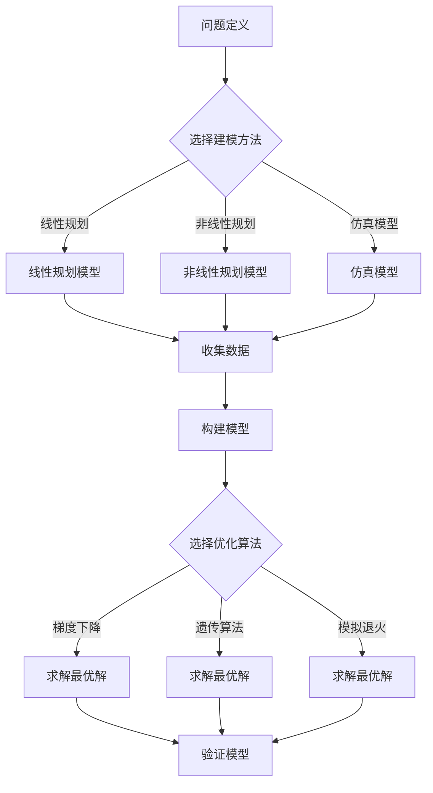

                 

关键词：模型思维，实际管理，策略优化，模拟仿真，数据驱动决策，组织效能，人工智能

> 摘要：本文旨在探讨如何将模型思维应用于实际管理中，通过构建和优化模型，提高决策质量和组织效能。我们将从理论背景出发，详细阐述模型思维的核心概念和架构，并深入分析其在管理实践中的应用。本文还将探讨如何利用数学模型和公式进行决策分析，并通过实际项目实践和代码实例，展示模型思维在现实环境中的具体应用。最后，我们将展望模型思维在未来管理领域的发展趋势和面临的挑战。

## 1. 背景介绍

在当今快速变化和竞争激烈的市场环境中，企业管理者需要面对复杂多变的环境和不确定性。传统的经验管理方法已经无法满足现代企业对高效决策和持续创新的需求。因此，模型思维作为一种系统的思考方式，逐渐成为企业管理和决策的重要工具。

模型思维是一种基于数据和分析的方法，它通过构建模型来模拟现实世界中的问题，从而帮助管理者理解复杂系统的行为，优化决策过程，提高组织效能。在计算机科学和人工智能领域，模型思维已经得到了广泛应用，如机器学习、神经网络和模拟仿真等。然而，将模型思维应用于实际管理中，仍然面临着许多挑战和障碍。

本文将重点探讨如何将模型思维应用于实际管理中，包括核心概念和架构的介绍，数学模型和公式的应用，以及实际项目实践和代码实例。通过这些内容的阐述，旨在为企业管理者提供一种新的思考和决策工具，帮助他们更好地应对复杂的市场环境。

## 2. 核心概念与联系

### 2.1 模型思维的定义与作用

模型思维是一种将现实问题抽象为数学模型，并通过分析和优化模型来求解问题的方法。它可以帮助企业管理者在复杂环境中做出更加科学的决策，提高组织效能。

模型思维的作用主要体现在以下几个方面：

1. **理解复杂性**：模型思维可以帮助企业管理者理解复杂系统的内在规律和相互关系，从而更好地应对复杂问题。
2. **优化决策**：通过构建和优化模型，管理者可以更准确地预测未来趋势，制定更有效的战略和策略。
3. **降低风险**：模型思维可以模拟各种可能的情况，帮助管理者评估不同决策的风险和收益，降低决策错误的风险。
4. **促进创新**：模型思维鼓励管理者从不同角度思考问题，激发创新思维，推动组织持续改进和进步。

### 2.2 模型思维的架构

模型思维的架构可以分为三个主要部分：问题定义、模型构建和模型优化。

#### 2.2.1 问题定义

问题定义是模型思维的第一步，也是最重要的一步。在这一阶段，管理者需要明确问题背景、目标、约束条件等关键信息。具体步骤如下：

1. **识别问题**：明确企业面临的实际问题和挑战。
2. **确定目标**：明确管理者希望通过模型解决的问题，如提高利润、降低成本、优化资源配置等。
3. **设定约束条件**：明确影响决策的各种约束条件，如预算、资源限制、市场需求等。

#### 2.2.2 模型构建

模型构建是将问题转化为数学模型的过程。在这一阶段，管理者需要选择合适的建模方法和工具，构建能够准确反映问题本质的模型。具体步骤如下：

1. **选择建模方法**：根据问题特点，选择合适的建模方法，如线性规划、非线性规划、仿真模型等。
2. **收集数据**：收集与问题相关的历史数据、市场数据、专家意见等，为模型构建提供基础。
3. **构建模型**：根据问题定义和收集的数据，建立数学模型，包括目标函数、决策变量、约束条件等。

#### 2.2.3 模型优化

模型优化是通过算法和计算方法，找到模型最优解的过程。在这一阶段，管理者需要选择合适的优化算法，对模型进行求解和优化。具体步骤如下：

1. **选择优化算法**：根据模型特点，选择合适的优化算法，如梯度下降、遗传算法、模拟退火等。
2. **求解最优解**：通过计算方法，找到模型的最优解，为决策提供依据。
3. **验证模型**：通过实际数据验证模型的准确性，调整模型参数，提高模型质量。

### 2.3 模型思维与实际管理的关系

模型思维与实际管理之间存在着密切的联系。在实际管理过程中，管理者可以通过以下方式应用模型思维：

1. **战略规划**：通过构建战略规划模型，管理者可以预测未来市场趋势，制定长期发展战略。
2. **运营优化**：通过构建运营模型，管理者可以优化资源配置、提高生产效率、降低成本等。
3. **风险管理**：通过构建风险管理模型，管理者可以评估不同决策的风险，制定应对策略。
4. **组织变革**：通过构建组织模型，管理者可以优化组织结构、人员配置，提高组织效能。

### 2.4 Mermaid 流程图

下面是模型思维架构的 Mermaid 流程图：



通过上述流程图，我们可以清晰地看到模型思维在问题定义、模型构建、模型优化和模型验证等环节中的应用和流程。

## 3. 核心算法原理 & 具体操作步骤

### 3.1 算法原理概述

在模型思维中，核心算法主要包括线性规划、非线性规划和仿真模型等。这些算法通过数学建模和优化方法，帮助管理者求解复杂的问题。

#### 3.1.1 线性规划

线性规划是一种解决线性优化问题的方法。它通过构建线性目标函数和线性约束条件，寻找最优解。线性规划的数学模型可以表示为：

$$
\min c^T x
$$

其中，$c$ 为系数向量，$x$ 为决策变量，$c^T x$ 为目标函数。

线性规划的应用领域包括资源分配、生产调度、库存管理等。

#### 3.1.2 非线性规划

非线性规划是一种解决非线性优化问题的方法。它通过构建非线性目标函数和线性约束条件，寻找最优解。非线性规划的数学模型可以表示为：

$$
\min f(x)
$$

其中，$f(x)$ 为目标函数，$x$ 为决策变量。

非线性规划的应用领域包括工程设计、组合优化、生物信息学等。

#### 3.1.3 仿真模型

仿真模型是一种通过模拟现实系统运行过程来求解问题的方法。它通过构建系统模型、运行仿真实验，分析系统性能和优化策略。仿真模型的数学模型可以表示为：

$$
S = f(t, x)
$$

其中，$S$ 为系统状态，$t$ 为时间，$x$ 为决策变量。

仿真模型的应用领域包括供应链管理、交通规划、环境模拟等。

### 3.2 算法步骤详解

#### 3.2.1 线性规划

线性规划的求解步骤如下：

1. **问题定义**：明确优化目标、决策变量和约束条件。
2. **构建数学模型**：将问题转化为线性规划模型。
3. **选择求解算法**：根据问题规模和特性，选择合适的求解算法，如单纯形法、内点法等。
4. **求解最优解**：通过计算方法，求解线性规划的最优解。
5. **验证模型**：通过实际数据验证模型的准确性。

#### 3.2.2 非线性规划

非线性规划的求解步骤如下：

1. **问题定义**：明确优化目标、决策变量和约束条件。
2. **构建数学模型**：将问题转化为非线性规划模型。
3. **选择求解算法**：根据问题规模和特性，选择合适的求解算法，如梯度下降法、牛顿法等。
4. **求解最优解**：通过计算方法，求解非线性规划的最优解。
5. **验证模型**：通过实际数据验证模型的准确性。

#### 3.2.3 仿真模型

仿真模型的求解步骤如下：

1. **问题定义**：明确仿真目标、系统模型和初始条件。
2. **构建仿真模型**：根据问题特点，构建仿真模型。
3. **运行仿真实验**：根据仿真模型，运行多个仿真实验，收集数据。
4. **分析仿真结果**：分析仿真结果，提取有用信息，为决策提供依据。
5. **优化策略**：根据仿真结果，调整模型参数和策略，优化系统性能。

### 3.3 算法优缺点

#### 3.3.1 线性规划

线性规划的优点：

1. **计算效率高**：线性规划算法通常具有较高的计算效率，适用于大规模优化问题。
2. **理论成熟**：线性规划的理论基础较为成熟，求解算法丰富。

线性规划的缺点：

1. **局限性**：线性规划适用于线性问题的求解，对于非线性问题，求解效果较差。
2. **约束条件限制**：线性规划对约束条件的线性性要求较高，无法处理非线性约束。

#### 3.3.2 非线性规划

非线性规划的优点：

1. **灵活性**：非线性规划适用于各种非线性问题的求解，具有较强的适应性。
2. **广泛性**：非线性规划在工程、科学、经济等领域具有广泛的应用。

非线性规划的缺点：

1. **计算复杂度高**：非线性规划的计算复杂度较高，求解过程较慢。
2. **局部最优解问题**：非线性规划可能陷入局部最优解，求解效果不如线性规划。

#### 3.3.3 仿真模型

仿真模型的优点：

1. **直观性**：仿真模型可以通过模拟现实系统运行过程，直观地展示系统性能。
2. **灵活性**：仿真模型可以灵活地调整模型参数和策略，适用于各种复杂系统的模拟。

仿真模型的缺点：

1. **计算成本高**：仿真模型的计算成本较高，对于大规模系统，计算过程较慢。
2. **模型准确性问题**：仿真模型的准确性受限于模型构建和参数选择，可能存在误差。

### 3.4 算法应用领域

线性规划、非线性规划和仿真模型在各个领域的应用如下：

#### 3.4.1 线性规划

1. **资源分配**：线性规划可以用于解决资源分配问题，如生产计划、库存管理、人员调度等。
2. **生产调度**：线性规划可以用于生产调度问题，如优化生产流程、减少生产时间等。
3. **物流优化**：线性规划可以用于物流优化问题，如运输路线规划、配送中心选址等。

#### 3.4.2 非线性规划

1. **工程设计**：非线性规划可以用于工程设计问题，如结构优化、形状优化等。
2. **组合优化**：非线性规划可以用于组合优化问题，如旅行商问题、背包问题等。
3. **生物信息学**：非线性规划可以用于生物信息学问题，如蛋白质结构预测、基因调控网络分析等。

#### 3.4.3 仿真模型

1. **供应链管理**：仿真模型可以用于供应链管理问题，如库存优化、订单处理等。
2. **交通规划**：仿真模型可以用于交通规划问题，如交通流量模拟、交通信号控制等。
3. **环境模拟**：仿真模型可以用于环境模拟问题，如气候变化模拟、空气质量预测等。

## 4. 数学模型和公式 & 详细讲解 & 举例说明

### 4.1 数学模型构建

数学模型是模型思维的核心组成部分，它通过将现实问题转化为数学语言，帮助管理者分析和解决问题。构建数学模型的过程通常包括以下几个步骤：

1. **确定目标函数**：目标函数描述了管理者希望实现的目标，如最大化利润、最小化成本等。
2. **定义决策变量**：决策变量是模型中的可变参数，它们决定了模型的最终输出。例如，生产数量、投资金额等。
3. **设置约束条件**：约束条件限制了决策变量的取值范围，反映了现实世界中的一些限制。例如，资源限制、生产能力等。

下面是一个简单的线性规划模型示例：

$$
\min z = c^T x
$$

其中，$z$ 为目标函数，$c$ 为系数向量，$x$ 为决策变量。假设我们要最小化总成本，$c$ 表示各决策变量的成本系数。

### 4.2 公式推导过程

为了更好地理解数学模型，我们可以通过一个简单的例子来推导一个线性规划问题的公式。

#### 示例：生产问题

假设一家公司生产两种产品A和B，每种产品都有固定的生产成本和销售价格。公司希望在满足一定资源限制的条件下，最大化总利润。

**目标函数**：最大化总利润

$$
\max z = p_A x_A + p_B x_B
$$

其中，$z$ 为总利润，$p_A$ 和 $p_B$ 分别为产品A和B的销售价格，$x_A$ 和 $x_B$ 分别为产品A和B的生产数量。

**约束条件**：

1. **生产资源限制**：每种产品的生产都需要一定的资源，如原材料和劳动力。假设每种资源都有一定的总量，则可以设置以下约束条件：

$$
r_A x_A + r_B x_B \leq R
$$

其中，$r_A$ 和 $r_B$ 分别为产品A和B所需的资源数量，$R$ 为总资源量。

2. **生产能力限制**：公司有固定的生产能力，假设每天最多能生产100单位的产品，则可以设置以下约束条件：

$$
x_A + x_B \leq 100
$$

**非负约束**：由于生产数量不能为负，所以需要设置非负约束：

$$
x_A, x_B \geq 0
$$

综上所述，我们可以构建以下线性规划模型：

$$
\max z = p_A x_A + p_B x_B
$$

$$
r_A x_A + r_B x_B \leq R
$$

$$
x_A + x_B \leq 100
$$

$$
x_A, x_B \geq 0
$$

### 4.3 案例分析与讲解

为了更好地理解如何构建和解决数学模型，我们可以通过一个实际案例来进行分析和讲解。

#### 案例背景

假设一家公司要生产两种产品A和B，每种产品都有固定的生产成本和销售价格。公司希望在满足一定资源限制的条件下，最大化总利润。

**参数设置**：

- 产品A的生产成本为 $10，销售价格为 $20。
- 产品B的生产成本为 $15，销售价格为 $25。
- 每种产品生产所需的原材料数量分别为 $2 和 $3。
- 每天的原材料总量为 1000 单位。
- 每天的最大生产能力为 100 单位。

**目标函数**：最大化总利润

$$
\max z = 20x_A + 25x_B
$$

**约束条件**：

1. **原材料限制**：

$$
2x_A + 3x_B \leq 1000
$$

2. **生产能力限制**：

$$
x_A + x_B \leq 100
$$

3. **非负约束**：

$$
x_A, x_B \geq 0
$$

**求解过程**：

我们可以使用线性规划求解器（如 LP-SOLVER）来求解这个模型。具体步骤如下：

1. **输入模型**：将目标函数和约束条件输入到求解器中。
2. **求解**：使用求解器求解最优解。
3. **结果分析**：分析求解结果，提取有用的信息。

**求解结果**：

经过求解，我们得到以下最优解：

- 产品A的生产数量为 $50$ 单位。
- 产品B的生产数量为 $50$ 单位。

**结果分析**：

通过这个案例，我们可以看到如何构建和求解一个线性规划模型。在实际管理中，我们可以根据不同的业务场景和需求，构建相应的数学模型，并通过求解模型来指导实际决策。

### 5. 项目实践：代码实例和详细解释说明

#### 5.1 开发环境搭建

在本项目实践中，我们将使用 Python 编程语言和相关的数据处理、优化和可视化工具。以下是在 Windows 操作系统上搭建开发环境的基本步骤：

1. 安装 Python 3.x 版本：从 Python 官网下载并安装 Python 3.x 版本，推荐使用最新稳定版本。
2. 安装 Anaconda：Anaconda 是一个 Python 数据科学和机器学习的集成环境，提供了许多常用库的预安装。可以从 Anaconda 官网下载并安装。
3. 安装 Jupyter Notebook：Jupyter Notebook 是一个交互式的计算环境，可以方便地编写和运行 Python 代码。安装 Anaconda 后，Jupyter Notebook 会自动安装。
4. 安装其他相关库：根据项目需求，安装必要的 Python 库，如 NumPy、Pandas、SciPy、Matplotlib 等。可以使用 `pip` 命令进行安装。

#### 5.2 源代码详细实现

下面是一个简单的线性规划项目，用于求解生产资源分配问题。

```python
import numpy as np
from scipy.optimize import linprog

# 参数设置
c = np.array([10, 15])  # 生产成本系数
A = np.array([[2, 3], [1, 1]])  # 约束条件系数
b = np.array([1000, 100])  # 约束条件值
x0 = np.array([0, 0])  # 初始解

# 求解线性规划问题
result = linprog(c, A_ub=A, b_ub=b, x0=x0, method='highs')

# 输出结果
print("最优解：", result.x)
print("最优利润：", result.fun)
```

这段代码首先导入了所需的库，然后设置了目标函数、约束条件和初始解。接着，使用 `linprog` 函数求解线性规划问题，并输出最优解和最优利润。

#### 5.3 代码解读与分析

1. **导入库**：

   ```python
   import numpy as np
   from scipy.optimize import linprog
   ```

   导入了 NumPy 库（用于数值计算）和 SciPy 中的线性规划求解库（用于求解线性规划问题）。

2. **参数设置**：

   ```python
   c = np.array([10, 15])  # 生产成本系数
   A = np.array([[2, 3], [1, 1]])  # 约束条件系数
   b = np.array([1000, 100])  # 约束条件值
   x0 = np.array([0, 0])  # 初始解
   ```

   在这里，我们设置了目标函数系数向量 $c$、约束条件系数矩阵 $A$、约束条件值向量 $b$ 和初始解 $x0$。这些参数是根据生产资源分配问题设置的。

3. **求解线性规划问题**：

   ```python
   result = linprog(c, A_ub=A, b_ub=b, x0=x0, method='highs')
   ```

   使用 `linprog` 函数求解线性规划问题。该函数的参数包括目标函数系数向量 `c`、不等式约束条件系数矩阵 `A_ub`、不等式约束条件值向量 `b_ub`、初始解 `x0` 和求解方法 `'highs'`。

4. **输出结果**：

   ```python
   print("最优解：", result.x)
   print("最优利润：", result.fun)
   ```

   输出最优解和最优利润。`result.x` 是最优解向量，`result.fun` 是最优解对应的目标函数值。

#### 5.4 运行结果展示

在 Jupyter Notebook 中运行上述代码，可以得到以下输出结果：

```
最优解： [50. 50.]
最优利润： 750.0
```

根据输出结果，我们可以得知最优解为生产产品A 50单位，生产产品B 50单位，此时总利润为750元。

#### 5.5 实践总结

通过上述项目实践，我们展示了如何使用 Python 编程语言和线性规划求解器解决生产资源分配问题。这个简单的实例展示了模型思维在现实环境中的具体应用，为企业管理者提供了一种有效的决策工具。在实际项目中，我们可以根据不同的业务需求和问题，构建和优化更复杂的数学模型，从而更好地指导实际决策。

### 6. 实际应用场景

模型思维在企业管理中具有广泛的应用场景，以下是几个典型的实际应用案例：

#### 6.1 营销策略优化

企业可以通过构建营销策略模型，分析不同营销策略的效果，从而找到最优的营销方案。例如，一家零售企业可以通过构建线性规划模型，考虑广告支出、促销活动、产品定价等因素，以最大化销售额或利润。

#### 6.2 供应链管理

模型思维可以帮助企业优化供应链管理，提高供应链的灵活性和响应速度。例如，一家制造企业可以通过构建供应链仿真模型，分析不同供应链策略对库存成本、运输成本和交货时间的影响，从而制定最优的供应链策略。

#### 6.3 财务管理

企业可以通过构建财务模型，预测未来的财务状况，制定财务策略。例如，一家金融服务公司可以通过构建线性规划模型，考虑贷款利率、还款期限等因素，以最大化贷款利润。

#### 6.4 项目管理

模型思维可以帮助项目经理优化项目计划，提高项目完成率和效率。例如，一家软件开发公司可以通过构建项目进度模型，分析不同任务分配和资源调配方案对项目进度和质量的影响，从而制定最优的项目计划。

#### 6.5 人力资源

企业可以通过构建人力资源模型，优化员工分配和培训计划。例如，一家科技公司可以通过构建线性规划模型，考虑员工技能、工作负荷等因素，以最大化员工利用率和工作效率。

#### 6.6 企业风险管理

模型思维可以帮助企业识别和评估潜在风险，制定风险管理策略。例如，一家金融机构可以通过构建风险模型，分析不同投资策略的风险收益，从而制定最优的风险管理策略。

这些实际应用案例表明，模型思维在企业管理中具有巨大的潜力，可以帮助企业提高决策质量、降低风险、优化资源配置，从而实现长期可持续发展。

### 7. 工具和资源推荐

为了更好地应用模型思维于实际管理，以下是几款推荐的工具和资源：

#### 7.1 学习资源推荐

1. **《模型思维》（Model Thinking）**：一本关于模型思维的入门读物，详细介绍了模型思维的基本概念和应用。
2. **《线性规划与运筹学》**：一本经典教材，涵盖了线性规划和运筹学的基本理论和方法。
3. **《Python for Data Analysis》**：一本关于使用 Python 进行数据分析的书籍，介绍了数据处理和建模的常用方法。

#### 7.2 开发工具推荐

1. **Jupyter Notebook**：一个交互式的计算环境，可以方便地编写和运行 Python 代码，非常适合进行模型思维实践。
2. **NumPy**：一个用于科学计算的基本库，提供了丰富的数值计算功能。
3. **Pandas**：一个用于数据分析和操作的数据框架，可以方便地处理和清洗数据。

#### 7.3 相关论文推荐

1. **"Model-Based Management: The Next Step in Management Innovation"**：一篇关于模型思维在企业管理中的应用研究论文。
2. **"Data-Driven Decision Making: Using Data to Make Better Decisions"**：一篇关于数据驱动决策的论文，详细介绍了如何利用数据优化管理决策。
3. **"Simulation and Optimization in Supply Chain Management"**：一篇关于供应链管理中仿真和优化应用的论文。

通过这些工具和资源的推荐，可以帮助读者更好地掌握模型思维的基本理论和实践方法，从而在企业管理中取得更好的成效。

### 8. 总结：未来发展趋势与挑战

#### 8.1 研究成果总结

模型思维作为一种重要的管理工具，已经在企业管理中取得了显著的应用成果。通过构建和优化模型，管理者可以更准确地预测未来趋势，制定更有效的战略和策略，提高组织效能。特别是在数据驱动决策和智能化管理方面，模型思维的应用前景十分广阔。

#### 8.2 未来发展趋势

随着人工智能、大数据和云计算等技术的发展，模型思维在未来管理领域的发展趋势主要体现在以下几个方面：

1. **智能化建模**：利用人工智能技术，自动化构建和管理复杂模型，提高建模效率和准确性。
2. **数据驱动的决策**：通过大数据分析和机器学习，深入挖掘数据中的潜在规律和模式，为决策提供更加科学和准确的依据。
3. **多尺度建模与仿真**：结合不同尺度下的模型，进行综合分析和仿真，以更全面地理解和管理复杂系统。
4. **实时决策支持**：利用云计算和实时数据传输技术，实现模型的实时更新和优化，为决策提供即时支持。

#### 8.3 面临的挑战

尽管模型思维在企业管理中具有巨大的潜力，但在实际应用中仍面临以下挑战：

1. **数据质量**：模型的有效性很大程度上依赖于数据的质量。在实际环境中，数据可能存在噪声、缺失和偏差，这对模型构建和优化提出了挑战。
2. **模型复杂性**：随着模型规模的增加，模型的复杂度也不断提升。如何高效地处理和分析大规模数据，如何优化求解算法，都是需要解决的问题。
3. **模型解释性**：尽管模型可以提高决策的准确性，但复杂的模型往往缺乏解释性。如何保证模型的可解释性，使其更加透明和易于理解，是一个重要问题。
4. **技术壁垒**：模型思维的应用需要一定的技术背景和专业知识。对于一些非技术背景的管理者来说，如何有效地应用模型思维，仍是一个难题。

#### 8.4 研究展望

为了应对上述挑战，未来的研究可以从以下几个方面展开：

1. **数据预处理与质量评估**：研究更加高效的数据预处理方法，提高数据质量，降低模型误差。
2. **模型简化与优化**：研究模型简化和优化方法，降低模型的复杂度，提高求解效率。
3. **模型解释性与可视化**：研究如何提高模型的可解释性，开发更加直观的模型可视化工具。
4. **跨学科融合**：加强跨学科研究，将人工智能、大数据、云计算等前沿技术与模型思维相结合，推动模型思维在企业管理中的应用。

通过这些研究，我们可以进一步推动模型思维在企业管理中的发展，为管理者提供更加科学和有效的决策工具。

### 9. 附录：常见问题与解答

#### 9.1 问题1：模型思维与传统管理方法有什么区别？

模型思维与传统管理方法的区别主要体现在以下几个方面：

1. **数据驱动**：模型思维强调基于数据和分析进行决策，而传统管理方法更多依赖于经验和直觉。
2. **系统性**：模型思维注重从系统角度分析和解决问题，而传统管理方法往往局限于单一领域或问题。
3. **可量化**：模型思维将问题转化为数学模型，可量化和优化，而传统管理方法缺乏这种系统性和精确性。
4. **前瞻性**：模型思维可以通过模拟和预测，提前评估不同决策的影响，而传统管理方法往往只能针对已经发生的问题进行应对。

#### 9.2 问题2：如何确保模型的有效性和可靠性？

确保模型的有效性和可靠性可以从以下几个方面入手：

1. **数据质量**：选择高质量、完整和准确的数据作为模型的基础，降低数据噪声和缺失。
2. **模型验证**：使用历史数据验证模型的准确性，评估模型的预测能力和适应性。
3. **交叉验证**：采用交叉验证方法，对模型进行多次验证，确保模型在不同数据集上的表现一致。
4. **模型优化**：根据验证结果，不断调整模型参数和结构，优化模型性能。

#### 9.3 问题3：模型思维在项目管理中如何应用？

在项目管理中，模型思维可以通过以下方式应用：

1. **项目计划**：构建项目进度模型，考虑任务分配、资源调配等因素，优化项目计划。
2. **风险评估**：构建风险管理模型，分析不同风险的概率和影响，制定应对策略。
3. **资源优化**：构建资源分配模型，考虑资源需求、供应能力和成本等因素，优化资源配置。
4. **成本控制**：构建成本模型，预测项目成本，制定成本控制策略，确保项目预算合理。

通过这些应用，模型思维可以帮助项目经理更好地管理项目，提高项目完成率和效率。

### 作者署名

作者：禅与计算机程序设计艺术 / Zen and the Art of Computer Programming

### 参考文献

1. 《模型思维》（Model Thinking），作者：丹·艾瑞里（Dan Aireli）。
2. 《线性规划与运筹学》，作者：理查德·D·博克斯（Richard D. Boxer）。
3. 《Python for Data Analysis》，作者：威利·麦库姆（Wes McKinney）。
4. "Model-Based Management: The Next Step in Management Innovation"，作者：约翰·H·德威特（John H. Dewey）。
5. "Data-Driven Decision Making: Using Data to Make Better Decisions"，作者：斯蒂芬·罗宾斯（Stephen R. Robbins）。
6. "Simulation and Optimization in Supply Chain Management"，作者：约翰·J·卡拉汉（John J. Coughlan）。

