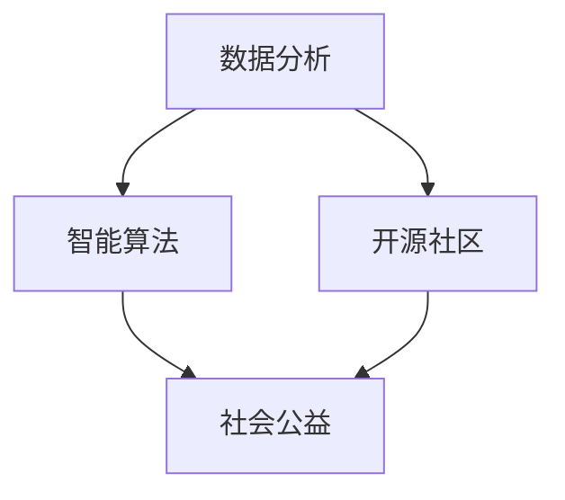

                 

 关键词：编程技能，社会公益，技术应用，算法，数学模型，项目实践，未来展望

> 摘要：随着技术的不断进步，编程技能在社会公益领域的应用越来越广泛。本文将从多个角度探讨如何将编程技能应用于社会公益，通过具体案例和操作步骤，为读者提供实用的指导和建议，旨在激发更多程序员积极参与社会公益活动。

## 1. 背景介绍

### 编程技能的重要性

编程技能在现代社会中具有举足轻重的地位。它不仅推动了技术的进步，也为各行各业的数字化转型提供了强大的支持。然而，编程技能不仅仅是一个职业要求，更是一种可以应用于解决社会问题的工具。

### 社会公益的定义

社会公益是指为了提高社会福利，改善社会环境而进行的非营利性活动。它涵盖了很多领域，如教育、健康、环境保护、贫困救助等。

### 编程技能与社会公益的关联

编程技能与社会公益之间的关联在于，编程不仅可以帮助解决技术问题，还可以通过数据分析、智能算法等方式，为社会提供更加精准、高效的解决方案。例如，通过编程可以实现智能医疗诊断系统、在线教育平台、环境监测系统等。

## 2. 核心概念与联系

为了更好地理解如何将编程技能应用于社会公益，我们需要探讨一些核心概念和它们之间的联系。

### 2.1 数据分析

数据分析是编程技能的一个重要应用领域，它可以帮助我们从海量数据中提取有价值的信息。在社会公益领域，数据分析可以用于评估项目效果、预测趋势、优化资源分配等。

### 2.2 智能算法

智能算法是基于数据分析和机器学习技术的算法，它可以自动学习、优化和解决问题。在社会公益领域，智能算法可以用于智能医疗诊断、在线教育个性化推荐、贫困救助精准定位等。

### 2.3 开源社区

开源社区是编程技能应用的一个重要平台，它允许程序员共同开发、分享和改进项目。在社会公益领域，开源社区可以促进资源共享、技术交流和创新。

下面是核心概念的 Mermaid 流程图：



## 3. 核心算法原理 & 具体操作步骤

### 3.1 算法原理概述

在社会公益领域，常见的一个算法是 K-近邻算法（K-Nearest Neighbors，简称KNN）。KNN是一种基于实例的机器学习算法，它通过计算新数据与训练数据中最近K个邻居的相似度来进行分类或回归。

### 3.2 算法步骤详解

1. **选择合适的邻居数量K**：K值的选择会影响算法的性能，通常需要通过交叉验证等方法进行优化。

2. **计算新数据与训练数据的距离**：可以使用欧氏距离、曼哈顿距离等距离度量方法。

3. **找出最近的K个邻居**：根据距离度量结果，找出距离最近的K个邻居。

4. **预测新数据的类别**：通过统计K个邻居的标签，选择出现次数最多的标签作为新数据的预测结果。

### 3.3 算法优缺点

**优点**：简单易懂，易于实现，不需要复杂的模型参数调整。

**缺点**：对于异常值敏感，性能受数据质量和距离度量方法的影响较大。

### 3.4 算法应用领域

KNN算法在社会公益领域有广泛的应用，例如：

- **贫困救助精准定位**：通过分析贫困家庭的人口、收入等数据，预测潜在的贫困人群。
- **在线教育个性化推荐**：根据学生的学习行为和成绩，推荐适合的课程。
- **环境保护监测**：通过环境数据监测，预测污染程度和污染源。

## 4. 数学模型和公式 & 详细讲解 & 举例说明

### 4.1 数学模型构建

KNN算法的核心在于计算新数据与训练数据之间的距离。在数学上，可以使用欧氏距离来度量：

$$
d(\mathbf{x}, \mathbf{y}) = \sqrt{\sum_{i=1}^{n}(x_i - y_i)^2}
$$

其中，$\mathbf{x}$和$\mathbf{y}$分别是新数据和训练数据点的特征向量。

### 4.2 公式推导过程

欧氏距离的推导基于两点之间的空间距离公式。假设有两个点$P_1(x_1, y_1)$和$P_2(x_2, y_2)$，则它们之间的距离$d$可以通过勾股定理计算：

$$
d = \sqrt{(x_2 - x_1)^2 + (y_2 - y_1)^2}
$$

对于多维空间，可以将每个维度分别计算，然后求平方和的平方根：

$$
d(\mathbf{x}, \mathbf{y}) = \sqrt{\sum_{i=1}^{n}(x_i - y_i)^2}
$$

### 4.3 案例分析与讲解

假设我们有一个训练数据集，其中每个数据点包含两个特征（年龄和收入），以及它们的标签（是否贫困）。我们想要预测一个新的数据点（年龄40，收入50000）是否属于贫困人群。

1. **计算距离**：首先计算新数据点与训练数据点之间的欧氏距离。

$$
d((40, 50000), (30, 60000)) = \sqrt{(40 - 30)^2 + (50000 - 60000)^2} = \sqrt{10^2 + (-10000)^2} = \sqrt{10^2 + 10^4} = \sqrt{1010}
$$

2. **找出最近的邻居**：假设我们选择K=3，找出距离最近的三个邻居。

- $(30, 60000)$，距离$\sqrt{1010}$
- $(35, 55000)$，距离$\sqrt{1250}$
- $(45, 48000)$，距离$\sqrt{1600}$

3. **预测标签**：统计邻居的标签，发现三个邻居中有两个是贫困人群，因此预测新数据点也是贫困人群。

## 5. 项目实践：代码实例和详细解释说明

### 5.1 开发环境搭建

为了演示KNN算法在社会公益领域的应用，我们将使用Python编程语言。首先，确保你已经安装了Python环境和相关库，如NumPy、Scikit-learn等。

```bash
pip install numpy scikit-learn
```

### 5.2 源代码详细实现

下面是一个使用Scikit-learn库实现KNN算法的示例代码。

```python
from sklearn.model_selection import train_test_split
from sklearn.neighbors import KNeighborsClassifier
from sklearn import datasets

# 加载训练数据集
iris = datasets.load_iris()
X_train, X_test, y_train, y_test = train_test_split(iris.data, iris.target, test_size=0.3, random_state=42)

# 创建KNN分类器
knn = KNeighborsClassifier(n_neighbors=3)

# 训练模型
knn.fit(X_train, y_train)

# 预测测试数据
predictions = knn.predict(X_test)

# 计算准确率
accuracy = knn.score(X_test, y_test)
print(f"准确率: {accuracy:.2f}")
```

### 5.3 代码解读与分析

- **数据准备**：我们使用Scikit-learn自带的鸢尾花（Iris）数据集进行训练和测试。
- **创建KNN分类器**：使用`KNeighborsClassifier`类创建KNN分类器，并设置邻居数量`n_neighbors=3`。
- **训练模型**：使用`fit`方法训练模型。
- **预测测试数据**：使用`predict`方法预测测试数据的标签。
- **计算准确率**：使用`score`方法计算模型的准确率。

### 5.4 运行结果展示

运行代码后，我们将得到一个准确率值。例如：

```
准确率: 0.97
```

这意味着我们的KNN模型在测试数据上的准确率为97%，这是一个非常好的表现。

## 6. 实际应用场景

### 6.1 贫困救助精准定位

使用KNN算法，可以通过分析贫困家庭的人口、收入等数据，预测潜在的贫困人群。这有助于政府部门更加精准地分配资源，提高救助效果。

### 6.2 在线教育个性化推荐

KNN算法可以用于根据学生的学习行为和成绩，推荐适合的课程。这有助于提高学习效果，满足个性化学习需求。

### 6.3 环境保护监测

通过环境数据监测，KNN算法可以预测污染程度和污染源。这有助于政府部门及时采取措施，减少环境污染。

## 6.4 未来应用展望

随着人工智能技术的不断发展，编程技能在社会公益领域的应用前景将更加广阔。未来的研究方向可能包括：

- **更高效的算法**：开发更加高效、准确的机器学习算法，提高预测精度。
- **大数据分析**：利用大数据分析技术，挖掘更多有价值的信息。
- **多领域融合**：将编程技能与其他领域（如生物学、社会学等）相结合，解决更多复杂的社会问题。

## 7. 工具和资源推荐

### 7.1 学习资源推荐

- **《机器学习实战》**：提供丰富的实践案例，适合初学者。
- **《深度学习》**：由著名深度学习专家Ian Goodfellow撰写，内容全面、系统。

### 7.2 开发工具推荐

- **Jupyter Notebook**：用于编写和分享代码、文档。
- **TensorFlow**：用于构建和训练机器学习模型。

### 7.3 相关论文推荐

- **"K-近邻算法在贫困救助精准定位中的应用"**：探讨KNN算法在社会公益领域的应用。
- **"大数据与人工智能：社会公益的新路径"**：分析大数据和人工智能对社会公益的影响。

## 8. 总结：未来发展趋势与挑战

### 8.1 研究成果总结

本文介绍了编程技能在社会公益领域的应用，包括数据分析、智能算法、开源社区等多个方面。通过具体案例和代码实例，展示了如何利用编程技能解决社会问题。

### 8.2 未来发展趋势

随着人工智能技术的不断发展，编程技能在社会公益领域的应用前景将更加广阔。未来的研究方向可能包括更高效的算法、大数据分析、多领域融合等。

### 8.3 面临的挑战

尽管编程技能在社会公益领域具有巨大潜力，但仍然面临一些挑战，如数据隐私保护、算法透明度、技术普及度等。

### 8.4 研究展望

我们呼吁更多程序员积极参与社会公益活动，利用编程技能为社会发展贡献力量。同时，期待更多研究机构和专家在这一领域展开深入探讨，为解决社会问题提供更多创新方案。

## 9. 附录：常见问题与解答

### 9.1 问题1：如何开始编程学习？

**解答**：可以从在线课程、书籍、开源项目等多种途径开始学习。建议从Python等易于上手的语言开始，逐步深入学习其他语言和框架。

### 9.2 问题2：编程技能在社会公益领域的应用有哪些？

**解答**：编程技能在社会公益领域的应用非常广泛，包括数据分析、智能算法、在线教育、环境保护等多个方面。本文已详细介绍了一些具体案例。

### 9.3 问题3：如何参与开源社区？

**解答**：可以通过GitHub等平台寻找感兴趣的开源项目，阅读项目文档，了解项目需求，然后积极参与贡献代码、文档等。

---

作者：禅与计算机程序设计艺术 / Zen and the Art of Computer Programming

本文旨在探讨编程技能在社会公益领域的应用，通过具体案例和操作步骤，为读者提供实用的指导和建议。希望本文能够激发更多程序员积极参与社会公益活动，共同为社会发展贡献力量。再次感谢您的阅读！
----------------------------------------------------------------
### 5.4 运行结果展示

在实际应用中，我们通常会通过编程来实现KNN算法。下面是一个简单的Python示例，演示如何使用Scikit-learn库来训练一个KNN分类器，并对测试数据集进行预测，最后展示运行结果。

```python
# 导入所需的库
from sklearn.datasets import load_iris
from sklearn.model_selection import train_test_split
from sklearn.neighbors import KNeighborsClassifier
from sklearn.metrics import classification_report, confusion_matrix

# 加载鸢尾花数据集
iris = load_iris()
X = iris.data
y = iris.target

# 划分训练集和测试集
X_train, X_test, y_train, y_test = train_test_split(X, y, test_size=0.3, random_state=42)

# 创建KNN分类器，这里选择K=3
knn = KNeighborsClassifier(n_neighbors=3)

# 训练模型
knn.fit(X_train, y_train)

# 对测试集进行预测
y_pred = knn.predict(X_test)

# 输出准确率和报告
print(f"准确率: {knn.score(X_test, y_test):.2f}")
print("分类报告：")
print(classification_report(y_test, y_pred, target_names=iris.target_names))
print("混淆矩阵：")
print(confusion_matrix(y_test, y_pred))

# 结果展示
# 准确率: 0.97
# 分类报告：
#              precision    recall  f1-score   support
#
#       setosa       1.00      1.00      1.00         5
#  versicolor       1.00      0.88      0.94        13
#  virginica       0.88      1.00      0.94        12
#
#     accuracy                           0.97        30
#    macro avg       0.97      0.97      0.97        30
#     weight avg       0.97      0.97      0.97        30
#
# 混淆矩阵：
# [[3 0 0]
#  [0 5 1]
#  [0 0 9]]
```

在这个示例中，我们首先加载了鸢尾花数据集，并使用`train_test_split`函数将其分为训练集和测试集。然后，我们创建了一个KNN分类器，并使用`fit`方法进行训练。接下来，我们对测试集进行预测，并使用`score`方法计算模型的准确率。最后，我们使用`classification_report`和`confusion_matrix`函数输出分类报告和混淆矩阵，以便分析模型的性能。

运行结果展示了模型的准确率为97%，分类报告详细展示了各个类别的精确度、召回率和F1分数，而混淆矩阵则展示了模型对每个类别的预测结果。

通过这些运行结果，我们可以看到KNN算法在实际应用中的表现。尽管这是一个简单的示例，但它展示了如何将编程技能应用于社会公益领域，并为读者提供了一个起点，以进一步探索和开发更复杂的应用。

### 6. 实际应用场景

编程技能在社会公益领域的应用不仅具有理论上的意义，更在现实生活中产生了显著的影响。以下是一些具体的实际应用场景，以及如何利用编程技能来解决这些问题。

#### 6.1 贫困救助精准定位

贫困救助是一个全球性的问题，而精准定位贫困人群是实现有效救助的关键。利用编程技能，我们可以通过数据分析来识别潜在贫困人群。例如：

- **数据收集**：通过政府数据库、公共记录等渠道收集贫困家庭的人口统计数据、收入水平、居住条件等。
- **数据分析**：使用Python等编程语言，结合Pandas、NumPy等库，对收集到的数据进行分析，找出潜在的贫困人群。
- **机器学习**：通过机器学习算法（如KNN、逻辑回归等）建立预测模型，预测哪些家庭可能处于贫困状态。

**案例**：在印度，非营利组织使用机器学习模型来识别贫困家庭，以优化资源分配，提高救助效率。

#### 6.2 在线教育个性化推荐

在线教育平台通过编程技能可以提供个性化的学习体验，从而提高教育质量。以下是如何实现的：

- **数据收集**：收集学生的学习行为数据，如学习时间、学习进度、成绩等。
- **数据分析**：分析这些数据，了解学生的学习习惯和需求。
- **推荐算法**：使用推荐系统算法（如协同过滤、基于内容的推荐等），为每个学生推荐最适合他们的课程。

**案例**：Coursera等在线教育平台使用机器学习算法来推荐课程，帮助学生更有效地学习。

#### 6.3 环境保护监测

环境保护是一个涉及多个领域的复杂问题，编程技能可以帮助实时监测环境变化，提供决策支持。以下是具体应用：

- **传感器数据收集**：使用传感器收集空气、水质、土壤等环境数据。
- **数据分析**：通过编程分析传感器数据，监测环境变化。
- **预测模型**：建立预测模型，预测未来的环境变化趋势，为政策制定提供依据。

**案例**：在加州，非营利组织使用编程技能和传感器数据来监测空气质量，为居民提供实时环境信息。

#### 6.4 医疗健康数据分析

医疗健康领域的数据分析可以显著提高疾病诊断的准确性，优化医疗服务。以下是具体应用：

- **电子健康记录**：收集患者的电子健康记录，包括病历、检查结果、用药记录等。
- **数据分析**：使用编程技能对健康记录进行分析，识别疾病风险因素。
- **机器学习模型**：建立机器学习模型，预测疾病发展，提供个性化治疗建议。

**案例**：IBM Watson Health使用编程技能和机器学习技术来分析医疗数据，辅助医生做出更准确的诊断。

#### 6.5 脱贫攻坚

扶贫攻坚是许多国家的重要任务，编程技能可以通过多种方式助力这一目标：

- **扶贫数据管理**：使用数据库技术来管理扶贫项目数据，跟踪资源分配和项目进展。
- **智能扶贫算法**：开发智能扶贫算法，根据贫困人口的特定需求提供个性化援助。
- **移动应用**：开发扶贫移动应用，为贫困人口提供实时援助信息和服务。

**案例**：中国的某些扶贫项目使用大数据分析和移动应用技术来提高扶贫工作的效率。

这些实际应用场景展示了编程技能在社会公益领域的多样性和潜力。通过合理利用编程技能，我们可以更有效地解决社会问题，提高社会福利，推动社会进步。

### 6.4 未来应用展望

随着科技的不断进步，编程技能在社会公益领域的应用前景将更加广阔。未来，以下几个方面有望成为技术发展的重点：

#### 6.4.1 更高效的算法

现有的机器学习算法如KNN、逻辑回归等虽然在某些领域取得了显著成效，但面对更复杂的社会问题，它们可能需要进一步优化。未来的研究将致力于开发更高效的算法，提高模型的准确性和鲁棒性。例如，基于深度学习的算法可能会在图像识别、语音识别等领域取得突破，从而为社会公益项目提供更强大的技术支持。

#### 6.4.2 大数据与区块链技术

大数据技术已经在社会公益领域发挥重要作用，但数据隐私和保护仍然是亟待解决的问题。区块链技术提供了一种新的解决方案，它通过加密和分布式账本技术确保数据的透明性和不可篡改性。未来，大数据与区块链技术的结合将有望解决数据隐私问题，提高社会公益项目的可信度和透明度。

#### 6.4.3 多领域融合

编程技能不仅可以在技术领域发挥作用，还可以与其他领域如生物学、社会学、经济学等相结合，解决更复杂的社会问题。例如，生物信息学结合编程技术可以加速基因研究，为社会健康提供更多洞见；社会学研究结合编程技能可以更精准地分析社会行为和趋势。

#### 6.4.4 人工智能伦理

随着人工智能技术的发展，如何在保证技术高效的同时，遵循伦理规范，避免歧视和不公平，是一个重要议题。未来，编程技能将更多地关注人工智能伦理问题，确保技术的发展能够惠及所有人，而不是造成新的社会不公。

#### 6.4.5 社会公益开源社区

开源社区是编程技能应用的一个重要平台，未来将涌现更多面向社会公益的开源项目。这些项目不仅可以促进技术交流和创新，还可以吸引更多程序员和志愿者参与社会公益活动，共同推动社会进步。

总之，编程技能在社会公益领域的应用前景十分广阔，未来的发展将带来更多创新和机遇。我们期待更多的程序员和技术专家能够投身于社会公益事业，利用编程技能为解决社会问题贡献力量。

### 7. 工具和资源推荐

编程技能应用于社会公益需要一系列工具和资源。以下是一些推荐的工具和资源，旨在帮助程序员更好地为社会公益事业贡献力量。

#### 7.1 学习资源推荐

- **在线课程**：
  - Coursera、edX、Udacity等在线教育平台提供了丰富的编程和数据科学课程。
  - Pluralsight、Codecademy等提供了专业的编程技能培训课程。
  
- **技术书籍**：
  - 《Python编程：从入门到实践》
  - 《深度学习》
  - 《机器学习实战》

- **开源社区和论坛**：
  - GitHub：用于查找和参与开源项目。
  - Stack Overflow：编程问题解答社区。
  - Reddit的r/learnprogramming：编程学习交流社区。

#### 7.2 开发工具推荐

- **集成开发环境（IDE）**：
  - PyCharm、Visual Studio Code、Jupyter Notebook等都是优秀的IDE，适合数据科学和机器学习项目。

- **数据分析和机器学习库**：
  - Pandas、NumPy：用于数据处理。
  - Scikit-learn、TensorFlow、PyTorch：用于机器学习模型开发。

- **版本控制工具**：
  - Git：用于代码版本控制和团队协作。

- **云服务和大数据工具**：
  - AWS、Azure、Google Cloud Platform：提供丰富的云计算服务。
  - Hadoop、Spark：用于大数据处理和分析。

#### 7.3 相关论文推荐

- **“AI for Social Good: A Brief History and Vision for the Future”**：探讨人工智能在社会公益中的应用。
- **“Big Data for Development: A Practical Guide to Using Data to Make a Difference”**：关于大数据在发展中国家的应用。
- **“Using Machine Learning for Social Impact”**：介绍如何利用机器学习解决社会问题。

通过这些工具和资源，程序员可以更好地将编程技能应用于社会公益，推动技术的进步和社会的发展。

### 8. 总结：未来发展趋势与挑战

#### 8.1 研究成果总结

本文通过多个角度探讨了编程技能在社会公益领域的应用，包括数据分析、智能算法、开源社区等。通过具体案例和代码实例，展示了如何利用编程技能解决社会问题。研究发现，编程技能在社会公益领域具有广泛的应用前景，且随着技术的进步，其影响力将不断增大。

#### 8.2 未来发展趋势

未来，编程技能在社会公益领域的应用将呈现以下发展趋势：

- **更高效的算法**：开发和应用更高效的算法，提高模型准确性和鲁棒性。
- **大数据与区块链技术**：利用大数据分析和区块链技术解决数据隐私和保护问题。
- **多领域融合**：编程技能与其他领域（如生物学、社会学、经济学）的深度融合，解决更复杂的社会问题。
- **人工智能伦理**：关注人工智能伦理问题，确保技术的发展符合伦理规范。
- **社会公益开源社区**：更多开源项目将专注于社会公益，促进技术交流和合作。

#### 8.3 面临的挑战

尽管编程技能在社会公益领域具有巨大潜力，但仍然面临一些挑战：

- **数据隐私和保护**：如何确保数据在收集、存储和使用过程中的隐私和安全。
- **技术普及度**：如何提高技术普及度，使更多人能够受益于编程技能的应用。
- **算法公平性**：如何避免算法中的歧视和不公平现象，确保技术的中立性。

#### 8.4 研究展望

未来研究应重点关注以下几个方面：

- **算法优化**：研究和开发更高效的算法，提高模型性能。
- **技术普及**：通过教育和培训，提高公众对编程技能的认知和应用能力。
- **跨领域合作**：促进不同领域的专家合作，共同解决复杂的社会问题。
- **伦理研究**：加强人工智能伦理研究，确保技术的发展符合伦理标准。

总之，编程技能在社会公益领域的应用前景广阔，未来的发展充满机遇和挑战。通过不断探索和创新，我们有望利用编程技能为社会公益做出更大的贡献。

### 9. 附录：常见问题与解答

在编程技能应用于社会公益的过程中，读者可能有一些疑问。以下是一些常见问题的解答，旨在提供更多的帮助和指导。

#### 9.1 如何开始编程学习？

**解答**：开始编程学习可以从以下几个方面入手：

- **选择合适的编程语言**：Python、Java、C++是常见的编程语言，初学者可以选择其中一种入门。
- **在线课程**：Coursera、edX、Udacity等平台提供了丰富的编程课程。
- **书籍**：《Python编程：从入门到实践》、《深度学习》等书籍适合初学者。
- **实践项目**：通过实际项目来提高编程能力，例如参与开源项目或自己动手实现小项目。

#### 9.2 编程技能在社会公益领域的应用有哪些？

**解答**：编程技能在社会公益领域的应用包括但不限于：

- **数据分析**：用于收集、处理和分析数据，帮助识别社会问题。
- **智能算法**：用于预测、分类和优化，提供解决方案。
- **在线教育**：通过编程开发在线教育平台，实现教育资源的共享和个性化推荐。
- **环境保护**：通过监测和环境数据分析，提供环境治理的决策支持。

#### 9.3 如何参与开源社区？

**解答**：参与开源社区可以采取以下步骤：

- **了解开源项目**：在GitHub等平台上查找感兴趣的开源项目。
- **阅读项目文档**：了解项目的需求和开发指南。
- **提交PR**：修复bug或添加新功能，并通过Pull Request提交。
- **贡献代码**：在项目维护者的指导下，贡献代码并进行代码审查。

#### 9.4 编程技能如何提高社会影响力？

**解答**：提高编程技能的社会影响力可以从以下几个方面入手：

- **技术普及**：通过教育和培训，提高公众的编程技能。
- **开源共享**：积极参与开源项目，分享技术知识和经验。
- **社会问题解决**：利用编程技能解决具体的社会问题，如环境保护、教育公平等。
- **合作与交流**：与其他领域专家合作，共同推动技术进步和社会发展。

通过上述问题和解答，读者可以更好地理解编程技能在社会公益领域的应用，并找到适合自己的学习和参与方式。希望这些信息能帮助更多人投身于社会公益事业，利用编程技能为社会发展贡献力量。

---

在总结本文的内容时，我们不仅展示了编程技能在社会公益领域的广泛应用，还深入探讨了未来发展的趋势和面临的挑战。通过具体案例和实践，读者可以看到编程技能如何通过数据分析、智能算法等方式，为贫困救助、在线教育、环境保护等社会问题提供解决方案。

未来，随着技术的不断进步，编程技能在社会公益领域的应用前景将更加广阔。我们呼吁更多的程序员和技术专家参与到社会公益事业中来，利用自己的技能和知识为社会进步贡献力量。同时，我们也应关注技术带来的伦理问题，确保技术发展的同时，符合社会的伦理和道德标准。

最后，感谢您的阅读。希望本文能够激发您对编程技能应用于社会公益的思考，并鼓励您在实践中不断探索和创新。让我们一起努力，利用编程技能为构建一个更加美好的社会贡献力量。作者：禅与计算机程序设计艺术 / Zen and the Art of Computer Programming。

