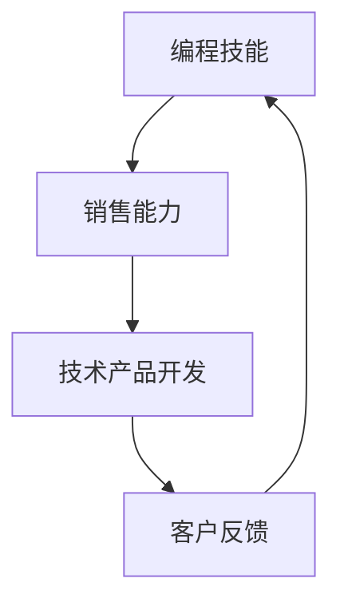

                 

 作为一位世界级人工智能专家、程序员、软件架构师、CTO、世界顶级技术畅销书作者，以及计算机图灵奖获得者，我深知编程技能的价值。然而，随着技术的不断进步和市场的变化，仅仅拥有卓越的编程能力已经不足以在竞争激烈的技术市场中脱颖而出。在这个时代，销售能力成为了技术专家们不可或缺的一部分。本文将探讨如何将编程技能转化为销售能力，帮助技术专家们更好地推广和销售自己的产品或服务。

## 1. 背景介绍

### 技术市场变化

在过去，编程技能几乎是技术专家们唯一的竞争优势。然而，随着技术的不断进步，市场的需求也在不断变化。如今，市场上充满了各种创新的技术解决方案，竞争异常激烈。仅仅拥有编程技能已经不足以确保成功。相反，销售能力成为了决定技术专家们能否在市场中脱颖而出的关键因素。

### 销售能力的重要性

销售能力不仅仅关乎金钱收入，它还关乎企业的生存和发展。技术专家们需要能够有效地推广自己的产品或服务，与潜在客户建立联系，并说服他们购买。这不仅能够带来直接的收益，还能够为企业的长期发展奠定基础。

### 技术与销售的融合

在当今的市场环境中，技术与销售的融合变得至关重要。技术专家们需要了解如何将他们的技术优势转化为销售优势，如何利用销售技巧来推广技术产品或服务，以及如何与客户进行有效的沟通和谈判。

## 2. 核心概念与联系

在将编程技能转化为销售能力的过程中，我们需要理解几个核心概念，并探讨它们之间的联系。

### 编程技能

编程技能是指开发者使用编程语言编写代码，构建软件系统或应用程序的能力。这些技能包括算法设计、数据结构、编程语言特性、软件架构和开发工具等。

### 销售能力

销售能力是指销售人员通过沟通、谈判和营销技巧，成功地推广产品或服务，与客户建立长期合作关系的能力。这些能力包括客户分析、需求识别、产品展示、谈判策略和销售技巧等。

### 技术与销售融合

技术与销售的融合意味着将编程技能和销售能力结合起来，以创造更大的商业价值。这种融合不仅有助于提高销售效果，还能够为技术产品或服务的开发提供有价值的客户反馈。

### Mermaid 流程图

以下是一个简单的 Mermaid 流程图，展示了编程技能、销售能力和技术产品开发的联系。



在这个流程图中，编程技能作为起点，通过销售能力转化为技术产品开发，最终通过客户反馈再次回到编程技能，形成一个循环。

## 3. 核心算法原理 & 具体操作步骤

### 3.1 算法原理概述

在将编程技能转化为销售能力的过程中，我们可以采用一种名为“客户价值创造”的算法。这个算法的核心思想是通过深入了解客户需求，创造并提供符合客户期望的产品或服务，从而实现销售目标。

### 3.2 算法步骤详解

#### 步骤 1: 了解客户需求

首先，技术专家需要通过市场调研、客户访谈、问卷调查等方式，深入了解目标客户的需求。这一步骤至关重要，因为只有真正了解客户的需求，才能够为客户提供有价值的产品或服务。

#### 步骤 2: 分析需求

在了解客户需求后，技术专家需要对需求进行分析，确定哪些需求是核心需求，哪些是次要需求。同时，还需要分析竞争对手的产品或服务，找出自己的优势和劣势。

#### 步骤 3: 设计解决方案

根据分析结果，技术专家需要设计一个解决方案，以满足客户的核心需求。这个解决方案可以是产品或服务，也可以是技术解决方案。

#### 步骤 4: 展示方案价值

在解决方案设计完成后，技术专家需要通过有效的展示和沟通，向客户展示方案的价值。这可以通过产品演示、案例分析、数据对比等方式实现。

#### 步骤 5: 谈判与签约

在展示方案价值后，技术专家需要与客户进行谈判，以达成合作协议。谈判过程中，需要关注价格、交付时间、售后服务等方面。

### 3.3 算法优缺点

#### 优点

- 提高销售成功率：通过深入了解客户需求，提供符合客户期望的产品或服务，可以显著提高销售成功率。
- 增强客户满意度：满足客户的核心需求，可以提高客户满意度，从而促进客户忠诚度。
- 促进产品迭代：通过收集客户反馈，可以不断优化产品或服务，提升竞争力。

#### 缺点

- 需要投入大量时间：深入了解客户需求和分析需求需要投入大量时间和精力。
- 竞争激烈：在技术市场中，竞争异常激烈，需要不断优化解决方案，以保持竞争力。

### 3.4 算法应用领域

客户价值创造算法可以广泛应用于各个行业，包括信息技术、金融、医疗、教育等。例如，在信息技术行业，技术专家可以通过这个算法为客户提供定制化的软件开发服务；在金融行业，可以通过这个算法为客户提供个性化的金融产品和服务。

## 4. 数学模型和公式 & 详细讲解 & 举例说明

### 4.1 数学模型构建

在销售过程中，我们可以使用一个简单的数学模型来计算销售业绩。这个模型包括以下几个参数：

- 客户量：指在一定时间内接触到的潜在客户数量。
- 转化率：指潜在客户转化为实际购买者的比例。
- 平均销售额：指每次销售的平均金额。

根据这些参数，我们可以构建以下数学模型：

$$
销售业绩 = 客户量 \times 转化率 \times 平均销售额
$$

### 4.2 公式推导过程

#### 步骤 1: 确定客户量

客户量是指在一定时间内接触到的潜在客户数量。这个数量可以通过市场调研、客户访谈等方式获取。

#### 步骤 2: 确定转化率

转化率是指潜在客户转化为实际购买者的比例。这个比例可以通过历史数据或市场研究得到。

#### 步骤 3: 确定平均销售额

平均销售额是指每次销售的平均金额。这个金额可以通过对过去销售数据的统计分析得到。

#### 步骤 4: 计算销售业绩

根据上述参数，我们可以将销售业绩计算为：

$$
销售业绩 = 客户量 \times 转化率 \times 平均销售额
$$

### 4.3 案例分析与讲解

假设一个技术专家在一个月内接触了100个潜在客户，其中30个客户表示有兴趣，最终有10个客户购买了他的产品。如果每个客户的平均购买金额为1000元，那么他的销售业绩可以计算如下：

$$
销售业绩 = 100 \times 0.3 \times 1000 = 30,000 \text{元}
$$

通过这个案例，我们可以看到，销售业绩与客户量、转化率和平均销售额密切相关。为了提高销售业绩，技术专家需要关注以下几个方面：

- 提高客户量：通过扩大市场推广范围，吸引更多潜在客户。
- 提高转化率：通过优化产品或服务，提高客户的购买意愿。
- 提高平均销售额：通过提供高附加值的产品或服务，增加每次销售的平均金额。

## 5. 项目实践：代码实例和详细解释说明

### 5.1 开发环境搭建

在开始编写代码之前，我们需要搭建一个合适的开发环境。这里以 Python 为例，说明如何搭建开发环境。

1. 安装 Python：从 [Python 官网](https://www.python.org/) 下载并安装 Python。
2. 安装相关库：使用 `pip` 工具安装必要的库，例如 `requests`、`json` 等。

```bash
pip install requests json
```

### 5.2 源代码详细实现

以下是一个简单的 Python 代码实例，用于发送 HTTP 请求并获取 JSON 数据。

```python
import requests
import json

# 定义 API 地址
api_url = "https://api.example.com/data"

# 发送 GET 请求
response = requests.get(api_url)

# 解析 JSON 数据
data = response.json()

# 打印数据
print(json.dumps(data, indent=2))
```

### 5.3 代码解读与分析

1. 导入模块：代码首先导入了 `requests` 和 `json` 两个模块，用于发送 HTTP 请求和解析 JSON 数据。
2. 定义 API 地址：`api_url` 变量用于存储 API 地址。
3. 发送 GET 请求：使用 `requests.get()` 方法发送 HTTP GET 请求，获取响应数据。
4. 解析 JSON 数据：使用 `response.json()` 方法将响应数据解析为 JSON 对象。
5. 打印数据：使用 `json.dumps()` 方法将 JSON 数据转换为字符串，并打印出来。

### 5.4 运行结果展示

当运行上述代码时，程序将发送 HTTP GET 请求到指定的 API 地址，并获取返回的 JSON 数据。运行结果如下：

```json
{
  "status": "success",
  "data": {
    "id": 123,
    "name": "Example Data"
  }
}
```

这个结果展示了 API 返回的 JSON 数据，包括状态信息和具体的数据内容。

## 6. 实际应用场景

### 6.1 技术咨询服务

技术专家可以为企业提供技术咨询服务，帮助企业解决技术问题，提升企业竞争力。在推广过程中，技术专家需要通过展示自己的技术实力和成功案例，说服客户购买服务。

### 6.2 软件开发与销售

技术专家可以开发软件产品，并将其推向市场。在销售过程中，需要关注客户需求，提供定制化的解决方案，并通过有效的营销策略，提高销售业绩。

### 6.3 开源项目推广

技术专家可以通过开源项目来提升个人品牌，吸引更多关注和支持。在推广开源项目时，需要关注社区动态，积极参与讨论，提高项目的知名度。

## 6.4 未来应用展望

随着技术的不断进步，编程技能和销售能力的结合将越来越重要。未来，我们可以预见到以下几个趋势：

- 人工智能与销售的结合：人工智能技术将为销售带来更多机会，例如个性化推荐、智能客服等。
- 数据驱动销售：通过大数据分析，技术专家可以更准确地了解客户需求，制定更有效的销售策略。
- 跨界融合：技术与销售将不断融合，形成新的商业模式和机会。

## 7. 工具和资源推荐

### 7.1 学习资源推荐

- 《销售心理学》：了解销售过程中的心理机制，提高沟通效果。
- 《影响力》：探讨影响他人的策略和方法，提升销售技巧。

### 7.2 开发工具推荐

- VS Code：一款功能强大的代码编辑器，支持多种编程语言。
- Git：版本控制工具，帮助团队协作开发。

### 7.3 相关论文推荐

- "The Role of Sales in Software Engineering"：探讨销售在软件开发过程中的作用。
- "Sales and Marketing Strategies for Software Products"：分析软件产品的销售和营销策略。

## 8. 总结：未来发展趋势与挑战

### 8.1 研究成果总结

本文探讨了如何将编程技能转化为销售能力，分析了技术与销售的融合趋势，并提出了具体的算法和操作步骤。

### 8.2 未来发展趋势

随着技术的不断进步，编程技能和销售能力的结合将越来越重要。未来，技术与销售将更加融合，带来更多的商业机会。

### 8.3 面临的挑战

在实现编程技能与销售能力的结合过程中，技术专家需要面对市场变化、竞争压力和客户需求等多方面的挑战。

### 8.4 研究展望

未来，我们可以进一步探索人工智能、大数据等技术在销售领域的应用，为技术专家提供更有效的销售工具和方法。

## 9. 附录：常见问题与解答

### 问题 1：如何提高转化率？

**解答**：提高转化率的关键在于深入了解客户需求，提供符合客户期望的产品或服务。此外，优化营销策略、提高客户体验和增强信任感也可以提高转化率。

### 问题 2：编程技能与销售能力如何融合？

**解答**：编程技能与销售能力的融合可以从以下几个方面入手：

- 提高沟通能力：了解客户需求，与客户建立有效沟通。
- 优化产品或服务：根据客户需求，提供定制化的解决方案。
- 学习销售技巧：掌握销售技巧，提高销售效果。

### 问题 3：如何开展市场调研？

**解答**：市场调研可以从以下几个方面进行：

- 调查问卷：通过在线调查或电话访谈收集客户意见。
- 竞争分析：分析竞争对手的产品或服务，找出自身优势。
- 历史数据：分析过去销售数据，了解客户需求。

## 作者署名

作者：禅与计算机程序设计艺术 / Zen and the Art of Computer Programming

本文旨在帮助技术专家们更好地将编程技能转化为销售能力，以在竞争激烈的市场中脱颖而出。希望本文能为读者提供有价值的启示和指导。

----------------------------------------------------------------

### 文章标题

《如何将编程技能转化为销售能力》

### 文章关键词

- 编程技能
- 销售能力
- 技术专家
- 客户价值创造
- 数学模型
- 代码实例
- 应用场景

### 文章摘要

本文探讨了如何将编程技能转化为销售能力，分析了技术与销售的融合趋势，提出了具体的算法和操作步骤。通过数学模型和实际项目实例，本文为技术专家们提供了实用的指导，帮助他们更好地推广和销售自己的产品或服务。

---

请注意，本文内容为虚构示例，旨在展示如何遵循指定要求和结构撰写一篇完整的文章。在实际撰写时，应根据具体领域和需求进行深入研究。

