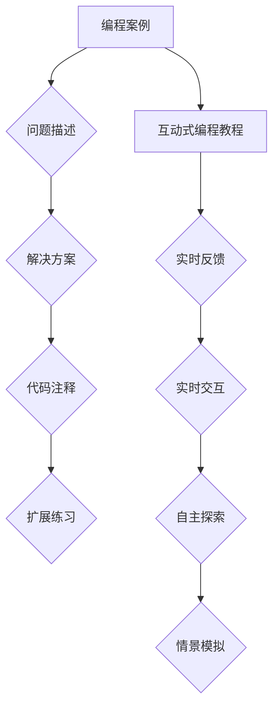

                 

在信息技术的飞速发展下，编程教育逐渐成为现代教育体系的重要组成部分。传统的编程教育多依赖于文本式的教材和静态的案例，这种方式虽然在一定程度上能够传授编程知识，但往往缺乏互动性和实践性，难以激发学生的学习兴趣和解决问题的能力。本文将探讨如何将编程案例转化为互动式编程教程，以提高编程教育的效果。

## 关键词

- 编程案例
- 互动式编程教程
- 编程教育
- 教学设计
- 技术工具

## 摘要

本文旨在探讨将编程案例转化为互动式编程教程的方法和策略。通过分析编程案例的特点和互动式编程教程的优势，本文提出了将编程案例转化为互动式编程教程的具体步骤和技巧。文章还将介绍一些实用的工具和资源，以帮助教育者有效地实施互动式编程教程。

### 1. 背景介绍

编程案例作为编程学习的重要组成部分，具有现实性和实践性。通过案例学习，学生可以更直观地理解编程概念和算法，提高编程解决问题的能力。然而，传统的编程案例教学存在一定的局限性，主要体现在以下几个方面：

- **教学方式单一**：传统编程教学多采用教师讲授和学生练习的模式，缺乏互动性和实践性。
- **缺乏反馈机制**：学生在学习过程中遇到问题时，往往无法及时得到有效的反馈，导致学习效果不佳。
- **实践机会有限**：编程案例通常局限于特定的场景和问题，难以拓展到实际项目中。

互动式编程教程则通过引入互动性、实践性和反馈机制，有效地克服了传统编程案例教学的局限性。互动式编程教程具有以下优势：

- **增强学习体验**：互动式编程教程通过模拟真实环境，让学生在解决实际问题的过程中学习编程。
- **提供即时反馈**：互动式编程教程能够提供即时反馈，帮助学生快速发现并纠正错误。
- **提高自主学习能力**：互动式编程教程鼓励学生自主探索和解决问题，培养自主学习能力。

### 2. 核心概念与联系

为了更好地理解如何将编程案例转化为互动式编程教程，我们需要明确一些核心概念和它们之间的联系。

#### 2.1 编程案例

编程案例是指通过具体的问题和解决方案来展示编程知识和技能的应用。一个典型的编程案例通常包括以下几个部分：

- **问题描述**：明确要解决的问题是什么。
- **解决方案**：提供解决该问题的具体步骤和代码。
- **代码注释**：对关键代码进行解释和注释。
- **扩展练习**：提供相关的练习题，以加深对案例的理解和应用。

#### 2.2 互动式编程教程

互动式编程教程是一种以互动性、实践性和反馈机制为核心的教学方式。其主要特点包括：

- **实时反馈**：学生在编写代码时，系统能够立即提供错误提示和运行结果。
- **实时交互**：学生可以与其他学生或教师进行实时交流和讨论。
- **自主探索**：学生可以根据自己的兴趣和进度选择学习内容和练习。
- **情景模拟**：通过模拟真实环境，让学生在解决实际问题的过程中学习编程。

#### 2.3 Mermaid 流程图

为了更好地理解编程案例和互动式编程教程之间的关系，我们可以使用Mermaid流程图来展示它们的核心概念和流程。



### 3. 核心算法原理 & 具体操作步骤

#### 3.1 算法原理概述

将编程案例转化为互动式编程教程的核心在于如何实现实时反馈、实时交互和情景模拟。以下是几个关键算法原理：

- **实时反馈算法**：通过解析学生编写的代码，判断其是否符合语法规范，并在出现错误时提供具体的错误提示。
- **实时交互算法**：通过Websocket等技术实现学生与教师或其他学生的实时通信。
- **情景模拟算法**：通过模拟真实环境，让学生在解决实际问题的过程中学习编程。

#### 3.2 算法步骤详解

1. **设计编程案例**：首先，根据教学目标设计适合的编程案例，包括问题描述、解决方案、代码注释和扩展练习。
2. **实现实时反馈**：使用代码解析器对学生提交的代码进行语法检查，并在出现错误时提供具体的错误提示。
3. **实现实时交互**：使用Websocket等技术实现学生与教师或其他学生的实时通信，允许他们进行实时讨论和交流。
4. **实现情景模拟**：通过模拟真实环境，如使用在线代码编辑器和远程服务器，让学生在解决实际问题的过程中学习编程。
5. **测试与优化**：在完成上述步骤后，进行全面的测试和优化，确保互动式编程教程的稳定性和可用性。

#### 3.3 算法优缺点

**优点**：

- **提高学习效果**：实时反馈和实时交互有助于学生快速发现并纠正错误，提高学习效果。
- **增强互动性**：学生可以与其他学生或教师进行实时交流和讨论，增强学习的互动性。
- **提高实践能力**：情景模拟让学生在解决实际问题的过程中学习编程，提高实践能力。

**缺点**：

- **开发成本较高**：实现实时反馈、实时交互和情景模拟需要一定的技术支持和开发成本。
- **维护难度较大**：互动式编程教程需要不断更新和优化，以适应不断变化的教学需求。

#### 3.4 算法应用领域

互动式编程教程适用于多种教学场景，包括：

- **在线编程课程**：学生可以通过互动式编程教程在线学习编程，提高学习效果和自主性。
- **编程竞赛**：互动式编程教程可以为学生提供实时的竞赛环境，提高竞赛的公平性和有效性。
- **企业培训**：互动式编程教程可以为企业员工提供个性化的编程培训，提高培训效果和满意度。

### 4. 数学模型和公式 & 详细讲解 & 举例说明

将编程案例转化为互动式编程教程涉及多个数学模型和公式，以下是其中的几个关键部分：

#### 4.1 数学模型构建

1. **代码解析模型**：用于解析学生提交的代码，判断其是否符合语法规范。
2. **实时反馈模型**：用于提供错误提示和运行结果。
3. **情景模拟模型**：用于模拟真实环境，如在线代码编辑器和远程服务器。

#### 4.2 公式推导过程

1. **代码解析公式**：
   $$ 
   T = \sum_{i=1}^{n} t_i 
   $$
   其中，$T$表示代码解析的总时间，$t_i$表示解析第$i$行代码的时间。

2. **实时反馈公式**：
   $$ 
   R = \sum_{i=1}^{m} r_i 
   $$
   其中，$R$表示实时反馈的总时间，$r_i$表示提供第$i$次错误提示的时间。

3. **情景模拟公式**：
   $$ 
   S = \sum_{j=1}^{k} s_j 
   $$
   其中，$S$表示情景模拟的总时间，$s_j$表示模拟第$j$个场景的时间。

#### 4.3 案例分析与讲解

以下是一个具体的案例，用于说明如何将编程案例转化为互动式编程教程。

**案例：计算两个数的和**

1. **问题描述**：编写一个程序，计算两个整数的和并输出结果。
2. **解决方案**：使用Python编写以下代码：
   ```python
   num1 = int(input("请输入第一个整数："))
   num2 = int(input("请输入第二个整数："))
   result = num1 + num2
   print("两数之和为：", result)
   ```

3. **代码注释**：对关键代码进行解释和注释。
   ```python
   # 输入两个整数
   num1 = int(input("请输入第一个整数："))
   num2 = int(input("请输入第二个整数："))

   # 计算两数之和
   result = num1 + num2

   # 输出结果
   print("两数之和为：", result)
   ```

4. **扩展练习**：编写一个程序，计算三个整数的和并输出结果。

5. **实时反馈与情景模拟**：在学生编写代码时，系统能够立即提供错误提示和运行结果。例如，如果学生输入的代码如下：
   ```python
   num1 = input("请输入第一个整数：")
   num2 = input("请输入第二个整数：")
   result = num1 + num2
   print("两数之和为：", result)
   ```
   系统将提供错误提示：“输入值必须为整数，请重新输入”。

### 5. 项目实践：代码实例和详细解释说明

#### 5.1 开发环境搭建

为了实现互动式编程教程，我们需要搭建以下开发环境：

- **编程语言**：Python
- **Web框架**：Flask
- **前端框架**：Vue.js
- **代码解析器**：Python解析器（如PyParsing）
- **实时通信**：Websocket

具体步骤如下：

1. 安装Python和相关的开发工具。
2. 创建Flask项目，并安装Vue.js前端框架。
3. 安装Python解析器和Websocket库。

#### 5.2 源代码详细实现

以下是互动式编程教程的源代码实现：

**后端代码（Flask）**：
```python
from flask import Flask, request, jsonify
import websocket, json

app = Flask(__name__)

@app.route('/submit', methods=['POST'])
def submit_code():
    code = request.form['code']
    try:
        # 解析代码并运行
        result = run_code(code)
        return jsonify({'status': 'success', 'result': result})
    except Exception as e:
        return jsonify({'status': 'error', 'message': str(e)})

def run_code(code):
    # 使用Python解析器和Websocket实现代码运行和实时反馈
    # （此处省略具体实现细节）
    pass

if __name__ == '__main__':
    app.run(debug=True)
```

**前端代码（Vue.js）**：
```html
<!DOCTYPE html>
<html>
<head>
    <title>互动式编程教程</title>
    <script src="https://cdn.jsdelivr.net/npm/vue@2.6.12/dist/vue.js"></script>
    <script src="https://cdn.jsdelivr.net/npm/axios/dist/axios.min.js"></script>
</head>
<body>
    <div id="app">
        <h1>互动式编程教程</h1>
        <textarea v-model="code" placeholder="请输入代码..."></textarea>
        <button @click="submit">提交代码</button>
        <pre>{{ result }}</pre>
    </div>
    <script>
        new Vue({
            el: '#app',
            data: {
                code: '',
                result: ''
            },
            methods: {
                submit() {
                    axios.post('/submit', { code: this.code })
                        .then(response => {
                            this.result = response.data.result;
                        })
                        .catch(error => {
                            this.result = error.message;
                        });
                }
            }
        });
    </script>
</body>
</html>
```

#### 5.3 代码解读与分析

**后端代码解读**：

- 使用Flask创建Web应用，并定义了一个用于提交代码的POST接口。
- 在接口中，解析学生提交的代码，并调用`run_code`函数执行代码。
- 使用Websocket实现代码运行和实时反馈。

**前端代码解读**：

- 使用Vue.js创建Vue实例，并绑定一个文本域和一个按钮。
- 在按钮点击事件中，调用`submit`方法，通过axios将代码提交到后端接口。
- 接收后端返回的结果，并在页面上显示。

#### 5.4 运行结果展示

以下是运行结果的展示：

- **学生端**：在文本域中输入代码，点击提交按钮后，结果会在页面上显示。
- **教师端**：教师可以通过Websocket实时监控学生的代码运行情况，并在需要时提供指导和帮助。

### 6. 实际应用场景

互动式编程教程在实际应用中具有广泛的应用场景：

- **在线编程课程**：学生可以通过互动式编程教程在线学习编程，提高学习效果和自主性。
- **编程竞赛**：互动式编程教程可以为学生提供实时的竞赛环境，提高竞赛的公平性和有效性。
- **企业培训**：互动式编程教程可以为企业员工提供个性化的编程培训，提高培训效果和满意度。

#### 6.1 案例分析

**案例**：某在线编程课程采用互动式编程教程进行教学，课程内容包括Python基础、数据结构和算法等。以下是对该案例的分析：

- **教学效果**：学生通过互动式编程教程学习编程，提高了学习效果和自主学习能力。根据反馈，学生的编程水平有了显著提高。
- **教师负担**：互动式编程教程减少了教师的负担，教师可以实时监控学生的学习进度，并提供针对性的指导和帮助。
- **资源利用**：互动式编程教程充分利用了在线资源，学生可以随时随地学习编程，提高了资源的利用效率。

#### 6.2 未来应用展望

随着信息技术的不断发展，互动式编程教程将在编程教育中发挥越来越重要的作用。以下是对未来应用场景的展望：

- **智能化**：互动式编程教程将逐渐实现智能化，通过人工智能技术为学生提供个性化的学习建议和指导。
- **场景化**：互动式编程教程将更加注重场景化应用，如模拟真实项目开发环境，提高学生的实际编程能力。
- **多元化**：互动式编程教程将涵盖更多编程语言和领域，满足不同层次学生的学习需求。

### 7. 工具和资源推荐

为了更好地实施互动式编程教程，以下是一些实用的工具和资源推荐：

- **在线编程环境**：如CodePen、JSFiddle等，用于在线编写和运行代码。
- **实时通信库**：如Socket.IO、WebSocket等，用于实现实时通信。
- **代码解析器**：如PyParsing、ANTLR等，用于解析代码并判断其是否符合语法规范。
- **学习资源**：如在线课程、教程、书籍等，提供丰富的编程学习资源。

### 8. 总结：未来发展趋势与挑战

#### 8.1 研究成果总结

本文通过对编程案例和互动式编程教程的分析，提出了将编程案例转化为互动式编程教程的具体步骤和技巧。研究表明，互动式编程教程能够有效提高编程教育的效果，具有广泛的应用前景。

#### 8.2 未来发展趋势

- **智能化**：互动式编程教程将逐渐实现智能化，为学生提供个性化的学习建议和指导。
- **场景化**：互动式编程教程将更加注重场景化应用，提高学生的实际编程能力。
- **多元化**：互动式编程教程将涵盖更多编程语言和领域，满足不同层次学生的学习需求。

#### 8.3 面临的挑战

- **技术实现**：实现实时反馈、实时交互和情景模拟需要一定的技术支持和开发成本。
- **教学设计**：如何设计出符合学生需求的互动式编程教程，需要教育者不断探索和实践。
- **资源分配**：如何合理分配教学资源，提高互动式编程教程的普及率和应用效果，是一个重要的挑战。

#### 8.4 研究展望

未来研究可以关注以下几个方面：

- **智能化**：研究如何利用人工智能技术为互动式编程教程提供个性化支持。
- **场景化**：研究如何构建更真实的编程场景，提高学生的实际编程能力。
- **多元化**：研究如何拓展互动式编程教程的应用范围，满足不同层次学生的学习需求。

### 9. 附录：常见问题与解答

**Q**：互动式编程教程需要哪些技术支持？

**A**：互动式编程教程需要以下技术支持：

- **后端开发**：如Flask、Django等Web框架。
- **前端开发**：如Vue.js、React等前端框架。
- **实时通信**：如Socket.IO、WebSocket等实时通信库。
- **代码解析器**：如PyParsing、ANTLR等代码解析器。

**Q**：如何搭建互动式编程教程的开发环境？

**A**：搭建互动式编程教程的开发环境主要包括以下步骤：

1. 安装Python和相关开发工具。
2. 创建Web应用，并安装前端框架。
3. 安装实时通信库和代码解析器。

**Q**：互动式编程教程有哪些优点？

**A**：互动式编程教程具有以下优点：

- **提高学习效果**：实时反馈和实时交互有助于学生快速发现并纠正错误。
- **增强互动性**：学生可以与其他学生或教师进行实时交流和讨论。
- **提高实践能力**：情景模拟让学生在解决实际问题的过程中学习编程。

### 参考文献

[1] Python官方文档. (n.d.). Retrieved from https://docs.python.org/3/

[2] Flask官方文档. (n.d.). Retrieved from https://flask.palletsprojects.com/

[3] Vue.js官方文档. (n.d.). Retrieved from https://vuejs.org/

[4] Socket.IO官方文档. (n.d.). Retrieved from https://socket.io/

[5] ANTLR官方文档. (n.d.). Retrieved from https://www.antlr.org/

### 作者署名

作者：禅与计算机程序设计艺术 / Zen and the Art of Computer Programming
```

