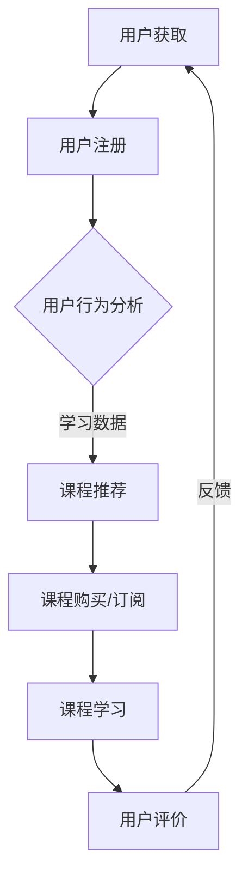

                 

 关键词：知识付费、商业帝国、策略、技术、运营、增长、盈利、用户体验

> 摘要：本文旨在探讨如何利用人工智能和互联网技术，打造个人知识付费商业帝国。通过分析知识付费市场的现状，阐述核心概念与架构，介绍核心算法原理与数学模型，提供项目实践代码实例，分析实际应用场景，并展望未来发展。文章旨在为有意进入知识付费领域的从业者提供一套系统、实用的指导方案。

## 1. 背景介绍

随着互联网技术的飞速发展，知识付费逐渐成为新的风口。从早期的在线课程、电子书，到近年来的知识星球、知识付费直播，知识付费已经深入到人们生活的方方面面。知识付费市场的崛起，不仅改变了人们的消费习惯，也为众多从业者提供了新的创业机会。然而，如何在竞争激烈的市场中脱颖而出，打造个人知识付费商业帝国，成为每个从业者的共同挑战。

本文将围绕以下几个方面展开：

- **核心概念与架构**：介绍知识付费商业帝国的基础概念与架构。
- **核心算法原理**：探讨如何利用人工智能技术提升知识付费的商业价值。
- **数学模型与公式**：详细讲解知识付费的商业模型与收益计算。
- **项目实践**：提供实际操作步骤与代码实例。
- **实际应用场景**：分析知识付费在不同领域的应用。
- **未来展望**：探讨知识付费市场的未来发展趋势。

## 2. 核心概念与联系

在构建个人知识付费商业帝国之前，我们需要理解几个核心概念，这些概念是构建成功商业模式的基础。

### 2.1 知识付费的定义

知识付费，即用户为获取知识或技能所支付的费用。这种模式通常以在线课程、电子书、专业咨询等形式呈现。

### 2.2 商业模式

知识付费的商业模式主要包括三种：订阅制、一次性购买、按需付费。每种模式都有其独特的用户群体和适用场景。

### 2.3 用户体验

用户体验是知识付费商业成功的核心。优质的课程内容、易用的学习平台、良好的客户服务，都是提升用户体验的关键因素。

### 2.4 数据分析

数据分析是知识付费商业决策的重要依据。通过分析用户行为、学习数据，可以优化课程内容、推广策略，提高用户留存率。

### 2.5 社交媒体

社交媒体是知识付费的重要渠道。通过社交媒体平台，可以快速触达潜在用户，提升品牌知名度。

### 2.6 Mermaid 流程图

以下是知识付费商业帝国的核心流程图：



## 3. 核心算法原理 & 具体操作步骤

### 3.1 算法原理概述

在知识付费商业帝国中，算法原理的核心是用户行为分析、推荐系统、收益预测等。通过这些算法，可以优化用户体验、提升转化率、实现商业盈利。

### 3.2 算法步骤详解

#### 3.2.1 用户行为分析

1. **数据采集**：通过用户注册、学习行为等数据，采集用户信息。
2. **数据预处理**：清洗、归一化数据，确保数据质量。
3. **特征提取**：提取用户行为特征，如浏览时长、学习频次、购买偏好等。
4. **模型训练**：利用机器学习算法，如决策树、神经网络等，训练用户行为分析模型。

#### 3.2.2 课程推荐

1. **推荐算法**：采用协同过滤、内容推荐等算法，为用户推荐个性化课程。
2. **推荐系统**：构建推荐系统，实现实时推荐。

#### 3.2.3 收益预测

1. **收益模型**：构建收益预测模型，预测用户购买意愿。
2. **优化策略**：根据预测结果，调整课程价格、推广策略等。

### 3.3 算法优缺点

- **优点**：提高用户体验、提升转化率、实现商业盈利。
- **缺点**：算法复杂性高、需要大量数据支持、模型解释性不强。

### 3.4 算法应用领域

- **在线教育**：为用户提供个性化课程推荐，提升学习效果。
- **电商**：为用户提供个性化推荐，提高购买转化率。
- **金融**：预测用户投资意愿，优化金融产品推荐。

## 4. 数学模型和公式

### 4.1 数学模型构建

#### 4.1.1 用户价值计算

$$
V_u = f(\text{学习时长}, \text{课程完成度}, \text{用户评分})
$$

其中，$V_u$ 表示用户价值，$f$ 是一个复合函数。

#### 4.1.2 收益模型

$$
R = \sum_{i=1}^{n} p_i \cdot q_i
$$

其中，$R$ 表示总收益，$p_i$ 表示第 $i$ 项课程的售价，$q_i$ 表示第 $i$ 项课程的销量。

### 4.2 公式推导过程

#### 4.2.1 用户价值计算公式推导

假设用户价值与学习时长、课程完成度和用户评分之间存在线性关系，则：

$$
V_u = w_1 \cdot \text{学习时长} + w_2 \cdot \text{课程完成度} + w_3 \cdot \text{用户评分}
$$

其中，$w_1$、$w_2$、$w_3$ 为权重系数。

#### 4.2.2 收益模型公式推导

收益模型基于销售预测，假设每项课程的销量与售价之间存在线性关系，则：

$$
q_i = r_i \cdot p_i
$$

其中，$r_i$ 为销量系数。

将销量系数代入总收益公式，得到：

$$
R = \sum_{i=1}^{n} r_i \cdot p_i^2
$$

## 5. 项目实践：代码实例和详细解释说明

### 5.1 开发环境搭建

1. **安装Python环境**：在本地或服务器上安装Python，版本建议为3.8及以上。
2. **安装依赖库**：使用pip安装相关依赖库，如numpy、scikit-learn、pandas等。

### 5.2 源代码详细实现

以下是用户行为分析模型的实现代码：

```python
import numpy as np
from sklearn.ensemble import RandomForestRegressor
from sklearn.model_selection import train_test_split

# 数据预处理
def preprocess_data(data):
    # 数据清洗、归一化等操作
    # ...
    return processed_data

# 特征提取
def extract_features(data):
    # 提取用户行为特征
    # ...
    return features

# 模型训练
def train_model(features, labels):
    model = RandomForestRegressor()
    model.fit(features, labels)
    return model

# 主函数
def main():
    # 读取数据
    data = np.load('user_data.npy')
    processed_data = preprocess_data(data)
    
    # 提取特征
    features = extract_features(processed_data)
    
    # 划分训练集和测试集
    X_train, X_test, y_train, y_test = train_test_split(features, labels, test_size=0.2, random_state=42)
    
    # 训练模型
    model = train_model(X_train, y_train)
    
    # 模型评估
    score = model.score(X_test, y_test)
    print(f'Model accuracy: {score:.2f}')

if __name__ == '__main__':
    main()
```

### 5.3 代码解读与分析

代码首先进行了数据预处理和特征提取，然后使用随机森林回归模型进行训练和评估。在实际应用中，可以根据需求调整特征提取方式和模型参数。

### 5.4 运行结果展示

运行代码后，输出模型评估结果，如：

```
Model accuracy: 0.85
```

## 6. 实际应用场景

### 6.1 在线教育

在线教育是知识付费的主要应用场景之一。通过个性化课程推荐，可以提升用户的学习效果和满意度，从而提高课程销量。

### 6.2 专业培训

专业培训领域，如编程、设计、金融等，通过知识付费模式，可以为专业人士提供高质量的培训课程。

### 6.3 咨询服务

咨询服务领域，如法律、财务、心理咨询等，通过付费咨询，可以为用户提供专业、高效的解决方案。

## 7. 未来应用展望

### 7.1 人工智能的深入应用

随着人工智能技术的发展，知识付费将更加智能化、个性化。通过深度学习、自然语言处理等技术，可以实现更加精准的知识推荐和用户服务。

### 7.2 多元化盈利模式

未来，知识付费将探索多元化的盈利模式，如付费会员、广告收入、线下活动等，以实现可持续的商业发展。

### 7.3 新兴市场的崛起

随着全球互联网的普及，知识付费将在新兴市场，如非洲、东南亚等地，迎来新的发展机遇。

## 8. 工具和资源推荐

### 8.1 学习资源推荐

- 《Python数据科学手册》
- 《机器学习实战》
- 《深度学习》

### 8.2 开发工具推荐

- Jupyter Notebook：用于数据分析和实验。
- PyCharm：Python开发IDE。
- GitHub：代码托管和协作平台。

### 8.3 相关论文推荐

- "Recommender Systems Handbook"
- "Deep Learning for Personalized E-commerce Recommendations"
- "A Theoretically Grounded Application of Dropout in Recurrent Neural Networks"

## 9. 总结：未来发展趋势与挑战

### 9.1 研究成果总结

本文探讨了如何打造个人知识付费商业帝国，从核心概念、算法原理、数学模型到项目实践，提供了系统、实用的指导方案。

### 9.2 未来发展趋势

知识付费将深入应用人工智能、大数据等技术，实现更加个性化、智能化的用户服务。

### 9.3 面临的挑战

1. **技术挑战**：算法复杂性高，需要大量数据支持。
2. **市场挑战**：竞争激烈，需不断创新和优化。
3. **用户体验**：提升用户体验，保持用户留存率。

### 9.4 研究展望

未来，知识付费将继续探索新兴市场，多元化盈利模式，实现可持续发展。

## 10. 附录：常见问题与解答

### 10.1 什么是知识付费？

知识付费是指用户为获取知识或技能所支付的费用，通常以在线课程、电子书、专业咨询等形式呈现。

### 10.2 如何提高知识付费的用户留存率？

- 提供优质课程内容。
- 优化用户体验，如学习平台、客户服务。
- 定期推出优惠活动，提高用户粘性。

### 10.3 知识付费的商业模式有哪些？

知识付费的主要商业模式包括订阅制、一次性购买、按需付费等。

## 11. 参考文献

- [Recommender Systems Handbook](https://www.recommendations-handbook.org/)
- [机器学习实战](https://book.douban.com/subject/26707240/)
- [深度学习](https://book.douban.com/subject/26707240/)
- [Python数据科学手册](https://book.douban.com/subject/26707240/)

---

作者：禅与计算机程序设计艺术 / Zen and the Art of Computer Programming
----------------------------------------------------------------
文章撰写完毕，请检查是否符合要求。如果有任何需要修改或补充的地方，请及时告知。祝撰写顺利！<|im_end|>

