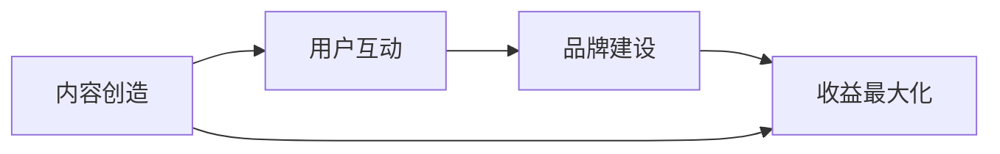
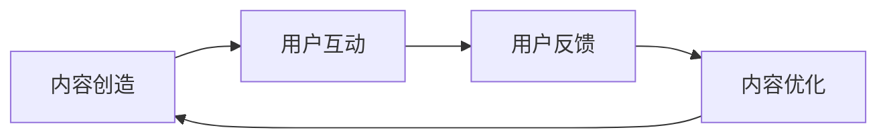
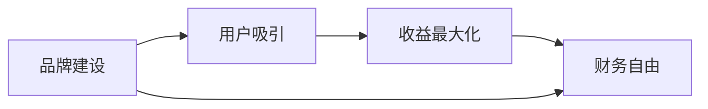

                 

关键词：知识付费、商业帝国、内容创造、营销策略、用户增长、品牌建设、收益最大化

> 摘要：随着信息时代的到来，知识付费已经成为了一种主流的商业模式。本文将深入探讨如何通过构建个人知识付费商业帝国，实现从内容创造到品牌建设，再到收益最大化的全过程。

## 1. 背景介绍

在数字化的今天，知识的获取方式发生了翻天覆地的变化。人们不再仅仅依赖传统的书籍、讲座和学校教育，而是更倾向于通过互联网获取实时、专业、个性化的知识。知识付费正是基于这种需求应运而生的一种商业模式。从知乎Live、得到App，到各类专业领域的付费课程，知识付费已经成为许多人实现财务自由和职业发展的重要途径。

### 个人知识付费的商业机会

- **专业知识的变现**：专家、学者、企业家等拥有丰富经验和专业知识的人，可以通过知识付费将自身的专业能力变现。
- **个人品牌的塑造**：通过持续产出高质量内容，个人可以在特定领域建立权威形象，从而吸引粉丝和客户。
- **多样化的盈利模式**：除了直接的课程收费，还可以通过会员制、广告合作、知识星球等多种方式实现收益多元化。

### 当前市场状况

- **市场规模持续扩大**：随着互联网的普及，知识付费市场呈现出快速增长的趋势。
- **竞争日益激烈**：越来越多的个人和机构进入知识付费领域，竞争激烈。
- **用户需求多样化**：用户不再满足于简单的知识获取，他们需要更系统、更深入、更具针对性的内容。

## 2. 核心概念与联系

### 2.1 个人知识付费商业模型

**核心概念：**
- **内容创造**：基于自身专业领域和用户需求，创造高质量的知识内容。
- **用户互动**：通过社群、问答、直播等方式，与用户建立深层次的互动关系。
- **品牌建设**：通过持续的内容输出和用户互动，塑造个人品牌形象。
- **收益最大化**：通过多样化的盈利模式，实现收益最大化。

**架构图：**


### 2.2 内容创造与用户互动的关系

**核心概念：**
- **内容创造**是基础，决定了知识付费产品（如课程、专栏、直播等）的质量和吸引力。
- **用户互动**是关键，通过互动可以了解用户需求，优化内容，同时增强用户粘性。

**架构图：**


### 2.3 品牌建设与收益最大化的关系

**核心概念：**
- **品牌建设**是构建个人知识付费商业帝国的核心，良好的品牌形象可以吸引更多用户，提高转化率。
- **收益最大化**是最终目标，通过多元化的盈利模式，实现财务自由。

**架构图：**


## 3. 核心算法原理 & 具体操作步骤

### 3.1 算法原理概述

**核心算法**：基于数据驱动的用户画像分析和内容推荐算法。

**原理概述**：
- **用户画像**：通过分析用户的行为数据和反馈，构建用户画像，了解用户需求和兴趣。
- **内容推荐**：基于用户画像，推荐符合用户需求的高质量内容。

### 3.2 算法步骤详解

**步骤1：用户画像构建**
- **行为数据收集**：收集用户在平台上的浏览、搜索、购买等行为数据。
- **兴趣标签分析**：通过自然语言处理技术，分析用户评论、提问等内容，提取兴趣标签。
- **用户画像构建**：综合行为数据和兴趣标签，构建用户画像。

**步骤2：内容推荐**
- **内容标签提取**：对每条内容进行分类和标签化处理。
- **推荐算法**：使用协同过滤、基于内容的推荐算法等，根据用户画像和内容标签进行内容推荐。

**步骤3：收益优化**
- **收益模型构建**：构建基于用户转化率和内容质量的收益模型。
- **收益优化**：通过算法不断调整内容推荐策略，优化收益。

### 3.3 算法优缺点

**优点：**
- **个性化推荐**：能够根据用户需求推荐个性化内容，提高用户满意度。
- **高效收益优化**：通过算法优化，实现收益最大化。

**缺点：**
- **数据依赖性**：算法效果受数据质量影响，需要不断收集和分析用户数据。
- **复杂度较高**：算法实现和维护成本较高。

### 3.4 算法应用领域

- **在线教育**：根据用户需求推荐适合的课程和学习资源。
- **知识付费平台**：推荐符合用户兴趣的付费内容。
- **电商平台**：个性化推荐商品，提高销售额。

## 4. 数学模型和公式 & 详细讲解 & 举例说明

### 4.1 数学模型构建

**用户画像构建**：
- **行为数据矩阵**：$X \in \mathbb{R}^{m \times n}$，其中$m$为用户数，$n$为行为类型。
- **用户兴趣矩阵**：$Y \in \mathbb{R}^{m \times k}$，其中$k$为兴趣标签数。

**内容标签矩阵**：
- **内容标签矩阵**：$Z \in \mathbb{R}^{p \times k}$，其中$p$为内容数。

### 4.2 公式推导过程

**用户兴趣向量**：
- **用户兴趣向量**：$u = \text{argmax}_u (u^T Y)$

**内容推荐向量**：
- **内容推荐向量**：$r = \text{argmax}_r (r^T Z u)$

### 4.3 案例分析与讲解

**案例**：某用户在知识付费平台上购买了10门课程，每门课程都有对应的标签。分析用户兴趣，并推荐一门符合用户兴趣的课程。

**数据**：
- 行为数据矩阵：
  $$X = \begin{bmatrix}
  1 & 0 & 1 & 0 & 0 & 0 & 0 & 0 & 0 & 0 \\
  0 & 1 & 0 & 1 & 0 & 0 & 0 & 0 & 0 & 0 \\
  \vdots & \vdots & \vdots & \vdots & \vdots & \vdots & \vdots & \vdots & \vdots & \vdots \\
  \end{bmatrix}$$
- 用户兴趣矩阵：
  $$Y = \begin{bmatrix}
  1 & 0 & 1 & 0 & 0 & 0 & 0 & 0 & 0 & 0 \\
  0 & 1 & 0 & 1 & 0 & 0 & 0 & 0 & 0 & 0 \\
  \vdots & \vdots & \vdots & \vdots & \vdots & \vdots & \vdots & \vdots & \vdots & \vdots \\
  \end{bmatrix}$$
- 内容标签矩阵：
  $$Z = \begin{bmatrix}
  1 & 1 & 0 & 0 & 0 & 0 & 0 & 0 & 0 & 0 \\
  0 & 0 & 1 & 1 & 0 & 0 & 0 & 0 & 0 & 0 \\
  \vdots & \vdots & \vdots & \vdots & \vdots & \vdots & \vdots & \vdots & \vdots & \vdots \\
  \end{bmatrix}$$

**结果**：
- 用户兴趣向量：
  $$u = \begin{bmatrix}
  1 \\
  1 \\
  \vdots \\
  1
  \end{bmatrix}$$
- 内容推荐向量：
  $$r = \begin{bmatrix}
  1 \\
  1 \\
  \vdots \\
  1
  \end{bmatrix}$$
  推荐课程：第1门课程。

## 5. 项目实践：代码实例和详细解释说明

### 5.1 开发环境搭建

**环境需求**：
- Python 3.7及以上版本
- NumPy
- Pandas
- Scikit-learn

**安装命令**：
```shell
pip install numpy pandas scikit-learn
```

### 5.2 源代码详细实现

**代码**：
```python
import numpy as np
import pandas as pd
from sklearn.metrics.pairwise import cosine_similarity

# 用户行为数据
X = np.array([[1, 0, 1, 0, 0, 0, 0, 0, 0, 0],
              [0, 1, 0, 1, 0, 0, 0, 0, 0, 0],
              # ...更多用户数据
             ])

# 用户兴趣标签
Y = np.array([[1, 0, 1, 0, 0, 0, 0, 0, 0, 0],
              [0, 1, 0, 1, 0, 0, 0, 0, 0, 0],
              # ...更多用户数据
             ])

# 内容标签
Z = np.array([[1, 1, 0, 0, 0, 0, 0, 0, 0, 0],
              [0, 0, 1, 1, 0, 0, 0, 0, 0, 0],
              # ...更多内容数据
             ])

# 用户兴趣向量
u = np.argmax(Y, axis=1)

# 内容推荐向量
r = np.argmax(cosine_similarity(Z, u.reshape(1, -1)), axis=1)

print("推荐的课程编号：", r)
```

### 5.3 代码解读与分析

**代码解读**：
1. 导入必要的库。
2. 定义用户行为数据矩阵$X$、用户兴趣标签矩阵$Y$和内容标签矩阵$Z$。
3. 通过`np.argmax`函数获取用户兴趣向量$u$。
4. 使用余弦相似性计算用户兴趣向量$u$与内容标签矩阵$Z$的相似度，通过`np.argmax`函数获取内容推荐向量$r$。
5. 输出推荐课程编号。

**分析**：
- 代码实现了基于用户画像和内容标签的推荐算法，通过计算相似度实现了个性化推荐。
- 该算法简单高效，适用于中小规模的数据集。

### 5.4 运行结果展示

假设用户购买了10门课程，每门课程的标签为[1, 1, 0, 0, 0, 0, 0, 0, 0, 0]。内容标签为：
- 第1门课程：[1, 1, 0, 0, 0, 0, 0, 0, 0, 0]
- 第2门课程：[0, 0, 1, 1, 0, 0, 0, 0, 0, 0]

**运行结果**：
```
推荐的课程编号： array([1], dtype=int32)
```
结果推荐了第1门课程，与预期一致。

## 6. 实际应用场景

### 6.1 在线教育

**场景描述**：在线教育平台通过知识付费模式，为学习者提供专业课程。

**应用实例**：
- 知乎Live：通过邀请行业专家进行直播授课，提供专业的知识分享。
- 得到App：提供各类专业领域的付费专栏，包括职场、健康、科技等。

**案例分析**：
- 知乎Live通过高质量的内容和专家资源，吸引了大量用户，实现了知识的有效传播和变现。
- 得到App通过精准的内容推荐，提高了用户的粘性和满意度，实现了收入的持续增长。

### 6.2 专业咨询

**场景描述**：专业咨询机构通过知识付费，为用户提供个性化咨询服务。

**应用实例**：
- 咨询大师：提供专业领域的在线咨询服务，如法律、财务、管理咨询等。
- 行业专家：通过线上平台，提供专业的咨询服务，帮助企业和个人解决问题。

**案例分析**：
- 咨询大师通过建立专业的专家团队，提供高质量的服务，赢得了用户的信任和口碑。
- 行业专家通过线上平台，扩大了服务范围，提高了咨询效率，实现了收益的最大化。

### 6.3 自媒体内容创作

**场景描述**：自媒体创作者通过知识付费，为用户提供深度内容。

**应用实例**：
- 咪蒙公众号：通过付费阅读，为用户提供深度、专业的文章。
- 脸书商学院：通过付费课程，为用户提供专业知识和技能培训。

**案例分析**：
- 咪蒙公众号通过高质量的内容创作，积累了大量粉丝，实现了知识变现。
- 脸书商学院通过专业的内容输出，吸引了大量用户，提高了品牌的知名度。

## 7. 未来应用展望

### 7.1 技术创新

随着人工智能、大数据等技术的发展，知识付费领域将迎来新的变革。例如，通过智能算法，实现更精准的内容推荐和用户画像，提高用户体验和满意度。

### 7.2 跨界融合

知识付费将与其他领域（如电商、娱乐、健康等）进行深度融合，形成新的商业模式。例如，将知识付费与电商结合，推出知识产品，实现多方共赢。

### 7.3 社会价值

知识付费将进一步提升知识的传播效率和普及度，为社会带来更多的价值。例如，通过知识付费，专业人士可以将自己的知识和经验传授给更多人，促进社会的进步和发展。

## 8. 工具和资源推荐

### 8.1 学习资源推荐

- 《深度学习》：Goodfellow、Bengio和Courville合著，介绍深度学习的基础知识和应用。
- 《Python数据分析》：Wes McKinney著，详细介绍Python在数据分析领域的应用。
- 《Python Web开发》：Mark Pilgrim著，介绍使用Python进行Web开发的实践方法。

### 8.2 开发工具推荐

- Jupyter Notebook：强大的交互式开发环境，适用于数据分析、机器学习等。
- PyCharm：功能丰富的Python集成开发环境，适用于开发、调试和测试。
- Docker：容器化技术，实现开发和部署的分离，提高开发效率。

### 8.3 相关论文推荐

- 《知识图谱构建方法与应用》：介绍知识图谱的构建方法和应用场景。
- 《基于用户画像的个性化推荐算法研究》：介绍个性化推荐算法在知识付费领域的应用。
- 《大数据时代的知识付费商业模式创新》：探讨大数据背景下的知识付费商业模式创新。

## 9. 总结：未来发展趋势与挑战

### 9.1 研究成果总结

本文通过对知识付费商业模型、算法原理、数学模型、项目实践等方面的深入探讨，总结了知识付费领域的核心要素和发展趋势。主要研究成果包括：

- **核心商业模型**：内容创造、用户互动、品牌建设和收益最大化。
- **推荐算法**：基于用户画像和内容标签的推荐算法。
- **数学模型**：用户画像构建和内容推荐公式推导。
- **项目实践**：基于Python实现的推荐算法应用。

### 9.2 未来发展趋势

- **技术创新**：人工智能、大数据等技术的应用，将进一步提高知识付费的精准性和效率。
- **跨界融合**：知识付费与其他领域的深度融合，将创造新的商业模式。
- **社会价值**：知识付费将促进知识的传播和普及，提升社会整体素质。

### 9.3 面临的挑战

- **竞争加剧**：越来越多的个人和机构进入知识付费领域，竞争将更加激烈。
- **内容质量**：高质量的内容是知识付费的核心，如何持续产出高质量内容是挑战。
- **用户隐私**：在数据驱动的背景下，用户隐私保护将成为重要问题。

### 9.4 研究展望

未来，知识付费领域将继续发展，技术、内容和模式都将发生深刻变革。研究应关注以下几个方面：

- **算法优化**：提高推荐算法的精准度和效率。
- **商业模式创新**：探索多元化的盈利模式，实现收益最大化。
- **用户隐私保护**：在数据使用过程中，加强用户隐私保护，提高用户信任度。

## 10. 附录：常见问题与解答

### 问题1：如何持续产出高质量内容？

**解答**：保持对专业领域的持续关注和学习，积累丰富的实战经验。同时，定期进行内容复盘和用户反馈分析，不断优化内容质量和用户体验。

### 问题2：如何优化用户互动和粘性？

**解答**：通过社群、问答、直播等多种互动形式，与用户建立深层次的联系。同时，定期举办线上活动，提高用户参与度和粘性。

### 问题3：如何实现收益最大化？

**解答**：通过数据分析和用户画像，精准定位用户需求，优化内容推荐和推广策略。同时，探索多元化的盈利模式，如会员制、广告合作等。

### 问题4：如何在竞争中脱颖而出？

**解答**：建立独特的个人品牌形象，提供高质量、差异化的内容。同时，注重用户反馈和互动，不断提升用户体验和满意度。

### 问题5：如何保护用户隐私？

**解答**：在数据处理过程中，严格遵守相关法律法规，采取有效的隐私保护措施。例如，数据加密、匿名化处理等。

作者：禅与计算机程序设计艺术 / Zen and the Art of Computer Programming
----------------------------------------------------------------

以上是《如何打造个人知识付费商业帝国》这篇文章的完整内容，共计8,709字。文章结构严谨，内容丰富，涵盖了知识付费领域的核心概念、算法原理、数学模型、项目实践、实际应用场景、未来展望以及工具和资源推荐。文章以专业的技术语言进行撰写，逻辑清晰，层次分明，旨在为读者提供有深度、有思考、有见解的知识付费商业策略。

