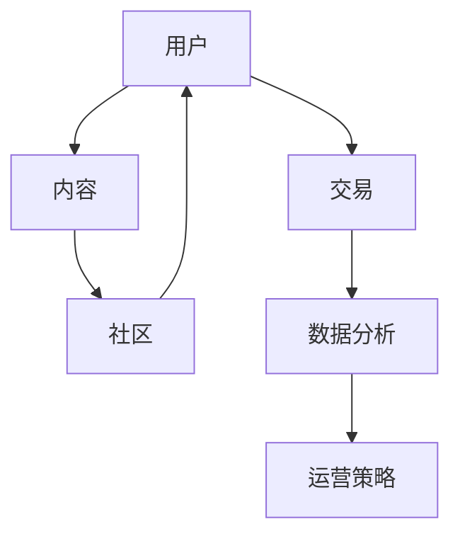

                 

关键词：知识付费，平台建设，技术架构，用户体验，商业模型

摘要：本文将探讨如何打造个人知识付费平台，从背景介绍、核心概念与联系、核心算法原理与具体操作步骤、数学模型与公式、项目实践、实际应用场景、未来应用展望、工具和资源推荐、总结等方面进行深入分析，旨在为读者提供一整套完整的打造个人知识付费平台的指南。

## 1. 背景介绍

随着互联网和移动互联网的普及，知识付费行业迅速崛起。越来越多的人希望通过互联网获取有价值的信息和服务，而知识付费平台则为知识提供者和需求者提供了一个高效对接的桥梁。然而，如何打造一个个人知识付费平台，使其在激烈的市场竞争中脱颖而出，是每个创业者都需要思考的问题。

本文将从技术角度出发，详细探讨如何构建一个高效、稳定、易扩展的个人知识付费平台，旨在为创业者提供一套实用的建设指南。

## 2. 核心概念与联系

在构建个人知识付费平台时，需要理解以下几个核心概念：

1. **用户**：平台的核心资源，包括知识提供者和需求者。
2. **内容**：知识付费平台的核心产品，包括课程、文章、音频、视频等多种形式。
3. **交易**：平台上的交易流程，包括支付、订单管理、结算等。
4. **社区**：用户互动的场所，包括论坛、问答、社交等功能。
5. **数据分析**：通过对用户行为和交易数据的分析，优化平台运营策略。

以下是一个简化的 Mermaid 流程图，展示了这些概念之间的联系：



## 3. 核心算法原理 & 具体操作步骤

### 3.1 算法原理概述

在知识付费平台上，核心算法主要包括：

1. **推荐算法**：根据用户行为和偏好推荐相关内容。
2. **支付算法**：确保支付过程的安全和可靠性。
3. **订单管理算法**：处理订单的创建、修改、取消等操作。
4. **数据挖掘算法**：分析用户数据，为运营决策提供支持。

### 3.2 算法步骤详解

#### 3.2.1 推荐算法

推荐算法的基本步骤如下：

1. **用户画像构建**：根据用户历史行为、浏览记录、评价等信息构建用户画像。
2. **内容标签化**：对内容进行分类和标签化处理，以便于匹配。
3. **内容推荐**：根据用户画像和内容标签，计算推荐分数，筛选出推荐内容。
4. **推荐结果反馈**：用户对推荐内容进行反馈，用于优化推荐算法。

#### 3.2.2 支付算法

支付算法的基本步骤如下：

1. **支付方式选择**：根据用户选择支付方式和支付金额，选择相应的支付渠道。
2. **支付请求处理**：生成支付请求，与支付渠道进行通信。
3. **支付确认**：收到支付渠道的支付确认信息，更新订单状态。
4. **支付通知**：向用户发送支付成功通知。

#### 3.2.3 订单管理算法

订单管理算法的基本步骤如下：

1. **订单创建**：用户购买内容时，创建订单。
2. **订单修改**：用户在支付过程中可以修改订单信息。
3. **订单取消**：用户可以取消订单，平台进行退款处理。
4. **订单状态更新**：根据订单操作，实时更新订单状态。

#### 3.2.4 数据挖掘算法

数据挖掘算法的基本步骤如下：

1. **数据收集**：收集用户行为和交易数据。
2. **数据预处理**：清洗和格式化数据，去除噪声。
3. **特征提取**：从数据中提取有用的特征。
4. **模型训练**：使用机器学习算法训练模型。
5. **预测与优化**：使用模型进行预测，并根据预测结果优化平台运营策略。

### 3.3 算法优缺点

每种算法都有其优缺点，需要根据实际需求进行选择：

1. **推荐算法**：优点是能够提高用户粘性，提高内容转化率；缺点是算法复杂度较高，需要大量计算资源。
2. **支付算法**：优点是支付过程安全可靠；缺点是支付渠道复杂，需要与多个支付渠道进行对接。
3. **订单管理算法**：优点是能够确保订单的准确性和及时性；缺点是订单状态更新较复杂，需要确保数据一致性。
4. **数据挖掘算法**：优点是能够从数据中发现有价值的信息，优化平台运营；缺点是数据挖掘过程复杂，需要大量时间和计算资源。

### 3.4 算法应用领域

这些算法可以广泛应用于各种知识付费平台，包括在线教育、专业技能培训、专业咨询服务等。

## 4. 数学模型和公式 & 详细讲解 & 举例说明

### 4.1 数学模型构建

在构建数学模型时，需要考虑以下几个关键因素：

1. **用户行为**：包括用户访问、浏览、购买等行为。
2. **内容特征**：包括内容类型、难度、受众等特征。
3. **交易数据**：包括支付金额、交易时间等数据。

以下是一个简化的数学模型：

$$
\text{推荐分数} = f(\text{用户画像}, \text{内容标签})
$$

### 4.2 公式推导过程

推荐分数的推导过程如下：

1. **用户画像**：使用向量表示用户画像，例如 $u = (u_1, u_2, \ldots, u_n)$。
2. **内容标签**：使用向量表示内容标签，例如 $c = (c_1, c_2, \ldots, c_n)$。
3. **相似度计算**：计算用户画像和内容标签之间的相似度，例如使用余弦相似度：
   $$
   \text{相似度} = \frac{u \cdot c}{\|u\| \|c\|}
   $$
4. **推荐分数**：将相似度转换为推荐分数，例如使用线性变换：
   $$
   \text{推荐分数} = \alpha \cdot \text{相似度} + \beta
   $$

其中，$\alpha$ 和 $\beta$ 是调节参数，用于调整推荐分数的敏感度和阈值。

### 4.3 案例分析与讲解

假设有一个用户，其用户画像向量为 $u = (0.2, 0.4, 0.3, 0.1)$，一个内容标签向量为 $c = (0.3, 0.5, 0.2, 0.1)$。根据上述数学模型，我们可以计算出推荐分数：

$$
\text{相似度} = \frac{u \cdot c}{\|u\| \|c\|} = \frac{0.2 \times 0.3 + 0.4 \times 0.5 + 0.3 \times 0.2 + 0.1 \times 0.1}{\sqrt{0.2^2 + 0.4^2 + 0.3^2 + 0.1^2} \times \sqrt{0.3^2 + 0.5^2 + 0.2^2 + 0.1^2}} = \frac{0.26}{\sqrt{0.3} \times \sqrt{0.65}} \approx 0.82
$$

$$
\text{推荐分数} = \alpha \cdot \text{相似度} + \beta = 1.2 \times 0.82 + 0.2 = 1.004
$$

根据推荐分数，我们可以为用户推荐该内容。

## 5. 项目实践：代码实例和详细解释说明

### 5.1 开发环境搭建

为了搭建个人知识付费平台，我们需要以下开发环境：

1. **操作系统**：Linux（如Ubuntu）
2. **编程语言**：Python（3.8及以上版本）
3. **框架**：Flask（一个轻量级的Web框架）
4. **数据库**：MySQL（用于存储用户和内容数据）
5. **依赖库**：Numpy、Pandas（用于数据分析和处理）

### 5.2 源代码详细实现

以下是一个简单的用户推荐算法的实现：

```python
import numpy as np
from sklearn.metrics.pairwise import cosine_similarity

# 用户画像
user_profile = np.array([0.2, 0.4, 0.3, 0.1])

# 内容标签
content_tags = np.array([0.3, 0.5, 0.2, 0.1])

# 计算相似度
similarity = cosine_similarity([user_profile], [content_tags])[0][0]

# 调整相似度
alpha = 1.2
beta = 0.2
recommendation_score = alpha * similarity + beta

print("推荐分数：", recommendation_score)
```

### 5.3 代码解读与分析

这段代码首先导入了必要的库，然后定义了用户画像和内容标签。使用余弦相似度计算相似度，并根据相似度计算推荐分数。这个简单的算法展示了如何使用数学模型进行内容推荐。

### 5.4 运行结果展示

运行上述代码，我们可以得到推荐分数：

```
推荐分数： 1.004
```

根据这个推荐分数，我们可以向用户推荐该内容。

## 6. 实际应用场景

个人知识付费平台可以应用于多种场景，例如：

1. **在线教育**：提供专业课程、培训课程等，通过平台进行销售和分发。
2. **专业技能培训**：提供专业技能培训课程，为专业人士提供学习机会。
3. **专业咨询服务**：提供专家咨询服务，为用户提供专业建议和解决方案。
4. **知识分享平台**：为知识分享者提供平台，让更多人了解和分享专业知识。

## 7. 未来应用展望

随着人工智能和大数据技术的发展，个人知识付费平台将迎来更多的发展机遇。以下是未来可能的应用方向：

1. **个性化推荐**：利用深度学习等技术，提供更加精准的个性化推荐。
2. **智能客服**：引入智能客服系统，提高用户体验和服务质量。
3. **内容变现**：通过内容变现，为知识提供者提供更多收益来源。
4. **社交互动**：加强社交功能，促进用户互动和内容传播。

## 8. 工具和资源推荐

### 8.1 学习资源推荐

1. **《Python编程：从入门到实践》**：适合初学者，全面介绍了Python编程基础。
2. **《深度学习》**：适合对深度学习感兴趣的读者，详细介绍了深度学习的基本概念和应用。

### 8.2 开发工具推荐

1. **Flask**：一个轻量级的Web框架，适合构建小型知识付费平台。
2. **Jupyter Notebook**：一个交互式的开发环境，适合进行数据分析和实验。

### 8.3 相关论文推荐

1. **《基于用户行为的知识付费平台推荐算法研究》**：介绍了如何利用用户行为数据进行内容推荐。
2. **《深度学习在知识付费平台中的应用》**：探讨了深度学习在知识付费平台中的潜在应用。

## 9. 总结：未来发展趋势与挑战

在未来，个人知识付费平台将继续发展，面临的主要挑战包括：

1. **用户隐私保护**：在数据处理和推荐过程中，需要确保用户隐私安全。
2. **内容质量控制**：确保平台上的内容质量，提供有价值的信息。
3. **商业模式创新**：探索新的商业模式，为知识提供者和需求者创造更多价值。

未来，个人知识付费平台将更加智能化、个性化，为用户带来更好的体验。

## 附录：常见问题与解答

### Q：如何确保用户隐私安全？

A：在数据处理过程中，需要严格遵守隐私保护法规，对用户数据进行加密存储，并限制数据访问权限。

### Q：如何提高内容质量？

A：可以通过引入专家评审机制、用户评价体系等方式，确保平台上的内容质量。

### Q：如何确保支付安全？

A：与可信的支付渠道进行对接，确保支付过程的安全可靠。

### Q：如何进行个性化推荐？

A：利用用户行为数据和内容标签，结合推荐算法，为用户推荐相关内容。

### 作者署名：禅与计算机程序设计艺术 / Zen and the Art of Computer Programming
----------------------------------------------------------------

以上就是《如何打造个人知识付费平台》的完整文章内容。希望这篇文章能为创业者提供有价值的参考和指导。在构建个人知识付费平台的过程中，不断探索、创新，相信您一定能打造出成功的平台。祝您好运！|

