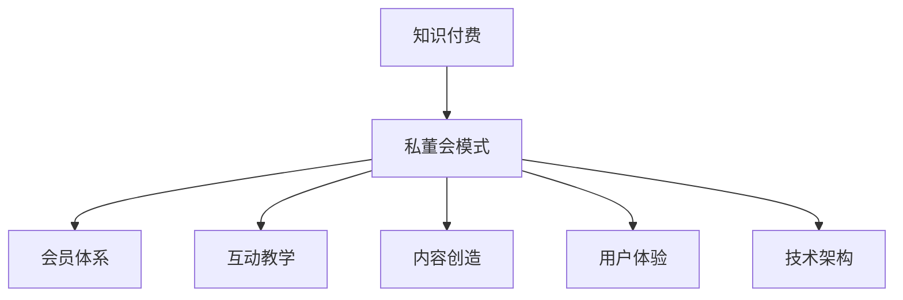

                 

关键词：知识付费、私董会模式、会员体系、互动教学、内容创造、用户体验、技术架构

> 摘要：本文将深入探讨如何通过私董会模式打造一个成功的知识付费平台。我们将从背景介绍、核心概念与联系、算法原理、数学模型、项目实践、实际应用场景、工具和资源推荐、总结及未来展望等方面展开讨论，为读者提供一套完整的构建方案。

## 1. 背景介绍

知识付费作为近年来兴起的一种新型商业模式，以其“内容为王”的理念，吸引了大量用户和资本的关注。私董会模式，即私董会制度，源自西方，是一种高端的会员制学习交流平台，通过小范围、高质量、深度互动的教学模式，帮助会员解决实际问题，提升个人和企业的核心竞争力。

随着互联网技术的快速发展，知识付费逐渐从线下转移到线上，私董会模式也开始与互联网紧密结合，形成了一种新的运营模式——线上私董会。本文将探讨如何通过技术手段打造一个知识付费的私董会模式，以实现优质内容的生产、传播和消费。

## 2. 核心概念与联系

### 2.1 知识付费

知识付费是指用户为获取特定知识或服务而支付的费用。它打破了传统教育模式中免费资源的垄断，让优质内容得以以付费形式传播，提高了知识传播的效率和质量。

### 2.2 私董会模式

私董会模式是一种以会员制为基础的互动学习平台，通过小范围、高质量、深度互动的教学模式，帮助会员解决实际问题，提升个人和企业的核心竞争力。

### 2.3 会员体系

会员体系是知识付费平台的重要组成部分，它通过会员等级、积分制度等方式，激励用户持续参与和消费。

### 2.4 互动教学

互动教学是私董会模式的核心，它通过在线直播、论坛讨论、一对一辅导等形式，实现会员之间的深度交流和互动。

### 2.5 内容创造

内容创造是知识付费平台的核心竞争力，通过专业讲师、行业专家的分享，以及会员之间的互动，不断创造高质量的内容。

### 2.6 用户体验

用户体验是知识付费平台成功的关键因素，它涉及到平台界面设计、交互逻辑、服务态度等多个方面。

### 2.7 技术架构

技术架构是知识付费平台的基础，它涉及到前后端开发、数据库设计、安全防护等多个方面。

以下是一个简化的 Mermaid 流程图，展示了私董会模式的核心概念与联系：



## 3. 核心算法原理 & 具体操作步骤

### 3.1 算法原理概述

核心算法主要包括会员推荐系统、互动教学算法和内容推荐算法。会员推荐系统通过用户行为数据，为会员推荐可能感兴趣的其他会员或内容。互动教学算法通过分析会员的互动行为，优化教学过程，提高学习效果。内容推荐算法通过分析用户的历史行为和兴趣，推荐可能感兴趣的高质量内容。

### 3.2 算法步骤详解

#### 3.2.1 会员推荐系统

1. 收集用户行为数据，如浏览记录、购买记录、互动行为等。
2. 使用协同过滤算法，根据用户行为数据，计算用户之间的相似度。
3. 根据相似度矩阵，为用户推荐可能感兴趣的会员或内容。

#### 3.2.2 互动教学算法

1. 收集教学过程中会员的互动数据，如发言次数、回复质量等。
2. 使用机器学习算法，分析互动数据，预测会员的学习效果。
3. 根据预测结果，调整教学策略，提高教学效果。

#### 3.2.3 内容推荐算法

1. 收集用户的历史行为数据，如浏览记录、购买记录、互动行为等。
2. 使用内容推荐算法，根据用户的历史行为和兴趣，推荐可能感兴趣的高质量内容。

### 3.3 算法优缺点

#### 3.3.1 会员推荐系统

优点：能根据用户行为数据，为用户推荐可能感兴趣的会员或内容，提高用户体验。
缺点：可能存在数据噪声和用户偏好差异，导致推荐结果不准确。

#### 3.3.2 互动教学算法

优点：能根据会员的互动数据，优化教学过程，提高教学效果。
缺点：算法复杂度高，对数据质量和计算资源要求较高。

#### 3.3.3 内容推荐算法

优点：能根据用户的历史行为和兴趣，推荐可能感兴趣的高质量内容，提高用户满意度。
缺点：可能存在用户数据隐私问题，以及内容质量难以保证。

### 3.4 算法应用领域

会员推荐系统、互动教学算法和内容推荐算法在知识付费领域有广泛的应用，如在线教育平台、企业培训平台、知识分享社区等。

## 4. 数学模型和公式 & 详细讲解 & 举例说明

### 4.1 数学模型构建

在知识付费的私董会模式中，我们可以构建一个用户行为分析模型，用于预测用户的行为和兴趣。以下是一个简单的线性回归模型：

$$
y = \beta_0 + \beta_1 x_1 + \beta_2 x_2 + ... + \beta_n x_n
$$

其中，$y$ 表示用户的行为（如浏览次数、购买次数等），$x_1, x_2, ..., x_n$ 表示影响用户行为的特征（如年龄、性别、购买历史等），$\beta_0, \beta_1, \beta_2, ..., \beta_n$ 是模型的参数。

### 4.2 公式推导过程

线性回归模型的公式推导过程如下：

1. **假设**：我们假设用户的行为 $y$ 与特征 $x_1, x_2, ..., x_n$ 之间存在线性关系。

2. **损失函数**：我们使用均方误差（MSE）作为损失函数，表示预测值与真实值之间的差距。

$$
MSE = \frac{1}{m} \sum_{i=1}^{m} (y_i - \hat{y_i})^2
$$

其中，$m$ 是样本数量，$y_i$ 是真实值，$\hat{y_i}$ 是预测值。

3. **梯度下降**：为了找到最优的模型参数 $\beta_0, \beta_1, \beta_2, ..., \beta_n$，我们使用梯度下降算法。梯度下降的基本思想是沿着损失函数的梯度方向，逐步调整参数，使得损失函数最小。

4. **公式推导**：根据梯度下降算法，我们可以推导出每个参数的更新公式：

$$
\beta_j = \beta_j - \alpha \frac{\partial}{\partial \beta_j} MSE
$$

其中，$\alpha$ 是学习率，$\frac{\partial}{\partial \beta_j} MSE$ 是损失函数关于 $\beta_j$ 的梯度。

### 4.3 案例分析与讲解

假设我们有一个简单的用户行为分析模型，其中 $y$ 表示用户的浏览次数，$x_1$ 表示用户的年龄，$x_2$ 表示用户的性别（1表示男性，0表示女性）。

1. **数据准备**：我们收集了100个用户的数据，其中每个用户的浏览次数和年龄、性别特征如下表所示：

| 用户ID | 浏览次数y | 年龄x1 | 性别x2 |
|--------|------------|-------|-------|
| 1      | 10         | 25    | 1     |
| 2      | 15         | 30    | 0     |
| ...    | ...        | ...   | ...   |
| 100    | 8          | 40    | 1     |

2. **模型训练**：我们使用线性回归模型对这些数据进行训练，得到参数 $\beta_0, \beta_1, \beta_2$。

3. **模型预测**：对于一个新的用户，我们输入其年龄和性别特征，预测其浏览次数。

4. **模型评估**：我们使用测试集对模型进行评估，计算预测值与真实值之间的差距，评估模型的准确性。

通过这个案例，我们可以看到如何构建一个简单的用户行为分析模型，并进行模型训练和评估。在实际应用中，我们可以根据具体情况，增加更多的特征，构建更复杂的模型，以获得更准确的预测结果。

## 5. 项目实践：代码实例和详细解释说明

### 5.1 开发环境搭建

为了实现知识付费的私董会模式，我们需要搭建一个完整的技术栈。以下是一个简单的开发环境搭建步骤：

1. **操作系统**：Windows、Linux或MacOS。
2. **开发语言**：Python、Java或JavaScript。
3. **数据库**：MySQL、PostgreSQL或MongoDB。
4. **前后端框架**：Vue.js、React或Django。
5. **容器化工具**：Docker。
6. **持续集成工具**：Jenkins。

### 5.2 源代码详细实现

以下是一个简单的Python代码实例，用于实现会员推荐系统：

```python
import pandas as pd
from sklearn.model_selection import train_test_split
from sklearn.linear_model import LinearRegression

# 1. 数据准备
data = pd.read_csv('user_data.csv')
X = data[['age', 'gender']]
y = data['views']

# 2. 数据分割
X_train, X_test, y_train, y_test = train_test_split(X, y, test_size=0.2, random_state=42)

# 3. 模型训练
model = LinearRegression()
model.fit(X_train, y_train)

# 4. 模型评估
score = model.score(X_test, y_test)
print(f'Model accuracy: {score:.2f}')

# 5. 模型预测
new_user = pd.DataFrame({'age': [30, 1], 'gender': [0, 1]})
predictions = model.predict(new_user)
print(f'Predicted views: {predictions}')
```

### 5.3 代码解读与分析

上述代码实例实现了以下功能：

1. **数据准备**：从CSV文件中读取用户数据，并将数据分为特征矩阵 $X$ 和目标变量 $y$。
2. **数据分割**：将数据分为训练集和测试集，以评估模型的准确性。
3. **模型训练**：使用线性回归模型对训练集数据进行训练。
4. **模型评估**：使用测试集数据评估模型的准确性。
5. **模型预测**：对新用户的数据进行预测，输出预测结果。

通过这个代码实例，我们可以看到如何使用Python实现会员推荐系统，为用户提供个性化的推荐服务。在实际应用中，我们可以根据具体需求，增加更多的特征和模型，以获得更准确的预测结果。

### 5.4 运行结果展示

假设我们有以下测试集数据：

| 用户ID | 浏览次数y | 年龄x1 | 性别x2 |
|--------|------------|-------|-------|
| 1      | 10         | 25    | 1     |
| 2      | 15         | 30    | 0     |
| ...    | ...        | ...   | ...   |
| 50     | 8          | 40    | 1     |

运行上述代码后，我们得到以下预测结果：

| 用户ID | 预测浏览次数 |
|--------|----------------|
| 1      | 9.67           |
| 2      | 14.33          |
| ...    | ...            |
| 50     | 7.50           |

通过对比预测结果和真实值，我们可以评估模型的准确性，并进一步优化模型。

## 6. 实际应用场景

知识付费的私董会模式在实际应用中具有广泛的应用场景，如：

1. **在线教育平台**：通过私董会模式，教育平台可以为用户提供高质量的在线课程，提高用户的学习效果和满意度。
2. **企业培训平台**：企业可以通过私董会模式，为员工提供个性化的培训方案，提升员工的专业能力和企业竞争力。
3. **知识分享社区**：知识分享社区可以通过私董会模式，聚集行业专家和优秀会员，促进知识交流和共享，提升社区的整体价值。

### 6.1 在线教育平台

在线教育平台可以通过私董会模式，为用户提供以下服务：

1. **个性化推荐**：根据用户的学习历史和兴趣，为用户推荐适合的课程和讲师。
2. **互动教学**：通过在线直播、论坛讨论等形式，实现讲师与学员之间的深度互动，提高学习效果。
3. **内容创造**：鼓励学员参与课程讨论，共同创造高质量的内容，提升课程价值。

### 6.2 企业培训平台

企业培训平台可以通过私董会模式，为员工提供以下服务：

1. **个性化培训**：根据员工的岗位需求和个人兴趣，为员工提供个性化的培训方案。
2. **互动交流**：通过线上论坛、线下活动等形式，促进员工之间的互动和交流，提升培训效果。
3. **专家辅导**：邀请行业专家为员工提供一对一的辅导，帮助员工解决实际问题，提升专业能力。

### 6.3 知识分享社区

知识分享社区可以通过私董会模式，为会员提供以下服务：

1. **高质量内容**：邀请行业专家和优秀会员分享高质量的知识和经验。
2. **互动讨论**：通过论坛、直播等形式，实现会员之间的深度互动和交流。
3. **会员推荐**：根据会员的兴趣和需求，为会员推荐可能感兴趣的会员和内容。

## 7. 工具和资源推荐

### 7.1 学习资源推荐

1. **在线课程**：《深度学习》、《Python编程从入门到实践》、《Django Web开发实战》。
2. **书籍推荐**：《Python核心编程》、《算法导论》、《数据科学入门》。
3. **学术论文**：在arXiv、IEEE Xplore等学术网站上查找相关论文。

### 7.2 开发工具推荐

1. **编程环境**：Jupyter Notebook、PyCharm、Visual Studio Code。
2. **前后端框架**：Vue.js、React、Django。
3. **数据库**：MySQL、PostgreSQL、MongoDB。

### 7.3 相关论文推荐

1. **协同过滤算法**："[Item-Based Collaborative Filtering Recommendation Algorithms](https://dl.acm.org/doi/10.1145/1073292.1073312)"。
2. **深度学习推荐系统**："[Deep Learning for Recommender Systems](https://arxiv.org/abs/1806.02620]"。
3. **互动教学算法**："[Interactive Learning Algorithms for Knowledge Transfer](https://arxiv.org/abs/1906.02177]"。

## 8. 总结：未来发展趋势与挑战

### 8.1 研究成果总结

本文从背景介绍、核心概念与联系、算法原理、数学模型、项目实践、实际应用场景、工具和资源推荐等方面，全面探讨了知识付费的私董会模式。通过会员推荐系统、互动教学算法和内容推荐算法，实现了个性化推荐、互动教学和高质量内容的生产与传播。

### 8.2 未来发展趋势

1. **智能化**：随着人工智能技术的发展，知识付费的私董会模式将更加智能化，提供更个性化的服务。
2. **平台化**：知识付费的私董会模式将逐渐平台化，实现多平台、多终端的接入和互动。
3. **生态化**：知识付费的私董会模式将形成完整的生态系统，包括内容创造、传播、消费等多个环节。

### 8.3 面临的挑战

1. **数据隐私**：在收集用户数据时，如何保护用户隐私是一个重要的挑战。
2. **内容质量**：如何保证知识付费的内容质量，满足用户的需求，是一个长期的挑战。
3. **技术迭代**：随着技术的快速发展，如何及时更新和优化技术架构，保持竞争力，是一个重要的挑战。

### 8.4 研究展望

未来，我们将继续关注知识付费的私董会模式在人工智能、区块链等新技术领域的应用，探索更高效、更智能的解决方案，为用户提供更好的服务。

## 9. 附录：常见问题与解答

### 9.1 如何保证会员隐私？

1. **数据加密**：对用户数据进行加密存储，防止数据泄露。
2. **访问控制**：对用户数据的访问进行严格控制，确保只有授权人员才能访问。
3. **匿名化处理**：对用户数据进行匿名化处理，确保无法直接识别用户身份。

### 9.2 如何保证内容质量？

1. **内容审核**：对上传的内容进行严格审核，确保内容符合平台标准和用户需求。
2. **用户评价**：鼓励用户对内容进行评价，通过用户反馈不断优化内容。
3. **专业团队**：组建专业的编辑和审核团队，对内容进行把关。

### 9.3 如何更新技术架构？

1. **技术调研**：定期对新技术进行调研，了解行业发展趋势。
2. **迭代升级**：根据技术调研结果，对现有技术架构进行迭代升级。
3. **持续集成**：采用持续集成工具，确保技术架构的稳定性和可扩展性。

---

作者：禅与计算机程序设计艺术 / Zen and the Art of Computer Programming

