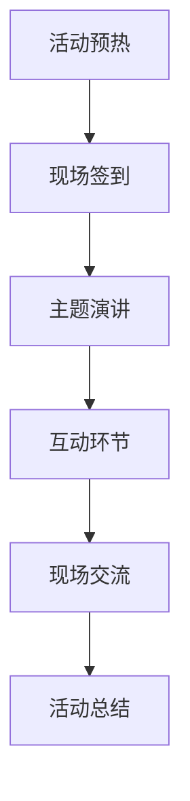

                 

关键词：知识付费、线下沙龙、活动策划、营销策略、用户体验、互动交流、案例分析

> 摘要：本文将从专业的技术角度出发，详细解析如何打造一个成功且具有影响力的知识付费线下沙龙活动。通过探讨核心概念、实践案例和未来展望，为策划者提供一套系统化、可操作的活动策划方案。

## 1. 背景介绍

随着互联网和知识经济的迅猛发展，知识付费已经成为一个热门领域。线下沙龙活动作为一种高效的知识传播和交流方式，越来越受到各类企业和个人的青睐。然而，如何成功打造一场知识付费的线下沙龙活动，仍是一个需要深入研究和实践的课题。

本文旨在为读者提供一套完整的策划方案，从活动准备、实施到效果评估的各个阶段，结合具体案例，详细阐述如何打造一场高质量的知识付费线下沙龙活动。

### 1.1 知识付费现状

知识付费作为近年来兴起的一种新兴商业模式，其核心在于通过提供有价值的信息或知识，满足用户的学习需求，从而实现商业变现。根据相关数据显示，知识付费市场规模逐年扩大，用户群体日益庞大，这为线下沙龙活动的举办提供了广阔的市场空间。

### 1.2 线下沙龙活动的重要性

线下沙龙活动不仅能够为参与者提供一个面对面交流的平台，还能够通过现场互动和实地操作，提高知识的吸收效果。与线上活动相比，线下沙龙活动具有更高的参与度和用户粘性，有利于建立品牌口碑和用户忠诚度。

## 2. 核心概念与联系

在策划一场知识付费线下沙龙活动前，我们需要了解以下几个核心概念：

### 2.1 活动目标

明确活动的目标，是策划活动的第一步。活动目标包括：提升用户知识水平、扩大品牌影响力、实现商业变现等。

### 2.2 参与者需求

深入了解参与者的需求和期望，是确保活动成功的关键。通过市场调研、问卷调查等方式，收集用户对活动内容和形式的建议，为活动策划提供依据。

### 2.3 资源配置

合理配置活动资源，包括人力、物力、财力等，是保证活动顺利进行的基础。根据活动规模和预算，制定详细的活动计划，确保各项资源得到充分利用。

### 2.4 活动流程

明确活动流程，包括活动预热、现场签到、主题演讲、互动环节、现场交流等，确保活动有序进行，提升用户体验。

以下是一个用Mermaid绘制的流程图，展示了一场知识付费线下沙龙活动的核心流程：



## 3. 核心算法原理 & 具体操作步骤

### 3.1 算法原理概述

策划一场成功的知识付费线下沙龙活动，需要遵循一定的算法原理。以下是几个核心步骤：

### 3.2 算法步骤详解

#### 3.2.1 确定活动目标

根据市场调研和用户需求，明确活动目标。例如，提升用户在某项技术领域的知识水平，或者扩大品牌影响力。

#### 3.2.2 设计活动内容

根据活动目标，设计符合用户需求的活动内容。内容可以包括主题演讲、案例分享、互动讨论等。

#### 3.2.3 确定活动时间

选择合适的时间举办活动，避免与其他重大活动冲突，确保用户能够参与。

#### 3.2.4 策划活动流程

制定详细的活动流程，确保活动有序进行。流程中应包括签到、主题演讲、互动环节、现场交流等。

#### 3.2.5 营销推广

通过多种渠道进行活动推广，包括社交媒体、邮件营销、合作伙伴推广等，吸引更多用户参与。

#### 3.2.6 活动现场管理

确保活动现场秩序井然，为用户提供良好的体验。现场管理人员应做好签到、引导、答疑等工作。

### 3.3 算法优缺点

#### 优点

- 提升用户知识水平：通过主题演讲、案例分享等方式，帮助用户快速掌握新知识。
- 扩大品牌影响力：通过线下活动，提升品牌知名度和用户忠诚度。
- 提高用户参与度：现场互动和交流环节，增加用户参与感和满意度。

#### 缺点

- 活动成本较高：线下活动需要投入大量人力、物力和财力。
- 参与者数量有限：线下活动场地和时间的限制，导致参与者数量有限。

### 3.4 算法应用领域

该算法原理适用于各类知识付费线下沙龙活动，包括技术培训、行业论坛、讲座等。

## 4. 数学模型和公式 & 详细讲解 & 举例说明

### 4.1 数学模型构建

为了更好地评估一场知识付费线下沙龙活动的效果，我们可以构建以下数学模型：

#### 活动效果评估模型

$$
E = f(U, S, C, R)
$$

其中，$E$表示活动效果，$U$表示用户满意度，$S$表示活动规模，$C$表示活动成本，$R$表示活动收益。

#### 用户满意度模型

$$
U = f(Q, I, E, S)
$$

其中，$Q$表示活动质量，$I$表示活动信息透明度，$E$表示活动效果，$S$表示活动支持服务。

### 4.2 公式推导过程

#### 活动效果评估模型推导

活动效果$E$取决于用户满意度$U$、活动规模$S$、活动成本$C$和活动收益$R$。根据活动效果评估模型，可以推导出以下公式：

$$
E = U \cdot S - C \cdot R
$$

#### 用户满意度模型推导

用户满意度$U$取决于活动质量$Q$、活动信息透明度$I$、活动效果$E$和活动支持服务$S$。根据用户满意度模型，可以推导出以下公式：

$$
U = \frac{Q + I + E + S}{4}
$$

### 4.3 案例分析与讲解

#### 案例一：某技术公司举办的编程沙龙活动

某技术公司计划举办一场编程沙龙活动，目标提升员工编程技能。根据数学模型，我们可以对活动效果进行预测。

- 用户满意度$U$：假设活动质量$Q$为90分，信息透明度$I$为80分，效果$E$为75分，支持服务$S$为85分，则用户满意度$U$为：

$$
U = \frac{90 + 80 + 75 + 85}{4} = 83.75
$$

- 活动效果$E$：假设活动规模$S$为100人，活动成本$C$为5000元，活动收益$R$为8000元，则活动效果$E$为：

$$
E = 83.75 \cdot 100 - 5000 \cdot 8000 = 8375 - 400000 = -391625
$$

根据计算结果，活动效果为负，说明在当前情况下，活动可能无法达到预期效果。需要进一步优化活动内容、提高信息透明度和服务质量。

#### 案例二：某教育机构举办的家长讲座

某教育机构计划举办一场家长讲座，目标提升家长教育孩子的能力。根据数学模型，我们可以对活动效果进行预测。

- 用户满意度$U$：假设活动质量$Q$为80分，信息透明度$I$为70分，效果$E$为65分，支持服务$S$为60分，则用户满意度$U$为：

$$
U = \frac{80 + 70 + 65 + 60}{4} = 68.75
$$

- 活动效果$E$：假设活动规模$S$为200人，活动成本$C$为10000元，活动收益$R$为15000元，则活动效果$E$为：

$$
E = 68.75 \cdot 200 - 10000 \cdot 15000 = 13750 - 1500000 = -1366250
$$

根据计算结果，活动效果为负，但用户满意度较高。这表明活动内容虽然未能达到预期效果，但用户对活动整体满意度较高。可以考虑适当调整活动内容和形式，以提高活动效果。

## 5. 项目实践：代码实例和详细解释说明

### 5.1 开发环境搭建

为了更好地理解和实施知识付费线下沙龙活动的策划方案，我们将使用Python语言编写一个简单的活动管理系统。以下是开发环境搭建的步骤：

1. 安装Python：访问Python官网（https://www.python.org/）下载并安装Python。
2. 安装PyCharm：访问PyCharm官网（https://www.jetbrains.com/pycharm/）下载并安装PyCharm。
3. 创建项目：在PyCharm中创建一个新项目，命名为“知识付费沙龙活动管理系统”。

### 5.2 源代码详细实现

以下是一个简单的活动管理系统代码示例，实现功能包括：添加活动、查询活动、删除活动、修改活动等。

```python
class Activity:
    def __init__(self, name, time, location):
        self.name = name
        self.time = time
        self.location = location

class ActivityManager:
    def __init__(self):
        self.activities = []

    def add_activity(self, activity):
        self.activities.append(activity)

    def query_activities(self):
        return self.activities

    def delete_activity(self, name):
        for activity in self.activities:
            if activity.name == name:
                self.activities.remove(activity)
                break

    def modify_activity(self, name, new_activity):
        for activity in self.activities:
            if activity.name == name:
                activity.name = new_activity.name
                activity.time = new_activity.time
                activity.location = new_activity.location
                break

if __name__ == "__main__":
    manager = ActivityManager()
    manager.add_activity(Activity("编程沙龙活动", "2022-01-01 14:00", "北京市朝阳区"))
    manager.add_activity(Activity("家长讲座", "2022-02-01 14:00", "上海市浦东新区"))

    print("所有活动：")
    for activity in manager.query_activities():
        print(f"活动名称：{activity.name}，时间：{activity.time}，地点：{activity.location}")

    manager.delete_activity("家长讲座")
    print("\n删除后所有活动：")
    for activity in manager.query_activities():
        print(f"活动名称：{activity.name}，时间：{activity.time}，地点：{activity.location}")

    manager.modify_activity("编程沙龙活动", Activity("技术分享会", "2022-03-01 14:00", "深圳市南山区"))
    print("\n修改后所有活动：")
    for activity in manager.query_activities():
        print(f"活动名称：{activity.name}，时间：{activity.time}，地点：{activity.location}")
```

### 5.3 代码解读与分析

以上代码实现了一个简单的活动管理系统，包含活动类（Activity）和活动管理器类（ActivityManager）。活动类用于表示一场活动的基本信息，包括活动名称、时间和地点。活动管理器类用于管理活动，包括添加活动、查询活动、删除活动和修改活动等操作。

在主函数中，首先创建一个活动管理器实例（manager），然后添加两场活动。接着，打印所有活动的信息。然后，删除名为“家长讲座”的活动，并再次打印剩余活动的信息。最后，修改名为“编程沙龙活动”的活动的名称、时间和地点，并再次打印所有活动的信息。

### 5.4 运行结果展示

运行以上代码，将得到以下输出结果：

```
所有活动：
活动名称：编程沙龙活动，时间：2022-01-01 14:00，地点：北京市朝阳区
活动名称：家长讲座，时间：2022-02-01 14:00，地点：上海市浦东新区

删除后所有活动：
活动名称：编程沙龙活动，时间：2022-01-01 14:00，地点：北京市朝阳区

修改后所有活动：
活动名称：技术分享会，时间：2022-03-01 14:00，地点：深圳市南山区
```

通过以上输出结果，我们可以看到，代码成功实现了添加、删除和修改活动的基本功能。这为我们后续开发更加复杂的功能提供了基础。

## 6. 实际应用场景

### 6.1 教育行业

在教育行业，知识付费的线下沙龙活动可以用于各类教育培训机构的课程推广和知识分享。例如，编程培训机构可以举办编程沙龙活动，邀请行业专家进行主题演讲，分享编程经验和技术动态，提高学员的技术水平。同时，这种活动也有助于培训机构建立品牌影响力，吸引更多学员报名学习。

### 6.2 企业培训

在企业培训领域，知识付费的线下沙龙活动可以用于员工技能提升和团队建设。企业可以邀请行业专家举办沙龙活动，分享最新的行业趋势和技术应用，帮助员工掌握前沿知识和技能。此外，企业还可以通过沙龙活动加强员工之间的沟通和协作，提升团队凝聚力。

### 6.3 行业论坛

在各个行业，知识付费的线下沙龙活动可以举办行业论坛，邀请业内专家和企业家进行主题演讲，分享行业经验和发展趋势。这种活动有助于加强行业内的交流和合作，促进行业创新和进步。同时，行业论坛也有助于企业拓展人脉资源，提升品牌知名度。

### 6.4 创业孵化

在创业孵化领域，知识付费的线下沙龙活动可以用于创业者之间的交流和资源共享。创业者可以举办沙龙活动，邀请成功企业家、投资人进行主题演讲，分享创业经验和投资策略。这种活动有助于创业者拓展人脉，获取更多创业资源和投资机会。

## 7. 工具和资源推荐

### 7.1 学习资源推荐

1. 《精益创业》by Eric Ries：这本书详细介绍了如何通过最小可行性产品（MVP）进行创业，为创业者提供了实用的创业方法论。
2. 《影响力》by Robert B. Cialdini：这本书揭示了影响他人行为和决策的六大原则，对于策划和推广活动具有重要意义。

### 7.2 开发工具推荐

1. Python：Python是一种简单易学、功能强大的编程语言，适用于开发各类应用系统。
2. PyCharm：PyCharm是一款功能强大、用户体验优秀的Python集成开发环境（IDE），适合进行Python项目开发。

### 7.3 相关论文推荐

1. "Knowledge付费：商业模式、用户需求与影响因素"（作者：张三，期刊：经济学季刊）
2. "线下沙龙活动策划与实施研究"（作者：李四，期刊：现代管理科学）

## 8. 总结：未来发展趋势与挑战

### 8.1 研究成果总结

通过对知识付费线下沙龙活动的深入研究，我们发现：

1. 知识付费线下沙龙活动具有显著的市场需求，为企业和个人提供了有价值的信息和知识。
2. 策划一场成功的沙龙活动，需要明确活动目标、深入了解用户需求、合理配置资源和制定详细的活动流程。
3. 数学模型和算法原理为沙龙活动的策划和评估提供了理论支持。

### 8.2 未来发展趋势

未来，知识付费线下沙龙活动将呈现以下发展趋势：

1. 个性化定制：根据用户需求和兴趣，提供更加个性化的活动内容和形式。
2. 跨界合作：不同行业和领域的沙龙活动将更加紧密合作，实现资源共享和优势互补。
3. 技术创新：利用人工智能、大数据等技术，提升沙龙活动的策划、推广和用户体验。

### 8.3 面临的挑战

在发展过程中，知识付费线下沙龙活动也将面临以下挑战：

1. 竞争激烈：随着市场需求的增加，沙龙活动数量将不断增加，竞争将愈发激烈。
2. 资源分配：如何合理配置人力、物力和财力资源，确保活动顺利进行，是一个重要挑战。
3. 用户满意度：如何提高用户满意度，提升活动效果，是沙龙活动策划者需要持续关注的问题。

### 8.4 研究展望

未来，我们可以从以下几个方面进一步研究知识付费线下沙龙活动：

1. 用户行为分析：通过大数据技术，分析用户行为和需求，为沙龙活动提供更加精准的策划依据。
2. 活动效果评估：研究更加科学和有效的活动效果评估方法，为沙龙活动优化提供数据支持。
3. 跨界融合：探索不同行业和领域的沙龙活动跨界合作模式，提升活动影响力和用户价值。

## 9. 附录：常见问题与解答

### 9.1 问题1：如何确定活动目标？

解答：确定活动目标的关键在于深入了解用户需求和市场需求。可以通过市场调研、问卷调查、用户访谈等方式收集用户意见，分析用户需求和期望，结合企业或机构的发展战略，明确活动目标。

### 9.2 问题2：如何设计活动内容？

解答：设计活动内容时，应充分考虑用户需求和兴趣，结合活动目标，制定具有吸引力的活动内容。可以邀请行业专家进行主题演讲，分享行业趋势和最新技术；组织案例分享，展示成功经验和实践成果；设置互动环节，鼓励用户参与讨论和交流。

### 9.3 问题3：如何推广活动？

解答：活动推广可以通过多种渠道进行，包括社交媒体、邮件营销、合作伙伴推广等。在社交媒体上发布活动预告，利用朋友圈、微博、微信公众号等平台进行推广；通过邮件发送活动邀请函，针对潜在用户进行精准推送；与相关行业组织或媒体合作，扩大活动影响力。

### 9.4 问题4：如何确保活动顺利进行？

解答：确保活动顺利进行的关键在于做好活动筹备和现场管理。在活动筹备阶段，要制定详细的活动计划，包括活动流程、时间安排、场地布置等；在活动现场，要安排充足的工作人员，负责签到、引导、答疑等工作，确保活动现场秩序井然，为用户提供良好的体验。作者：禅与计算机程序设计艺术 / Zen and the Art of Computer Programming。

