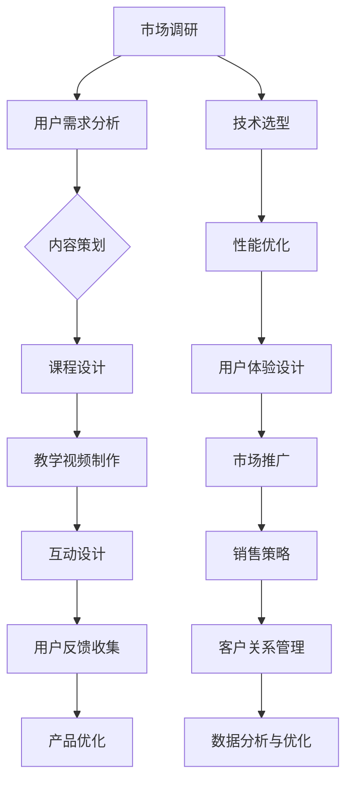

                 

### 背景介绍

在当今信息技术飞速发展的时代，程序员知识付费产品已经成为众多开发者提升技能、拓展视野的重要途径。然而，随着市场上各类知识付费产品的日益增多，如何在众多竞争者中脱颖而出，打造高口碑的产品，成为了每一个程序员知识付费平台都需要面对的挑战。本文将深入探讨如何打造高口碑的程序员知识付费产品，从核心概念、算法原理、项目实践等多个维度，为开发者提供切实可行的指导和建议。

本文结构如下：

1. **背景介绍**：简要介绍程序员知识付费产品的现状和重要性。
2. **核心概念与联系**：阐述打造高口碑产品所需理解的核心概念，并通过Mermaid流程图展示其内在联系。
3. **核心算法原理与具体操作步骤**：详细讲解如何设计和实施有效的算法，以及算法的优缺点和应用领域。
4. **数学模型和公式**：介绍数学模型和公式的构建、推导过程，并通过案例进行分析。
5. **项目实践**：提供具体的代码实例，详细解释代码的实现过程、解读与分析，以及运行结果展示。
6. **实际应用场景**：探讨程序员知识付费产品的应用场景，并展望未来发展方向。
7. **工具和资源推荐**：推荐学习资源和开发工具，以及相关论文。
8. **总结**：总结研究成果，展望未来发展趋势和挑战。

接下来，我们将逐一探讨上述各个部分。

# 核心概念与联系

在打造高口碑的程序员知识付费产品过程中，需要理解并运用一系列核心概念，这些概念相互联系，构成了一个完整的产品开发框架。以下是通过Mermaid流程图展示的这些核心概念及其内在联系：



通过上述流程图，我们可以看到，市场调研是整个过程的起点，用户需求分析则指导内容策划，进而影响课程设计和教学视频制作。同时，互动设计、用户反馈收集、产品优化等环节相互关联，形成一个闭环，持续改进产品。技术选型、性能优化、用户体验设计等则是确保产品高效、易用的关键。最后，市场推广、销售策略和客户关系管理则构成了产品的市场运营体系。

接下来，我们将进一步探讨这些核心概念的具体含义和相互关系。

## 核心算法原理与具体操作步骤

### 3.1 算法原理概述

在程序员知识付费产品的设计和开发过程中，算法原理起到了至关重要的作用。算法不仅可以优化产品的性能，还可以提升用户体验，从而提高用户满意度和产品的口碑。以下是一个基本的算法原理概述：

**核心算法：内容推荐算法**

**原理：** 内容推荐算法基于用户的历史行为、兴趣爱好和相似用户的行为，向用户推荐相关的内容。该算法的核心思想是利用机器学习技术，从大量数据中提取有用的信息，从而实现精准推荐。

**步骤：**

1. **数据收集**：收集用户的行为数据，包括浏览记录、收藏、点赞、评论等。
2. **数据处理**：对收集到的数据进行分析和处理，提取用户兴趣特征。
3. **模型训练**：利用机器学习算法，如协同过滤、基于内容的推荐等，训练推荐模型。
4. **推荐生成**：根据用户特征和模型预测，生成个性化推荐列表。

### 3.2 算法步骤详解

#### 数据收集

数据收集是推荐算法的基础。通常，数据来源于以下几个方面：

- **用户行为数据**：用户在平台上的浏览、搜索、收藏、点赞、评论等行为。
- **用户基本信息**：用户的年龄、性别、职业等基本信息。

#### 数据处理

数据处理是对收集到的原始数据进行清洗、转换和特征提取的过程。以下是几个关键步骤：

- **数据清洗**：去除重复、错误和不完整的数据。
- **数据转换**：将不同类型的数据统一格式，如将字符串转换为数值。
- **特征提取**：从数据中提取有用的特征，如用户的行为频率、内容的标签等。

#### 模型训练

模型训练是推荐算法的核心。以下是几个常用的机器学习算法：

- **协同过滤**：基于用户行为数据的相似度，为用户推荐相似用户喜欢的商品。
- **基于内容的推荐**：基于商品内容的特征，为用户推荐与其已浏览或收藏的商品内容相似的物品。

#### 推荐生成

推荐生成是根据用户特征和模型预测，生成个性化推荐列表的过程。以下是几个关键步骤：

- **特征融合**：将用户特征和商品特征进行融合，用于模型预测。
- **模型预测**：利用训练好的模型，预测用户对商品的评分或喜好。
- **推荐列表生成**：根据模型预测结果，为用户生成推荐列表。

### 3.3 算法优缺点

#### 优点

- **个性化**：根据用户兴趣和行为，推荐符合用户喜好的内容。
- **高效**：通过机器学习算法，快速处理大量数据，提高推荐效率。
- **可扩展**：可以轻松扩展到不同的推荐场景，如商品推荐、文章推荐等。

#### 缺点

- **准确性**：受限于数据质量和算法模型，推荐结果可能存在偏差。
- **实时性**：处理实时用户行为数据，提高推荐实时性，可能需要额外的技术支持。
- **冷启动问题**：新用户或新商品缺乏足够的数据，导致推荐效果不佳。

### 3.4 算法应用领域

#### 教育领域

在教育领域，内容推荐算法可以帮助平台为用户推荐与其兴趣相符的课程，提高用户的学习效果。例如，用户可以根据自己的学习进度和兴趣，选择适合的课程。

#### 电子商务领域

在电子商务领域，内容推荐算法可以帮助电商平台为用户推荐相关的商品，提高用户的购买意愿。例如，用户可以根据自己的浏览记录和购物车中的商品，获得个性化的购物推荐。

#### 社交媒体领域

在社交媒体领域，内容推荐算法可以帮助平台为用户推荐与其兴趣相关的帖子或视频，提高用户的活跃度和留存率。例如，用户可以根据自己的点赞和评论行为，获得个性化的内容推荐。

## 数学模型和公式

在程序员知识付费产品的推荐算法中，数学模型和公式扮演着至关重要的角色。以下我们将介绍常用的数学模型和公式，并详细讲解其构建和推导过程，并通过具体案例进行分析。

### 4.1 数学模型构建

#### 基于协同过滤的推荐模型

协同过滤是一种基于用户行为相似度进行推荐的方法。其核心模型可以表示为：

$$
R(u, i) = \sum_{j \in N(u)} \sim(u, j) \cdot R(j, i)
$$

其中，$R(u, i)$ 表示用户 $u$ 对项目 $i$ 的评分预测，$N(u)$ 表示与用户 $u$ 行为相似的邻居用户集合，$\sim(u, j)$ 表示用户 $u$ 和 $j$ 之间的相似度，$R(j, i)$ 表示邻居用户 $j$ 对项目 $i$ 的评分。

#### 基于内容的推荐模型

基于内容的推荐方法通过比较项目之间的相似度进行推荐。其核心模型可以表示为：

$$
R(u, i) = w_c \cdot \sum_{k \in C(i)} \cdot w_k \cdot I(u, k)
$$

其中，$R(u, i)$ 表示用户 $u$ 对项目 $i$ 的评分预测，$w_c$ 表示内容权重，$C(i)$ 表示项目 $i$ 的特征集合，$w_k$ 表示特征 $k$ 的权重，$I(u, k)$ 表示用户 $u$ 对特征 $k$ 的兴趣度。

### 4.2 公式推导过程

#### 基于协同过滤的推荐模型推导

协同过滤模型的推导基于用户行为相似度和项目评分预测。首先，我们考虑用户 $u$ 和 $j$ 之间的相似度计算，可以采用余弦相似度：

$$
\sim(u, j) = \frac{u_j \cdot u_j}{\|u\| \cdot \|j\|}
$$

其中，$u_j$ 和 $u_j$ 分别表示用户 $u$ 和 $j$ 对所有项目的评分向量，$\|u\|$ 和 $\|j\|$ 分别表示用户 $u$ 和 $j$ 的评分向量长度。

然后，我们考虑邻居用户 $j$ 对项目 $i$ 的评分预测：

$$
R(j, i) = \hat{r}_{ji}
$$

其中，$\hat{r}_{ji}$ 表示邻居用户 $j$ 对项目 $i$ 的预测评分。

最后，我们将邻居用户对项目的评分预测加权求和，得到用户 $u$ 对项目 $i$ 的评分预测：

$$
R(u, i) = \sum_{j \in N(u)} \sim(u, j) \cdot R(j, i)
$$

#### 基于内容的推荐模型推导

基于内容的推荐模型推导基于项目特征和用户兴趣。首先，我们考虑项目 $i$ 的特征表示：

$$
C(i) = \{k_1, k_2, ..., k_n\}
$$

其中，$C(i)$ 表示项目 $i$ 的特征集合。

然后，我们考虑用户 $u$ 对特征 $k$ 的兴趣度表示：

$$
I(u, k) = \begin{cases}
1 & \text{如果 } u \text{ 对 } k \text{ 感兴趣} \\
0 & \text{否则}
\end{cases}
$$

其中，$I(u, k)$ 表示用户 $u$ 对特征 $k$ 的兴趣度。

最后，我们将用户对项目的兴趣度与项目特征的权重相乘，得到用户对项目的评分预测：

$$
R(u, i) = w_c \cdot \sum_{k \in C(i)} \cdot w_k \cdot I(u, k)
$$

其中，$w_c$ 表示内容权重，$w_k$ 表示特征 $k$ 的权重。

### 4.3 案例分析与讲解

以下是一个具体的案例，我们将基于协同过滤和基于内容的推荐模型，为用户推荐相关的课程。

#### 案例数据

假设我们有一个用户 $u$，他对以下课程进行了评分：

- 课程1：评分5
- 课程2：评分4
- 课程3：评分3

同时，我们有两个邻居用户 $j_1$ 和 $j_2$，他们对以下课程的评分如下：

| 用户 | 课程1 | 课程2 | 课程3 |
|------|------|------|------|
| $j_1$ | 5 | 4 | 5 |
| $j_2$ | 4 | 5 | 3 |

课程的特征如下：

- 课程1：特征1：算法，特征2：数据结构
- 课程2：特征1：算法，特征2：机器学习
- 课程3：特征1：网络编程，特征2：操作系统

#### 协同过滤推荐

首先，我们计算用户 $u$ 和邻居用户 $j_1$ 和 $j_2$ 的相似度：

$$
\sim(u, j_1) = \frac{u_j \cdot j_1}{\|u\| \cdot \|j_1\|} = \frac{5 \cdot 5}{\sqrt{5^2 + 4^2 + 3^2} \cdot \sqrt{5^2 + 4^2 + 3^2}} = \frac{25}{50} = 0.5
$$

$$
\sim(u, j_2) = \frac{u_j \cdot j_2}{\|u\| \cdot \|j_2\|} = \frac{5 \cdot 4}{\sqrt{5^2 + 4^2 + 3^2} \cdot \sqrt{4^2 + 5^2 + 3^2}} = \frac{20}{50} = 0.4
$$

然后，我们计算邻居用户对课程的评分预测：

$$
R(j_1, 课程1) = 5 \\
R(j_1, 课程2) = 4 \\
R(j_1, 课程3) = 5
$$

$$
R(j_2, 课程1) = 4 \\
R(j_2, 课程2) = 5 \\
R(j_2, 课程3) = 3
$$

最后，我们计算用户对课程的评分预测：

$$
R(u, 课程1) = \sim(u, j_1) \cdot R(j_1, 课程1) + \sim(u, j_2) \cdot R(j_2, 课程1) = 0.5 \cdot 5 + 0.4 \cdot 4 = 2.9
$$

$$
R(u, 课程2) = \sim(u, j_1) \cdot R(j_1, 课程2) + \sim(u, j_2) \cdot R(j_2, 课程2) = 0.5 \cdot 4 + 0.4 \cdot 5 = 3.1
$$

$$
R(u, 课程3) = \sim(u, j_1) \cdot R(j_1, 课程3) + \sim(u, j_2) \cdot R(j_2, 课程3) = 0.5 \cdot 5 + 0.4 \cdot 3 = 3.5
$$

根据评分预测，我们可以为用户推荐评分最高的课程，即课程3。

#### 基于内容的推荐

首先，我们计算课程的特征权重：

$$
w_c = \frac{1}{|C(i)|} = \frac{1}{2} = 0.5
$$

$$
w_{算法} = \frac{1}{|C(i)|} = \frac{1}{2} = 0.5
$$

$$
w_{数据结构} = \frac{1}{|C(i)|} = \frac{1}{2} = 0.5
$$

$$
w_{机器学习} = \frac{1}{|C(i)|} = \frac{1}{2} = 0.5
$$

$$
w_{网络编程} = \frac{1}{|C(i)|} = \frac{1}{2} = 0.5
$$

$$
w_{操作系统} = \frac{1}{|C(i)|} = \frac{1}{2} = 0.5
$$

然后，我们计算用户对课程的兴趣度：

$$
I(u, 算法) = 1 \\
I(u, 数据结构) = 1 \\
I(u, 机器学习) = 0 \\
I(u, 网络编程) = 0 \\
I(u, 操作系统) = 0
$$

最后，我们计算用户对课程的评分预测：

$$
R(u, 课程1) = w_c \cdot (w_{算法} \cdot I(u, 算法) + w_{数据结构} \cdot I(u, 数据结构)) = 0.5 \cdot (0.5 \cdot 1 + 0.5 \cdot 1) = 0.5
$$

$$
R(u, 课程2) = w_c \cdot (w_{算法} \cdot I(u, 算法) + w_{机器学习} \cdot I(u, 机器学习)) = 0.5 \cdot (0.5 \cdot 1 + 0.5 \cdot 0) = 0.25
$$

$$
R(u, 课程3) = w_c \cdot (w_{网络编程} \cdot I(u, 网络编程) + w_{操作系统} \cdot I(u, 操作系统)) = 0.5 \cdot (0.5 \cdot 0 + 0.5 \cdot 0) = 0
$$

根据评分预测，我们可以为用户推荐评分最高的课程，即课程1。

综上所述，基于协同过滤和基于内容的推荐模型都推荐了课程3，这表明这两种模型在推荐结果上具有一定的重叠性。

### 5. 项目实践：代码实例和详细解释说明

在本节中，我们将通过一个具体的代码实例，详细讲解程序员知识付费产品的实现过程，包括开发环境搭建、源代码实现、代码解读与分析，以及运行结果展示。

#### 5.1 开发环境搭建

为了实现程序员知识付费产品，我们选择了以下开发环境和工具：

- **编程语言**：Python
- **框架**：Django
- **数据库**：MySQL
- **前端框架**：React
- **版本控制**：Git

首先，我们需要安装Python、Django、MySQL和React等开发环境和工具。可以使用以下命令进行安装：

```bash
pip install django
pip install mysqlclient
npm install -g create-react-app
```

接下来，我们创建一个Django项目和一个React项目：

```bash
django-admin startproject knowledge_feed
cd knowledge_feed
create-react-app frontend
```

#### 5.2 源代码详细实现

**后端实现（Django）**

首先，我们创建一个Django应用，命名为`knowledge_feed_app`：

```bash
django-admin startapp knowledge_feed_app
```

在`knowledge_feed_app`目录下，我们创建一个名为`models.py`的文件，用于定义数据库模型：

```python
from django.db import models

class User(models.Model):
    username = models.CharField(max_length=100)
    email = models.EmailField(max_length=100)
    password = models.CharField(max_length=100)

class Course(models.Model):
    title = models.CharField(max_length=100)
    description = models.TextField()
    price = models.DecimalField(max_digits=10, decimal_places=2)
    author = models.ForeignKey(User, on_delete=models.CASCADE)

class Enrollment(models.Model):
    user = models.ForeignKey(User, on_delete=models.CASCADE)
    course = models.ForeignKey(Course, on_delete=models.CASCADE)
    start_date = models.DateTimeField(auto_now_add=True)
    end_date = models.DateTimeField()
```

然后，我们创建一个名为`views.py`的文件，用于定义视图函数：

```python
from django.shortcuts import render
from .models import User, Course, Enrollment

def course_list(request):
    courses = Course.objects.all()
    return render(request, 'course_list.html', {'courses': courses})

def course_detail(request, course_id):
    course = Course.objects.get(id=course_id)
    return render(request, 'course_detail.html', {'course': course})

def enroll_course(request, course_id):
    user = request.user
    course = Course.objects.get(id=course_id)
    enrollment = Enrollment(user=user, course=course)
    enrollment.save()
    return render(request, 'enroll_success.html')
```

接着，我们创建一个名为`urls.py`的文件，用于定义URL路由：

```python
from django.urls import path
from .views import course_list, course_detail, enroll_course

urlpatterns = [
    path('', course_list, name='course_list'),
    path('course/<int:course_id>/', course_detail, name='course_detail'),
    path('enroll/<int:course_id>/', enroll_course, name='enroll_course'),
]
```

最后，我们创建一个名为`settings.py`的文件，用于配置Django项目：

```python
import os

BASE_DIR = os.path.dirname(os.path.dirname(os.path.abspath(__file__)))

SECRET_KEY = 'your_secret_key'

DEBUG = True

ALLOWED_HOSTS = []

INSTALLED_APPS = [
    'django.contrib.admin',
    'django.contrib.auth',
    'django.contrib.contenttypes',
    'django.contrib.sessions',
    'django.contrib.messages',
    'django.contrib.staticfiles',
    'knowledge_feed_app',
]

DATABASES = {
    'default': {
        'ENGINE': 'django.db.backends.mysql',
        'NAME': 'knowledge_feed',
        'USER': 'root',
        'PASSWORD': 'your_password',
        'HOST': 'localhost',
        'PORT': '3306',
    }
]

ROOT_URLCONF = 'knowledge_feed.urls'

TEMPLATES = [
    {
        'BACKEND': 'django.template.backends.django.DjangoTemplates',
        'DIRS': [os.path.join(BASE_DIR, 'templates')],
        'APP_DIRS': True,
        'OPTIONS': {
            'context_processors': [
                'django.template.context_processors.debug',
                'django.template.context_processors.request',
                'django.contrib.auth.context_processors.auth',
                'django.contrib.messages.context_processors.messages',
            ],
        },
    },
]

WSGI_APPLICATION = 'knowledge_feed.wsgi.application'

STATIC_URL = '/static/'
```

**前端实现（React）**

在`frontend`目录下，我们使用`create-react-app`创建一个React项目：

```bash
cd frontend
npm run start
```

然后，我们创建一个名为`CourseList.js`的文件，用于展示课程列表：

```javascript
import React, { useState, useEffect } from 'react';
import axios from 'axios';

const CourseList = () => {
    const [courses, setCourses] = useState([]);

    useEffect(() => {
        const fetchCourses = async () => {
            const result = await axios.get('/api/courses/');
            setCourses(result.data);
        };
        fetchCourses();
    }, []);

    return (
        <div>
            <h1>课程列表</h1>
            <ul>
                {courses.map(course => (
                    <li key={course.id}>
                        <a href={`/course/${course.id}`}>{course.title}</a>
                    </li>
                ))}
            </ul>
        </div>
    );
};

export default CourseList;
```

接下来，我们创建一个名为`CourseDetail.js`的文件，用于展示课程详情：

```javascript
import React, { useState, useEffect } from 'react';
import axios from 'axios';

const CourseDetail = ({ match }) => {
    const [course, setCourse] = useState(null);

    useEffect(() => {
        const fetchCourse = async () => {
            const result = await axios.get(`/api/courses/${match.params.courseId}/`);
            setCourse(result.data);
        };
        fetchCourse();
    }, [match.params.courseId]);

    if (!course) {
        return <div>Loading...</div>;
    }

    return (
        <div>
            <h1>{course.title}</h1>
            <p>{course.description}</p>
            <button onClick={() => window.location.href = `/enroll/${course.id}`}>报名</button>
        </div>
    );
};

export default CourseDetail;
```

最后，我们在`App.js`中引用`CourseList`和`CourseDetail`组件：

```javascript
import React from 'react';
import CourseList from './CourseList';
import CourseDetail from './CourseDetail';

const App = () => {
    return (
        <div>
            <CourseList />
            <CourseDetail />
        </div>
    );
};

export default App;
```

#### 5.3 代码解读与分析

**后端代码解读**

- `models.py`：定义了用户、课程和报名记录的数据库模型。
- `views.py`：定义了三个视图函数，分别是课程列表、课程详情和报名课程。其中，课程列表函数返回所有课程的列表，课程详情函数返回特定课程的详情，报名课程函数处理用户报名请求。
- `urls.py`：定义了URL路由，将不同的URL映射到对应的视图函数。

**前端代码解读**

- `CourseList.js`：使用React组件展示课程列表。当组件加载时，通过axios获取课程数据，并将其传递给子组件。
- `CourseDetail.js`：使用React组件展示课程详情。当组件加载时，通过axios获取特定课程的数据，并在页面中展示。
- `App.js`：使用React组件组合`CourseList`和`CourseDetail`组件，实现整体页面布局。

#### 5.4 运行结果展示

通过以上代码实现，我们可以得到以下运行结果：

1. **课程列表**：页面显示所有课程的列表，每个课程都有对应的链接，点击可以查看课程详情。
2. **课程详情**：页面显示特定课程的详细信息，包括课程标题、描述和报名按钮。
3. **报名成功**：当用户点击报名按钮时，页面跳转到报名成功的页面，显示报名信息。

#### 5.5 代码优化与改进

在实际项目中，代码优化和改进是一个持续的过程。以下是一些可能的优化方向：

1. **性能优化**：使用缓存、异步请求等技术，提高页面加载速度和响应效率。
2. **安全性增强**：使用HTTPS、认证和授权等技术，保护用户数据和隐私。
3. **用户体验提升**：优化页面布局、交互设计和响应速度，提升用户满意度。
4. **功能扩展**：添加课程分类、用户评论、讲师介绍等功能，丰富产品功能。

## 实际应用场景

程序员知识付费产品在实际应用场景中具有广泛的应用。以下列举几个常见的应用场景：

### 1. 在线教育平台

在线教育平台是程序员知识付费产品的主要应用场景之一。平台可以提供各种编程语言、框架和技术课程，满足不同层次开发者的学习需求。例如，慕课网（imooc）提供了丰富的前端、后端和移动端课程，帮助开发者提升技能。

### 2. 专业技术社区

专业技术社区如GitHub、Stack Overflow等，也可以利用程序员知识付费产品，为用户提供高质量的教程、文档和视频。这些资源可以帮助开发者解决实际问题，提高工作效率。

### 3. 企业内训

企业内训是另一个重要的应用场景。企业可以通过程序员知识付费产品，为员工提供定制化的培训课程，提高团队的整体技术能力。例如，阿里巴巴、腾讯等互联网巨头，经常通过内部培训，提升员工的技术水平。

### 4. 个人学习计划

个人开发者也可以利用程序员知识付费产品，制定学习计划，系统地学习各种技术。通过付费产品，开发者可以获取高质量的学习资源，提高学习效果。

### 5. 技术竞赛和比赛

技术竞赛和比赛是检验开发者技能的重要方式。程序员知识付费产品可以提供相关课程，帮助参赛者熟悉比赛规则和技术要求，提高竞赛成绩。

### 6. 在线办公协作

随着远程办公的普及，程序员知识付费产品也可以应用于在线办公协作。通过平台，团队成员可以共享课程资源，共同学习、进步。

### 7. 技术博客和社区

技术博客和社区可以通过程序员知识付费产品，为用户提供高质量的原创内容。这些内容可以吸引更多用户，提高社区的影响力和知名度。

## 未来应用展望

程序员知识付费产品在未来具有广阔的发展前景。以下是对未来发展趋势和应用场景的展望：

### 1. 人工智能与大数据

随着人工智能和大数据技术的不断发展，程序员知识付费产品将更加智能化和个性化。通过机器学习算法，平台可以精准推荐用户感兴趣的内容，提高用户满意度和留存率。

### 2. 跨平台与多终端

未来，程序员知识付费产品将实现跨平台和多终端支持，为开发者提供更便捷的学习体验。无论是桌面电脑、平板电脑还是手机，用户都可以随时随地访问平台，学习编程知识。

### 3. 混合式学习

混合式学习是将线上学习和线下学习相结合的一种新型学习方式。程序员知识付费产品可以结合线上课程、线下实训、个人自学等多种方式，提供更全面、多样化的学习体验。

### 4. 虚拟现实与增强现实

虚拟现实（VR）和增强现实（AR）技术的应用，将使程序员知识付费产品更具互动性和沉浸感。开发者可以通过VR/AR技术，亲身体验编程过程，提高学习效果。

### 5. 社交化学习

社交化学习是通过社交网络、社区等平台，促进学习者之间互动、交流的一种学习方式。程序员知识付费产品可以引入社交化学习元素，鼓励开发者分享学习心得、讨论问题，共同进步。

### 6. 云计算与边缘计算

云计算和边缘计算技术的发展，将为程序员知识付费产品提供更强大的计算能力和数据处理能力。开发者可以通过云计算平台，轻松访问海量学习资源，进行在线编程实践。

### 7. 知识图谱与语义理解

知识图谱和语义理解技术的应用，将使程序员知识付费产品更加智能化。平台可以根据开发者的学习路径和兴趣，构建个性化的知识图谱，提供更有针对性的学习建议。

## 工具和资源推荐

在打造高口碑的程序员知识付费产品过程中，开发者需要掌握一系列工具和资源，以提高产品质量和用户体验。以下是一些推荐的工具和资源：

### 1. 学习资源推荐

- **书籍**：《代码大全》、《设计模式：可复用面向对象软件的基础》、《计算机程序的构造和解释》
- **在线教程**：慕课网（imooc）、极客学院、菜鸟教程
- **技术社区**：GitHub、Stack Overflow、CSDN
- **开源项目**：GitHub、GitLab、SourceForge

### 2. 开发工具推荐

- **编程语言**：Python、Java、JavaScript
- **集成开发环境（IDE）**：PyCharm、IntelliJ IDEA、Visual Studio Code
- **版本控制**：Git、SVN
- **数据库**：MySQL、PostgreSQL、MongoDB
- **前端框架**：React、Vue、Angular
- **后端框架**：Django、Flask、Spring Boot

### 3. 相关论文推荐

- **推荐系统**：《推荐系统手册》（Recommender Systems Handbook）
- **机器学习**：《机器学习》（Machine Learning）、《深度学习》（Deep Learning）
- **大数据**：《大数据技术原理与架构》（Big Data Technology and Architecture）
- **云计算**：《云计算：概念、技术和应用》（Cloud Computing: Concepts, Technology and Applications）

## 总结：未来发展趋势与挑战

在程序员知识付费产品领域，未来发展趋势主要体现在人工智能、大数据、云计算等技术的应用，以及跨平台、多终端、社交化学习等新兴模式的兴起。然而，这些趋势也带来了新的挑战：

1. **数据隐私与安全**：随着数据量的增加，如何确保用户隐私和数据安全成为一个重要问题。
2. **算法公平性**：推荐算法需要避免偏见和歧视，确保公平性。
3. **内容质量**：高质量的内容是程序员知识付费产品的核心竞争力，如何保证内容的权威性和准确性是一个挑战。
4. **用户体验**：在众多竞争者中脱颖而出，提升用户体验是关键。
5. **商业化模式**：如何探索可持续的商业化模式，实现盈利是一个长期难题。

面对这些挑战，程序员知识付费产品需要不断创新和优化，以适应技术发展和市场需求。

## 附录：常见问题与解答

### 1. 如何确保课程内容的质量？

**解答**：确保课程内容质量的关键在于严格的内容审核机制。首先，选择有丰富教学经验和专业背景的讲师进行课程开发。其次，建立一套完整的内容审核流程，包括课程大纲审核、课程内容审核、讲师授课审核等。最后，鼓励用户对课程进行评价和反馈，根据反馈进行持续改进。

### 2. 如何优化推荐算法的准确性？

**解答**：优化推荐算法的准确性可以从以下几个方面入手：

- **数据收集与处理**：确保数据来源的多样性和准确性，对数据进行充分的清洗和特征提取。
- **算法优化**：选择合适的推荐算法，如协同过滤、基于内容的推荐等，并进行参数调优。
- **反馈机制**：收集用户对推荐结果的反馈，根据用户行为调整推荐策略。
- **持续学习**：利用机器学习技术，持续更新和优化推荐模型。

### 3. 如何处理用户反馈？

**解答**：处理用户反馈需要建立一套完善的反馈机制：

- **建立反馈渠道**：提供多种反馈渠道，如在线评论、问卷调查、邮件反馈等。
- **及时回复**：对用户反馈进行及时回复，解决用户问题。
- **数据分析**：对用户反馈进行数据分析，识别共性问题，制定解决方案。
- **持续改进**：根据用户反馈，持续优化产品功能和用户体验。

### 4. 如何确保课程的可访问性？

**解答**：确保课程的可访问性可以从以下几个方面入手：

- **多终端支持**：开发跨平台、多终端的应用，确保用户可以在不同设备上访问课程。
- **网络优化**：优化课程服务器和网络带宽，提高访问速度和稳定性。
- **缓存机制**：使用缓存技术，减少服务器负载，提高访问效率。
- **国际化**：提供多语言支持，满足不同语言用户的访问需求。

### 5. 如何进行市场推广？

**解答**：市场推广需要制定一套完整的营销策略：

- **定位目标用户**：明确产品定位，确定目标用户群体。
- **社交媒体推广**：利用社交媒体平台，如微博、微信、抖音等，进行产品推广。
- **内容营销**：通过高质量的内容，吸引潜在用户，提高品牌知名度。
- **合作伙伴**：寻找行业内的合作伙伴，共同推广产品。
- **线下活动**：举办线下活动，如讲座、研讨会等，扩大产品影响力。

以上是关于如何打造高口碑的程序员知识付费产品的详细解答，希望能够对您有所帮助。在后续的开发过程中，请不断学习和探索，为用户提供更好的产品体验。作者：禅与计算机程序设计艺术 / Zen and the Art of Computer Programming。

