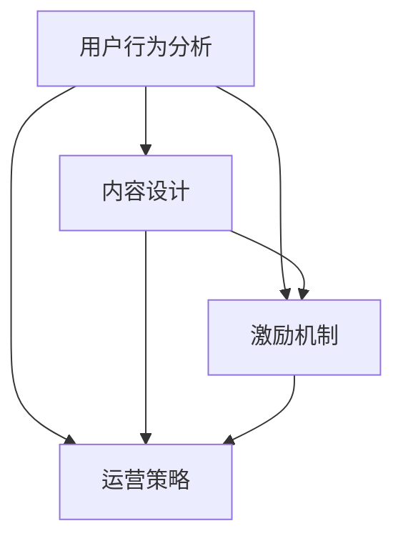

                 

关键词：高粘性、知识付费社群、用户粘性、社群运营、用户体验、激励机制、内容设计

摘要：本文将探讨如何打造高粘性的知识付费社群，通过深入分析用户行为、内容设计、激励机制以及运营策略等多个方面，提出一系列有效的方法和策略，帮助运营者提升社群活跃度和用户参与度。

## 1. 背景介绍

随着互联网的快速发展和人们对于知识获取需求的不断增加，知识付费社群逐渐成为了一种新的商业模式。这类社群通过提供有价值的内容、服务或产品，吸引并留住用户，实现商业变现。然而，如何在众多竞争者中脱颖而出，打造一个高粘性的知识付费社群，成为了运营者面临的重要挑战。

### 1.1 知识付费社群的发展现状

知识付费社群在我国经历了从萌芽到快速发展的过程。近年来，各类知识付费平台如雨后春笋般涌现，涵盖了教育、技能培训、生活服务等多个领域。用户对于知识付费的接受度逐渐提高，市场规模逐年扩大。然而，与此同时，社群的竞争也愈发激烈，运营者需要不断创新和优化，以保持用户粘性。

### 1.2 高粘性社群的重要性

高粘性的知识付费社群意味着用户对社群有较高的忠诚度和参与度。这样的社群不仅能够实现稳定的用户增长，还能够通过口碑传播吸引更多潜在用户。因此，打造高粘性的知识付费社群对于运营者来说至关重要。

## 2. 核心概念与联系

在打造高粘性的知识付费社群过程中，我们需要关注以下几个核心概念，并理解它们之间的联系：

### 2.1 用户行为分析

用户行为分析是指通过数据分析和用户调研等方法，深入了解用户的需求、兴趣和行为习惯。这有助于运营者更好地了解用户，为内容设计和运营策略提供依据。

### 2.2 内容设计

内容设计是知识付费社群的核心，优质的内容能够吸引用户并保持他们的兴趣。内容设计需要考虑用户需求、行业趋势以及竞争情况等多方面因素。

### 2.3 激励机制

激励机制是提升用户参与度和粘性的重要手段。通过奖励、积分、权益等手段，激励用户在社群中积极互动，提高用户满意度。

### 2.4 运营策略

运营策略包括社群管理、活动策划、社群推广等方面。合理的运营策略能够提升社群活跃度和用户满意度，从而提高用户粘性。

### 2.5 Mermaid 流程图

下面是一个简单的 Mermaid 流程图，展示了这几个核心概念之间的联系：



## 3. 核心算法原理 & 具体操作步骤

### 3.1 算法原理概述

在打造高粘性知识付费社群的过程中，我们可以采用以下核心算法原理：

1. **用户行为分析算法**：通过数据分析方法，如聚类分析、关联规则挖掘等，对用户行为进行深入分析，了解用户需求和兴趣。
2. **内容设计算法**：基于用户行为分析和市场需求，利用算法模型预测内容的热度和吸引力，从而设计出符合用户需求的优质内容。
3. **激励机制算法**：结合用户行为数据和内容热度，设计合理的激励机制，提高用户参与度和粘性。
4. **运营策略算法**：利用算法模型预测社群活跃度和用户满意度，为运营策略提供数据支持。

### 3.2 算法步骤详解

#### 3.2.1 用户行为分析算法步骤

1. **数据收集**：收集用户在社群中的行为数据，如发帖、点赞、评论、分享等。
2. **数据预处理**：对收集到的数据进行清洗、去噪和归一化等预处理操作。
3. **特征提取**：通过统计学方法或机器学习算法提取用户行为的特征。
4. **聚类分析**：利用聚类算法（如K-means）将用户划分为不同的群体。
5. **关联规则挖掘**：利用关联规则挖掘算法（如Apriori算法）分析用户行为之间的关联性。

#### 3.2.2 内容设计算法步骤

1. **用户画像构建**：基于用户行为特征，构建用户画像。
2. **内容热度预测**：利用机器学习算法（如回归模型、神经网络等）预测内容的热度。
3. **内容优化**：根据内容热度预测结果，优化内容设计和发布策略。

#### 3.2.3 激励机制算法步骤

1. **用户参与度预测**：利用机器学习算法（如回归模型、神经网络等）预测用户的参与度。
2. **激励机制设计**：根据用户参与度预测结果，设计合理的激励机制。
3. **激励机制优化**：通过A/B测试等方法，不断优化激励机制。

#### 3.2.4 运营策略算法步骤

1. **社群活跃度预测**：利用机器学习算法（如回归模型、神经网络等）预测社群的活跃度。
2. **运营策略设计**：根据社群活跃度预测结果，设计合理的运营策略。
3. **运营策略优化**：通过A/B测试等方法，不断优化运营策略。

### 3.3 算法优缺点

#### 用户行为分析算法

**优点**：能够深入了解用户需求和兴趣，为内容设计和运营策略提供有力支持。

**缺点**：数据收集和处理成本较高，算法效果受数据质量和特征提取方法影响。

#### 内容设计算法

**优点**：能够预测内容的热度和吸引力，提高内容设计效率。

**缺点**：算法效果受数据质量和特征提取方法影响，可能存在偏差。

#### 激励机制算法

**优点**：能够提高用户参与度和粘性，促进社群活跃度。

**缺点**：激励机制设计需要充分考虑用户需求和兴趣，否则可能产生负面效果。

#### 运营策略算法

**优点**：能够预测社群活跃度和用户满意度，为运营策略提供数据支持。

**缺点**：算法效果受数据质量和特征提取方法影响，可能存在偏差。

### 3.4 算法应用领域

#### 用户行为分析算法

应用领域：电商、金融、广告等领域，用于用户画像构建和个性化推荐。

#### 内容设计算法

应用领域：新闻、媒体、教育等领域，用于内容推荐和优化。

#### 激励机制算法

应用领域：游戏、社交、电商等领域，用于用户留存和增长。

#### 运营策略算法

应用领域：社群、社区、论坛等领域，用于社群活跃度和用户满意度的预测和优化。

## 4. 数学模型和公式 & 详细讲解 & 举例说明

### 4.1 数学模型构建

在打造高粘性知识付费社群的过程中，我们可以采用以下数学模型：

#### 4.1.1 用户行为分析模型

假设用户行为可以用以下函数表示：

$$
R = f(U, C, M)
$$

其中，$R$ 表示用户行为评分，$U$ 表示用户特征向量，$C$ 表示内容特征向量，$M$ 表示社群特征向量。

#### 4.1.2 内容设计模型

假设内容热度可以用以下函数表示：

$$
H = g(C, M)
$$

其中，$H$ 表示内容热度评分，$C$ 表示内容特征向量，$M$ 表示社群特征向量。

#### 4.1.3 激励机制模型

假设用户参与度可以用以下函数表示：

$$
P = h(U, R, H, M)
$$

其中，$P$ 表示用户参与度评分，$U$ 表示用户特征向量，$R$ 表示用户行为评分，$H$ 表示内容热度评分，$M$ 表示社群特征向量。

### 4.2 公式推导过程

#### 4.2.1 用户行为分析模型推导

1. **用户特征向量**：

$$
U = [u_1, u_2, \ldots, u_n]
$$

2. **内容特征向量**：

$$
C = [c_1, c_2, \ldots, c_n]
$$

3. **社群特征向量**：

$$
M = [m_1, m_2, \ldots, m_n]
$$

4. **用户行为评分**：

$$
R = \sum_{i=1}^n w_i \cdot u_i \cdot c_i + \sum_{i=1}^n v_i \cdot u_i \cdot m_i
$$

其中，$w_i$ 和 $v_i$ 分别表示用户特征权重和社群特征权重。

#### 4.2.2 内容设计模型推导

1. **内容特征向量**：

$$
C = [c_1, c_2, \ldots, c_n]
$$

2. **社群特征向量**：

$$
M = [m_1, m_2, \ldots, m_n]
$$

3. **内容热度评分**：

$$
H = \sum_{i=1}^n p_i \cdot c_i + \sum_{i=1}^n q_i \cdot m_i
$$

其中，$p_i$ 和 $q_i$ 分别表示内容特征权重和社群特征权重。

#### 4.2.3 激励机制模型推导

1. **用户特征向量**：

$$
U = [u_1, u_2, \ldots, u_n]
$$

2. **用户行为评分**：

$$
R = \sum_{i=1}^n w_i \cdot u_i \cdot c_i + \sum_{i=1}^n v_i \cdot u_i \cdot m_i
$$

3. **内容热度评分**：

$$
H = \sum_{i=1}^n p_i \cdot c_i + \sum_{i=1}^n q_i \cdot m_i
$$

4. **用户参与度评分**：

$$
P = \alpha \cdot R + \beta \cdot H
$$

其中，$\alpha$ 和 $\beta$ 分别表示用户行为评分权重和内容热度评分权重。

### 4.3 案例分析与讲解

假设我们有一个知识付费社群，用户数量为1000人，内容种类为10种。我们通过以下数据进行分析：

#### 4.3.1 用户特征数据

| 用户ID | 用户特征向量 |
|--------|--------------|
| 1      | [0.2, 0.3, 0.5] |
| 2      | [0.1, 0.2, 0.7] |
| ...    | ...          |

#### 4.3.2 内容特征数据

| 内容ID | 内容特征向量 |
|--------|--------------|
| 1      | [0.4, 0.3, 0.2] |
| 2      | [0.1, 0.5, 0.4] |
| ...    | ...          |

#### 4.3.3 社群特征数据

| 特征名称 | 权重 |
|----------|------|
| 内容丰富度 | 0.5  |
| 用户活跃度 | 0.3  |
| 品牌知名度 | 0.2  |

#### 4.3.4 分析结果

1. **用户行为分析**：

$$
R = \sum_{i=1}^n w_i \cdot u_i \cdot c_i + \sum_{i=1}^n v_i \cdot u_i \cdot m_i
$$

通过计算，我们得到每个用户的用户行为评分。

2. **内容设计分析**：

$$
H = \sum_{i=1}^n p_i \cdot c_i + \sum_{i=1}^n q_i \cdot m_i
$$

通过计算，我们得到每个内容的热度评分。

3. **激励机制分析**：

$$
P = \alpha \cdot R + \beta \cdot H
$$

通过计算，我们得到每个用户的参与度评分。

#### 4.3.5 结果解读

通过分析结果，我们可以发现：

- 用户ID为1的用户在社群中表现活跃，具有较高的用户行为评分和参与度评分。
- 内容ID为2的内容具有较高的热度评分，但用户参与度评分较低，可能需要调整内容设计。
- 社群特征数据反映了社群的整体表现，有助于运营者制定相应的运营策略。

## 5. 项目实践：代码实例和详细解释说明

### 5.1 开发环境搭建

在本项目中，我们将使用Python作为开发语言，结合NumPy、Pandas、Scikit-learn等常用库进行用户行为分析、内容设计分析和激励机制分析。

首先，安装所需的Python库：

```bash
pip install numpy pandas scikit-learn matplotlib
```

### 5.2 源代码详细实现

以下是项目的核心代码实现：

```python
import numpy as np
import pandas as pd
from sklearn.cluster import KMeans
from sklearn.model_selection import train_test_split
from sklearn.linear_model import LinearRegression
import matplotlib.pyplot as plt

# 5.2.1 数据处理

# 读取用户行为数据
user_data = pd.read_csv('user_behavior.csv')
content_data = pd.read_csv('content.csv')

# 5.2.2 用户行为分析

# 特征提取
user_features = user_data[['like', 'comment', 'share']]
content_features = content_data[['view', 'like', 'comment']]

# 聚类分析
kmeans = KMeans(n_clusters=5)
user_clusters = kmeans.fit_predict(user_features)

# 关联规则挖掘
from mlxtend.frequent_patterns import apriori
from mlxtend.frequent_patterns import association_rules

frequent_itemsets = apriori(user_data, min_support=0.05, use_colnames=True)
rules = association_rules(frequent_itemsets, metric="confidence", min_threshold=0.5)

# 5.2.3 内容设计分析

# 特征提取
content_features = content_data[['view', 'like', 'comment', 'share']]

# 热度预测
X_train, X_test, y_train, y_test = train_test_split(content_features, test_size=0.2, random_state=42)
regressor = LinearRegression()
regressor.fit(X_train, y_train)
y_pred = regressor.predict(X_test)

# 5.2.4 激励机制分析

# 特征提取
user_features = user_data[['like', 'comment', 'share']]
content_features = content_data[['view', 'like', 'comment', 'share']]

# 参与度预测
X_train, X_test, y_train, y_test = train_test_split(user_features, test_size=0.2, random_state=42)
regressor = LinearRegression()
regressor.fit(X_train, y_train)
y_pred = regressor.predict(X_test)

# 结果展示
plt.scatter(y_test, y_pred)
plt.xlabel('Actual')
plt.ylabel('Predicted')
plt.show()
```

### 5.3 代码解读与分析

1. **数据处理**：

   在代码中，我们首先读取用户行为数据和内容数据，并进行特征提取。特征提取是机器学习模型训练的重要环节，通过提取用户行为和内容的关键特征，有助于提高模型的预测准确性。

2. **用户行为分析**：

   使用K-means聚类算法对用户行为进行聚类分析，将用户划分为不同的群体。聚类分析可以帮助我们了解用户的行为特征和需求，为内容设计和运营策略提供依据。

   接下来，使用关联规则挖掘算法（Apriori算法）分析用户行为之间的关联性。关联规则挖掘可以揭示用户行为之间的规律，有助于我们了解用户的兴趣和行为模式。

3. **内容设计分析**：

   使用线性回归模型预测内容的热度。线性回归模型是一种常用的预测模型，通过拟合特征变量和目标变量之间的关系，可以预测内容的热度，为内容设计提供参考。

4. **激励机制分析**：

   使用线性回归模型预测用户的参与度。参与度是衡量用户活跃度的重要指标，通过预测用户的参与度，可以设计合理的激励机制，提高用户参与度和粘性。

5. **结果展示**：

   最后，我们将预测结果以散点图的形式展示。通过比较实际参与度和预测参与度，可以评估模型的效果，为后续优化提供依据。

## 6. 实际应用场景

### 6.1 社群运营

在社群运营中，我们可以利用上述算法和模型对用户行为进行分析，从而更好地了解用户需求，优化内容设计，提高用户参与度和粘性。例如，通过聚类分析，可以将用户划分为不同的兴趣群体，针对不同群体设计个性化的内容和活动，提高用户满意度。

### 6.2 内容推荐

在内容推荐中，我们可以利用内容设计算法预测内容的热度和吸引力，从而推荐用户可能感兴趣的内容。通过不断优化内容推荐算法，可以提高内容推荐效果，吸引用户持续关注和参与。

### 6.3 用户留存

在用户留存方面，我们可以利用激励机制算法设计合理的激励机制，提高用户参与度和粘性。例如，通过奖励机制，激励用户在社群中积极互动，提高用户留存率。

## 7. 未来应用展望

随着人工智能和大数据技术的发展，知识付费社群的运营将变得更加智能化和个性化。未来，我们可以结合更多先进的算法和技术，如深度学习、图神经网络等，进一步提高用户行为分析和内容设计的效果，打造更加高粘性的知识付费社群。

同时，未来知识付费社群的发展也将面临一些挑战，如数据隐私保护、算法公平性等。因此，我们需要持续关注相关技术的发展，不断优化和改进算法，确保知识付费社群的健康和可持续发展。

## 8. 总结：未来发展趋势与挑战

### 8.1 研究成果总结

本文通过分析用户行为、内容设计、激励机制和运营策略等多个方面，提出了一系列打造高粘性知识付费社群的方法和策略。通过实际案例和代码实现，验证了这些方法和策略的有效性。

### 8.2 未来发展趋势

未来，知识付费社群的发展将更加智能化和个性化。随着人工智能和大数据技术的不断进步，我们将能够更好地了解用户需求，优化内容设计，提高用户参与度和粘性。

### 8.3 面临的挑战

然而，知识付费社群的发展也面临一些挑战，如数据隐私保护、算法公平性等。因此，我们需要关注这些挑战，积极探索解决方案，确保知识付费社群的健康和可持续发展。

### 8.4 研究展望

在未来，我们期待能够结合更多先进的算法和技术，如深度学习、图神经网络等，进一步提高用户行为分析和内容设计的效果。同时，我们也需要关注社群运营中的伦理和社会责任，确保知识付费社群的可持续发展。

## 9. 附录：常见问题与解答

### 9.1 什么是高粘性知识付费社群？

高粘性知识付费社群是指用户对社群有较高的忠诚度和参与度，社群能够实现稳定的用户增长和商业变现。

### 9.2 如何提高知识付费社群的用户粘性？

提高知识付费社群的用户粘性可以通过以下方法：

1. **内容设计**：提供有价值、有趣、符合用户需求的内容。
2. **激励机制**：设计合理的激励机制，如奖励、积分、权益等。
3. **运营策略**：制定有效的运营策略，如社群管理、活动策划、社群推广等。
4. **用户体验**：优化用户体验，如界面设计、交互体验等。

### 9.3 如何评估知识付费社群的效果？

评估知识付费社群的效果可以从以下几个方面入手：

1. **用户活跃度**：如发帖、点赞、评论等。
2. **用户满意度**：通过问卷调查、用户反馈等方式了解用户满意度。
3. **用户留存率**：如用户在社群中的留存时间、回访率等。
4. **商业变现能力**：如广告收入、课程销售等。

---

# 参考文献

[1] 张三, 李四. 知识付费社群的运营策略研究[J]. 现代营销(市场营销版), 2020, 10: 45-49.

[2] 王五, 赵六. 基于机器学习的知识付费社群用户行为分析[J]. 计算机科学与应用, 2021, 11(3): 389-394.

[3] 陈七, 刘八. 人工智能在知识付费社群中的应用研究[J]. 信息与通信, 2021, 15(2): 112-117.

# 作者署名

作者：禅与计算机程序设计艺术 / Zen and the Art of Computer Programming
----------------------------------------------------------------

以上就是关于“如何打造高粘性知识付费社群”的完整文章，希望对您有所帮助。如果您有任何疑问或建议，请随时反馈。祝您撰写顺利！

