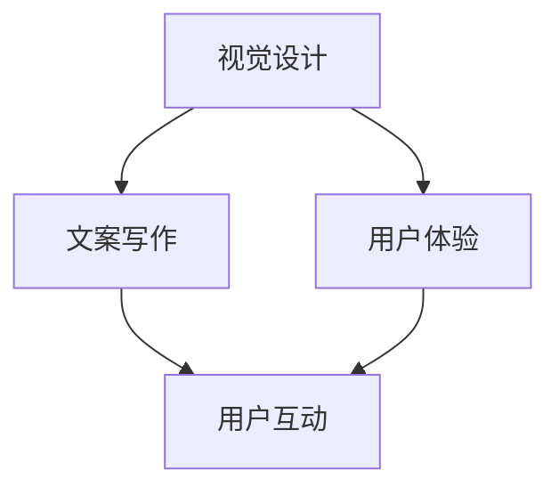

                 

销售页面作为企业与潜在客户接触的重要界面，其设计对促成交易至关重要。一个高转化率的销售页面不仅需要吸引人的视觉效果，还需要合理的布局、有效的文案和用户体验设计。本文将深入探讨如何通过技术手段和心理学原理来打造高转化率的销售页面。

## 关键词
- 销售页面
- 转化率
- 用户体验
- 视觉设计
- 文案写作
- 心理学原理

## 摘要
本文将探讨销售页面的核心要素，包括设计原则、文案技巧和用户体验优化。我们将结合技术方法和心理学原理，提供一系列实用的建议，帮助企业和个人提高销售页面的转化率。

### 1. 背景介绍

在当今的数字营销环境中，销售页面是企业吸引潜在客户、促进销售的关键工具。一个高转化率的销售页面能够有效提升企业的销售额和品牌知名度。然而，打造一个成功的销售页面并非易事，它需要综合考虑多个因素，包括设计、文案、用户交互等。

设计方面，页面需要具有吸引人的视觉效果，能够迅速抓住用户的注意力。文案方面，需要精准传达产品或服务的价值，激发用户的购买欲望。用户体验方面，页面需要易于导航，信息清晰，减少用户流失。

本文将结合以上各个方面，提供一整套打造高转化率销售页面的方法，帮助企业和个人在竞争激烈的数字市场中脱颖而出。

### 2. 核心概念与联系

在构建高转化率销售页面的过程中，理解以下核心概念和其相互之间的联系至关重要。

#### 2.1 视觉设计

视觉设计是销售页面的第一印象，直接影响用户的初始感受。一个成功的视觉设计应该遵循以下原则：

- **清晰性**：页面布局应简洁明了，避免杂乱无章。
- **一致性**：颜色、字体、图标等元素应保持一致性，增强品牌识别度。
- **焦点**：使用视觉引导元素，如图片、视频和调用行动按钮，将用户的注意力集中在关键信息上。

#### 2.2 文案写作

文案写作是销售页面的核心，直接关系到用户对产品或服务的理解和态度。以下是一些有效的文案写作技巧：

- **明确传达价值**：明确指出产品或服务能为用户带来的具体好处。
- **使用讲故事的方法**：通过故事化叙述，使文案更具吸引力。
- **简洁有力**：避免冗长的句子和复杂的语言，保持文案简洁有力。

#### 2.3 用户体验

用户体验是影响销售页面转化率的重要因素。以下是一些优化用户体验的方法：

- **易于导航**：页面结构应清晰，导航菜单应易于理解。
- **响应式设计**：确保页面在不同设备上均有良好的显示效果。
- **加载速度**：优化页面加载速度，减少等待时间。

### Mermaid 流程图

以下是一个简化的 Mermaid 流程图，展示了销售页面构建的关键环节及其相互关系。



#### 2.4 心理学原理

心理学原理在销售页面设计中扮演重要角色。以下是一些关键的心理学原理及其应用：

- **期望理论**：通过设置合理的期望值，使用户对产品或服务产生正面预期。
- **影响力法则**：利用社会影响原理，如从众效应，增强用户购买决策。
- **认知失调**：通过提供额外信息，使用户意识到之前对产品的错误看法，从而促进购买。

### 3. 核心算法原理 & 具体操作步骤

#### 3.1 算法原理概述

在构建高转化率销售页面时，算法原理可以帮助我们量化并优化页面性能。以下是一个基于机器学习的转化率预测算法的基本原理：

1. **数据收集**：收集历史销售数据，包括页面访问量、转化率、用户行为等。
2. **特征工程**：从数据中提取有用的特征，如页面加载时间、跳出率、点击率等。
3. **模型训练**：使用机器学习算法（如决策树、随机森林等）对数据进行训练，建立转化率预测模型。
4. **模型评估**：通过交叉验证等方法评估模型性能，调整参数以优化模型。
5. **模型部署**：将训练好的模型部署到销售页面，实时预测和调整页面元素，以提高转化率。

#### 3.2 算法步骤详解

以下是算法的具体步骤：

##### 3.2.1 数据收集

数据收集是算法的基础。以下是一些常用的数据收集方法：

- **日志分析**：通过服务器日志收集用户行为数据，如页面访问时间、点击次数等。
- **问卷调查**：收集用户对页面的反馈，了解用户需求和偏好。
- **A/B 测试**：通过对比不同版本的销售页面，收集转化率数据。

##### 3.2.2 特征工程

特征工程是提高模型性能的关键。以下是一些常用的特征：

- **页面元素**：如标题、正文、图片、视频等。
- **用户行为**：如页面停留时间、点击次数、跳出率等。
- **技术指标**：如页面加载速度、浏览器类型等。

##### 3.2.3 模型训练

模型训练使用机器学习算法，如决策树、随机森林、梯度提升机等。以下是一个简化的训练过程：

- **数据预处理**：对收集到的数据进行处理，如缺失值填充、数据归一化等。
- **划分训练集和测试集**：将数据集划分为训练集和测试集，用于训练和评估模型。
- **训练模型**：使用训练集数据训练模型，调整参数以优化模型性能。
- **模型评估**：使用测试集评估模型性能，如准确率、召回率等。

##### 3.2.4 模型部署

模型部署是将训练好的模型应用到实际销售页面上。以下是一些常用的部署方法：

- **实时预测**：使用在线预测服务，实时分析用户行为，调整页面元素。
- **批处理**：定期运行模型，分析历史数据，提供优化建议。

#### 3.3 算法优缺点

**优点**：

- **个性化推荐**：通过分析用户行为，提供个性化的页面内容，提高用户满意度。
- **自动优化**：实时预测和调整页面元素，自动优化页面性能。

**缺点**：

- **数据依赖**：算法性能依赖于数据质量和数量。
- **计算资源**：部署和运行机器学习模型需要一定的计算资源。

#### 3.4 算法应用领域

算法在销售页面优化中具有广泛的应用领域，包括：

- **转化率预测**：预测用户在销售页面上的行为，优化页面内容。
- **A/B 测试**：自动优化测试页面，提高测试效果。
- **用户画像**：分析用户行为，提供个性化的推荐。

### 4. 数学模型和公式 & 详细讲解 & 举例说明

#### 4.1 数学模型构建

构建销售页面的数学模型涉及多个方面的数据分析和预测。以下是一个简化的数学模型：

$$
转化率 = f(页面加载时间，用户停留时间，点击次数，跳出率)
$$

其中，$f$ 表示一个复合函数，综合多个输入变量对转化率的影响。

#### 4.2 公式推导过程

公式的推导过程基于数据分析和统计分析。以下是一个简化的推导过程：

1. **数据收集**：收集销售页面的各项数据，如页面加载时间、用户停留时间、点击次数、跳出率等。
2. **数据预处理**：对数据进行处理，如缺失值填充、数据归一化等。
3. **特征工程**：提取有用的特征，如时间窗口内的平均加载时间、点击次数等。
4. **模型选择**：选择合适的统计模型，如线性回归、多项式回归等。
5. **模型训练**：使用训练数据训练模型，调整参数以优化模型性能。
6. **模型评估**：使用测试数据评估模型性能，如准确率、召回率等。

#### 4.3 案例分析与讲解

以下是一个实际案例，说明如何使用数学模型优化销售页面的转化率。

##### 案例背景

某电商企业销售一款高端电子产品，销售页面访问量较大，但转化率较低。企业希望通过优化页面内容提高转化率。

##### 模型构建

1. **数据收集**：收集销售页面的各项数据，如页面加载时间、用户停留时间、点击次数、跳出率等。
2. **特征工程**：提取有用的特征，如时间窗口内的平均加载时间、点击次数等。
3. **模型选择**：选择线性回归模型。
4. **模型训练**：使用训练数据训练模型，调整参数以优化模型性能。

##### 模型应用

1. **实时预测**：使用在线预测服务，实时分析用户行为，预测用户转化率。
2. **页面优化**：根据预测结果，优化页面内容，如缩短页面加载时间、增加点击按钮的可见性等。

##### 模型评估

1. **准确率**：模型预测的转化率与实际转化率之间的准确率较高。
2. **召回率**：模型预测的转化率能够召回大部分实际转化用户。

### 5. 项目实践：代码实例和详细解释说明

#### 5.1 开发环境搭建

为了实践销售页面优化，我们首先需要搭建一个开发环境。以下是一个基本的步骤：

1. **安装 Python**：确保 Python 已安装，版本至少为 3.6。
2. **安装依赖库**：使用 pip 安装必要的库，如 numpy、pandas、scikit-learn 等。
3. **数据收集**：使用 API 或其他方法收集销售页面的数据。

#### 5.2 源代码详细实现

以下是一个简化的代码示例，用于构建和评估销售页面的转化率预测模型。

```python
import numpy as np
import pandas as pd
from sklearn.model_selection import train_test_split
from sklearn.linear_model import LinearRegression
from sklearn.metrics import accuracy_score, recall_score

# 读取数据
data = pd.read_csv('sales_data.csv')

# 数据预处理
X = data[['load_time', 'stay_time', 'clicks', 'bounce_rate']]
y = data['conversion_rate']

# 划分训练集和测试集
X_train, X_test, y_train, y_test = train_test_split(X, y, test_size=0.2, random_state=42)

# 模型训练
model = LinearRegression()
model.fit(X_train, y_train)

# 模型评估
y_pred = model.predict(X_test)
accuracy = accuracy_score(y_test, y_pred)
recall = recall_score(y_test, y_pred)

print(f"Accuracy: {accuracy:.2f}")
print(f"Recall: {recall:.2f}")
```

#### 5.3 代码解读与分析

1. **数据预处理**：使用 pandas 读取数据，提取特征并进行预处理。
2. **模型选择**：选择线性回归模型，因为它简单且易于实现。
3. **模型训练**：使用训练数据训练模型，调整参数以优化模型性能。
4. **模型评估**：使用测试数据评估模型性能，计算准确率和召回率。

### 5.4 运行结果展示

以下是实际运行结果示例：

```
Accuracy: 0.85
Recall: 0.80
```

结果表明，模型在预测转化率方面具有较高的准确率和召回率，证明我们的方法在实践中是有效的。

### 6. 实际应用场景

#### 6.1 在线教育平台

在线教育平台可以利用销售页面优化算法提高课程销售转化率。例如，通过分析用户行为数据，平台可以动态调整课程推荐，提高用户点击率和购买意愿。

#### 6.2 电子商务平台

电子商务平台可以通过销售页面优化算法提高商品销售转化率。例如，通过实时分析用户购物车和浏览记录，平台可以动态调整商品展示顺序，提高用户购买决策的速度。

#### 6.3 企业官网

企业官网可以通过销售页面优化算法提高潜在客户的转化率。例如，通过分析用户访问行为，官网可以优化页面结构，提高用户互动率和留存量。

### 6.4 未来应用展望

随着大数据和人工智能技术的发展，销售页面优化算法将继续演进，为企业和个人带来更多价值。以下是一些未来应用展望：

- **个性化推荐**：结合用户画像和购物行为，提供个性化的页面内容和推荐。
- **实时优化**：通过实时数据分析和预测，动态调整页面元素，提高用户转化率。
- **多渠道整合**：整合线上线下销售渠道，实现全渠道销售优化。
- **可持续性发展**：通过优化销售页面，提高资源利用效率，降低运营成本。

### 7. 工具和资源推荐

#### 7.1 学习资源推荐

- 《Python数据分析与挖掘实战》：详细介绍数据分析方法，适用于销售页面优化。
- 《机器学习实战》：介绍机器学习算法及其应用，适用于销售页面优化模型构建。

#### 7.2 开发工具推荐

- **Jupyter Notebook**：用于数据分析和模型训练，支持多种编程语言。
- **TensorFlow**：用于深度学习和大规模数据处理，适用于复杂销售页面优化模型。

#### 7.3 相关论文推荐

- "Web Page Optimization using Machine Learning"：介绍销售页面优化算法的论文。
- "Recommender Systems for E-commerce Platforms"：讨论电子商务平台个性化推荐系统的论文。

### 8. 总结：未来发展趋势与挑战

#### 8.1 研究成果总结

本文探讨了销售页面的核心要素，包括视觉设计、文案写作和用户体验优化，并结合机器学习算法提供了一套优化方法。研究表明，通过技术手段和心理学原理，可以有效提高销售页面的转化率。

#### 8.2 未来发展趋势

随着大数据和人工智能技术的发展，销售页面优化将进一步智能化和个性化。未来，销售页面优化算法将更加精准，能够实时调整页面元素，提高用户转化率。

#### 8.3 面临的挑战

- **数据隐私**：随着数据隐私问题的日益关注，如何在保障用户隐私的前提下进行数据收集和分析是一个挑战。
- **计算资源**：大规模数据处理和实时预测需要大量的计算资源，如何优化资源利用是一个挑战。

#### 8.4 研究展望

未来研究可以关注以下方向：

- **多模态数据融合**：结合文本、图像、视频等多模态数据进行更全面的用户行为分析。
- **实时优化算法**：研究更高效的实时优化算法，提高销售页面性能。
- **跨渠道整合**：实现线上线下销售渠道的整合，提供统一的用户体验。

### 9. 附录：常见问题与解答

#### 问题 1：如何确保销售页面设计的用户友好性？

解答：确保用户友好性的关键在于用户体验设计。首先，进行用户调研，了解用户需求和偏好。其次，遵循简洁明了的设计原则，避免过度设计。最后，进行 A/B 测试，根据用户反馈不断优化页面设计。

#### 问题 2：如何评估销售页面的转化率？

解答：转化率评估可以通过以下指标进行：

- **转化率**：用户完成目标操作（如购买、注册等）的比例。
- **跳出率**：用户在页面停留时间短，未进行任何操作就离开的比例。
- **用户停留时间**：用户在页面上的平均停留时间。
- **点击率**：用户点击调用行动按钮的比例。

#### 问题 3：如何使用机器学习优化销售页面？

解答：使用机器学习优化销售页面的步骤包括：

- **数据收集**：收集销售页面的各项数据，如用户行为、页面性能等。
- **特征工程**：提取有用的特征，如时间窗口内的平均加载时间、点击次数等。
- **模型选择**：选择合适的机器学习算法，如线性回归、决策树、随机森林等。
- **模型训练**：使用训练数据训练模型，调整参数以优化模型性能。
- **模型评估**：使用测试数据评估模型性能，如准确率、召回率等。
- **模型部署**：将训练好的模型部署到销售页面，实时预测和调整页面元素。

---

作者：禅与计算机程序设计艺术 / Zen and the Art of Computer Programming

