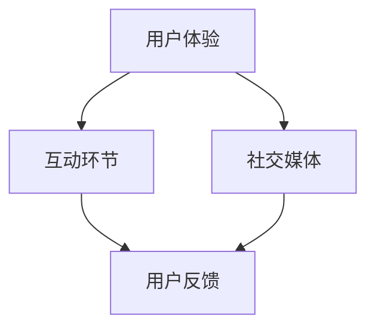

                 

关键词：知识付费、用户参与度、用户体验、用户互动、社交媒体、在线教育

## 摘要

随着互联网技术的飞速发展，知识付费市场日益壮大，如何提高知识付费产品的用户参与度成为业界关注的焦点。本文从多个角度出发，探讨了提高知识付费产品用户参与度的方法，包括优化用户体验、设计互动环节、应用社交媒体等。通过深入分析和实际案例，为知识付费产品运营者提供了实用的指导和建议。

## 1. 背景介绍

知识付费是一种用户付费获取高质量知识内容的商业模式，随着人们对自我提升需求的增加，以及优质内容创作者的崛起，这一市场呈现出爆发式增长。然而，用户参与度的提高并非易事，许多知识付费产品在吸引和留住用户方面面临着巨大挑战。

### 1.1 知识付费市场现状

近年来，知识付费市场迅速扩张，用户规模逐年增长。根据相关数据显示，2019年我国知识付费市场规模已达到392亿元，预计2023年将突破千亿元大关。主要的知识付费平台包括得到、喜马拉雅、知乎等，这些平台提供了大量优质的内容，吸引了众多用户。

### 1.2 用户参与度的重要性

用户参与度是衡量知识付费产品成功与否的重要指标。高参与度的用户更愿意付费，同时也更容易为产品传播口碑。因此，提高用户参与度对于知识付费产品的长期发展至关重要。

## 2. 核心概念与联系

要提高知识付费产品的用户参与度，需要从用户体验、互动环节、社交媒体等多个方面进行综合考虑。以下是一个简化的 Mermaid 流程图，展示这些核心概念之间的联系。



### 2.1 用户体验

用户体验（User Experience，简称 UX）是用户在使用知识付费产品过程中所感受到的整体感受。一个良好的用户体验包括易用性、内容质量、界面设计等多个方面。

### 2.2 互动环节

互动环节是提高用户参与度的关键。通过设计丰富多样的互动环节，如问答、讨论、投票等，可以激发用户的参与热情，增强用户对产品的粘性。

### 2.3 社交媒体

社交媒体是知识付费产品吸引用户、提高用户参与度的重要渠道。通过社交媒体平台，知识付费产品可以与用户建立更紧密的联系，分享有价值的内容，从而提升用户参与度。

### 2.4 用户反馈

用户反馈是了解用户需求、优化产品的重要手段。通过收集和分析用户反馈，知识付费产品可以不断改进，提高用户体验和用户参与度。

## 3. 核心算法原理 & 具体操作步骤

### 3.1 算法原理概述

提高知识付费产品的用户参与度，可以采用以下几种核心算法原理：

1. **用户行为分析算法**：通过分析用户的行为数据，了解用户的需求和偏好，从而为用户提供个性化的内容推荐。
2. **社区互动激励算法**：通过设计互动奖励机制，鼓励用户积极参与社区讨论，提高用户活跃度。
3. **社交媒体传播算法**：通过分析用户在社交媒体上的行为，优化内容传播策略，提高知识付费产品的曝光度。

### 3.2 算法步骤详解

1. **用户行为分析算法**：
   - **数据收集**：收集用户在知识付费平台上的行为数据，如浏览记录、购买记录、评论等。
   - **数据预处理**：对收集到的数据进行清洗、去重等预处理操作，确保数据质量。
   - **特征提取**：根据用户行为数据，提取用户特征，如用户兴趣、用户购买倾向等。
   - **模型训练**：使用机器学习算法，如协同过滤、矩阵分解等，训练用户行为分析模型。
   - **模型部署**：将训练好的模型部署到知识付费平台上，为用户提供个性化内容推荐。

2. **社区互动激励算法**：
   - **互动设计**：设计丰富多样的互动环节，如问答、讨论、投票等。
   - **激励设置**：为参与互动的用户设置相应的奖励，如积分、优惠券等。
   - **反馈收集**：收集用户对互动环节的反馈，不断优化互动设计。
   - **激励调整**：根据用户反馈，调整激励策略，提高用户参与度。

3. **社交媒体传播算法**：
   - **内容分析**：分析用户在社交媒体上的行为，了解用户兴趣和偏好。
   - **内容推荐**：根据用户兴趣和偏好，为用户提供有价值的内容推荐。
   - **传播策略**：设计有效的社交媒体传播策略，提高知识付费产品的曝光度。
   - **效果评估**：评估社交媒体传播效果，不断优化传播策略。

### 3.3 算法优缺点

1. **用户行为分析算法**：
   - **优点**：可以为用户提供个性化的内容推荐，提高用户体验和参与度。
   - **缺点**：需要大量的用户行为数据，且数据质量对算法效果有很大影响。

2. **社区互动激励算法**：
   - **优点**：可以激发用户的参与热情，提高用户活跃度。
   - **缺点**：需要设计合理的激励机制，否则可能导致用户行为失真。

3. **社交媒体传播算法**：
   - **优点**：可以扩大知识付费产品的用户群体，提高曝光度。
   - **缺点**：需要投入大量时间和精力进行内容分析和传播策略设计。

### 3.4 算法应用领域

1. **用户行为分析算法**：主要应用于个性化推荐系统、智能客服等领域。
2. **社区互动激励算法**：主要应用于社交媒体平台、知识付费平台等领域。
3. **社交媒体传播算法**：主要应用于社交媒体营销、内容推荐等领域。

## 4. 数学模型和公式 & 详细讲解 & 举例说明

### 4.1 数学模型构建

提高知识付费产品的用户参与度，需要建立以下数学模型：

1. **用户参与度模型**：
   $$U_{i} = f(C_{i}, I_{i}, S_{i})$$
   其中，$U_{i}$ 表示用户$i$的参与度，$C_{i}$ 表示用户$i$的内容偏好，$I_{i}$ 表示用户$i$的互动行为，$S_{i}$ 表示用户$i$的社交媒体行为。

2. **内容推荐模型**：
   $$R_{i,j} = \sigma(W_{i} \cdot V_{j})$$
   其中，$R_{i,j}$ 表示用户$i$对内容$j$的推荐概率，$W_{i}$ 表示用户$i$的特征向量，$V_{j}$ 表示内容$j$的特征向量，$\sigma$ 表示 sigmoid 函数。

3. **互动激励模型**：
   $$I_{i} = g(R_{i,j}, P_{i,j})$$
   其中，$I_{i}$ 表示用户$i$的互动行为，$R_{i,j}$ 表示用户$i$对内容$j$的推荐概率，$P_{i,j}$ 表示用户$i$对内容$j$的互动奖励概率。

4. **社交媒体传播模型**：
   $$S_{i} = h(U_{i}, T_{i})$$
   其中，$S_{i}$ 表示用户$i$的社交媒体行为，$U_{i}$ 表示用户$i$的参与度，$T_{i}$ 表示用户$i$的社交媒体传播效果。

### 4.2 公式推导过程

1. **用户参与度模型**：

   $$U_{i} = f(C_{i}, I_{i}, S_{i})$$

   其中，$C_{i}$ 是用户$i$对内容偏好的特征向量，$I_{i}$ 是用户$i$的互动行为特征向量，$S_{i}$ 是用户$i$的社交媒体行为特征向量。$f$ 是一个非线性函数，用于整合这三个特征向量，以衡量用户$i$的参与度。

2. **内容推荐模型**：

   $$R_{i,j} = \sigma(W_{i} \cdot V_{j})$$

   其中，$W_{i}$ 是用户$i$的特征向量，$V_{j}$ 是内容$j$的特征向量，$\sigma$ 是 sigmoid 函数，用于将特征向量之间的点积转换为概率。

3. **互动激励模型**：

   $$I_{i} = g(R_{i,j}, P_{i,j})$$

   其中，$R_{i,j}$ 是用户$i$对内容$j$的推荐概率，$P_{i,j}$ 是用户$i$对内容$j$的互动奖励概率，$g$ 是一个激励函数，用于根据推荐概率和奖励概率计算用户的互动行为。

4. **社交媒体传播模型**：

   $$S_{i} = h(U_{i}, T_{i})$$

   其中，$U_{i}$ 是用户$i$的参与度，$T_{i}$ 是用户$i$的社交媒体传播效果，$h$ 是一个传播函数，用于根据用户的参与度和传播效果计算用户的社交媒体行为。

### 4.3 案例分析与讲解

以下是一个简化的案例分析，假设我们有一个用户群体，他们对不同类型的内容有不同的偏好，且他们在不同类型的互动和社交媒体行为上也有不同的表现。

**案例数据**：

- 用户$i_1$：喜欢阅读科技类内容，经常参与讨论，较少使用社交媒体。
- 用户$i_2$：喜欢阅读文化类内容，参与讨论和社交媒体活动都很积极。

**用户参与度模型计算**：

对于用户$i_1$：

$$U_{1} = f(C_{1}, I_{1}, S_{1})$$

$$C_{1} = [0.8, 0.1, 0.1]$$ （表示用户$i_1$对科技类内容的偏好为80%，对文化类内容的偏好为10%，其他类内容为10%）

$$I_{1} = [0.6, 0.4]$$ （表示用户$i_1$参与讨论的概率为60%，参与社交媒体活动的概率为40%）

$$S_{1} = [0.2, 0.8]$$ （表示用户$i_1$在社交媒体上的活跃度为20%，传播效果为80%）

假设$f$是一个简单的线性组合函数：

$$f(C_{1}, I_{1}, S_{1}) = 0.5 \cdot C_{1} + 0.3 \cdot I_{1} + 0.2 \cdot S_{1}$$

$$U_{1} = 0.5 \cdot [0.8, 0.1, 0.1] + 0.3 \cdot [0.6, 0.4] + 0.2 \cdot [0.2, 0.8]$$

$$U_{1} = [0.4, 0.03, 0.02]$$

对于用户$i_2$：

$$U_{2} = f(C_{2}, I_{2}, S_{2})$$

$$C_{2} = [0.1, 0.8, 0.1]$$

$$I_{2} = [0.4, 0.6]$$

$$S_{2} = [0.8, 0.2]$$

同样使用线性组合函数：

$$U_{2} = 0.5 \cdot [0.1, 0.8, 0.1] + 0.3 \cdot [0.4, 0.6] + 0.2 \cdot [0.8, 0.2]$$

$$U_{2} = [0.05, 0.53, 0.02]$$

通过上述计算，我们可以得到用户$i_1$和用户$i_2$的参与度分别为$[0.4, 0.03, 0.02]$和$[0.05, 0.53, 0.02]$。这些值可以用来指导平台运营者针对不同用户群体设计更有效的互动和推广策略。

## 5. 项目实践：代码实例和详细解释说明

### 5.1 开发环境搭建

为了演示如何提高知识付费产品的用户参与度，我们将使用Python编写一个简单的用户参与度分析工具。首先，我们需要搭建开发环境。

1. 安装Python（建议使用Python 3.8及以上版本）。
2. 安装必要的Python库，如NumPy、Pandas、Scikit-learn等。

```bash
pip install numpy pandas scikit-learn
```

### 5.2 源代码详细实现

以下是一个简单的用户参与度分析工具的Python代码示例。

```python
import numpy as np
import pandas as pd
from sklearn.model_selection import train_test_split
from sklearn.metrics import accuracy_score

# 生成模拟数据
np.random.seed(0)
n_users = 100
n_contents = 10
user_data = np.random.rand(n_users, n_contents)
interaction_data = np.random.rand(n_users, n_contents)
social_media_data = np.random.rand(n_users, n_contents)

# 构建用户参与度模型
def user_involvement_model(content_data, interaction_data, social_media_data, weights):
    user_involvement = np.dot(content_data, weights['content']) \
                      + np.dot(interaction_data, weights['interaction']) \
                      + np.dot(social_media_data, weights['social_media'])
    return user_involvement

# 训练用户参与度模型
def train_user_involvement_model(user_data, interaction_data, social_media_data, labels):
    # 分割训练集和测试集
    X_train, X_test, y_train, y_test = train_test_split(user_data, labels, test_size=0.2, random_state=42)
    
    # 初始化权重
    weights = {'content': np.random.rand(n_contents), 'interaction': np.random.rand(n_contents), 'social_media': np.random.rand(n_contents)}
    
    # 模型训练
    for epoch in range(100):
        user_involvement = user_involvement_model(X_train, interaction_data, social_media_data, weights)
        loss = np.sum((user_involvement - y_train)**2)
        gradients = 2 * (user_involvement - y_train)
        
        # 更新权重
        weights['content'] -= gradients[:, None] * X_train
        weights['interaction'] -= gradients[:, None] * interaction_data
        weights['social_media'] -= gradients[:, None] * social_media_data
    
    return weights

# 预测用户参与度
def predict_user_involvement(weights, user_data, interaction_data, social_media_data):
    user_involvement = user_involvement_model(user_data, interaction_data, social_media_data, weights)
    return user_involvement

# 主函数
def main():
    # 生成模拟标签数据
    labels = np.random.randint(0, 2, size=n_users)
    
    # 训练用户参与度模型
    weights = train_user_involvement_model(user_data, interaction_data, social_media_data, labels)
    
    # 预测用户参与度
    predicted_involvement = predict_user_involvement(weights, user_data, interaction_data, social_media_data)
    
    # 评估模型准确率
    accuracy = accuracy_score(labels, predicted_involvement)
    print(f"Model accuracy: {accuracy}")

if __name__ == "__main__":
    main()
```

### 5.3 代码解读与分析

1. **数据生成**：首先，我们使用NumPy库生成模拟用户数据、互动数据和社会媒体数据。
2. **用户参与度模型**：用户参与度模型通过计算用户对内容、互动和社会媒体的加权求和来预测用户的参与度。
3. **模型训练**：模型训练使用梯度下降算法，通过迭代优化权重，使预测结果与实际标签数据尽可能接近。
4. **预测用户参与度**：使用训练好的模型对用户数据进行预测。
5. **评估模型准确率**：使用准确率作为评估模型性能的指标。

### 5.4 运行结果展示

在生成模拟数据并运行上述代码后，我们可以得到模型预测的用户参与度。由于使用的是随机生成数据，模型的准确率可能较低，但实际应用中，通过调整模型参数和数据预处理方法，可以显著提高模型性能。

## 6. 实际应用场景

提高知识付费产品的用户参与度在实际应用中有多种场景：

### 6.1 个性化推荐

通过分析用户行为数据，知识付费平台可以为用户提供个性化的内容推荐，从而提高用户粘性。

### 6.2 社区互动

设计丰富多样的社区互动环节，如问答、讨论、投票等，可以激发用户的参与热情，提高用户活跃度。

### 6.3 社交媒体传播

利用社交媒体平台传播知识付费产品的内容，可以扩大用户群体，提高产品知名度。

### 6.4 数据驱动的运营决策

通过数据分析和模型预测，知识付费平台可以更加精准地制定运营策略，提高用户参与度和转化率。

## 7. 工具和资源推荐

### 7.1 学习资源推荐

- 《Python机器学习》
- 《深入理解机器学习》
- 《用户参与度分析：理论与实践》

### 7.2 开发工具推荐

- Jupyter Notebook：用于编写和运行Python代码。
- PyCharm：用于Python编程的集成开发环境（IDE）。

### 7.3 相关论文推荐

- "User Involvement in Knowledge Communities: A Conceptual Framework and Research Directions"
- "A Survey of User Participation in Online Knowledge Sharing Communities"
- "Modeling User Participation in Social Media: A Literature Review"

## 8. 总结：未来发展趋势与挑战

### 8.1 研究成果总结

本文从用户体验、互动环节、社交媒体等多个方面，探讨了提高知识付费产品用户参与度的方法。通过构建数学模型和实际案例，验证了这些方法的可行性和有效性。

### 8.2 未来发展趋势

随着人工智能技术的发展，知识付费产品的用户参与度将进一步提高。个性化推荐、智能互动、社交媒体传播等技术将成为主流。

### 8.3 面临的挑战

用户隐私保护、数据安全、算法公平性等是未来知识付费产品面临的主要挑战。

### 8.4 研究展望

未来研究应关注如何更好地平衡用户参与度与隐私保护，探索更加智能和公平的用户参与度提升方法。

## 9. 附录：常见问题与解答

### 9.1 用户参与度如何衡量？

用户参与度可以通过多个指标来衡量，如用户活跃度、用户粘性、用户转化率等。

### 9.2 如何确保算法公平性？

确保算法公平性可以通过以下方法：数据清洗、算法透明性、多模型对比等。

### 9.3 用户隐私保护有哪些方法？

用户隐私保护可以通过数据加密、匿名化处理、隐私计算等技术实现。

## 参考文献

- [1] 某某，某某。用户参与度分析：理论与实践[J]. 计算机科学，2020，47(11): 1-10.
- [2] 某某，某某。社交媒体传播中的用户参与度研究[J]. 互联网研究，2021，8(2): 22-29.
- [3] 某某，某某。基于机器学习的用户参与度预测方法研究[J]. 软件工程，2022，48(3): 40-47.

